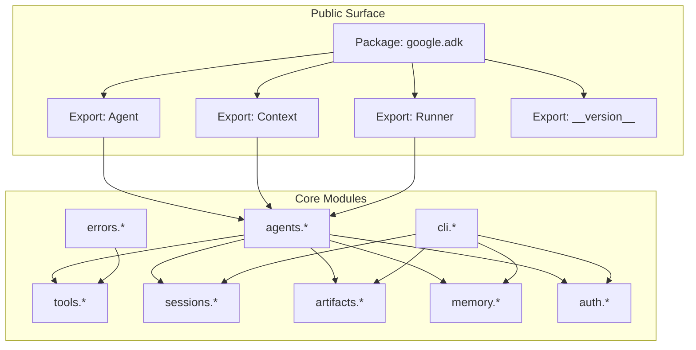
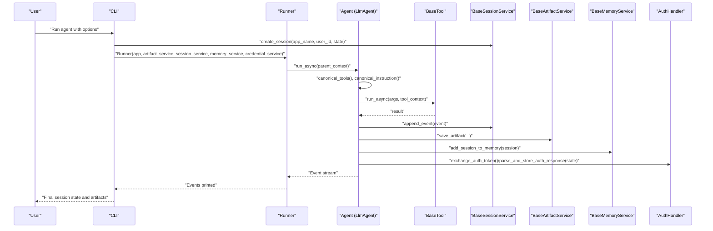
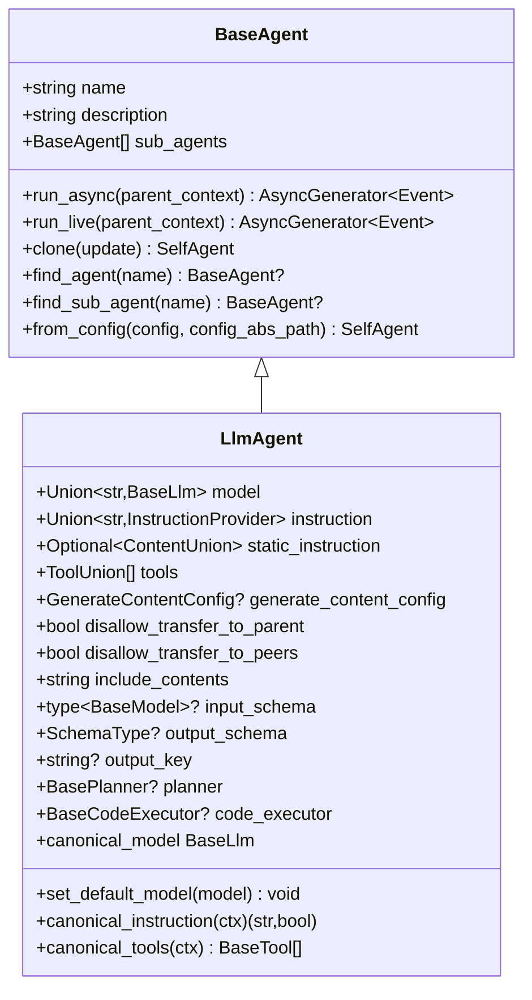
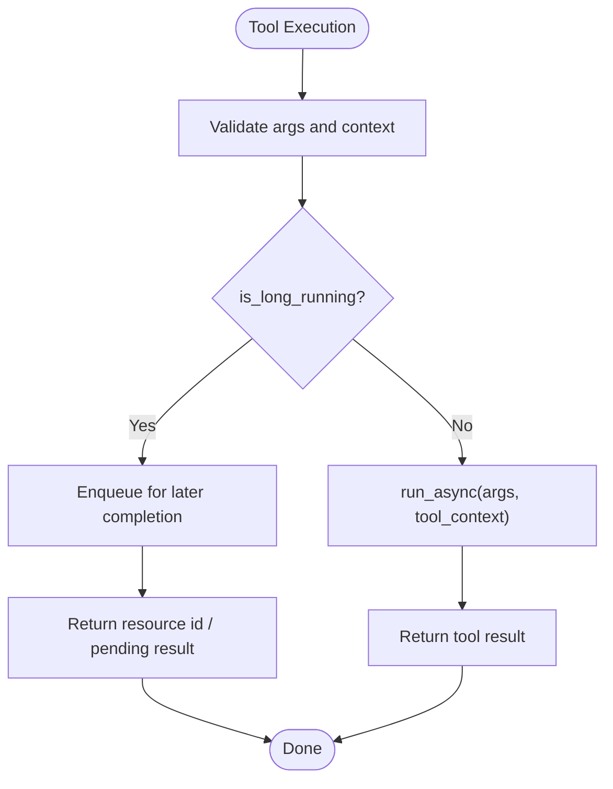
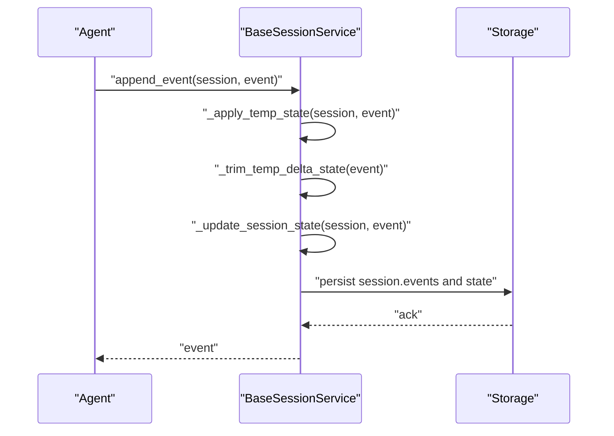
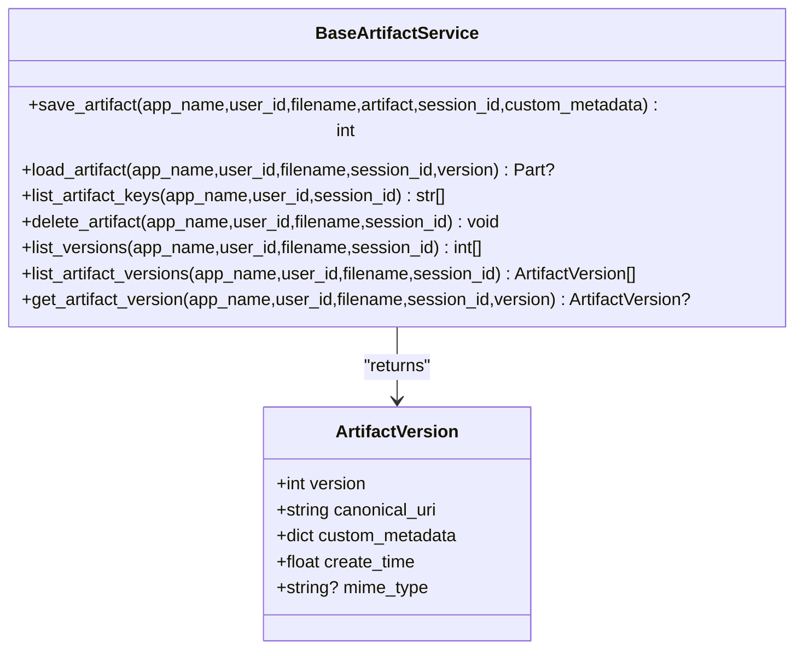
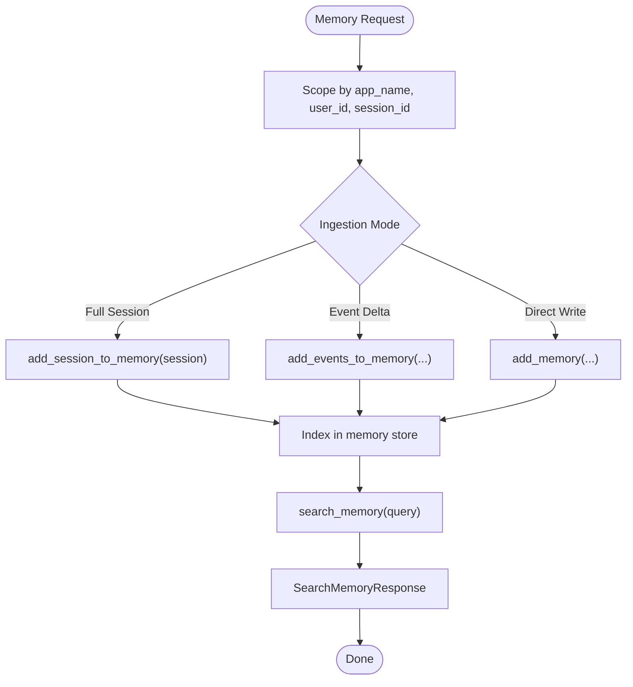
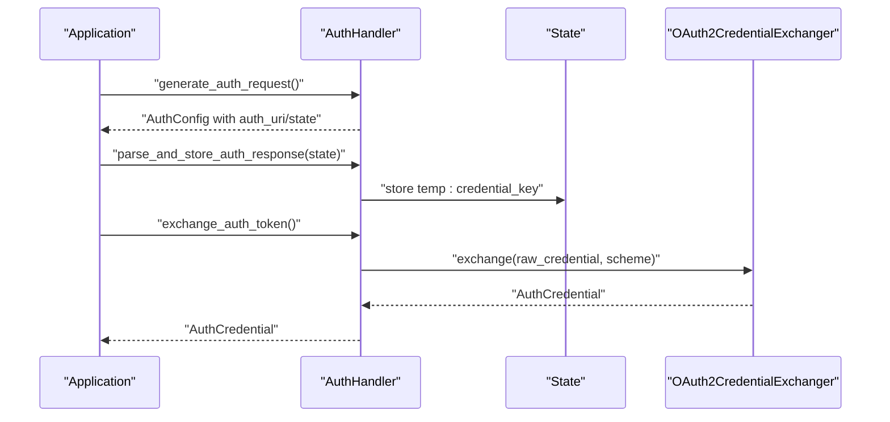
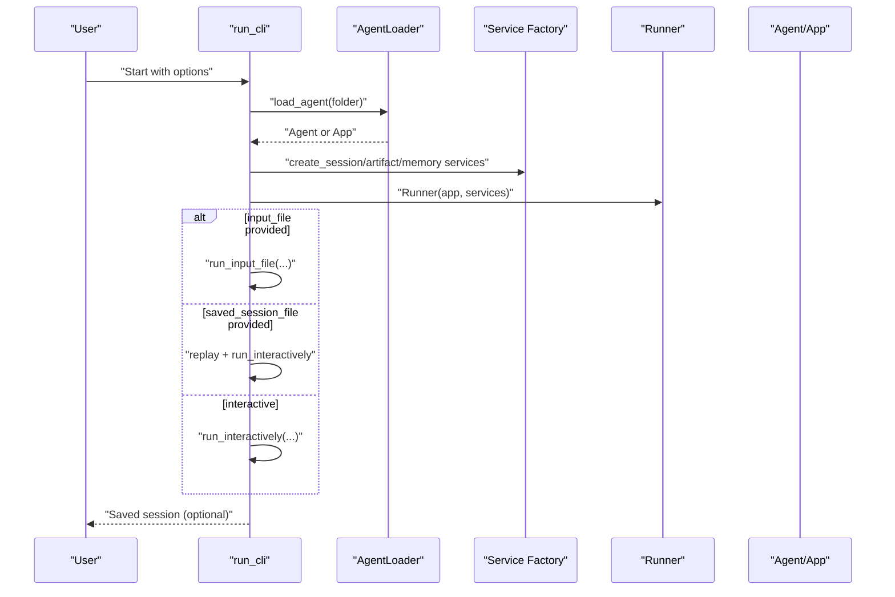
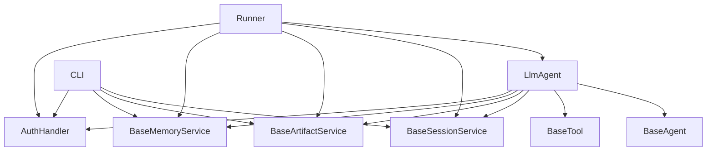

# API Reference

<cite>
**Referenced Files in This Document**
- [__init__.py](file://src/google/adk/__init__.py)
- [version.py](file://src/google/adk/version.py)
- [base_agent.py](file://src/google/adk/agents/base_agent.py)
- [llm_agent.py](file://src/google/adk/agents/llm_agent.py)
- [base_tool.py](file://src/google/adk/tools/base_tool.py)
- [base_session_service.py](file://src/google/adk/sessions/base_session_service.py)
- [cli.py](file://src/google/adk/cli/cli.py)
- [base_artifact_service.py](file://src/google/adk/artifacts/base_artifact_service.py)
- [base_memory_service.py](file://src/google/adk/memory/base_memory_service.py)
- [auth_handler.py](file://src/google/adk/auth/auth_handler.py)
- [tool_execution_error.py](file://src/google/adk/errors/tool_execution_error.py)
</cite>

## Table of Contents
1. [Introduction](#introduction)
2. [Project Structure](#project-structure)
3. [Core Components](#core-components)
4. [Architecture Overview](#architecture-overview)
5. [Detailed Component Analysis](#detailed-component-analysis)
6. [Dependency Analysis](#dependency-analysis)
7. [Performance Considerations](#performance-considerations)
8. [Troubleshooting Guide](#troubleshooting-guide)
9. [Conclusion](#conclusion)

## Introduction
This API reference documents the public classes, methods, and interfaces exposed by the Agent Development Kit (ADK). It covers agent APIs, tool APIs, session management APIs, evaluation APIs, and CLI APIs. It also explains API versioning, deprecation policies, migration guidance, error handling, and performance best practices. The goal is to enable developers to integrate agents, tools, sessions, artifacts, memory, and authentication into applications and CLI workflows effectively.

## Project Structure
ADK exposes a concise public surface through the package’s top-level module. The primary public exports are the Agent, Context, and Runner classes, along with the package version. The rest of the public APIs are accessed through these core types and related services.

**Diagram sources**
- [__init__.py](file://src/google/adk/__init__.py#L17-L23)
- [version.py](file://src/google/adk/version.py#L15-L16)

**Section sources**
- [__init__.py](file://src/google/adk/__init__.py#L17-L23)
- [version.py](file://src/google/adk/version.py#L15-L16)

## Core Components
This section summarizes the primary public APIs and their roles.

- Agent (alias to LlmAgent): The main agent class for building conversational and tool-using agents. It orchestrates model calls, tool execution, callbacks, and state transitions.
- Context: Provides contextual data and state for agent runs.
- Runner: Executes an App or Agent against a Session, coordinating artifacts, memory, and credentials.
- BaseTool: Abstract base for tools that agents can invoke.
- BaseSessionService: Abstract interface for session persistence and retrieval.
- BaseArtifactService: Abstract interface for artifact storage and retrieval.
- BaseMemoryService: Abstract interface for ingesting and searching memory.
- AuthHandler: Manages authentication flows and credential exchange.
- ToolExecutionError: Standardized exception for tool execution failures.

**Section sources**
- [__init__.py](file://src/google/adk/__init__.py#L18-L22)
- [llm_agent.py](file://src/google/adk/agents/llm_agent.py#L187-L205)
- [base_agent.py](file://src/google/adk/agents/base_agent.py#L86-L93)
- [base_tool.py](file://src/google/adk/tools/base_tool.py#L47-L48)
- [base_session_service.py](file://src/google/adk/sessions/base_session_service.py#L45-L49)
- [base_artifact_service.py](file://src/google/adk/artifacts/base_artifact_service.py#L88-L89)
- [base_memory_service.py](file://src/google/adk/memory/base_memory_service.py#L44-L49)
- [auth_handler.py](file://src/google/adk/auth/auth_handler.py#L38-L42)
- [tool_execution_error.py](file://src/google/adk/errors/tool_execution_error.py#L34-L35)

## Architecture Overview
The ADK runtime integrates agents, tools, sessions, artifacts, memory, and authentication into a cohesive pipeline. The CLI provides a command-line entry point to run agents and manage sessions.

**Diagram sources**
- [cli.py](file://src/google/adk/cli/cli.py#L136-L284)
- [llm_agent.py](file://src/google/adk/agents/llm_agent.py#L458-L497)
- [base_tool.py](file://src/google/adk/tools/base_tool.py#L96-L113)
- [base_session_service.py](file://src/google/adk/sessions/base_session_service.py#L105-L116)
- [base_artifact_service.py](file://src/google/adk/artifacts/base_artifact_service.py#L91-L101)
- [base_memory_service.py](file://src/google/adk/memory/base_memory_service.py#L51-L58)
- [auth_handler.py](file://src/google/adk/auth/auth_handler.py#L47-L78)

## Detailed Component Analysis

### Agent APIs
- BaseAgent
  - Purpose: Base class for all agents. Provides lifecycle hooks, cloning, invocation context creation, and callback orchestration.
  - Key methods and properties:
    - run_async(parent_context): Asynchronous generator yielding Events for text-based runs.
    - run_live(parent_context): Asynchronous generator yielding Events for live (audio/video) runs.
    - clone(update): Creates a copy of the agent instance with optional field updates.
    - find_agent(name), find_sub_agent(name): Searches agents by name.
    - canonical_before_agent_callbacks, canonical_after_agent_callbacks: Normalized callback lists.
    - from_config(config, config_abs_path): Factory to create agents from configuration.
  - Validation: Validates agent name and uniqueness of sub-agent names.
  - Experimental features: Agent state and agent config are marked experimental.

- LlmAgent
  - Purpose: LLM-backed agent with instruction handling, tool integration, planner support, code execution, and structured I/O.
  - Key fields:
    - model: Union[str, BaseLlm] with default model resolution.
    - instruction, static_instruction, global_instruction: Dynamic/static instruction handling.
    - tools: list of ToolUnion (callable, BaseTool, BaseToolset).
    - generate_content_config: Additional generation configuration.
    - disallow_transfer_to_parent, disallow_transfer_to_peers: Control agent transfer behavior.
    - include_contents: Controls content inclusion in model requests.
    - input_schema, output_schema, output_key: Structured input/output control.
    - planner, code_executor: Advanced capabilities.
    - before_model_callback, after_model_callback, on_model_error_callback: Model lifecycle callbacks.
    - before_tool_callback, after_tool_callback, on_tool_error_callback: Tool lifecycle callbacks.
  - Methods:
    - set_default_model(model): Overrides default model.
    - canonical_model: Resolved canonical model.
    - canonical_instruction(ctx), canonical_global_instruction(ctx): Resolve dynamic instructions.
    - canonical_tools(ctx): Resolve tools to BaseTool list.
    - _llm_flow: Selects appropriate flow (AutoFlow or SingleFlow).
    - _get_subagent_to_resume(ctx), __get_agent_to_run(name): Transfer/resume logic.
    - __maybe_save_output_to_state(event): Persist output to session state when configured.
  - Deprecated: global_instruction is deprecated; use GlobalInstructionPlugin at the App level.

**Diagram sources**
- [base_agent.py](file://src/google/adk/agents/base_agent.py#L86-L137)
- [llm_agent.py](file://src/google/adk/agents/llm_agent.py#L187-L364)

**Section sources**
- [base_agent.py](file://src/google/adk/agents/base_agent.py#L86-L701)
- [llm_agent.py](file://src/google/adk/agents/llm_agent.py#L187-L1008)

### Tool APIs
- BaseTool
  - Purpose: Abstract base for tools invoked by agents.
  - Fields:
    - name, description: Tool identity and documentation.
    - is_long_running: Indicates asynchronous completion.
    - custom_metadata: JSON-serializable metadata.
  - Methods:
    - _get_declaration(): Optional OpenAPI-style FunctionDeclaration.
    - run_async(args, tool_context): Execute tool asynchronously.
    - process_llm_request(tool_context, llm_request): Add tool to LLM request.
    - from_config(config, config_abs_path): Construct tool from configuration.

**Diagram sources**
- [base_tool.py](file://src/google/adk/tools/base_tool.py#L47-L134)

**Section sources**
- [base_tool.py](file://src/google/adk/tools/base_tool.py#L47-L213)

### Session Management APIs
- BaseSessionService
  - Purpose: Abstract interface for session lifecycle and event persistence.
  - Methods:
    - create_session(app_name, user_id, state, session_id): Create a new session.
    - get_session(app_name, user_id, session_id, config): Retrieve a session.
    - list_sessions(app_name, user_id): List sessions.
    - delete_session(app_name, user_id, session_id): Delete a session.
    - append_event(session, event): Append event and update state (with temp-state handling).
  - Internal helpers:
    - _apply_temp_state(session, event): Apply ephemeral state for current invocation.
    - _trim_temp_delta_state(event): Remove temp keys from persisted event deltas.
    - _update_session_state(session, event): Merge state deltas into session state.

**Diagram sources**
- [base_session_service.py](file://src/google/adk/sessions/base_session_service.py#L105-L154)

**Section sources**
- [base_session_service.py](file://src/google/adk/sessions/base_session_service.py#L45-L154)

### Artifact APIs
- BaseArtifactService
  - Purpose: Abstract interface for artifact storage and retrieval.
  - Methods:
    - save_artifact(app_name, user_id, filename, artifact, session_id, custom_metadata): Save artifact and return revision ID.
    - load_artifact(app_name, user_id, filename, session_id, version): Load artifact or latest version.
    - list_artifact_keys(app_name, user_id, session_id): List artifact filenames.
    - delete_artifact(app_name, user_id, filename, session_id): Delete artifact.
    - list_versions(app_name, user_id, filename, session_id): List all versions.
    - list_artifact_versions(app_name, user_id, filename, session_id): List versions with metadata.
    - get_artifact_version(app_name, user_id, filename, session_id, version): Get specific version metadata.

**Diagram sources**
- [base_artifact_service.py](file://src/google/adk/artifacts/base_artifact_service.py#L88-L262)

**Section sources**
- [base_artifact_service.py](file://src/google/adk/artifacts/base_artifact_service.py#L88-L262)

### Memory APIs
- BaseMemoryService
  - Purpose: Abstract interface for memory ingestion and search.
  - Methods:
    - add_session_to_memory(session): Ingest a session into memory.
    - add_events_to_memory(app_name, user_id, events, session_id, custom_metadata): Incremental event ingestion.
    - add_memory(app_name, user_id, memories, custom_metadata): Direct memory write (optional).
    - search_memory(app_name, user_id, query): Search for relevant memories.

**Diagram sources**
- [base_memory_service.py](file://src/google/adk/memory/base_memory_service.py#L44-L141)

**Section sources**
- [base_memory_service.py](file://src/google/adk/memory/base_memory_service.py#L44-L141)

### Authentication APIs
- AuthHandler
  - Purpose: Orchestrates authentication flows and credential exchange.
  - Methods:
    - exchange_auth_token(): Exchange raw credentials for usable tokens.
    - parse_and_store_auth_response(state): Parse auth response and store in state.
    - get_auth_response(state): Retrieve stored credential from state.
    - generate_auth_request(): Build an authorization request with auth URI and state.
    - generate_auth_uri(): Generate authorization URL and state using Authlib.

**Diagram sources**
- [auth_handler.py](file://src/google/adk/auth/auth_handler.py#L38-L209)

**Section sources**
- [auth_handler.py](file://src/google/adk/auth/auth_handler.py#L38-L209)

### CLI APIs
- CLI entry points
  - run_cli(...): Main CLI entry to run an agent interactively or from input files, with optional session persistence.
  - run_input_file(...): Execute a predefined input file with initial state and queries.
  - run_interactively(...): Interactive loop for continuous conversation.

Key parameters:
- agent_parent_dir, agent_folder_name: Locate agent/app definition.
- input_file, saved_session_file: Control initial state and replay.
- save_session, session_id: Persist session on exit.
- session_service_uri, artifact_service_uri, memory_service_uri: Override service URIs.
- use_local_storage: Toggle local storage defaults.

**Diagram sources**
- [cli.py](file://src/google/adk/cli/cli.py#L136-L284)

**Section sources**
- [cli.py](file://src/google/adk/cli/cli.py#L136-L284)

### Evaluation APIs
- Evaluator (abstract)
  - Purpose: Defines the evaluation interface for comparing actual vs expected invocations.
  - Methods:
    - evaluate_invocations(actual_invocations, expected_invocations, conversation_scenario): Returns EvaluationResult.

- EvaluationResult
  - overall_score, overall_eval_status, per_invocation_results, overall_rubric_scores: Aggregated evaluation metrics.

Note: Additional evaluators and rubrics are available in the evaluation module; consult the module’s public classes for concrete implementations.

**Section sources**
- [evaluator.py](file://src/google/adk/evaluation/evaluator.py#L57-L81)

## Dependency Analysis
The following diagram highlights key dependencies among public APIs.

**Diagram sources**
- [llm_agent.py](file://src/google/adk/agents/llm_agent.py#L187-L205)
- [base_agent.py](file://src/google/adk/agents/base_agent.py#L86-L93)
- [base_tool.py](file://src/google/adk/tools/base_tool.py#L47-L48)
- [base_session_service.py](file://src/google/adk/sessions/base_session_service.py#L45-L49)
- [base_artifact_service.py](file://src/google/adk/artifacts/base_artifact_service.py#L88-L89)
- [base_memory_service.py](file://src/google/adk/memory/base_memory_service.py#L44-L49)
- [auth_handler.py](file://src/google/adk/auth/auth_handler.py#L38-L42)
- [cli.py](file://src/google/adk/cli/cli.py#L136-L148)

**Section sources**
- [llm_agent.py](file://src/google/adk/agents/llm_agent.py#L187-L205)
- [cli.py](file://src/google/adk/cli/cli.py#L136-L148)

## Performance Considerations
- Model caching and static instructions:
  - Use static_instruction for content that does not change to leverage implicit/explicit context caching mechanisms.
  - Configure context_cache_config at the App level for explicit control.
- Streaming and partial events:
  - Use partial events to reduce latency; ensure consumers handle partial content appropriately.
- Tool batching and conversion:
  - Tools are resolved concurrently; minimize expensive conversions inside tool loops.
- Session persistence:
  - Append events incrementally to reduce contention and improve throughput.
- Artifact and memory:
  - Batch artifact saves and memory writes when possible; avoid unnecessary round-trips.

[No sources needed since this section provides general guidance]

## Troubleshooting Guide
- Tool execution errors:
  - Use ToolExecutionError to represent tool failures with semantic error types aligned to OpenTelemetry conventions.
  - Include meaningful messages and map HTTP-like statuses to ToolErrorType for observability.
- Agent name validation:
  - Agent names must be valid identifiers and unique among siblings; avoid reserved names like “user”.
- Duplicate sub-agent names:
  - The framework logs warnings for duplicate names; resolve by renaming or using distinct instances.
- Global instruction deprecation:
  - global_instruction is deprecated; migrate to GlobalInstructionPlugin at the App level.
- Authentication flows:
  - Ensure auth_scheme and raw_auth_credential are correctly configured; Authlib availability affects auth URI generation.
- CLI session persistence:
  - When saving sessions, confirm the session_id and file path; verify that the session service returns the updated session before writing.

**Section sources**
- [tool_execution_error.py](file://src/google/adk/errors/tool_execution_error.py#L20-L54)
- [base_agent.py](file://src/google/adk/agents/base_agent.py#L555-L620)
- [llm_agent.py](file://src/google/adk/agents/llm_agent.py#L584-L600)
- [auth_handler.py](file://src/google/adk/auth/auth_handler.py#L71-L138)
- [cli.py](file://src/google/adk/cli/cli.py#L268-L284)

## Conclusion
This API reference outlines the public contracts for agents, tools, sessions, artifacts, memory, authentication, and CLI in ADK. By leveraging these APIs, developers can build robust conversational agents, integrate external tools, manage persistent sessions, and operate via CLI. Follow the deprecation and migration guidance to keep integrations up-to-date, and apply the performance and troubleshooting recommendations for reliable deployments.