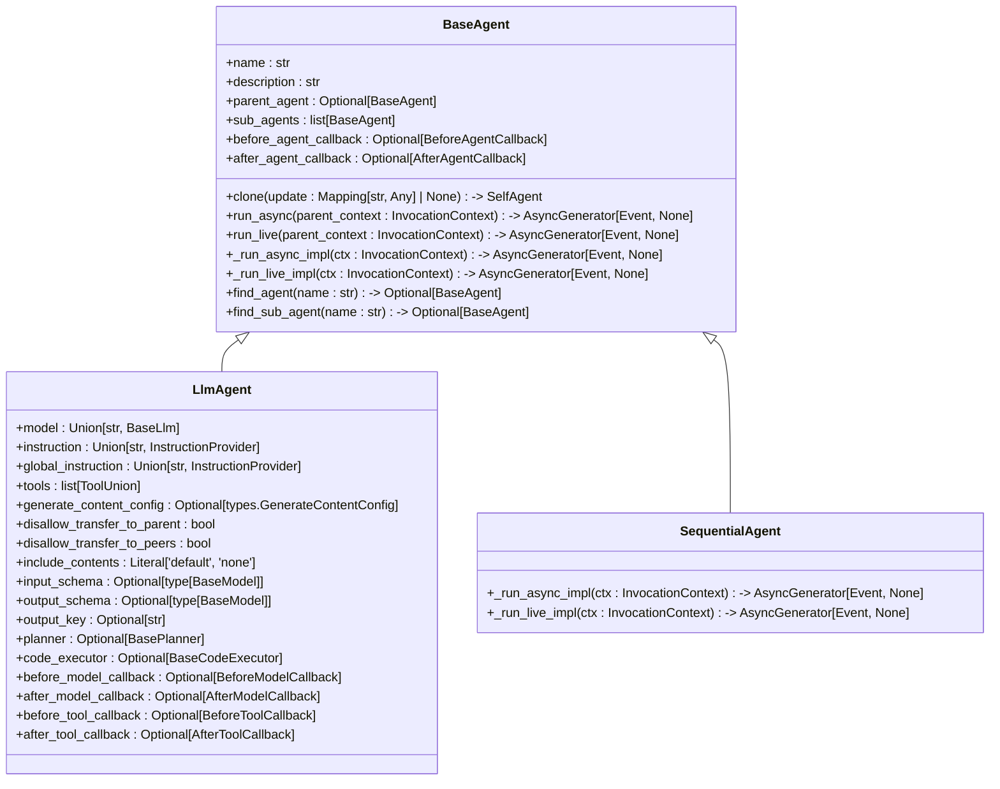
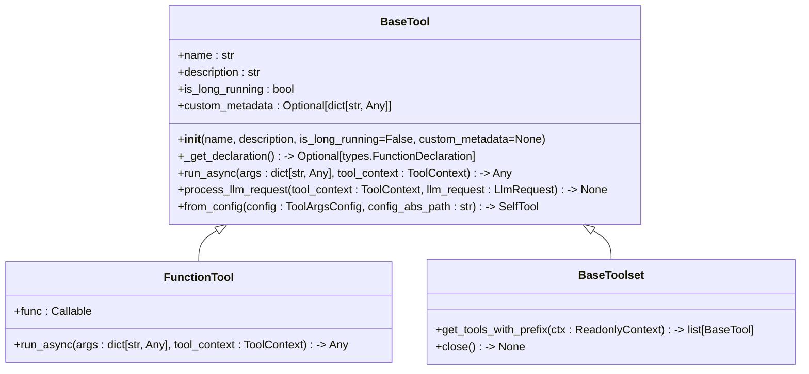
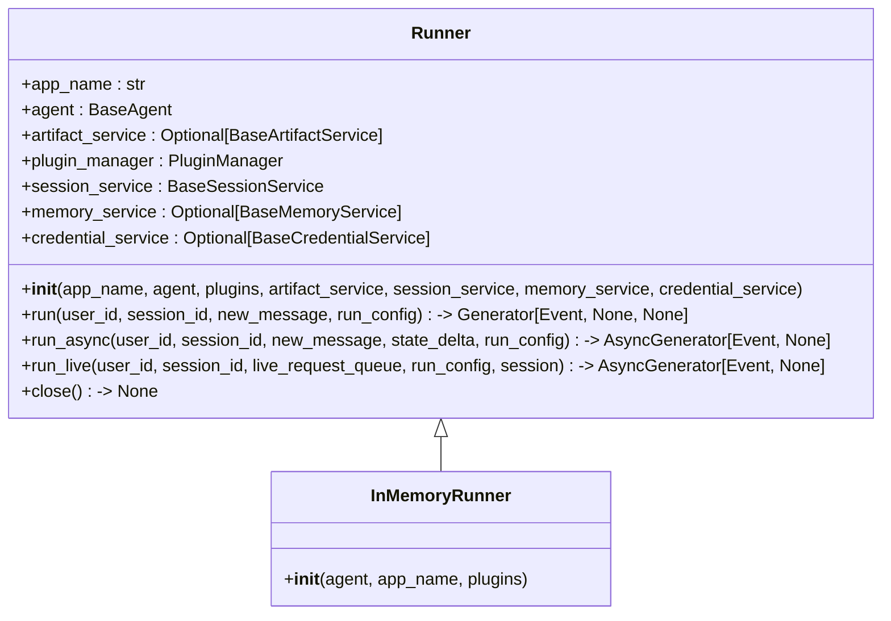
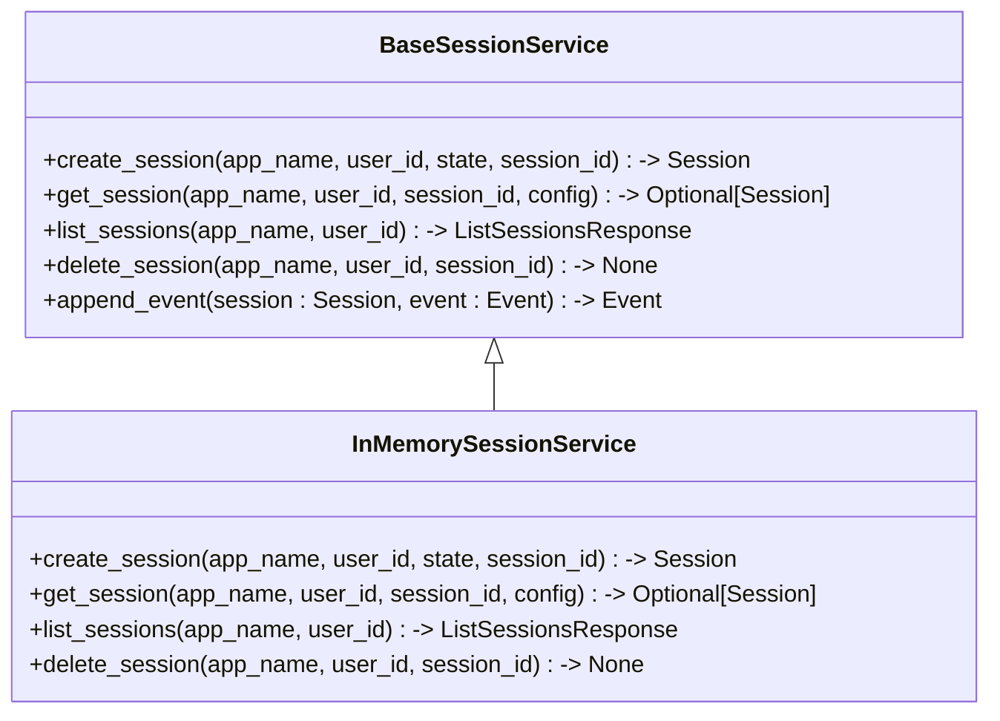
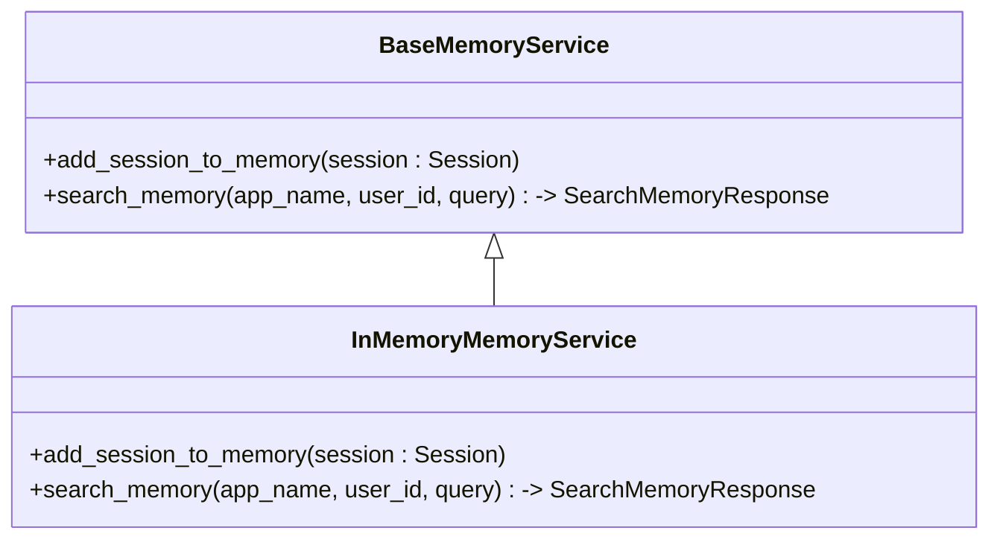
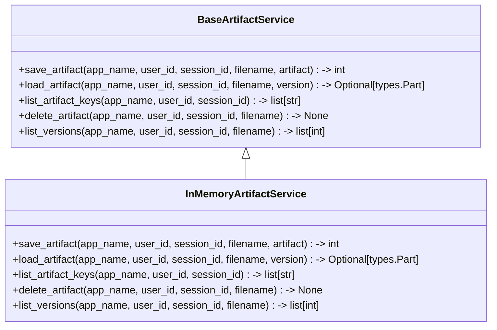
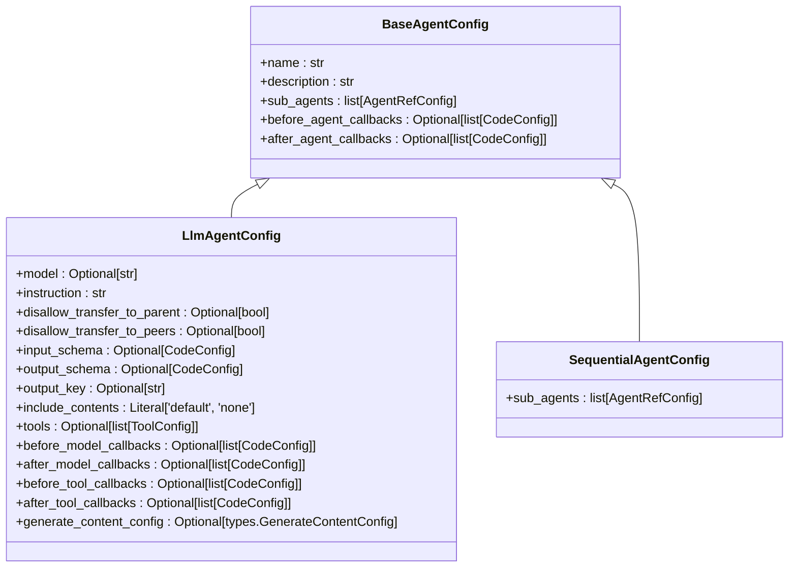
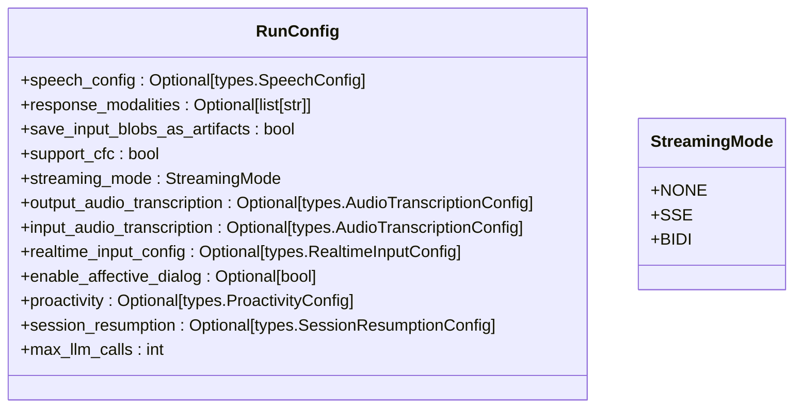
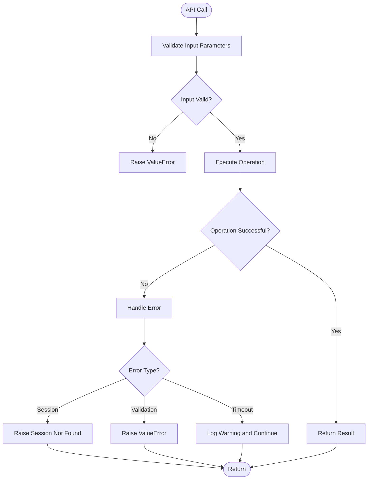

# API Reference

<cite>
**Referenced Files in This Document**   
- [src/google/adk/__init__.py](file://src/google/adk/__init__.py)
- [src/google/adk/runners.py](file://src/google/adk/runners.py)
- [src/google/adk/agents/base_agent.py](file://src/google/adk/agents/base_agent.py)
- [src/google/adk/agents/llm_agent.py](file://src/google/adk/agents/llm_agent.py)
- [src/google/adk/artifacts/base_artifact_service.py](file://src/google/adk/artifacts/base_artifact_service.py)
- [src/google/adk/sessions/base_session_service.py](file://src/google/adk/sessions/base_session_service.py)
- [src/google/adk/memory/base_memory_service.py](file://src/google/adk/memory/base_memory_service.py)
- [src/google/adk/tools/base_tool.py](file://src/google/adk/tools/base_tool.py)
- [src/google/adk/auth/auth_handler.py](file://src/google/adk/auth/auth_handler.py)
- [src/google/adk/models/base_llm.py](file://src/google/adk/models/base_llm.py)
- [src/google/adk/plugins/base_plugin.py](file://src/google/adk/plugins/base_plugin.py)
- [src/google/adk/events/event.py](file://src/google/adk/events/event.py)
- [src/google/adk/agents/run_config.py](file://src/google/adk/agents/run_config.py)
- [src/google/adk/version.py](file://src/google/adk/version.py)
</cite>

## Table of Contents
1. [Introduction](#introduction)
2. [Agent Classes](#agent-classes)
3. [Tool Classes](#tool-classes)
4. [Runner Classes](#runner-classes)
5. [Service Classes](#service-classes)
6. [Configuration Classes](#configuration-classes)
7. [Versioning and Compatibility](#versioning-and-compatibility)
8. [Error Handling](#error-handling)

## Introduction
The Agent Development Kit (ADK) framework provides a comprehensive API for building and managing AI agents. The framework is organized around several core components: agents, tools, runners, services, and configuration. This API reference documents all public interfaces, providing detailed information on constructors, methods, parameters, return values, inheritance relationships, function signatures, input/output schemas, authentication requirements, execution methods, configuration options, lifecycle events, CRUD operations, data models, error conditions, available options, default values, and validation rules.

The framework follows a modular architecture where agents can be composed hierarchically, with each agent potentially having sub-agents. Agents interact with various services for session management, memory, artifacts, and authentication. The Runner class orchestrates the execution of agents within sessions, handling message processing and event generation.

**Section sources**
- [src/google/adk/__init__.py](file://src/google/adk/__init__.py#L1-L21)
- [src/google/adk/version.py](file://src/google/adk/version.py#L1-L17)

## Agent Classes

The ADK framework provides a hierarchical agent system with a base class and specialized implementations. All agents inherit from the `BaseAgent` class, which defines the core interface and behavior.



**Diagram sources**
- [src/google/adk/agents/base_agent.py](file://src/google/adk/agents/base_agent.py#L71-L612)
- [src/google/adk/agents/llm_agent.py](file://src/google/adk/agents/llm_agent.py#L124-L638)
- [src/google/adk/agents/sequential_agent.py](file://src/google/adk/agents/sequential_agent.py#L34-L87)

### BaseAgent
The `BaseAgent` class is the foundation for all agents in the ADK framework. It provides common functionality for agent management, including hierarchical relationships, callbacks, and execution methods.

#### Constructor
```python
def __init__(
    self,
    *,
    name: str,
    description: str = '',
    sub_agents: list[BaseAgent] = None,
    before_agent_callback: Optional[BeforeAgentCallback] = None,
    after_agent_callback: Optional[AfterAgentCallback] = None,
    **kwargs
)
```

**Parameters:**
- `name`: The agent's name. Must be a valid Python identifier and unique within the agent tree. Cannot be "user" as it's reserved for end-user input.
- `description`: Description of the agent's capability. Used by models to determine delegation.
- `sub_agents`: List of sub-agents that this agent can delegate to.
- `before_agent_callback`: Callback or list of callbacks invoked before the agent runs.
- `after_agent_callback`: Callback or list of callbacks invoked after the agent runs.

**Returns:** A new `BaseAgent` instance.

#### Methods
- `clone(update: Mapping[str, Any] | None = None) -> SelfAgent`: Creates a copy of the agent instance with optional field updates.
- `run_async(parent_context: InvocationContext) -> AsyncGenerator[Event, None]`: Entry method to run an agent via text-based conversation.
- `run_live(parent_context: InvocationContext) -> AsyncGenerator[Event, None]`: Entry method to run an agent via video/audio-based conversation.
- `find_agent(name: str) -> Optional[BaseAgent]`: Finds an agent with the given name in this agent and its descendants.
- `find_sub_agent(name: str) -> Optional[BaseAgent]`: Finds an agent with the given name in this agent's descendants.

**Section sources**
- [src/google/adk/agents/base_agent.py](file://src/google/adk/agents/base_agent.py#L71-L612)

### LlmAgent
The `LlmAgent` class extends `BaseAgent` to provide LLM-specific functionality, including model configuration, instruction management, tool integration, and advanced features like planning and code execution.

#### Constructor
```python
def __init__(
    self,
    *,
    name: str,
    description: str = '',
    model: Union[str, BaseLlm] = '',
    instruction: Union[str, InstructionProvider] = '',
    global_instruction: Union[str, InstructionProvider] = '',
    tools: list[ToolUnion] = None,
    generate_content_config: Optional[types.GenerateContentConfig] = None,
    disallow_transfer_to_parent: bool = False,
    disallow_transfer_to_peers: bool = False,
    include_contents: Literal['default', 'none'] = 'default',
    input_schema: Optional[type[BaseModel]] = None,
    output_schema: Optional[type[BaseModel]] = None,
    output_key: Optional[str] = None,
    planner: Optional[BasePlanner] = None,
    code_executor: Optional[BaseCodeExecutor] = None,
    before_model_callback: Optional[BeforeModelCallback] = None,
    after_model_callback: Optional[AfterModelCallback] = None,
    before_tool_callback: Optional[BeforeToolCallback] = None,
    after_tool_callback: Optional[AfterToolCallback] = None,
    **kwargs
)
```

**Parameters:**
- `model`: The model to use for the agent. When not set, inherits from ancestor.
- `instruction`: Instructions for the LLM model, guiding the agent's behavior.
- `global_instruction`: Instructions for all agents in the entire agent tree. Only effective in root agent.
- `tools`: Tools available to this agent.
- `generate_content_config`: Additional content generation configurations.
- `disallow_transfer_to_parent`: Disallows LLM-controlled transferring to the parent agent.
- `disallow_transfer_to_peers`: Disallows LLM-controlled transferring to peer agents.
- `include_contents`: Controls content inclusion in model requests.
- `input_schema`: The input schema when agent is used as a tool.
- `output_schema`: The output schema when agent replies.
- `output_key`: The key in session state to store the agent's output.
- `planner`: Instructs the agent to make a plan and execute it step by step.
- `code_executor`: Allows the agent to execute code blocks from model responses.

**Returns:** A new `LlmAgent` instance.

#### Properties
- `canonical_model`: Resolves the model field to a `BaseLlm` instance.
- `canonical_instruction`: Resolves the instruction field to a string.
- `canonical_global_instruction`: Resolves the global_instruction field to a string.
- `canonical_tools`: Resolves the tools field to a list of `BaseTool` instances.

**Section sources**
- [src/google/adk/agents/llm_agent.py](file://src/google/adk/agents/llm_agent.py#L124-L638)

## Tool Classes

The ADK framework provides a flexible tool system that allows agents to extend their capabilities through external functions and services. Tools are implemented as classes that inherit from `BaseTool` and can be integrated with agents through various mechanisms.



**Diagram sources**
- [src/google/adk/tools/base_tool.py](file://src/google/adk/tools/base_tool.py#L47-L213)

### BaseTool
The `BaseTool` class is the abstract base class for all tools in the ADK framework. It defines the core interface and behavior for tools.

#### Constructor
```python
def __init__(
    self,
    *,
    name: str,
    description: str,
    is_long_running: bool = False,
    custom_metadata: Optional[dict[str, Any]] = None
)
```

**Parameters:**
- `name`: The name of the tool.
- `description`: The description of the tool.
- `is_long_running`: Whether the tool is a long-running operation.
- `custom_metadata`: Custom metadata for the tool.

#### Methods
- `_get_declaration() -> Optional[types.FunctionDeclaration]`: Gets the OpenAPI specification of the tool.
- `run_async(args: dict[str, Any], tool_context: ToolContext) -> Any`: Runs the tool with the given arguments and context.
- `process_llm_request(tool_context: ToolContext, llm_request: LlmRequest) -> None`: Processes the outgoing LLM request for this tool.
- `from_config(config: ToolArgsConfig, config_abs_path: str) -> SelfTool`: Creates a tool instance from a configuration.

**Section sources**
- [src/google/adk/tools/base_tool.py](file://src/google/adk/tools/base_tool.py#L47-L213)

### FunctionTool
The `FunctionTool` class is a concrete implementation of `BaseTool` that wraps a Python callable as a tool.

#### Constructor
```python
def __init__(self, func: Callable, **kwargs)
```

**Parameters:**
- `func`: The Python callable to wrap as a tool.

**Section sources**
- [src/google/adk/tools/function_tool.py](file://src/google/adk/tools/function_tool.py)

## Runner Classes

The `Runner` class is responsible for executing agents within sessions. It manages the interaction between agents, services, and the external environment, handling message processing, event generation, and service integration.



**Diagram sources**
- [src/google/adk/runners.py](file://src/google/adk/runners.py#L59-L680)

### Runner
The `Runner` class orchestrates the execution of agents within sessions.

#### Constructor
```python
def __init__(
    self,
    *,
    app_name: str,
    agent: BaseAgent,
    plugins: Optional[List[BasePlugin]] = None,
    artifact_service: Optional[BaseArtifactService] = None,
    session_service: BaseSessionService,
    memory_service: Optional[BaseMemoryService] = None,
    credential_service: Optional[BaseCredentialService] = None
)
```

**Parameters:**
- `app_name`: The application name of the runner.
- `agent`: The root agent to run.
- `plugins`: A list of plugins for the runner.
- `artifact_service`: The artifact service for the runner.
- `session_service`: The session service for the runner.
- `memory_service`: The memory service for the runner.
- `credential_service`: The credential service for the runner.

#### Methods
- `run(user_id, session_id, new_message, run_config) -> Generator[Event, None, None]`: Runs the agent synchronously.
- `run_async(user_id, session_id, new_message, state_delta, run_config) -> AsyncGenerator[Event, None]`: Runs the agent asynchronously.
- `run_live(user_id, session_id, live_request_queue, run_config, session) -> AsyncGenerator[Event, None]`: Runs the agent in live mode.
- `close() -> None`: Closes the runner and cleans up resources.

### InMemoryRunner
The `InMemoryRunner` class is a specialized runner that uses in-memory implementations for all services, making it ideal for testing and development.

#### Constructor
```python
def __init__(
    self,
    agent: BaseAgent,
    *,
    app_name: str = 'InMemoryRunner',
    plugins: Optional[list[BasePlugin]] = None
)
```

**Parameters:**
- `agent`: The root agent to run.
- `app_name`: The application name of the runner.
- `plugins`: A list of plugins for the runner.

**Section sources**
- [src/google/adk/runners.py](file://src/google/adk/runners.py#L59-L680)

## Service Classes

The ADK framework provides several service classes for managing different aspects of agent functionality, including sessions, memory, artifacts, and authentication.

### Session Service
The session service manages agent sessions, providing CRUD operations for session management.



**Diagram sources**
- [src/google/adk/sessions/base_session_service.py](file://src/google/adk/sessions/base_session_service.py#L43-L110)

#### BaseSessionService
The `BaseSessionService` class is the abstract base class for session services.

##### Methods
- `create_session(app_name, user_id, state, session_id) -> Session`: Creates a new session.
- `get_session(app_name, user_id, session_id, config) -> Optional[Session]`: Gets a session.
- `list_sessions(app_name, user_id) -> ListSessionsResponse`: Lists all sessions for a user.
- `delete_session(app_name, user_id, session_id) -> None`: Deletes a session.
- `append_event(session: Session, event: Event) -> Event`: Appends an event to a session.

**Section sources**
- [src/google/adk/sessions/base_session_service.py](file://src/google/adk/sessions/base_session_service.py#L43-L110)

### Memory Service
The memory service manages agent memory, allowing agents to store and retrieve information across sessions.



**Diagram sources**
- [src/google/adk/memory/base_memory_service.py](file://src/google/adk/memory/base_memory_service.py#L41-L79)

#### BaseMemoryService
The `BaseMemoryService` class is the abstract base class for memory services.

##### Methods
- `add_session_to_memory(session: Session)`: Adds a session to the memory service.
- `search_memory(app_name, user_id, query) -> SearchMemoryResponse`: Searches for memories matching a query.

**Section sources**
- [src/google/adk/memory/base_memory_service.py](file://src/google/adk/memory/base_memory_service.py#L41-L79)

### Artifact Service
The artifact service manages file storage for agents, allowing them to save and retrieve binary data.



**Diagram sources**
- [src/google/adk/artifacts/base_artifact_service.py](file://src/google/adk/artifacts/base_artifact_service.py#L23-L124)

#### BaseArtifactService
The `BaseArtifactService` class is the abstract base class for artifact services.

##### Methods
- `save_artifact(app_name, user_id, session_id, filename, artifact) -> int`: Saves an artifact to storage.
- `load_artifact(app_name, user_id, session_id, filename, version) -> Optional[types.Part]`: Loads an artifact from storage.
- `list_artifact_keys(app_name, user_id, session_id) -> list[str]`: Lists all artifact filenames in a session.
- `delete_artifact(app_name, user_id, session_id, filename) -> None`: Deletes an artifact.
- `list_versions(app_name, user_id, session_id, filename) -> list[int]`: Lists all versions of an artifact.

**Section sources**
- [src/google/adk/artifacts/base_artifact_service.py](file://src/google/adk/artifacts/base_artifact_service.py#L23-L124)

## Configuration Classes

The ADK framework uses a configuration system based on Pydantic models to define agent and tool configurations. These configurations can be loaded from YAML files or created programmatically.

### Agent Configuration
Agent configurations are defined using Pydantic models that inherit from `BaseAgentConfig`. The framework supports different types of agents, each with its own configuration class.



**Diagram sources**
- [src/google/adk/agents/base_agent_config.py](file://src/google/adk/agents/base_agent_config.py)
- [src/google/adk/agents/llm_agent_config.py](file://src/google/adk/agents/llm_agent_config.py#L33-L168)

#### LlmAgentConfig
The `LlmAgentConfig` class defines the configuration for an `LlmAgent`.

##### Fields
- `model`: Optional LLM model specification.
- `instruction`: Required instruction for the agent.
- `disallow_transfer_to_parent`: Optional flag to disallow transfer to parent agent.
- `disallow_transfer_to_peers`: Optional flag to disallow transfer to peer agents.
- `input_schema`: Optional input schema when agent is used as a tool.
- `output_schema`: Optional output schema for agent replies.
- `output_key`: Optional key to store agent output in session state.
- `include_contents`: Optional content inclusion policy.
- `tools`: Optional list of tool configurations.
- `before_model_callbacks`: Optional list of before-model callback configurations.
- `after_model_callbacks`: Optional list of after-model callback configurations.
- `before_tool_callbacks`: Optional list of before-tool callback configurations.
- `after_tool_callbacks`: Optional list of after-tool callback configurations.
- `generate_content_config`: Optional additional content generation configurations.

**Section sources**
- [src/google/adk/agents/llm_agent_config.py](file://src/google/adk/agents/llm_agent_config.py#L33-L168)

### Run Configuration
The `RunConfig` class defines runtime configuration options for agent execution.



**Diagram sources**
- [src/google/adk/agents/run_config.py](file://src/google/adk/agents/run_config.py#L36-L110)

#### RunConfig
The `RunConfig` class defines runtime configuration options for agent execution.

##### Fields
- `speech_config`: Speech configuration for live agents.
- `response_modalities`: Output modalities (default: AUDIO).
- `save_input_blobs_as_artifacts`: Whether to save input blobs as artifacts.
- `support_cfc`: Whether to support Compositional Function Calling (experimental).
- `streaming_mode`: Streaming mode (NONE, SSE, or BIDI).
- `output_audio_transcription`: Output transcription configuration for live agents.
- `input_audio_transcription`: Input transcription configuration for live agents.
- `realtime_input_config`: Realtime input configuration for live agents.
- `enable_affective_dialog`: Whether to enable affective dialog.
- `proactivity`: Proactivity configuration.
- `session_resumption`: Session resumption configuration.
- `max_llm_calls`: Maximum number of LLM calls (default: 500).

**Section sources**
- [src/google/adk/agents/run_config.py](file://src/google/adk/agents/run_config.py#L36-L110)

## Versioning and Compatibility

The ADK framework follows semantic versioning with the current version being 1.12.0. The framework provides backwards compatibility guarantees for major versions, ensuring that code written for a particular major version will continue to work with subsequent minor and patch releases.

The framework uses experimental decorators to mark features that are subject to change. These features should be used with caution in production environments.

**Section sources**
- [src/google/adk/version.py](file://src/google/adk/version.py#L1-L17)

## Error Handling

The ADK framework provides comprehensive error handling through exceptions and callback mechanisms. Errors can occur at various levels of the system, including agent execution, tool calls, and service operations.

### Error Conditions
- **Session Not Found**: Raised when attempting to access a non-existent session.
- **Invalid Agent Name**: Raised when an agent name is not a valid Python identifier or is "user".
- **ValueError**: Raised for various validation errors, such as invalid configurations or missing required fields.
- **NameError**: May occur when resolving type hints in tool parameter inspection.
- **TimeoutError**: May occur during toolset cleanup operations.

### Debugging API Interactions
The framework provides several mechanisms for debugging API interactions:

1. **Logging**: The framework uses Python's logging module with a logger named 'google_adk'.
2. **Plugins**: Custom plugins can be implemented to log and inspect various aspects of agent execution.
3. **Callbacks**: Agent and model callbacks can be used to inspect and modify requests and responses.
4. **Event System**: The event system provides a detailed record of agent interactions.



**Diagram sources**
- [src/google/adk/errors/not_found_error.py](file://src/google/adk/errors/not_found_error.py)
- [src/google/adk/runners.py](file://src/google/adk/runners.py#L208-L209)
- [src/google/adk/agents/base_agent.py](file://src/google/adk/agents/base_agent.py#L509-L520)

**Section sources**
- [src/google/adk/errors/not_found_error.py](file://src/google/adk/errors/not_found_error.py)
- [src/google/adk/runners.py](file://src/google/adk/runners.py#L208-L209)
- [src/google/adk/agents/base_agent.py](file://src/google/adk/agents/base_agent.py#L509-L520)