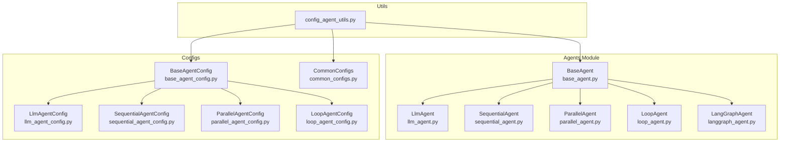
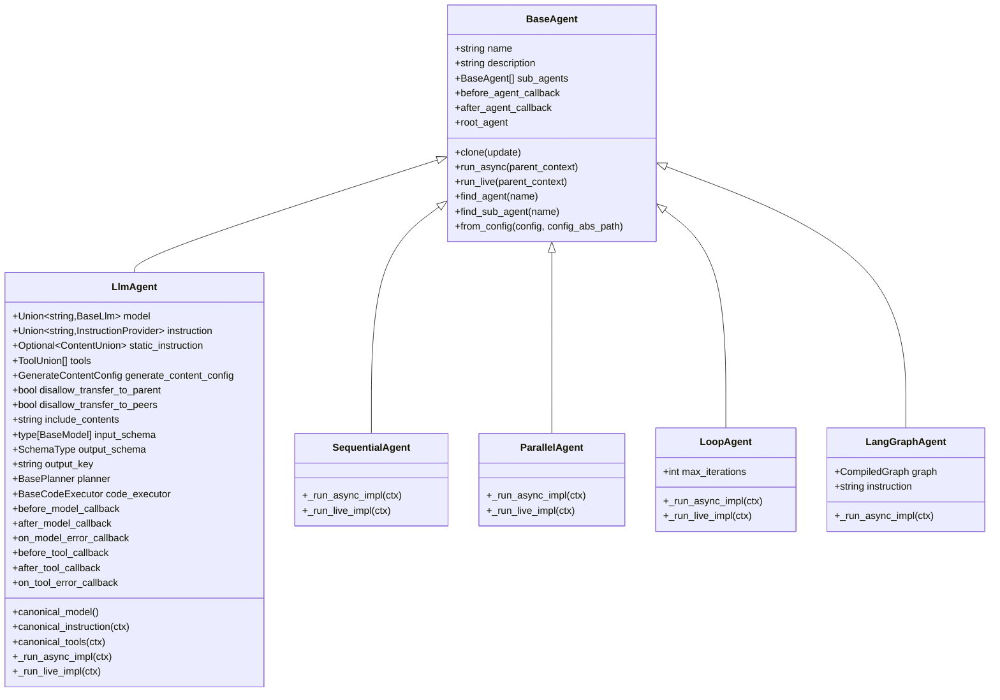
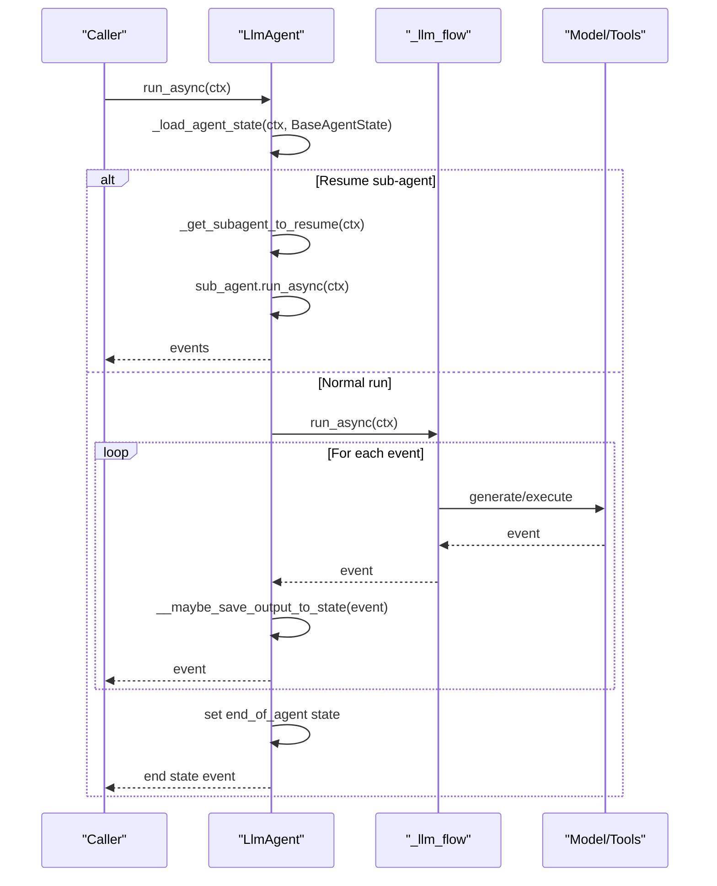
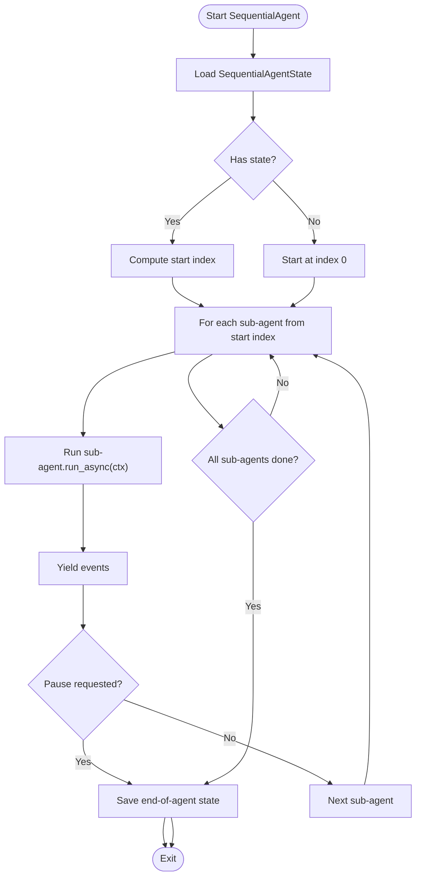
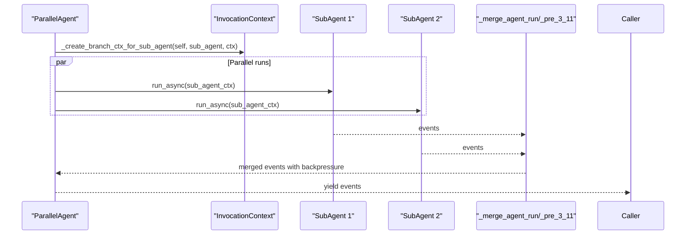
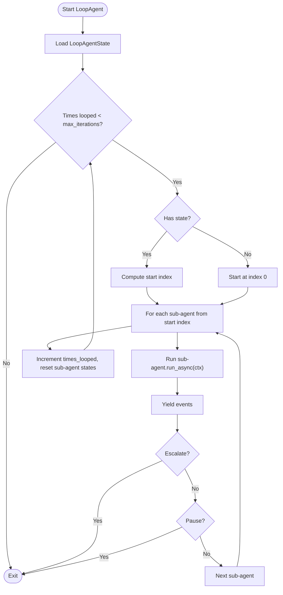
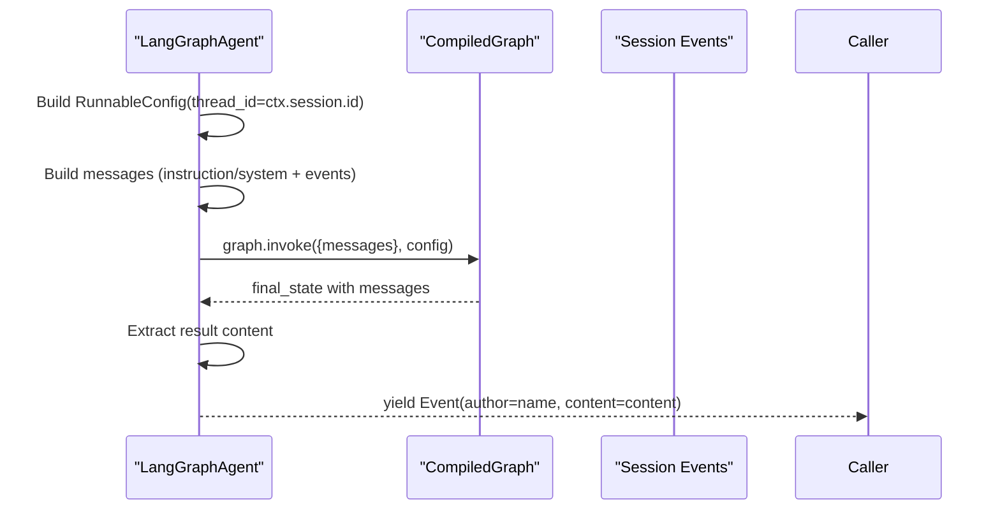
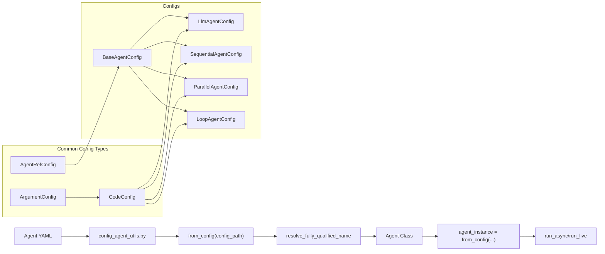

# Agent APIs

<cite>
**Referenced Files in This Document**
- [base_agent.py](file://src/google/adk/agents/base_agent.py)
- [llm_agent.py](file://src/google/adk/agents/llm_agent.py)
- [sequential_agent.py](file://src/google/adk/agents/sequential_agent.py)
- [parallel_agent.py](file://src/google/adk/agents/parallel_agent.py)
- [loop_agent.py](file://src/google/adk/agents/loop_agent.py)
- [langgraph_agent.py](file://src/google/adk/agents/langgraph_agent.py)
- [base_agent_config.py](file://src/google/adk/agents/base_agent_config.py)
- [llm_agent_config.py](file://src/google/adk/agents/llm_agent_config.py)
- [sequential_agent_config.py](file://src/google/adk/agents/sequential_agent_config.py)
- [parallel_agent_config.py](file://src/google/adk/agents/parallel_agent_config.py)
- [loop_agent_config.py](file://src/google/adk/agents/loop_agent_config.py)
- [common_configs.py](file://src/google/adk/agents/common_configs.py)
- [config_agent_utils.py](file://src/google/adk/agents/config_agent_utils.py)
</cite>

## Table of Contents
1. [Introduction](#introduction)
2. [Project Structure](#project-structure)
3. [Core Components](#core-components)
4. [Architecture Overview](#architecture-overview)
5. [Detailed Component Analysis](#detailed-component-analysis)
6. [Dependency Analysis](#dependency-analysis)
7. [Performance Considerations](#performance-considerations)
8. [Troubleshooting Guide](#troubleshooting-guide)
9. [Conclusion](#conclusion)
10. [Appendices](#appendices)

## Introduction
This document provides comprehensive API documentation for Agent-related classes and interfaces in the Agent Development Kit (ADK). It covers BaseAgent, LlmAgent, SequentialAgent, ParallelAgent, LoopAgent, and LangGraphAgent. For each agent, you will find:
- Constructor and initialization parameters
- Methods, properties, and lifecycle hooks
- Inheritance hierarchy and configuration options
- Context management and callback mechanisms
- Composition patterns and configuration validation
- Error handling and best practices
- Usage examples and integration patterns
- Agent-specific performance considerations

## Project Structure
The agents module is organized around a shared base class and specialized subclasses. Configuration schemas and utilities support declarative agent construction from YAML.

**Diagram sources**
- [base_agent.py](file://src/google/adk/agents/base_agent.py#L86-L701)
- [llm_agent.py](file://src/google/adk/agents/llm_agent.py#L187-L1008)
- [sequential_agent.py](file://src/google/adk/agents/sequential_agent.py#L48-L160)
- [parallel_agent.py](file://src/google/adk/agents/parallel_agent.py#L150-L217)
- [loop_agent.py](file://src/google/adk/agents/loop_agent.py#L52-L167)
- [langgraph_agent.py](file://src/google/adk/agents/langgraph_agent.py#L52-L144)
- [base_agent_config.py](file://src/google/adk/agents/base_agent_config.py#L38-L83)
- [llm_agent_config.py](file://src/google/adk/agents/llm_agent_config.py#L35-L231)
- [sequential_agent_config.py](file://src/google/adk/agents/sequential_agent_config.py#L28-L41)
- [parallel_agent_config.py](file://src/google/adk/agents/parallel_agent_config.py#L28-L41)
- [loop_agent_config.py](file://src/google/adk/agents/loop_agent_config.py#L30-L45)
- [common_configs.py](file://src/google/adk/agents/common_configs.py#L31-L146)
- [config_agent_utils.py](file://src/google/adk/agents/config_agent_utils.py#L34-L214)

**Section sources**
- [base_agent.py](file://src/google/adk/agents/base_agent.py#L86-L701)
- [llm_agent.py](file://src/google/adk/agents/llm_agent.py#L187-L1008)
- [sequential_agent.py](file://src/google/adk/agents/sequential_agent.py#L48-L160)
- [parallel_agent.py](file://src/google/adk/agents/parallel_agent.py#L150-L217)
- [loop_agent.py](file://src/google/adk/agents/loop_agent.py#L52-L167)
- [langgraph_agent.py](file://src/google/adk/agents/langgraph_agent.py#L52-L144)
- [base_agent_config.py](file://src/google/adk/agents/base_agent_config.py#L38-L83)
- [llm_agent_config.py](file://src/google/adk/agents/llm_agent_config.py#L35-L231)
- [sequential_agent_config.py](file://src/google/adk/agents/sequential_agent_config.py#L28-L41)
- [parallel_agent_config.py](file://src/google/adk/agents/parallel_agent_config.py#L28-L41)
- [loop_agent_config.py](file://src/google/adk/agents/loop_agent_config.py#L30-L45)
- [common_configs.py](file://src/google/adk/agents/common_configs.py#L31-L146)
- [config_agent_utils.py](file://src/google/adk/agents/config_agent_utils.py#L34-L214)

## Core Components
This section summarizes the primary agent classes and their roles.

- BaseAgent: The foundational agent with lifecycle hooks, callbacks, cloning, and invocation context management.
- LlmAgent: An LLM-driven agent supporting instructions, tools, schemas, planner, code execution, and transfer controls.
- SequentialAgent: Executes sub-agents in sequence with stateful resumption and optional live-mode signaling.
- ParallelAgent: Runs sub-agents concurrently with isolated branches and controlled merging.
- LoopAgent: Iteratively executes sub-agents up to a limit or until escalation.
- LangGraphAgent: Integrates LangGraph CompiledGraph with ADK event streams.

Key configuration classes:
- BaseAgentConfig, LlmAgentConfig, SequentialAgentConfig, ParallelAgentConfig, LoopAgentConfig
- Common configuration primitives: CodeConfig, AgentRefConfig, ArgumentConfig

**Section sources**
- [base_agent.py](file://src/google/adk/agents/base_agent.py#L86-L701)
- [llm_agent.py](file://src/google/adk/agents/llm_agent.py#L187-L1008)
- [sequential_agent.py](file://src/google/adk/agents/sequential_agent.py#L48-L160)
- [parallel_agent.py](file://src/google/adk/agents/parallel_agent.py#L150-L217)
- [loop_agent.py](file://src/google/adk/agents/loop_agent.py#L52-L167)
- [langgraph_agent.py](file://src/google/adk/agents/langgraph_agent.py#L52-L144)
- [base_agent_config.py](file://src/google/adk/agents/base_agent_config.py#L38-L83)
- [llm_agent_config.py](file://src/google/adk/agents/llm_agent_config.py#L35-L231)
- [sequential_agent_config.py](file://src/google/adk/agents/sequential_agent_config.py#L28-L41)
- [parallel_agent_config.py](file://src/google/adk/agents/parallel_agent_config.py#L28-L41)
- [loop_agent_config.py](file://src/google/adk/agents/loop_agent_config.py#L30-L45)
- [common_configs.py](file://src/google/adk/agents/common_configs.py#L31-L146)

## Architecture Overview
The agent system centers on BaseAgent and specialized subclasses. LlmAgent orchestrates model calls, tools, and optional planner/code execution. Composite agents (Sequential, Parallel, Loop) manage sub-agent execution and state. LangGraphAgent bridges LangGraph with ADK’s event model.

**Diagram sources**
- [base_agent.py](file://src/google/adk/agents/base_agent.py#L86-L701)
- [llm_agent.py](file://src/google/adk/agents/llm_agent.py#L187-L1008)
- [sequential_agent.py](file://src/google/adk/agents/sequential_agent.py#L48-L160)
- [parallel_agent.py](file://src/google/adk/agents/parallel_agent.py#L150-L217)
- [loop_agent.py](file://src/google/adk/agents/loop_agent.py#L52-L167)
- [langgraph_agent.py](file://src/google/adk/agents/langgraph_agent.py#L52-L144)

## Detailed Component Analysis

### BaseAgent
BaseAgent defines the core agent contract, lifecycle, and context management.

- Constructor and initialization
  - Fields: name, description, parent_agent, sub_agents, before_agent_callback, after_agent_callback.
  - Validation ensures name is a valid Python identifier and not reserved ("user").
  - Sub-agent uniqueness is enforced.

- Lifecycle and execution
  - run_async(parent_context): Orchestrates invocation, runs before/after callbacks, delegates to _run_async_impl, and yields events.
  - run_live(parent_context): Similar to run_async but tailored for live modalities.
  - _run_async_impl(ctx) and _run_live_impl(ctx): Abstract methods implemented by subclasses.
  - clone(update): Creates a deep copy of the agent, handling sub-agent recursion and avoiding shared mutable state.

- Context and callbacks
  - _create_invocation_context(parent_context): Derives InvocationContext for the agent.
  - _handle_before_agent_callback(ctx) and _handle_after_agent_callback(ctx): Execute canonical callbacks and plugin callbacks, supporting early termination and state deltas.
  - canonical_before_agent_callbacks and canonical_after_agent_callbacks: Normalize callback lists.

- Configuration and composition
  - from_config(cls, config, config_abs_path): Factory method to instantiate agents from BaseAgentConfig-derived configs.
  - __create_kwargs(config, config_abs_path): Builds BaseAgent fields from config, resolving sub-agents and callbacks.

- Validation and helpers
  - field_validator('name'): Enforces identifier rules and reserved name.
  - field_validator('sub_agents'): Logs warnings for duplicate sub-agent names.
  - find_agent(name) and find_sub_agent(name): Tree traversal utilities.

Usage example paths:
- Instantiation and composition: [base_agent.py](file://src/google/adk/agents/base_agent.py#L211-L271)
- Execution flow: [base_agent.py](file://src/google/adk/agents/base_agent.py#L274-L335)
- Callback resolution: [base_agent.py](file://src/google/adk/agents/base_agent.py#L434-L549)
- Config factory: [base_agent.py](file://src/google/adk/agents/base_agent.py#L625-L701)

**Section sources**
- [base_agent.py](file://src/google/adk/agents/base_agent.py#L86-L701)

### LlmAgent
LlmAgent extends BaseAgent with LLM orchestration, tools, schemas, and transfer controls.

- Constructor and key fields
  - model: Union[str, BaseLlm] with default model resolution and inheritance.
  - instruction and static_instruction: Dynamic/static instruction handling with caching hints.
  - tools: list of ToolUnion supporting BaseTool, BaseToolset, callable, and function tool conversion.
  - generate_content_config: Additional generation configuration with strict validation.
  - disallow_transfer_to_parent/peers: Controls agent transfer behavior.
  - include_contents: Controls inclusion of prior conversation history.
  - input_schema, output_schema, output_key: Structured I/O constraints and state storage.
  - planner and code_executor: Optional planning and code execution capabilities.
  - before/after/on_model_error callbacks and before/after/on_tool_error callbacks: Fine-grained interception.

- Canonical helpers
  - canonical_model(): Resolves model from self or ancestor.
  - canonical_instruction(ctx) and canonical_global_instruction(ctx): Resolve dynamic instructions.
  - canonical_tools(ctx): Convert ToolUnion to BaseTool list with multi-tool compatibility handling.

- Execution
  - _run_async_impl(ctx): Handles stateful resumption, delegates to _llm_flow, saves output to state, and emits end-of-agent state.
  - _run_live_impl(ctx): Streams live events and handles end-of-invocation.

- Transfer and state
  - _get_subagent_to_resume(ctx): Determines sub-agent to resume based on last event and transfer metadata.
  - __maybe_save_output_to_state(event): Saves structured output to session state keyed by output_key.

- Configuration parsing
  - _parse_config(cls, config, config_abs_path, kwargs): Populates LlmAgent fields from LlmAgentConfig, including tools resolution and callback resolution.

Usage example paths:
- Model defaults and resolution: [llm_agent.py](file://src/google/adk/agents/llm_agent.py#L527-L543)
- Instruction resolution: [llm_agent.py](file://src/google/adk/agents/llm_agent.py#L544-L601)
- Tool conversion: [llm_agent.py](file://src/google/adk/agents/llm_agent.py#L602-L625)
- Execution flow: [llm_agent.py](file://src/google/adk/agents/llm_agent.py#L458-L497)
- Configuration parsing: [llm_agent.py](file://src/google/adk/agents/llm_agent.py#L951-L1004)

**Diagram sources**
- [llm_agent.py](file://src/google/adk/agents/llm_agent.py#L458-L497)

**Section sources**
- [llm_agent.py](file://src/google/adk/agents/llm_agent.py#L187-L1008)

### SequentialAgent
SequentialAgent runs sub-agents in sequence with stateful resumption.

- State
  - SequentialAgentState: Tracks current_sub_agent.

- Execution
  - _run_async_impl(ctx): Iterates sub-agents, sets state per agent, yields events, pauses on request, and marks end-of-agent when complete.
  - _run_live_impl(ctx): Adds a task_completed tool to LlmAgent sub-agents to signal completion and proceeds to next agent.

Usage example paths:
- Sequential execution: [sequential_agent.py](file://src/google/adk/agents/sequential_agent.py#L54-L93)
- Live-mode completion signaling: [sequential_agent.py](file://src/google/adk/agents/sequential_agent.py#L120-L160)

**Diagram sources**
- [sequential_agent.py](file://src/google/adk/agents/sequential_agent.py#L54-L93)

**Section sources**
- [sequential_agent.py](file://src/google/adk/agents/sequential_agent.py#L48-L160)

### ParallelAgent
ParallelAgent runs sub-agents concurrently with isolated branches and controlled merging.

- Branch isolation
  - _create_branch_ctx_for_sub_agent(): Creates InvocationContext with unique branch suffix for each sub-agent.

- Merging
  - _merge_agent_run(): Uses asyncio.TaskGroup (Python 3.11+) to merge events with backpressure signaling.
  - _merge_agent_run_pre_3_11(): Compatibility path for older Python versions with custom cancellation and exception propagation.

- Execution
  - _run_async_impl(ctx): Prepares sub-agent contexts, starts runs, merges events, handles pause, and marks end-of-agent when all finish.
  - _run_live_impl(ctx): Not supported yet.

Usage example paths:
- Branch creation: [parallel_agent.py](file://src/google/adk/agents/parallel_agent.py#L35-L49)
- Merging logic: [parallel_agent.py](file://src/google/adk/agents/parallel_agent.py#L51-L86)
- Execution: [parallel_agent.py](file://src/google/adk/agents/parallel_agent.py#L163-L210)

**Diagram sources**
- [parallel_agent.py](file://src/google/adk/agents/parallel_agent.py#L163-L210)

**Section sources**
- [parallel_agent.py](file://src/google/adk/agents/parallel_agent.py#L150-L217)

### LoopAgent
LoopAgent iteratively executes sub-agents with optional iteration limits and escalation handling.

- State
  - LoopAgentState: Tracks current_sub_agent and times_looped.

- Execution
  - _run_async_impl(ctx): Runs sub-agents in a loop until max_iterations or escalate is detected, resets sub-agent states each cycle, and yields end-of-agent state when complete.
  - _run_live_impl(ctx): Not supported yet.

- Configuration
  - LoopAgentConfig: Supports max_iterations.

Usage example paths:
- Loop execution: [loop_agent.py](file://src/google/adk/agents/loop_agent.py#L69-L124)
- Configuration parsing: [loop_agent.py](file://src/google/adk/agents/loop_agent.py#L157-L167)

**Diagram sources**
- [loop_agent.py](file://src/google/adk/agents/loop_agent.py#L69-L124)

**Section sources**
- [loop_agent.py](file://src/google/adk/agents/loop_agent.py#L52-L167)

### LangGraphAgent
LangGraphAgent integrates LangGraph’s CompiledGraph with ADK’s event model.

- Execution
  - _run_async_impl(ctx): Prepares RunnableConfig with thread_id, constructs messages from instruction and session events, invokes graph, and yields a final Event.

- Message extraction
  - _get_messages(events): Chooses between last human messages (when using checkpointer) or full conversation with the agent.
  - _get_conversation_with_agent(events): Builds Human/AI message pairs.

Usage example paths:
- Graph invocation: [langgraph_agent.py](file://src/google/adk/agents/langgraph_agent.py#L64-L102)
- Message building: [langgraph_agent.py](file://src/google/adk/agents/langgraph_agent.py#L103-L144)

**Diagram sources**
- [langgraph_agent.py](file://src/google/adk/agents/langgraph_agent.py#L64-L102)

**Section sources**
- [langgraph_agent.py](file://src/google/adk/agents/langgraph_agent.py#L52-L144)

## Dependency Analysis
Agent configuration and utilities provide a declarative construction pipeline.

**Diagram sources**
- [config_agent_utils.py](file://src/google/adk/agents/config_agent_utils.py#L34-L214)
- [base_agent_config.py](file://src/google/adk/agents/base_agent_config.py#L38-L83)
- [llm_agent_config.py](file://src/google/adk/agents/llm_agent_config.py#L35-L231)
- [sequential_agent_config.py](file://src/google/adk/agents/sequential_agent_config.py#L28-L41)
- [parallel_agent_config.py](file://src/google/adk/agents/parallel_agent_config.py#L28-L41)
- [loop_agent_config.py](file://src/google/adk/agents/loop_agent_config.py#L30-L45)
- [common_configs.py](file://src/google/adk/agents/common_configs.py#L31-L146)

**Section sources**
- [config_agent_utils.py](file://src/google/adk/agents/config_agent_utils.py#L34-L214)
- [base_agent_config.py](file://src/google/adk/agents/base_agent_config.py#L38-L83)
- [llm_agent_config.py](file://src/google/adk/agents/llm_agent_config.py#L35-L231)
- [sequential_agent_config.py](file://src/google/adk/agents/sequential_agent_config.py#L28-L41)
- [parallel_agent_config.py](file://src/google/adk/agents/parallel_agent_config.py#L28-L41)
- [loop_agent_config.py](file://src/google/adk/agents/loop_agent_config.py#L30-L45)
- [common_configs.py](file://src/google/adk/agents/common_configs.py#L31-L146)

## Performance Considerations
- LlmAgent
  - Static instruction and context caching: Use static_instruction to leverage implicit/explicit caching for unchanged portions.
  - Disallow transfers: Configure disallow_transfer_to_parent/peers to prevent one-way handoffs and reduce overhead.
  - Output schema: Enables structured output parsing; avoid parsing empty chunks to minimize overhead.
  - Planner vs thinking_config: Prefer planner’s thinking_config to avoid conflicts and redundant configuration.

- SequentialAgent
  - Stateful resumption: Leverages agent state to avoid re-execution; ensure minimal side effects for deterministic resumption.

- ParallelAgent
  - Backpressure merging: Event queue with resume signals prevents unbounded buffering; keep sub-agents efficient to avoid stalls.
  - Branch isolation: Isolated InvocationContext avoids cross-agent interference; monitor resource usage per branch.

- LoopAgent
  - Reset sub-agent states: Resets sub-agent internal states each iteration; ensure sub-agents are designed for repeated execution.

- LangGraphAgent
  - Checkpointer integration: Uses thread_id for multi-turn continuity; ensure checkpointer is configured for desired persistence.

[No sources needed since this section provides general guidance]

## Troubleshooting Guide
- Name validation errors
  - Agent name must be a valid Python identifier and not "user". See validation in BaseAgent.

- Duplicate sub-agent names
  - Warnings are logged for duplicate names; ensure unique names across the agent tree.

- Configuration parsing
  - LlmAgent.generate_content_config: Do not set tools, system_instruction, or response_schema here; use dedicated fields/tools and output_schema.
  - LlmAgentConfig: model and model_code are mutually exclusive; legacy model mapping is normalized to model_code.

- Tool resolution
  - Tools can be built-in, user-defined, or constructed via functions/classes; ensure correct module paths and signatures.

- Agent transfer issues
  - If a referenced agent is missing, an error lists available agent names to aid debugging.

Usage example paths:
- Name validation: [base_agent.py](file://src/google/adk/agents/base_agent.py#L555-L570)
- Duplicate sub-agent names: [base_agent.py](file://src/google/adk/agents/base_agent.py#L572-L610)
- GenerateContentConfig validation: [llm_agent.py](file://src/google/adk/agents/llm_agent.py#L857-L874)
- LlmAgentConfig normalization/validation: [llm_agent_config.py](file://src/google/adk/agents/llm_agent_config.py#L74-L98)
- Tool resolution: [llm_agent.py](file://src/google/adk/agents/llm_agent.py#L893-L949)
- Agent transfer error: [llm_agent.py](file://src/google/adk/agents/llm_agent.py#L764-L782)

**Section sources**
- [base_agent.py](file://src/google/adk/agents/base_agent.py#L555-L610)
- [llm_agent.py](file://src/google/adk/agents/llm_agent.py#L857-L874)
- [llm_agent_config.py](file://src/google/adk/agents/llm_agent_config.py#L74-L98)
- [llm_agent.py](file://src/google/adk/agents/llm_agent.py#L893-L949)
- [llm_agent.py](file://src/google/adk/agents/llm_agent.py#L764-L782)

## Conclusion
The ADK agent system offers a robust, composable framework for building conversational AI applications. BaseAgent provides a unified lifecycle and context model, while specialized agents encapsulate common patterns:
- LlmAgent for LLM orchestration with rich configuration and callbacks
- SequentialAgent for ordered workflows
- ParallelAgent for concurrent execution with isolation
- LoopAgent for iterative reasoning
- LangGraphAgent for LangGraph integration

Configuration utilities enable declarative construction from YAML, ensuring maintainability and scalability.

[No sources needed since this section summarizes without analyzing specific files]

## Appendices

### Configuration Reference

- BaseAgentConfig
  - agent_class: "BaseAgent"
  - name: string
  - description: string
  - sub_agents: list[AgentRefConfig]
  - before_agent_callbacks: list[CodeConfig]
  - after_agent_callbacks: list[CodeConfig]

- LlmAgentConfig
  - agent_class: "LlmAgent"
  - model: string or model_code
  - model_code: CodeConfig
  - instruction: string
  - static_instruction: ContentUnion
  - disallow_transfer_to_parent: bool
  - disallow_transfer_to_peers: bool
  - include_contents: "default" | "none"
  - input_schema: CodeConfig
  - output_schema: CodeConfig
  - output_key: string
  - tools: list[ToolConfig]
  - before_model_callbacks: list[CodeConfig]
  - after_model_callbacks: list[CodeConfig]
  - before_tool_callbacks: list[CodeConfig]
  - after_tool_callbacks: list[CodeConfig]
  - generate_content_config: GenerateContentConfig

- SequentialAgentConfig
  - agent_class: "SequentialAgent"

- ParallelAgentConfig
  - agent_class: "ParallelAgent"

- LoopAgentConfig
  - agent_class: "LoopAgent"
  - max_iterations: int

- Common configuration primitives
  - CodeConfig: name, args
  - AgentRefConfig: config_path or code (mutually exclusive)
  - ArgumentConfig: name, value

Usage example paths:
- Base config: [base_agent_config.py](file://src/google/adk/agents/base_agent_config.py#L38-L83)
- LLM config: [llm_agent_config.py](file://src/google/adk/agents/llm_agent_config.py#L35-L231)
- Sequential config: [sequential_agent_config.py](file://src/google/adk/agents/sequential_agent_config.py#L28-L41)
- Parallel config: [parallel_agent_config.py](file://src/google/adk/agents/parallel_agent_config.py#L28-L41)
- Loop config: [loop_agent_config.py](file://src/google/adk/agents/loop_agent_config.py#L30-L45)
- Common configs: [common_configs.py](file://src/google/adk/agents/common_configs.py#L31-L146)

**Section sources**
- [base_agent_config.py](file://src/google/adk/agents/base_agent_config.py#L38-L83)
- [llm_agent_config.py](file://src/google/adk/agents/llm_agent_config.py#L35-L231)
- [sequential_agent_config.py](file://src/google/adk/agents/sequential_agent_config.py#L28-L41)
- [parallel_agent_config.py](file://src/google/adk/agents/parallel_agent_config.py#L28-L41)
- [loop_agent_config.py](file://src/google/adk/agents/loop_agent_config.py#L30-L45)
- [common_configs.py](file://src/google/adk/agents/common_configs.py#L31-L146)