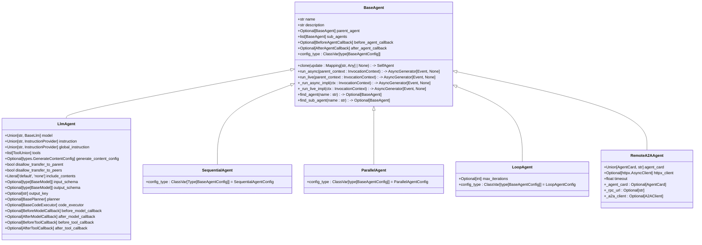
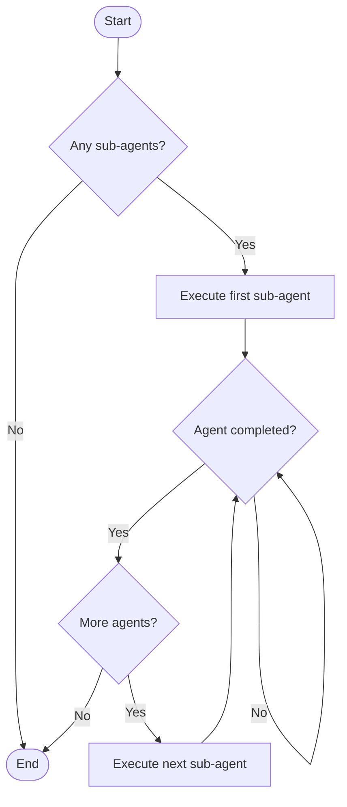
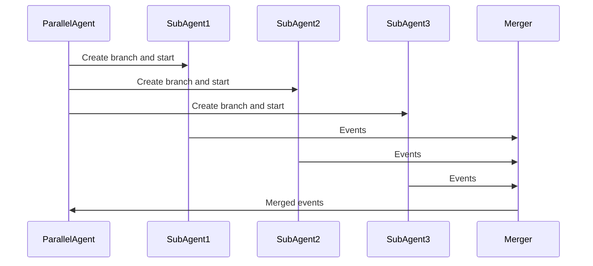
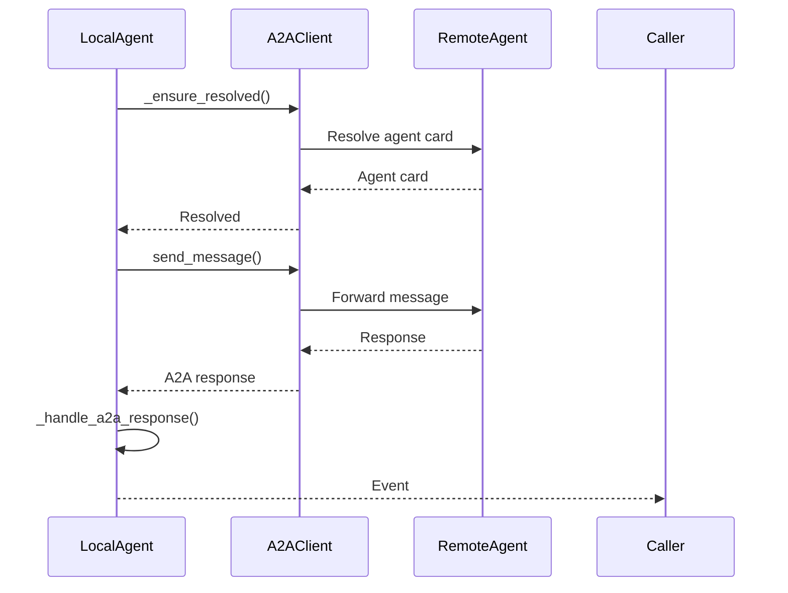

# Agent Classes

<cite>
**Referenced Files in This Document**   
- [base_agent.py](file://src/google/adk/agents/base_agent.py)
- [llm_agent.py](file://src/google/adk/agents/llm_agent.py)
- [sequential_agent.py](file://src/google/adk/agents/sequential_agent.py)
- [parallel_agent.py](file://src/google/adk/agents/parallel_agent.py)
- [loop_agent.py](file://src/google/adk/agents/loop_agent.py)
- [remote_a2a_agent.py](file://src/google/adk/agents/remote_a2a_agent.py)
- [base_agent_config.py](file://src/google/adk/agents/base_agent_config.py)
- [llm_agent_config.py](file://src/google/adk/agents/llm_agent_config.py)
- [sequential_agent_config.py](file://src/google/adk/agents/sequential_agent_config.py)
- [parallel_agent_config.py](file://src/google/adk/agents/parallel_agent_config.py)
- [loop_agent_config.py](file://src/google/adk/agents/loop_agent_config.py)
- [remote_a2a_agent.py](file://src/google/adk/agents/remote_a2a_agent.py)
</cite>

## Table of Contents
1. [Introduction](#introduction)
2. [Inheritance Hierarchy](#inheritance-hierarchy)
3. [BaseAgent](#baseagent)
4. [LlmAgent](#llmagent)
5. [SequentialAgent](#sequentialagent)
6. [ParallelAgent](#parallelagent)
7. [LoopAgent](#loopagent)
8. [RemoteA2AAgent](#remotea2aagent)
9. [Versioning and Compatibility](#versioning-and-compatibility)
10. [Extending Agent Classes](#extending-agent-classes)

## Introduction

The ADK (Agent Development Kit) framework provides a comprehensive agent class hierarchy for building intelligent, modular AI systems. At the core of this framework is the `BaseAgent` class, which serves as the foundation for all specialized agent types. The framework supports various agent patterns including LLM-based agents, sequential workflow agents, parallel processing agents, loop-based iterative agents, and remote A2A (Agent-to-Agent) communication agents.

This documentation provides comprehensive API documentation for all agent classes in the ADK framework, detailing their inheritance hierarchy, methods, properties, lifecycle hooks, and usage patterns. The documentation covers instantiation, configuration, interaction patterns, and extension mechanisms for each agent type.

**Section sources**
- [base_agent.py](file://src/google/adk/agents/base_agent.py#L71-L612)

## Inheritance Hierarchy

The ADK agent framework follows a clear inheritance hierarchy with `BaseAgent` as the root class. All specialized agent types inherit from this base class, extending its functionality for specific use cases.



**Diagram sources**
- [base_agent.py](file://src/google/adk/agents/base_agent.py#L71-L612)
- [llm_agent.py](file://src/google/adk/agents/llm_agent.py#L124-L638)
- [sequential_agent.py](file://src/google/adk/agents/sequential_agent.py#L34-L87)
- [parallel_agent.py](file://src/google/adk/agents/parallel_agent.py#L161-L204)
- [loop_agent.py](file://src/google/adk/agents/loop_agent.py#L37-L93)
- [remote_a2a_agent.py](file://src/google/adk/agents/remote_a2a_agent.py#L101-L545)

## BaseAgent

The `BaseAgent` class is the foundational class for all agents in the ADK framework. It provides core functionality for agent management, including hierarchical organization, lifecycle management, and event handling.

### Properties

- **name**: The agent's name, which must be a valid Python identifier and unique within the agent tree. The name "user" is reserved for end-user input.
- **description**: A one-line description of the agent's capabilities, used by models to determine delegation.
- **parent_agent**: Reference to the parent agent in the hierarchy (set automatically when added as a sub-agent).
- **sub_agents**: List of child agents that this agent manages.
- **before_agent_callback**: Callback or list of callbacks invoked before the agent runs. If a callback returns content, the agent run is skipped.
- **after_agent_callback**: Callback or list of callbacks invoked after the agent runs. If a callback returns content, it replaces the agent's response.

### Methods

- **clone(update: Mapping[str, Any] | None) -> SelfAgent**: Creates a copy of the agent instance with optional field updates. Sub-agents are recursively cloned to prevent shared references.
- **run_async(parent_context: InvocationContext) -> AsyncGenerator[Event, None]**: Entry method for running the agent in text-based conversations, with OpenTelemetry tracing.
- **run_live(parent_context: InvocationContext) -> AsyncGenerator[Event, None]**: Entry method for running the agent in audio/video-based conversations.
- **_run_async_impl(ctx: InvocationContext) -> AsyncGenerator[Event, None]**: Abstract method that must be implemented by subclasses to provide core async functionality.
- **_run_live_impl(ctx: InvocationContext) -> AsyncGenerator[Event, None]**: Abstract method that must be implemented by subclasses to provide core live functionality.
- **find_agent(name: str) -> Optional[BaseAgent]**: Finds an agent by name within this agent and its descendants.
- **find_sub_agent(name: str) -> Optional[BaseAgent]**: Finds an agent by name within this agent's descendants (excluding self).

### Lifecycle Hooks

The `BaseAgent` class implements the agent lifecycle through a series of hooks:

1. **Before callbacks**: Executed via `__handle_before_agent_callback`, which processes both plugin callbacks and canonical callbacks in order.
2. **Core execution**: Delegates to `_run_async_impl` or `_run_live_impl` based on the execution mode.
3. **After callbacks**: Executed via `__handle_after_agent_callback`, which processes both plugin callbacks and canonical callbacks in order.

The `model_post_init` method ensures parent-agent relationships are properly established when agents are instantiated.

**Section sources**
- [base_agent.py](file://src/google/adk/agents/base_agent.py#L71-L612)

## LlmAgent

The `LlmAgent` class extends `BaseAgent` to provide LLM-specific functionality for natural language processing, tool integration, and response generation.

### Properties

- **model**: The LLM model to use, specified as a string identifier or `BaseLlm` instance. If not set, inherits from ancestors.
- **instruction**: Instructions guiding the agent's behavior, either as a string or `InstructionProvider` function.
- **global_instruction**: Instructions applied to all agents in the tree, effective only when set on the root agent.
- **tools**: List of tools available to the agent, supporting functions, `BaseTool` instances, or `BaseToolset` instances.
- **generate_content_config**: Additional content generation configurations (excluding tools and thinking_config).
- **disallow_transfer_to_parent**: Prevents LLM-controlled transfers to the parent agent.
- **disallow_transfer_to_peers**: Prevents LLM-controlled transfers to peer agents.
- **include_contents**: Controls content inclusion in model requests ('default' or 'none').
- **input_schema**: Input schema when the agent is used as a tool.
- **output_schema**: Output schema for agent replies (when set, disables tool usage and agent transfer).
- **output_key**: Session state key to store the agent's output.
- **planner**: Planner for step-by-step execution of complex tasks.
- **code_executor**: Executor for running code blocks from model responses.

### Prompt Handling

The `LlmAgent` class provides sophisticated prompt handling through:

- **canonical_instruction**: Resolves the instruction field, handling both string and `InstructionProvider` types.
- **canonical_global_instruction**: Resolves the global instruction field similarly.
- **_llm_flow**: Determines the appropriate flow (SingleFlow or AutoFlow) based on transfer configurations and sub-agent presence.

### Model Configuration

Model configuration is handled through the `canonical_model` property, which resolves the model field by:
1. Using the model directly if it's a `BaseLlm` instance
2. Creating a new LLM instance via `LLMRegistry` if it's a string identifier
3. Inheriting from ancestor agents if no local model is specified

### Response Generation

Response generation is implemented in `_run_async_impl` and `_run_live_impl`, which delegate to the appropriate LLM flow. The `__maybe_save_output_to_state` method handles output persistence to session state when `output_key` is specified.

### Callbacks

The `LlmAgent` class supports four types of callbacks:

- **before_model_callback**: Invoked before calling the LLM, can mutate the request or return content to skip the call.
- **after_model_callback**: Invoked after receiving the LLM response, can modify or replace the response.
- **before_tool_callback**: Invoked before calling a tool, can return a response to skip the actual tool call.
- **after_tool_callback**: Invoked after a tool call, can modify the tool response.

### Configuration

The `_parse_config` class method handles configuration parsing, resolving tools, callbacks, and other components from YAML configuration. The `_resolve_tools` method specifically handles tool resolution from configuration, supporting built-in tools, user-defined tools, and tool-generating functions.

**Section sources**
- [llm_agent.py](file://src/google/adk/agents/llm_agent.py#L124-L638)

## SequentialAgent

The `SequentialAgent` executes its sub-agents in a defined sequence, one after another.

### Execution Flow

The `SequentialAgent` processes sub-agents in the order they appear in the `sub_agents` list:



### Live Mode Behavior

In live mode (`_run_live_impl`), the `SequentialAgent` enhances LLM-based sub-agents by adding a `task_completed` function to their tool set. This allows the model to signal task completion, enabling the agent to proceed to the next sub-agent in the sequence.

The instruction is automatically updated to guide the model to use this function when its task is complete.

### Configuration

The `SequentialAgent` uses `SequentialAgentConfig` which inherits from `BaseAgentConfig` and specifies the agent class as 'SequentialAgent'. The configuration supports standard agent properties but focuses on the sequential execution pattern.

**Section sources**
- [sequential_agent.py](file://src/google/adk/agents/sequential_agent.py#L34-L87)

## ParallelAgent

The `ParallelAgent` executes its sub-agents concurrently in isolated environments.

### Execution Flow

The `ParallelAgent` creates isolated branches for each sub-agent and processes them in parallel:



### Sub-Agent Management

Each sub-agent runs in an isolated branch created by `_create_branch_ctx_for_sub_agent`, which appends the agent hierarchy to the invocation context's branch path. This ensures proper event routing and state isolation.

### Error Propagation

Error handling is implemented through the `_merge_agent_run` function (and `_merge_agent_run_pre_3_11` for Python < 3.11), which:

1. Uses a queue to coordinate event processing
2. Ensures events are processed sequentially by the upstream runner
3. Propagates exceptions from individual agent tasks
4. Properly cleans up resources when the agent run completes

The implementation uses `asyncio.TaskGroup` for Python 3.11+ and a custom implementation for earlier versions.

### Configuration

The `ParallelAgent` uses `ParallelAgentConfig` which inherits from `BaseAgentConfig` and specifies the agent class as 'ParallelAgent'. The configuration supports standard agent properties with the parallel execution pattern.

**Section sources**
- [parallel_agent.py](file://src/google/adk/agents/parallel_agent.py#L161-L204)

## LoopAgent

The `LoopAgent` repeatedly executes its sub-agents in a loop until a termination condition is met.

### Iteration Control

The `LoopAgent` controls iterations through:

- **max_iterations**: Maximum number of loop iterations (if not set, runs indefinitely until escalation)
- **escalation detection**: Monitors for `escalate` actions in event responses

### Termination Conditions

The loop terminates when either:
1. The maximum number of iterations is reached (if `max_iterations` is set)
2. A sub-agent generates an event with `escalate=True`

### State Persistence

The `LoopAgent` maintains state across iterations through the shared session context. Each iteration has access to the complete history of previous iterations, enabling progressive refinement of responses.

### Configuration

The `LoopAgent` uses `LoopAgentConfig` which extends `BaseAgentConfig` with the `max_iterations` property. The `_parse_config` method handles configuration parsing, specifically extracting the `max_iterations` value from the configuration.

**Section sources**
- [loop_agent.py](file://src/google/adk/agents/loop_agent.py#L37-L93)

## RemoteA2AAgent

The `RemoteA2AAgent` facilitates communication with remote agents using the A2A (Agent-to-Agent) protocol.

### A2A Protocol Integration

The agent supports multiple methods for specifying the remote agent:
1. Direct `AgentCard` object
2. URL to agent card JSON
3. File path to agent card JSON

### Event Serialization

Event serialization and deserialization is handled through converter modules:
- `convert_event_to_a2a_message`: Converts local events to A2A messages
- `convert_a2a_message_to_event`: Converts A2A messages to local events
- `convert_a2a_task_to_event`: Converts A2A tasks to local events
- `convert_genai_part_to_a2a_part`: Converts content parts between formats

### Cross-Agent Communication

The communication flow involves:



### Resource Management

The agent implements proper resource management:
- HTTP client lifecycle management with automatic creation and cleanup
- Connection pooling when a shared client is provided
- Timeout configuration with default of 600 seconds
- Error handling and logging for network operations

### Configuration

The `RemoteA2AAgent` is configured through its constructor parameters rather than a configuration class, as it's designed for programmatic use. Key parameters include the agent card reference, HTTP client, and timeout settings.

**Section sources**
- [remote_a2a_agent.py](file://src/google/adk/agents/remote_a2a_agent.py#L101-L545)

## Versioning and Compatibility

The ADK framework follows semantic versioning as indicated in `version.py` (__version__ = "1.12.0"). The framework maintains backwards compatibility for public methods through several mechanisms:

### Deprecation Policies

- Experimental features are marked with the `@experimental` decorator
- Deprecated methods are documented with deprecation warnings
- Backwards compatibility is maintained for at least two minor version cycles

### API Stability

Public APIs are considered stable unless marked as experimental. The following are considered public and stable:
- All methods and properties documented in this guide
- Configuration schema interfaces
- Agent lifecycle methods (`run_async`, `run_live`)

### Breaking Changes

Breaking changes are limited to major version increments and are accompanied by:
- Comprehensive migration guides
- Deprecation warnings in prior versions
- Alternative implementations where possible

**Section sources**
- [version.py](file://src/google/adk/version.py#L15-L17)

## Extending Agent Classes

The ADK framework supports extension of agent classes through several mechanisms.

### Overriding Core Behaviors

To create custom agent types, extend the appropriate base class and override key methods:

```python
class CustomAgent(BaseAgent):
    config_type: ClassVar[type[BaseAgentConfig]] = CustomAgentConfig
    
    async def _run_async_impl(self, ctx: InvocationContext) -> AsyncGenerator[Event, None]:
        # Custom implementation
        pass
```

### Custom Configuration

Create custom configuration classes by extending `BaseAgentConfig`:

```python
class CustomAgentConfig(BaseAgentConfig):
    custom_property: str = Field(default="", description="Custom property")
    
    model_config = ConfigDict(
        extra='forbid',
    )
    
    agent_class: Literal['CustomAgent'] = Field(
        default='CustomAgent',
        description='The value is used to uniquely identify the CustomAgent class.',
    )
```

### Lifecycle Hook Integration

Integrate with the agent lifecycle by implementing:
- `before_agent_callback` and `after_agent_callback` for pre/post processing
- Custom validation with `model_validator` and `field_validator`
- Initialization logic in `model_post_init`

### Best Practices

When extending agent classes:
1. Always set the appropriate `config_type`
2. Use `clone()` for creating agent copies to maintain proper hierarchy
3. Respect the async generator pattern for event streaming
4. Handle errors gracefully and provide meaningful error messages
5. Use OpenTelemetry tracing for performance monitoring

**Section sources**
- [base_agent.py](file://src/google/adk/agents/base_agent.py#L71-L612)
- [llm_agent.py](file://src/google/adk/agents/llm_agent.py#L124-L638)