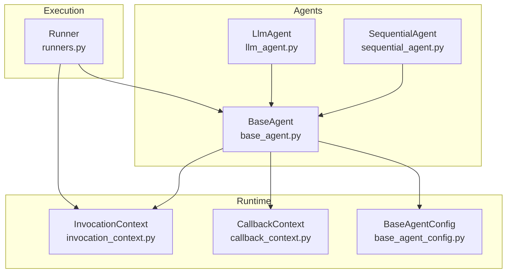
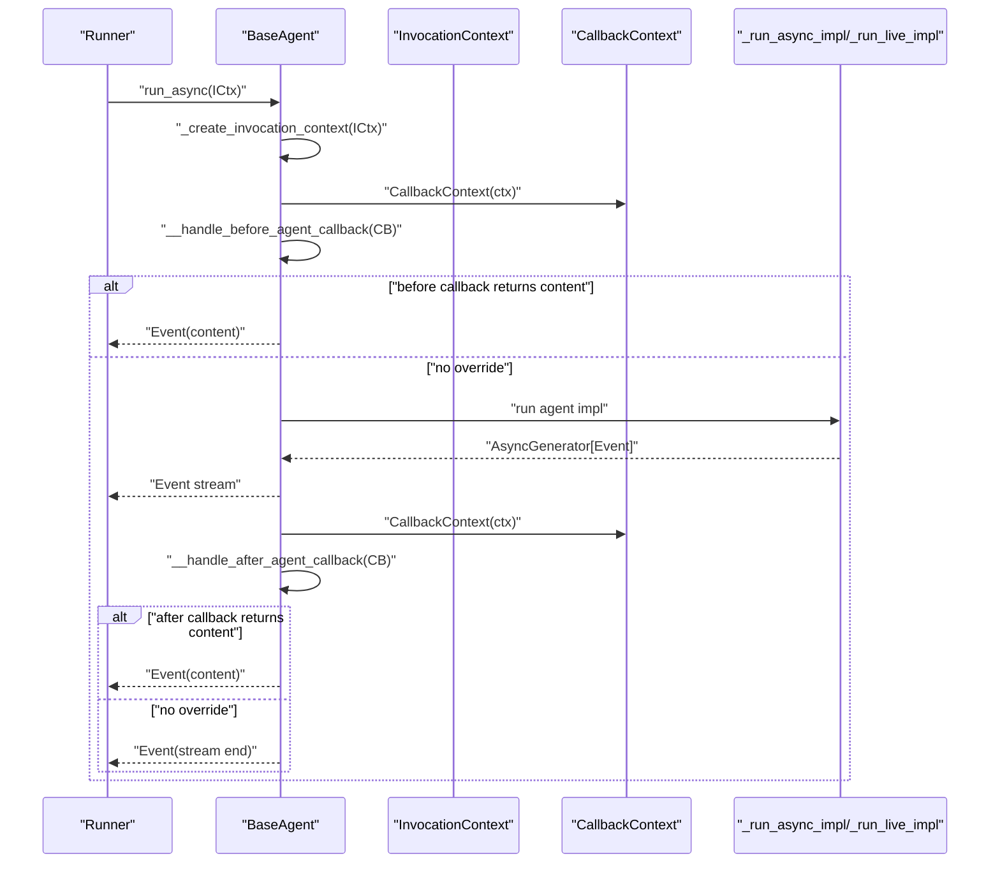
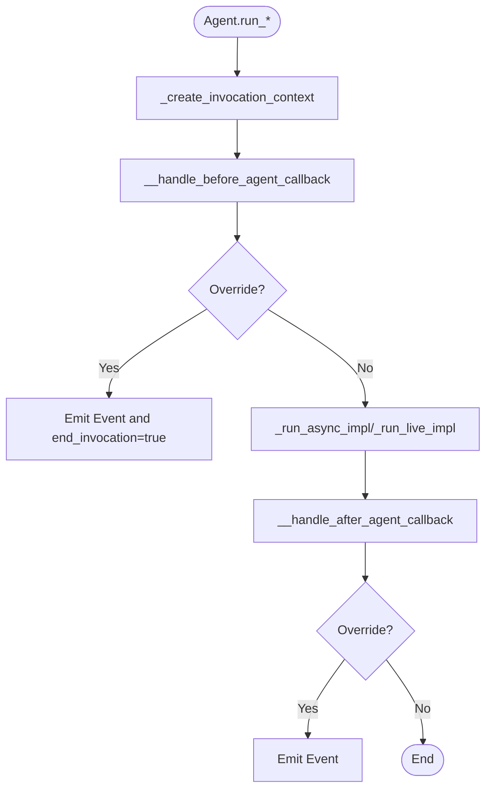
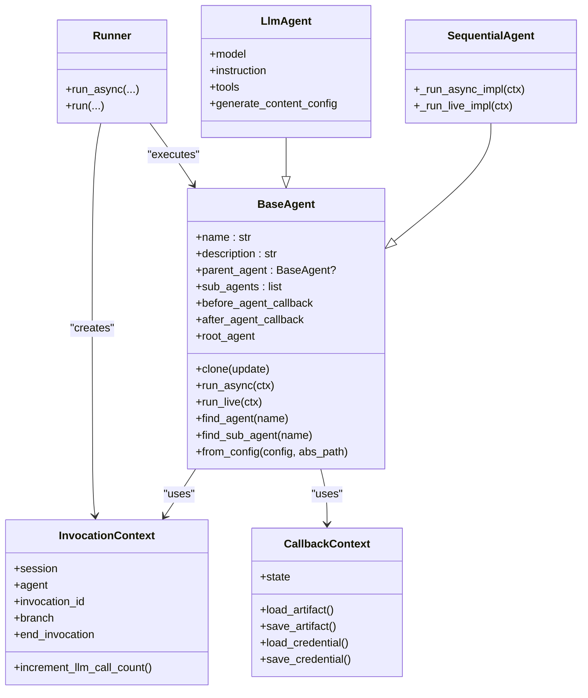

# BaseAgent

<cite>
**Referenced Files in This Document**
- [base_agent.py](file://src/google/adk/agents/base_agent.py)
- [invocation_context.py](file://src/google/adk/agents/invocation_context.py)
- [callback_context.py](file://src/google/adk/agents/callback_context.py)
- [base_agent_config.py](file://src/google/adk/agents/base_agent_config.py)
- [sequential_agent.py](file://src/google/adk/agents/sequential_agent.py)
- [llm_agent.py](file://src/google/adk/agents/llm_agent.py)
- [runners.py](file://src/google/adk/runners.py)
- [my_agents.py](file://contributing/samples/core_custom_agent_config/my_agents.py)
</cite>

## Table of Contents
1. [Introduction](#introduction)
2. [Project Structure](#project-structure)
3. [Core Components](#core-components)
4. [Architecture Overview](#architecture-overview)
5. [Detailed Component Analysis](#detailed-component-analysis)
6. [Dependency Analysis](#dependency-analysis)
7. [Performance Considerations](#performance-considerations)
8. [Troubleshooting Guide](#troubleshooting-guide)
9. [Conclusion](#conclusion)
10. [Appendices](#appendices)

## Introduction
BaseAgent is the foundational component of all agents in the ADK framework. It defines the core lifecycle, state handling, and integration points with the runner and session systems. This document explains the primary methods (__init__ via Pydantic model construction, run_async, run_live, and internal hooks), abstract methods that subclasses must implement, lifecycle management, configuration-driven instantiation, and practical guidance for extending BaseAgent to create custom agent types.

## Project Structure
BaseAgent resides in the agents package and collaborates with:
- InvocationContext: runtime context for a single agent invocation
- CallbackContext: context for before/after agent callbacks
- BaseAgentConfig: YAML-backed configuration schema for agents
- Runner: orchestrates sessions, events, and agent execution
- Subclasses: LlmAgent, SequentialAgent, and custom agents

**Diagram sources**
- [base_agent.py](file://src/google/adk/agents/base_agent.py#L71-L120)
- [sequential_agent.py](file://src/google/adk/agents/sequential_agent.py#L34-L87)
- [llm_agent.py](file://src/google/adk/agents/llm_agent.py#L124-L200)
- [invocation_context.py](file://src/google/adk/agents/invocation_context.py#L92-L188)
- [callback_context.py](file://src/google/adk/agents/callback_context.py#L34-L65)
- [base_agent_config.py](file://src/google/adk/agents/base_agent_config.py#L36-L82)
- [runners.py](file://src/google/adk/runners.py#L59-L120)

**Section sources**
- [base_agent.py](file://src/google/adk/agents/base_agent.py#L71-L120)
- [sequential_agent.py](file://src/google/adk/agents/sequential_agent.py#L34-L87)
- [llm_agent.py](file://src/google/adk/agents/llm_agent.py#L124-L200)
- [invocation_context.py](file://src/google/adk/agents/invocation_context.py#L92-L188)
- [callback_context.py](file://src/google/adk/agents/callback_context.py#L34-L65)
- [base_agent_config.py](file://src/google/adk/agents/base_agent_config.py#L36-L82)
- [runners.py](file://src/google/adk/runners.py#L59-L120)

## Core Components
- BaseAgent: central agent base class with lifecycle, callbacks, cloning, and configuration-driven construction
- InvocationContext: encapsulates invocation-scoped resources and state
- CallbackContext: provides state and artifact/credential helpers for callbacks
- BaseAgentConfig: YAML schema for agent configuration
- Runner: session orchestration and agent execution entry point

Key responsibilities:
- Lifecycle: run_async, run_live, internal _run_async_impl/_run_live_impl
- State: session state via CallbackContext, branch propagation, end_invocation flag
- Integration: runner, session, artifacts, credentials, memory, plugins
- Configuration: from_config, _parse_config, __create_kwargs

**Section sources**
- [base_agent.py](file://src/google/adk/agents/base_agent.py#L151-L212)
- [base_agent.py](file://src/google/adk/agents/base_agent.py#L213-L317)
- [base_agent.py](file://src/google/adk/agents/base_agent.py#L318-L352)
- [base_agent.py](file://src/google/adk/agents/base_agent.py#L353-L383)
- [base_agent.py](file://src/google/adk/agents/base_agent.py#L384-L500)
- [base_agent.py](file://src/google/adk/agents/base_agent.py#L501-L612)
- [invocation_context.py](file://src/google/adk/agents/invocation_context.py#L92-L188)
- [callback_context.py](file://src/google/adk/agents/callback_context.py#L34-L149)
- [base_agent_config.py](file://src/google/adk/agents/base_agent_config.py#L36-L82)
- [runners.py](file://src/google/adk/runners.py#L180-L260)

## Architecture Overview
The BaseAgent lifecycle integrates with the Runner and InvocationContext to produce a stream of Events. Callbacks can short-circuit execution and mutate state.

**Diagram sources**
- [base_agent.py](file://src/google/adk/agents/base_agent.py#L213-L317)
- [base_agent.py](file://src/google/adk/agents/base_agent.py#L384-L500)
- [invocation_context.py](file://src/google/adk/agents/invocation_context.py#L92-L188)
- [callback_context.py](file://src/google/adk/agents/callback_context.py#L34-L65)

## Detailed Component Analysis

### BaseAgent API Reference
- Initialization and configuration
  - Constructor: created via Pydantic model construction; supports config-driven instantiation via from_config
  - Fields:
    - name: string, validated as a Python identifier and not equal to "user"
    - description: string
    - parent_agent: Optional[BaseAgent]
    - sub_agents: list[BaseAgent]
    - before_agent_callback: Optional[BeforeAgentCallback]
    - after_agent_callback: Optional[AfterAgentCallback]
  - ClassVar:
    - config_type: ClassVar[type[BaseAgentConfig]] must be overridden by subclasses
- Lifecycle methods
  - run_async(parent_context: InvocationContext) -> AsyncGenerator[Event, None]
  - run_live(parent_context: InvocationContext) -> AsyncGenerator[Event, None]
  - Internal hooks:
    - _run_async_impl(ctx: InvocationContext) -> AsyncGenerator[Event, None]
    - _run_live_impl(ctx: InvocationContext) -> AsyncGenerator[Event, None]
- Utilities
  - clone(update: Mapping[str, Any] | None = None) -> Self
  - find_agent(name: str) -> Optional[BaseAgent]
  - find_sub_agent(name: str) -> Optional[BaseAgent]
  - root_agent property
  - _create_invocation_context(parent_context: InvocationContext) -> InvocationContext
  - canonical_before_agent_callbacks, canonical_after_agent_callbacks properties
  - from_config, _parse_config, __create_kwargs
- Validation and state
  - model_post_init and field_validator for name
  - end_invocation flag in InvocationContext controls early termination

Behavioral guarantees:
- run_async/run_live wrap agent execution in tracing spans and manage callback execution
- Callbacks can return content to short-circuit execution or mutate state via CallbackContext
- Sub-agent parent assignment is enforced during post-init

**Section sources**
- [base_agent.py](file://src/google/adk/agents/base_agent.py#L71-L120)
- [base_agent.py](file://src/google/adk/agents/base_agent.py#L151-L212)
- [base_agent.py](file://src/google/adk/agents/base_agent.py#L213-L317)
- [base_agent.py](file://src/google/adk/agents/base_agent.py#L318-L352)
- [base_agent.py](file://src/google/adk/agents/base_agent.py#L353-L383)
- [base_agent.py](file://src/google/adk/agents/base_agent.py#L384-L500)
- [base_agent.py](file://src/google/adk/agents/base_agent.py#L501-L612)

### InvocationContext and CallbackContext
- InvocationContext
  - Holds session, agent, invocation_id, branch, end_invocation, and services (artifact, memory, credential, session)
  - Provides increment_llm_call_count with limit enforcement
- CallbackContext
  - Wraps InvocationContext and exposes a delta-aware State
  - Provides artifact/credential helpers and event actions

These contexts are the backbone of state handling and integration with external services.

**Section sources**
- [invocation_context.py](file://src/google/adk/agents/invocation_context.py#L92-L188)
- [invocation_context.py](file://src/google/adk/agents/invocation_context.py#L197-L218)
- [callback_context.py](file://src/google/adk/agents/callback_context.py#L34-L149)

### Configuration-Driven Construction
- BaseAgentConfig defines YAML schema for agent configuration
- BaseAgent.from_config constructs agents from config using:
  - __create_kwargs: resolves sub_agents and callbacks
  - _parse_config: subclass hook to inject custom fields

Subclass example:
- MyCustomAgent overrides config_type and _parse_config to populate custom fields, then implements _run_async_impl to emit events.

**Section sources**
- [base_agent_config.py](file://src/google/adk/agents/base_agent_config.py#L36-L82)
- [base_agent.py](file://src/google/adk/agents/base_agent.py#L533-L612)
- [my_agents.py](file://contributing/samples/core_custom_agent_config/my_agents.py#L38-L71)

### Subclassing Patterns and Abstract Methods
- Abstract methods to implement in subclasses:
  - _run_async_impl(ctx: InvocationContext) -> AsyncGenerator[Event, None]
  - _run_live_impl(ctx: InvocationContext) -> AsyncGenerator[Event, None]
- Concrete examples:
  - SequentialAgent: iterates sub_agents and yields their events
  - LlmAgent: integrates with flows, tools, and planner (see llm_agent.py)

Best practices:
- Override _parse_config to map config fields to agent attributes
- Implement _run_async_impl/_run_live_impl to produce Event stream
- Use InvocationContext for session, artifacts, and services
- Respect end_invocation to honor early termination from callbacks/tools

**Section sources**
- [base_agent.py](file://src/google/adk/agents/base_agent.py#L286-L317)
- [sequential_agent.py](file://src/google/adk/agents/sequential_agent.py#L34-L87)
- [llm_agent.py](file://src/google/adk/agents/llm_agent.py#L124-L200)

### Lifecycle and Control Flow

**Diagram sources**
- [base_agent.py](file://src/google/adk/agents/base_agent.py#L213-L317)
- [base_agent.py](file://src/google/adk/agents/base_agent.py#L384-L500)

## Dependency Analysis
- BaseAgent depends on:
  - InvocationContext for runtime context
  - CallbackContext for callback state
  - BaseAgentConfig for configuration
  - Event for emitting results
- Subclasses:
  - SequentialAgent depends on BaseAgent and yields sub-agent streams
  - LlmAgent depends on BaseAgent and integrates flows/tools
- Runner composes BaseAgent with services and drives execution

**Diagram sources**
- [base_agent.py](file://src/google/adk/agents/base_agent.py#L71-L120)
- [sequential_agent.py](file://src/google/adk/agents/sequential_agent.py#L34-L87)
- [llm_agent.py](file://src/google/adk/agents/llm_agent.py#L124-L200)
- [invocation_context.py](file://src/google/adk/agents/invocation_context.py#L92-L188)
- [callback_context.py](file://src/google/adk/agents/callback_context.py#L34-L149)
- [runners.py](file://src/google/adk/runners.py#L180-L260)

**Section sources**
- [base_agent.py](file://src/google/adk/agents/base_agent.py#L71-L120)
- [sequential_agent.py](file://src/google/adk/agents/sequential_agent.py#L34-L87)
- [llm_agent.py](file://src/google/adk/agents/llm_agent.py#L124-L200)
- [invocation_context.py](file://src/google/adk/agents/invocation_context.py#L92-L188)
- [callback_context.py](file://src/google/adk/agents/callback_context.py#L34-L149)
- [runners.py](file://src/google/adk/runners.py#L180-L260)

## Performance Considerations
- Streaming events: BaseAgent yields Event objects; ensure generators are closed promptly to release resources
- Callback overhead: before/after callbacks are executed sequentially; keep them lightweight
- Invocation limits: InvocationContext.increment_llm_call_count enforces max_llm_calls; tune RunConfig accordingly
- Cloning cost: clone copies lists and recursively clones sub-agents; avoid frequent deep cloning in hot paths
- Tracing: run_async wraps execution in a tracing span; keep spans short-lived to minimize overhead

[No sources needed since this section provides general guidance]

## Troubleshooting Guide
Common issues and resolutions:
- Invalid agent name
  - Symptom: ValueError raised during model_post_init
  - Cause: name is not a valid Python identifier or equals "user"
  - Resolution: Use a valid identifier and avoid reserved "user"
- Sub-agent parent already set
  - Symptom: ValueError indicating agent already has a parent
  - Cause: attempting to add an agent that is already a child of another agent
  - Resolution: Create separate instances for reuse or restructure agent tree
- Early termination
  - Symptom: Invocation ends before agent completes
  - Cause: end_invocation set to True by callbacks or tools
  - Resolution: Inspect CallbackContext state and event actions; unset end_invocation if unintended
- Callback signature mismatch
  - Symptom: Runtime errors when invoking callbacks
  - Cause: callback not named callback_context
  - Resolution: Ensure callback signature accepts callback_context
- LLM call limit exceeded
  - Symptom: LlmCallsLimitExceededError
  - Cause: exceeding max_llm_calls in RunConfig
  - Resolution: Increase limit or refactor agent logic to reduce calls

**Section sources**
- [base_agent.py](file://src/google/adk/agents/base_agent.py#L501-L532)
- [base_agent.py](file://src/google/adk/agents/base_agent.py#L384-L500)
- [invocation_context.py](file://src/google/adk/agents/invocation_context.py#L39-L42)
- [invocation_context.py](file://src/google/adk/agents/invocation_context.py#L197-L218)

## Conclusion
BaseAgent provides a robust foundation for agent development in the ADK framework. By implementing the required abstract methods, leveraging configuration-driven construction, and integrating with InvocationContext and CallbackContext, developers can build flexible, testable, and maintainable agents. Follow the subclassing patterns demonstrated by SequentialAgent and LlmAgent, and adhere to the lifecycle and state-handling guidelines to ensure predictable behavior.

[No sources needed since this section summarizes without analyzing specific files]

## Appendices

### API Summary: BaseAgent
- clone(update: Mapping[str, Any] | None = None) -> Self
  - Creates a copy of the agent instance; validates allowed fields and recursively clones sub-agents
- run_async(parent_context: InvocationContext) -> AsyncGenerator[Event, None]
  - Entry point for text-based conversations; manages tracing, callbacks, and agent impl
- run_live(parent_context: InvocationContext) -> AsyncGenerator[Event, None]
  - Entry point for live (audio/video) conversations; similar flow to run_async
- _run_async_impl(ctx: InvocationContext) -> AsyncGenerator[Event, None]
  - Abstract; implement to define agent behavior for text-based runs
- _run_live_impl(ctx: InvocationContext) -> AsyncGenerator[Event, None]
  - Abstract; implement to define agent behavior for live runs
- find_agent(name: str) -> Optional[BaseAgent]
- find_sub_agent(name: str) -> Optional[BaseAgent]
- root_agent property
- _create_invocation_context(parent_context: InvocationContext) -> InvocationContext
- canonical_before_agent_callbacks, canonical_after_agent_callbacks properties
- from_config(config: BaseAgentConfig, config_abs_path: str) -> Self
- _parse_config(config: BaseAgentConfig, config_abs_path: str, kwargs: Dict[str, Any]) -> Dict[str, Any]
- __create_kwargs(config: BaseAgentConfig, config_abs_path: str) -> Dict[str, Any]

**Section sources**
- [base_agent.py](file://src/google/adk/agents/base_agent.py#L151-L212)
- [base_agent.py](file://src/google/adk/agents/base_agent.py#L213-L317)
- [base_agent.py](file://src/google/adk/agents/base_agent.py#L318-L352)
- [base_agent.py](file://src/google/adk/agents/base_agent.py#L353-L383)
- [base_agent.py](file://src/google/adk/agents/base_agent.py#L384-L500)
- [base_agent.py](file://src/google/adk/agents/base_agent.py#L533-L612)

### Example: Creating a Custom Agent
Steps:
1. Define a custom config class extending BaseAgentConfig
2. Create a subclass of BaseAgent
3. Override config_type to point to your config class
4. Optionally override _parse_config to map config fields
5. Implement _run_async_impl (and optionally _run_live_impl)
6. Instantiate via BaseAgent.from_config or directly

Reference implementation:
- MyCustomAgent demonstrates config_type override, _parse_config, and _run_async_impl

**Section sources**
- [my_agents.py](file://contributing/samples/core_custom_agent_config/my_agents.py#L38-L71)
- [base_agent.py](file://src/google/adk/agents/base_agent.py#L533-L612)