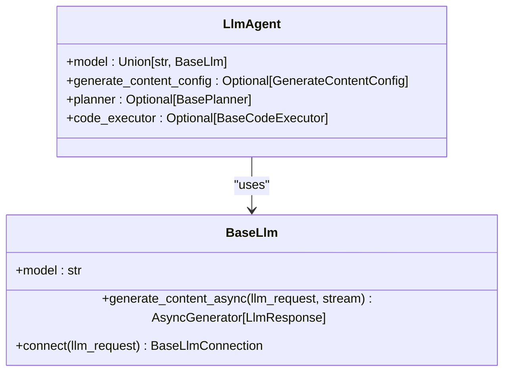
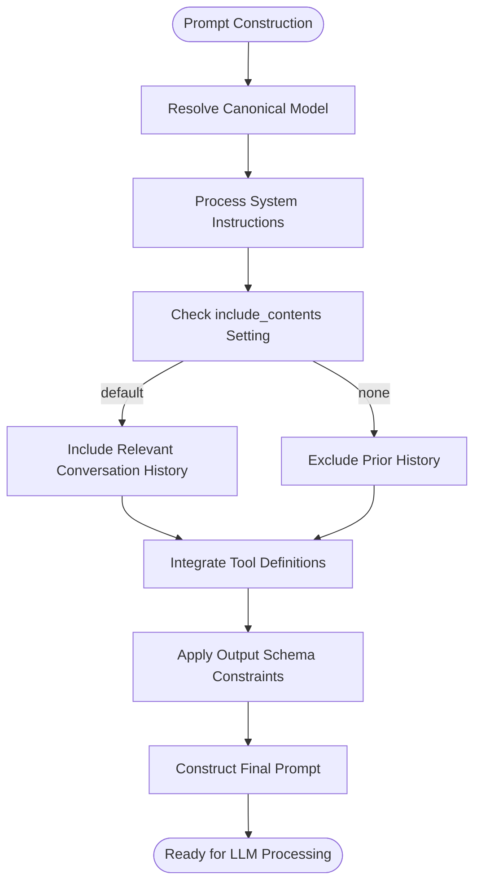
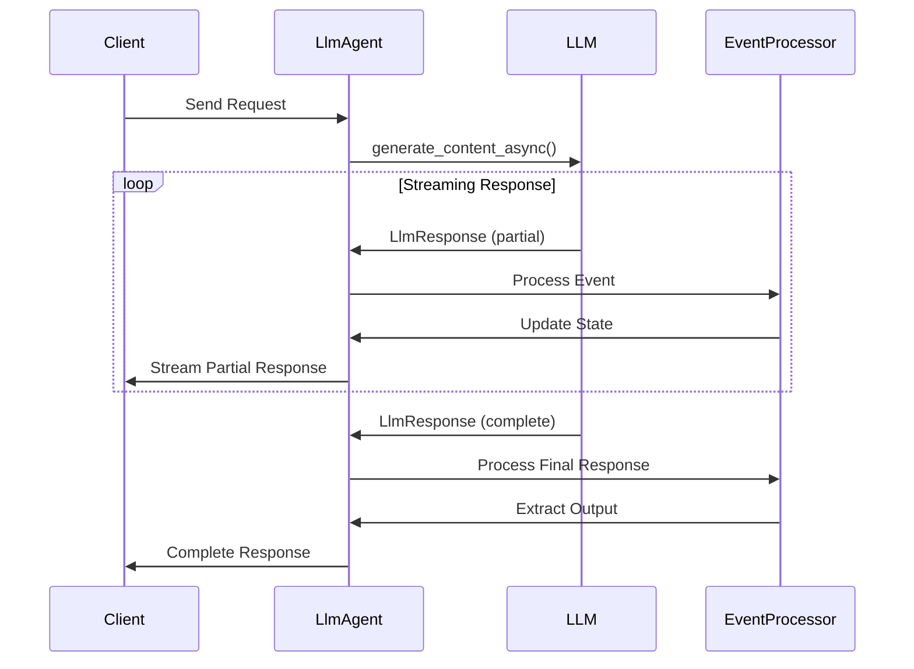
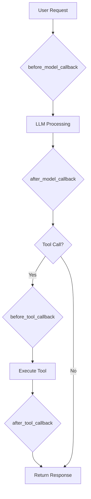

# LlmAgent

<cite>
**Referenced Files in This Document**   
- [llm_agent.py](file://src/google/adk/agents/llm_agent.py)
- [llm_agent_config.py](file://src/google/adk/agents/llm_agent_config.py)
- [base_llm.py](file://src/google/adk/models/base_llm.py)
- [llm_request.py](file://src/google/adk/models/llm_request.py)
- [llm_response.py](file://src/google/adk/models/llm_response.py)
- [auto_flow.py](file://src/google/adk/flows/llm_flows/auto_flow.py)
- [single_flow.py](file://src/google/adk/flows/llm_flows/single_flow.py)
- [agent.py](file://contributing/samples/adk_answering_agent/agent.py)
- [agent.py](file://contributing/samples/hello_world_gemini_cli_codeassist/agent.py)
- [agent.py](file://contributing/samples/hello_world_anthropic/agent.py)
</cite>

## Table of Contents
1. [Introduction](#introduction)
2. [Initialization Parameters](#initialization-parameters)
3. [Prompt Construction and Context Management](#prompt-construction-and-context-management)
4. [Response Handling and Streaming](#response-handling-and-streaming)
5. [Tool Integration and Safety Filters](#tool-integration-and-safety-filters)
6. [Error Handling and Fallback Strategies](#error-handling-and-fallback-strategies)
7. [Performance Considerations](#performance-considerations)
8. [Configuration Examples](#configuration-examples)

## Introduction

The LlmAgent class serves as the primary interface for LLM-powered agents within the ADK framework, providing a comprehensive API for building intelligent agents with advanced capabilities. As a core component of the Agent Development Kit, LlmAgent enables developers to create sophisticated AI agents that can interact with users, execute tools, manage conversations, and integrate with various LLM providers.

The LlmAgent class extends BaseAgent and provides specialized functionality for working with Large Language Models. It offers a flexible configuration system that allows for fine-tuning of model behavior, tool integration, and conversation flow. The agent supports multiple LLM providers including Gemini, Anthropic, and others through a pluggable model architecture.

Key features of the LlmAgent include:
- Support for multiple LLM providers through configurable model instances
- Comprehensive tool integration system for extending agent capabilities
- Advanced context management for maintaining conversation history
- Streaming response capabilities for real-time interaction
- Robust error handling and safety filtering mechanisms
- Configurable prompt engineering and response parsing
- Performance optimization features for latency and cost management

The agent operates by processing user input through a series of request and response processors that handle authentication, instruction injection, content management, and tool execution. This modular architecture allows for extensibility while maintaining a consistent interface for agent development.

**Section sources**
- [llm_agent.py](file://src/google/adk/agents/llm_agent.py#L124-L638)

## Initialization Parameters

The LlmAgent class provides a comprehensive set of initialization parameters that control its behavior, model configuration, and interaction patterns. These parameters enable fine-grained control over the agent's functionality and can be configured programmatically or through YAML configuration files.

### Model Configuration

The model parameter specifies the LLM to use for the agent, accepting either a string identifier or a BaseLlm instance. When a string is provided, the LLMRegistry creates the appropriate model instance. The model can be inherited from ancestor agents in the agent hierarchy when not explicitly set.



**Diagram sources**
- [llm_agent.py](file://src/google/adk/agents/llm_agent.py#L127-L159)
- [base_llm.py](file://src/google/adk/models/base_llm.py#L31-L130)

### System Instructions

The agent supports multiple levels of instruction configuration:
- **instruction**: Direct instructions for the agent's behavior and response patterns
- **global_instruction**: Instructions that apply to all agents in the agent tree, with only the root agent's global instruction taking effect
- **InstructionProvider**: Callable functions that can dynamically generate instructions based on readonly context

These instructions guide the agent's behavior, personality, and response patterns, allowing for consistent identity across interactions.

### Tool Integrations

The tools parameter accepts a list of tool unions, which can include:
- Callable functions that are automatically wrapped as FunctionTool instances
- BaseTool instances for custom tool implementations
- BaseToolset instances for grouped tool functionality

The tool system enables the agent to extend its capabilities beyond text generation, allowing interaction with external systems, data sources, and specialized functions.

**Section sources**
- [llm_agent.py](file://src/google/adk/agents/llm_agent.py#L127-L219)
- [llm_agent_config.py](file://src/google/adk/agents/llm_agent_config.py#L48-L138)

## Prompt Construction and Context Management

The LlmAgent implements a sophisticated prompt construction system that manages conversation context, instruction injection, and content inclusion according to configurable policies.

### Prompt Construction Process

The prompt construction process follows these steps:
1. Resolve the canonical model from the model parameter or ancestor inheritance
2. Process system instructions from both local and global sources
3. Incorporate conversation history based on the include_contents setting
4. Integrate tool definitions and function declarations
5. Apply output schema constraints when specified

The include_contents parameter controls how conversation history is included in model requests with two options:
- **default**: Model receives relevant conversation history
- **none**: Model receives no prior history, operating solely on current instruction and input



**Diagram sources**
- [llm_agent.py](file://src/google/adk/agents/llm_agent.py#L304-L380)
- [llm_request.py](file://src/google/adk/models/llm_request.py#L79-L123)

### Context Window Management

The LlmAgent manages context through several mechanisms:
- Automatic inheritance of model configuration from ancestor agents
- Configurable content inclusion policies
- Dynamic instruction resolution through InstructionProvider callbacks
- State injection control through bypass_state_injection flags

The context management system ensures that agents maintain appropriate conversation state while preventing context overflow. When output_schema is specified, the agent enforces strict reply-only behavior without tool usage, ensuring predictable response formats.

**Section sources**
- [llm_agent.py](file://src/google/adk/agents/llm_agent.py#L304-L478)
- [llm_request.py](file://src/google/adk/models/llm_request.py#L59-L132)

## Response Handling and Streaming

The LlmAgent provides comprehensive response handling capabilities, including streaming support, response parsing, and event-based processing.

### Response Parsing Mechanisms

The agent processes LLM responses through a structured parsing mechanism that handles both standard text responses and structured output formats. When an output_schema is specified, the agent automatically validates and parses JSON responses into the defined Pydantic model.

The response parsing system includes:
- Automatic detection of final response events
- Text content extraction from response parts
- JSON schema validation and model instantiation
- State delta updates for session management
- Error handling for invalid or malformed responses



**Diagram sources**
- [llm_agent.py](file://src/google/adk/agents/llm_agent.py#L284-L302)
- [llm_response.py](file://src/google/adk/models/llm_response.py#L108-L152)

### Streaming Response Handling

The LlmAgent supports streaming responses through its async generator interface, allowing for real-time interaction with users. The agent implements two primary execution methods:
- _run_async_impl: For standard asynchronous execution
- _run_live_impl: For live bidirectional streaming scenarios

Streaming responses enable low-latency interaction, allowing users to receive partial responses while the LLM is still generating content. The agent handles stream interruption and completion events appropriately, ensuring clean session management.

**Section sources**
- [llm_agent.py](file://src/google/adk/agents/llm_agent.py#L284-L302)
- [llm_response.py](file://src/google/adk/models/llm_response.py#L1-L152)

## Tool Integration and Safety Filters

The LlmAgent provides a comprehensive system for tool integration and safety filtering, enabling secure and controlled interaction with external systems.

### Tool Integration System

The agent supports multiple methods for tool integration:
- Direct function references that are automatically wrapped as FunctionTool instances
- BaseTool instances for custom tool implementations with full control over behavior
- BaseToolset instances for managing groups of related tools
- Dynamic tool creation through factory functions

The tool system resolves tool configurations during agent initialization, supporting both built-in ADK tools and user-defined tools referenced by fully qualified names.

### Safety Filters and Callbacks

The agent implements a robust safety filtering system through four types of callbacks that execute at different stages of the processing pipeline:



**Diagram sources**
- [llm_agent.py](file://src/google/adk/agents/llm_agent.py#L222-L281)
- [llm_agent.py](file://src/google/adk/agents/llm_agent.py#L381-L434)

The callback system provides the following safety mechanisms:
- **before_model_callback**: Intercepts requests before LLM processing, allowing for input validation, moderation, or response short-circuiting
- **after_model_callback**: Processes responses before delivery, enabling output filtering, augmentation, or redirection
- **before_tool_callback**: Validates tool calls before execution, preventing unauthorized or unsafe operations
- **after_tool_callback**: Modifies tool responses before they're returned to the LLM, allowing for response sanitization or enhancement

The generate_content_config parameter also supports direct safety settings configuration, such as disabling harmful content filtering for specific use cases.

**Section sources**
- [llm_agent.py](file://src/google/adk/agents/llm_agent.py#L222-L281)
- [llm_agent_config.py](file://src/google/adk/agents/llm_agent_config.py#L140-L167)

## Error Handling and Fallback Strategies

The LlmAgent implements comprehensive error handling and fallback strategies to ensure robust operation in various failure scenarios.

### Error Handling Mechanisms

The agent handles errors through multiple layers of protection:
- Input validation through Pydantic model validation
- Configuration validation during agent initialization
- Runtime error handling in asynchronous execution
- LLM response error detection and processing

The agent validates configuration parameters during initialization, raising appropriate exceptions for invalid configurations. For example, when output_schema is specified, the agent enforces that agent transfer configurations are disabled to maintain response consistency.

### Fallback Strategies

The LlmAgent implements several fallback strategies:
- Model inheritance: When no model is specified, the agent inherits from ancestor agents
- Callback chaining: Multiple callbacks can be registered, with processing continuing until a callback returns a non-None response
- State preservation: Output can be saved to session state even when using output_schema
- Graceful degradation: When advanced features are unavailable, the agent falls back to basic functionality

The agent also provides mechanisms for custom error handling through callbacks, allowing developers to implement domain-specific error recovery strategies.

**Section sources**
- [llm_agent.py](file://src/google/adk/agents/llm_agent.py#L479-L526)
- [llm_agent.py](file://src/google/adk/agents/llm_agent.py#L483-L505)

## Performance Considerations

The LlmAgent includes several features for optimizing performance, managing latency, and controlling costs.

### Latency Optimization

The agent supports streaming responses to reduce perceived latency, allowing users to receive partial responses while the LLM continues processing. The live request queue system enables bidirectional streaming for interactive applications.

The agent also implements efficient context management, minimizing the amount of data sent to the LLM while preserving essential conversation history. The include_contents parameter allows developers to control the trade-off between context richness and processing speed.

### Cost Management

The agent provides several mechanisms for cost management:
- Token usage monitoring through the LLM's usage metadata
- Configurable model selection for balancing performance and cost
- Efficient context window management to minimize token consumption
- Caching strategies through external systems

The agent's modular architecture allows for integration with cost monitoring and optimization tools, enabling comprehensive cost management for production deployments.

**Section sources**
- [llm_agent.py](file://src/google/adk/agents/llm_agent.py#L284-L302)
- [llm_response.py](file://src/google/adk/models/llm_response.py#L94-L95)

## Configuration Examples

The LlmAgent can be configured for various LLM providers and use cases. Below are examples demonstrating different configuration patterns.

### Gemini Configuration

```python
from google.adk import Agent
from google.adk.models import GeminiCLICodeAssist
from google.adk.tools.mcp_tool import MCPToolset
from google.genai import types

root_agent = Agent(
    model=GeminiCLICodeAssist(model="gemini-2.5-flash"),
    name='hello_codeassist_agent',
    description='Agent with file system capabilities using Gemini CLI CodeAssist',
    instruction="""
      You are a helpful assistant that can:
      1. Roll dice and answer questions about outcomes
      2. Check if numbers are prime
      3. Read and work with files in the workspace
    """,
    tools=[
        roll_die,
        check_prime,
        file_tools,
    ],
    generate_content_config=types.GenerateContentConfig(
        safety_settings=[
            types.SafetySetting(
                category=types.HarmCategory.HARM_CATEGORY_DANGEROUS_CONTENT,
                threshold=types.HarmBlockThreshold.OFF,
            ),
        ]
    ),
)
```

### Anthropic Configuration

```python
from google.adk import Agent
from google.adk.models.anthropic_llm import Claude

root_agent = Agent(
    model=Claude(model="claude-3-5-sonnet-v2@20241022"),
    name="hello_world_agent",
    description="Agent with Anthropic model integration",
    instruction="""
      You roll dice and answer questions about the outcome of the dice rolls.
      You can roll dice of different sizes.
      You can use multiple tools in parallel by calling functions in parallel.
    """,
    tools=[
        roll_die,
        check_prime,
    ],
)
```

### Multi-Tool Configuration

```python
from google.adk import Agent
from adk_answering_agent.gemini_assistant.agent import root_agent as gemini_assistant_agent
from google.adk.tools.agent_tool import AgentTool
from google.adk.tools.vertex_ai_search_tool import VertexAiSearchTool

root_agent = Agent(
    model="gemini-2.5-pro",
    name="adk_answering_agent",
    description="Answer questions about ADK repo",
    instruction=f"""
    You are a helpful assistant that responds to questions from the GitHub repository
    based on information about Google ADK found in the document store.
    
    When user specifies a discussion number, follow these steps:
    1. Use get_discussion_and_comments tool to get discussion details
    2. Use VertexAiSearchTool to find relevant information
    3. Add comments using add_comment_to_discussion tool when appropriate
    """,
    tools=[
        VertexAiSearchTool(data_store_id=VERTEXAI_DATASTORE_ID),
        AgentTool(gemini_assistant_agent),
        get_discussion_and_comments,
        add_comment_to_discussion,
        add_label_to_discussion,
        convert_gcs_links_to_https,
    ],
)
```

**Section sources**
- [agent.py](file://contributing/samples/hello_world_gemini_cli_codeassist/agent.py#L89-L145)
- [agent.py](file://contributing/samples/hello_world_anthropic/agent.py#L62-L91)
- [agent.py](file://contributing/samples/adk_answering_agent/agent.py#L39-L88)