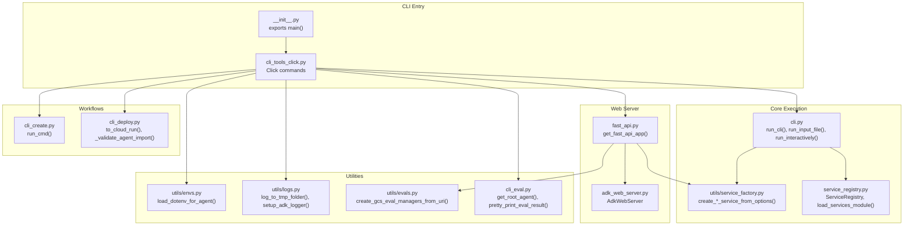
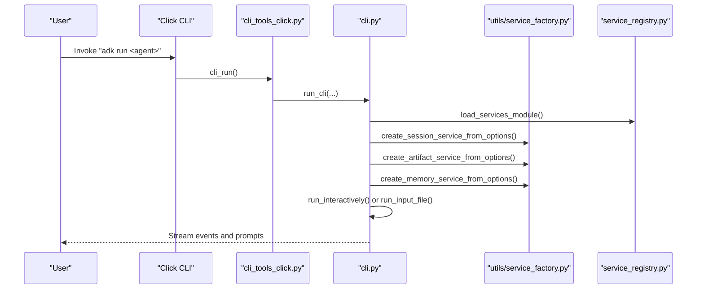
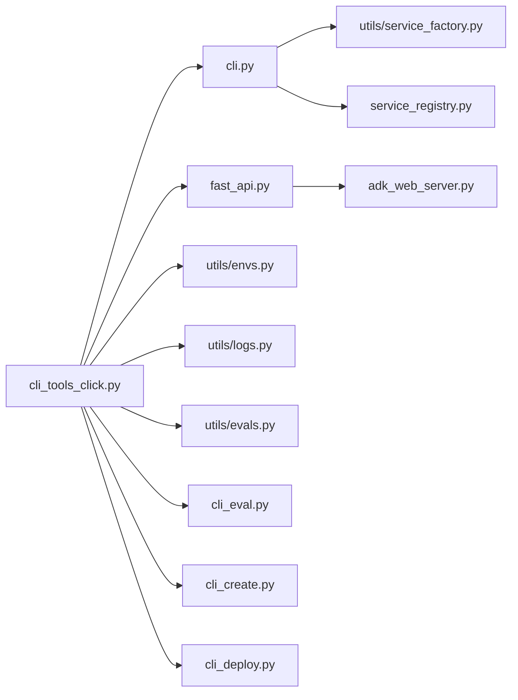

# CLI APIs

<cite>
**Referenced Files in This Document**
- [cli.py](file://src/google/adk/cli/cli.py)
- [cli_tools_click.py](file://src/google/adk/cli/cli_tools_click.py)
- [service_registry.py](file://src/google/adk/cli/service_registry.py)
- [service_factory.py](file://src/google/adk/cli/utils/service_factory.py)
- [envs.py](file://src/google/adk/cli/utils/envs.py)
- [logs.py](file://src/google/adk/cli/utils/logs.py)
- [evals.py](file://src/google/adk/cli/utils/evals.py)
- [cli_eval.py](file://src/google/adk/cli/cli_eval.py)
- [fast_api.py](file://src/google/adk/cli/fast_api.py)
- [adk_web_server.py](file://src/google/adk/cli/adk_web_server.py)
- [cli_create.py](file://src/google/adk/cli/cli_create.py)
- [cli_deploy.py](file://src/google/adk/cli/cli_deploy.py)
- [__init__.py](file://src/google/adk/cli/__init__.py)
</cite>

## Table of Contents
1. [Introduction](#introduction)
2. [Project Structure](#project-structure)
3. [Core Components](#core-components)
4. [Architecture Overview](#architecture-overview)
5. [Detailed Component Analysis](#detailed-component-analysis)
6. [Dependency Analysis](#dependency-analysis)
7. [Performance Considerations](#performance-considerations)
8. [Troubleshooting Guide](#troubleshooting-guide)
9. [Conclusion](#conclusion)
10. [Appendices](#appendices)

## Introduction
This document provides comprehensive API documentation for the CLI framework used to develop, run, evaluate, and deploy ADK agents. It covers:
- CLI command classes and Click integration
- Service registry interfaces and service factory utilities
- Development workflow APIs for local runs, web servers, and deployments
- Command-line argument specifications, option handling, and environment variable behavior
- Debugging capabilities and logging utilities
- Usage examples for building CLI tools around ADK agents

## Project Structure
The CLI subsystem centers around a Click-based CLI entrypoint that orchestrates:
- Interactive CLI runs
- Web server setup with FastAPI
- Evaluation workflows
- Deployment helpers
- Service registration and factory utilities

**Diagram sources**
- [__init__.py](file://src/google/adk/cli/__init__.py#L15-L16)
- [cli_tools_click.py](file://src/google/adk/cli/cli_tools_click.py#L206-L211)
- [cli.py](file://src/google/adk/cli/cli.py#L136-L284)
- [service_factory.py](file://src/google/adk/cli/utils/service_factory.py#L170-L329)
- [service_registry.py](file://src/google/adk/cli/service_registry.py#L163-L215)
- [fast_api.py](file://src/google/adk/cli/fast_api.py#L73-L270)
- [adk_web_server.py](file://src/google/adk/cli/adk_web_server.py#L450-L800)
- [envs.py](file://src/google/adk/cli/utils/envs.py#L53-L91)
- [logs.py](file://src/google/adk/cli/utils/logs.py#L70-L106)
- [evals.py](file://src/google/adk/cli/utils/evals.py#L55-L87)
- [cli_eval.py](file://src/google/adk/cli/cli_eval.py#L89-L101)
- [cli_create.py](file://src/google/adk/cli/cli_create.py#L278-L338)
- [cli_deploy.py](file://src/google/adk/cli/cli_deploy.py#L626-L800)

**Section sources**
- [__init__.py](file://src/google/adk/cli/__init__.py#L15-L16)
- [cli_tools_click.py](file://src/google/adk/cli/cli_tools_click.py#L206-L211)

## Core Components
- CLI command groups and commands:
  - Group: deploy, conformance
  - Commands: create, run, eval
- Core execution:
  - run_cli(): orchestrates agent loading, services, and CLI interaction
  - run_input_file(): replays a session from JSON input
  - run_interactively(): continuous chat loop
- Service registry and factory:
  - ServiceRegistry: registers custom service factories
  - load_services_module(): loads YAML and Python service configs
  - create_*_service_from_options(): resolves service instances from URIs and flags
- Web server:
  - get_fast_api_app(): builds FastAPI app with services and optional web UI
  - AdkWebServer: encapsulates API endpoints, telemetry, and runner lifecycle
- Utilities:
  - envs.load_dotenv_for_agent(): controlled .env loading
  - logs.log_to_tmp_folder(), setup_adk_logger(): logging to file and console
  - evals.create_gcs_eval_managers_from_uri(): evaluation storage managers
  - cli_eval.get_root_agent(), pretty_print_eval_result(): evaluation helpers
- Workflows:
  - cli_create.run_cmd(): scaffolds agent templates
  - cli_deploy.to_cloud_run(): builds and deploys to Cloud Run

**Section sources**
- [cli.py](file://src/google/adk/cli/cli.py#L136-L284)
- [service_registry.py](file://src/google/adk/cli/service_registry.py#L94-L161)
- [service_factory.py](file://src/google/adk/cli/utils/service_factory.py#L170-L329)
- [fast_api.py](file://src/google/adk/cli/fast_api.py#L73-L270)
- [adk_web_server.py](file://src/google/adk/cli/adk_web_server.py#L450-L800)
- [envs.py](file://src/google/adk/cli/utils/envs.py#L53-L91)
- [logs.py](file://src/google/adk/cli/utils/logs.py#L70-L106)
- [evals.py](file://src/google/adk/cli/utils/evals.py#L55-L87)
- [cli_eval.py](file://src/google/adk/cli/cli_eval.py#L89-L101)
- [cli_create.py](file://src/google/adk/cli/cli_create.py#L278-L338)
- [cli_deploy.py](file://src/google/adk/cli/cli_deploy.py#L626-L800)

## Architecture Overview
The CLI integrates Click commands with service factories and the ADK runtime to provide:
- Local interactive runs
- Web-based development server with optional UI
- Evaluation pipelines
- Deployment automation

**Diagram sources**
- [cli_tools_click.py](file://src/google/adk/cli/cli_tools_click.py#L627-L664)
- [cli.py](file://src/google/adk/cli/cli.py#L136-L284)
- [service_factory.py](file://src/google/adk/cli/utils/service_factory.py#L170-L329)
- [service_registry.py](file://src/google/adk/cli/service_registry.py#L163-L215)

## Detailed Component Analysis

### CLI Command Classes and Click Integration
- Groups:
  - deploy: hosting and deployment commands
  - conformance: testing utilities
- Commands:
  - create: scaffolds agent templates
  - run: interactive CLI or replay/resume sessions
  - eval: evaluation pipeline
- Decorators and helpers:
  - HelpfulCommand: shows full help on missing required arguments
  - feature_options(): toggles feature flags via CLI
  - adk_services_options(): standard service URI and local storage flags
  - eval_options(): logging and storage options for eval
  - validate_exclusive(): mutual exclusivity for replay/resume

Usage examples:
- adk create <app_name> [--model ...] [--api_key ...] [--project ...] [--region ...]
- adk run <agent> [--save_session] [--session_id <id>] [--replay <file>|--resume <file>] [--session_service_uri ...] [--artifact_service_uri ...] [--memory_service_uri ...] [--use_local_storage/--no_use_local_storage]
- adk eval <agent_module_file_path> <eval_set_file_or_id ...> [--config_file_path ...] [--print_detailed_results] [--eval_storage_uri ...] [--log_level ...]

**Section sources**
- [cli_tools_click.py](file://src/google/adk/cli/cli_tools_click.py#L206-L800)
- [cli_create.py](file://src/google/adk/cli/cli_create.py#L278-L338)
- [cli_eval.py](file://src/google/adk/cli/cli_eval.py#L89-L101)

### CLI Command Composition and Argument Parsing
Key argument categories:
- Agent selection: positional agent path for run
- Replay/resume: mutually exclusive JSON inputs
- Service URIs: session, artifact, memory
- Local storage: toggle default local .adk storage
- Evaluation: storage URI, log level, detailed results
- Features: enable/disable feature flags

Behavior highlights:
- Mutual exclusion enforced for replay/resume
- Service URIs override default local storage when provided
- Environment variable ADK_DISABLE_LOAD_DOTENV controls .env loading
- Logging can be redirected to a temporary file with symlink to latest

**Section sources**
- [cli_tools_click.py](file://src/google/adk/cli/cli_tools_click.py#L473-L626)
- [cli_tools_click.py](file://src/google/adk/cli/cli_tools_click.py#L667-L800)
- [envs.py](file://src/google/adk/cli/utils/envs.py#L53-L91)
- [logs.py](file://src/google/adk/cli/utils/logs.py#L70-L106)

### Service Registry Interfaces and Registration Patterns
ServiceRegistry:
- Registers factories for session, artifact, and memory services by URI scheme
- Built-in factories for memory, sqlite, postgresql/mysql, gs, file, rag, agentengine
- Dynamic loading via YAML and Python service modules

Registration patterns:
- YAML registration: services.yaml with entries for scheme/type/class
- Python registration: services.py with get_service_registry().register_*_service()

Environment and fallbacks:
- load_services_module() loads YAML then services.py in the agent directory
- Fallback to DatabaseSessionService for unknown schemes
- Strict vs. lenient behavior for unsupported URIs

**Section sources**
- [service_registry.py](file://src/google/adk/cli/service_registry.py#L94-L161)
- [service_registry.py](file://src/google/adk/cli/service_registry.py#L163-L215)
- [service_registry.py](file://src/google/adk/cli/service_registry.py#L218-L442)

### Service Factory Utilities
Responsibilities:
- Resolve effective service instances from CLI options and environment
- Handle Cloud Run/GKE detection and local storage fallbacks
- Redact sensitive parts of URIs for logging

Key functions:
- create_session_service_from_options(): supports explicit URI or local storage
- create_artifact_service_from_options(): supports explicit URI or local storage
- create_memory_service_from_options(): supports explicit URI or in-memory

Environment variables:
- ADK_DISABLE_LOCAL_STORAGE: disables local storage
- ADK_FORCE_LOCAL_STORAGE: forces local storage even in containers
- ADK_DISABLE_LOAD_DOTENV: disables .env loading

**Section sources**
- [service_factory.py](file://src/google/adk/cli/utils/service_factory.py#L170-L329)
- [envs.py](file://src/google/adk/cli/utils/envs.py#L53-L91)

### Development Workflow APIs
- Local interactive runs:
  - run_cli(): orchestrates agent loading, services, and CLI loop
  - run_interactively(): continuous chat loop with streaming events
  - run_input_file(): replay JSON input with initial state and queries
- Web server:
  - get_fast_api_app(): constructs FastAPI app with services, optional UI, CORS, telemetry
  - AdkWebServer: manages runners, endpoints, and lifecycle
- Evaluation:
  - cli_eval helpers: get_root_agent(), pretty_print_eval_result(), parse_and_get_evals_to_run()
  - utils/evals: create GCS eval managers from URI
- Creation and deployment:
  - cli_create.run_cmd(): scaffolds agent templates with .env and root agent
  - cli_deploy.to_cloud_run(): builds Dockerfile, stages agent, and deploys to Cloud Run

**Section sources**
- [cli.py](file://src/google/adk/cli/cli.py#L136-L284)
- [fast_api.py](file://src/google/adk/cli/fast_api.py#L73-L270)
- [adk_web_server.py](file://src/google/adk/cli/adk_web_server.py#L450-L800)
- [cli_eval.py](file://src/google/adk/cli/cli_eval.py#L89-L101)
- [evals.py](file://src/google/adk/cli/utils/evals.py#L55-L87)
- [cli_create.py](file://src/google/adk/cli/cli_create.py#L278-L338)
- [cli_deploy.py](file://src/google/adk/cli/cli_deploy.py#L626-L800)

### CLI Configuration Options and Environment Variable Handling
- Configuration options:
  - --session_service_uri, --artifact_service_uri, --memory_service_uri
  - --use_local_storage/--no_use_local_storage
  - --enable_features, --disable_features
  - --eval_storage_uri, --log_level
- Environment variables:
  - ADK_DISABLE_LOAD_DOTENV: skips .env loading
  - ADK_DISABLE_LOCAL_STORAGE: disables local storage
  - ADK_FORCE_LOCAL_STORAGE: forces local storage
  - GOOGLE_CLOUD_PROJECT, GOOGLE_CLOUD_LOCATION: required for GCP-backed services
  - K_SERVICE, KUBERNETES_SERVICE_HOST: runtime detection for containers

**Section sources**
- [cli_tools_click.py](file://src/google/adk/cli/cli_tools_click.py#L490-L574)
- [envs.py](file://src/google/adk/cli/utils/envs.py#L53-L91)
- [service_factory.py](file://src/google/adk/cli/utils/service_factory.py#L36-L46)

### Debugging Capabilities
- Logging:
  - log_to_tmp_folder(): redirects logs to a temp file and prints symlink instructions
  - setup_adk_logger(): configures root logger format and level
- Telemetry:
  - get_fast_api_app() supports Cloud Trace and OTel exporters
  - AdkWebServer sets up span processors and optional GCP telemetry
- Error handling:
  - HelpfulCommand shows full help on missing required arguments
  - Validation decorators enforce mutual exclusivity and URI correctness
  - Detailed error messages for import failures and unsupported URIs

**Section sources**
- [logs.py](file://src/google/adk/cli/utils/logs.py#L70-L106)
- [fast_api.py](file://src/google/adk/cli/fast_api.py#L213-L234)
- [adk_web_server.py](file://src/google/adk/cli/adk_web_server.py#L345-L433)
- [cli_tools_click.py](file://src/google/adk/cli/cli_tools_click.py#L133-L190)

### Usage Examples
- Interactive run with local storage:
  - adk run ./my_agent
- Replay a session from JSON:
  - adk run ./my_agent --replay ./session.json
- Resume a saved session:
  - adk run ./my_agent --resume ./session.json
- Use explicit service URIs:
  - adk run ./my_agent --session_service_uri sqlite:///db.sqlite3 --artifact_service_uri gs://my-bucket
- Enable features:
  - adk run ./my_agent --enable_features=FEATURE1,FEATURE2
- Evaluate an agent:
  - adk eval ./my_agent/__init__.py eval_set.json --print_detailed_results
- Scaffold a new agent:
  - adk create ./my_new_agent --model gemini-2.5-flash
- Deploy to Cloud Run:
  - adk deploy cloud-run ./my_agent --project my-project --region us-central1 --service-name my-service

**Section sources**
- [cli_tools_click.py](file://src/google/adk/cli/cli_tools_click.py#L627-L664)
- [cli_eval.py](file://src/google/adk/cli/cli_eval.py#L703-L774)
- [cli_create.py](file://src/google/adk/cli/cli_create.py#L278-L338)
- [cli_deploy.py](file://src/google/adk/cli/cli_deploy.py#L626-L800)

## Dependency Analysis
The CLI framework exhibits low coupling between modules, with clear separation of concerns:
- cli_tools_click.py depends on cli.py for execution and on fast_api.py for web server
- cli.py depends on service_factory.py and service_registry.py for service resolution
- fast_api.py depends on adk_web_server.py and utils for services and builders
- Utilities (envs, logs, evals) are consumed across modules

**Diagram sources**
- [cli_tools_click.py](file://src/google/adk/cli/cli_tools_click.py#L206-L211)
- [cli.py](file://src/google/adk/cli/cli.py#L136-L284)
- [service_factory.py](file://src/google/adk/cli/utils/service_factory.py#L170-L329)
- [service_registry.py](file://src/google/adk/cli/service_registry.py#L163-L215)
- [fast_api.py](file://src/google/adk/cli/fast_api.py#L73-L270)
- [adk_web_server.py](file://src/google/adk/cli/adk_web_server.py#L450-L800)
- [envs.py](file://src/google/adk/cli/utils/envs.py#L53-L91)
- [logs.py](file://src/google/adk/cli/utils/logs.py#L70-L106)
- [evals.py](file://src/google/adk/cli/utils/evals.py#L55-L87)
- [cli_eval.py](file://src/google/adk/cli/cli_eval.py#L89-L101)
- [cli_create.py](file://src/google/adk/cli/cli_create.py#L278-L338)
- [cli_deploy.py](file://src/google/adk/cli/cli_deploy.py#L626-L800)

**Section sources**
- [cli_tools_click.py](file://src/google/adk/cli/cli_tools_click.py#L206-L211)
- [cli.py](file://src/google/adk/cli/cli.py#L136-L284)
- [fast_api.py](file://src/google/adk/cli/fast_api.py#L73-L270)

## Performance Considerations
- Local storage fallbacks:
  - In Cloud Run/GKE or unwritable directories, the system falls back to in-memory services to avoid blocking startup
- Lazy service imports:
  - get_fast_api_app() uses lazy imports for optional components to reduce cold-start overhead
- Streaming:
  - run_interactively() streams events, minimizing latency for user feedback
- Logging:
  - Redirecting logs to files reduces stderr overhead in containerized environments

[No sources needed since this section provides general guidance]

## Troubleshooting Guide
Common issues and resolutions:
- Missing required arguments:
  - Use HelpfulCommand to display full help on missing parameters
- Unsupported service URIs:
  - Ensure scheme is registered or use supported schemes (memory, sqlite, postgresql, mysql, gs, file, rag, agentengine)
- Import failures during deployment:
  - _validate_agent_import() catches and surfaces detailed errors for BaseLlm-related issues
- Conflicting gcloud arguments:
  - _validate_gcloud_extra_args() prevents conflicts with ADK-managed flags
- Evaluation dependencies:
  - Missing evaluation dependencies trigger a clear error message

**Section sources**
- [cli_tools_click.py](file://src/google/adk/cli/cli_tools_click.py#L133-L190)
- [cli_deploy.py](file://src/google/adk/cli/cli_deploy.py#L425-L469)
- [cli_deploy.py](file://src/google/adk/cli/cli_deploy.py#L471-L585)
- [cli_eval.py](file://src/google/adk/cli/cli_eval.py#L196-L198)

## Conclusion
The CLI framework provides a cohesive set of APIs for developing, running, evaluating, and deploying ADK agents. It leverages Click for robust command composition, a flexible service registry for pluggable backends, and utilities for environment-driven configuration and logging. The design emphasizes extensibility, clear error handling, and practical development workflows.

[No sources needed since this section summarizes without analyzing specific files]

## Appendices

### API Reference: CLI Commands
- adk create <app_name> [--model ...] [--api_key ...] [--project ...] [--region ...]
- adk run <agent> [--save_session] [--session_id <id>] [--replay <file>|--resume <file>] [--session_service_uri ...] [--artifact_service_uri ...] [--memory_service_uri ...] [--use_local_storage/--no_use_local_storage] [--enable_features ...] [--disable_features ...]
- adk eval <agent_module_file_path> <eval_set_file_or_id ...> [--config_file_path ...] [--print_detailed_results] [--eval_storage_uri ...] [--log_level ...]
- adk deploy cloud-run <agent_folder> [--project ...] [--region ...] [--service-name ...] [--trace-to-cloud] [--otel-to-cloud] [--with-ui] [--allow-origins ...] [--session_service_uri ...] [--artifact_service_uri ...] [--memory_service_uri ...] [--use-local-storage/--no-use-local-storage] [--a2a]

**Section sources**
- [cli_tools_click.py](file://src/google/adk/cli/cli_tools_click.py#L410-L471)
- [cli_tools_click.py](file://src/google/adk/cli/cli_tools_click.py#L576-L664)
- [cli_tools_click.py](file://src/google/adk/cli/cli_tools_click.py#L695-L800)
- [cli_deploy.py](file://src/google/adk/cli/cli_deploy.py#L626-L800)