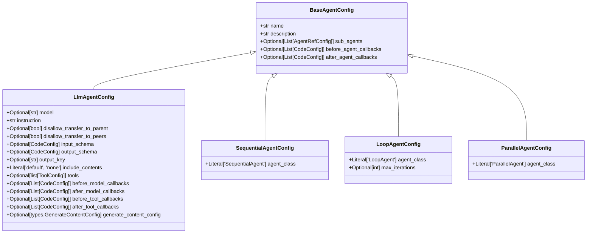
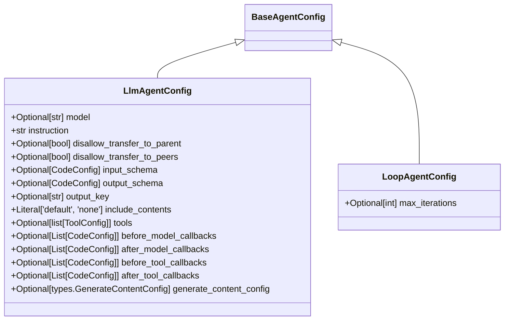
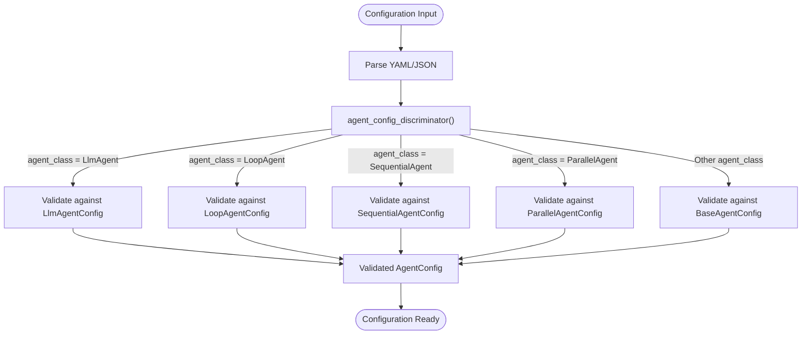
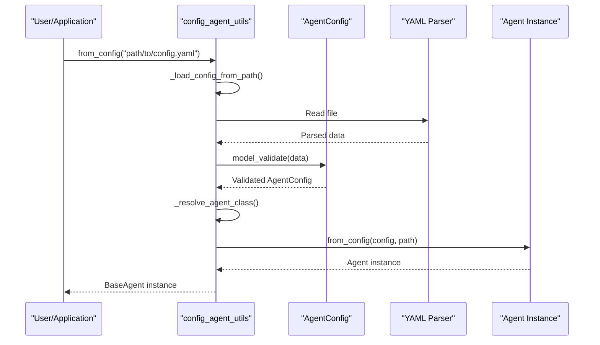
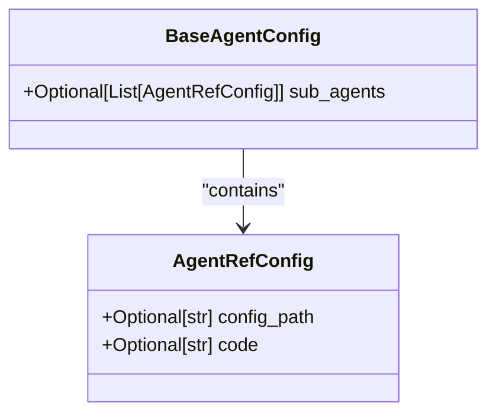
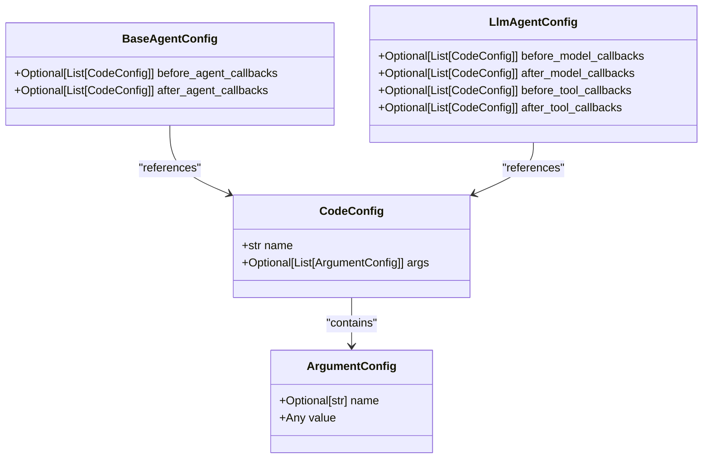

# Agent Configuration

<cite>
**Referenced Files in This Document**   
- [base_agent_config.py](file://src/google/adk/agents/base_agent_config.py)
- [agent_config.py](file://src/google/adk/agents/agent_config.py)
- [llm_agent_config.py](file://src/google/adk/agents/llm_agent_config.py)
- [sequential_agent_config.py](file://src/google/adk/agents/sequential_agent_config.py)
- [loop_agent_config.py](file://src/google/adk/agents/loop_agent_config.py)
- [parallel_agent_config.py](file://src/google/adk/agents/parallel_agent_config.py)
- [common_configs.py](file://src/google/adk/agents/common_configs.py)
- [config_agent_utils.py](file://src/google/adk/agents/config_agent_utils.py)
- [AgentConfig.json](file://src/google/adk/agents/config_schemas/AgentConfig.json)
- [base_agent.py](file://src/google/adk/agents/base_agent.py)
- [root_agent.yaml](file://contributing/samples/core_basic_config/root_agent.yaml)
- [root_agent.yaml](file://contributing/samples/multi_agent_basic_config/root_agent.yaml)
- [root_agent.yaml](file://contributing/samples/core_callback_config/root_agent.yaml)
- [root_agent.yaml](file://contributing/samples/core_custom_agent_config/root_agent.yaml)
</cite>

## Table of Contents
1. [Introduction](#introduction)
2. [Configuration Hierarchy](#configuration-hierarchy)
3. [Base Configuration](#base-configuration)
4. [Specialized Agent Configurations](#specialized-agent-configurations)
5. [Discriminated Unions and Validation](#discriminated-unions-and-validation)
6. [Configuration Loading and Instantiation](#configuration-loading-and-instantiation)
7. [Sub-Agent References](#sub-agent-references)
8. [Callback Configuration](#callback-configuration)
9. [Schema Definition](#schema-definition)
10. [Configuration Examples](#configuration-examples)
11. [Extending Configurations](#extending-configurations)
12. [Best Practices](#best-practices)

## Introduction

The ADK framework provides a comprehensive configuration system for defining and managing agent behavior through YAML/JSON configuration files. This system is built on Pydantic models and leverages discriminated unions to handle different agent types while maintaining type safety and validation. The configuration system enables developers to define agent properties, behaviors, sub-agents, callbacks, and tool integrations in a declarative manner.

This documentation details the hierarchical structure of agent configurations, starting from the base `BaseAgentConfig` and extending to specialized configurations for different agent types. It covers the use of discriminated unions, configuration validation, instantiation from YAML/JSON, and practical examples of configuration composition.

**Section sources**
- [base_agent_config.py](file://src/google/adk/agents/base_agent_config.py#L37-L82)
- [agent_config.py](file://src/google/adk/agents/agent_config.py#L59-L67)

## Configuration Hierarchy

The agent configuration system follows an inheritance hierarchy where specialized agent configurations extend from the base `BaseAgentConfig` class. This hierarchical structure enables code reuse while allowing specific agent types to define their own unique configuration fields.

The configuration hierarchy is as follows:
- `BaseAgentConfig`: The foundational configuration class containing common fields for all agents
- Specialized configurations that inherit from `BaseAgentConfig`:
  - `LlmAgentConfig`: Configuration for language model agents
  - `SequentialAgentConfig`: Configuration for sequential agents
  - `LoopAgentConfig`: Configuration for loop agents
  - `ParallelAgentConfig`: Configuration for parallel agents

This inheritance model ensures that all agents share common properties like name, description, and sub-agent references while allowing specialized agents to define type-specific configuration options.



**Diagram sources **
- [base_agent_config.py](file://src/google/adk/agents/base_agent_config.py#L37-L82)
- [llm_agent_config.py](file://src/google/adk/agents/llm_agent_config.py#L33-L168)
- [sequential_agent_config.py](file://src/google/adk/agents/sequential_agent_config.py#L29-L42)
- [loop_agent_config.py](file://src/google/adk/agents/loop_agent_config.py#L30-L45)
- [parallel_agent_config.py](file://src/google/adk/agents/parallel_agent_config.py#L29-L42)

## Base Configuration

The `BaseAgentConfig` class serves as the foundation for all agent configurations in the ADK framework. It defines the common properties that are shared across all agent types, establishing a consistent interface for agent definition.

### Core Fields

The base configuration includes the following essential fields:

| Field | Type | Default | Description |
|-------|------|---------|-------------|
| `agent_class` | Union[Literal['BaseAgent'], str] | 'BaseAgent' | The class of the agent, used to differentiate among different agent classes |
| `name` | str | Required | The name of the agent |
| `description` | str | '' | Optional description of the agent |
| `sub_agents` | Optional[List[AgentRefConfig]] | None | Optional list of sub-agents for the agent |
| `before_agent_callbacks` | Optional[List[CodeConfig]] | None | Optional callbacks to execute before the agent runs |
| `after_agent_callbacks` | Optional[List[CodeConfig]] | None | Optional callbacks to execute after the agent runs |

The `agent_class` field is particularly important as it determines the specific agent type and enables the discriminated union mechanism to instantiate the correct agent class. The `name` field is required and must be a valid Python identifier, ensuring uniqueness within the agent tree.

The configuration also includes a `model_config` setting with `extra='allow'`, which permits additional fields beyond those explicitly defined. This flexibility allows for extensibility while maintaining the core structure.

**Section sources**
- [base_agent_config.py](file://src/google/adk/agents/base_agent_config.py#L37-L82)

## Specialized Agent Configurations

### LlmAgentConfig

The `LlmAgentConfig` class extends `BaseAgentConfig` to provide configuration options specific to language model agents. This configuration type includes fields that control the behavior of LLM-based agents, including model selection, instructions, and tool integration.

Key configuration fields include:

- `model`: Optional string specifying the LLM to use; if not set, inherits from ancestor
- `instruction`: Required string providing the core instruction for the agent
- `disallow_transfer_to_parent` and `disallow_transfer_to_peers`: Optional boolean flags controlling agent transfer behavior
- `input_schema` and `output_schema`: Optional `CodeConfig` references for input and output validation
- `tools`: Optional list of `ToolConfig` objects defining the tools available to the agent
- Various callback hooks: `before_model_callbacks`, `after_model_callbacks`, `before_tool_callbacks`, and `after_tool_callbacks`
- `generate_content_config`: Optional configuration for content generation parameters

The `tools` field supports multiple configuration patterns, including references to built-in tools, user-defined tools by fully qualified name, and tools created via functions with arguments.

### SequentialAgentConfig

The `SequentialAgentConfig` class defines the configuration for sequential agents, which execute their sub-agents in a predetermined order. This configuration is minimal, primarily serving to identify the agent type through the `agent_class` field set to 'SequentialAgent'.

### LoopAgentConfig

The `LoopAgentConfig` class extends `BaseAgentConfig` for loop agents that repeatedly execute until a termination condition is met. In addition to the base fields, it includes:

- `max_iterations`: Optional integer specifying the maximum number of iterations the loop should execute

### ParallelAgentConfig

The `ParallelAgentConfig` class configures parallel agents that execute their sub-agents concurrently. Like the sequential agent configuration, it primarily identifies the agent type through the `agent_class` field set to 'ParallelAgent'.



**Diagram sources **
- [llm_agent_config.py](file://src/google/adk/agents/llm_agent_config.py#L33-L168)
- [loop_agent_config.py](file://src/google/adk/agents/loop_agent_config.py#L30-L45)

**Section sources**
- [llm_agent_config.py](file://src/google/adk/agents/llm_agent_config.py#L33-L168)
- [sequential_agent_config.py](file://src/google/adk/agents/sequential_agent_config.py#L29-L42)
- [loop_agent_config.py](file://src/google/adk/agents/loop_agent_config.py#L30-L45)
- [parallel_agent_config.py](file://src/google/adk/agents/parallel_agent_config.py#L29-L42)

## Discriminated Unions and Validation

The ADK framework uses Pydantic's discriminated union feature to handle multiple agent configuration types through a single entry point. This is implemented through the `AgentConfig` class and the `agent_config_discriminator` function.

### AgentConfig Class

The `AgentConfig` class is a `RootModel` that uses a discriminated union (`ConfigsUnion`) of all possible agent configurations:

```python
ConfigsUnion = Union[
    LlmAgentConfig,
    LoopAgentConfig,
    ParallelAgentConfig,
    SequentialAgentConfig,
    BaseAgentConfig,
]
```

This union allows the configuration system to accept any valid agent configuration type while maintaining type safety.

### Discriminator Function

The `agent_config_discriminator` function determines which configuration type to use based on the input data:

```python
def agent_config_discriminator(v: Any):
    if isinstance(v, dict):
        agent_class = v.get("agent_class", "LlmAgent")
        if agent_class in [
            "LlmAgent",
            "LoopAgent",
            "ParallelAgent",
            "SequentialAgent",
        ]:
            return agent_class
        else:
            return "BaseAgent"
    raise ValueError(f"Invalid agent config: {v}")
```

The discriminator examines the `agent_class` field in the input data to determine the appropriate configuration class. If the `agent_class` matches one of the known agent types, it returns that type; otherwise, it defaults to `BaseAgent`.

### Validation Process

When a configuration is loaded, Pydantic uses the discriminator to:
1. Parse the input data (YAML/JSON)
2. Examine the `agent_class` field
3. Select the appropriate configuration class from the union
4. Validate the data against the selected class schema
5. Return a properly typed configuration object

This approach enables flexible configuration while ensuring that each configuration is validated against its specific schema.



**Diagram sources **
- [agent_config.py](file://src/google/adk/agents/agent_config.py#L30-L58)

**Section sources**
- [agent_config.py](file://src/google/adk/agents/agent_config.py#L30-L67)

## Configuration Loading and Instantiation

The ADK framework provides utilities for loading agent configurations from YAML/JSON files and instantiating agent objects. This process involves parsing the configuration, validating it against the schema, and creating the appropriate agent instance.

### Configuration Loading

The primary entry point for configuration loading is the `from_config` function in `config_agent_utils.py`:

```python
def from_config(config_path: str) -> BaseAgent:
    """Build agent from a configfile path."""
    abs_path = os.path.abspath(config_path)
    config = _load_config_from_path(abs_path)
    agent_config = config.root
    
    if type(agent_config) is BaseAgentConfig:
        agent_class = _resolve_agent_class(agent_config.agent_class)
        agent_config = agent_class.config_type.model_validate(
            agent_config.model_dump()
        )
        return agent_class.from_config(agent_config, abs_path)
    else:
        agent_class = _resolve_agent_class(agent_config.agent_class)
        return agent_class.from_config(agent_config, abs_path)
```

This function:
1. Resolves the absolute path to the configuration file
2. Loads and validates the configuration using `AgentConfig`
3. Determines the appropriate agent class based on the `agent_class` field
4. Instantiates the agent using the validated configuration

### Configuration Instantiation

The agent instantiation process follows these steps:

1. **Path Resolution**: Convert the configuration path to an absolute path
2. **File Loading**: Read the YAML/JSON file using `yaml.safe_load`
3. **Validation**: Validate the loaded data against the `AgentConfig` schema
4. **Agent Class Resolution**: Determine the agent class from the `agent_class` field
5. **Instance Creation**: Create the agent instance using the `from_config` class method

The `from_config` class method on `BaseAgent` handles the conversion of configuration data to agent instance properties, including resolving sub-agent references and callbacks.



**Diagram sources **
- [config_agent_utils.py](file://src/google/adk/agents/config_agent_utils.py#L34-L64)
- [base_agent.py](file://src/google/adk/agents/base_agent.py#L536-L557)

**Section sources**
- [config_agent_utils.py](file://src/google/adk/agents/config_agent_utils.py#L34-L213)
- [base_agent.py](file://src/google/adk/agents/base_agent.py#L536-L612)

## Sub-Agent References

The ADK framework supports hierarchical agent structures through sub-agent references, allowing complex agent trees to be defined. Sub-agents are configured using the `AgentRefConfig` class, which provides two methods for referencing other agents.

### AgentRefConfig Structure

The `AgentRefConfig` class defines how to reference another agent and includes the following fields:

| Field | Type | Description |
|-------|------|-------------|
| `config_path` | Optional[str] | Path to a YAML configuration file defining the agent |
| `code` | Optional[str] | Fully qualified name of an agent instance defined in Python code |

The configuration enforces that exactly one of these fields must be provided through a model validator:

```python
@model_validator(mode="after")
def validate_exactly_one_field(self) -> AgentRefConfig:
    code_provided = self.code is not None
    config_path_provided = self.config_path is not None
    
    if code_provided and config_path_provided:
        raise ValueError("Only one of `code` or `config_path` should be provided")
    if not code_provided and not config_path_provided:
        raise ValueError("Exactly one of `code` or `config_path` must be provided")
    
    return self
```

### Configuration Path References

When using `config_path`, the referenced agent is defined in a separate YAML file:

```yaml
sub_agents:
  - config_path: search_agent.yaml
  - config_path: my_library/my_custom_agent.yaml
```

The path can be relative to the referencing configuration file or absolute. During instantiation, the system resolves the path and loads the referenced configuration.

### Code References

The `code` field allows referencing an agent instance defined in Python code:

```python
# my_library/custom_agents.py
from google.adk.agents.llm_agent import LlmAgent

my_custom_agent = LlmAgent(
    name="my_custom_agent",
    instruction="You are a helpful custom agent.",
    model="gemini-2.0-flash",
)
```

```yaml
sub_agents:
  - code: my_library.custom_agents.my_custom_agent
```

This approach enables mixing declarative configuration with programmatic agent definition.



**Diagram sources **
- [common_configs.py](file://src/google/adk/agents/common_configs.py#L84-L144)

**Section sources**
- [common_configs.py](file://src/google/adk/agents/common_configs.py#L84-L144)
- [config_agent_utils.py](file://src/google/adk/agents/config_agent_utils.py#L116-L143)

## Callback Configuration

The ADK framework provides a flexible callback system that allows custom code to be executed at various points in the agent lifecycle. Callbacks are configured using the `CodeConfig` class and can be attached to different execution phases.

### CodeConfig Structure

The `CodeConfig` class defines how to reference executable code and includes:

| Field | Type | Description |
|-------|------|-------------|
| `name` | str | Fully qualified name of the function, class, or variable |
| `args` | Optional[List[ArgumentConfig]] | Arguments to pass when instantiating a class or calling a function |

The `name` field supports various patterns:
- Built-in tools: `google_search`, `load_memory`
- User-defined tools: `my_library.my_tools.my_tool`
- Functions that create tools: `my_library.my_tools.create_tool`

### Argument Configuration

The `ArgumentConfig` class defines how to specify arguments for callbacks and tool creation:

| Field | Type | Description |
|-------|------|-------------|
| `name` | Optional[str] | Name of the argument (optional for positional arguments) |
| `value` | Any | Value of the argument |

### Callback Types

Agents support multiple callback types that execute at different points in the execution lifecycle:

- `before_agent_callbacks`: Execute before the agent runs
- `after_agent_callbacks`: Execute after the agent runs
- `before_model_callbacks`: Execute before model invocation (LlmAgent)
- `after_model_callbacks`: Execute after model invocation (LlmAgent)
- `before_tool_callbacks`: Execute before tool calls (LlmAgent)
- `after_tool_callbacks`: Execute after tool calls (LlmAgent)

### Configuration Example

```yaml
before_agent_callbacks:
  - name: my_library.security_callbacks.before_agent_callback
after_agent_callbacks:
  - name: my_library.callbacks.after_agent_callback
before_model_callbacks:
  - name: my_library.callbacks.before_model_callback
tools:
  - name: my_library.my_tools.create_tool
    args:
      - name: param1
        value: value1
      - name: param2
        value: value2
```



**Diagram sources **
- [common_configs.py](file://src/google/adk/agents/common_configs.py#L46-L83)
- [common_configs.py](file://src/google/adk/agents/common_configs.py#L30-L45)

**Section sources**
- [common_configs.py](file://src/google/adk/agents/common_configs.py#L30-L144)
- [config_agent_utils.py](file://src/google/adk/agents/config_agent_utils.py#L174-L200)

## Schema Definition

The ADK framework provides a JSON schema file (`AgentConfig.json`) that defines the complete structure of agent configurations. This schema serves multiple purposes:

1. **Validation**: Ensures configuration files adhere to the expected structure
2. **IDE Support**: Enables autocomplete and error checking in editors with JSON schema support
3. **Documentation**: Provides a machine-readable definition of the configuration format

### Schema Structure

The schema is organized using JSON Schema definitions (`$defs`) for reusability:

- `$defs/AgentRefConfig`: Schema for agent references
- `$defs/CodeConfig`: Schema for code references
- `$defs/ArgumentConfig`: Schema for function arguments
- `$defs/BaseAgentConfig`: Schema for the base agent configuration
- Specific configuration schemas for each agent type

### Schema Reference in Configuration

Configuration files reference the schema using a YAML comment:

```yaml
# yaml-language-server: $schema=https://raw.githubusercontent.com/google/adk-python/refs/heads/main/src/google/adk/agents/config_schemas/AgentConfig.json
```

This enables IDEs with YAML/JSON schema support to provide validation and autocomplete features.

### Schema Features

The schema includes several important features:

- **Type Definitions**: Precise type definitions for all configuration fields
- **Required Fields**: Specification of required fields (e.g., `name` in `BaseAgentConfig`)
- **Default Values**: Default values for optional fields
- **Enumerations**: Restricted values for fields like `include_contents`
- **Additional Properties**: Control over whether extra fields are allowed

The schema is automatically generated from the Pydantic models, ensuring consistency between the code and schema definitions.

**Section sources**
- [AgentConfig.json](file://src/google/adk/agents/config_schemas/AgentConfig.json)

## Configuration Examples

### Basic Agent Configuration

```yaml
# yaml-language-server: $schema=https://raw.githubusercontent.com/google/adk-python/refs/heads/main/src/google/adk/agents/config_schemas/AgentConfig.json
name: assistant_agent
model: gemini-2.5-flash
description: A helper agent that can answer users' questions.
instruction: |
  You are an agent to help answer users' various questions.

  1. If the user's intention is not clear, ask clarifying questions to better understand their needs.
  2. Once the intention is clear, provide accurate and helpful answers to the user's questions.
```

This basic configuration defines a simple LLM agent with a name, model, description, and instruction.

### Multi-Agent Configuration

```yaml
# yaml-language-server: $schema=https://raw.githubusercontent.com/google/adk-python/refs/heads/main/src/google/adk/agents/config_schemas/AgentConfig.json
agent_class: LlmAgent
model: gemini-2.5-flash
name: root_agent
description: Learning assistant that provides tutoring in code and math.
instruction: |
  You are a learning assistant that helps students with coding and math questions.

  You delegate coding questions to the code_tutor_agent and math questions to the math_tutor_agent.

  Follow these steps:
  1. If the user asks about programming or coding, delegate to the code_tutor_agent.
  2. If the user asks about math concepts or problems, delegate to the math_tutor_agent.
  3. Always provide clear explanations and encourage learning.
sub_agents:
  - config_path: code_tutor_agent.yaml
  - config_path: math_tutor_agent.yaml
```

This configuration demonstrates a root agent that delegates tasks to specialized sub-agents based on the user's query.

### Callback Configuration

```yaml
# yaml-language-server: $schema=https://raw.githubusercontent.com/google/adk-python/refs/heads/main/src/google/adk/agents/config_schemas/AgentConfig.json
name: hello_world_agent
model: gemini-2.0-flash
description: hello world agent that can roll a dice and check prime numbers.
instruction: |
  You roll dice and answer questions about the outcome of the dice rolls.
  You can roll dice of different sizes.
  You can use multiple tools in parallel by calling functions in parallel(in one request and in one round).
  It is ok to discuss previous dice roles, and comment on the dice rolls.
  When you are asked to roll a die, you must call the roll_die tool with the number of sides. Be sure to pass in an integer. Do not pass in a string.
  You should never roll a die on your own.
  When checking prime numbers, call the check_prime tool with a list of integers. Be sure to pass in a list of integers. You should never pass in a string.
  You should not check prime numbers before calling the tool.
  When you are asked to roll a die and check prime numbers, you should always make the following two function calls:
  1. You should first call the roll_die tool to get a roll. Wait for the function response before calling the check_prime tool.
  2. After you get the function response from roll_die tool, you should call the check_prime tool with the roll_die result.
    2.1 If user asks you to check primes based on previous rolls, make sure you include the previous rolls in the list.
  3. When you respond, you must include the roll_die result from step 1.
  You should always perform the previous 3 steps when asking for a roll and checking prime numbers.
  You should not rely on the previous history on prime results.
tools:
  - name: core_callback_config.tools.roll_die
  - name: core_callback_config.tools.check_prime
before_agent_callbacks:
  - name: core_callback_config.callbacks.before_agent_callback1
  - name: core_callback_config.callbacks.before_agent_callback2
  - name: core_callback_config.callbacks.before_agent_callback3
after_agent_callbacks:
  - name: core_callback_config.callbacks.after_agent_callback1
  - name: core_callback_config.callbacks.after_agent_callback2
  - name: core_callback_config.callbacks.after_agent_callback3
before_model_callbacks:
  - name: core_callback_config.callbacks.before_model_callback
after_model_callbacks:
  - name: core_callback_config.callbacks.after_model_callback
before_tool_callbacks:
  - name: core_callback_config.callbacks.before_tool_callback1
  - name: core_callback_config.callbacks.before_tool_callback2
  - name: core_callback_config.callbacks.before_tool_callback3
after_tool_callbacks:
  - name: core_callback_config.callbacks.after_tool_callback1
  - name: core_callback_config.callbacks.after_tool_callback2
  - name: core_callback_config.callbacks.after_tool_callback3
```

This comprehensive example shows an agent with multiple tools and callbacks at various execution points.

### Custom Agent Configuration

```yaml
# yaml-language-server: $schema=https://raw.githubusercontent.com/google/adk-python/refs/heads/main/src/google/adk/agents/config_schemas/AgentConfig.json
name: working_agent
agent_class: core_custom_agent_config.my_agents.MyCustomAgent
description: Handles all the work.
my_field: my_field_value
```

This example demonstrates how to configure a custom agent by specifying its fully qualified class name in the `agent_class` field.

**Section sources**
- [root_agent.yaml](file://contributing/samples/core_basic_config/root_agent.yaml)
- [root_agent.yaml](file://contributing/samples/multi_agent_basic_config/root_agent.yaml)
- [root_agent.yaml](file://contributing/samples/core_callback_config/root_agent.yaml)
- [root_agent.yaml](file://contributing/samples/core_custom_agent_config/root_agent.yaml)

## Extending Configurations

The ADK framework supports extending the configuration system to accommodate custom agent types and additional configuration fields.

### Custom Agent Classes

To create a custom agent, define a new agent class that inherits from `BaseAgent` and specify a custom configuration class:

```python
class MyCustomAgentConfig(BaseAgentConfig):
    my_field: str = ''

class MyCustomAgent(BaseAgent):
    config_type: ClassVar[type[BaseAgentConfig]] = MyCustomAgentConfig
```

The `config_type` class variable tells the framework which configuration class to use for this agent type.

### Custom Configuration in YAML

Custom agents can be instantiated from YAML by specifying the fully qualified class name in the `agent_class` field:

```yaml
name: working_agent
agent_class: core_custom_agent_config.my_agents.MyCustomAgent
description: Handles all the work.
my_field: my_field_value
```

The framework resolves the class name and uses the associated configuration class to validate the configuration.

### Schema Extension

While the core schema is fixed, custom fields are permitted due to the `extra='allow'` setting in the base configuration. This allows custom agents to define additional fields beyond those in the standard schema.

The framework handles custom fields by:
1. Validating standard fields against the schema
2. Allowing additional fields to pass through validation
3. Preserving custom fields in the configuration object
4. Making custom fields available to the custom agent implementation

This extensibility enables developers to create specialized agents with domain-specific configuration options while maintaining compatibility with the core framework.

**Section sources**
- [base_agent.py](file://src/google/adk/agents/base_agent.py#L80-L94)
- [core_custom_agent_config/root_agent.yaml](file://contributing/samples/core_custom_agent_config/root_agent.yaml)

## Best Practices

### Configuration Management

1. **Use Relative Paths**: When referencing sub-agent configuration files, use relative paths to maintain portability.
2. **Schema Reference**: Always include the schema reference comment in YAML files to enable IDE support.
3. **Modular Design**: Break complex agent systems into smaller, focused agents with clear responsibilities.
4. **Version Control**: Keep configuration files under version control to track changes and enable collaboration.

### Error Handling

1. **Validate Early**: Use the schema reference in IDEs to catch configuration errors during development.
2. **Handle Missing Files**: Ensure referenced configuration files exist and are accessible.
3. **Validate Code References**: Verify that fully qualified names in `code` fields correctly reference existing objects.
4. **Test Callbacks**: Test callback functions independently to ensure they work as expected.

### Performance Considerations

1. **Minimize Callbacks**: Only use callbacks when necessary, as they add overhead to agent execution.
2. **Efficient Tool Configuration**: Define tools in Python files when they require complex setup, rather than configuring them inline.
3. **Cache Resolution**: The framework caches resolved code references to improve performance when the same reference is used multiple times.

### Security

1. **Validate Input**: Always validate configuration inputs, especially when loading from untrusted sources.
2. **Limit Code Execution**: Be cautious with code references that could execute arbitrary code.
3. **Secure Credentials**: Never store sensitive credentials directly in configuration files; use secure credential management systems.

These best practices help ensure robust, maintainable, and secure agent configurations within the ADK framework.

**Section sources**
- [base_agent_config.py](file://src/google/adk/agents/base_agent_config.py#L37-L82)
- [agent_config.py](file://src/google/adk/agents/agent_config.py#L30-L67)
- [config_agent_utils.py](file://src/google/adk/agents/config_agent_utils.py#L34-L213)