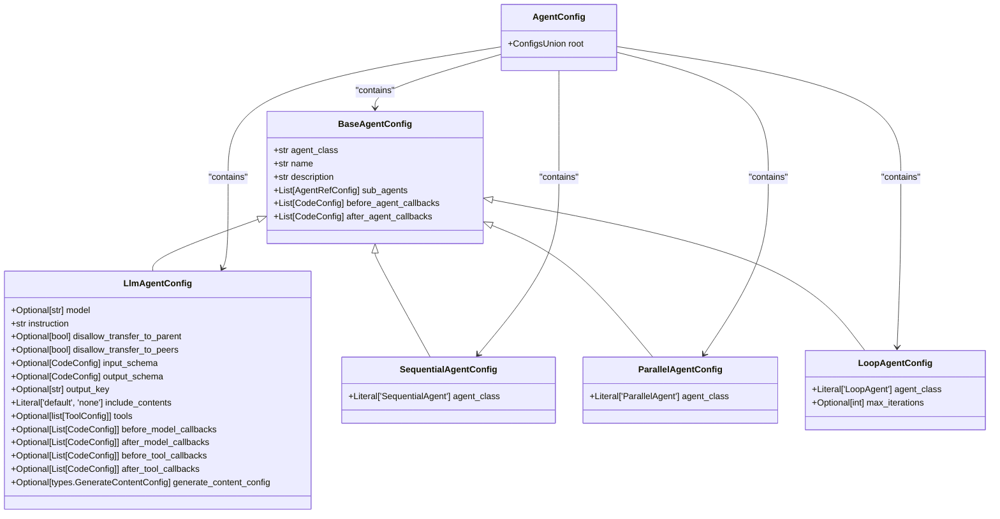
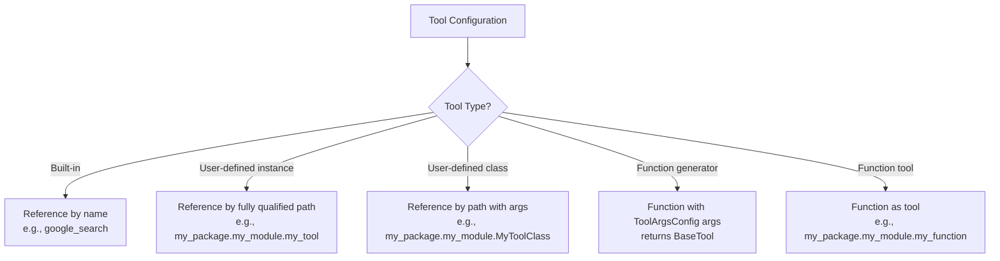
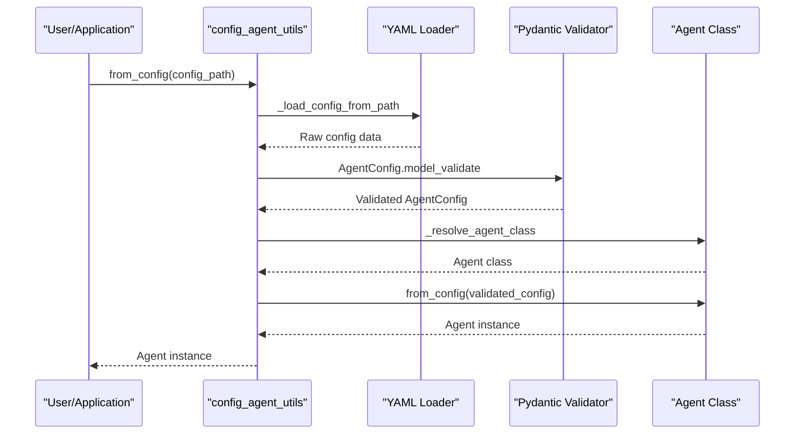

# Configuration Classes

<cite>
**Referenced Files in This Document**   
- [base_agent_config.py](file://src/google/adk/agents/base_agent_config.py)
- [llm_agent_config.py](file://src/google/adk/agents/llm_agent_config.py)
- [sequential_agent_config.py](file://src/google/adk/agents/sequential_agent_config.py)
- [parallel_agent_config.py](file://src/google/adk/agents/parallel_agent_config.py)
- [loop_agent_config.py](file://src/google/adk/agents/loop_agent_config.py)
- [agent_config.py](file://src/google/adk/agents/agent_config.py)
- [run_config.py](file://src/google/adk/agents/run_config.py)
- [common_configs.py](file://src/google/adk/agents/common_configs.py)
- [tool_configs.py](file://src/google/adk/tools/tool_configs.py)
- [AgentConfig.json](file://src/google/adk/agents/config_schemas/AgentConfig.json)
- [config_agent_utils.py](file://src/google/adk/agents/config_agent_utils.py)
- [envs.py](file://src/google/adk/cli/utils/envs.py)
- [yaml_loader.py](file://contributing/samples/agent_os_integration/yaml/yaml_loader.py)
</cite>

## Table of Contents
1. [Introduction](#introduction)
2. [Configuration Hierarchy](#configuration-hierarchy)
3. [Base Configuration](#base-configuration)
4. [Specialized Agent Configurations](#specialized-agent-configurations)
5. [Run Configuration](#run-configuration)
6. [Tool Configuration](#tool-configuration)
7. [Schema Definition](#schema-definition)
8. [Configuration Instantiation and Validation](#configuration-instantiation-and-validation)
9. [Configuration Composition and Merging](#configuration-composition-and-merging)
10. [Environment Variable Integration](#environment-variable-integration)
11. [Secure Handling of Sensitive Data](#secure-handling-of-sensitive-data)

## Introduction
The ADK framework provides a comprehensive configuration system for defining and managing agent behavior. This documentation details the configuration classes that form the foundation of the framework, covering the hierarchy from the base configuration through specialized agent types, execution parameters, and tool configurations. The system is built on Pydantic models with JSON schema validation, enabling both YAML-based configuration files and programmatic configuration through Python code.

## Configuration Hierarchy
The ADK configuration system follows an inheritance hierarchy with `BaseAgentConfig` as the root class. Specialized agent configurations extend this base class to provide agent-specific options while maintaining a consistent configuration interface.



**Diagram sources**
- [base_agent_config.py](file://src/google/adk/agents/base_agent_config.py#L37-L82)
- [llm_agent_config.py](file://src/google/adk/agents/llm_agent_config.py#L33-L168)
- [sequential_agent_config.py](file://src/google/adk/agents/sequential_agent_config.py#L29-L42)
- [parallel_agent_config.py](file://src/google/adk/agents/parallel_agent_config.py#L29-L42)
- [loop_agent_config.py](file://src/google/adk/agents/loop_agent_config.py#L30-L45)
- [agent_config.py](file://src/google/adk/agents/agent_config.py#L59-L67)

**Section sources**
- [base_agent_config.py](file://src/google/adk/agents/base_agent_config.py#L37-L82)
- [llm_agent_config.py](file://src/google/adk/agents/llm_agent_config.py#L33-L168)
- [sequential_agent_config.py](file://src/google/adk/agents/sequential_agent_config.py#L29-L42)
- [parallel_agent_config.py](file://src/google/adk/agents/parallel_agent_config.py#L29-L42)
- [loop_agent_config.py](file://src/google/adk/agents/loop_agent_config.py#L30-L45)
- [agent_config.py](file://src/google/adk/agents/agent_config.py#L59-L67)

## Base Configuration
The `BaseAgentConfig` class serves as the foundation for all agent configurations in the ADK framework. It defines the common properties that are shared across all agent types.

### Properties
- **agent_class**: The class of the agent (default: 'BaseAgent')
- **name**: Required name of the agent
- **description**: Optional description of the agent (default: '')
- **sub_agents**: Optional list of sub-agent references
- **before_agent_callbacks**: Optional list of callback functions to execute before agent processing
- **after_agent_callbacks**: Optional list of callback functions to execute after agent processing

The base configuration uses Pydantic's `extra='allow'` setting, which permits additional fields beyond those explicitly defined. This allows for extensibility while maintaining the core structure.

**Section sources**
- [base_agent_config.py](file://src/google/adk/agents/base_agent_config.py#L37-L82)

## Specialized Agent Configurations

### LLM Agent Configuration
The `LlmAgentConfig` extends the base configuration with properties specific to language model agents.

#### Properties
- **model**: Optional LLM model identifier (inherited from ancestor if not set)
- **instruction**: Required instruction for the LLM agent
- **disallow_transfer_to_parent**: Optional flag to prevent transfer to parent agent
- **disallow_transfer_to_peers**: Optional flag to prevent transfer to peer agents
- **input_schema**: Optional schema definition for input validation
- **output_schema**: Optional schema definition for output validation
- **output_key**: Optional key for storing output in agent state
- **include_contents**: Whether to include conversation contents (default: 'default')
- **tools**: Optional list of tool configurations
- **before_model_callbacks**: Optional callbacks before model invocation
- **after_model_callbacks**: Optional callbacks after model invocation
- **before_tool_callbacks**: Optional callbacks before tool execution
- **after_tool_callbacks**: Optional callbacks after tool execution
- **generate_content_config**: Optional configuration for content generation

**Section sources**
- [llm_agent_config.py](file://src/google/adk/agents/llm_agent_config.py#L33-L168)

### Sequential Agent Configuration
The `SequentialAgentConfig` represents agents that process tasks in a sequential manner.

#### Properties
- **agent_class**: Fixed to 'SequentialAgent' to identify this agent type

This configuration inherits all properties from `BaseAgentConfig` and adds no additional fields, serving as a marker for sequential processing behavior.

**Section sources**
- [sequential_agent_config.py](file://src/google/adk/agents/sequential_agent_config.py#L29-L42)

### Parallel Agent Configuration
The `ParallelAgentConfig` represents agents that process tasks in parallel.

#### Properties
- **agent_class**: Fixed to 'ParallelAgent' to identify this agent type

Like the sequential agent, this configuration inherits from `BaseAgentConfig` without adding additional fields, serving as a marker for parallel processing behavior.

**Section sources**
- [parallel_agent_config.py](file://src/google/adk/agents/parallel_agent_config.py#L29-L42)

### Loop Agent Configuration
The `LoopAgentConfig` extends the base configuration with properties for controlling iterative processing.

#### Properties
- **agent_class**: Fixed to 'LoopAgent' to identify this agent type
- **max_iterations**: Optional maximum number of iterations for the loop

The loop agent allows for repeated processing until a termination condition is met, with the option to limit the maximum number of iterations to prevent infinite loops.

**Section sources**
- [loop_agent_config.py](file://src/google/adk/agents/loop_agent_config.py#L30-L45)

## Run Configuration
The `RunConfig` class defines runtime behavior and execution parameters for agents.

### Properties
- **speech_config**: Optional speech configuration for live agents
- **response_modalities**: Optional output modalities (default: AUDIO)
- **save_input_blobs_as_artifacts**: Whether to save input blobs as artifacts (default: False)
- **support_cfc**: Whether to support Compositional Function Calling (default: False)
- **streaming_mode**: Streaming mode (NONE, SSE, or BIDI) (default: NONE)
- **output_audio_transcription**: Optional transcription configuration for audio output
- **input_audio_transcription**: Optional transcription configuration for audio input
- **realtime_input_config**: Optional configuration for real-time input
- **enable_affective_dialog**: Optional flag to enable affective dialog
- **proactivity**: Optional proactivity configuration
- **session_resumption**: Optional session resumption configuration
- **max_llm_calls**: Maximum number of LLM calls (default: 500)

### Validation Rules
The `max_llm_calls` property includes validation to ensure it is less than `sys.maxsize` and provides a warning when set to zero or negative values, which would allow unlimited LLM calls.

```mermaid
flowchart TD
Start([RunConfig Validation]) --> CheckMaxCalls["Check max_llm_calls value"]
CheckMaxCalls --> MaxCallsValid{"Value < sys.maxsize?"}
MaxCallsValid --> |No| RaiseError["Raise ValueError"]
MaxCallsValid --> |Yes| CheckUnbounded{"Value <= 0?"}
CheckUnbounded --> |Yes| LogWarning["Log warning about unbounded calls"]
CheckUnbounded --> |No| Continue["Continue validation"]
LogWarning --> Continue
Continue --> End([Validation Complete])
RaiseError --> End
```



**Diagram sources**
- [run_config.py](file://src/google/adk/agents/run_config.py#L36-L110)

**Section sources**
- [run_config.py](file://src/google/adk/agents/run_config.py#L36-L110)

## Tool Configuration
The tool configuration system provides a flexible way to define and integrate tools with agents.

### Base Tool Configuration
The `BaseToolConfig` serves as the foundation for all tool configurations, with `extra='forbid'` to prevent additional fields.

### Tool Arguments Configuration
The `ToolArgsConfig` allows free key-value pairs for tool arguments with `extra='allow'`, providing flexibility in tool parameterization.

### Tool Configuration
The `ToolConfig` class defines the structure for tool configuration with support for multiple tool types:

#### Properties
- **name**: Required tool name or fully qualified path
- **args**: Optional arguments for the tool

#### Supported Tool Types
1. **ADK built-in tools**: Referenced by name (e.g., 'google_search')
2. **User-defined tool instances**: Referenced by fully qualified path
3. **User-defined tool classes**: Referenced by fully qualified path with arguments
4. **User-defined functions**: Generate tool instances with arguments passed to the function
5. **User-defined function tools**: Functions that serve as tools



**Diagram sources**
- [tool_configs.py](file://src/google/adk/tools/tool_configs.py#L27-L129)

**Section sources**
- [tool_configs.py](file://src/google/adk/tools/tool_configs.py#L27-L129)

## Schema Definition
The `AgentConfig.json` schema file provides JSON Schema definitions for all configuration classes, enabling validation and tooling support.

### Key Schema Components
- **BaseAgentConfig**: Defines the base agent schema with required name and optional properties
- **LlmAgentConfig**: Extends base with LLM-specific properties like instruction and tools
- **SequentialAgentConfig**: Marker schema for sequential agents
- **ParallelAgentConfig**: Marker schema for parallel agents
- **LoopAgentConfig**: Includes max_iterations property
- **ToolConfig**: Defines tool configuration with name and args
- **AgentRefConfig**: Configuration for referencing other agents via config_path or code
- **CodeConfig**: Configuration for code references with name and optional arguments
- **ArgumentConfig**: Configuration for function arguments with name and value

The schema uses JSON Schema's `$defs` for reusable components and supports validation of configuration files against the defined structure.

**Section sources**
- [AgentConfig.json](file://src/google/adk/agents/config_schemas/AgentConfig.json#L1-L800)

## Configuration Instantiation and Validation
The configuration system provides utilities for loading, validating, and instantiating agents from configuration files.

### Agent Creation Process
The `from_config` function in `config_agent_utils.py` handles the complete process:

1. Load YAML configuration from file path
2. Validate against the schema using Pydantic
3. Resolve agent class from agent_class field
4. Instantiate the agent with the validated configuration

### Configuration Resolution
The system supports two methods for referencing agents and code:

#### Agent References
- **config_path**: Reference to another agent's YAML configuration file
- **code**: Reference to an agent instance defined in Python code

#### Code References
- Fully qualified paths to variables, functions, or classes
- Support for instantiating objects with arguments
- Validation that referenced objects are valid agents or tools



**Diagram sources**
- [config_agent_utils.py](file://src/google/adk/agents/config_agent_utils.py#L34-L64)

**Section sources**
- [config_agent_utils.py](file://src/google/adk/agents/config_agent_utils.py#L34-L213)

## Configuration Composition and Merging
The framework supports composition of configurations through sub-agent references and callback chaining.

### Sub-Agent Composition
Agents can include other agents as sub-agents through the `sub_agents` property, which accepts either:
- **config_path**: Path to another agent's YAML configuration
- **code**: Fully qualified path to an agent instance in code

This enables hierarchical agent structures where parent agents can delegate tasks to specialized sub-agents.

### Callback Chaining
The configuration supports multiple callback hooks that execute at different stages:
- **before_agent_callbacks**: Execute before any agent processing
- **after_agent_callbacks**: Execute after agent processing completes
- **before_model_callbacks**: Execute before LLM model invocation (LlmAgent only)
- **before_tool_callbacks**: Execute before tool execution (LlmAgent only)
- **after_tool_callbacks**: Execute after tool execution (LlmAgent only)

Callbacks are defined using `CodeConfig` with a fully qualified path to the callback function.

**Section sources**
- [base_agent_config.py](file://src/google/adk/agents/base_agent_config.py#L61-L81)
- [llm_agent_config.py](file://src/google/adk/agents/llm_agent_config.py#L140-L164)
- [common_configs.py](file://src/google/adk/agents/common_configs.py#L84-L144)

## Environment Variable Integration
The framework provides mechanisms for integrating environment variables into configurations.

### Environment Variable Resolution
The `yaml_loader.py` in the agent_os_integration sample demonstrates environment variable resolution with support for:
- `${VAR}` syntax for environment variable substitution
- `$VAR` syntax for simple variable references
- Recursive resolution throughout the configuration structure

### .env File Loading
The `envs.py` utility provides functionality to load environment variables from `.env` files:
- Searches upward from the agent directory to find `.env` files
- Loads variables with optional override behavior
- Provides logging of loaded files

```mermaid
flowchart TD
A["Load Configuration"] --> B["Parse YAML"]
B --> C["Identify Environment Variables"]
C --> D{"Variable Syntax?"}
D --> |${VAR}| E["Extract VAR name"]
D --> |$VAR| F["Extract VAR name"]
E --> G["Lookup in os.environ"]
F --> G
G --> H{"Found?"}
H --> |Yes| I["Substitute Value"]
H --> |No| J["Keep Original"]
I --> K["Return Processed Config"]
J --> K
```

**Diagram sources**
- [yaml_loader.py](file://contributing/samples/agent_os_integration/yaml/yaml_loader.py#L72-L111)

**Section sources**
- [yaml_loader.py](file://contributing/samples/agent_os_integration/yaml/yaml_loader.py#L72-L111)
- [envs.py](file://src/google/adk/cli/utils/envs.py#L35-L55)

## Secure Handling of Sensitive Data
The framework provides several mechanisms for securely handling sensitive configuration data.

### Environment Variables for Secrets
Sensitive data such as API keys and credentials should be stored in environment variables rather than configuration files:
- Use `${API_KEY}` syntax in YAML configurations
- Store actual values in `.env` files or system environment
- Ensure `.env` files are included in `.gitignore`

### Configuration Validation
The `validate_environment` function in the agent_os_integration sample demonstrates validation of required environment variables:
- Defines required variables in configuration
- Checks for presence at runtime
- Provides clear error messages for missing variables

### Secure Credential Management
The framework integrates with Google's credential management system:
- Supports OAuth2 credential exchange and refresh
- Uses service accounts for authentication
- Integrates with Secret Manager for API key storage

Best practices include:
- Never commit sensitive data to version control
- Use different credentials for different environments
- Rotate credentials regularly
- Limit permissions to the minimum required

**Section sources**
- [yaml_loader.py](file://contributing/samples/agent_os_integration/yaml/yaml_loader.py#L196-L214)
- [envs.py](file://src/google/adk/cli/utils/envs.py#L35-L55)
- [AgentConfig.json](file://src/google/adk/agents/config_schemas/AgentConfig.json#L55-L88)