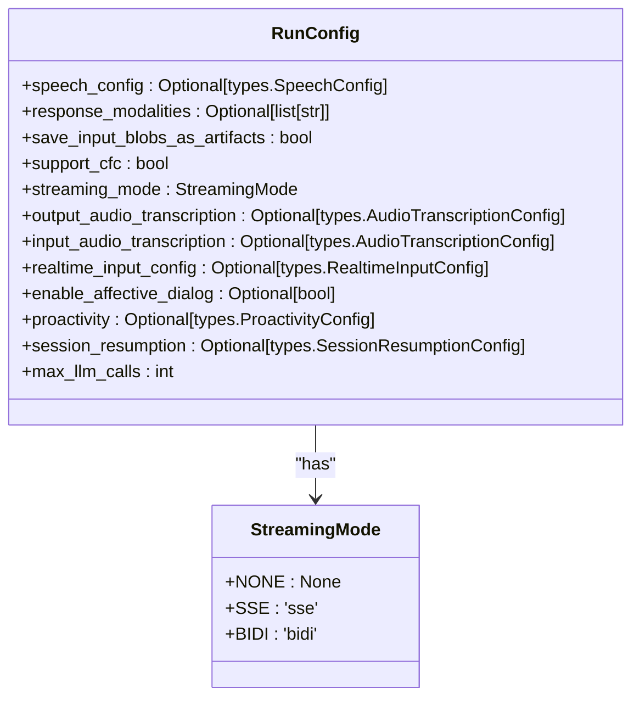
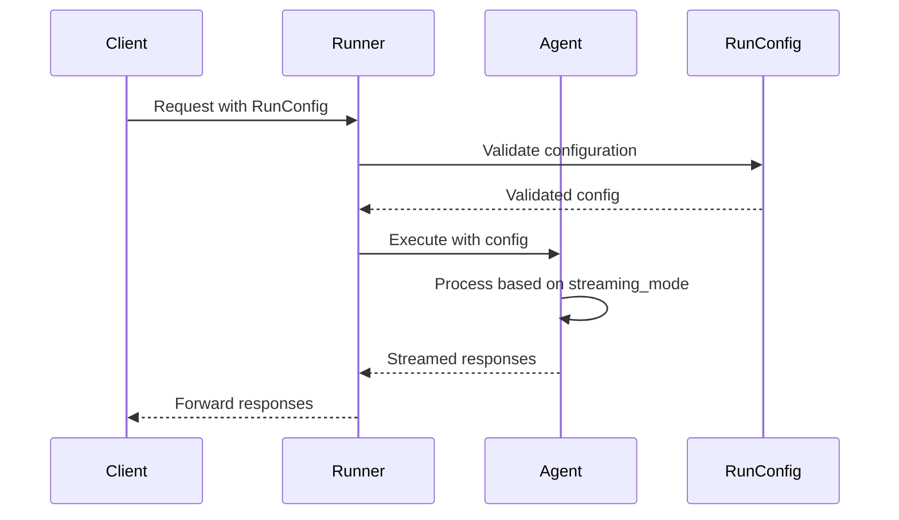
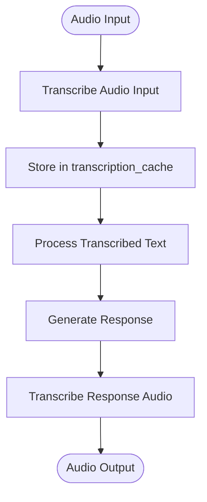
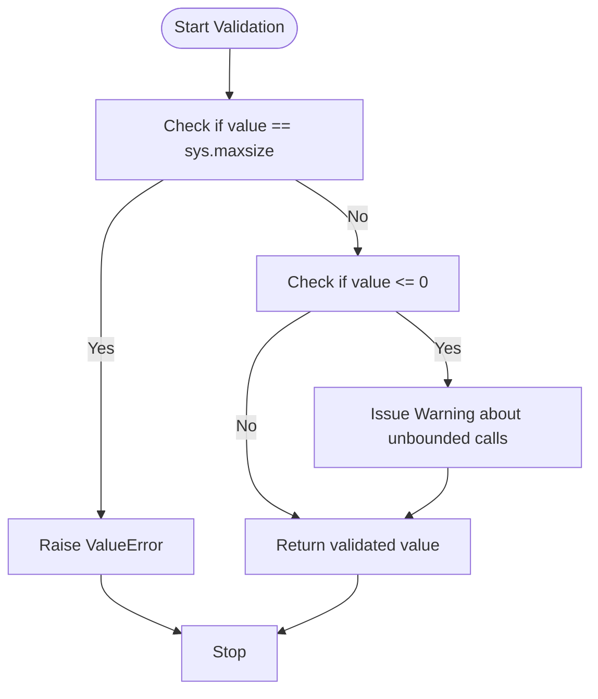
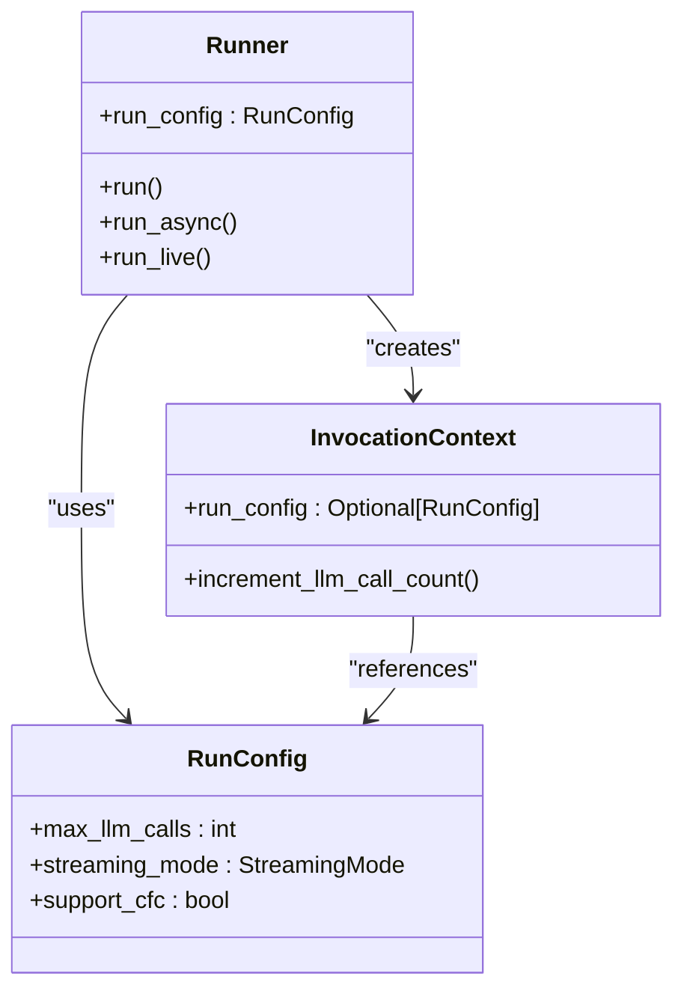

# Runner Configuration

<cite>
**Referenced Files in This Document**   
- [run_config.py](file://src/google/adk/agents/run_config.py)
- [runners.py](file://src/google/adk/runners.py)
- [invocation_context.py](file://src/google/adk/agents/invocation_context.py)
- [audio_transcriber.py](file://src/google/adk/flows/llm_flows/audio_transcriber.py)
- [transcription_manager.py](file://src/google/adk/flows/llm_flows/transcription_manager.py)
</cite>

## Table of Contents
1. [Introduction](#introduction)
2. [RunConfig Class Overview](#runconfig-class-overview)
3. [Streaming Configuration](#streaming-configuration)
4. [Audio and Transcription Settings](#audio-and-transcription-settings)
5. [Proactivity and Affective Dialog](#proactivity-and-affective-dialog)
6. [Session Resumption](#session-resumption)
7. [LLM Call Limits and Validation](#llm-call-limits-and-validation)
8. [Experimental Features](#experimental-features)
9. [Integration with Runner and InvocationContext](#integration-with-runner-and-invocationcontext)
10. [Performance Considerations](#performance-considerations)
11. [Best Practices for Production](#best-practices-for-production)

## Introduction

The RunConfig class is a central component in the Agent Development Kit (ADK) that governs the runtime behavior of agents. It provides comprehensive configuration options for controlling various aspects of agent execution, including streaming modes, audio transcription, speech configuration, and proactivity controls. This documentation provides a detailed overview of the RunConfig class and its integration with the broader system architecture.

**Section sources**
- [run_config.py](file://src/google/adk/agents/run_config.py#L36-L110)

## RunConfig Class Overview

The RunConfig class serves as the primary configuration mechanism for agent runtime behavior. It is implemented as a Pydantic BaseModel with strict configuration settings that forbid extra fields, ensuring type safety and configuration integrity.

**Diagram sources **
- [run_config.py](file://src/google/adk/agents/run_config.py#L30-L34)
- [run_config.py](file://src/google/adk/agents/run_config.py#L36-L110)

**Section sources**
- [run_config.py](file://src/google/adk/agents/run_config.py#L36-L110)

## Streaming Configuration

The RunConfig class provides robust support for different streaming modes through the `streaming_mode` parameter, which accepts values from the StreamingMode enum.

### Streaming Modes

The `streaming_mode` parameter controls how the agent handles real-time communication:

- **NONE**: No streaming mode (default)
- **SSE**: Server-Sent Events streaming
- **BIDI**: Bidirectional streaming

The choice of streaming mode affects how the agent processes input and generates responses in real-time scenarios. BIDI streaming is particularly useful for interactive applications requiring low-latency communication.

### Live Agent Configuration

For live agents, the RunConfig class supports various input/output modalities through the `response_modalities` parameter. When not explicitly set, the default modality is AUDIO. This allows agents to handle different types of responses based on the application requirements.

**Diagram sources **
- [run_config.py](file://src/google/adk/agents/run_config.py#L64-L65)
- [runners.py](file://src/google/adk/runners.py#L357-L464)

**Section sources**
- [run_config.py](file://src/google/adk/agents/run_config.py#L64-L65)
- [runners.py](file://src/google/adk/runners.py#L357-L464)

## Audio and Transcription Settings

The RunConfig class provides comprehensive support for audio processing and transcription in live agent scenarios.

### Input and Output Transcription

The configuration includes separate settings for input and output transcription:

- `input_audio_transcription`: Configures transcription for user audio input
- `output_audio_transcription`: Configures transcription for agent audio responses

These settings are particularly important for accessibility and record-keeping purposes, allowing text representations of audio interactions to be stored and analyzed.

### Realtime Input Configuration

The `realtime_input_config` parameter enables configuration of real-time input processing for agents that receive audio input from users. This is essential for applications requiring immediate response to user input, such as voice assistants or real-time translation services.

**Diagram sources **
- [run_config.py](file://src/google/adk/agents/run_config.py#L70-L74)
- [transcription_manager.py](file://src/google/adk/flows/llm_flows/transcription_manager.py#L34-L68)
- [audio_transcriber.py](file://src/google/adk/flows/llm_flows/audio_transcriber.py#L25-L111)

**Section sources**
- [run_config.py](file://src/google/adk/agents/run_config.py#L70-L74)
- [transcription_manager.py](file://src/google/adk/flows/llm_flows/transcription_manager.py#L34-L68)

## Proactivity and Affective Dialog

The RunConfig class includes advanced features for controlling agent behavior in interactive scenarios.

### Proactivity Controls

The `proactivity` parameter configures the agent's ability to respond proactively to user input and ignore irrelevant information. This allows agents to:

- Anticipate user needs based on context
- Initiate conversations when appropriate
- Filter out noise or irrelevant input
- Maintain focus on the primary task

This feature is particularly valuable in complex dialog scenarios where the agent needs to maintain context and guide the conversation effectively.

### Affective Dialog

The `enable_affective_dialog` parameter controls whether the model detects emotions and adapts its responses accordingly. When enabled, the agent can:

- Recognize emotional cues in user input
- Adjust tone and language based on detected emotions
- Provide empathetic responses when appropriate
- Maintain appropriate emotional boundaries

This capability enhances user experience by making interactions feel more natural and responsive to emotional context.

**Section sources**
- [run_config.py](file://src/google/adk/agents/run_config.py#L76-L80)

## Session Resumption

The `session_resumption` parameter configures the session resumption mechanism, currently supporting only transparent session resumption mode. This feature allows agents to:

- Resume conversations from previous sessions
- Maintain context across multiple interactions
- Provide continuity in long-running tasks
- Recover from interruptions gracefully

Session resumption is particularly important for complex workflows that may span multiple sessions or require extended periods of interaction.

**Section sources**
- [run_config.py](file://src/google/adk/agents/run_config.py#L82-L83)

## LLM Call Limits and Validation

The RunConfig class includes robust mechanisms for controlling and monitoring LLM usage.

### max_llm_calls Configuration

The `max_llm_calls` parameter sets a limit on the total number of LLM calls for a given run. This parameter has specific validation rules:

- Values greater than 0 and less than sys.maxsize: Enforce the bound on LLM calls
- Values less than or equal to 0: Allow unbounded LLM calls

The default value is set to 500, providing a reasonable balance between functionality and resource management.

### Validation Logic and Warnings

The class includes a field validator that performs critical validation:

- Rejects values equal to sys.maxsize to prevent overflow issues
- Issues warnings when unbounded calls are allowed (values ≤ 0)
- Provides detailed warning messages about potential risks of unbounded calls

The warning emphasizes that unbounded calls may lead to never-ending communication between the model and agent in certain cases, which could result in excessive resource consumption.

**Diagram sources **
- [run_config.py](file://src/google/adk/agents/run_config.py#L95-L109)
- [invocation_context.py](file://src/google/adk/agents/invocation_context.py#L73-L89)

**Section sources**
- [run_config.py](file://src/google/adk/agents/run_config.py#L85-L109)
- [invocation_context.py](file://src/google/adk/agents/invocation_context.py#L73-L89)

## Experimental Features

The RunConfig class includes several experimental features that provide advanced capabilities.

### Compositional Function Calling (CFC)

The `support_cfc` parameter enables Compositional Function Calling, an experimental feature that allows for more complex function call compositions. Key characteristics:

- Only applicable for StreamingMode.SSE
- Requires the LIVE API (only LIVE API supports CFC)
- Currently experimental with potential API or behavior changes in future releases
- Requires specific model compatibility (gemini-2 models)

When enabled, this feature allows agents to compose multiple function calls in a single request, enabling more sophisticated interactions and workflows.

### Live Request Queue Integration

The configuration supports integration with LiveRequestQueue for streaming tools, enabling:

- Real-time processing of streaming data
- Support for tools that require continuous input/output
- Enhanced capabilities for interactive applications
- Better handling of long-running operations

**Section sources**
- [run_config.py](file://src/google/adk/agents/run_config.py#L53-L62)
- [runners.py](file://src/google/adk/runners.py#L415-L453)

## Integration with Runner and InvocationContext

The RunConfig class is tightly integrated with the Runner and InvocationContext systems to provide a cohesive execution environment.

### Runner Integration

The Runner class uses RunConfig in multiple execution methods:

- `run()`: Synchronous execution with RunConfig parameter
- `run_async()`: Asynchronous execution with RunConfig parameter
- `run_live()`: Live mode execution with RunConfig parameter

The Runner validates and applies the configuration during execution, ensuring consistent behavior across different execution modes.

### InvocationContext Integration

The InvocationContext class receives and utilizes the RunConfig throughout the agent execution lifecycle:

- Tracks LLM call counts against the configured limit
- Manages cost and resource usage based on configuration
- Provides configuration access to agents and tools
- Handles streaming and transcription based on settings

The integration ensures that configuration settings are consistently applied and enforced throughout the entire execution context.

**Diagram sources **
- [runners.py](file://src/google/adk/runners.py#L121-L179)
- [invocation_context.py](file://src/google/adk/agents/invocation_context.py#L184-L208)
- [run_config.py](file://src/google/adk/agents/run_config.py#L36-L110)

**Section sources**
- [runners.py](file://src/google/adk/runners.py#L121-L179)
- [invocation_context.py](file://src/google/adk/agents/invocation_context.py#L184-L208)

## Performance Considerations

When configuring agents with RunConfig, several performance considerations should be taken into account.

### Resource Management

- Set appropriate `max_llm_calls` limits to prevent resource exhaustion
- Use bounded LLM calls in production environments to avoid runaway processes
- Monitor transcription usage as it can impact latency and costs
- Consider the impact of affective dialog on processing time

### Streaming Performance

- BIDI streaming typically has lower latency than SSE for interactive applications
- Audio transcription adds processing overhead that should be accounted for
- Large response modalities may impact bandwidth and rendering performance
- Session resumption can improve performance by reducing warm-up time

### Scalability

- Configure appropriate limits based on expected usage patterns
- Consider the impact of experimental features on system stability
- Monitor LLM call patterns to identify potential optimization opportunities
- Use caching strategies to reduce redundant processing

**Section sources**
- [run_config.py](file://src/google/adk/agents/run_config.py#L85-L109)
- [runners.py](file://src/google/adk/runners.py#L121-L179)

## Best Practices for Production

When deploying agents in production environments, follow these best practices for RunConfig usage.

### Configuration Guidelines

- Always set `max_llm_calls` to a positive value in production
- Use conservative limits initially and adjust based on monitoring data
- Enable input/output transcription for audit and debugging purposes
- Disable experimental features unless specifically required and tested

### Security and Reliability

- Validate all configuration inputs to prevent injection attacks
- Implement proper error handling for configuration validation failures
- Monitor for unbounded LLM call warnings and address them promptly
- Use secure defaults for sensitive parameters

### Monitoring and Maintenance

- Implement logging for configuration changes and validation results
- Monitor LLM call counts against configured limits
- Regularly review and update configuration based on usage patterns
- Test configuration changes in staging environments before production deployment

**Section sources**
- [run_config.py](file://src/google/adk/agents/run_config.py#L85-L109)
- [invocation_context.py](file://src/google/adk/agents/invocation_context.py#L73-L89)