# Core Framework APIs

<cite>
**Referenced Files in This Document**
- [runners.py](file://src/google/adk/runners.py)
- [plugin_manager.py](file://src/google/adk/plugins/plugin_manager.py)
- [base_plugin.py](file://src/google/adk/plugins/base_plugin.py)
- [base_artifact_service.py](file://src/google/adk/artifacts/base_artifact_service.py)
- [in_memory_artifact_service.py](file://src/google/adk/artifacts/in_memory_artifact_service.py)
- [base_memory_service.py](file://src/google/adk/memory/base_memory_service.py)
- [in_memory_memory_service.py](file://src/google/adk/memory/in_memory_memory_service.py)
- [auth_handler.py](file://src/google/adk/auth/auth_handler.py)
- [base_llm.py](file://src/google/adk/models/base_llm.py)
- [base_llm_connection.py](file://src/google/adk/models/base_llm_connection.py)
- [base_planner.py](file://src/google/adk/planners/base_planner.py)
- [built_in_planner.py](file://src/google/adk/planners/built_in_planner.py)
- [app.py](file://src/google/adk/apps/app.py)
- [base_session_service.py](file://src/google/adk/sessions/base_session_service.py)
- [base_agent.py](file://src/google/adk/agents/base_agent.py)
</cite>

## Table of Contents
1. [Introduction](#introduction)
2. [Project Structure](#project-structure)
3. [Core Components](#core-components)
4. [Architecture Overview](#architecture-overview)
5. [Detailed Component Analysis](#detailed-component-analysis)
6. [Dependency Analysis](#dependency-analysis)
7. [Performance Considerations](#performance-considerations)
8. [Troubleshooting Guide](#troubleshooting-guide)
9. [Conclusion](#conclusion)
10. [Appendices](#appendices)

## Introduction
This document provides comprehensive API documentation for the Core Framework classes and interfaces that power the Agent Development Kit (ADK). It focuses on:
- Runner orchestration and lifecycle
- Plugin system and extension points
- Artifact service APIs for persistence and retrieval
- Memory service APIs for ingestion and search
- Authentication handler for credential flows
- LLM abstraction and live connection interfaces
- Planner interfaces for reasoning and instruction injection
- Application configuration and service registration patterns

The goal is to enable developers to integrate the framework, build plugins, customize services, and extend the system safely and efficiently.

## Project Structure
The Core Framework is organized by domain areas:
- Agents: Base agent and invocation lifecycle
- Apps: Application container and configuration
- Sessions: Session management and event persistence
- Artifacts: Artifact storage abstraction and implementations
- Memory: Memory ingestion and search abstractions
- Auth: Credential exchange and auth flows
- Models: LLM abstraction and live connection
- Planners: Planning interfaces and built-in planner
- Plugins: Plugin base and plugin manager
- Runners: Runner orchestration and execution pipeline

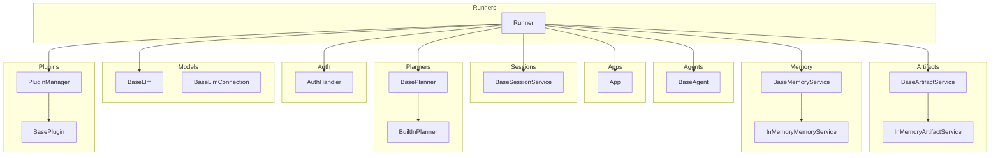

**Diagram sources**
- [runners.py](file://src/google/adk/runners.py#L112-L148)
- [base_agent.py](file://src/google/adk/agents/base_agent.py#L86-L137)
- [app.py](file://src/google/adk/apps/app.py#L111-L146)
- [base_session_service.py](file://src/google/adk/sessions/base_session_service.py#L45-L154)
- [base_artifact_service.py](file://src/google/adk/artifacts/base_artifact_service.py#L88-L262)
- [in_memory_artifact_service.py](file://src/google/adk/artifacts/in_memory_artifact_service.py#L49-L282)
- [base_memory_service.py](file://src/google/adk/memory/base_memory_service.py#L44-L141)
- [in_memory_memory_service.py](file://src/google/adk/memory/in_memory_memory_service.py#L45-L135)
- [auth_handler.py](file://src/google/adk/auth/auth_handler.py#L38-L209)
- [base_llm.py](file://src/google/adk/models/base_llm.py#L32-L206)
- [base_llm_connection.py](file://src/google/adk/models/base_llm_connection.py#L25-L82)
- [base_planner.py](file://src/google/adk/planners/base_planner.py#L29-L69)
- [built_in_planner.py](file://src/google/adk/planners/built_in_planner.py#L32-L87)
- [base_plugin.py](file://src/google/adk/plugins/base_plugin.py#L41-L373)
- [plugin_manager.py](file://src/google/adk/plugins/plugin_manager.py#L60-L348)

**Section sources**
- [runners.py](file://src/google/adk/runners.py#L112-L148)
- [app.py](file://src/google/adk/apps/app.py#L111-L152)

## Core Components
This section summarizes the primary classes and their responsibilities.

- Runner
  - Orchestrates agent execution within a session, manages plugins, artifact and memory services, and credentials.
  - Provides synchronous and asynchronous run entry points, rewind, and plugin-wrapped execution.
  - Supports resumability and event compaction based on App configuration.

- PluginManager and BasePlugin
  - Manages registration and execution of plugins with a strict early-exit callback strategy.
  - Defines a comprehensive set of callback hooks for user messages, run lifecycle, agent/tool/model events, and error handling.

- BaseArtifactService and InMemoryArtifactService
  - Abstraction for artifact persistence with CRUD and versioning APIs.
  - In-memory implementation for development and testing with user/session scoping.

- BaseMemoryService and InMemoryMemoryService
  - Abstraction for memory ingestion and keyword-based search.
  - In-memory implementation with thread-safety and event delta support.

- AuthHandler
  - Handles OAuth/OpenID Connect flows, credential exchange, and state storage for auth responses.

- BaseLlm and BaseLlmConnection
  - Abstraction for content generation and live real-time connections.
  - Supports streaming and live APIs depending on model capabilities.

- BasePlanner and BuiltInPlanner
  - Abstraction for generating and processing planning instructions and responses.
  - Built-in planner injects model thinking configuration.

- App and BaseSessionService
  - App encapsulates root agent, plugins, resumability, and event compaction configuration.
  - BaseSessionService defines session lifecycle and event append semantics.

**Section sources**
- [runners.py](file://src/google/adk/runners.py#L112-L148)
- [plugin_manager.py](file://src/google/adk/plugins/plugin_manager.py#L60-L348)
- [base_plugin.py](file://src/google/adk/plugins/base_plugin.py#L41-L373)
- [base_artifact_service.py](file://src/google/adk/artifacts/base_artifact_service.py#L88-L262)
- [in_memory_artifact_service.py](file://src/google/adk/artifacts/in_memory_artifact_service.py#L49-L282)
- [base_memory_service.py](file://src/google/adk/memory/base_memory_service.py#L44-L141)
- [in_memory_memory_service.py](file://src/google/adk/memory/in_memory_memory_service.py#L45-L135)
- [auth_handler.py](file://src/google/adk/auth/auth_handler.py#L38-L209)
- [base_llm.py](file://src/google/adk/models/base_llm.py#L32-L206)
- [base_llm_connection.py](file://src/google/adk/models/base_llm_connection.py#L25-L82)
- [base_planner.py](file://src/google/adk/planners/base_planner.py#L29-L69)
- [built_in_planner.py](file://src/google/adk/planners/built_in_planner.py#L32-L87)
- [app.py](file://src/google/adk/apps/app.py#L111-L152)
- [base_session_service.py](file://src/google/adk/sessions/base_session_service.py#L45-L154)

## Architecture Overview
The Runner coordinates the end-to-end execution pipeline:
- Validates and initializes configuration from App or direct parameters
- Resolves or creates a session
- Sets up InvocationContext and wraps execution with PluginManager callbacks
- Executes agent run_async and yields events
- Applies event compaction per App configuration

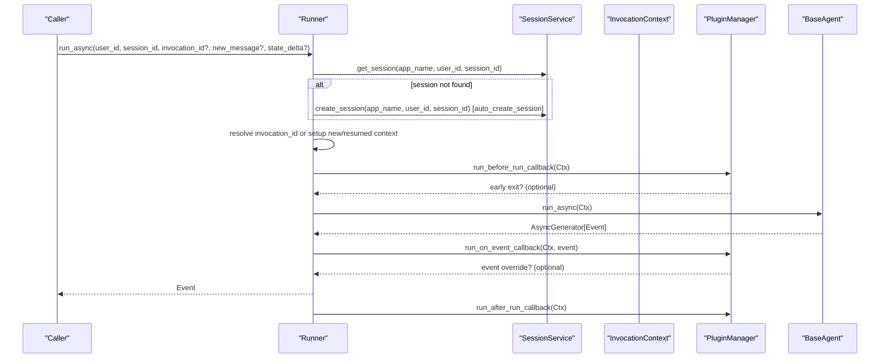

**Diagram sources**
- [runners.py](file://src/google/adk/runners.py#L493-L621)
- [plugin_manager.py](file://src/google/adk/plugins/plugin_manager.py#L130-L144)
- [base_agent.py](file://src/google/adk/agents/base_agent.py#L274-L304)

**Section sources**
- [runners.py](file://src/google/adk/runners.py#L493-L621)

## Detailed Component Analysis

### Runner
- Purpose: Central orchestrator for agent execution, session management, plugin lifecycle, and event compaction.
- Key responsibilities:
  - Parameter validation and App alignment
  - Session creation/retrieval with auto-create option
  - Invocation context setup for new/resume flows
  - Plugin-wrapped execution with early-exit strategy
  - Rewind and artifact restoration
  - Event compaction after invocation completion

- Initialization and configuration
  - Construct Runner with either an App instance or app_name + agent
  - Optional artifact_service, memory_service, credential_service
  - PluginManager initialized with close_timeout
  - auto_create_session controls missing session behavior

- Execution APIs
  - run(): synchronous convenience wrapper for local testing
  - run_async(): main async entry with invocation_id, new_message, state_delta
  - rewind_async(): rewinds to a prior invocation and restores state/artifacts

- Extension points
  - Plugins via PluginManager
  - Custom artifact/memory services
  - Custom session services
  - Custom credential services

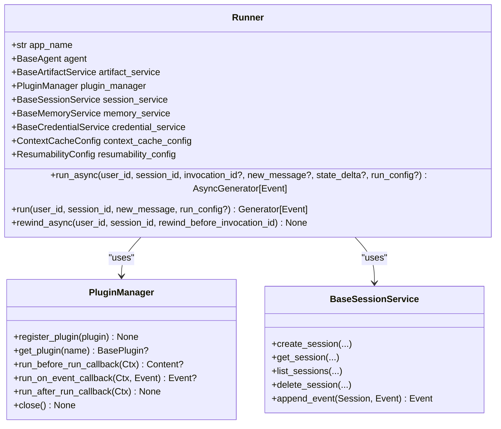

**Diagram sources**
- [runners.py](file://src/google/adk/runners.py#L112-L148)
- [plugin_manager.py](file://src/google/adk/plugins/plugin_manager.py#L60-L104)
- [base_session_service.py](file://src/google/adk/sessions/base_session_service.py#L45-L116)

**Section sources**
- [runners.py](file://src/google/adk/runners.py#L150-L218)
- [runners.py](file://src/google/adk/runners.py#L493-L621)
- [runners.py](file://src/google/adk/runners.py#L623-L758)

### PluginManager and BasePlugin
- PluginManager
  - Registers plugins by unique name
  - Executes callbacks in registration order with early-exit semantics
  - Supports close() with timeouts and consolidated error reporting
  - Provides typed callback names for static analysis

- BasePlugin
  - Comprehensive callback surface:
    - User message interception
    - Run lifecycle (before/after)
    - Event interception
    - Agent lifecycle (before/after)
    - Tool lifecycle (before/after/on-error)
    - Model lifecycle (before/after/on-error)
  - Close hook for cleanup

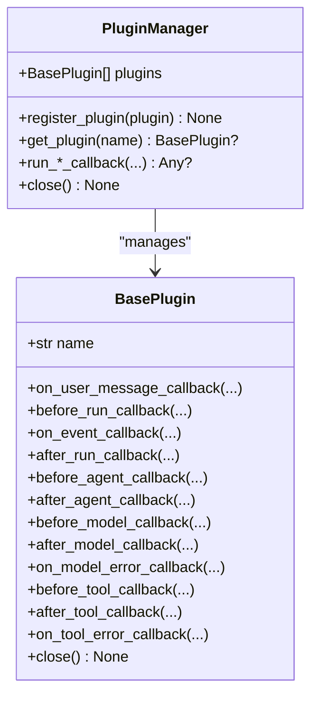

**Diagram sources**
- [base_plugin.py](file://src/google/adk/plugins/base_plugin.py#L41-L373)
- [plugin_manager.py](file://src/google/adk/plugins/plugin_manager.py#L60-L348)

**Section sources**
- [plugin_manager.py](file://src/google/adk/plugins/plugin_manager.py#L60-L348)
- [base_plugin.py](file://src/google/adk/plugins/base_plugin.py#L41-L373)

### Artifact Service APIs
- BaseArtifactService
  - save_artifact(app_name, user_id, filename, artifact, session_id?, custom_metadata?) -> version
  - load_artifact(app_name, user_id, filename, session_id?, version?) -> Part?
  - list_artifact_keys(app_name, user_id, session_id?) -> list[str]
  - delete_artifact(app_name, user_id, filename, session_id?)
  - list_versions(app_name, user_id, filename, session_id?) -> list[int]
  - list_artifact_versions(app_name, user_id, filename, session_id?) -> list[ArtifactVersion]
  - get_artifact_version(app_name, user_id, filename, session_id?, version?) -> ArtifactVersion?

- InMemoryArtifactService
  - In-memory storage keyed by app/user/session/filename
  - Supports user-scoped artifacts (filename prefixed with user:)
  - Validates artifact references and resolves nested references
  - Tracks MIME type and custom metadata per version

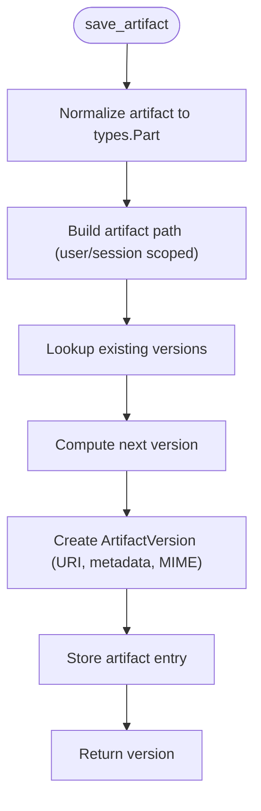

**Diagram sources**
- [base_artifact_service.py](file://src/google/adk/artifacts/base_artifact_service.py#L88-L262)
- [in_memory_artifact_service.py](file://src/google/adk/artifacts/in_memory_artifact_service.py#L49-L145)

**Section sources**
- [base_artifact_service.py](file://src/google/adk/artifacts/base_artifact_service.py#L88-L262)
- [in_memory_artifact_service.py](file://src/google/adk/artifacts/in_memory_artifact_service.py#L49-L282)

### Memory Service APIs
- BaseMemoryService
  - add_session_to_memory(session) -> None
  - add_events_to_memory(app_name, user_id, events, session_id?, custom_metadata?) -> None
  - add_memory(app_name, user_id, memories, custom_metadata?) -> None
  - search_memory(app_name, user_id, query) -> SearchMemoryResponse

- InMemoryMemoryService
  - Stores events per user and session
  - Keyword-based search using word matching
  - Thread-safe with lock-protected maps

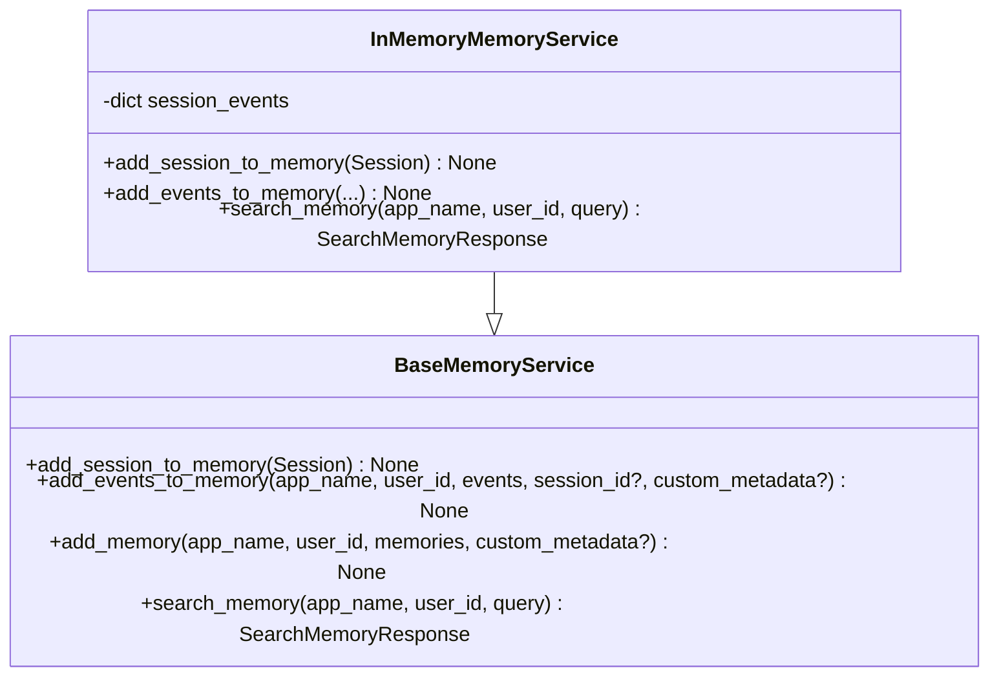

**Diagram sources**
- [base_memory_service.py](file://src/google/adk/memory/base_memory_service.py#L44-L141)
- [in_memory_memory_service.py](file://src/google/adk/memory/in_memory_memory_service.py#L45-L135)

**Section sources**
- [base_memory_service.py](file://src/google/adk/memory/base_memory_service.py#L44-L141)
- [in_memory_memory_service.py](file://src/google/adk/memory/in_memory_memory_service.py#L45-L135)

### Authentication Handler
- AuthHandler
  - exchange_auth_token() -> AuthCredential
  - parse_and_store_auth_response(state) -> None
  - get_auth_response(state) -> AuthCredential?
  - generate_auth_request() -> AuthConfig
  - generate_auth_uri() -> AuthCredential

- Capabilities
  - Supports OAuth2 and OpenID Connect flows
  - Generates authorization URLs with scopes and state
  - Exchanges tokens when applicable

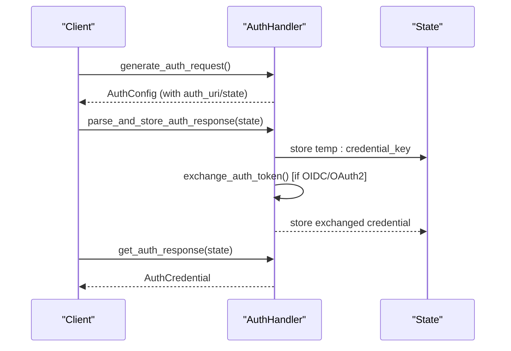

**Diagram sources**
- [auth_handler.py](file://src/google/adk/auth/auth_handler.py#L38-L209)

**Section sources**
- [auth_handler.py](file://src/google/adk/auth/auth_handler.py#L38-L209)

### LLM Interfaces
- BaseLlm
  - generate_content_async(llm_request, stream=False) -> AsyncGenerator[LlmResponse]
  - connect(llm_request) -> BaseLlmConnection
  - Includes guidance for streaming behavior and partial responses

- BaseLlmConnection
  - send_history(history) -> None
  - send_content(content) -> None
  - send_realtime(blob) -> None
  - receive() -> AsyncGenerator[LlmResponse]
  - close() -> None

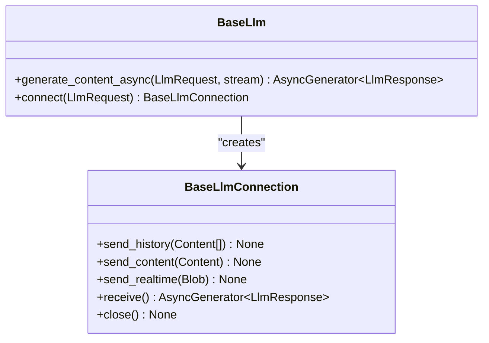

**Diagram sources**
- [base_llm.py](file://src/google/adk/models/base_llm.py#L32-L206)
- [base_llm_connection.py](file://src/google/adk/models/base_llm_connection.py#L25-L82)

**Section sources**
- [base_llm.py](file://src/google/adk/models/base_llm.py#L32-L206)
- [base_llm_connection.py](file://src/google/adk/models/base_llm_connection.py#L25-L82)

### Planner Interfaces
- BasePlanner
  - build_planning_instruction(readonly_context, llm_request) -> Optional[str]
  - process_planning_response(callback_context, response_parts) -> Optional[List[Part]]

- BuiltInPlanner
  - Applies ThinkingConfig to LLM requests
  - No additional instruction; delegates to model’s built-in thinking

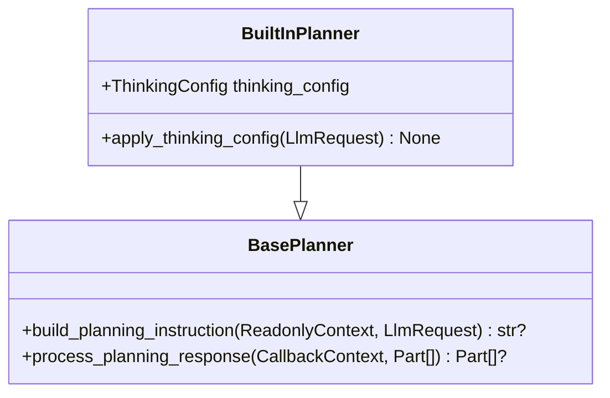

**Diagram sources**
- [base_planner.py](file://src/google/adk/planners/base_planner.py#L29-L69)
- [built_in_planner.py](file://src/google/adk/planners/built_in_planner.py#L32-L87)

**Section sources**
- [base_planner.py](file://src/google/adk/planners/base_planner.py#L29-L69)
- [built_in_planner.py](file://src/google/adk/planners/built_in_planner.py#L32-L87)

### Application and Session Services
- App
  - Encapsulates name, root_agent, plugins, events_compaction_config, context_cache_config, resumability_config
  - Validates app name and enforces constraints

- BaseSessionService
  - create_session, get_session, list_sessions, delete_session
  - append_event applies temp state, trims temp delta, updates persistent state, and appends event

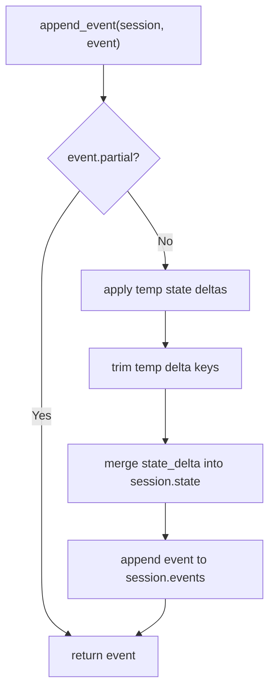

**Diagram sources**
- [app.py](file://src/google/adk/apps/app.py#L111-L152)
- [base_session_service.py](file://src/google/adk/sessions/base_session_service.py#L105-L154)

**Section sources**
- [app.py](file://src/google/adk/apps/app.py#L111-L152)
- [base_session_service.py](file://src/google/adk/sessions/base_session_service.py#L45-L154)

## Dependency Analysis
Key dependencies and relationships:
- Runner depends on App, BaseSessionService, BaseArtifactService, BaseMemoryService, PluginManager, and Auth components
- PluginManager depends on BasePlugin and executes callbacks in order
- BaseAgent integrates with PluginManager for agent-level callbacks
- BasePlanner integrates with LLM request configuration
- BaseLlm and BaseLlmConnection define the model interface used by agents

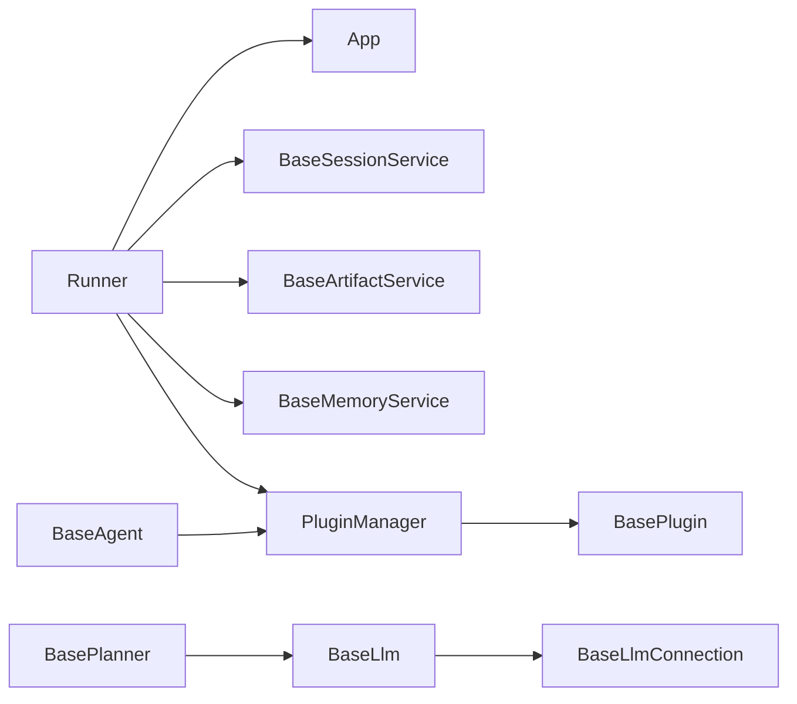

**Diagram sources**
- [runners.py](file://src/google/adk/runners.py#L112-L148)
- [plugin_manager.py](file://src/google/adk/plugins/plugin_manager.py#L60-L104)
- [base_agent.py](file://src/google/adk/agents/base_agent.py#L447-L512)
- [base_planner.py](file://src/google/adk/planners/base_planner.py#L29-L69)
- [base_llm.py](file://src/google/adk/models/base_llm.py#L32-L206)
- [base_llm_connection.py](file://src/google/adk/models/base_llm_connection.py#L25-L82)

**Section sources**
- [runners.py](file://src/google/adk/runners.py#L112-L148)
- [plugin_manager.py](file://src/google/adk/plugins/plugin_manager.py#L60-L104)
- [base_agent.py](file://src/google/adk/agents/base_agent.py#L447-L512)

## Performance Considerations
- Streaming vs. non-streaming LLM responses
  - Non-streaming yields a single complete response per turn
  - Streaming yields partial responses; consolidate as needed at the caller level
- Event compaction
  - Configure EventsCompactionConfig to summarize and compact events after a fixed interval or token threshold
  - Overlap size maintains continuity; retention size preserves recent raw events post-compaction
- Plugin overhead
  - Each plugin adds latency; minimize heavy operations in callbacks
  - Use early-exit pattern judiciously to avoid unnecessary downstream processing
- Memory service
  - InMemoryMemoryService is thread-safe but not suitable for production scale
  - Prefer external memory services for production deployments
- Artifact service
  - Large inline data should be avoided in sessions; use artifact URIs instead
  - Versioning and metadata increase storage overhead; prune old versions as appropriate

[No sources needed since this section provides general guidance]

## Troubleshooting Guide
- Session not found
  - Runner raises SessionNotFoundError when auto_create_session is False
  - Use auto_create_session=True or pre-create sessions
  - Review app_name alignment to prevent mismatches

- Plugin close failures
  - PluginManager.close() consolidates exceptions and raises a RuntimeError with a summary
  - Inspect individual plugin logs for Timeout/Cancelled or other errors

- Rewind issues
  - Rewind requires a valid invocation_id; ensure the target invocation exists
  - Artifact restoration relies on artifact_service; verify service availability and URIs

- LLM connectivity
  - For live connections, ensure BaseLlm.connect() is implemented for the chosen model
  - Streaming behavior varies by model; validate partial responses and consolidation

**Section sources**
- [runners.py](file://src/google/adk/runners.py#L384-L426)
- [plugin_manager.py](file://src/google/adk/plugins/plugin_manager.py#L309-L348)
- [runners.py](file://src/google/adk/runners.py#L623-L758)
- [base_llm.py](file://src/google/adk/models/base_llm.py#L194-L206)

## Conclusion
The Core Framework provides a robust, extensible foundation for building agent-driven applications. By leveraging Runner orchestration, a powerful plugin system, pluggable artifact and memory services, and strong LLM abstractions, developers can implement sophisticated behaviors while maintaining clean separation of concerns. Proper configuration of App-level settings, careful use of streaming and compaction, and thoughtful plugin design are key to achieving high performance and maintainability.

[No sources needed since this section summarizes without analyzing specific files]

## Appendices

### Usage Examples and Best Practices
- Framework integration
  - Initialize Runner with App or app_name + agent
  - Provide BaseSessionService, optional BaseArtifactService/BaseMemoryService, and PluginManager
  - Use run_async for production-grade concurrency

- Plugin development
  - Implement BasePlugin callbacks selectively
  - Use early-exit pattern to short-circuit execution when appropriate
  - Implement close() for resource cleanup

- Service customization
  - Implement BaseArtifactService and BaseMemoryService for production storage
  - Extend BaseSessionService to add filtering or projection logic
  - Integrate AuthHandler for OAuth/OpenID flows

- Configuration options
  - App: name, root_agent, plugins, events_compaction_config, context_cache_config, resumability_config
  - EventsCompactionConfig: summarizer, compaction_interval, overlap_size, token_threshold, event_retention_size
  - ResumabilityConfig: is_resumable

[No sources needed since this section provides general guidance]