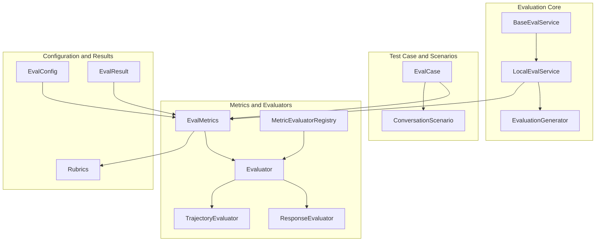
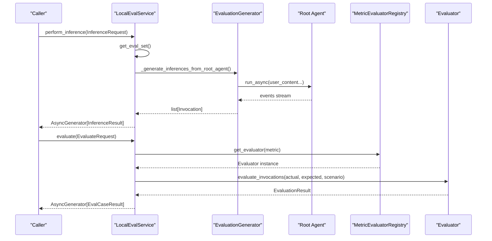
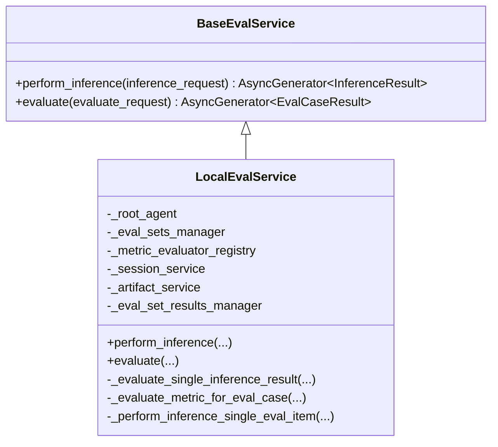
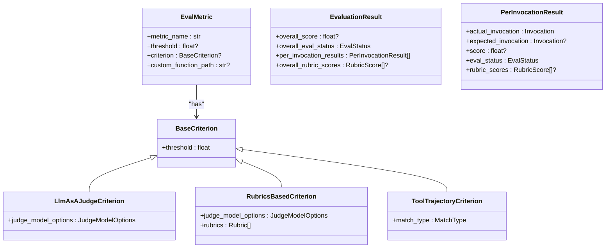
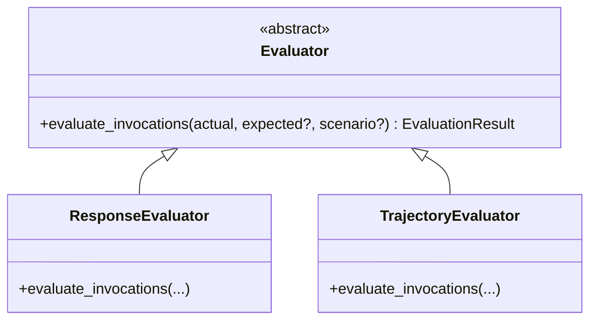
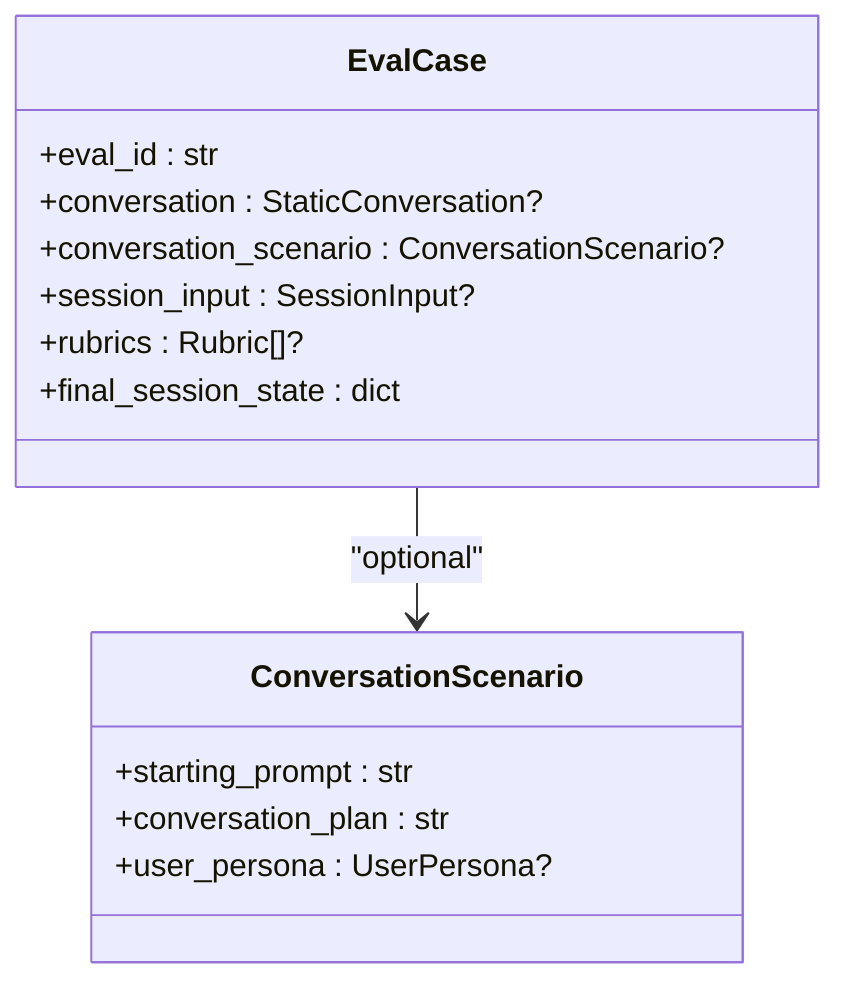
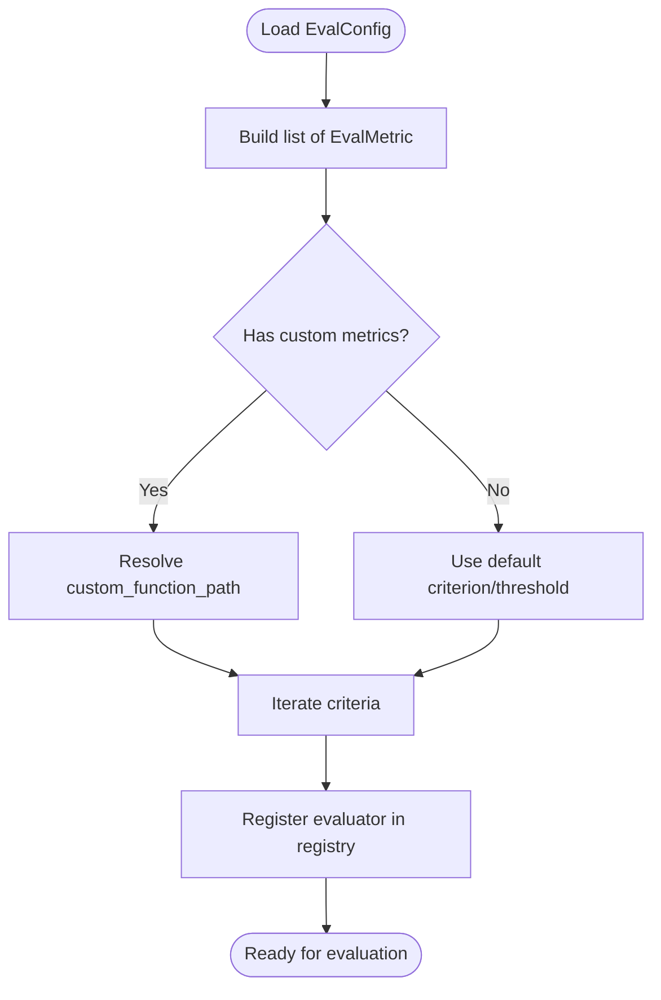
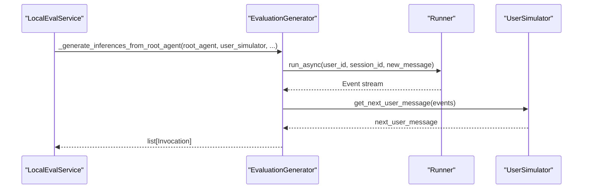
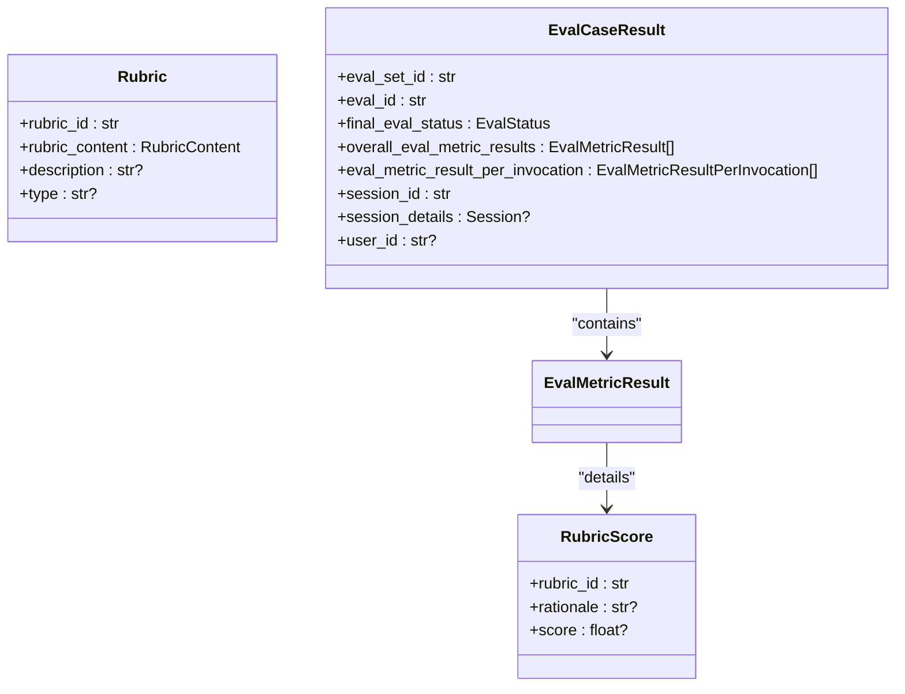
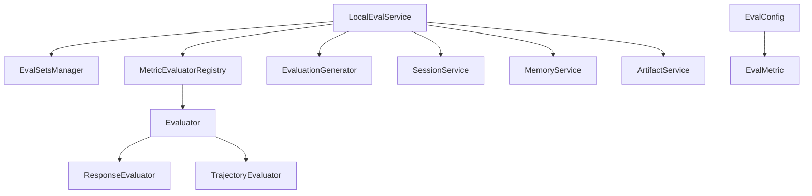

# Evaluation APIs

<cite>
**Referenced Files in This Document**
- [base_eval_service.py](file://src/google/adk/evaluation/base_eval_service.py)
- [local_eval_service.py](file://src/google/adk/evaluation/local_eval_service.py)
- [eval_metrics.py](file://src/google/adk/evaluation/eval_metrics.py)
- [eval_case.py](file://src/google/adk/evaluation/eval_case.py)
- [eval_config.py](file://src/google/adk/evaluation/eval_config.py)
- [evaluator.py](file://src/google/adk/evaluation/evaluator.py)
- [eval_result.py](file://src/google/adk/evaluation/eval_result.py)
- [metric_evaluator_registry.py](file://src/google/adk/evaluation/metric_evaluator_registry.py)
- [response_evaluator.py](file://src/google/adk/evaluation/response_evaluator.py)
- [trajectory_evaluator.py](file://src/google/adk/evaluation/trajectory_evaluator.py)
- [evaluation_generator.py](file://src/google/adk/evaluation/evaluation_generator.py)
- [conversation_scenarios.py](file://src/google/adk/evaluation/conversation_scenarios.py)
- [eval_rubrics.py](file://src/google/adk/evaluation/eval_rubrics.py)
- [common.py](file://src/google/adk/evaluation/common.py)
</cite>

## Table of Contents
1. [Introduction](#introduction)
2. [Project Structure](#project-structure)
3. [Core Components](#core-components)
4. [Architecture Overview](#architecture-overview)
5. [Detailed Component Analysis](#detailed-component-analysis)
6. [Dependency Analysis](#dependency-analysis)
7. [Performance Considerations](#performance-considerations)
8. [Troubleshooting Guide](#troubleshooting-guide)
9. [Conclusion](#conclusion)
10. [Appendices](#appendices)

## Introduction
This document provides comprehensive API documentation for the Evaluation framework in the ADK Python library. It focuses on the evaluation execution services, metric calculation interfaces, configuration options, and result reporting mechanisms. The primary goal is to enable developers to set up evaluations, define custom metrics, integrate automated testing, and design scalable evaluation pipelines. Covered classes include BaseEvalService, LocalEvalService, EvalMetrics, ResponseEvaluator, TrajectoryEvaluator, EvalCase, and EvalConfig, along with supporting interfaces and utilities.

## Project Structure
The evaluation subsystem is organized around:
- Core evaluation service abstractions and implementations
- Metric definitions and evaluators
- Test case representation and scenarios
- Configuration and registry for metrics
- Utilities for inference generation and rubric support

**Diagram sources**
- [base_eval_service.py](file://src/google/adk/evaluation/base_eval_service.py#L177-L202)
- [local_eval_service.py](file://src/google/adk/evaluation/local_eval_service.py#L111-L141)
- [evaluation_generator.py](file://src/google/adk/evaluation/evaluation_generator.py#L69-L268)
- [eval_metrics.py](file://src/google/adk/evaluation/eval_metrics.py#L254-L383)
- [evaluator.py](file://src/google/adk/evaluation/evaluator.py#L57-L81)
- [response_evaluator.py](file://src/google/adk/evaluation/response_evaluator.py#L31-L99)
- [trajectory_evaluator.py](file://src/google/adk/evaluation/trajectory_evaluator.py#L38-L270)
- [metric_evaluator_registry.py](file://src/google/adk/evaluation/metric_evaluator_registry.py#L46-L154)
- [eval_case.py](file://src/google/adk/evaluation/eval_case.py#L132-L177)
- [conversation_scenarios.py](file://src/google/adk/evaluation/conversation_scenarios.py#L27-L78)
- [eval_config.py](file://src/google/adk/evaluation/eval_config.py#L71-L219)
- [eval_result.py](file://src/google/adk/evaluation/eval_result.py#L31-L92)
- [eval_rubrics.py](file://src/google/adk/evaluation/eval_rubrics.py#L35-L83)

**Section sources**
- [base_eval_service.py](file://src/google/adk/evaluation/base_eval_service.py#L1-L202)
- [local_eval_service.py](file://src/google/adk/evaluation/local_eval_service.py#L1-L513)
- [eval_metrics.py](file://src/google/adk/evaluation/eval_metrics.py#L1-L384)
- [eval_case.py](file://src/google/adk/evaluation/eval_case.py#L1-L255)
- [eval_config.py](file://src/google/adk/evaluation/eval_config.py#L1-L219)
- [evaluator.py](file://src/google/adk/evaluation/evaluator.py#L1-L81)
- [eval_result.py](file://src/google/adk/evaluation/eval_result.py#L1-L92)
- [metric_evaluator_registry.py](file://src/google/adk/evaluation/metric_evaluator_registry.py#L1-L154)
- [response_evaluator.py](file://src/google/adk/evaluation/response_evaluator.py#L1-L99)
- [trajectory_evaluator.py](file://src/google/adk/evaluation/trajectory_evaluator.py#L1-L270)
- [evaluation_generator.py](file://src/google/adk/evaluation/evaluation_generator.py#L1-L419)
- [conversation_scenarios.py](file://src/google/adk/evaluation/conversation_scenarios.py#L1-L78)
- [eval_rubrics.py](file://src/google/adk/evaluation/eval_rubrics.py#L1-L83)
- [common.py](file://src/google/adk/evaluation/common.py#L21-L28)

## Core Components
- BaseEvalService: Defines asynchronous evaluation lifecycle with perform_inference and evaluate methods.
- LocalEvalService: Concrete implementation that orchestrates inference generation via EvaluationGenerator and metric evaluation via MetricEvaluatorRegistry.
- EvalMetrics: Defines metric configuration, criteria, thresholds, rubrics, and result structures.
- Evaluator: Abstract interface for metric evaluators returning per-invocation and overall results.
- ResponseEvaluator: Implements response quality and matching metrics using Vertex AI or Rouge.
- TrajectoryEvaluator: Compares tool use trajectories across invocations using match types.
- EvalCase: Represents a single evaluation case with static conversation or a dynamic scenario.
- EvalConfig: Central configuration for metrics, thresholds, custom metrics, and user simulator settings.

Key execution methods:
- BaseEvalService.perform_inference: Streams InferenceResult items as they become available.
- BaseEvalService.evaluate: Streams EvalCaseResult items as they become available.
- LocalEvalService._perform_inference_single_eval_item: Generates invocations for a single eval case.
- LocalEvalService._evaluate_single_inference_result: Computes per-metric and overall scores.
- LocalEvalService._evaluate_metric_for_eval_case: Delegates to registry and aggregates results.

**Section sources**
- [base_eval_service.py](file://src/google/adk/evaluation/base_eval_service.py#L177-L202)
- [local_eval_service.py](file://src/google/adk/evaluation/local_eval_service.py#L142-L229)
- [eval_metrics.py](file://src/google/adk/evaluation/eval_metrics.py#L254-L383)
- [evaluator.py](file://src/google/adk/evaluation/evaluator.py#L57-L81)
- [response_evaluator.py](file://src/google/adk/evaluation/response_evaluator.py#L31-L99)
- [trajectory_evaluator.py](file://src/google/adk/evaluation/trajectory_evaluator.py#L38-L270)
- [eval_case.py](file://src/google/adk/evaluation/eval_case.py#L132-L177)
- [eval_config.py](file://src/google/adk/evaluation/eval_config.py#L71-L219)

## Architecture Overview
The evaluation pipeline consists of:
- Inference phase: LocalEvalService retrieves EvalSet/EvalCase and generates agent invocations using EvaluationGenerator.
- Evaluation phase: LocalEvalService evaluates each invocation against configured metrics via MetricEvaluatorRegistry.
- Reporting: Results are streamed as InferenceResult and EvalCaseResult, optionally persisted via EvalSetResultsManager.

**Diagram sources**
- [local_eval_service.py](file://src/google/adk/evaluation/local_eval_service.py#L142-L229)
- [evaluation_generator.py](file://src/google/adk/evaluation/evaluation_generator.py#L191-L268)
- [metric_evaluator_registry.py](file://src/google/adk/evaluation/metric_evaluator_registry.py#L52-L73)
- [evaluator.py](file://src/google/adk/evaluation/evaluator.py#L62-L80)

## Detailed Component Analysis

### BaseEvalService
- Purpose: Abstract interface for evaluation services.
- Methods:
  - perform_inference: Asynchronously yields InferenceResult for each eval case.
  - evaluate: Asynchronously yields EvalCaseResult for each inference batch.
- Supporting types: EvaluateConfig, InferenceConfig, InferenceRequest, InferenceResult, EvaluateRequest.

Usage highlights:
- Enforce parallelism limits via InferenceConfig.parallelism and EvaluateConfig.parallelism.
- Stream results incrementally for responsive feedback.

**Section sources**
- [base_eval_service.py](file://src/google/adk/evaluation/base_eval_service.py#L33-L175)
- [base_eval_service.py](file://src/google/adk/evaluation/base_eval_service.py#L177-L202)

### LocalEvalService
- Purpose: Local implementation of BaseEvalService.
- Responsibilities:
  - Inference orchestration using EvaluationGenerator.
  - Metric evaluation via MetricEvaluatorRegistry.
  - Result aggregation and optional persistence via EvalSetResultsManager.
- Parallelism: Uses semaphores to cap concurrent inference and evaluation tasks.
- Robustness: Catches exceptions during inference and evaluation; logs and continues.

Key methods:
- perform_inference: Filters eval cases by IDs, runs in parallel, yields results.
- evaluate: Runs metric evaluators in parallel, persists results if manager provided, yields results.
- _evaluate_single_inference_result: Builds EvalCaseResult with per-invocation and overall metrics.
- _evaluate_metric_for_eval_case: Validates invocation counts, handles rubrics, and aggregates scores.
- _perform_inference_single_eval_item: Creates session, runs Runner with plugins, converts events to Invocation.

**Diagram sources**
- [base_eval_service.py](file://src/google/adk/evaluation/base_eval_service.py#L177-L202)
- [local_eval_service.py](file://src/google/adk/evaluation/local_eval_service.py#L111-L141)

**Section sources**
- [local_eval_service.py](file://src/google/adk/evaluation/local_eval_service.py#L111-L513)

### EvalMetrics and EvaluationResult
- EvalMetric: Defines metric_name, threshold, criterion, and optional custom_function_path.
- Criterion types:
  - BaseCriterion: threshold-only.
  - LlmAsAJudgeCriterion: judge model options and sampling.
  - RubricsBasedCriterion: rubrics list for rubric-based metrics.
  - ToolTrajectoryCriterion: match_type with EXACT, IN_ORDER, ANY_ORDER.
  - HallucinationsCriterion: optional intermediate NL evaluation.
- EvaluationResult: overall_score, overall_eval_status, per_invocation_results, overall_rubric_scores.
- EvalMetricResult and EvalMetricResultPerInvocation: structured results per metric and per invocation.

**Diagram sources**
- [eval_metrics.py](file://src/google/adk/evaluation/eval_metrics.py#L254-L383)
- [evaluator.py](file://src/google/adk/evaluation/evaluator.py#L33-L55)

**Section sources**
- [eval_metrics.py](file://src/google/adk/evaluation/eval_metrics.py#L69-L383)
- [evaluator.py](file://src/google/adk/evaluation/evaluator.py#L33-L81)

### Evaluator Interface and Implementations
- Evaluator: Abstract interface with evaluate_invocations returning EvaluationResult.
- ResponseEvaluator: Supports response_evaluation_score and response_match_score.
- TrajectoryEvaluator: Compares tool call sequences using match types.

**Diagram sources**
- [evaluator.py](file://src/google/adk/evaluation/evaluator.py#L57-L81)
- [response_evaluator.py](file://src/google/adk/evaluation/response_evaluator.py#L31-L99)
- [trajectory_evaluator.py](file://src/google/adk/evaluation/trajectory_evaluator.py#L38-L270)

**Section sources**
- [evaluator.py](file://src/google/adk/evaluation/evaluator.py#L57-L81)
- [response_evaluator.py](file://src/google/adk/evaluation/response_evaluator.py#L31-L99)
- [trajectory_evaluator.py](file://src/google/adk/evaluation/trajectory_evaluator.py#L38-L270)

### EvalCase and Conversation Scenarios
- EvalCase: Holds eval_id, either conversation (static) or conversation_scenario (dynamic), session_input, rubrics, and final_session_state.
- ConversationScenario: Defines starting_prompt, conversation_plan, and optional user_persona.
- Utility functions: get_all_tool_calls, get_all_tool_responses, get_all_tool_calls_with_responses.

**Diagram sources**
- [eval_case.py](file://src/google/adk/evaluation/eval_case.py#L132-L177)
- [conversation_scenarios.py](file://src/google/adk/evaluation/conversation_scenarios.py#L27-L78)

**Section sources**
- [eval_case.py](file://src/google/adk/evaluation/eval_case.py#L132-L255)
- [conversation_scenarios.py](file://src/google/adk/evaluation/conversation_scenarios.py#L27-L78)

### EvalConfig and Metric Registry
- EvalConfig: Maps metric names to thresholds or criteria; supports custom metrics with code_config and metric_info.
- MetricEvaluatorRegistry: Registers and retrieves evaluators by metric name; includes default prebuilt metrics.
- get_eval_metrics_from_config: Converts EvalConfig to a list of EvalMetric for downstream evaluation.

**Diagram sources**
- [eval_config.py](file://src/google/adk/evaluation/eval_config.py#L183-L219)
- [metric_evaluator_registry.py](file://src/google/adk/evaluation/metric_evaluator_registry.py#L104-L154)

**Section sources**
- [eval_config.py](file://src/google/adk/evaluation/eval_config.py#L71-L219)
- [metric_evaluator_registry.py](file://src/google/adk/evaluation/metric_evaluator_registry.py#L46-L154)

### Evaluation Generator and Inference Pipeline
- EvaluationGenerator: Orchestrates Runner with plugins, collects events, converts to Invocation, and extracts app details.
- _generate_inferences_from_root_agent: Creates session, resets agent state if needed, runs user simulator, and streams events.

**Diagram sources**
- [local_eval_service.py](file://src/google/adk/evaluation/local_eval_service.py#L467-L513)
- [evaluation_generator.py](file://src/google/adk/evaluation/evaluation_generator.py#L191-L268)

**Section sources**
- [evaluation_generator.py](file://src/google/adk/evaluation/evaluation_generator.py#L69-L419)
- [local_eval_service.py](file://src/google/adk/evaluation/local_eval_service.py#L467-L513)

### Rubrics and Result Reporting
- Rubric and RubricScore: Define rubric criteria and scored assessments.
- EvalResult: EvalCaseResult aggregates overall and per-invocation metric results, session details, and user_id.

**Diagram sources**
- [eval_rubrics.py](file://src/google/adk/evaluation/eval_rubrics.py#L35-L83)
- [eval_result.py](file://src/google/adk/evaluation/eval_result.py#L31-L92)
- [eval_metrics.py](file://src/google/adk/evaluation/eval_metrics.py#L280-L328)

**Section sources**
- [eval_rubrics.py](file://src/google/adk/evaluation/eval_rubrics.py#L35-L83)
- [eval_result.py](file://src/google/adk/evaluation/eval_result.py#L31-L92)

## Dependency Analysis
- LocalEvalService depends on:
  - EvalSetsManager for retrieving EvalSet/EvalCase
  - MetricEvaluatorRegistry for selecting evaluators
  - EvaluationGenerator for inference generation
  - Session/Memory/Artifact services for runtime context
- ResponseEvaluator and TrajectoryEvaluator depend on:
  - Vertex AI or Rouge evaluators for scoring
  - ToolTrajectoryCriterion for match semantics
- EvalConfig drives metric selection and custom metric resolution.

**Diagram sources**
- [local_eval_service.py](file://src/google/adk/evaluation/local_eval_service.py#L111-L141)
- [metric_evaluator_registry.py](file://src/google/adk/evaluation/metric_evaluator_registry.py#L46-L154)
- [eval_config.py](file://src/google/adk/evaluation/eval_config.py#L183-L219)

**Section sources**
- [local_eval_service.py](file://src/google/adk/evaluation/local_eval_service.py#L111-L141)
- [metric_evaluator_registry.py](file://src/google/adk/evaluation/metric_evaluator_registry.py#L46-L154)
- [eval_config.py](file://src/google/adk/evaluation/eval_config.py#L183-L219)

## Performance Considerations
- Parallelism controls:
  - InferenceConfig.parallelism and EvaluateConfig.parallelism limit concurrent tasks.
  - Excessive parallelism can exhaust model quotas or tool SLAs.
- Asynchronous streaming:
  - Both perform_inference and evaluate stream results to reduce latency and memory footprint.
- Retry and resilience:
  - EvaluationGenerator attaches plugins to ensure retry options and intercept model requests, improving robustness.
- Metric evaluation:
  - LLM-as-a-judge metrics can be expensive; consider judicious num_samples and judicious use of parallelism.

[No sources needed since this section provides general guidance]

## Troubleshooting Guide
Common issues and resolutions:
- Missing EvalSet/EvalCase:
  - NotFoundError raised when eval_set_id or eval_case_id is invalid.
- Mismatched invocations:
  - ValueError if number of actual invocations differs from expected conversation length.
- Unknown metric or evaluator:
  - NotFoundError from registry if metric_name is not registered.
- Validation errors:
  - ValueError for unsupported intermediate_data types or mismatched criterion types.
- Logging:
  - Errors during inference and metric evaluation are logged; failures do not block other items.

**Section sources**
- [local_eval_service.py](file://src/google/adk/evaluation/local_eval_service.py#L158-L162)
- [local_eval_service.py](file://src/google/adk/evaluation/local_eval_service.py#L271-L278)
- [local_eval_service.py](file://src/google/adk/evaluation/local_eval_service.py#L354-L364)
- [local_eval_service.py](file://src/google/adk/evaluation/local_eval_service.py#L501-L512)
- [metric_evaluator_registry.py](file://src/google/adk/evaluation/metric_evaluator_registry.py#L63-L64)

## Conclusion
The Evaluation framework provides a modular, extensible system for running agent evaluations locally. It separates concerns between inference generation, metric evaluation, and result reporting, enabling flexible configurations and robust execution. Developers can leverage prebuilt metrics, define custom metrics, and integrate evaluation pipelines into automated testing workflows with confidence.

[No sources needed since this section summarizes without analyzing specific files]

## Appendices

### Usage Examples and Best Practices
- Setup evaluation:
  - Instantiate LocalEvalService with root_agent, EvalSetsManager, and optional services.
  - Prepare EvalConfig with criteria and optional custom metrics.
  - Convert EvalConfig to EvalMetric list and construct EvaluateRequest.
- Custom metric development:
  - Implement a class conforming to Evaluator interface.
  - Register the evaluator with MetricEvaluatorRegistry using MetricInfo.
- Automated testing integration:
  - Use perform_inference to stream InferenceResult and evaluate to stream EvalCaseResult.
  - Persist results via EvalSetResultsManager if provided.
- Benchmarking:
  - Use ToolTrajectoryCriterion with appropriate match_type to compare tool use.
  - Use rubric-based metrics for qualitative assessments.

[No sources needed since this section provides general guidance]