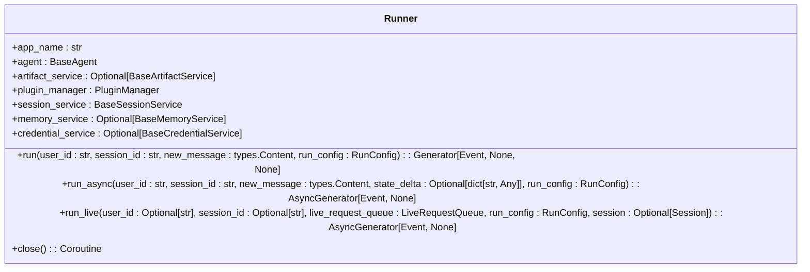
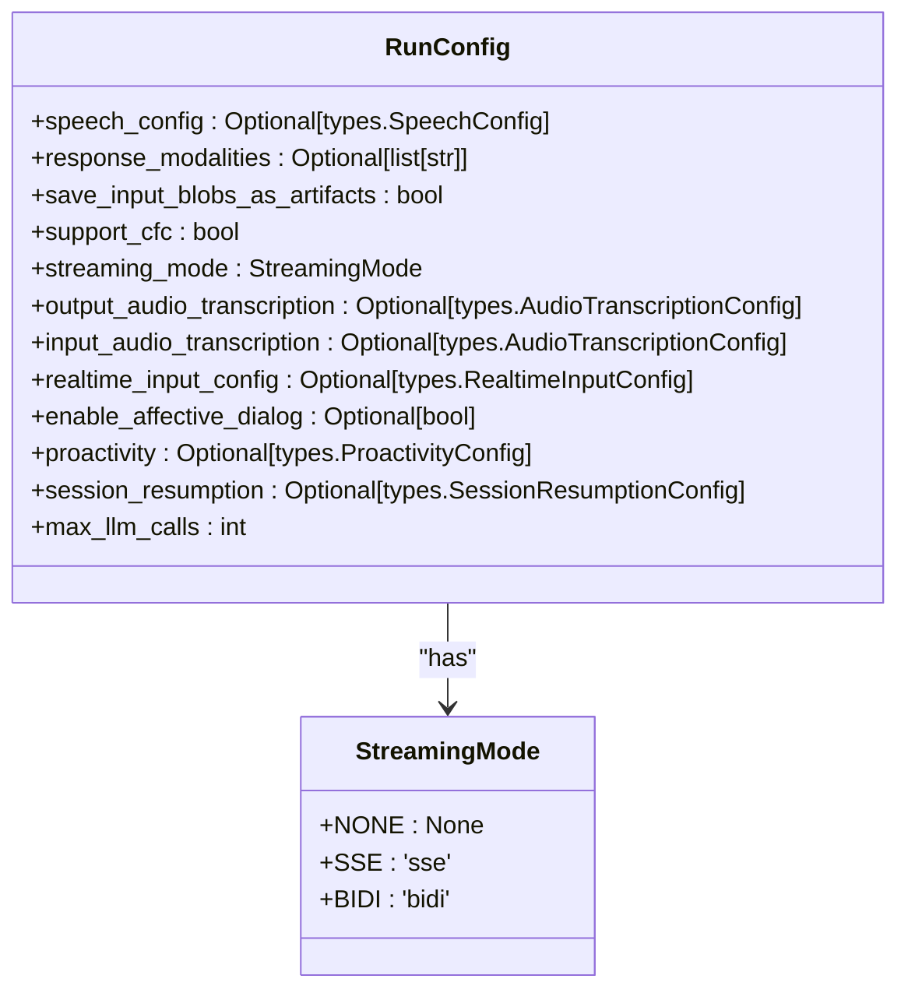
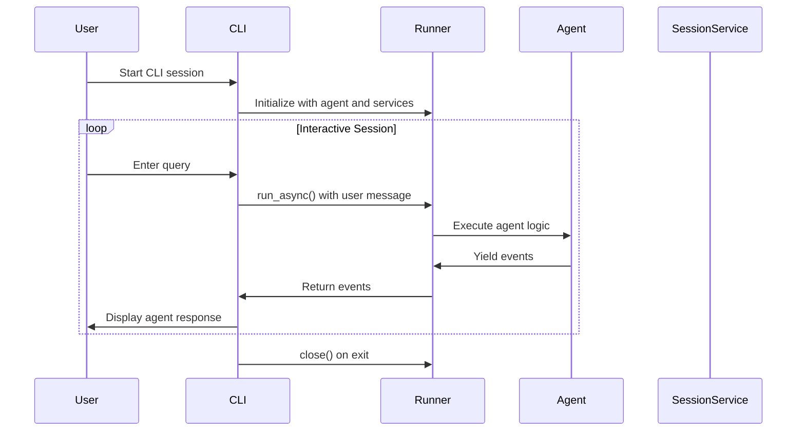
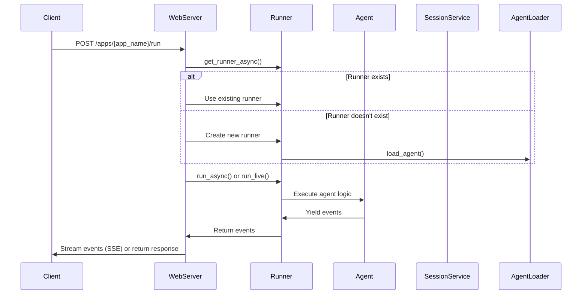
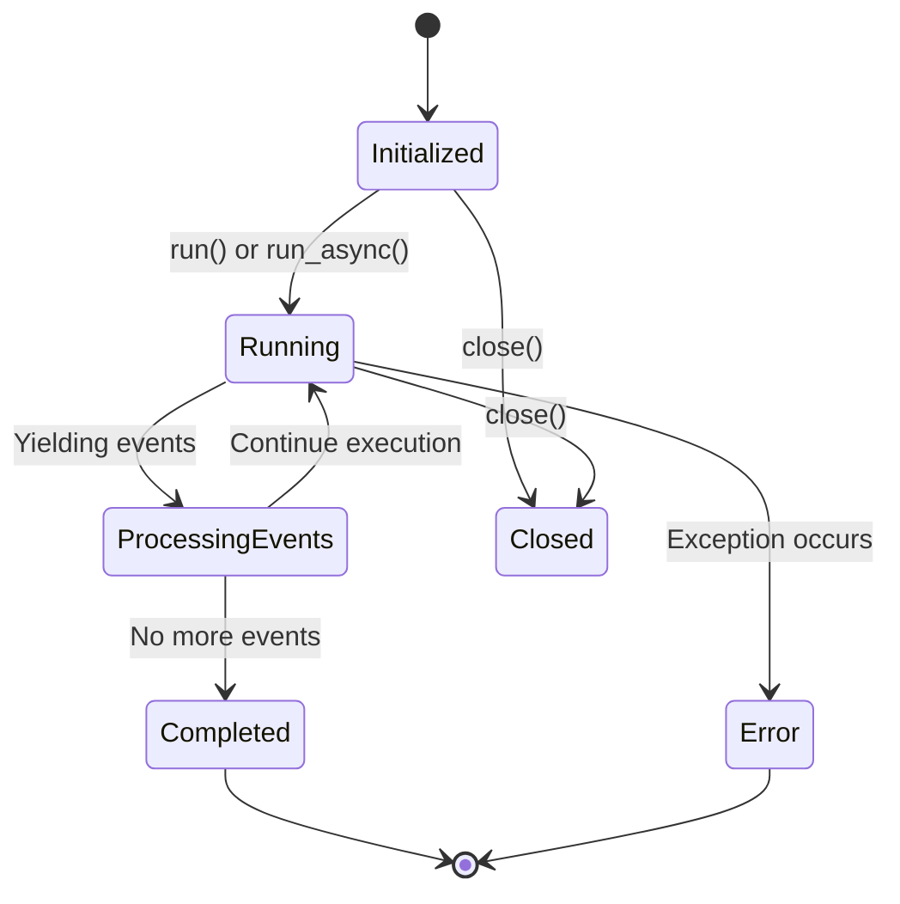
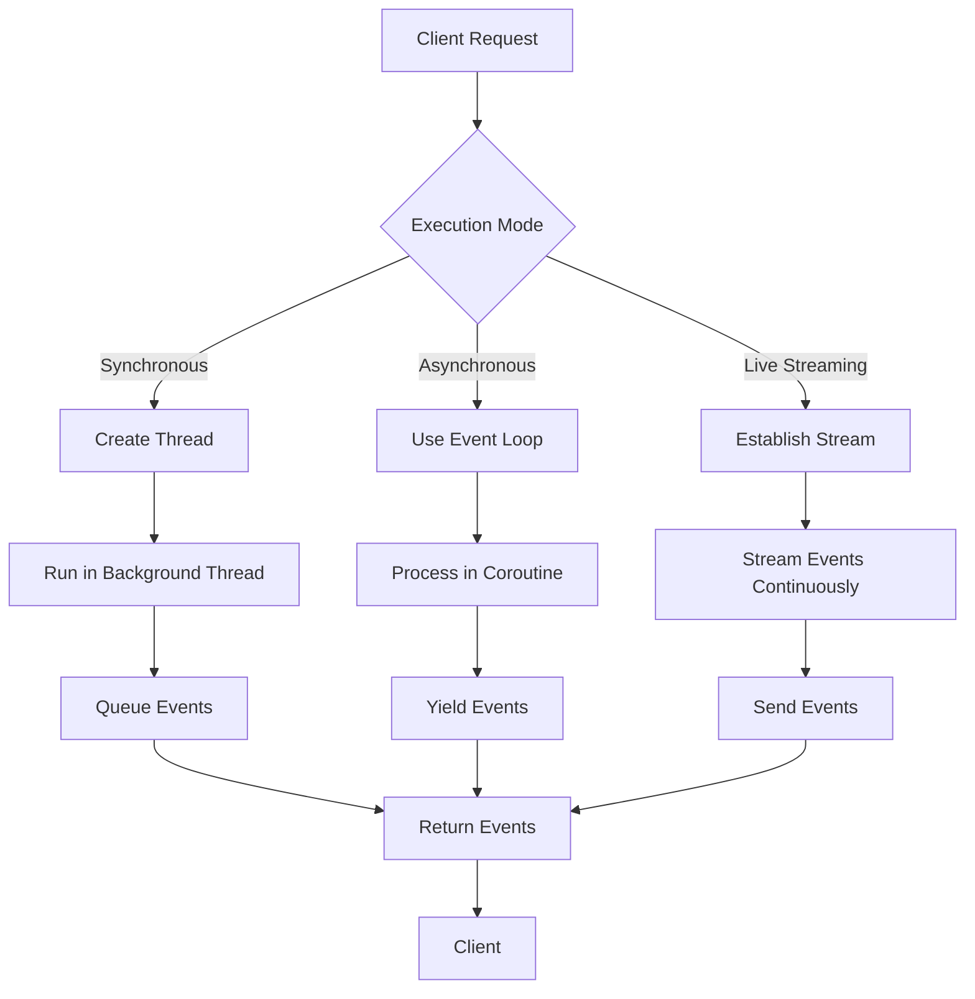

# Runner Classes

<cite>
**Referenced Files in This Document**   
- [runners.py](file://src/google/adk/runners.py)
- [run_config.py](file://src/google/adk/agents/run_config.py)
- [adk_web_server.py](file://src/google/adk/cli/adk_web_server.py)
- [cli.py](file://src/google/adk/cli/cli.py)
- [fast_api.py](file://src/google/adk/cli/fast_api.py)
- [event.py](file://src/google/adk/events/event.py)
</cite>

## Table of Contents
1. [Introduction](#introduction)
2. [Runner Class Interface](#runner-class-interface)
3. [Execution Modes](#execution-modes)
4. [Integration with CLI and Web Server](#integration-with-cli-and-web-server)
5. [Lifecycle Events and Error Handling](#lifecycle-events-and-error-handling)
6. [Programmatic Invocation Examples](#programmatic-invocation-examples)
7. [Performance Considerations](#performance-considerations)
8. [Conclusion](#conclusion)

## Introduction
The Runner system orchestrates agent execution within the ADK framework, providing a unified interface for managing agent interactions, session state, and event processing. The core `Runner` class serves as the execution engine that coordinates agent behavior across various execution modes including synchronous, asynchronous, and live streaming. This documentation details the Runner class interface, configuration options, integration points with CLI and web server components, lifecycle management, and performance characteristics for high-concurrency scenarios.

**Section sources**
- [runners.py](file://src/google/adk/runners.py#L58-L678)

## Runner Class Interface

The `Runner` class provides the primary interface for executing agents within the ADK framework. It manages the complete lifecycle of agent execution, from initialization through termination, while handling message processing, event generation, and interaction with various services.

### Core Methods

The Runner class exposes three primary execution methods that support different execution patterns:



**Diagram sources**
- [runners.py](file://src/google/adk/runners.py#L58-L678)

#### run() Method
The `run()` method provides a synchronous interface for agent execution. This method is primarily intended for local testing and convenience purposes, as it wraps the asynchronous execution in a separate thread to maintain compatibility with synchronous code.

```python
def run(
    self,
    *,
    user_id: str,
    session_id: str,
    new_message: types.Content,
    run_config: RunConfig = RunConfig(),
) -> Generator[Event, None, None]:
```

**Section sources**
- [runners.py](file://src/google/adk/runners.py#L120-L177)

#### run_async() Method
The `run_async()` method is the main entry point for asynchronous agent execution. It returns an asynchronous generator that yields events as they are produced during agent execution, enabling real-time processing of agent responses.

```python
async def run_async(
    self,
    *,
    user_id: str,
    session_id: str,
    new_message: types.Content,
    state_delta: Optional[dict[str, Any]] = None,
    run_config: RunConfig = RunConfig(),
) -> AsyncGenerator[Event, None]:
```

**Section sources**
- [runners.py](file://src/google/adk/runners.py#L179-L248)

#### run_live() Method
The `run_live()` method enables live mode execution (experimental feature), supporting bidirectional streaming for real-time interactions. This method is designed for scenarios requiring continuous data flow, such as audio/video streaming applications.

```python
async def run_live(
    self,
    *,
    user_id: Optional[str] = None,
    session_id: Optional[str] = None,
    live_request_queue: LiveRequestQueue,
    run_config: RunConfig = RunConfig(),
    session: Optional[Session] = None,
) -> AsyncGenerator[Event, None]:
```

**Section sources**
- [runners.py](file://src/google/adk/runners.py#L356-L462)

### Runner Attributes
The Runner class maintains several key attributes that define its execution context and dependencies:

- **app_name**: The application name associated with the runner
- **agent**: The root agent to be executed
- **artifact_service**: Service for managing artifacts (optional)
- **plugin_manager**: Manager for handling plugin execution
- **session_service**: Service for managing session state
- **memory_service**: Service for managing memory (optional)
- **credential_service**: Service for managing credentials (optional)

These attributes are initialized during Runner construction and provide the necessary infrastructure for agent execution across various services.

**Section sources**
- [runners.py](file://src/google/adk/runners.py#L66-L88)

## Execution Modes

The Runner system supports multiple execution modes through the `RunConfig` class, which provides configuration options for different execution scenarios including synchronous, asynchronous, and live streaming modes.

### RunConfig Class

The `RunConfig` class defines the configuration parameters that control agent execution behavior:



**Diagram sources**
- [run_config.py](file://src/google/adk/agents/run_config.py#L30-L110)

### Configuration Options

#### Streaming Mode Configuration
The `streaming_mode` parameter controls the streaming behavior of agent execution:

- **StreamingMode.NONE**: No streaming (default)
- **StreamingMode.SSE**: Server-Sent Events streaming
- **StreamingMode.BIDI**: Bidirectional streaming

The `support_cfc` parameter enables Compositional Function Calling, which is experimental and only applicable for StreamingMode.SSE.

#### Audio and Speech Configuration
The Runner supports various audio-related configurations for live interactions:

- **speech_config**: Speech configuration for live agents
- **response_modalities**: Output modalities (defaults to AUDIO)
- **output_audio_transcription**: Transcription configuration for audio responses
- **input_audio_transcription**: Transcription configuration for audio input
- **realtime_input_config**: Configuration for real-time audio input

#### Resource Management
The `max_llm_calls` parameter sets a limit on the total number of LLM calls for a given run, preventing infinite loops and controlling resource usage.

**Section sources**
- [run_config.py](file://src/google/adk/agents/run_config.py#L30-L110)

## Integration with CLI and Web Server

The Runner system integrates with both CLI and web server components, providing flexible interfaces for agent execution across different environments.

### CLI Integration

The CLI integration enables interactive agent execution through command-line interfaces. The `run_cli()` function in the CLI module demonstrates how the Runner is instantiated and used for interactive sessions:



**Diagram sources**
- [cli.py](file://src/google/adk/cli/cli.py#L122-L199)
- [runners.py](file://src/google/adk/runners.py#L58-L678)

The CLI implementation uses in-memory services for artifact, session, and credential management, making it suitable for local testing and development.

**Section sources**
- [cli.py](file://src/google/adk/cli/cli.py#L122-L199)

### Web Server Integration

The web server integration exposes the Runner functionality through REST APIs and streaming endpoints. The `AdkWebServer` class manages runner instances and provides HTTP endpoints for agent interaction:



**Diagram sources**
- [adk_web_server.py](file://src/google/adk/cli/adk_web_server.py#L210-L600)
- [runners.py](file://src/google/adk/runners.py#L58-L678)

The web server maintains a dictionary of runners (`runner_dict`) to cache instances and improve performance across multiple requests. It also handles runner cleanup during server shutdown.

**Section sources**
- [adk_web_server.py](file://src/google/adk/cli/adk_web_server.py#L210-L600)

## Lifecycle Events and Error Handling

The Runner system implements comprehensive lifecycle management and error handling to ensure reliable agent execution.

### Lifecycle Management

The Runner follows a well-defined lifecycle from initialization to termination:



**Diagram sources**
- [runners.py](file://src/google/adk/runners.py#L58-L678)

The `close()` method ensures proper cleanup of resources, particularly toolsets associated with agents:

```python
async def close(self):
    """Closes the runner."""
    await self._cleanup_toolsets(self._collect_toolset(self.agent))
```

This method recursively collects and closes all toolsets used by the agent and its sub-agents, with timeout protection to prevent hanging during cleanup.

**Section sources**
- [runners.py](file://src/google/adk/runners.py#L636-L638)

### Error Propagation

The Runner system propagates errors through the event stream, allowing clients to handle exceptions appropriately. When an error occurs during execution, it is raised as an exception and can be caught by the calling code.

The system also includes validation checks, such as verifying session existence before execution:

```python
session = await self.session_service.get_session(
    app_name=self.app_name, user_id=user_id, session_id=session_id
)
if not session:
    raise ValueError(f'Session not found: {session_id}')
```

**Section sources**
- [runners.py](file://src/google/adk/runners.py#L205-L208)

### Cancellation Semantics

The asynchronous nature of the Runner's execution methods supports cancellation through standard Python asyncio mechanisms. When a client disconnects or cancels a request, the underlying coroutine is cancelled, stopping further event generation.

For live streaming scenarios, the `LiveRequestQueue` parameter allows for bidirectional communication, enabling clients to send cancellation signals to the running agent.

**Section sources**
- [runners.py](file://src/google/adk/runners.py#L356-L462)

## Programmatic Invocation Examples

The Runner system can be invoked programmatically in various scenarios, from simple synchronous execution to complex streaming applications.

### Basic Synchronous Execution

```python
runner = Runner(
    app_name="my_app",
    agent=agent.root_agent,
    artifact_service=artifact_service,
    session_service=session_service,
)

session = await session_service.create_session(
    app_name="my_app", user_id="user_1"
)

content = types.Content(
    role='user', parts=[types.Part.from_text(text='Hello')]
)

for event in runner.run(
    user_id="user_1",
    session_id=session.id,
    new_message=content,
):
    if event.content.parts and event.content.parts[0].text:
        print(f'Agent: {event.content.parts[0].text}')
```

**Section sources**
- [callbacks/main.py](file://contributing/samples/callbacks/main.py#L38-L80)

### Asynchronous Execution with Event Processing

```python
async def run_prompt(session: Session, new_message: str):
    content = types.Content(
        role='user', parts=[types.Part.from_text(text=new_message)]
    )
    async for event in runner.run_async(
        user_id=user_id_1,
        session_id=session.id,
        new_message=content,
    ):
        if event.content.parts and event.content.parts[0].text:
            print(f'[{event.author}]: {event.content.parts[0].text}')
```

**Section sources**
- [callbacks/main.py](file://contributing/samples/callbacks/main.py#L48-L59)

### Live Streaming Execution

```python
async def run_live_interaction():
    live_queue = LiveRequestQueue()
    async for event in runner.run_live(
        user_id="user_1",
        session_id="session_1",
        live_request_queue=live_queue,
        run_config=RunConfig(streaming_mode=StreamingMode.BIDI)
    ):
        # Process streaming events
        yield event
```

**Section sources**
- [runners.py](file://src/google/adk/runners.py#L356-L462)

## Performance Considerations

The Runner system includes several features and considerations for optimizing performance in high-concurrency scenarios and managing resources during long-running executions.

### Concurrency and Resource Management

The asynchronous design of the Runner enables efficient handling of multiple concurrent requests. Each execution runs in its own coroutine, allowing the event loop to manage concurrency without blocking threads.

For resource management during long-running executions, the system implements:

- **Toolset cleanup**: Automatic cleanup of toolsets with timeout protection
- **Memory management**: Integration with memory services to control state size
- **LLM call limiting**: Configurable limits on the number of LLM calls per run



**Diagram sources**
- [runners.py](file://src/google/adk/runners.py#L58-L678)

### Caching and Instance Management

The web server integration implements runner caching to improve performance:

- **Runner dictionary**: Maintains a cache of runner instances by app name
- **Lazy initialization**: Creates runners on first request for an app
- **Cleanup management**: Tracks runners for cleanup during server shutdown

This approach reduces the overhead of agent loading and initialization for repeated requests to the same application.

**Section sources**
- [adk_web_server.py](file://src/google/adk/cli/adk_web_server.py#L210-L600)

### Scalability Considerations

For high-concurrency scenarios, consider the following:

- Use asynchronous execution (`run_async`) rather than synchronous (`run`) to maximize throughput
- Implement external session and artifact storage services instead of in-memory services
- Configure appropriate timeouts for toolset cleanup and LLM calls
- Monitor and limit the number of concurrent executions based on system resources

The system's modular design allows for scaling individual components independently, such as using distributed session storage or external memory services.

**Section sources**
- [runners.py](file://src/google/adk/runners.py#L58-L678)
- [adk_web_server.py](file://src/google/adk/cli/adk_web_server.py#L210-L600)

## Conclusion

The Runner system provides a comprehensive framework for orchestrating agent execution within the ADK ecosystem. With its support for multiple execution modes, flexible configuration options, and seamless integration with both CLI and web server components, the Runner enables a wide range of agent-based applications from simple synchronous interactions to complex live streaming scenarios.

Key features include:
- Unified interface for agent execution across different modes
- Comprehensive configuration through the RunConfig class
- Robust lifecycle management and error handling
- Efficient resource management for high-concurrency scenarios
- Flexible integration options for various deployment environments

By leveraging the Runner's capabilities, developers can build sophisticated agent applications with confidence in their reliability, performance, and scalability.

[No sources needed since this section summarizes without analyzing specific files]