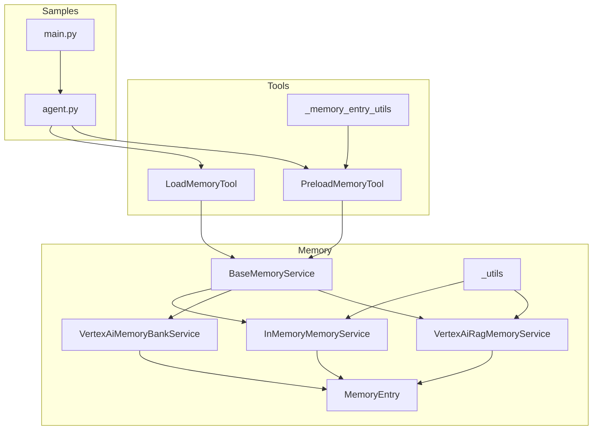
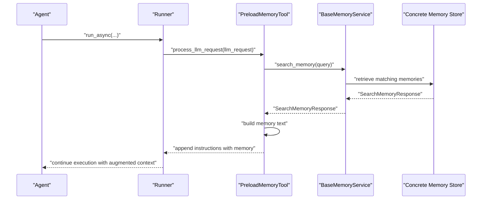
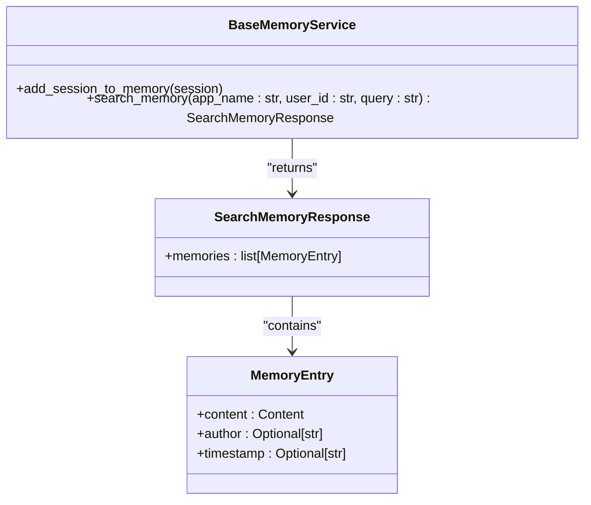
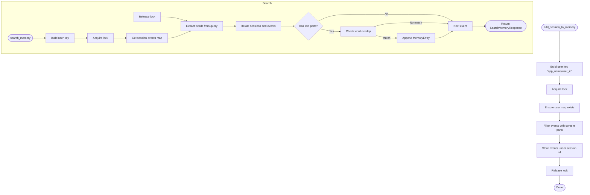
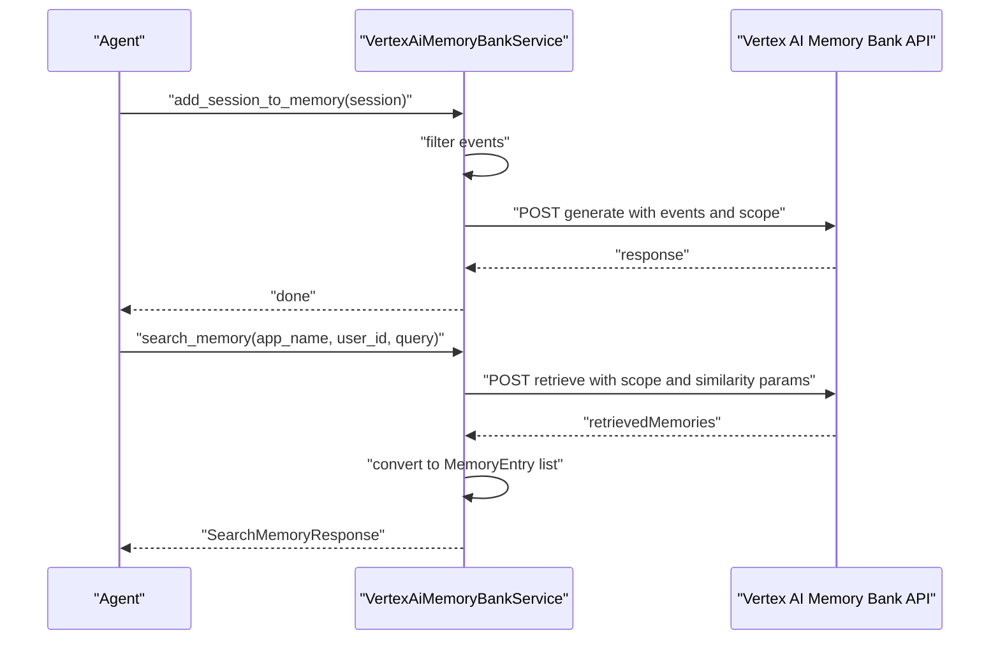
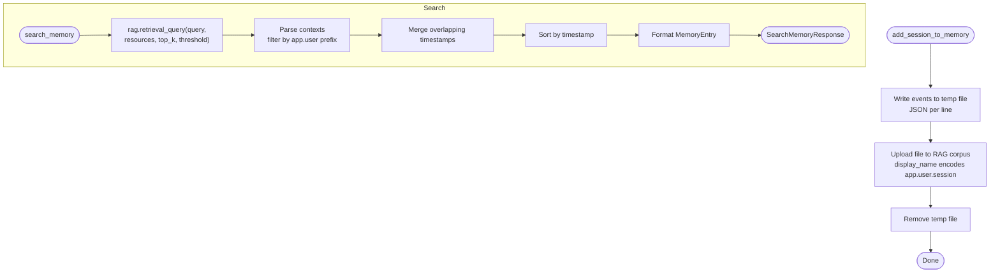
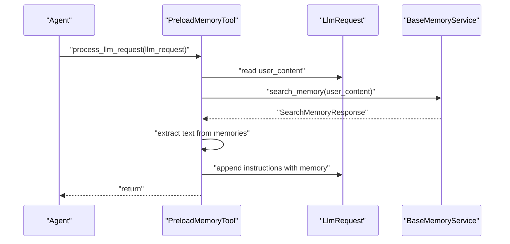
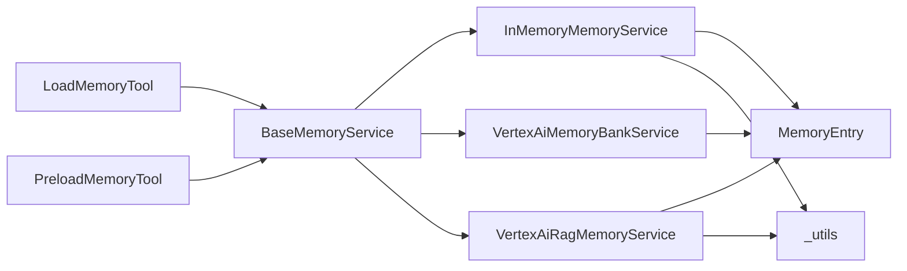

# Memory Services

<cite>
**Referenced Files in This Document**
- [base_memory_service.py](file://src/google/adk/memory/base_memory_service.py)
- [in_memory_memory_service.py](file://src/google/adk/memory/in_memory_memory_service.py)
- [vertex_ai_memory_bank_service.py](file://src/google/adk/memory/vertex_ai_memory_bank_service.py)
- [vertex_ai_rag_memory_service.py](file://src/google/adk/memory/vertex_ai_rag_memory_service.py)
- [memory_entry.py](file://src/google/adk/memory/memory_entry.py)
- [_utils.py](file://src/google/adk/memory/_utils.py)
- [load_memory_tool.py](file://src/google/adk/tools/load_memory_tool.py)
- [preload_memory_tool.py](file://src/google/adk/tools/preload_memory_tool.py)
- [_memory_entry_utils.py](file://src/google/adk/tools/_memory_entry_utils.py)
- [__init__.py](file://src/google/adk/memory/__init__.py)
- [agent.py](file://contributing/samples/memory/agent.py)
- [main.py](file://contributing/samples/memory/main.py)
- [test_in_memory_memory_service.py](file://tests/unittests/memory/test_in_memory_memory_service.py)
</cite>

## Table of Contents
1. [Introduction](#introduction)
2. [Project Structure](#project-structure)
3. [Core Components](#core-components)
4. [Architecture Overview](#architecture-overview)
5. [Detailed Component Analysis](#detailed-component-analysis)
6. [Dependency Analysis](#dependency-analysis)
7. [Performance Considerations](#performance-considerations)
8. [Troubleshooting Guide](#troubleshooting-guide)
9. [Conclusion](#conclusion)
10. [Appendices](#appendices)

## Introduction
This document provides comprehensive API documentation for memory services in the ADK. It covers the BaseMemoryService interface and three implementations:
- InMemoryMemoryService: ephemeral storage with keyword-based matching
- VertexAiMemoryBankService: vector-backed storage and semantic retrieval
- VertexAiRagMemoryService: retrieval-augmented generation with chunking and relevance scoring

It also documents how memory augmentation works in agent prompts, performance considerations for large datasets, and best practices for memory cleanup and privacy compliance.

## Project Structure
The memory subsystem resides under src/google/adk/memory and integrates with tools and sessions to enable memory-aware agents.

**Diagram sources**
- [base_memory_service.py](file://src/google/adk/memory/base_memory_service.py#L41-L79)
- [in_memory_memory_service.py](file://src/google/adk/memory/in_memory_memory_service.py#L41-L102)
- [vertex_ai_memory_bank_service.py](file://src/google/adk/memory/vertex_ai_memory_bank_service.py#L38-L165)
- [vertex_ai_rag_memory_service.py](file://src/google/adk/memory/vertex_ai_rag_memory_service.py#L39-L201)
- [memory_entry.py](file://src/google/adk/memory/memory_entry.py#L24-L38)
- [_utils.py](file://src/google/adk/memory/_utils.py#L21-L24)
- [load_memory_tool.py](file://src/google/adk/tools/load_memory_tool.py#L36-L94)
- [preload_memory_tool.py](file://src/google/adk/tools/preload_memory_tool.py#L29-L85)
- [_memory_entry_utils.py](file://src/google/adk/tools/_memory_entry_utils.py#L24-L31)
- [agent.py](file://contributing/samples/memory/agent.py#L16-L43)
- [main.py](file://contributing/samples/memory/main.py#L31-L110)

**Section sources**
- [__init__.py](file://src/google/adk/memory/__init__.py#L16-L38)

## Core Components
- BaseMemoryService: Defines the contract for adding sessions to memory and searching memory scoped by app_name and user_id.
- InMemoryMemoryService: Stores session events in memory keyed by app_name/user_id and performs keyword matching for retrieval.
- VertexAiMemoryBankService: Integrates with Vertex AI Memory Bank to ingest and retrieve memories using semantic similarity.
- VertexAiRagMemoryService: Uploads session text to Vertex AI RAG and retrieves relevant chunks with overlap merging and timestamp ordering.
- MemoryEntry: Standardized representation of a memory item with content, author, and timestamp.
- Tools: LoadMemoryTool and PreloadMemoryTool integrate memory retrieval into agent prompts.

**Section sources**
- [base_memory_service.py](file://src/google/adk/memory/base_memory_service.py#L41-L79)
- [in_memory_memory_service.py](file://src/google/adk/memory/in_memory_memory_service.py#L41-L102)
- [vertex_ai_memory_bank_service.py](file://src/google/adk/memory/vertex_ai_memory_bank_service.py#L38-L165)
- [vertex_ai_rag_memory_service.py](file://src/google/adk/memory/vertex_ai_rag_memory_service.py#L39-L201)
- [memory_entry.py](file://src/google/adk/memory/memory_entry.py#L24-L38)
- [load_memory_tool.py](file://src/google/adk/tools/load_memory_tool.py#L36-L94)
- [preload_memory_tool.py](file://src/google/adk/tools/preload_memory_tool.py#L29-L85)

## Architecture Overview
The memory services implement a common interface and are designed to be interchangeable. Agents can use tools to augment prompts with memory content or trigger explicit memory loading.

**Diagram sources**
- [preload_memory_tool.py](file://src/google/adk/tools/preload_memory_tool.py#L44-L85)
- [base_memory_service.py](file://src/google/adk/memory/base_memory_service.py#L61-L79)
- [in_memory_memory_service.py](file://src/google/adk/memory/in_memory_memory_service.py#L71-L102)
- [vertex_ai_memory_bank_service.py](file://src/google/adk/memory/vertex_ai_memory_bank_service.py#L97-L134)
- [vertex_ai_rag_memory_service.py](file://src/google/adk/memory/vertex_ai_rag_memory_service.py#L108-L173)

## Detailed Component Analysis

### BaseMemoryService Interface
- Responsibilities:
  - Ingest sessions into memory for later retrieval.
  - Search memory scoped by app_name and user_id.
- Methods:
  - add_session_to_memory(session): Asynchronous ingestion of session events.
  - search_memory(app_name: str, user_id: str, query: str) -> SearchMemoryResponse: Asynchronous retrieval with matching memories.

**Diagram sources**
- [base_memory_service.py](file://src/google/adk/memory/base_memory_service.py#L31-L79)
- [memory_entry.py](file://src/google/adk/memory/memory_entry.py#L24-L38)

**Section sources**
- [base_memory_service.py](file://src/google/adk/memory/base_memory_service.py#L41-L79)

### InMemoryMemoryService
- Purpose: Ephemeral, in-process memory for development and testing.
- Storage model:
  - Thread-safe dictionary keyed by "app_name/user_id".
  - Per-session list of events with content parts retained.
- Retrieval:
  - Keyword-based matching using extracted words from query and event text.
  - Results are wrapped as MemoryEntry with formatted timestamps.
- Lifecycle:
  - Sessions are stored per user scope.
  - No persistence across process restarts.
  - Events without content parts are filtered out.

**Diagram sources**
- [in_memory_memory_service.py](file://src/google/adk/memory/in_memory_memory_service.py#L59-L102)
- [_utils.py](file://src/google/adk/memory/_utils.py#L21-L24)

**Section sources**
- [in_memory_memory_service.py](file://src/google/adk/memory/in_memory_memory_service.py#L41-L102)
- [_utils.py](file://src/google/adk/memory/_utils.py#L21-L24)
- [test_in_memory_memory_service.py](file://tests/unittests/memory/test_in_memory_memory_service.py#L105-L220)

### VertexAiMemoryBankService
- Purpose: Vector-backed memory using Vertex AI Memory Bank.
- Ingestion:
  - Filters out events without usable content parts.
  - Sends events to Memory Bank generate endpoint with scope (app_name, user_id).
- Retrieval:
  - Calls Memory Bank retrieve endpoint with similarity search query.
  - Converts API response to MemoryEntry list.
- Scope:
  - Requires agent_engine_id; raises error if missing.
  - Uses scope to constrain retrieval to app_name and user_id.

**Diagram sources**
- [vertex_ai_memory_bank_service.py](file://src/google/adk/memory/vertex_ai_memory_bank_service.py#L61-L134)

**Section sources**
- [vertex_ai_memory_bank_service.py](file://src/google/adk/memory/vertex_ai_memory_bank_service.py#L38-L165)

### VertexAiRagMemoryService
- Purpose: RAG-based memory using Vertex AI RAG corpus.
- Ingestion:
  - Writes session events to a temporary text file, one JSON event per line.
  - Uploads file to RAG corpus with display_name encoding session identifiers.
- Retrieval:
  - Performs rag.retrieval_query with similarity_top_k and vector_distance_threshold.
  - Filters contexts by app_name.user_id prefix.
  - Merges overlapping timestamps across chunk boundaries.
  - Sorts events by timestamp and formats MemoryEntry.
- Chunking and relevance:
  - Uses Vertex RAG chunking and vector distance threshold.
  - Relevance determined by similarity_top_k and vector_distance_threshold.

**Diagram sources**
- [vertex_ai_rag_memory_service.py](file://src/google/adk/memory/vertex_ai_rag_memory_service.py#L66-L173)
- [_utils.py](file://src/google/adk/memory/_utils.py#L21-L24)

**Section sources**
- [vertex_ai_rag_memory_service.py](file://src/google/adk/memory/vertex_ai_rag_memory_service.py#L39-L201)
- [_utils.py](file://src/google/adk/memory/_utils.py#L21-L24)

### Memory Augmentation in Agent Prompts
- PreloadMemoryTool: Automatically augments the current LLM request with relevant memory text before model inference. It builds a structured memory block and injects it as instructions.
- LoadMemoryTool: Provides a function-call interface to explicitly load memory for a query and append it to the model’s instructions.

**Diagram sources**
- [preload_memory_tool.py](file://src/google/adk/tools/preload_memory_tool.py#L44-L85)
- [load_memory_tool.py](file://src/google/adk/tools/load_memory_tool.py#L36-L94)
- [_memory_entry_utils.py](file://src/google/adk/tools/_memory_entry_utils.py#L24-L31)

**Section sources**
- [preload_memory_tool.py](file://src/google/adk/tools/preload_memory_tool.py#L29-L85)
- [load_memory_tool.py](file://src/google/adk/tools/load_memory_tool.py#L32-L94)
- [_memory_entry_utils.py](file://src/google/adk/tools/_memory_entry_utils.py#L24-L31)

## Dependency Analysis
- Cohesion:
  - Each memory service encapsulates its own storage and retrieval logic.
- Coupling:
  - All services depend on BaseMemoryService and MemoryEntry.
  - Vertex services depend on external Vertex AI SDKs.
- External dependencies:
  - Vertex AI GenAI client and Vertex AI RAG preview modules.
- Import behavior:
  - VertexAiRagMemoryService is conditionally imported; absence logs a debug message.

**Diagram sources**
- [base_memory_service.py](file://src/google/adk/memory/base_memory_service.py#L41-L79)
- [in_memory_memory_service.py](file://src/google/adk/memory/in_memory_memory_service.py#L41-L102)
- [vertex_ai_memory_bank_service.py](file://src/google/adk/memory/vertex_ai_memory_bank_service.py#L38-L165)
- [vertex_ai_rag_memory_service.py](file://src/google/adk/memory/vertex_ai_rag_memory_service.py#L39-L201)
- [memory_entry.py](file://src/google/adk/memory/memory_entry.py#L24-L38)
- [_utils.py](file://src/google/adk/memory/_utils.py#L21-L24)
- [load_memory_tool.py](file://src/google/adk/tools/load_memory_tool.py#L36-L94)
- [preload_memory_tool.py](file://src/google/adk/tools/preload_memory_tool.py#L29-L85)

**Section sources**
- [__init__.py](file://src/google/adk/memory/__init__.py#L16-L38)

## Performance Considerations
- InMemoryMemoryService:
  - Keyword matching scales with number of sessions and events; consider limiting sessions or using a more efficient indexing strategy for production.
  - Thread-safety is ensured via locks; avoid long-running operations inside locked regions.
- VertexAiMemoryBankService:
  - Network latency dominates; batch ingestion and reuse scopes to minimize repeated uploads.
  - Ensure agent_engine_id is configured to avoid runtime errors.
- VertexAiRagMemoryService:
  - File upload overhead; consider compressing or batching sessions.
  - similarity_top_k and vector_distance_threshold impact latency and relevance trade-offs.
  - Merging overlapping timestamps is linear in number of chunks; tune thresholds to reduce overlap.
- General:
  - Prefer incremental updates and avoid re-ingesting unchanged sessions.
  - Monitor API quotas and rate limits for Vertex AI services.

[No sources needed since this section provides general guidance]

## Troubleshooting Guide
- Missing agent_engine_id in VertexAiMemoryBankService:
  - Symptom: ValueError raised during ingestion.
  - Resolution: Provide agent_engine_id in service initialization.
- No events ingested:
  - Symptom: Logs indicate no events to add.
  - Cause: Events lack content parts.
  - Resolution: Ensure events have text or supported parts.
- Empty search results:
  - InMemoryMemoryService: Adjust query words or verify session content.
  - Vertex services: Verify scope (app_name, user_id) and query phrasing.
- RAG upload failures:
  - Symptom: ValueError about rag resources.
  - Resolution: Configure rag_corpus resource identifier before ingestion.
- Memory augmentation not appearing:
  - Ensure PreloadMemoryTool is registered and active in the agent.
  - Confirm user_content exists and contains text.

**Section sources**
- [vertex_ai_memory_bank_service.py](file://src/google/adk/memory/vertex_ai_memory_bank_service.py#L61-L95)
- [vertex_ai_rag_memory_service.py](file://src/google/adk/memory/vertex_ai_rag_memory_service.py#L93-L106)
- [test_in_memory_memory_service.py](file://tests/unittests/memory/test_in_memory_memory_service.py#L105-L220)

## Conclusion
The ADK memory services provide a flexible, extensible foundation for long-term memory storage and retrieval. Choose InMemoryMemoryService for rapid prototyping, VertexAiMemoryBankService for semantic vector search, and VertexAiRagMemoryService for retrieval-augmented generation with chunking and relevance controls. Integrate memory via tools to enhance agent prompts and ensure robust performance and privacy practices.

[No sources needed since this section summarizes without analyzing specific files]

## Appendices

### API Reference Summary

- BaseMemoryService
  - add_session_to_memory(session)
  - search_memory(app_name: str, user_id: str, query: str) -> SearchMemoryResponse

- InMemoryMemoryService
  - add_session_to_memory(session)
  - search_memory(app_name: str, user_id: str, query: str) -> SearchMemoryResponse

- VertexAiMemoryBankService
  - __init__(project=None, location=None, agent_engine_id=None)
  - add_session_to_memory(session)
  - search_memory(app_name: str, user_id: str, query: str) -> SearchMemoryResponse

- VertexAiRagMemoryService
  - __init__(rag_corpus=None, similarity_top_k=None, vector_distance_threshold=10)
  - add_session_to_memory(session)
  - search_memory(app_name: str, user_id: str, query: str) -> SearchMemoryResponse

- MemoryEntry
  - content: Content
  - author: Optional[str]
  - timestamp: Optional[str]

- Tools
  - LoadMemoryTool: load_memory(query, tool_context) -> LoadMemoryResponse
  - PreloadMemoryTool: process_llm_request(tool_context, llm_request)

**Section sources**
- [base_memory_service.py](file://src/google/adk/memory/base_memory_service.py#L41-L79)
- [in_memory_memory_service.py](file://src/google/adk/memory/in_memory_memory_service.py#L41-L102)
- [vertex_ai_memory_bank_service.py](file://src/google/adk/memory/vertex_ai_memory_bank_service.py#L38-L165)
- [vertex_ai_rag_memory_service.py](file://src/google/adk/memory/vertex_ai_rag_memory_service.py#L39-L201)
- [memory_entry.py](file://src/google/adk/memory/memory_entry.py#L24-L38)
- [load_memory_tool.py](file://src/google/adk/tools/load_memory_tool.py#L32-L94)
- [preload_memory_tool.py](file://src/google/adk/tools/preload_memory_tool.py#L29-L85)

### Example Usage References
- Agent definition with memory tools:
  - [agent.py](file://contributing/samples/memory/agent.py#L16-L43)
- End-to-end sample showing session creation, memory ingestion, and retrieval:
  - [main.py](file://contributing/samples/memory/main.py#L31-L110)

**Section sources**
- [agent.py](file://contributing/samples/memory/agent.py#L16-L43)
- [main.py](file://contributing/samples/memory/main.py#L31-L110)

### Best Practices for Memory Cleanup and Privacy Compliance
- Cleanup:
  - Periodically remove outdated sessions from memory stores.
  - Implement retention policies aligned with app_name/user_id scoping.
- Privacy:
  - Avoid storing sensitive data; sanitize content before ingestion.
  - Respect user consent and data minimization principles.
  - Use scope parameters to limit visibility to appropriate users.
- Observability:
  - Log ingestion and retrieval operations with minimal PII.
  - Monitor API usage and adjust thresholds to balance performance and relevance.

[No sources needed since this section provides general guidance]