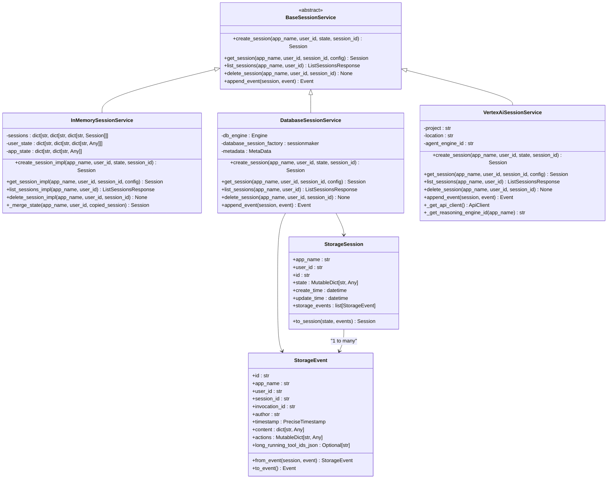
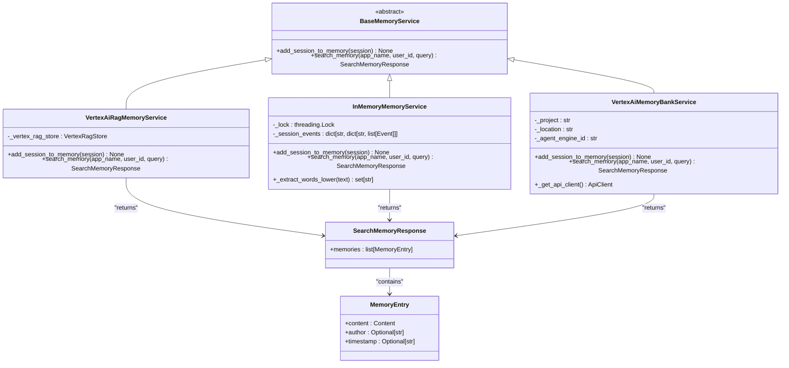
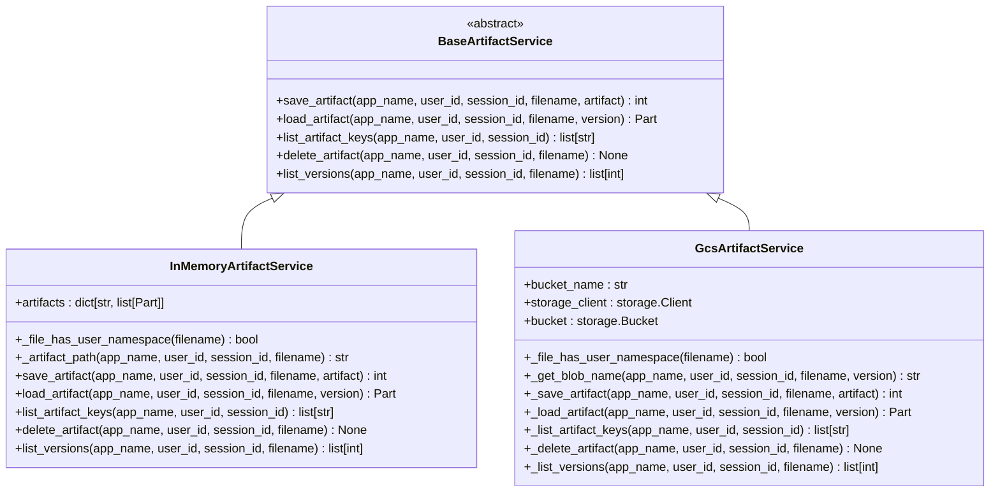

# Service Classes

<cite>
**Referenced Files in This Document**   
- [base_session_service.py](file://src/google/adk/sessions/base_session_service.py)
- [in_memory_session_service.py](file://src/google/adk/sessions/in_memory_session_service.py)
- [database_session_service.py](file://src/google/adk/sessions/database_session_service.py)
- [vertex_ai_session_service.py](file://src/google/adk/sessions/vertex_ai_session_service.py)
- [session.py](file://src/google/adk/sessions/session.py)
- [base_memory_service.py](file://src/google/adk/memory/base_memory_service.py)
- [in_memory_memory_service.py](file://src/google/adk/memory/in_memory_memory_service.py)
- [vertex_ai_memory_bank_service.py](file://src/google/adk/memory/vertex_ai_memory_bank_service.py)
- [vertex_ai_rag_memory_service.py](file://src/google/adk/memory/vertex_ai_rag_memory_service.py)
- [memory_entry.py](file://src/google/adk/memory/memory_entry.py)
- [base_artifact_service.py](file://src/google/adk/artifacts/base_artifact_service.py)
- [in_memory_artifact_service.py](file://src/google/adk/artifacts/in_memory_artifact_service.py)
- [gcs_artifact_service.py](file://src/google/adk/artifacts/gcs_artifact_service.py)
</cite>

## Table of Contents
1. [Introduction](#introduction)
2. [Session Services](#session-services)
3. [Memory Services](#memory-services)
4. [Artifact Services](#artifact-services)
5. [Service Integration with Agents](#service-integration-with-agents)
6. [Error Handling and Storage Failures](#error-handling-and-storage-failures)
7. [Scalability Considerations](#scalability-considerations)
8. [Data Consistency Models](#data-consistency-models)
9. [Conclusion](#conclusion)

## Introduction
This document provides comprehensive API documentation for the service classes in the ADK (Agent Development Kit) framework. The ADK framework offers three primary service categories: session services for managing conversation state and history, memory services for long-term memory storage and retrieval, and artifact services for handling file uploads, downloads, and metadata management. Each service category includes abstract base classes that define the interface contract and multiple concrete implementations tailored for different deployment scenarios, from in-memory prototypes to production-grade distributed systems. The services are designed to support agent-based applications with robust state management, scalable storage options, and integration capabilities with Google Cloud services like Vertex AI and Google Cloud Storage.

## Session Services
The session services in ADK provide comprehensive CRUD operations for managing user sessions, maintaining conversation state, and accessing conversation history. These services are built around the `BaseSessionService` abstract base class, which defines the core interface for session management operations. The session model includes essential attributes such as session ID, application name, user ID, state dictionary, event history, and last update timestamp. The state management system supports three distinct state scopes: session-scoped state for temporary data, user-scoped state for persistent user preferences, and application-scoped state for global configuration. The event-driven architecture captures all interactions within a session, including user inputs, model responses, function calls, and system events, enabling complete conversation history reconstruction. The service supports flexible event filtering through the `GetSessionConfig` class, which allows clients to retrieve only recent events or events occurring after a specific timestamp, optimizing data transfer for large conversation histories.

**Section sources**
- [base_session_service.py](file://src/google/adk/sessions/base_session_service.py#L1-L110)
- [session.py](file://src/google/adk/sessions/session.py#L1-L59)

### Session Service Implementations
ADK provides multiple implementations of the session service interface to accommodate different deployment requirements and scalability needs. The `InMemorySessionService` offers a lightweight, zero-dependency implementation suitable for development and testing environments. It stores all session data in Python dictionaries with thread-safe operations using locks, but is not recommended for production use due to its ephemeral nature and lack of persistence across process restarts. For production deployments requiring persistent storage, the `DatabaseSessionService` provides a robust solution using SQLAlchemy to interface with relational databases. This implementation supports multiple database backends including PostgreSQL, MySQL, and SQLite, with optimized schema design featuring JSONB columns for flexible state storage and proper indexing for efficient querying. The service handles complex state merging logic, combining session-specific state with user-level and application-level state according to predefined prefixes. For cloud-native deployments, the `VertexAiSessionService` integrates with Google Cloud's Vertex AI Agent Engine, providing managed session storage with automatic scaling, high availability, and advanced features like long-running operation (LRO) polling and exponential backoff retry mechanisms for reliable operation in distributed environments.

**Diagram sources**
- [base_session_service.py](file://src/google/adk/sessions/base_session_service.py#L43-L110)
- [in_memory_session_service.py](file://src/google/adk/sessions/in_memory_session_service.py#L35-L304)
- [database_session_service.py](file://src/google/adk/sessions/database_session_service.py#L369-L667)
- [vertex_ai_session_service.py](file://src/google/adk/sessions/vertex_ai_session_service.py#L48-L494)

## Memory Services
The memory services in ADK provide mechanisms for storing, retrieving, and querying long-term memories across different implementation strategies. The core interface is defined by the `BaseMemoryService` abstract base class, which specifies two primary operations: `add_session_to_memory` for ingesting session data into long-term storage and `search_memory` for retrieving relevant memories based on a query. The memory model centers around the `MemoryEntry` class, which encapsulates content, author information, and timestamp data in a structured format suitable for both keyword-based and semantic search. The service architecture supports multiple storage backends, allowing developers to choose the most appropriate implementation based on their application's requirements for search quality, scalability, and cost. The memory system is designed to handle both structured and unstructured data, with support for rich content types including text, images, and other multimodal inputs through the Google GenAI types system.

**Section sources**
- [base_memory_service.py](file://src/google/adk/memory/base_memory_service.py#L41-L79)
- [memory_entry.py](file://src/google/adk/memory/memory_entry.py#L24-L38)

### Memory Service Implementations
ADK offers three distinct implementations of the memory service interface, each optimized for different use cases and deployment scenarios. The `InMemoryMemoryService` provides a simple, prototype-grade implementation that uses keyword matching for memory retrieval. This implementation stores session events in nested dictionaries indexed by application and user identifiers, with thread-safe operations managed through explicit locks. While suitable for development and testing, it lacks semantic understanding and scales poorly with large datasets. For production applications requiring advanced semantic search capabilities, the `VertexAiMemoryBankService` integrates with Google Cloud's Vertex AI Memory Bank, leveraging large language models to generate and retrieve memories based on semantic similarity. This implementation supports complex state delta operations and provides robust error handling for API interactions. The third implementation, `VertexAiRagMemoryService`, utilizes Vertex AI's Retrieval-Augmented Generation (RAG) capabilities, storing conversation data in a RAG corpus and enabling vector-based similarity search. This implementation includes sophisticated merging logic to handle overlapping event timestamps and provides configurable parameters for similarity thresholds and result limits, making it ideal for applications requiring precise control over memory retrieval quality.

**Diagram sources**
- [base_memory_service.py](file://src/google/adk/memory/base_memory_service.py#L41-L79)
- [in_memory_memory_service.py](file://src/google/adk/memory/in_memory_memory_service.py#L41-L102)
- [vertex_ai_memory_bank_service.py](file://src/google/adk/memory/vertex_ai_memory_bank_service.py#L38-L165)
- [vertex_ai_rag_memory_service.py](file://src/google/adk/memory/vertex_ai_rag_memory_service.py#L39-L201)

## Artifact Services
The artifact services in ADK provide comprehensive functionality for file upload, download, metadata management, and binary data handling. The core interface is defined by the `BaseArtifactService` abstract base class, which specifies five essential operations: `save_artifact` for storing binary data, `load_artifact` for retrieving stored artifacts, `list_artifact_keys` for discovering available files, `delete_artifact` for removing files, and `list_versions` for managing artifact versioning. The service architecture supports both session-scoped artifacts and user-scoped artifacts through a namespace mechanism, where filenames prefixed with "user:" are treated as user-level artifacts accessible across sessions. Each artifact is versioned automatically, with revision IDs starting at 0 and incrementing with each save operation, enabling robust version control and audit capabilities. The artifact model leverages Google GenAI's `Part` type for representing binary data, supporting various content types including inline data with MIME type specification.

**Section sources**
- [base_artifact_service.py](file://src/google/adk/artifacts/base_artifact_service.py#L23-L124)

### Artifact Service Implementations
ADK provides two primary implementations of the artifact service interface to support different storage requirements and deployment scenarios. The `InMemoryArtifactService` offers a lightweight, development-focused implementation that stores artifacts in a Python dictionary structure indexed by a constructed path key. This implementation supports both session-scoped and user-scoped artifacts through path-based namespace separation and provides full versioning capabilities with revision tracking. While convenient for prototyping and testing, this implementation is not suitable for production use due to memory limitations and lack of persistence. For production deployments requiring scalable, durable storage, the `GcsArtifactService` integrates with Google Cloud Storage (GCS), providing enterprise-grade object storage with global availability, high durability, and seamless scalability. This implementation maps artifact identifiers to GCS blob names following a hierarchical structure that incorporates application name, user ID, session ID, filename, and version number. The service uses asynchronous operations with thread pooling to handle blocking I/O operations efficiently, ensuring non-blocking performance in concurrent environments. Both implementations support the complete artifact lifecycle, including version listing and deletion of specific artifact versions.

**Diagram sources**
- [base_artifact_service.py](file://src/google/adk/artifacts/base_artifact_service.py#L23-L124)
- [in_memory_artifact_service.py](file://src/google/adk/artifacts/in_memory_artifact_service.py#L29-L137)
- [gcs_artifact_service.py](file://src/google/adk/artifacts/gcs_artifact_service.py#L38-L287)

## Service Integration with Agents
The service classes in ADK are designed for seamless integration with agent-based applications, providing the foundational infrastructure for stateful, context-aware interactions. Agents leverage session services to maintain conversation continuity across multiple turns, with each interaction recorded as an event in the session history. This event-driven architecture enables agents to access complete conversation context, including previous user inputs, model responses, and tool calls, facilitating coherent and contextually appropriate responses. Memory services enhance agent capabilities by providing access to long-term user preferences, historical interactions, and domain knowledge, allowing agents to deliver personalized experiences and leverage past experiences for improved decision-making. Artifact services enable agents to handle file attachments, document processing, and multimedia content, expanding their functionality beyond text-based interactions. The integration pattern follows a dependency injection model, where services are provided to agents at initialization time, allowing agents to focus on business logic while delegating state management and data persistence concerns to the appropriate service layers.

**Section sources**
- [base_session_service.py](file://src/google/adk/sessions/base_session_service.py#L43-L110)
- [base_memory_service.py](file://src/google/adk/memory/base_memory_service.py#L41-L79)
- [base_artifact_service.py](file://src/google/adk/artifacts/base_artifact_service.py#L23-L124)

## Error Handling and Storage Failures
The service classes in ADK implement comprehensive error handling strategies to ensure robust operation in the face of storage failures and other exceptional conditions. Each service follows a consistent pattern of validating inputs, handling exceptions at the boundary, and providing meaningful error messages to callers. The `DatabaseSessionService` includes sophisticated error handling for database connectivity issues, SQL injection protection through parameterized queries, and transaction management to ensure data consistency. It converts low-level database exceptions into higher-level application exceptions with descriptive messages, making it easier for developers to diagnose and resolve issues. The `VertexAiSessionService` and `VertexAiMemoryBankService` implement retry mechanisms with exponential backoff for handling transient API failures, using the tenacity library to manage retry logic with configurable parameters. These services also include timeout handling and circuit breaker patterns to prevent cascading failures in distributed environments. The `GcsArtifactService` handles network-related exceptions during blob operations and provides graceful degradation when artifacts are not found, returning None rather than raising exceptions for missing resources. All services include comprehensive logging using Python's logging framework, with structured log messages that include relevant context for debugging and monitoring.

**Section sources**
- [database_session_service.py](file://src/google/adk/sessions/database_session_service.py#L378-L391)
- [vertex_ai_session_service.py](file://src/google/adk/sessions/vertex_ai_session_service.py#L121-L167)
- [gcs_artifact_service.py](file://src/google/adk/artifacts/gcs_artifact_service.py#L316-L324)

## Scalability Considerations
The service implementations in ADK are designed with scalability in mind, offering multiple options to accommodate applications with varying performance and capacity requirements. The in-memory implementations (`InMemorySessionService`, `InMemoryMemoryService`, `InMemoryArtifactService`) are optimized for single-process, single-threaded scenarios and are suitable for development and testing but have inherent limitations in terms of memory usage and persistence. For horizontally scalable deployments, the database-backed `DatabaseSessionService` supports connection pooling, query optimization, and database clustering, enabling it to handle high concurrency and large datasets. The schema design incorporates efficient indexing on frequently queried fields and uses appropriate data types like JSONB for flexible state storage. The cloud-native implementations (`VertexAiSessionService`, `VertexAiMemoryBankService`, `GcsArtifactService`) leverage Google Cloud's managed services, which provide automatic scaling, load balancing, and global distribution. These services are designed to handle unpredictable workloads and can scale from zero to thousands of requests per second without manual intervention. The asynchronous, non-blocking design of all service methods ensures efficient resource utilization in concurrent environments, preventing thread starvation and enabling high throughput.

**Section sources**
- [database_session_service.py](file://src/google/adk/sessions/database_session_service.py#L372-L408)
- [vertex_ai_session_service.py](file://src/google/adk/sessions/vertex_ai_session_service.py#L54-L69)
- [gcs_artifact_service.py](file://src/google/adk/artifacts/gcs_artifact_service.py#L41-L51)

## Data Consistency Models
The service classes in ADK implement different data consistency models depending on the underlying storage technology and use case requirements. The `InMemorySessionService` provides strong consistency within a single process, ensuring that all operations on session state are immediately visible to subsequent operations. However, this consistency guarantee does not extend across process boundaries, making it unsuitable for distributed deployments. The `DatabaseSessionService` leverages the ACID properties of relational databases to provide strong consistency, with transactions ensuring that state updates are atomic and durable. The service includes optimistic concurrency control through timestamp validation, preventing stale session updates by comparing the client-provided last update time with the storage timestamp. The `VertexAiSessionService` relies on the consistency model of the underlying Vertex AI infrastructure, which provides strong consistency for individual session operations but eventual consistency for list operations due to the distributed nature of the service. The artifact and memory services follow a write-once, read-many pattern with versioning, ensuring that once an artifact or memory is written, it remains immutable, providing strong consistency for read operations. This versioned approach also enables time-travel queries and audit capabilities.

**Section sources**
- [in_memory_session_service.py](file://src/google/adk/sessions/in_memory_session_service.py#L261-L303)
- [database_session_service.py](file://src/google/adk/sessions/database_session_service.py#L579-L641)
- [vertex_ai_session_service.py](file://src/google/adk/sessions/vertex_ai_session_service.py#L327-L338)

## Conclusion
The service classes in ADK provide a comprehensive, extensible framework for managing state, memory, and artifacts in agent-based applications. By defining clear interfaces through abstract base classes and providing multiple implementations for different deployment scenarios, ADK enables developers to build applications that can evolve from prototype to production with minimal code changes. The session services offer robust conversation management with flexible state scoping and event history, while the memory services provide both simple keyword-based and advanced semantic search capabilities. The artifact services enable rich file handling with versioning and namespace management. All services are designed with production readiness in mind, incorporating comprehensive error handling, scalability considerations, and appropriate data consistency models. The integration with Google Cloud services like Vertex AI and Google Cloud Storage ensures that applications can leverage enterprise-grade infrastructure for high availability, global distribution, and automatic scaling. This architecture allows developers to focus on agent logic and user experience while relying on the ADK framework for reliable, scalable state management.