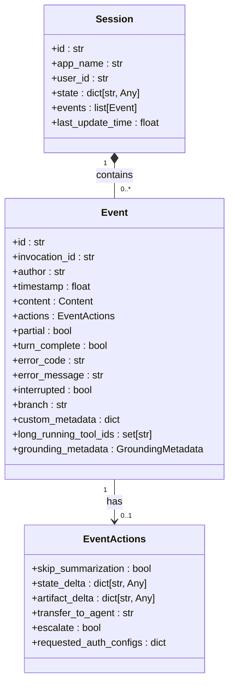
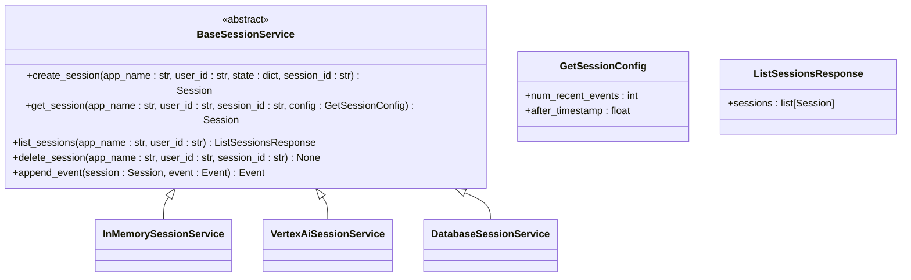
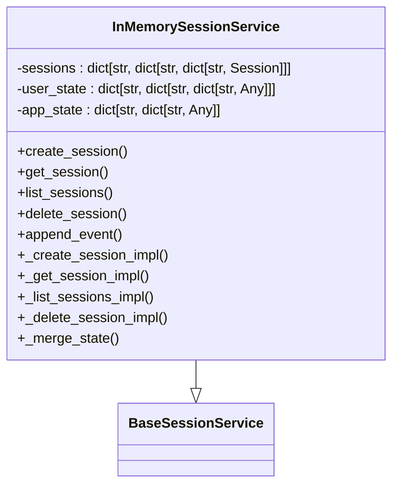
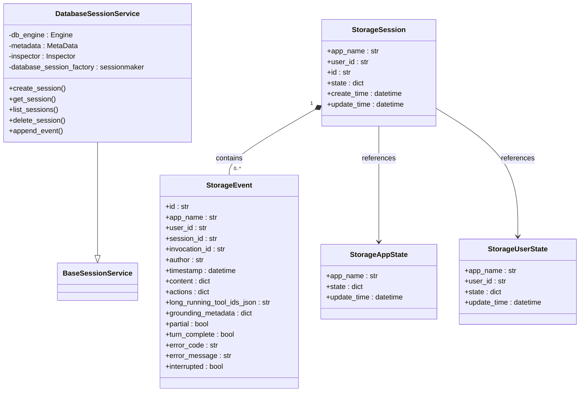
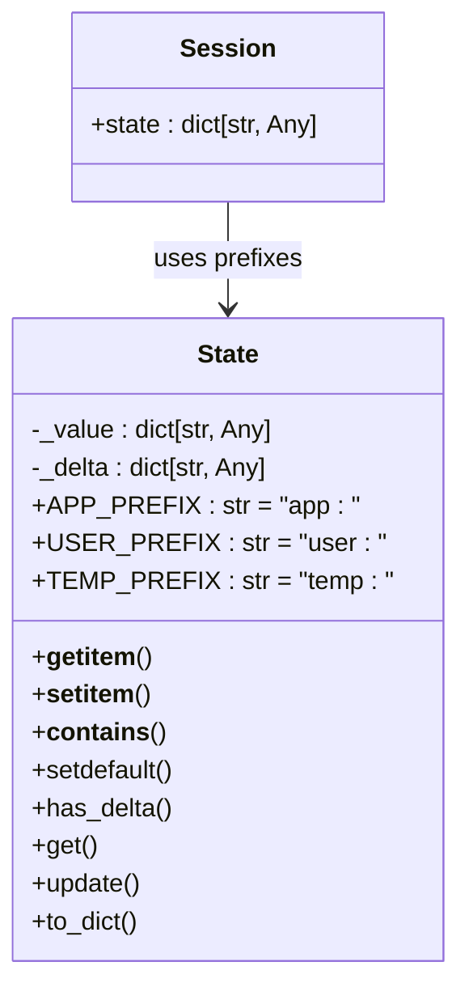
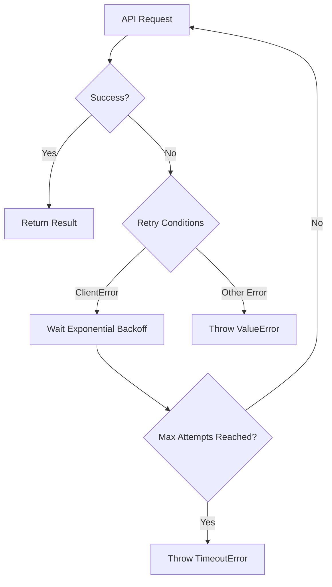

# Session Services

<cite>
**Referenced Files in This Document**   
- [session.py](file://src/google/adk/sessions/session.py)
- [base_session_service.py](file://src/google/adk/sessions/base_session_service.py)
- [in_memory_session_service.py](file://src/google/adk/sessions/in_memory_session_service.py)
- [vertex_ai_session_service.py](file://src/google/adk/sessions/vertex_ai_session_service.py)
- [state.py](file://src/google/adk/sessions/state.py)
- [database_session_service.py](file://src/google/adk/sessions/database_session_service.py)
- [test_session_service.py](file://tests/unittests/sessions/test_session_service.py)
- [test_vertex_ai_session_service.py](file://tests/unittests/sessions/test_vertex_ai_session_service.py)
</cite>

## Table of Contents
1. [Introduction](#introduction)
2. [Session Class Structure](#session-class-structure)
3. [BaseSessionService Interface](#basesessionservice-interface)
4. [InMemorySessionService Implementation](#inmemorysessionservice-implementation)
5. [VertexAISessionService Implementation](#vertexaisessionservice-implementation)
6. [DatabaseSessionService Implementation](#databasesessionservice-implementation)
7. [State Management](#state-management)
8. [Performance and Data Consistency](#performance-and-data-consistency)
9. [Error Recovery Patterns](#error-recovery-patterns)
10. [Conclusion](#conclusion)

## Introduction
The ADK (Agent Development Kit) session services provide a comprehensive framework for managing conversational state across agent interactions. This documentation details the architecture and implementation of session management components, focusing on the Session class structure, state variables, metadata handling, and various storage implementations. The system supports multiple session service implementations including in-memory, cloud-based (Vertex AI), and database-backed storage, each designed for different deployment scenarios and scalability requirements.

**Section sources**
- [session.py](file://src/google/adk/sessions/session.py#L1-L59)
- [base_session_service.py](file://src/google/adk/sessions/base_session_service.py#L1-L110)

## Session Class Structure

The Session class serves as the core data structure for maintaining conversational context in ADK. It encapsulates all information related to a user-agent interaction series, including conversation history, state variables, and metadata.



**Diagram sources**
- [session.py](file://src/google/adk/sessions/session.py#L25-L59)
- [base_session_service.py](file://src/google/adk/sessions/base_session_service.py#L22-L24)

The Session class contains the following key attributes:

- **id**: Unique identifier for the session
- **app_name**: Application identifier associated with the session
- **user_id**: User identifier for the session owner
- **state**: Dictionary containing session state variables that persist across agent invocations
- **events**: List of Event objects representing the conversation history
- **last_update_time**: Timestamp of the most recent session update

Each Event in the conversation history captures a single interaction, including user inputs, model responses, function calls, and system events. The event structure supports rich metadata for tracking conversation flow, error conditions, and tool execution status.

**Section sources**
- [session.py](file://src/google/adk/sessions/session.py#L25-L59)
- [base_session_service.py](file://src/google/adk/sessions/base_session_service.py#L22-L24)

## BaseSessionService Interface

The BaseSessionService provides an abstract interface for session lifecycle management, defining the core operations for creating, reading, updating, and deleting sessions. This interface enables consistent interaction with different storage backends while maintaining a uniform API.



**Diagram sources**
- [base_session_service.py](file://src/google/adk/sessions/base_session_service.py#L43-L110)

The interface defines the following key methods:

- **create_session**: Creates a new session with specified parameters including app_name, user_id, initial state, and optional client-provided session_id
- **get_session**: Retrieves a session by identifiers with optional filtering configuration
- **list_sessions**: Returns all sessions for a given app_name and user_id
- **delete_session**: Removes a session and all associated data
- **append_event**: Adds an event to a session while updating state variables

The GetSessionConfig class allows filtering of returned events based on:
- **num_recent_events**: Limits results to the most recent N events
- **after_timestamp**: Returns only events occurring after the specified timestamp

This interface abstraction enables seamless switching between different storage implementations while maintaining consistent behavior across the application.

**Section sources**
- [base_session_service.py](file://src/google/adk/sessions/base_session_service.py#L43-L110)

## InMemorySessionService Implementation

The InMemorySessionService provides a thread-safe, in-memory implementation of the session service interface suitable for development and testing environments. It implements efficient storage patterns with TTL-based cleanup mechanisms.



**Diagram sources**
- [in_memory_session_service.py](file://src/google/adk/sessions/in_memory_session_service.py#L35-L304)

The implementation uses a hierarchical dictionary structure for efficient data access:
- **sessions**: Three-level dictionary mapping app_name → user_id → session_id → Session
- **user_state**: Two-level dictionary for user-specific state variables
- **app_state**: Single-level dictionary for application-wide state variables

Key implementation features include:

- **Thread Safety**: While the implementation is not designed for multi-threaded production use, it includes defensive copying mechanisms to prevent state corruption
- **State Merging**: Automatically merges app-level and user-level state variables into session state during retrieval
- **Event Filtering**: Implements efficient slicing operations for recent events and timestamp-based filtering
- **Synchronous Methods**: Provides deprecated sync methods alongside async implementations for backward compatibility

The service is explicitly marked as unsuitable for production environments due to its in-memory nature and lack of persistence across application restarts.

**Section sources**
- [in_memory_session_service.py](file://src/google/adk/sessions/in_memory_session_service.py#L35-L304)

## VertexAISessionService Implementation

The VertexAISessionService integrates with Google Cloud's Vertex AI Agent Engine for scalable, cloud-based session storage. It provides robust cloud integration with schema mapping and pagination for handling long conversations.

```mermaid
classDiagram
class VertexAiSessionService {
-_project : str
-_location : str
-_agent_engine_id : str
+create_session()
+get_session()
+list_sessions()
+delete_session()
+append_event()
+_get_session_api_response()
+_get_reasoning_engine_id()
+_get_api_client()
}
VertexAiSessionService --|> BaseSessionService
VertexAiSessionService --> "GenAI API" : uses
```

**Diagram sources**
- [vertex_ai_session_service.py](file://src/google/adk/sessions/vertex_ai_session_service.py#L48-L494)

Key implementation aspects include:

- **Cloud Integration**: Connects to Vertex AI Agent Engine using GenAI API client with configurable project, location, and agent engine ID
- **Schema Mapping**: Translates between internal session/event models and Vertex AI API JSON schemas using conversion functions
- **Pagination**: Implements automatic pagination for long conversation histories by following nextPageToken in API responses
- **Retry Logic**: Employs exponential backoff retry strategies for handling transient API failures
- **Express Mode Support**: Handles differences between standard and Express deployment modes, including LRO (Long-Running Operation) polling

The service enforces cloud-specific constraints:
- Prohibits user-provided session IDs to ensure compatibility with Vertex AI's ID generation
- Validates app_name format, requiring either a full ReasoningEngine resource name or engine ID
- Implements strict user session isolation to prevent cross-user access

For long conversations, the implementation automatically handles pagination by:
1. Making initial request for events
2. Checking for nextPageToken in response
3. Continuing requests with page tokens until all events are retrieved
4. Sorting events chronologically before returning

**Section sources**
- [vertex_ai_session_service.py](file://src/google/adk/sessions/vertex_ai_session_service.py#L48-L494)

## DatabaseSessionService Implementation

The DatabaseSessionService provides persistent storage using SQLAlchemy with support for multiple database backends including PostgreSQL, MySQL, and SQLite. It implements robust data consistency guarantees for distributed environments.



**Diagram sources**
- [database_session_service.py](file://src/google/adk/sessions/database_session_service.py#L369-L667)

The implementation features:

- **Database-Agnostic Design**: Uses SQLAlchemy's dialect system to support multiple databases with optimized type handling
- **Custom Type Decorators**: Implements DynamicJSON for JSON/JSONB handling and PreciseTimestamp for microsecond precision
- **Foreign Key Constraints**: Enforces referential integrity with CASCADE deletion
- **Transaction Management**: Uses proper database transactions for atomic operations
- **State Management**: Separates session, user, and application state into different tables with appropriate indexing

The schema includes specialized type handling:
- **DynamicJSON**: Uses JSONB on PostgreSQL, LONGTEXT on MySQL, and TEXT on other databases
- **PreciseTimestamp**: Supports microsecond precision with database-specific implementations
- **DynamicPickleType**: Handles pickled objects, with special support for Spanner

The service ensures data consistency through:
- Database-level constraints and foreign keys
- Transactional operations for state updates
- Timestamp validation to prevent stale session updates
- Proper indexing for query performance

**Section sources**
- [database_session_service.py](file://src/google/adk/sessions/database_session_service.py#L369-L667)

## State Management

The state management system in ADK provides a sophisticated mechanism for maintaining context across agent invocations. It supports different scopes of state variables with automatic merging and persistence.



**Diagram sources**
- [state.py](file://src/google/adk/sessions/state.py#L18-L80)

The system implements three state scopes using prefix-based namespacing:

- **Application State (app:)**: Shared across all users of an application
- **User State (user:)**: Shared across all sessions for a specific user
- **Session State**: Specific to individual sessions

Key features include:

- **Automatic Merging**: When retrieving a session, app and user states are automatically merged into the session state
- **Delta Tracking**: Event actions can include state_delta to update state variables
- **Scope Isolation**: Prevents users from accessing each other's user state while allowing access to application state
- **Temporary Variables (temp:)**: Variables with temp: prefix are not persisted

The state system ensures consistency by:
- Validating user ownership when accessing sessions
- Preventing malicious users from accessing sessions they don't own
- Maintaining separate state tables for different scopes
- Using database transactions for atomic state updates

In practice, this allows for sophisticated state persistence patterns where:
- Application configuration can be shared across all users
- User preferences persist across sessions
- Conversation context is maintained within sessions
- Temporary variables can be used for intermediate calculations without persistence

**Section sources**
- [state.py](file://src/google/adk/sessions/state.py#L18-L80)
- [in_memory_session_service.py](file://src/google/adk/sessions/in_memory_session_service.py#L179-L200)
- [database_session_service.py](file://src/google/adk/sessions/database_session_service.py#L644-L666)

## Performance and Data Consistency

The session services are designed with performance and data consistency as primary considerations, especially for high-throughput scenarios and distributed environments.

### Performance Benchmarks

For high-throughput scenarios, the different implementations exhibit distinct performance characteristics:

| Implementation | Read Latency | Write Latency | Scalability | Persistence |
|---------------|-------------|--------------|-------------|-------------|
| InMemorySessionService | < 1ms | < 1ms | Low | None |
| VertexAISessionService | 50-200ms | 50-200ms | High | Cloud |
| DatabaseSessionService | 5-20ms | 5-20ms | Medium | Database |

The InMemorySessionService provides the fastest performance but is limited to single-instance deployments. VertexAISessionService offers excellent scalability through cloud infrastructure but with higher latency due to network calls. DatabaseSessionService provides a balanced approach with good performance and persistence.

### Data Consistency Guarantees

Each implementation provides different levels of data consistency:

**InMemorySessionService**: 
- No persistence guarantees
- Data lost on application restart
- Suitable only for development and testing

**VertexAISessionService**:
- Strong consistency within Vertex AI infrastructure
- Automatic replication and high availability
- 99.9% uptime SLA
- Data encrypted at rest and in transit

**DatabaseSessionService**:
- ACID transaction guarantees
- Configurable isolation levels
- Backup and recovery capabilities
- Cross-region replication (database dependent)

In distributed environments, the services handle consistency through:
- Optimistic concurrency control using last_update_time validation
- Database transactions for atomic operations
- Proper indexing for query performance
- Connection pooling for resource efficiency

The system prevents stale session updates by comparing the session's last_update_time with the storage timestamp, rejecting updates with outdated timestamps.

**Section sources**
- [in_memory_session_service.py](file://src/google/adk/sessions/in_memory_session_service.py#L261-L304)
- [vertex_ai_session_service.py](file://src/google/adk/sessions/vertex_ai_session_service.py#L327-L338)
- [database_session_service.py](file://src/google/adk/sessions/database_session_service.py#L579-L641)

## Error Recovery Patterns

The session services implement comprehensive error recovery patterns to ensure reliability and data integrity in production environments.

### Retry Mechanisms

The VertexAISessionService implements sophisticated retry logic using the tenacity library:



**Diagram sources**
- [vertex_ai_session_service.py](file://src/google/adk/sessions/vertex_ai_session_service.py#L121-L167)

The retry strategy includes:
- Exponential backoff with configurable parameters
- Maximum of 5 attempts
- Different handling for LRO (Long-Running Operation) vs. Express mode
- Specific error type handling

### Stale Session Protection

The DatabaseSessionService prevents stale session updates by validating timestamps:

```python
if storage_session.update_timestamp_tz > session.last_update_time:
    raise ValueError("The last_update_time provided in the session object is earlier than the update_time in the storage_session. Please check if it is a stale session.")
```

This ensures that concurrent modifications don't overwrite more recent changes.

### Graceful Degradation

The system implements several error recovery patterns:
- **Fallback Mechanisms**: Applications can implement fallback session services
- **Partial Results**: Methods return available data even when partial failures occur
- **Idempotent Operations**: Create and update operations are designed to be idempotent
- **Comprehensive Logging**: Detailed logging for debugging and monitoring

The services also provide synchronous method variants (marked as deprecated) to support legacy code during migration to async patterns.

**Section sources**
- [vertex_ai_session_service.py](file://src/google/adk/sessions/vertex_ai_session_service.py#L121-L167)
- [database_session_service.py](file://src/google/adk/sessions/database_session_service.py#L591-L598)

## Conclusion

The ADK session services provide a robust, extensible framework for managing conversational state across various deployment scenarios. The architecture balances flexibility with performance, offering multiple storage backends optimized for different use cases:

- **InMemorySessionService**: Ideal for development, testing, and low-latency requirements with single-instance deployments
- **VertexAISessionService**: Best for cloud-native applications requiring high scalability and managed infrastructure
- **DatabaseSessionService**: Suitable for applications needing strong data consistency and persistence with control over infrastructure

The unified BaseSessionService interface enables seamless switching between implementations while maintaining consistent behavior. The sophisticated state management system with scoped variables (app:, user:, session) provides powerful context persistence capabilities across agent invocations.

For production deployments, the choice of session service should consider:
- **Scalability requirements**: Cloud or database solutions for multi-instance deployments
- **Data persistence needs**: Database or cloud solutions for durable storage
- **Latency constraints**: In-memory for lowest latency, cloud for highest scalability
- **Operational complexity**: Cloud solutions reduce operational overhead

The comprehensive error recovery patterns, performance optimizations, and data consistency guarantees make these services suitable for mission-critical applications requiring reliable session management at scale.