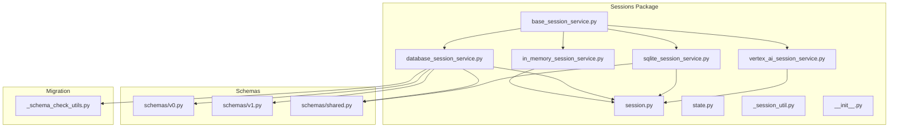
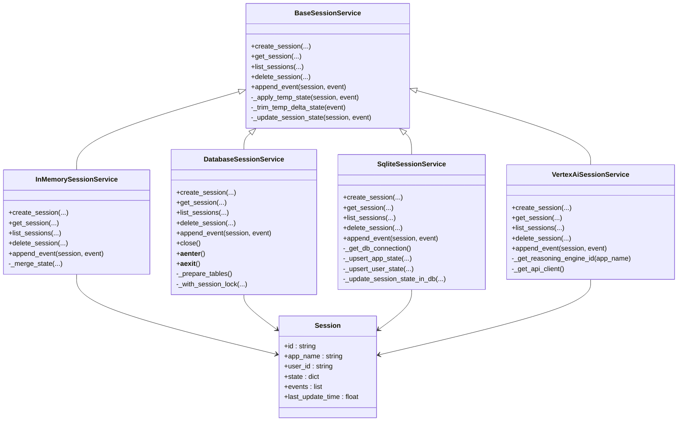
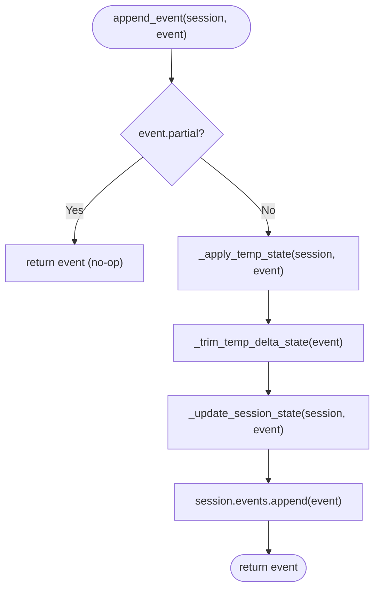
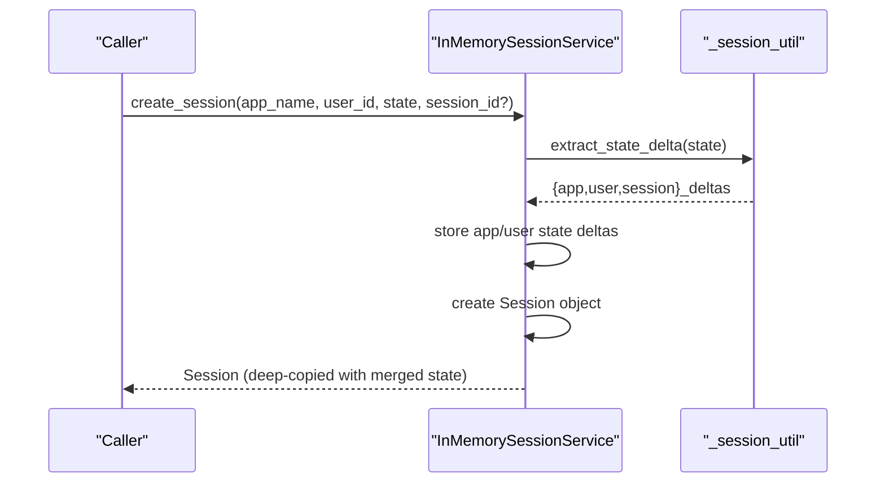
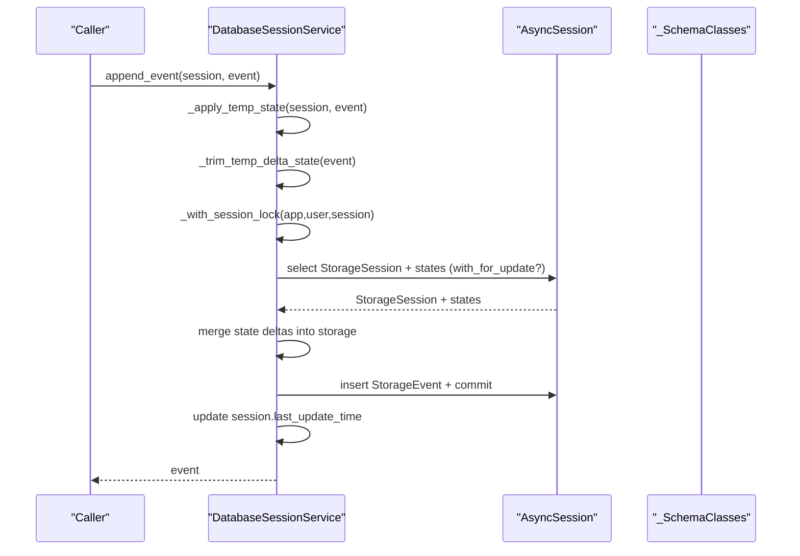
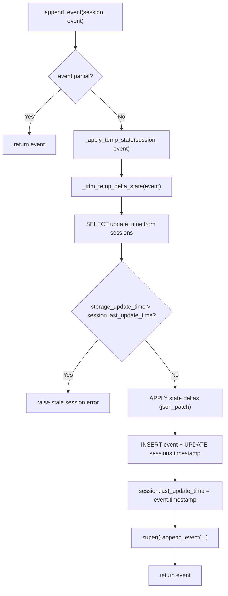
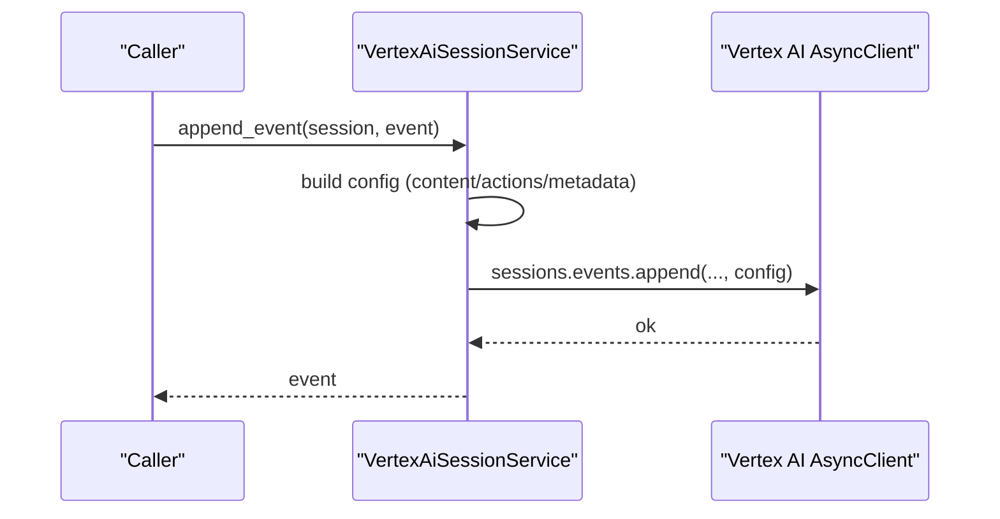
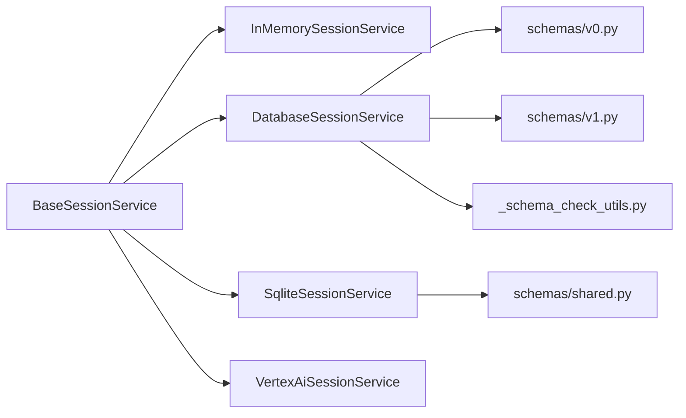

# Session APIs

<cite>
**Referenced Files in This Document**
- [__init__.py](file://src/google/adk/sessions/__init__.py)
- [base_session_service.py](file://src/google/adk/sessions/base_session_service.py)
- [in_memory_session_service.py](file://src/google/adk/sessions/in_memory_session_service.py)
- [database_session_service.py](file://src/google/adk/sessions/database_session_service.py)
- [sqlite_session_service.py](file://src/google/adk/sessions/sqlite_session_service.py)
- [vertex_ai_session_service.py](file://src/google/adk/sessions/vertex_ai_session_service.py)
- [session.py](file://src/google/adk/sessions/session.py)
- [state.py](file://src/google/adk/sessions/state.py)
- [_session_util.py](file://src/google/adk/sessions/_session_util.py)
- [v0.py](file://src/google/adk/sessions/schemas/v0.py)
- [v1.py](file://src/google/adk/sessions/schemas/v1.py)
- [shared.py](file://src/google/adk/sessions/schemas/shared.py)
- [_schema_check_utils.py](file://src/google/adk/sessions/migration/_schema_check_utils.py)
</cite>

## Table of Contents
1. [Introduction](#introduction)
2. [Project Structure](#project-structure)
3. [Core Components](#core-components)
4. [Architecture Overview](#architecture-overview)
5. [Detailed Component Analysis](#detailed-component-analysis)
6. [Dependency Analysis](#dependency-analysis)
7. [Performance Considerations](#performance-considerations)
8. [Troubleshooting Guide](#troubleshooting-guide)
9. [Conclusion](#conclusion)
10. [Appendices](#appendices)

## Introduction
This document provides comprehensive API documentation for the Session management subsystem. It covers the session lifecycle, state management, persistence interfaces, and configuration options for the following implementations:
- BaseSessionService: Abstract interface and shared utilities
- InMemorySessionService: In-memory, non-persistent session storage
- DatabaseSessionService: Relational database-backed session storage with SQLAlchemy
- SqliteSessionService: SQLite-backed session storage via aiosqlite
- VertexAiSessionService: Cloud-hosted session storage via Vertex AI Agent Engine

It also documents session state serialization, migration handling, error recovery mechanisms, and practical guidance for secure, reliable, and performant production deployments.

## Project Structure
The session subsystem is organized around a shared interface and multiple storage backends. Supporting modules handle state prefixes, utilities, and schema definitions for relational storage.

**Diagram sources**
- [base_session_service.py](file://src/google/adk/sessions/base_session_service.py#L45-L154)
- [in_memory_session_service.py](file://src/google/adk/sessions/in_memory_session_service.py#L37-L339)
- [database_session_service.py](file://src/google/adk/sessions/database_session_service.py#L135-L661)
- [sqlite_session_service.py](file://src/google/adk/sessions/sqlite_session_service.py#L132-L596)
- [vertex_ai_session_service.py](file://src/google/adk/sessions/vertex_ai_session_service.py#L46-L438)
- [session.py](file://src/google/adk/sessions/session.py#L27-L51)
- [state.py](file://src/google/adk/sessions/state.py#L20-L82)
- [_session_util.py](file://src/google/adk/sessions/_session_util.py#L37-L51)
- [v0.py](file://src/google/adk/sessions/schemas/v0.py#L98-L387)
- [v1.py](file://src/google/adk/sessions/schemas/v1.py#L70-L248)
- [shared.py](file://src/google/adk/sessions/schemas/shared.py#L29-L68)
- [_schema_check_utils.py](file://src/google/adk/sessions/migration/_schema_check_utils.py#L79-L142)

**Section sources**
- [__init__.py](file://src/google/adk/sessions/__init__.py#L14-L42)
- [base_session_service.py](file://src/google/adk/sessions/base_session_service.py#L45-L154)

## Core Components
This section summarizes the primary classes and their responsibilities.

- BaseSessionService: Defines the abstract interface for session operations and shared state/temporary delta handling.
- InMemorySessionService: Non-persistent, in-memory storage for sessions and app/user state; intended for testing and development.
- DatabaseSessionService: Persistent storage using SQLAlchemy with support for schema version detection and row-level locking.
- SqliteSessionService: SQLite-backed storage via aiosqlite with JSON serialization for events and atomic state updates.
- VertexAiSessionService: Cloud-hosted sessions via Vertex AI Agent Engine; supports create/get/list/delete/append operations.

Key shared models:
- Session: Pydantic model representing a session with id, app_name, user_id, state, events, and last_update_time.
- State: Utility class for managing state with app/user/temp prefixes and delta tracking.
- _session_util: Utilities for extracting state deltas and decoding models from JSON dictionaries.

**Section sources**
- [base_session_service.py](file://src/google/adk/sessions/base_session_service.py#L45-L154)
- [in_memory_session_service.py](file://src/google/adk/sessions/in_memory_session_service.py#L37-L339)
- [database_session_service.py](file://src/google/adk/sessions/database_session_service.py#L135-L661)
- [sqlite_session_service.py](file://src/google/adk/sessions/sqlite_session_service.py#L132-L596)
- [vertex_ai_session_service.py](file://src/google/adk/sessions/vertex_ai_session_service.py#L46-L438)
- [session.py](file://src/google/adk/sessions/session.py#L27-L51)
- [state.py](file://src/google/adk/sessions/state.py#L20-L82)
- [_session_util.py](file://src/google/adk/sessions/_session_util.py#L37-L51)

## Architecture Overview
The session architecture separates concerns between:
- Interface: BaseSessionService defines the contract for session CRUD and event appending.
- Implementations: Backends implement persistence and state merging strategies.
- State Management: Shared utilities handle prefix-based state scoping and temporary state deltas.
- Schema and Migration: Relational schemas define storage layout; migration utilities detect and manage schema versions.

**Diagram sources**
- [base_session_service.py](file://src/google/adk/sessions/base_session_service.py#L45-L154)
- [in_memory_session_service.py](file://src/google/adk/sessions/in_memory_session_service.py#L37-L339)
- [database_session_service.py](file://src/google/adk/sessions/database_session_service.py#L135-L661)
- [sqlite_session_service.py](file://src/google/adk/sessions/sqlite_session_service.py#L132-L596)
- [vertex_ai_session_service.py](file://src/google/adk/sessions/vertex_ai_session_service.py#L46-L438)
- [session.py](file://src/google/adk/sessions/session.py#L27-L51)

## Detailed Component Analysis

### BaseSessionService
- Purpose: Defines the contract for session operations and provides shared logic for applying temporary state, trimming temporary deltas, and updating session state from event actions.
- Key methods:
  - create_session: Creates a new session with optional client-provided session_id.
  - get_session: Retrieves a session optionally filtered by recent events and/or timestamp.
  - list_sessions: Lists sessions for an app and optionally a user.
  - delete_session: Deletes a session.
  - append_event: Applies temp state, trims temp deltas, updates session state, and appends the event to the in-memory session.
- Temporary state handling:
  - _apply_temp_state: Propagates temp-scoped state into the in-memory session for the current invocation.
  - _trim_temp_delta_state: Removes temp-scoped keys from event state deltas before persistence.
  - _update_session_state: Updates session state from non-temp keys in event actions.

**Diagram sources**
- [base_session_service.py](file://src/google/adk/sessions/base_session_service.py#L105-L154)

**Section sources**
- [base_session_service.py](file://src/google/adk/sessions/base_session_service.py#L45-L154)
- [state.py](file://src/google/adk/sessions/state.py#L20-L82)
- [_session_util.py](file://src/google/adk/sessions/_session_util.py#L37-L51)

### InMemorySessionService
- Purpose: In-memory session storage for testing and development.
- Notable characteristics:
  - Uses nested dicts keyed by app_name → user_id → session_id.
  - Maintains separate in-memory app_state and user_state maps.
  - Merges app/user state into session state on retrieval.
  - Provides sync wrappers with deprecation warnings; prefer async methods.
- Methods:
  - create_session/get_session/list_sessions/delete_session: CRUD operations backed by in-memory maps.
  - append_event: Validates existence, applies temp state, updates storage, and merges state deltas.

**Diagram sources**
- [in_memory_session_service.py](file://src/google/adk/sessions/in_memory_session_service.py#L54-L129)
- [_session_util.py](file://src/google/adk/sessions/_session_util.py#L37-L51)

**Section sources**
- [in_memory_session_service.py](file://src/google/adk/sessions/in_memory_session_service.py#L37-L339)

### DatabaseSessionService
- Purpose: Persistent relational storage using SQLAlchemy with schema version detection and row-level locking support.
- Initialization and schema:
  - Accepts a database URL; configures engine and async session factory.
  - Lazy table creation with schema version inspection; supports SQLite in-memory with StaticPool and other dialects with pool_pre_ping.
  - Detects schema version and ensures tables for the appropriate schema (v0 or v1).
- Concurrency and reliability:
  - Per-session locks serialized append_event within the process.
  - Row-level locking for supported dialects (mariadb, mysql, postgresql).
  - Transactions wrapped with rollback-on-exception to prevent connection leaks.
- Methods:
  - create_session: Upserts app/user state, stores session, merges state for response.
  - get_session: Loads session, events (filtered by config), merges state.
  - list_sessions: Lists sessions and merges app/user state.
  - delete_session: Deletes session.
  - append_event: Applies temp state, validates freshness, merges state deltas, persists event, updates timestamps.

**Diagram sources**
- [database_session_service.py](file://src/google/adk/sessions/database_session_service.py#L521-L648)
- [database_session_service.py](file://src/google/adk/sessions/database_session_service.py#L196-L254)
- [v1.py](file://src/google/adk/sessions/schemas/v1.py#L70-L248)
- [v0.py](file://src/google/adk/sessions/schemas/v0.py#L98-L387)

**Section sources**
- [database_session_service.py](file://src/google/adk/sessions/database_session_service.py#L135-L661)
- [_schema_check_utils.py](file://src/google/adk/sessions/migration/_schema_check_utils.py#L79-L142)
- [v1.py](file://src/google/adk/sessions/schemas/v1.py#L70-L248)
- [v0.py](file://src/google/adk/sessions/schemas/v0.py#L98-L387)
- [shared.py](file://src/google/adk/sessions/schemas/shared.py#L29-L68)

### SqliteSessionService
- Purpose: SQLite-backed session storage via aiosqlite with JSON serialization for events and atomic state updates.
- Initialization and migration:
  - Parses database path/URI; raises runtime error if legacy schema is detected.
  - Ensures schema creation on first use.
- Methods:
  - create_session: Validates uniqueness, applies app/user state deltas, stores session, merges state.
  - get_session: Loads session and events (filtered by config), merges state.
  - list_sessions: Lists sessions and merges app/user state.
  - delete_session: Deletes session.
  - append_event: Validates freshness, applies state deltas atomically, inserts event, updates timestamps.

**Diagram sources**
- [sqlite_session_service.py](file://src/google/adk/sessions/sqlite_session_service.py#L360-L456)

**Section sources**
- [sqlite_session_service.py](file://src/google/adk/sessions/sqlite_session_service.py#L132-L596)

### VertexAiSessionService
- Purpose: Cloud-hosted session storage via Vertex AI Agent Engine.
- Initialization:
  - Accepts project/location/agent_engine_id; resolves express mode API key if configured.
- Methods:
  - create_session: Requires server-generated session_id; supports additional config kwargs.
  - get_session: Retrieves session and events in parallel; filters by timestamp if provided; merges state.
  - list_sessions: Lists sessions for an app and optional user filter.
  - delete_session: Deletes session; logs and rethrows exceptions.
  - append_event: Serializes event content/actions/metadata; stores compaction data in custom_metadata until native support; sends event to Vertex AI.

**Diagram sources**
- [vertex_ai_session_service.py](file://src/google/adk/sessions/vertex_ai_session_service.py#L248-L321)

**Section sources**
- [vertex_ai_session_service.py](file://src/google/adk/sessions/vertex_ai_session_service.py#L46-L438)

## Dependency Analysis
- Coupling:
  - All implementations inherit from BaseSessionService, ensuring consistent behavior for temp state handling and event appending.
  - DatabaseSessionService depends on SQLAlchemy models (v0/v1) and migration utilities for schema detection.
  - SqliteSessionService depends on aiosqlite and JSON serialization for events.
  - VertexAiSessionService depends on Vertex AI SDK and expresses mode API key resolution.
- Cohesion:
  - State management utilities are cohesive and reused across implementations.
  - Schema and shared types encapsulate database-specific details.

**Diagram sources**
- [base_session_service.py](file://src/google/adk/sessions/base_session_service.py#L45-L154)
- [in_memory_session_service.py](file://src/google/adk/sessions/in_memory_session_service.py#L37-L339)
- [database_session_service.py](file://src/google/adk/sessions/database_session_service.py#L135-L661)
- [sqlite_session_service.py](file://src/google/adk/sessions/sqlite_session_service.py#L132-L596)
- [vertex_ai_session_service.py](file://src/google/adk/sessions/vertex_ai_session_service.py#L46-L438)
- [v0.py](file://src/google/adk/sessions/schemas/v0.py#L98-L387)
- [v1.py](file://src/google/adk/sessions/schemas/v1.py#L70-L248)
- [_schema_check_utils.py](file://src/google/adk/sessions/migration/_schema_check_utils.py#L79-L142)
- [shared.py](file://src/google/adk/sessions/schemas/shared.py#L29-L68)

**Section sources**
- [base_session_service.py](file://src/google/adk/sessions/base_session_service.py#L45-L154)
- [database_session_service.py](file://src/google/adk/sessions/database_session_service.py#L135-L661)
- [sqlite_session_service.py](file://src/google/adk/sessions/sqlite_session_service.py#L132-L596)
- [vertex_ai_session_service.py](file://src/google/adk/sessions/vertex_ai_session_service.py#L46-L438)

## Performance Considerations
- InMemorySessionService:
  - Suitable only for single-threaded, non-production scenarios due to lack of persistence and concurrency controls.
- DatabaseSessionService:
  - Uses async SQLAlchemy engines; enables pool_pre_ping for non-SQLite dialects to reduce stale connections.
  - Per-session locks minimize contention for event appends within the same process.
  - Row-level locking reduces write conflicts on supported dialects.
- SqliteSessionService:
  - Uses json_patch for atomic state updates; efficient for small-to-medium workloads.
  - Foreign keys enabled with PRAGMA; cascading deletes maintain referential integrity.
- VertexAiSessionService:
  - Network-bound; batch operations (parallel get/list) improve latency.
  - Avoid excessive partial events; finalize events to reduce round trips.

[No sources needed since this section provides general guidance]

## Troubleshooting Guide
- Database initialization failures:
  - Invalid database URL or missing driver: caught and raised as ValueError with actionable messages.
  - Schema version mismatch: use migration utilities to detect and migrate schemas.
- Stale session errors:
  - DatabaseSessionService and SqliteSessionService compare last_update_time; refresh session before appending to avoid stale writes.
- Missing state rows:
  - DatabaseSessionService raises explicit errors when app/user state is absent during append_event; ensure create_session initializes state tables.
- Legacy schema detection:
  - SqliteSessionService detects legacy schema and instructs to run migration commands.
- Vertex AI errors:
  - 404 responses in get_session are handled gracefully; user ownership mismatches raise explicit errors.

**Section sources**
- [database_session_service.py](file://src/google/adk/sessions/database_session_service.py#L162-L173)
- [database_session_service.py](file://src/google/adk/sessions/database_session_service.py#L567-L592)
- [sqlite_session_service.py](file://src/google/adk/sessions/sqlite_session_service.py#L557-L585)
- [vertex_ai_session_service.py](file://src/google/adk/sessions/vertex_ai_session_service.py#L168-L179)

## Conclusion
The Session management subsystem offers a flexible, extensible architecture for session lifecycle management across multiple storage backends. BaseSessionService centralizes state/temporary delta handling, while implementations tailor persistence, concurrency, and cloud integration. Production deployments should prefer DatabaseSessionService or SqliteSessionService for durability and reliability, and VertexAiSessionService for managed cloud sessions. Adhering to state serialization patterns, migration procedures, and error handling ensures robust, secure, and performant session management.

[No sources needed since this section summarizes without analyzing specific files]

## Appendices

### Session Lifecycle API Reference
- BaseSessionService
  - create_session(app_name, user_id, state=None, session_id=None) -> Session
  - get_session(app_name, user_id, session_id, config=None) -> Optional[Session]
  - list_sessions(app_name, user_id=None) -> ListSessionsResponse
  - delete_session(app_name, user_id, session_id) -> None
  - append_event(session, event) -> Event
- InMemorySessionService
  - create_session/get_session/list_sessions/delete_session: async variants; sync variants emit deprecation warnings.
  - append_event: Validates existence and merges state deltas.
- DatabaseSessionService
  - create_session/get_session/list_sessions/delete_session: async variants.
  - append_event: Supports per-session locks and row-level locking; manages schema version.
  - close/__aenter__/__aexit__: Async lifecycle management.
- SqliteSessionService
  - create_session/get_session/list_sessions/delete_session: async variants.
  - append_event: Atomic state updates via json_patch; enforces freshness.
- VertexAiSessionService
  - create_session/get_session/list_sessions/delete_session: async variants.
  - append_event: Serializes event content/actions/metadata; stores compaction in custom_metadata.

**Section sources**
- [base_session_service.py](file://src/google/adk/sessions/base_session_service.py#L51-L103)
- [in_memory_session_service.py](file://src/google/adk/sessions/in_memory_session_service.py#L54-L129)
- [database_session_service.py](file://src/google/adk/sessions/database_session_service.py#L313-L390)
- [sqlite_session_service.py](file://src/google/adk/sessions/sqlite_session_service.py#L157-L228)
- [vertex_ai_session_service.py](file://src/google/adk/sessions/vertex_ai_session_service.py#L81-L132)

### State Serialization and Prefixes
- State prefixes:
  - app:, user:, temp: distinguish app-level, user-level, and temporary state scoped to the current invocation.
- Delta extraction:
  - extract_state_delta splits incoming state into app/user/session deltas based on prefixes.
- Temporary state:
  - Temp keys are applied to in-memory session before trimming; trimming prevents persistence of temp values.

**Section sources**
- [state.py](file://src/google/adk/sessions/state.py#L20-L82)
- [_session_util.py](file://src/google/adk/sessions/_session_util.py#L37-L51)

### Migration and Schema Handling
- Schema detection:
  - _schema_check_utils determines schema version from metadata table or legacy table/column inspection.
- Supported versions:
  - v0 (legacy pickle serialization) and v1 (JSON serialization).
- Migration:
  - DatabaseSessionService prepares tables based on detected version; SqliteSessionService detects legacy schema and instructs migration.

**Section sources**
- [_schema_check_utils.py](file://src/google/adk/sessions/migration/_schema_check_utils.py#L79-L142)
- [v0.py](file://src/google/adk/sessions/schemas/v0.py#L14-L25)
- [v1.py](file://src/google/adk/sessions/schemas/v1.py#L15-L22)