# Tool APIs

<cite>
**Referenced Files in This Document**
- [base_tool.py](file://src/google/adk/tools/base_tool.py)
- [function_tool.py](file://src/google/adk/tools/function_tool.py)
- [authenticated_function_tool.py](file://src/google/adk/tools/authenticated_function_tool.py)
- [base_authenticated_tool.py](file://src/google/adk/tools/base_authenticated_tool.py)
- [google_search_tool.py](file://src/google/adk/tools/google_search_tool.py)
- [bigquery/query_tool.py](file://src/google/adk/tools/bigquery/query_tool.py)
- [pubsub/message_tool.py](file://src/google/adk/tools/pubsub/message_tool.py)
- [mcp_tool/mcp_tool.py](file://src/google/adk/tools/mcp_tool/mcp_tool.py)
- [openapi_tool/openapi_spec_parser/rest_api_tool.py](file://src/google/adk/tools/openapi_tool/openapi_spec_parser/rest_api_tool.py)
- [tools/__init__.py](file://src/google/adk/tools/__init__.py)
</cite>

## Table of Contents
1. [Introduction](#introduction)
2. [Project Structure](#project-structure)
3. [Core Components](#core-components)
4. [Architecture Overview](#architecture-overview)
5. [Detailed Component Analysis](#detailed-component-analysis)
6. [Dependency Analysis](#dependency-analysis)
7. [Performance Considerations](#performance-considerations)
8. [Troubleshooting Guide](#troubleshooting-guide)
9. [Conclusion](#conclusion)
10. [Appendices](#appendices)

## Introduction
This document provides comprehensive API documentation for Tool-related classes and interfaces in the repository. It focuses on:
- BaseTool and derived tool families
- FunctionTool and AuthenticatedFunctionTool
- Specialized tools: GoogleSearchTool, BigQuery tools, Pub/Sub tools, MCP tools, and OpenAPI tools
- Method signatures, parameters, return types, and authentication requirements
- Tool configuration, execution patterns, error handling, and agent integration
- Usage examples for tool development, registration, and execution
- Authentication flows, credential management, and security considerations
- Performance optimization and best practices

## Project Structure
The tools package organizes core abstractions and specialized implementations:
- Base abstractions: BaseTool, BaseAuthenticatedTool
- Wrappers: FunctionTool, AuthenticatedFunctionTool
- Built-ins: GoogleSearchTool
- Integrations: BigQuery, Pub/Sub, MCP, OpenAPI
- Lazy loader: tools/__init__.py exposes public tool classes and toolsets

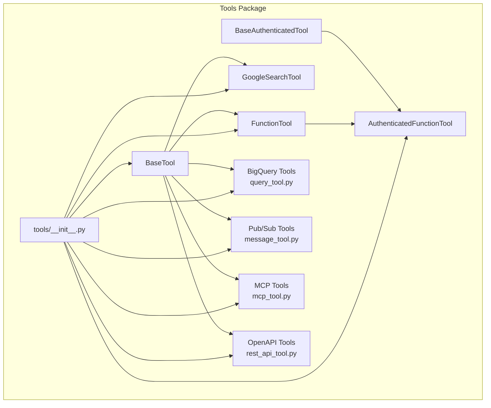

**Diagram sources**
- [base_tool.py](file://src/google/adk/tools/base_tool.py#L47-L213)
- [base_authenticated_tool.py](file://src/google/adk/tools/base_authenticated_tool.py#L36-L109)
- [function_tool.py](file://src/google/adk/tools/function_tool.py#L39-L292)
- [authenticated_function_tool.py](file://src/google/adk/tools/authenticated_function_tool.py#L37-L108)
- [google_search_tool.py](file://src/google/adk/tools/google_search_tool.py#L32-L93)
- [bigquery/query_tool.py](file://src/google/adk/tools/bigquery/query_tool.py#L1-L1372)
- [pubsub/message_tool.py](file://src/google/adk/tools/pubsub/message_tool.py#L27-L188)
- [mcp_tool/mcp_tool.py](file://src/google/adk/tools/mcp_tool/mcp_tool.py#L116-L471)
- [openapi_tool/openapi_spec_parser/rest_api_tool.py](file://src/google/adk/tools/openapi_tool/openapi_spec_parser/rest_api_tool.py#L79-L577)
- [tools/__init__.py](file://src/google/adk/tools/__init__.py#L49-L112)

**Section sources**
- [tools/__init__.py](file://src/google/adk/tools/__init__.py#L49-L112)

## Core Components
This section documents the foundational tool abstractions and their responsibilities.

- BaseTool
  - Purpose: Defines the contract for all tools, including metadata, declaration generation, LLM request processing, and asynchronous execution.
  - Key members:
    - name: str
    - description: str
    - is_long_running: bool
    - custom_metadata: Optional[dict[str, Any]]
  - Methods:
    - _get_declaration() -> Optional[FunctionDeclaration]
    - run_async(*, args: dict[str, Any], tool_context: ToolContext) -> Any
    - process_llm_request(*, tool_context: ToolContext, llm_request: LlmRequest) -> None
    - from_config(cls, config: ToolArgsConfig, config_abs_path: str) -> Self

- BaseAuthenticatedTool
  - Purpose: Adds authentication lifecycle to BaseTool. Handles credential acquisition and optional user authorization prompts.
  - Constructor parameters:
    - name: str
    - description: str
    - auth_config: AuthConfig
    - response_for_auth_required: Optional[Union[dict[str, Any], str]]
  - Methods:
    - run_async(*, args: dict[str, Any], tool_context: ToolContext) -> Any
    - _run_async_impl(*, args: dict[str, Any], tool_context: ToolContext, credential: AuthCredential) -> Any

- FunctionTool
  - Purpose: Wraps a user-defined Python callable into a tool. Automatically generates function declarations and supports Pydantic model conversion and confirmation gating.
  - Constructor parameters:
    - func: Callable[..., Any]
    - require_confirmation: Union[bool, Callable[..., bool]]
  - Methods:
    - _get_declaration() -> FunctionDeclaration
    - run_async(*, args: dict[str, Any], tool_context: ToolContext) -> Any
    - _preprocess_args(args: dict[str, Any]) -> dict[str, Any]
    - _call_live(...): streaming live invocation support
    - _get_mandatory_args() -> list[str]

- AuthenticatedFunctionTool
  - Purpose: Extends FunctionTool with authentication. Injects a credential argument into the wrapped function if accepted.
  - Constructor parameters:
    - func: Callable[..., Any]
    - auth_config: AuthConfig
    - response_for_auth_required: Optional[Union[dict[str, Any], str]]

- GoogleSearchTool
  - Purpose: Built-in tool for Gemini 2 models to perform Google Search. Operates internally within the model and modifies LLM requests accordingly.
  - Constructor parameters:
    - bypass_multi_tools_limit: bool
    - model: Optional[str]
  - Methods:
    - process_llm_request(*, tool_context: ToolContext, llm_request: LlmRequest) -> None

**Section sources**
- [base_tool.py](file://src/google/adk/tools/base_tool.py#L47-L213)
- [base_authenticated_tool.py](file://src/google/adk/tools/base_authenticated_tool.py#L36-L109)
- [function_tool.py](file://src/google/adk/tools/function_tool.py#L39-L292)
- [authenticated_function_tool.py](file://src/google/adk/tools/authenticated_function_tool.py#L37-L108)
- [google_search_tool.py](file://src/google/adk/tools/google_search_tool.py#L32-L93)

## Architecture Overview
The tool system integrates with agents and LLM requests through a consistent pattern:
- Tools declare themselves via FunctionDeclaration for LLM invocation
- Tools can augment LLM requests (e.g., GoogleSearchTool adds tool configs)
- Authenticated tools obtain credentials and optionally request user confirmation
- Specialized tools encapsulate external service interactions

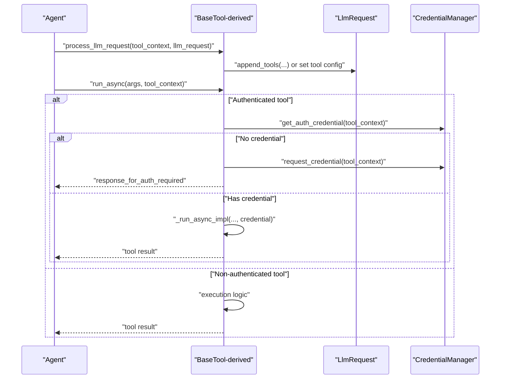

**Diagram sources**
- [base_tool.py](file://src/google/adk/tools/base_tool.py#L115-L130)
- [google_search_tool.py](file://src/google/adk/tools/google_search_tool.py#L61-L90)
- [base_authenticated_tool.py](file://src/google/adk/tools/base_authenticated_tool.py#L82-L98)
- [authenticated_function_tool.py](file://src/google/adk/tools/authenticated_function_tool.py#L80-L94)

## Detailed Component Analysis

### BaseTool and BaseAuthenticatedTool
- Responsibilities:
  - BaseTool: defines tool identity, metadata, function declaration, LLM integration hook, and async execution contract
  - BaseAuthenticatedTool: adds credential lifecycle and optional user authorization flow
- Key behaviors:
  - FunctionDeclaration generation via _get_declaration
  - LLM augmentation via process_llm_request
  - Config-driven construction via from_config
  - Auth gating via run_async and _run_async_impl

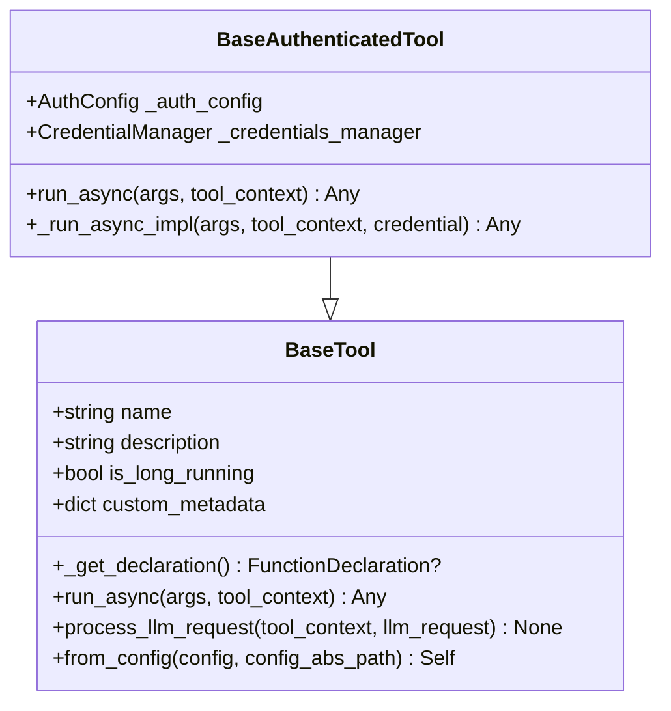

**Diagram sources**
- [base_tool.py](file://src/google/adk/tools/base_tool.py#L47-L213)
- [base_authenticated_tool.py](file://src/google/adk/tools/base_authenticated_tool.py#L36-L109)

**Section sources**
- [base_tool.py](file://src/google/adk/tools/base_tool.py#L47-L213)
- [base_authenticated_tool.py](file://src/google/adk/tools/base_authenticated_tool.py#L36-L109)

### FunctionTool
- Purpose: Turn arbitrary Python callables into tools with automatic schema generation and runtime argument preprocessing.
- Notable features:
  - Automatic FunctionDeclaration generation from function signatures
  - Pydantic model conversion for annotated parameters
  - Mandatory argument validation and user-friendly error messages
  - Confirmation gating via require_confirmation (boolean or callable)
  - Streaming live invocation support (_call_live)

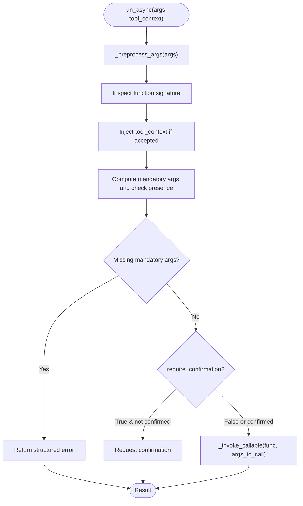

**Diagram sources**
- [function_tool.py](file://src/google/adk/tools/function_tool.py#L159-L222)

**Section sources**
- [function_tool.py](file://src/google/adk/tools/function_tool.py#L39-L292)

### AuthenticatedFunctionTool
- Purpose: Authenticate before invoking a FunctionTool’s function. Supports injecting a credential argument if the function accepts it.
- Behavior:
  - Uses CredentialManager to obtain or request credentials
  - Returns configured response when credentials are pending
  - Injects credential into function arguments if accepted

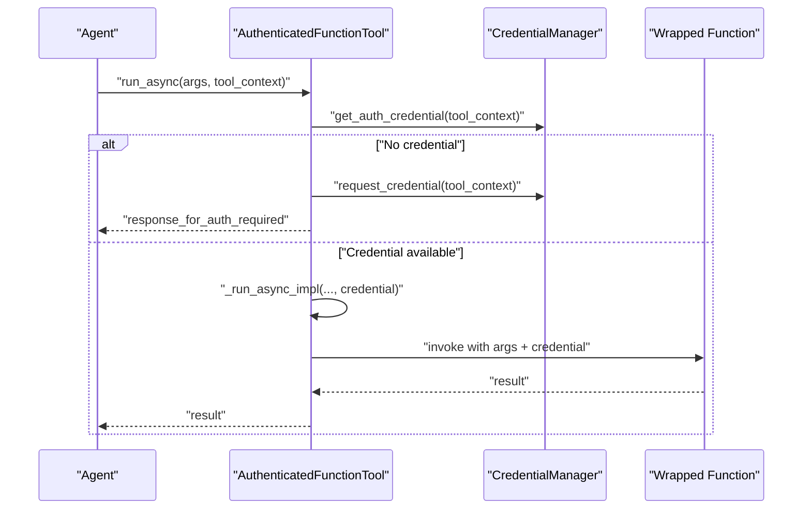

**Diagram sources**
- [authenticated_function_tool.py](file://src/google/adk/tools/authenticated_function_tool.py#L80-L108)
- [base_authenticated_tool.py](file://src/google/adk/tools/base_authenticated_tool.py#L82-L98)

**Section sources**
- [authenticated_function_tool.py](file://src/google/adk/tools/authenticated_function_tool.py#L37-L108)

### GoogleSearchTool
- Purpose: Built-in tool for Gemini 2 models to perform Google Search. Modifies LLM request to include appropriate tool configuration depending on model family.
- Constraints:
  - Gemini 1.x: Google Search tool cannot be combined with other tools
  - Other models: Adds GoogleSearch tool configuration
  - Model override via constructor parameter

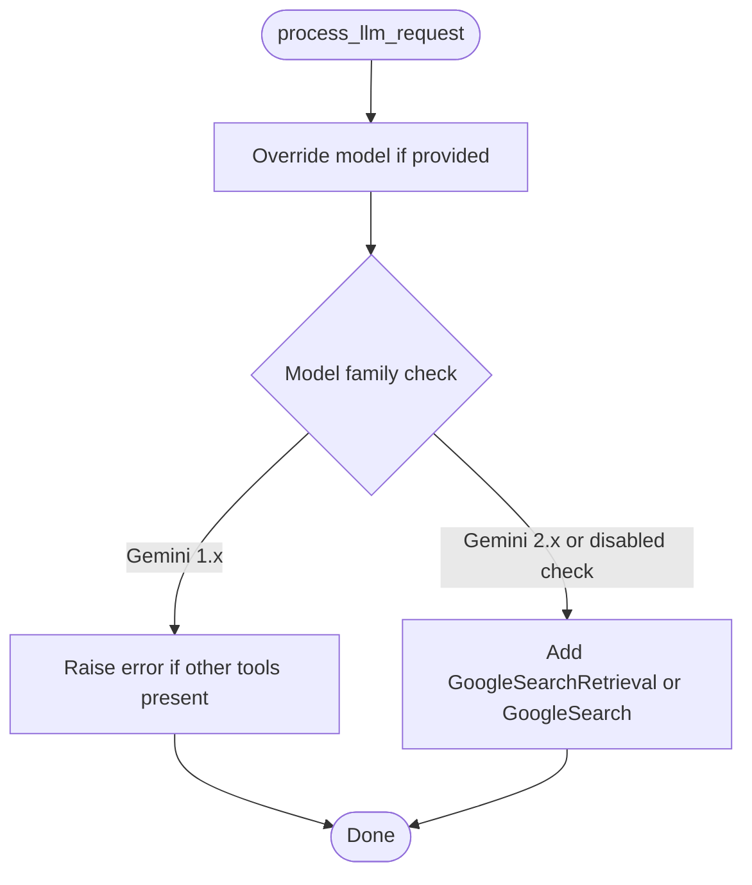

**Diagram sources**
- [google_search_tool.py](file://src/google/adk/tools/google_search_tool.py#L61-L90)

**Section sources**
- [google_search_tool.py](file://src/google/adk/tools/google_search_tool.py#L32-L93)

### BigQuery Tools
- Core execution function:
  - execute_sql(project_id, query, credentials, settings, tool_context, dry_run=False) -> dict
    - Validates compute project restriction
    - Creates BigQuery client with user agent and location
    - Applies job labels and optional caller ID
    - Supports write-mode policies:
      - BLOCKED: dry-run only for SELECT
      - PROTECTED: session-scoped temp resources and write restrictions
    - Returns SUCCESS with rows or dry-run info; ERROR with error_details
- Additional analytics helpers:
  - forecast(project_id, history_data, timestamp_col, data_col, horizon, id_cols, credentials, settings, tool_context) -> dict
  - analyze_contribution(project_id, input_data, contribution_metric, dimension_id_cols, is_test_col, credentials, settings, tool_context, top_k_insights, pruning_method) -> dict
  - detect_anomalies(project_id, history_data, times_series_timestamp_col, times_series_data_col, horizon, target_data, times_series_id_cols, anomaly_prob_threshold, credentials, settings, tool_context) -> dict

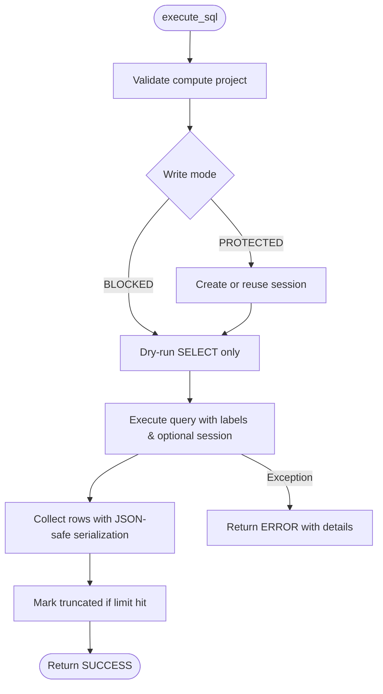

**Diagram sources**
- [bigquery/query_tool.py](file://src/google/adk/tools/bigquery/query_tool.py#L35-L196)

**Section sources**
- [bigquery/query_tool.py](file://src/google/adk/tools/bigquery/query_tool.py#L198-L292)
- [bigquery/query_tool.py](file://src/google/adk/tools/bigquery/query_tool.py#L767-L938)
- [bigquery/query_tool.py](file://src/google/adk/tools/bigquery/query_tool.py#L941-L1138)
- [bigquery/query_tool.py](file://src/google/adk/tools/bigquery/query_tool.py#L1141-L1372)

### Pub/Sub Tools
- publish_message(topic_name, message, credentials, settings, attributes=None, ordering_key="") -> dict
  - Publishes a UTF-8 encoded message; falls back to base64 if needed
  - Returns message_id or error_details
- pull_messages(subscription_name, credentials, settings, max_messages=1, auto_ack=False) -> dict
  - Pulls messages, decodes data, attaches ack_ids; optionally acknowledges
- acknowledge_messages(subscription_name, ack_ids, credentials, settings) -> dict
  - Acknowledges messages; returns status

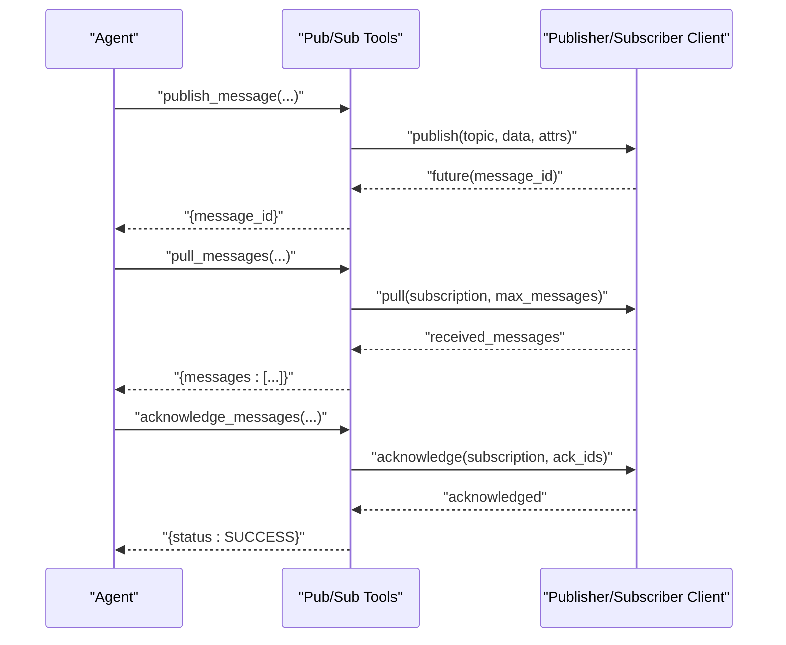

**Diagram sources**
- [pubsub/message_tool.py](file://src/google/adk/tools/pubsub/message_tool.py#L27-L188)

**Section sources**
- [pubsub/message_tool.py](file://src/google/adk/tools/pubsub/message_tool.py#L27-L188)

### MCP Tools
- McpTool
  - Wraps an MCP Tool and uses an MCPSessionManager to call the tool
  - Supports authentication headers extraction from credentials (OAuth2, Basic, API Key header-only)
  - Supports dynamic header provider and progress callbacks (factory or direct)
  - Generates FunctionDeclaration from MCP tool schemas
  - Enforces API key location constraint (header only)
- Execution flow:
  - Obtain headers from credential and optional header provider
  - Create MCP session and call tool with progress callback and trace context
  - Return normalized response

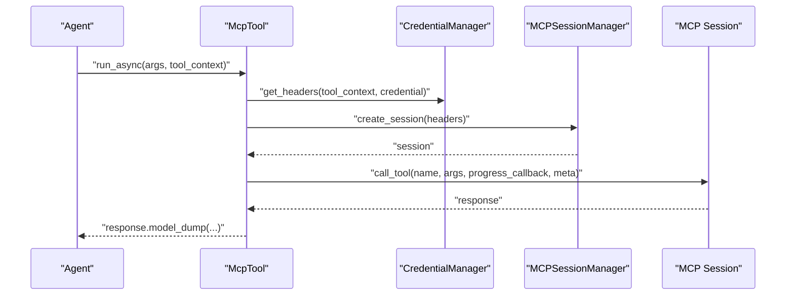

**Diagram sources**
- [mcp_tool/mcp_tool.py](file://src/google/adk/tools/mcp_tool/mcp_tool.py#L289-L339)
- [mcp_tool/mcp_tool.py](file://src/google/adk/tools/mcp_tool/mcp_tool.py#L374-L458)

**Section sources**
- [mcp_tool/mcp_tool.py](file://src/google/adk/tools/mcp_tool/mcp_tool.py#L116-L471)

### OpenAPI Tools (RestApiTool)
- Purpose: Generic REST API tool generated from OpenAPI specs. Converts parsed operations into callable tools with automatic schema generation.
- Key capabilities:
  - FunctionDeclaration from OpenAPI JSON schema
  - Parameter mapping across path, query, header, cookie, and body
  - Authentication parameter injection via ToolAuthHandler
  - SSL verification customization
  - Dynamic header provider
  - Fallback to non-JSON responses as text
- Execution flow:
  - Prepare auth credentials via ToolAuthHandler
  - If pending, return pending authorization message
  - Merge default headers and dynamic headers
  - Build request parameters and send via httpx.AsyncClient
  - Parse JSON or return text; handle HTTP errors

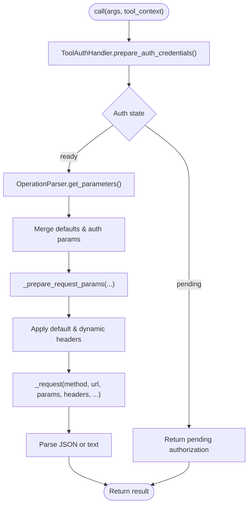

**Diagram sources**
- [openapi_tool/openapi_spec_parser/rest_api_tool.py](file://src/google/adk/tools/openapi_tool/openapi_spec_parser/rest_api_tool.py#L457-L556)

**Section sources**
- [openapi_tool/openapi_spec_parser/rest_api_tool.py](file://src/google/adk/tools/openapi_tool/openapi_spec_parser/rest_api_tool.py#L79-L577)

## Dependency Analysis
- Internal dependencies:
  - BaseTool is the foundation for all tools
  - BaseAuthenticatedTool extends BaseTool for auth-enabled tools
  - FunctionTool and AuthenticatedFunctionTool rely on BaseTool and CredentialManager
  - GoogleSearchTool augments LlmRequest with tool configuration
  - BigQuery/Pub/Sub/MCP/OpenAPI tools depend on respective SDKs and internal clients
- External dependencies:
  - google.genai.types.FunctionDeclaration for schema generation
  - httpx for REST API calls
  - google-cloud-* SDKs for BigQuery and Pub/Sub
  - mcp libraries for MCP tooling

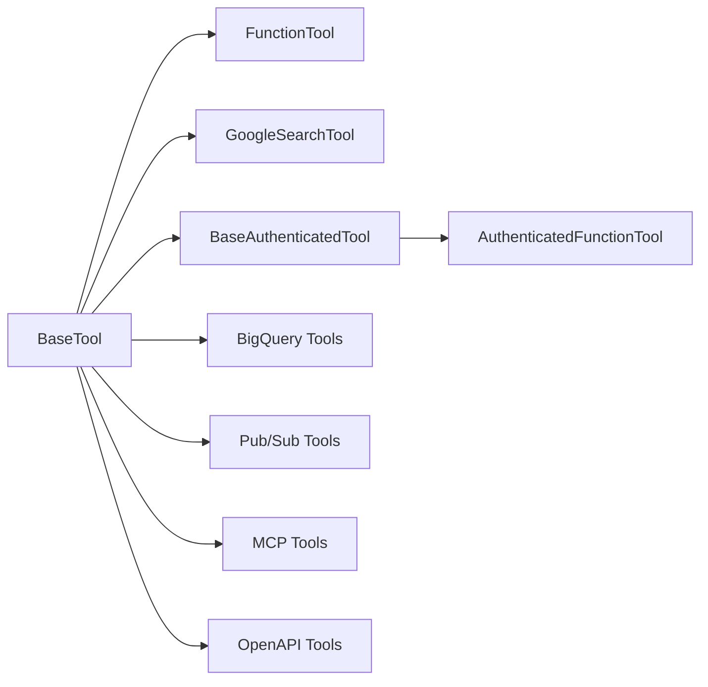

**Diagram sources**
- [base_tool.py](file://src/google/adk/tools/base_tool.py#L47-L213)
- [function_tool.py](file://src/google/adk/tools/function_tool.py#L39-L292)
- [authenticated_function_tool.py](file://src/google/adk/tools/authenticated_function_tool.py#L37-L108)
- [google_search_tool.py](file://src/google/adk/tools/google_search_tool.py#L32-L93)
- [bigquery/query_tool.py](file://src/google/adk/tools/bigquery/query_tool.py#L1-L1372)
- [pubsub/message_tool.py](file://src/google/adk/tools/pubsub/message_tool.py#L27-L188)
- [mcp_tool/mcp_tool.py](file://src/google/adk/tools/mcp_tool/mcp_tool.py#L116-L471)
- [openapi_tool/openapi_spec_parser/rest_api_tool.py](file://src/google/adk/tools/openapi_tool/openapi_spec_parser/rest_api_tool.py#L79-L577)

**Section sources**
- [base_tool.py](file://src/google/adk/tools/base_tool.py#L47-L213)
- [function_tool.py](file://src/google/adk/tools/function_tool.py#L39-L292)
- [authenticated_function_tool.py](file://src/google/adk/tools/authenticated_function_tool.py#L37-L108)
- [google_search_tool.py](file://src/google/adk/tools/google_search_tool.py#L32-L93)
- [bigquery/query_tool.py](file://src/google/adk/tools/bigquery/query_tool.py#L1-L1372)
- [pubsub/message_tool.py](file://src/google/adk/tools/pubsub/message_tool.py#L27-L188)
- [mcp_tool/mcp_tool.py](file://src/google/adk/tools/mcp_tool/mcp_tool.py#L116-L471)
- [openapi_tool/openapi_spec_parser/rest_api_tool.py](file://src/google/adk/tools/openapi_tool/openapi_spec_parser/rest_api_tool.py#L79-L577)

## Performance Considerations
- Minimize unnecessary schema conversions:
  - FunctionTool pre-processes arguments; avoid heavy conversions in user functions
- Optimize BigQuery queries:
  - Use dry_run to validate and estimate cost before execution
  - Respect write-mode restrictions to prevent unintended writes
  - Limit result rows via settings to reduce payload size
- Reduce network overhead:
  - Reuse sessions where possible (e.g., MCP session pooling)
  - Avoid redundant header computations; leverage header providers judiciously
- Control tool confirmations:
  - Use require_confirmation selectively to avoid blocking agent loops

## Troubleshooting Guide
- FunctionTool missing mandatory arguments:
  - Symptom: Structured error indicating missing inputs
  - Resolution: Provide all mandatory parameters or adjust function signature
- AuthenticatedFunctionTool pending authorization:
  - Symptom: Returns configured response when credentials are missing
  - Resolution: Ensure AuthConfig is provided and credentials are available or request authorization
- GoogleSearchTool model constraints:
  - Symptom: Error when combining with other tools on Gemini 1.x
  - Resolution: Use model override or separate tool usage
- BigQuery write-mode violations:
  - Symptom: Errors for non-SELECT statements in BLOCKED mode or unauthorized temp writes in PROTECTED mode
  - Resolution: Switch to PROTECTED mode or use permitted operations within session
- Pub/Sub decoding issues:
  - Symptom: Non-UTF-8 message data
  - Resolution: Tool decodes gracefully; inspect returned data and attributes
- MCP API key location:
  - Symptom: ValueError for non-header API key locations
  - Resolution: Configure API key to be injected via headers only
- OpenAPI HTTP errors:
  - Symptom: HTTPStatusError logged with response content
  - Resolution: Inspect returned error message and adjust inputs; retry up to configured limits

**Section sources**
- [function_tool.py](file://src/google/adk/tools/function_tool.py#L184-L189)
- [authenticated_function_tool.py](file://src/google/adk/tools/authenticated_function_tool.py#L89-L90)
- [google_search_tool.py](file://src/google/adk/tools/google_search_tool.py#L74-L78)
- [bigquery/query_tool.py](file://src/google/adk/tools/bigquery/query_tool.py#L80-L93)
- [pubsub/message_tool.py](file://src/google/adk/tools/pubsub/message_tool.py#L77-L84)
- [mcp_tool/mcp_tool.py](file://src/google/adk/tools/mcp_tool/mcp_tool.py#L423-L450)
- [openapi_tool/openapi_spec_parser/rest_api_tool.py](file://src/google/adk/tools/openapi_tool/openapi_spec_parser/rest_api_tool.py#L537-L552)

## Conclusion
The tool system provides a robust, extensible framework for integrating diverse capabilities into agents:
- BaseTool and BaseAuthenticatedTool define consistent contracts and authentication lifecycles
- FunctionTool and AuthenticatedFunctionTool enable rapid integration of Python functions
- Specialized tools encapsulate external service concerns with clear configuration and error handling
- The architecture supports secure, configurable, and efficient tool execution across varied backends

## Appendices

### Usage Examples and Best Practices
- Tool development
  - Define a Python function and wrap with FunctionTool for quick integration
  - For authenticated operations, use AuthenticatedFunctionTool with AuthConfig
  - For built-in model features, configure GoogleSearchTool appropriately for the model family
- Registration and execution
  - Register tools with agents; tools declare themselves via FunctionDeclaration
  - Use from_config to initialize tools from structured configs
- Integration patterns
  - BigQuery: Use execute_sql with write-mode settings; leverage analytics helpers for forecasting and anomaly detection
  - Pub/Sub: Use publish_message, pull_messages, and acknowledge_messages for event-driven workflows
  - MCP: Wrap MCP tools with McpTool and manage authentication headers and progress callbacks
  - OpenAPI: Generate RestApiTool from parsed operations; customize SSL verification and headers as needed
- Security and credentials
  - Prefer header-based API keys for MCP tools
  - Use credential managers to obtain and refresh tokens
  - Avoid embedding secrets in tool configurations; rely on managed credentials
- Performance tips
  - Use dry-run modes where supported to validate and estimate cost
  - Limit result sizes and apply truncation checks
  - Reuse sessions and minimize repeated header computations