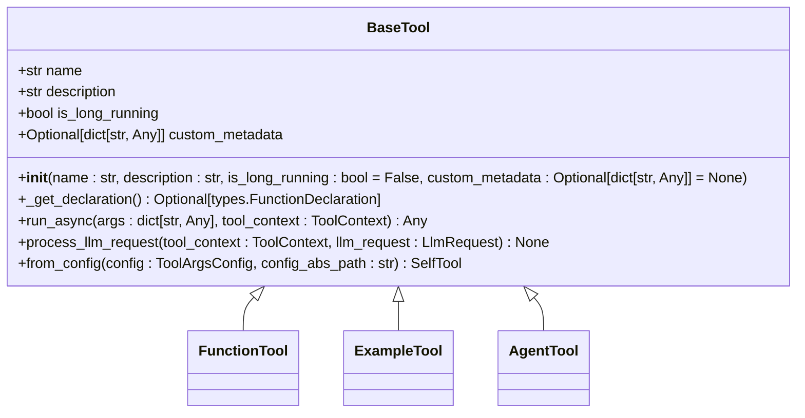
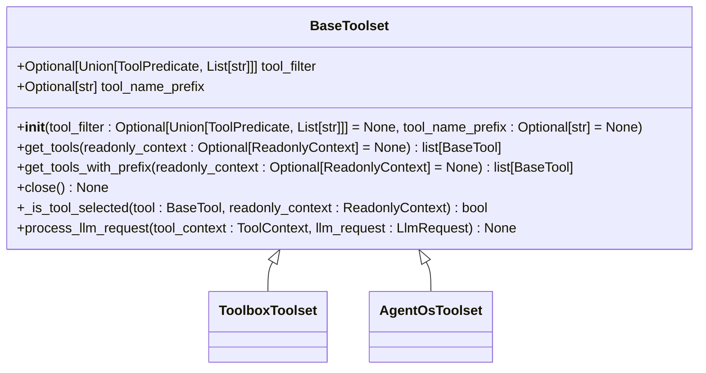
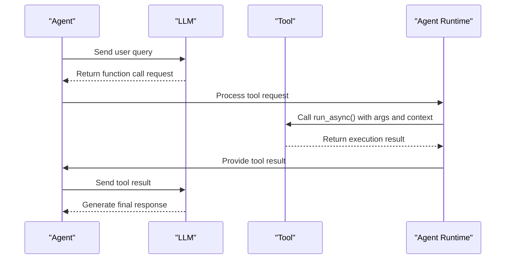
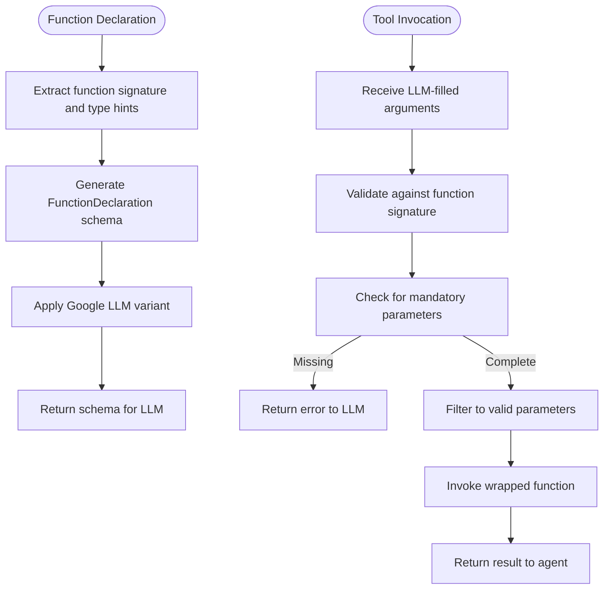
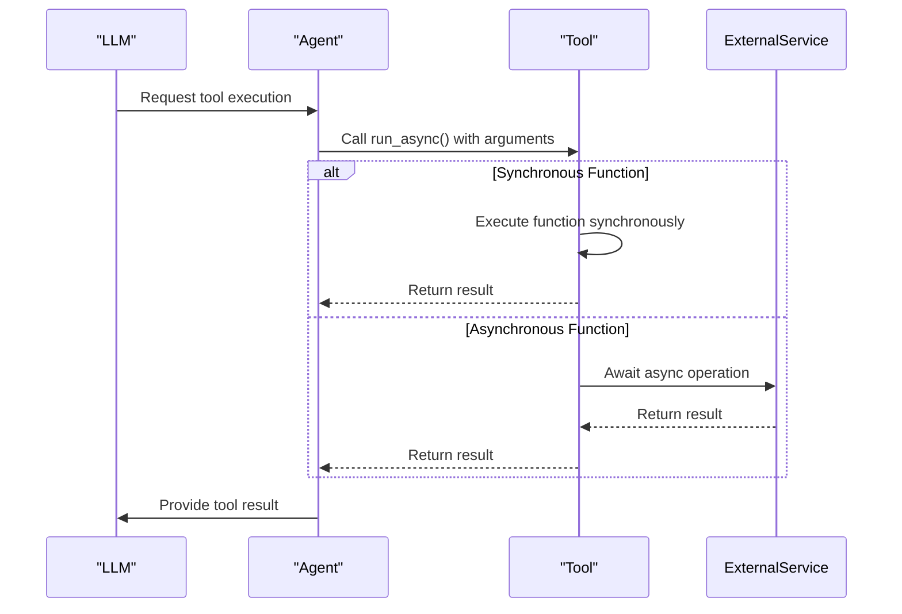
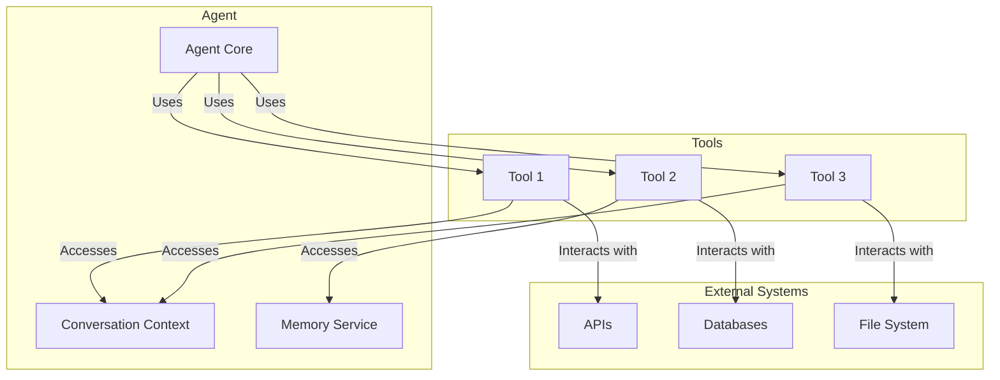

# Base Tool Classes

<cite>
**Referenced Files in This Document**   
- [base_tool.py](file://src/google/adk/tools/base_tool.py)
- [base_toolset.py](file://src/google/adk/tools/base_toolset.py)
- [tool_context.py](file://src/google/adk/tools/tool_context.py)
- [tool_configs.py](file://src/google/adk/tools/tool_configs.py)
- [function_tool.py](file://src/google/adk/tools/function_tool.py)
- [toolbox_toolset.py](file://src/google/adk/tools/toolbox_toolset.py)
- [example_tool.py](file://src/google/adk/tools/example_tool.py)
- [runners.py](file://src/google/adk/runners.py)
</cite>

## Table of Contents
1. [Introduction](#introduction)
2. [Core Base Classes](#core-base-classes)
3. [Tool Execution Lifecycle](#tool-execution-lifecycle)
4. [Tool Registration and Configuration](#tool-registration-and-configuration)
5. [Parameter Parsing and Schema Generation](#parameter-parsing-and-schema-generation)
6. [Error Handling and Asynchronous Execution](#error-handling-and-asynchronous-execution)
7. [Creating Custom Tools](#creating-custom-tools)
8. [Tool-Agent Relationship](#tool-agent-relationship)
9. [Conclusion](#conclusion)

## Introduction

The ADK (Agent Development Kit) provides a robust framework for building intelligent agents through its base tool classes. These classes form the foundation for tool creation, execution, and management within the agent ecosystem. The core abstraction revolves around the `BaseTool` and `BaseToolset` classes, which define the interface and behavior for all tools in the system. This documentation provides comprehensive coverage of these base classes, their method signatures, execution lifecycle, and integration patterns with agents. Understanding these components is essential for developing custom tools that can interact seamlessly with LLMs (Large Language Models) and participate in complex agent workflows.

## Core Base Classes

The ADK framework defines two fundamental base classes for tool development: `BaseTool` and `BaseToolset`. These classes establish the contract for tool behavior and organization within the agent system.

### BaseTool Class

The `BaseTool` class serves as the abstract base class for all individual tools in the ADK framework. It defines the essential attributes and methods that every tool must implement or inherit.



**Diagram sources**
- [base_tool.py](file://src/google/adk/tools/base_tool.py#L47-L213)

**Section sources**
- [base_tool.py](file://src/google/adk/tools/base_tool.py#L47-L213)

The `BaseTool` class includes several key attributes:
- **name**: A string identifier for the tool
- **description**: A textual description of the tool's purpose and functionality
- **is_long_running**: A boolean flag indicating whether the tool represents a long-running operation
- **custom_metadata**: An optional dictionary for storing tool-specific metadata that must be JSON serializable

The class defines three primary methods that govern tool behavior:
- `_get_declaration()`: Returns the tool's OpenAPI specification as a `FunctionDeclaration`, which is used for LLM compatibility
- `run_async()`: Executes the tool with provided arguments and context, returning the result
- `process_llm_request()`: Processes outgoing LLM requests, typically by adding the tool to the request configuration

### BaseToolset Class

The `BaseToolset` class provides a container for managing collections of tools. It enables the organization of related tools and provides filtering capabilities based on context.



**Diagram sources**
- [base_toolset.py](file://src/google/adk/tools/base_toolset.py#L56-L185)

**Section sources**
- [base_toolset.py](file://src/google/adk/tools/base_toolset.py#L56-L185)

The `BaseToolset` class includes:
- **tool_filter**: A filter to apply to tools, which can be a `ToolPredicate` callable or a list of tool names
- **tool_name_prefix**: A prefix to prepend to tool names when retrieved from the toolset

Key methods include:
- `get_tools()`: Abstract method that returns all tools in the toolset based on the provided context
- `get_tools_with_prefix()`: Returns tools with optional prefixing applied to their names
- `close()`: Performs cleanup and releases resources held by the toolset
- `process_llm_request()`: Processes outgoing LLM requests at the toolset level

## Tool Execution Lifecycle

The tool execution lifecycle in ADK follows a well-defined sequence of operations that ensures proper integration between tools, agents, and LLMs. This lifecycle begins with tool registration and configuration, proceeds through LLM request processing, and concludes with tool execution and result handling.

### Initialization and Configuration

Tools are instantiated through the `from_config()` class method, which uses Python's introspection capabilities to map configuration values to constructor arguments based on type hints. This method automatically handles various data types including primitive types, Pydantic models, callables, and collections.

### LLM Request Processing

When an agent prepares an LLM request, the `process_llm_request()` method is called on each tool or toolset. For individual tools, this typically involves adding the tool to the LLM request configuration using the `append_tools()` method. The tool's schema is generated through the `_get_declaration()` method, which creates a `FunctionDeclaration` object that describes the tool's interface to the LLM.

### Tool Invocation

When the LLM decides to invoke a tool, it returns a function call with filled arguments. The agent runtime then executes the tool's `run_async()` method with these arguments and a `ToolContext` object. The `ToolContext` provides access to the invocation context, function call ID, event actions, and authentication mechanisms.

### Result Handling

The result of tool execution is returned to the agent, which incorporates it into the conversation context. For long-running operations, tools may return a resource ID initially and complete the operation asynchronously. The agent can then track the status of these operations and retrieve results when available.



**Diagram sources**
- [base_tool.py](file://src/google/adk/tools/base_tool.py#L96-L113)
- [runners.py](file://src/google/adk/runners.py#L180-L199)

**Section sources**
- [base_tool.py](file://src/google/adk/tools/base_tool.py#L96-L113)
- [runners.py](file://src/google/adk/runners.py#L180-L199)

## Tool Registration and Configuration

Tool registration in ADK follows a flexible configuration system that supports multiple patterns for tool instantiation and management. The framework distinguishes between built-in tools, user-defined tools, and dynamic tool creation through functions.

### Configuration Schema

The `ToolConfig` class defines the configuration schema for tools, supporting five distinct patterns:

1. **ADK built-in tools**: Referenced by name (e.g., "google_search")
2. **User-defined tool instances**: Referenced by fully qualified path
3. **User-defined tool classes**: Referenced by fully qualified path with constructor arguments
4. **User-defined functions**: Functions that generate tool instances, with arguments passed to the function
5. **User-defined function tools**: Functions that are wrapped as tools

```yaml
tools:
  - name: google_search
  - name: AgentTool
    args:
      agent: ./another_agent.yaml
      skip_summarization: true
  - name: my_package.my_module.my_tool
  - name: my_package.my_module.my_tool_class
    args:
      my_tool_arg1: value1
      my_tool_arg2: value2
  - name: my_package.my_module.my_tool_function
    args:
      my_function_arg1: value1
      my_function_arg2: value2
```

### Tool Discovery and Loading

The agent runtime discovers and loads tools through the configuration system. When a tool is referenced by a fully qualified name, the system resolves this name to the actual object using the `resolve_fully_qualified_name()` utility. For tool classes, the `from_config()` method is called with the provided arguments to instantiate the tool.

### Toolset Integration

Toolsets are registered with agents by adding them to the agent's tools collection. When an agent is configured with toolsets, it calls the toolset's `get_tools()` method to retrieve the actual tools. This allows for dynamic tool selection based on context, such as user permissions or application state.

**Section sources**
- [tool_configs.py](file://src/google/adk/tools/tool_configs.py#L26-L129)
- [base_tool.py](file://src/google/adk/tools/base_tool.py#L135-L213)

## Parameter Parsing and Schema Generation

The ADK framework provides sophisticated mechanisms for parameter parsing and schema generation, ensuring seamless integration between Python functions and LLM-compatible interfaces.

### Schema Generation

The `_get_declaration()` method generates a `FunctionDeclaration` object that describes the tool's interface to the LLM. For `FunctionTool` instances, this is accomplished through the `build_function_declaration()` utility, which analyzes the wrapped function's signature, docstring, and type hints to create an appropriate schema.

The schema includes:
- Function name and description
- Parameter names, types, and descriptions
- Required vs. optional parameters
- Return type information

This schema is used by the LLM to understand how to call the tool and what arguments to provide.

### Parameter Parsing

When a tool is invoked, the framework parses the LLM-provided arguments according to the tool's expected parameter types. The parsing system handles various type conversions:

- Primitive types (int, str, bool, float) are passed directly
- Pydantic models are validated using `model_validate()`
- Callables are resolved from fully qualified names
- Collections (list, set, dict) are constructed from the provided values
- Nested types (e.g., list of models) are handled recursively

The `run_async()` method in `FunctionTool` includes validation to ensure that all mandatory parameters are present before invoking the wrapped function. If required parameters are missing, the tool returns an error message to the LLM, prompting it to retry with the missing information.



**Diagram sources**
- [function_tool.py](file://src/google/adk/tools/function_tool.py#L65-L77)
- [function_tool.py](file://src/google/adk/tools/function_tool.py#L79-L119)

**Section sources**
- [function_tool.py](file://src/google/adk/tools/function_tool.py#L65-L119)

## Error Handling and Asynchronous Execution

The ADK framework provides comprehensive support for error handling and asynchronous execution, enabling robust tool implementations that can handle various failure modes and performance requirements.

### Error Handling Patterns

The framework employs several error handling patterns to ensure reliable tool execution:

1. **Parameter validation**: Before invoking a tool, the system checks that all mandatory parameters are present. If required parameters are missing, the tool returns a descriptive error message to the LLM, enabling it to correct the request.

2. **Exception handling**: Tools can catch exceptions during execution and return structured error responses. This allows agents to handle errors gracefully and potentially retry operations with different parameters.

3. **Security filtering**: The framework supports before-tool callbacks that can intercept tool calls and block them based on security policies or other criteria.

4. **Graceful degradation**: When external services are unavailable, tools can return appropriate error messages that guide the LLM toward alternative approaches.

### Timeout Configurations

While the base classes don't directly implement timeout mechanisms, the framework supports timeout configurations through tool parameters. For example, the `execute_command` tool includes a configurable timeout parameter that limits the execution time of shell commands:

```python
properties={
    "command": types.Schema(
        type=types.Type.STRING,
        description="Bash command to execute"
    ),
    "timeout": types.Schema(
        type=types.Type.INTEGER,
        description="Timeout in seconds (default: 60)"
    )
}
```

### Asynchronous Execution Support

The ADK framework is built on asynchronous execution principles, with all tool execution methods defined as coroutines. This enables:

- Non-blocking I/O operations
- Concurrent execution of multiple tools
- Integration with asynchronous external services
- Streaming responses for long-running operations

The `run_async()` method signature ensures that all tools can participate in the asynchronous execution model. For synchronous functions, the framework automatically wraps them in a coroutine to maintain consistency.



**Section sources**
- [function_tool.py](file://src/google/adk/tools/function_tool.py#L79-L119)
- [agent.py](file://contributing/samples/live_tool_callbacks_agent/agent.py#L123-L171)

## Creating Custom Tools

Creating custom tools in ADK involves extending the base classes and implementing the required methods with proper type annotations, parameter validation, and documentation.

### Extending BaseTool

To create a custom tool, extend the `BaseTool` class and implement the necessary methods:

```python
class MyCustomTool(BaseTool):
    def __init__(self, param1: str, param2: int = 10):
        super().__init__(
            name="my_custom_tool",
            description="A custom tool that performs specific operations"
        )
        self.param1 = param1
        self.param2 = param2
    
    async def run_async(self, *, args: dict[str, Any], tool_context: ToolContext) -> Any:
        # Implementation of tool logic
        pass
    
    @classmethod
    def from_config(cls, config: ToolArgsConfig, config_abs_path: str) -> Self:
        # Custom initialization logic
        pass
```

### Using FunctionTool

For simple functions, the `FunctionTool` class provides a convenient wrapper that automatically generates the appropriate schema:

```python
def get_weather(location: str, units: str = "celsius") -> dict:
    """Get current weather for a location.
    
    Args:
        location: The city or geographic location
        units: Temperature units (celsius or fahrenheit)
    
    Returns:
        Dictionary containing weather information
    """
    # Implementation
    pass

# Wrap the function as a tool
weather_tool = FunctionTool(get_weather)
```

### Best Practices

When creating custom tools, follow these best practices:

1. **Proper type annotations**: Use type hints to enable automatic schema generation
2. **Comprehensive docstrings**: Provide clear descriptions of parameters, return values, and behavior
3. **Parameter validation**: Validate inputs and handle edge cases appropriately
4. **Error messages**: Return descriptive error messages that help the LLM understand and correct mistakes
5. **Asynchronous design**: Implement tools as coroutines to avoid blocking the event loop
6. **Resource management**: Implement proper cleanup in the `close()` method for tools that hold resources

**Section sources**
- [function_tool.py](file://src/google/adk/tools/function_tool.py#L31-L168)
- [example_tool.py](file://src/google/adk/tools/example_tool.py#L35-L96)

## Tool-Agent Relationship

The relationship between tools and agents in ADK is fundamental to the agent's capabilities and behavior. Tools extend the agent's functionality by providing access to external systems, computational resources, and specialized operations.

### Tool Discovery

Agents discover tools through their configuration. When an agent is instantiated, it processes its tool configuration and loads the specified tools and toolsets. The agent maintains a collection of available tools that can be accessed during execution.

### Tool Invocation

During agent execution, the LLM can request the invocation of tools based on the conversation context. The agent runtime coordinates this process by:

1. Receiving the tool call request from the LLM
2. Validating that the requested tool is available
3. Extracting the provided arguments
4. Creating a `ToolContext` for the invocation
5. Executing the tool's `run_async()` method
6. Returning the result to the agent for incorporation into the conversation

### Context Sharing

The `ToolContext` class provides a mechanism for sharing context between the agent and tools. This context includes:

- **Invocation context**: Information about the current agent invocation
- **Function call ID**: Identifier for mapping responses to requests
- **Event actions**: Mechanisms for requesting authentication or other actions
- **State access**: Access to the conversation state and memory

This shared context enables tools to participate in the agent's workflow and access necessary information for their operations.

### Dynamic Tool Management

Agents can dynamically manage their tools during execution. This includes:

- Adding or removing tools based on context
- Modifying tool behavior through configuration changes
- Loading toolsets on demand
- Implementing tool filtering based on user permissions or application state

The `BaseToolset` class supports this dynamic behavior through its `get_tools()` method, which can return different sets of tools based on the provided `ReadonlyContext`.



**Diagram sources**
- [base_tool.py](file://src/google/adk/tools/base_tool.py#L47-L213)
- [base_toolset.py](file://src/google/adk/tools/base_toolset.py#L56-L185)
- [tool_context.py](file://src/google/adk/tools/tool_context.py#L31-L81)

**Section sources**
- [base_tool.py](file://src/google/adk/tools/base_tool.py#L47-L213)
- [base_toolset.py](file://src/google/adk/tools/base_toolset.py#L56-L185)
- [tool_context.py](file://src/google/adk/tools/tool_context.py#L31-L81)

## Conclusion

The base tool classes in ADK provide a powerful and flexible foundation for building intelligent agents. The `BaseTool` and `BaseToolset` classes establish a clear contract for tool behavior and organization, enabling consistent integration with LLMs and agent workflows. The framework's support for configuration, schema generation, asynchronous execution, and error handling makes it well-suited for developing robust tools that can handle real-world requirements. By following the patterns and best practices outlined in this documentation, developers can create custom tools that extend agent capabilities and participate effectively in complex AI systems. The tight integration between tools and agents, mediated through the `ToolContext` and execution lifecycle, ensures that tools can contribute meaningfully to the agent's decision-making process while maintaining separation of concerns and modularity.