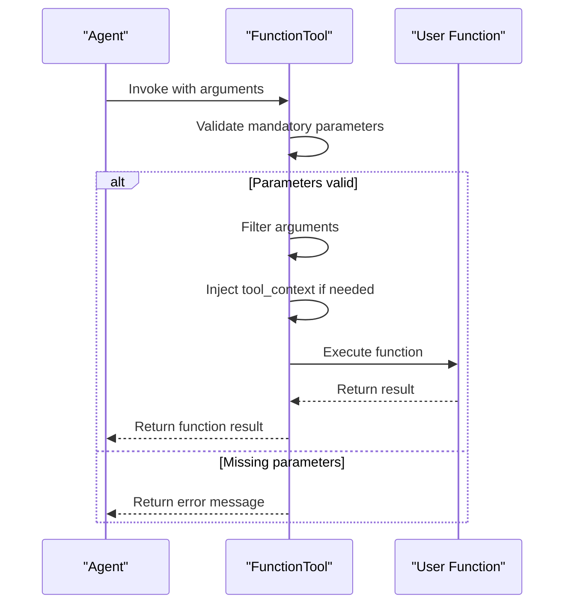
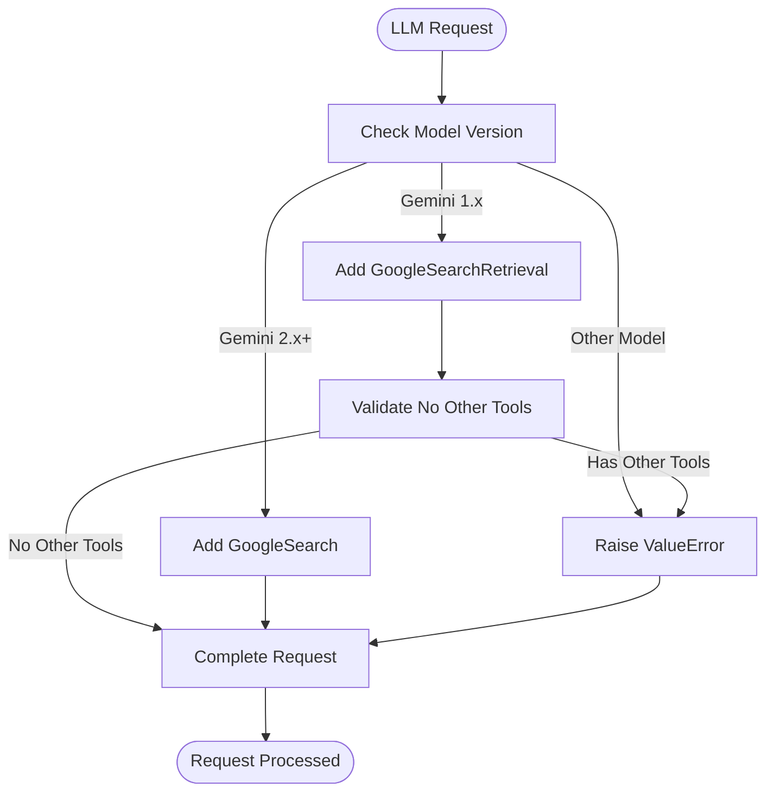
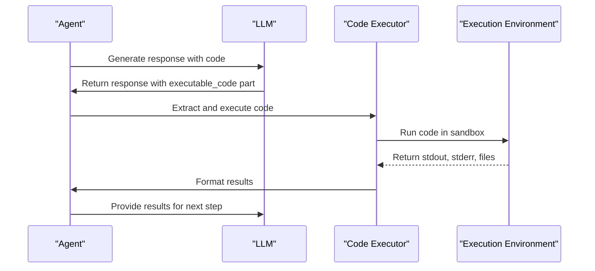
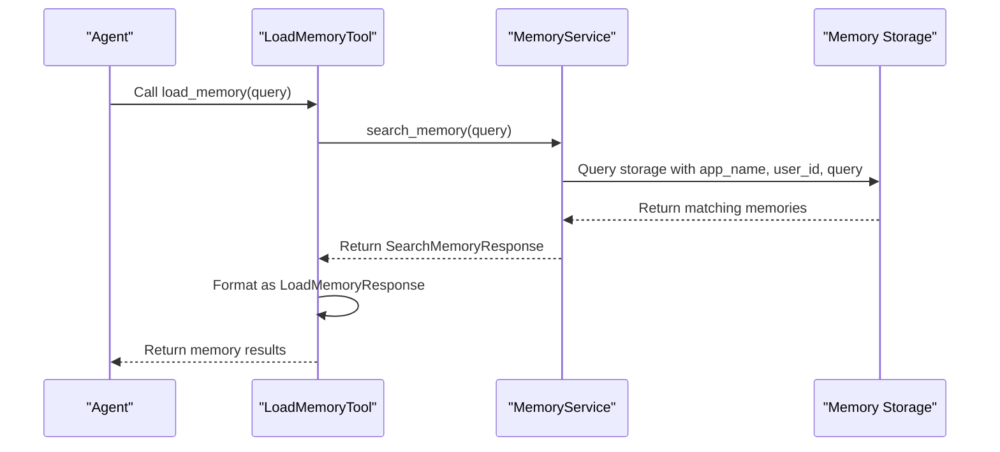
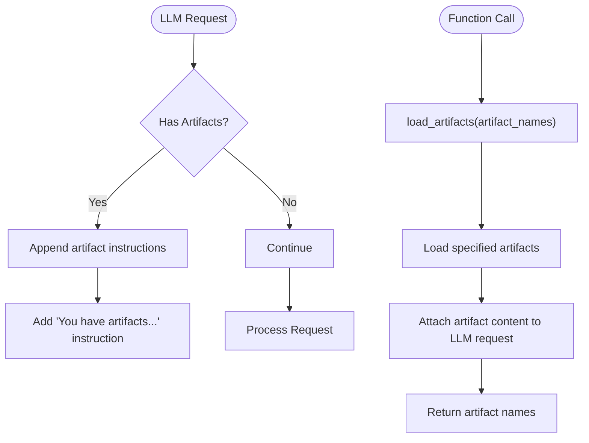
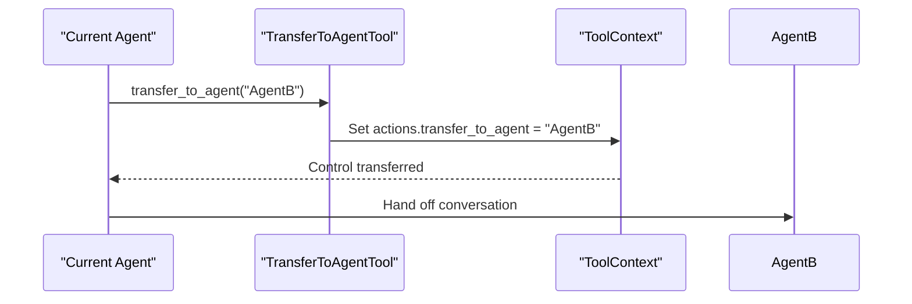
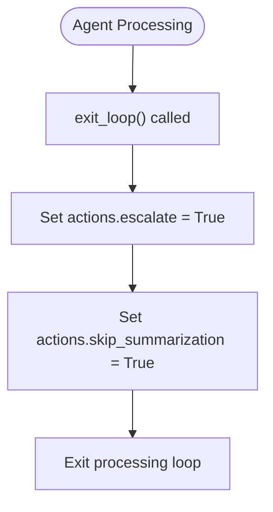

# Built-in Tools

<cite>
**Referenced Files in This Document**   
- [function_tool.py](file://src/google/adk/tools/function_tool.py)
- [google_search_tool.py](file://src/google/adk/tools/google_search_tool.py)
- [built_in_code_executor.py](file://src/google/adk/code_executors/built_in_code_executor.py)
- [load_memory_tool.py](file://src/google/adk/tools/load_memory_tool.py)
- [load_artifacts_tool.py](file://src/google/adk/tools/load_artifacts_tool.py)
- [transfer_to_agent_tool.py](file://src/google/adk/tools/transfer_to_agent_tool.py)
- [exit_loop_tool.py](file://src/google/adk/tools/exit_loop_tool.py)
- [base_tool.py](file://src/google/adk/tools/base_tool.py)
- [tool_context.py](file://src/google/adk/tools/tool_context.py)
- [code_execution_utils.py](file://src/google/adk/code_executors/code_execution_utils.py)
- [auth_tool.py](file://src/google/adk/auth/auth_tool.py)
- [agent.py](file://contributing/samples/code_execution/agent.py)
- [base_memory_service.py](file://src/google/adk/memory/base_memory_service.py)
</cite>

## Table of Contents
1. [Introduction](#introduction)
2. [FunctionTool](#functiontool)
3. [GoogleSearchTool](#googlesearchtool)
4. [CodeExecution](#codeexecution)
5. [MemoryTools](#memorytools)
6. [ArtifactTools](#artifacttools)
7. [TransferToAgentTool](#transfertoagenttool)
8. [ExitLoopTool](#exitlooptool)
9. [Security Considerations](#security-considerations)
10. [Authentication and Rate Limiting](#authentication-and-rate-limiting)
11. [Usage Examples](#usage-examples)
12. [Built-in vs Custom Tools](#built-in-vs-custom-tools)

## Introduction
The ADK (Agent Development Kit) provides a comprehensive suite of built-in tools that enable agents to perform various tasks, from executing code to accessing external services and managing state. These tools are designed to be seamlessly integrated into agent workflows, providing standardized interfaces for common operations. This documentation details the purpose, configuration, input/output schemas, and execution behavior of each built-in tool, along with security considerations and usage patterns.

**Section sources**
- [function_tool.py](file://src/google/adk/tools/function_tool.py#L31-L168)
- [google_search_tool.py](file://src/google/adk/tools/google_search_tool.py#L31-L70)

## FunctionTool

### Purpose
The FunctionTool enables agents to execute user-defined Python functions within their workflows. It wraps any callable Python object and exposes it to the agent as a tool that can be invoked based on the agent's reasoning and decision-making process.

### Configuration Parameters
- **func**: The callable Python function or object to wrap
- **name**: Automatically derived from the function's __name__ attribute or class name
- **description**: Automatically derived from the function's docstring

### Input/Output Schema
The input schema is automatically generated from the function's signature, excluding parameters named 'tool_context' and 'input_stream'. The output schema matches the return type of the wrapped function. The tool validates that all mandatory parameters (those without default values) are provided before execution.

### Execution Behavior
When invoked, the FunctionTool:
1. Validates that all mandatory parameters are present
2. Filters input arguments to include only valid parameters for the function
3. Injects the tool_context if the function accepts it as a parameter
4. Executes the function synchronously or asynchronously based on whether it's a coroutine
5. Returns the function's result or an error message if mandatory parameters are missing



**Diagram sources**
- [function_tool.py](file://src/google/adk/tools/function_tool.py#L80-L119)

**Section sources**
- [function_tool.py](file://src/google/adk/tools/function_tool.py#L31-L168)

## GoogleSearchTool

### Purpose
The GoogleSearchTool provides agents with the ability to retrieve information from Google Search. This is a built-in tool that operates internally within Gemini 2 models, allowing agents to access current information without requiring external API calls from the client side.

### Configuration Parameters
This tool requires no configuration parameters as it is automatically configured based on the model being used.

### Input/Output Schema
The tool does not have a traditional input/output schema as it operates at the LLM request level rather than being directly invoked by the agent. When enabled, it modifies the LLM request to include search capabilities.

### Execution Behavior
The GoogleSearchTool integrates with the LLM request processing pipeline:
1. For Gemini 1.x models, it adds a GoogleSearchRetrieval tool to the request configuration
2. For Gemini 2.x+ models, it adds a GoogleSearch tool to the request configuration
3. It raises an error if used with non-Gemini models or with other tools in Gemini 1.x
4. The actual search execution happens within the model infrastructure



**Diagram sources**
- [google_search_tool.py](file://src/google/adk/tools/google_search_tool.py#L43-L66)

**Section sources**
- [google_search_tool.py](file://src/google/adk/tools/google_search_tool.py#L31-L70)

## CodeExecution

### Purpose
The CodeExecution capability allows agents to execute Python code in a secure environment. This enables agents to perform calculations, data analysis, and other computational tasks that require programming capabilities.

### Configuration Parameters
- **code_executor**: An instance of BuiltInCodeExecutor that handles the code execution
- **model**: Must be a Gemini 2.0+ model to support code execution

### Input/Output Schema
The input consists of Python code and optional input files. The output includes:
- Standard output (stdout)
- Standard error (stderr)
- Output files generated by the code
The code is executed in a stateful environment where variables persist between executions.

### Execution Behavior
The code execution process:
1. Modifies the LLM request to include code execution capabilities for Gemini 2.0+ models
2. Extracts code from the agent's response using code block delimiters
3. Executes the code in a secure environment
4. Captures stdout, stderr, and any generated files
5. Returns the results to the agent for further processing



**Diagram sources**
- [built_in_code_executor.py](file://src/google/adk/code_executors/built_in_code_executor.py#L36-L55)
- [code_execution_utils.py](file://src/google/adk/code_executors/code_execution_utils.py#L88-L258)

**Section sources**
- [built_in_code_executor.py](file://src/google/adk/code_executors/built_in_code_executor.py#L28-L56)
- [code_execution_utils.py](file://src/google/adk/code_executors/code_execution_utils.py#L28-L258)
- [agent.py](file://contributing/samples/code_execution/agent.py#L80-L101)

## MemoryTools

### Purpose
MemoryTools enable agents to store and retrieve information across sessions. The primary tool is LoadMemoryTool, which allows agents to search and retrieve relevant memories based on a query.

### Configuration Parameters
No configuration parameters are required for the LoadMemoryTool.

### Input/Output Schema
- **Input**: A query string to search for in the memory
- **Output**: A LoadMemoryResponse containing a list of MemoryEntry objects that match the query

### Execution Behavior
When the LoadMemoryTool is invoked:
1. The agent provides a query string
2. The tool uses the tool_context to search memory
3. The memory service searches for relevant entries based on the app_name, user_id, and query
4. Matching memory entries are returned to the agent
5. The tool also appends instructions to the LLM request to inform the model about available memory



**Diagram sources**
- [load_memory_tool.py](file://src/google/adk/tools/load_memory_tool.py#L36-L48)
- [base_memory_service.py](file://src/google/adk/memory/base_memory_service.py#L62-L78)

**Section sources**
- [load_memory_tool.py](file://src/google/adk/tools/load_memory_tool.py#L51-L94)
- [base_memory_service.py](file://src/google/adk/memory/base_memory_service.py#L31-L79)

## ArtifactTools

### Purpose
ArtifactTools enable agents to manage files and other data artifacts within their workflows. The LoadArtifactsTool allows agents to list and load available artifacts for processing.

### Configuration Parameters
No configuration parameters are required for the LoadArtifactsTool.

### Input/Output Schema
- **Input**: An optional list of artifact names to load
- **Output**: A dictionary containing the loaded artifact names
- **Side Effect**: Appends instructions to the LLM request about available artifacts and attaches loaded artifact content

### Execution Behavior
The LoadArtifactsTool operates in two phases:
1. During LLM request processing, it appends instructions about available artifacts
2. When invoked, it processes the request to load specified artifacts and attaches their content to the LLM request
3. The tool maintains a list of available artifacts in the session



**Diagram sources**
- [load_artifacts_tool.py](file://src/google/adk/tools/load_artifacts_tool.py#L57-L111)

**Section sources**
- [load_artifacts_tool.py](file://src/google/adk/tools/load_artifacts_tool.py#L31-L114)

## TransferToAgentTool

### Purpose
The TransferToAgentTool enables agents to hand off control to another agent when the current agent is not best suited to handle the user's request. This facilitates multi-agent workflows where different agents specialize in different domains.

### Configuration Parameters
- **agent_name**: The name of the agent to transfer control to

### Input/Output Schema
- **Input**: The name of the target agent
- **Output**: None (the tool modifies the tool_context actions)
- **Side Effect**: Sets the transfer_to_agent action in the event_actions

### Execution Behavior
When transfer_to_agent is called:
1. The tool receives the target agent's name
2. It accesses the tool_context.actions
3. It sets the transfer_to_agent property to the specified agent name
4. This triggers the agent framework to transfer control to the specified agent



**Diagram sources**
- [transfer_to_agent_tool.py](file://src/google/adk/tools/transfer_to_agent_tool.py#L20-L29)

**Section sources**
- [transfer_to_agent_tool.py](file://src/google/adk/tools/transfer_to_agent_tool.py#L20-L30)

## ExitLoopTool

### Purpose
The ExitLoopTool allows agents to explicitly exit a processing loop when instructed to do so. This provides a mechanism for agents to terminate their current workflow when appropriate.

### Configuration Parameters
No configuration parameters are required.

### Input/Output Schema
- **Input**: None
- **Output**: None
- **Side Effect**: Modifies the tool_context actions to escalate and skip summarization

### Execution Behavior
When exit_loop is called:
1. The tool accesses the tool_context.actions
2. It sets the escalate property to True
3. It sets the skip_summarization property to True
4. This signals the agent framework to exit the current processing loop



**Diagram sources**
- [exit_loop_tool.py](file://src/google/adk/tools/exit_loop_tool.py#L18-L25)

**Section sources**
- [exit_loop_tool.py](file://src/google/adk/tools/exit_loop_tool.py#L18-L25)

## Security Considerations

### Code Execution Security
The CodeExecution tool implements several security measures:
- Code runs in a sandboxed environment with restricted access to system resources
- Only Python code execution is supported, with no shell command execution
- Input and output are strictly controlled through defined interfaces
- The execution environment is stateful but isolated to the current session
- Code is extracted from responses using specific delimiters to prevent injection

### Data Access Security
Memory and artifact access follows the principle of least privilege:
- Memory access is scoped to the current app_name and user_id
- Artifacts are only accessible within the current session context
- Authentication is required for accessing protected resources
- All data access is logged for audit purposes

### Input Validation
All built-in tools implement input validation:
- FunctionTool validates mandatory parameters before execution
- GoogleSearchTool validates model compatibility
- CodeExecution validates code syntax and structure
- Memory and Artifact tools validate query parameters

**Section sources**
- [built_in_code_executor.py](file://src/google/adk/code_executors/built_in_code_executor.py#L28-L56)
- [code_execution_utils.py](file://src/google/adk/code_executors/code_execution_utils.py#L28-L258)
- [auth_tool.py](file://src/google/adk/auth/auth_tool.py#L26-L101)

## Authentication and Rate Limiting

### Authentication Requirements
External service tools require proper authentication:
- OAuth2 for Google APIs and other services requiring user consent
- Service account credentials for server-to-server communication
- API keys for services that support key-based authentication
- Credentials are managed through the AuthHandler and stored securely

### Rate Limiting
The ADK framework implements rate limiting to prevent abuse:
- Per-user rate limits for API calls
- Per-agent limits on tool invocation frequency
- Burst and sustained rate limiting for external services
- Automatic retry with exponential backoff for rate-limited requests

### Credential Management
The authentication system provides:
- Secure storage of credentials in credential services
- Automatic token refresh for OAuth2 credentials
- Credential isolation between users and applications
- Support for multiple authentication schemes

**Section sources**
- [auth_tool.py](file://src/google/adk/auth/auth_tool.py#L26-L101)
- [tool_context.py](file://src/google/adk/tools/tool_context.py#L62-L70)

## Usage Examples

### Configuring a Data Science Agent
```python
from google.adk.agents.llm_agent import Agent
from google.adk.code_executors.built_in_code_executor import BuiltInCodeExecutor

root_agent = Agent(
    model="gemini-2.0-flash-001",
    name="data_science_agent",
    instruction=base_system_instruction() + """
    You need to assist the user with their queries by looking at the data and the context in the conversation.
    You final answer should summarize the code and code execution relavant to the user query.
    """,
    code_executor=BuiltInCodeExecutor(),
)
```

### Using Memory in Agent Workflows
The LoadMemoryTool is automatically available when memory services are configured. Agents can use it by calling the load_memory function with a query string to retrieve relevant memories from previous interactions.

### Transferring Between Agents
Agents can transfer control to other agents by calling the transfer_to_agent function with the target agent's name. This enables specialized agents to handle specific types of queries.

**Section sources**
- [agent.py](file://contributing/samples/code_execution/agent.py#L80-L101)

## Built-in vs Custom Tools

### When to Use Built-in Tools
Built-in tools should be used when:
- The functionality matches the built-in tool's purpose exactly
- Security and reliability are critical requirements
- Integration with ADK's core features is needed
- Development time is limited

### When to Create Custom Implementations
Custom tools should be created when:
- Specialized behavior beyond what built-in tools provide is needed
- Integration with proprietary systems or APIs is required
- Custom authentication or authorization logic is necessary
- Performance optimizations specific to the use case are needed

### Best Practices
- Prefer built-in tools for standard functionality
- Extend built-in tools when possible rather than creating entirely new ones
- Follow the same security patterns as built-in tools
- Use the same error handling and logging conventions

**Section sources**
- [function_tool.py](file://src/google/adk/tools/function_tool.py#L31-L168)
- [base_tool.py](file://src/google/adk/tools/base_tool.py#L47-L213)