# Tool Classes

<cite>
**Referenced Files in This Document**   
- [base_tool.py](file://src/google/adk/tools/base_tool.py)
- [base_toolset.py](file://src/google/adk/tools/base_toolset.py)
- [function_tool.py](file://src/google/adk/tools/function_tool.py)
- [google_search_tool.py](file://src/google/adk/tools/google_search_tool.py)
- [tool_configs.py](file://src/google/adk/tools/tool_configs.py)
- [base_authenticated_tool.py](file://src/google/adk/tools/base_authenticated_tool.py)
- [long_running_tool.py](file://src/google/adk/tools/long_running_tool.py)
- [toolbox_toolset.py](file://src/google/adk/tools/toolbox_toolset.py)
- [tool_context.py](file://src/google/adk/tools/tool_context.py)
- [retrieval/__init__.py](file://src/google/adk/tools/retrieval/__init__.py)
- [mcp_tool/__init__.py](file://src/google/adk/tools/mcp_tool/__init__.py)
- [openapi_tool/__init__.py](file://src/google/adk/tools/openapi_tool/__init__.py)
- [google_api_tool/__init__.py](file://src/google/adk/tools/google_api_tool/__init__.py)
</cite>

## Table of Contents
1. [Introduction](#introduction)
2. [Core Tool Classes](#core-tool-classes)
3. [Tool Execution Lifecycle](#tool-execution-lifecycle)
4.. [Built-in Tools](#built-in-tools)
5. [Integration Tools](#integration-tools)
6. [Tool Configuration and Registration](#tool-configuration-and-registration)
7. [Advanced Tool Patterns](#advanced-tool-patterns)
8. [Custom Tool Development](#custom-tool-development)
9. [Error Handling and Authentication](#error-handling-and-authentication)
10. [Tool Context and State Management](#tool-context-and-state-management)

## Introduction
The ADK (Agent Development Kit) tool system provides a comprehensive framework for creating, managing, and executing tools within agent-based applications. This documentation details the architecture and implementation of the core Tool and Toolset classes, covering their method signatures, execution lifecycle, and error handling mechanisms. The system supports various tool types including built-in tools (Google Search, Code Execution, Retrieval), integration tools (MCP, OpenAPI, Google API), and custom tools, enabling flexible agent behavior and functionality.

## Core Tool Classes

The foundation of the ADK tool system consists of the `BaseTool` and `BaseToolset` classes, which provide the essential interfaces and functionality for all tools and tool collections.

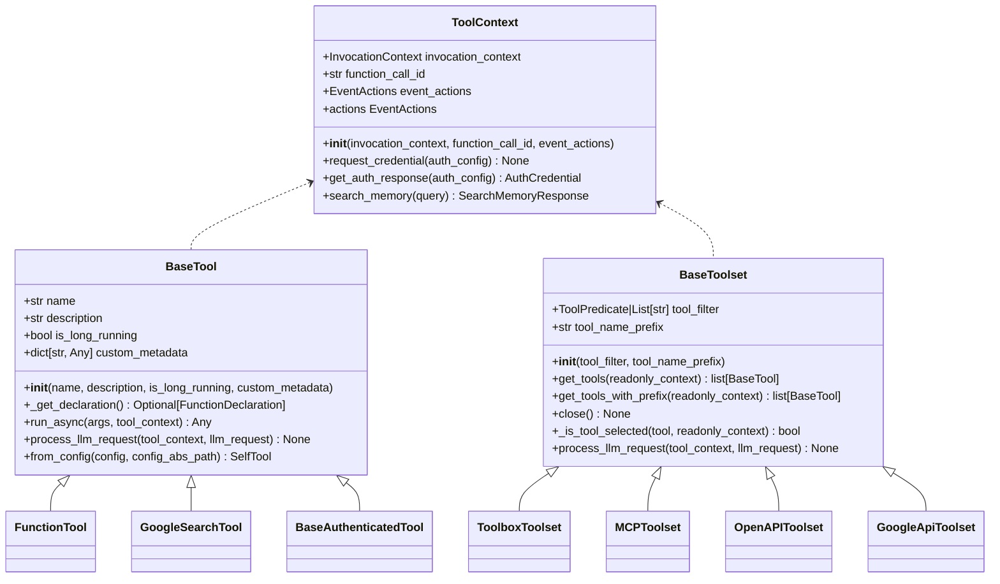

**Diagram sources**
- [base_tool.py](file://src/google/adk/tools/base_tool.py#L47-L213)
- [base_toolset.py](file://src/google/adk/tools/base_toolset.py#L56-L185)
- [tool_context.py](file://src/google/adk/tools/tool_context.py#L31-L81)

**Section sources**
- [base_tool.py](file://src/google/adk/tools/base_tool.py#L47-L213)
- [base_toolset.py](file://src/google/adk/tools/base_toolset.py#L56-L185)
- [tool_context.py](file://src/google/adk/tools/tool_context.py#L31-L81)

## Tool Execution Lifecycle

The tool execution lifecycle in ADK follows a well-defined sequence of operations that ensures proper tool invocation, processing, and response handling. The lifecycle begins with tool registration and configuration, proceeds through LLM request processing, and concludes with asynchronous execution and result return.

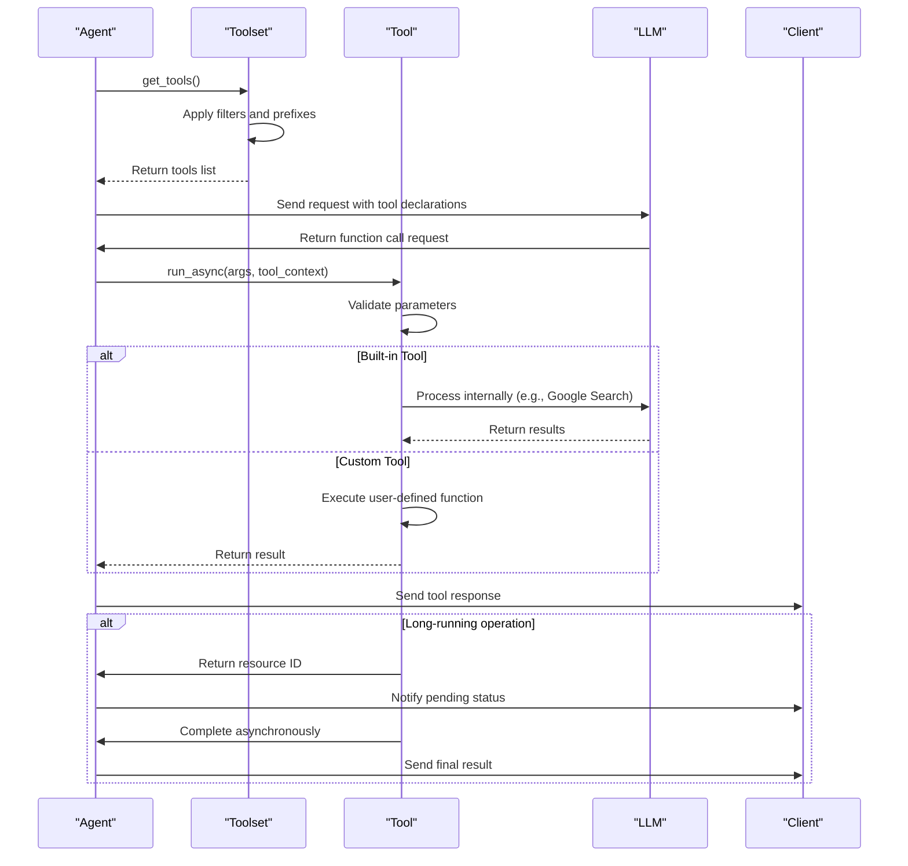

**Diagram sources**
- [base_tool.py](file://src/google/adk/tools/base_tool.py#L96-L134)
- [base_toolset.py](file://src/google/adk/tools/base_toolset.py#L78-L143)
- [function_tool.py](file://src/google/adk/tools/function_tool.py#L80-L119)

**Section sources**
- [base_tool.py](file://src/google/adk/tools/base_tool.py#L96-L134)
- [base_toolset.py](file://src/google/adk/tools/base_toolset.py#L78-L143)
- [function_tool.py](file://src/google/adk/tools/function_tool.py#L80-L119)

## Built-in Tools

ADK provides several built-in tools that offer essential functionality without requiring external configuration or setup. These tools are automatically integrated into the agent system and can be used immediately.

### Google Search Tool
The `GoogleSearchTool` enables agents to retrieve information from Google Search. This tool is specifically designed to work with Gemini models and automatically configures the LLM request to include search capabilities.

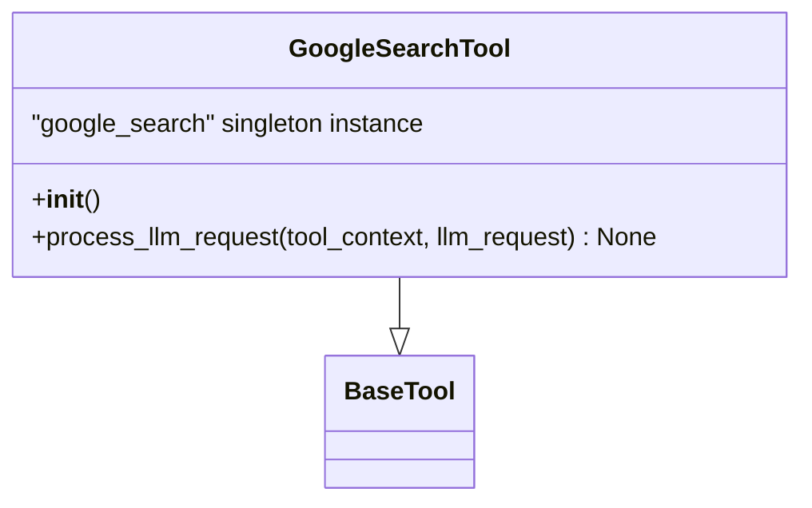

**Diagram sources**
- [google_search_tool.py](file://src/google/adk/tools/google_search_tool.py#L31-L70)

**Section sources**
- [google_search_tool.py](file://src/google/adk/tools/google_search_tool.py#L31-L70)

### Code Execution Tool
The code execution functionality is provided through the `FunctionTool` class, which wraps user-defined Python functions and enables their execution as tools within the agent system.

### Retrieval Tools
The retrieval system provides various tools for accessing and searching information from different sources. The base class `BaseRetrievalTool` defines the interface for all retrieval tools, with specific implementations for different retrieval backends.

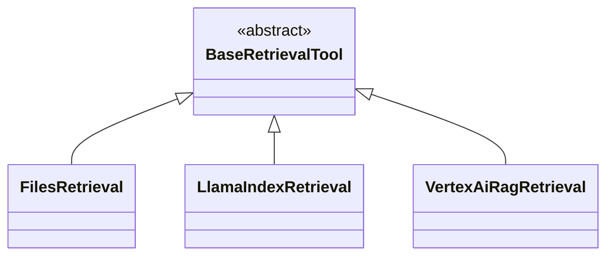

**Diagram sources**
- [retrieval/__init__.py](file://src/google/adk/tools/retrieval/__init__.py#L15-L57)

**Section sources**
- [retrieval/__init__.py](file://src/google/adk/tools/retrieval/__init__.py#L15-L57)

## Integration Tools

ADK supports integration with various external systems and protocols through specialized toolsets that handle the specific requirements of each integration type.

### MCP (Model Context Protocol) Tools
The MCP tool system enables integration with external tools that implement the Model Context Protocol. The `MCPToolset` manages connections to MCP servers and exposes their tools to the agent system.

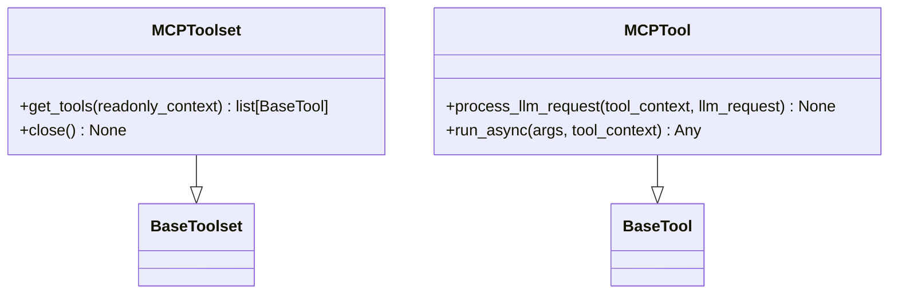

**Diagram sources**
- [mcp_tool/__init__.py](file://src/google/adk/tools/mcp_tool/__init__.py#L17-L50)

**Section sources**
- [mcp_tool/__init__.py](file://src/google/adk/tools/mcp_tool/__init__.py#L17-L50)

### OpenAPI Tools
The OpenAPI tool system allows integration with REST APIs described by OpenAPI specifications. The `OpenAPIToolset` parses OpenAPI specs and creates tools for each API endpoint.

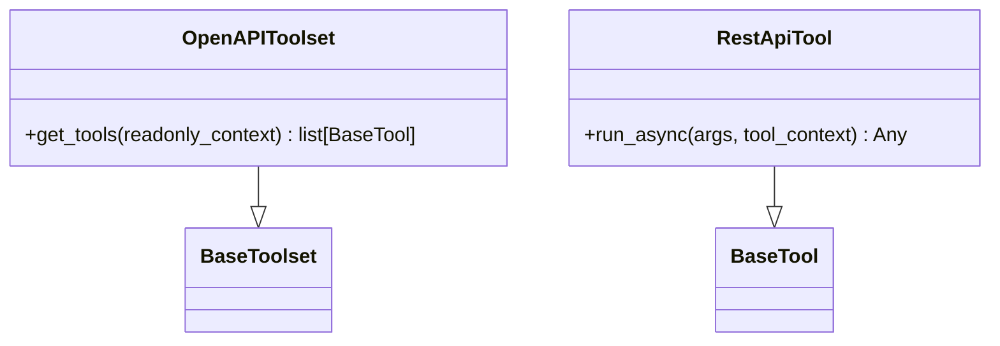

**Diagram sources**
- [openapi_tool/__init__.py](file://src/google/adk/tools/openapi_tool/__init__.py#L15-L22)

**Section sources**
- [openapi_tool/__init__.py](file://src/google/adk/tools/openapi_tool/__init__.py#L15-L22)

### Google API Tools
The Google API tool system provides access to various Google services through auto-generated tools based on the Google API Discovery API. These tools are organized into toolsets for specific Google services.

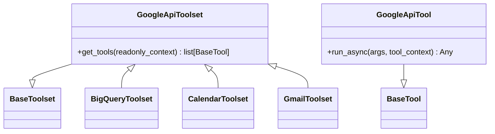

**Diagram sources**
- [google_api_tool/__init__.py](file://src/google/adk/tools/google_api_tool/__init__.py#L21-L42)

**Section sources**
- [google_api_tool/__init__.py](file://src/google/adk/tools/google_api_tool/__init__.py#L21-L42)

## Tool Configuration and Registration

The ADK tool system provides flexible mechanisms for configuring and registering tools through YAML configuration files and programmatic interfaces. The `ToolConfig` class defines the schema for tool configuration, supporting various tool types and initialization patterns.

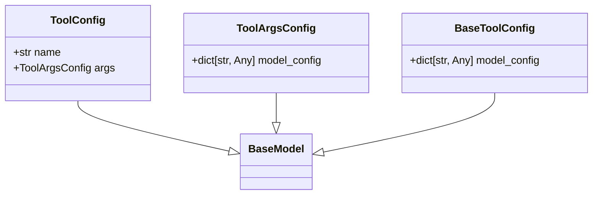

**Diagram sources**
- [tool_configs.py](file://src/google/adk/tools/tool_configs.py#L26-L129)

**Section sources**
- [tool_configs.py](file://src/google/adk/tools/tool_configs.py#L26-L129)

## Advanced Tool Patterns

The ADK tool system supports several advanced patterns for handling complex tool scenarios, including streaming responses, long-running operations, and tool composition.

### Streaming Responses
The tool system supports streaming responses for tools that produce large or continuous output. This is achieved through asynchronous generators and specialized streaming interfaces.

### Long-Running Operations
The `LongRunningFunctionTool` class extends the `FunctionTool` to handle operations that take significant time to complete. These tools return immediately with a resource ID and complete their work asynchronously.

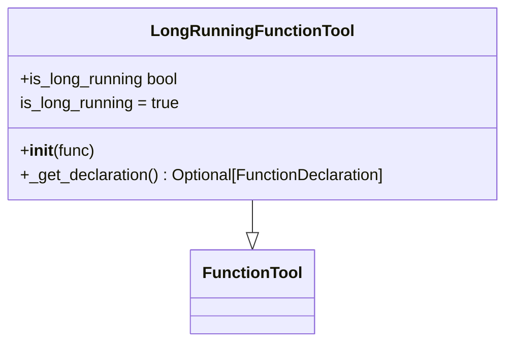

**Diagram sources**
- [long_running_tool.py](file://src/google/adk/tools/long_running_tool.py#L26-L61)

**Section sources**
- [long_running_tool.py](file://src/google/adk/tools/long_running_tool.py#L26-L61)

### Tool Composition
The `ToolboxToolset` enables composition of tools from external sources, allowing agents to access tools hosted on remote servers or managed by external systems.

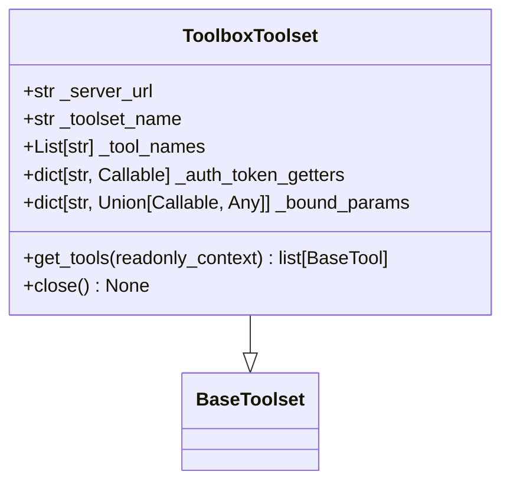

**Diagram sources**
- [toolbox_toolset.py](file://src/google/adk/tools/toolbox_toolset.py#L31-L108)

**Section sources**
- [toolbox_toolset.py](file://src/google/adk/tools/toolbox_toolset.py#L31-L108)

## Custom Tool Development

Developing custom tools in ADK involves extending the base tool classes and implementing the required methods. The system provides several base classes to simplify common tool development patterns.

### Creating Custom Tools
To create a custom tool, extend the `BaseTool` class and implement the `run_async` method. For tools that require authentication, extend `BaseAuthenticatedTool` instead.

```python
class MyCustomTool(BaseTool):
    def __init__(self):
        super().__init__(
            name="my_custom_tool",
            description="A custom tool that performs a specific task"
        )
    
    async def run_async(self, *, args: dict[str, Any], tool_context: ToolContext) -> Any:
        # Implement tool logic here
        pass
```

### Tool Registration
Custom tools can be registered through configuration files or programmatically. In YAML configuration:

```yaml
tools:
  - name: my_package.my_module.MyCustomTool
    args:
      param1: value1
      param2: value2
```

## Error Handling and Authentication

The ADK tool system provides comprehensive error handling and authentication mechanisms to ensure robust tool execution and secure access to external resources.

### Error Handling
The system implements structured error handling with specific error types and recovery mechanisms. Tools should return error objects with descriptive messages when validation fails or exceptions occur.

### Authentication
The authentication system is built around the `BaseAuthenticatedTool` class, which provides a standardized interface for handling authentication requirements. Tools can specify their authentication configuration and handle credential requests and responses.

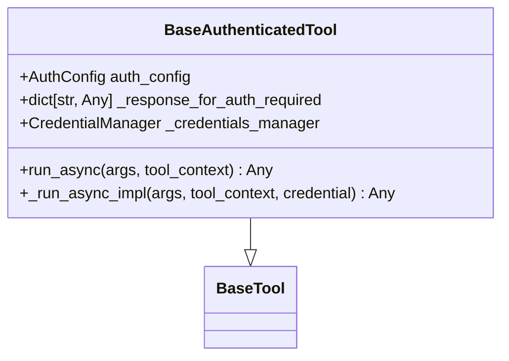

**Diagram sources**
- [base_authenticated_tool.py](file://src/google/adk/tools/base_authenticated_tool.py#L36-L108)

**Section sources**
- [base_authenticated_tool.py](file://src/google/adk/tools/base_authenticated_tool.py#L36-L108)

## Tool Context and State Management

The `ToolContext` class provides essential context and state management capabilities for tool execution, including access to invocation context, event actions, and memory services.

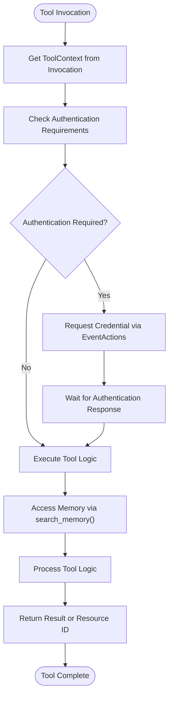

**Diagram sources**
- [tool_context.py](file://src/google/adk/tools/tool_context.py#L31-L81)

**Section sources**
- [tool_context.py](file://src/google/adk/tools/tool_context.py#L31-L81)