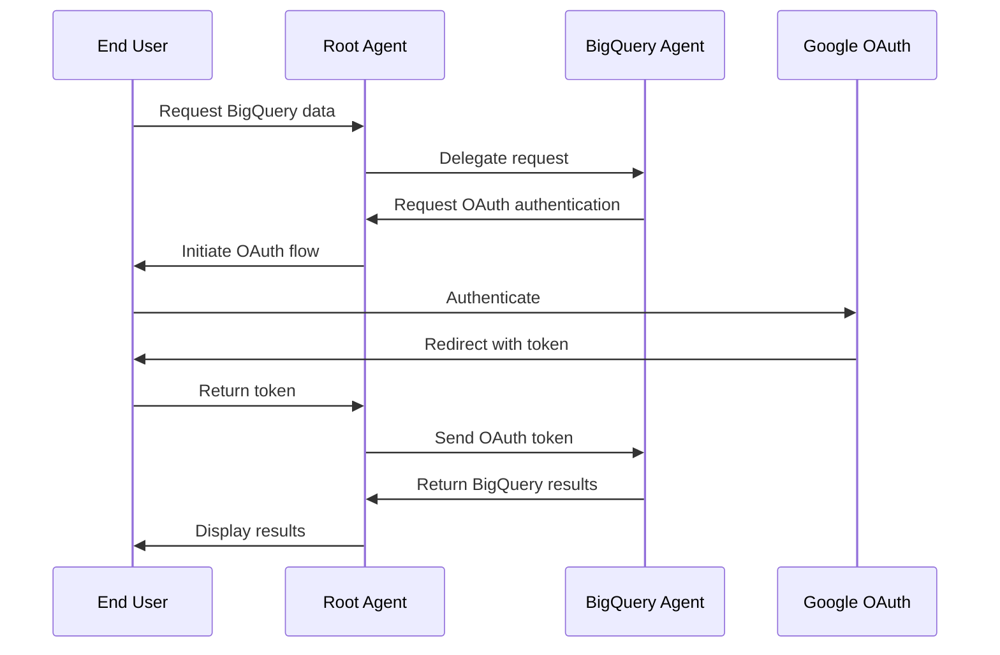
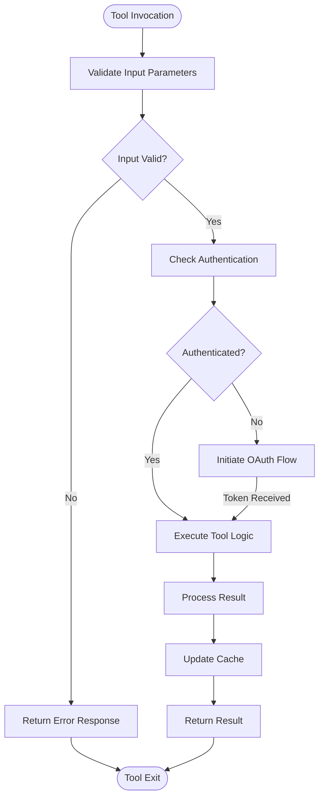

# Advanced Features

<cite>
**Referenced Files in This Document**   
- [a2a_agent_executor.py](file://src/google/adk/a2a/executor/a2a_agent_executor.py)
- [base_plugin.py](file://src/google/adk/plugins/base_plugin.py)
- [plugin_manager.py](file://src/google/adk/plugins/plugin_manager.py)
- [auth_handler.py](file://src/google/adk/auth/auth_handler.py)
- [auth_tool.py](file://src/google/adk/auth/auth_tool.py)
- [live_request_queue.py](file://src/google/adk/agents/live_request_queue.py)
- [active_streaming_tool.py](file://src/google/adk/agents/active_streaming_tool.py)
- [a2a_basic/README.md](file://contributing/samples/a2a_basic/README.md)
- [a2a_auth/README.md](file://contributing/samples/a2a_auth/README.md)
- [plugin_basic/README.md](file://contributing/samples/plugin_basic/README.md)
- [live_bidi_streaming_single_agent/readme.md](file://contributing/samples/live_bidi_streaming_single_agent/readme.md)
</cite>

## Table of Contents
1. [Introduction](#introduction)
2. [Agent2Agent (A2A) Protocol](#agent2agent-a2a-protocol)
3. [Plugin System Architecture](#plugin-system-architecture)
4. [Custom Authentication Mechanisms](#custom-authentication-mechanisms)
5. [Advanced Tool Patterns](#advanced-tool-patterns)
6. [Live Streaming Agent Integration](#live-streaming-agent-integration)
7. [Implementation Guidance](#implementation-guidance)
8. [Complexity Considerations](#complexity-considerations)
9. [Best Practices](#best-practices)

## Introduction
The ADK framework provides advanced capabilities for building sophisticated agent systems through its extensible architecture. This document explores the framework's advanced features, focusing on the Agent2Agent (A2A) protocol for distributed agent communication, the plugin system for extending functionality, custom authentication mechanisms, advanced tool patterns, and live streaming integration. These features enable developers to create complex, scalable agent applications while maintaining separation of concerns and extensibility.

## Agent2Agent (A2A) Protocol
The Agent2Agent (A2A) protocol enables communication between distributed agents, allowing for complex orchestration of specialized agents across different services. The protocol facilitates both local sub-agent integration and remote agent communication through a standardized interface.

The A2A architecture follows a delegation pattern where a root agent orchestrates tasks among specialized sub-agents. Local agents handle tasks within the same process, while remote agents communicate via HTTP endpoints. The protocol supports task delegation, result aggregation, and error handling across agent boundaries.

```mermaid
graph TB
RootAgent[Root Agent] --> |Delegates| RollAgent[Roll Agent<br>(Local)]
RootAgent --> |Delegates| PrimeAgent[Prime Agent<br>(Remote A2A)]
PrimeAgent --> |HTTP| A2AServer[A2A Server<br>localhost:8001]
style RootAgent fill:#4CAF50,stroke:#388E3C
style RollAgent fill:#2196F3,stroke:#1976D2
style PrimeAgent fill:#FF9800,stroke:#F57C00
style A2AServer fill:#9C27B0,stroke:#7B1FA2
```

**Diagram sources**
- [a2a_agent_executor.py](file://src/google/adk/a2a/executor/a2a_agent_executor.py#L71-L293)
- [a2a_basic/README.md](file://contributing/samples/a2a_basic/README.md#L15-L22)

The A2A protocol implementation centers around the `A2aAgentExecutor` class, which handles the execution of A2A requests and publishes updates to an event queue. The executor converts A2A requests to ADK run arguments, manages session state, and processes events through the task result aggregator. This architecture enables seamless integration between local and remote agents while maintaining consistent error handling and state management.

**Section sources**
- [a2a_agent_executor.py](file://src/google/adk/a2a/executor/a2a_agent_executor.py#L71-L293)
- [a2a_basic/README.md](file://contributing/samples/a2a_basic/README.md#L1-L154)

## Plugin System Architecture
The plugin system provides a structured mechanism for extending agent behavior globally across all agents managed by a runner. Unlike agent-specific callbacks, plugins apply to all agents and tools within a runner instance, enabling horizontal features like logging, monitoring, caching, and policy enforcement.

Plugins are implemented by extending the `BasePlugin` class and overriding specific callback methods that correspond to key execution points in the agent lifecycle. The plugin manager orchestrates the execution of plugin callbacks in registration order, with support for early exit when a plugin returns a non-None value.

```mermaid
classDiagram
class BasePlugin {
+name : str
+on_user_message_callback()
+before_run_callback()
+after_run_callback()
+on_event_callback()
+before_agent_callback()
+after_agent_callback()
+before_model_callback()
+after_model_callback()
+on_model_error_callback()
+before_tool_callback()
+after_tool_callback()
+on_tool_error_callback()
}
class PluginManager {
-plugins : List[BasePlugin]
+register_plugin(plugin)
+get_plugin(name)
+run_on_user_message_callback()
+run_before_run_callback()
+run_after_run_callback()
+run_on_event_callback()
+run_before_agent_callback()
+run_after_agent_callback()
+run_before_model_callback()
+run_after_model_callback()
+run_on_model_error_callback()
+run_before_tool_callback()
+run_after_tool_callback()
+run_on_tool_error_callback()
}
PluginManager --> BasePlugin : "manages"
BasePlugin <|-- CustomPlugin : "extends"
note right of BasePlugin
Base class for creating plugins that
intercept and modify agent, tool, and
LLM behaviors at critical execution points.
end
note right of PluginManager
Manages registration and execution of
plugins, ensuring they are called in
registration order with early exit support.
end
```

**Diagram sources**
- [base_plugin.py](file://src/google/adk/plugins/base_plugin.py#L41-L368)
- [plugin_manager.py](file://src/google/adk/plugins/plugin_manager.py#L58-L300)

The execution order of plugins takes precedence over agent callbacks, allowing plugins to short-circuit remaining plugins and agent callbacks when returning a value. This enables powerful patterns like policy enforcement, where a plugin can prevent unauthorized tool usage by returning an error response. Plugins can modify input parameters such as agent input, tool input, and LLM requests, with changes propagating through the callback chain.

**Section sources**
- [base_plugin.py](file://src/google/adk/plugins/base_plugin.py#L41-L368)
- [plugin_manager.py](file://src/google/adk/plugins/plugin_manager.py#L58-L300)
- [plugin_basic/README.md](file://contributing/samples/plugin_basic/README.md#L1-L58)

## Custom Authentication Mechanisms
The ADK framework provides robust support for implementing custom authentication mechanisms, particularly for OAuth-based workflows. The authentication system is designed to handle complex scenarios where remote agents require access to protected resources on behalf of end users.

The authentication architecture centers around the `AuthHandler` class, which manages the OAuth flow by coordinating between the agent, end user, and authentication provider. When a remote agent requires authenticated access to a service, it can surface an OAuth request that is handled by the local agent, guiding the user through the authentication process.



**Diagram sources**
- [auth_handler.py](file://src/google/adk/auth/auth_handler.py#L38-L199)
- [auth_tool.py](file://src/google/adk/auth/auth_tool.py#L26-L101)
- [a2a_auth/README.md](file://contributing/samples/a2a_auth/README.md#L15-L22)

The authentication workflow follows a standardized pattern: the remote agent checks for valid credentials, surfaces an authentication request if needed, the local agent guides the user through the OAuth flow, and the resulting token is securely exchanged between agents. This architecture enables secure access to protected resources while maintaining a seamless user experience.

**Section sources**
- [auth_handler.py](file://src/google/adk/auth/auth_handler.py#L38-L199)
- [auth_tool.py](file://src/google/adk/auth/auth_tool.py#L26-L101)
- [a2a_auth/README.md](file://contributing/samples/a2a_auth/README.md#L1-L217)

## Advanced Tool Patterns
The ADK framework supports advanced tool patterns that extend beyond simple function calls. These patterns include long-running tools, authenticated tools, and tools that require complex parameter handling. The framework provides mechanisms for managing tool state, handling asynchronous execution, and integrating with external systems.

Advanced tools can implement sophisticated behaviors such as streaming input/output, progress reporting, and cancellation. The framework supports tools that maintain state across multiple invocations and tools that require initialization or cleanup operations. These capabilities enable the creation of powerful tools that can handle complex workflows and integrate with external services.



**Diagram sources**
- [base_plugin.py](file://src/google/adk/plugins/base_plugin.py#L292-L368)
- [auth_tool.py](file://src/google/adk/auth/auth_tool.py#L26-L101)

The framework's tool system supports various advanced patterns including authenticated tools that require OAuth tokens, long-running tools that can be paused and resumed, and tools that integrate with external APIs. These patterns enable the creation of sophisticated agent capabilities that can interact with complex external systems while maintaining security and reliability.

**Section sources**
- [base_plugin.py](file://src/google/adk/plugins/base_plugin.py#L292-L368)
- [auth_tool.py](file://src/google/adk/auth/auth_tool.py#L26-L101)

## Live Streaming Agent Integration
The ADK framework provides comprehensive support for live streaming agents that can process real-time audio and video input. The streaming architecture is designed for bidirectional communication, allowing agents to receive continuous input streams and provide real-time responses.

The streaming system is built around the `LiveRequestQueue` class, which manages the flow of streaming requests and responses. The queue handles various types of streaming data including content, blobs, and activity signals, enabling agents to process both turn-by-turn and real-time input modes.

```mermaid
classDiagram
class LiveRequest {
+content : Optional[types.Content]
+blob : Optional[types.Blob]
+activity_start : Optional[types.ActivityStart]
+activity_end : Optional[types.ActivityEnd]
+close : bool
+model_config : ConfigDict
}
class LiveRequestQueue {
-_queue : asyncio.Queue
+close()
+send_content(content)
+send_realtime(blob)
+send_activity_start()
+send_activity_end()
+send(req)
+get() : LiveRequest
}
class ActiveStreamingTool {
+task : Optional[asyncio.Task]
+stream : Optional[LiveRequestQueue]
+model_config : ConfigDict
}
LiveRequestQueue --> LiveRequest : "contains"
ActiveStreamingTool --> LiveRequestQueue : "uses"
note right of LiveRequest
Represents a request sent to live agents,
supporting various types of streaming data.
end
note right of LiveRequestQueue
Manages the queue of live requests,
providing methods to send different
types of streaming data.
end
note right of ActiveStreamingTool
Manages streaming tool resources
during invocation, including the
active task and stream.
end
```

**Diagram sources**
- [live_request_queue.py](file://src/google/adk/agents/live_request_queue.py#L26-L81)
- [active_streaming_tool.py](file://src/google/adk/agents/active_streaming_tool.py#L26-L40)
- [live_bidi_streaming_single_agent/readme.md](file://contributing/samples/live_bidi_streaming_single_agent/readme.md#L1-L38)

The streaming integration pattern follows a standardized workflow: the agent receives streaming input through the live request queue, processes the input in real-time, and provides continuous responses. This architecture enables applications such as voice assistants, video analysis systems, and real-time collaboration tools that require low-latency interaction.

**Section sources**
- [live_request_queue.py](file://src/google/adk/agents/live_request_queue.py#L26-L81)
- [active_streaming_tool.py](file://src/google/adk/agents/active_streaming_tool.py#L26-L40)
- [live_bidi_streaming_single_agent/readme.md](file://contributing/samples/live_bidi_streaming_single_agent/readme.md#L1-L38)

## Implementation Guidance
When implementing advanced features in the ADK framework, consider the architectural requirements and use cases for each pattern. The following guidance helps determine when to use specific advanced features:

For distributed agent systems, use the A2A protocol when you need to:
- Separate concerns between specialized agents
- Scale specific agent capabilities independently
- Integrate with external agent services
- Implement microservices-style agent architecture

For cross-cutting concerns, use the plugin system when you need to:
- Implement global logging and monitoring
- Enforce security policies across all agents
- Add caching mechanisms for LLM or tool calls
- Collect metrics and analytics
- Modify requests and responses globally

For secure resource access, implement custom authentication when you need to:
- Access protected APIs on behalf of users
- Handle OAuth flows for Google Cloud services
- Manage user credentials securely
- Implement multi-tenant authentication

For real-time applications, use live streaming when you need to:
- Process continuous audio or video input
- Provide real-time responses
- Build voice or video assistants
- Implement low-latency interaction patterns

**Section sources**
- [a2a_basic/README.md](file://contributing/samples/a2a_basic/README.md#L1-L154)
- [a2a_auth/README.md](file://contributing/samples/a2a_auth/README.md#L1-L217)
- [plugin_basic/README.md](file://contributing/samples/plugin_basic/README.md#L1-L58)
- [live_bidi_streaming_single_agent/readme.md](file://contributing/samples/live_bidi_streaming_single_agent/readme.md#L1-L38)

## Complexity Considerations
Implementing advanced patterns introduces additional complexity that must be carefully managed. The following considerations help maintain system stability and reliability:

Distributed agent systems increase operational complexity due to network dependencies, requiring robust error handling and fallback mechanisms. Monitor network latency and implement appropriate timeouts to prevent cascading failures.

Plugin systems can impact performance if not implemented efficiently, particularly when multiple plugins process every request. Optimize plugin logic and consider caching to minimize overhead. Be cautious with early exit patterns that might bypass important processing steps.

Authentication workflows add user interaction complexity and potential failure points. Implement proper error handling for authentication failures and provide clear user guidance. Manage token expiration and refresh mechanisms to maintain seamless user experiences.

Streaming applications require careful resource management to handle continuous data flow. Implement proper backpressure mechanisms and monitor memory usage to prevent resource exhaustion. Design for graceful degradation when processing capacity is exceeded.

**Section sources**
- [a2a_agent_executor.py](file://src/google/adk/a2a/executor/a2a_agent_executor.py#L71-L293)
- [plugin_manager.py](file://src/google/adk/plugins/plugin_manager.py#L58-L300)
- [auth_handler.py](file://src/google/adk/auth/auth_handler.py#L38-L199)
- [live_request_queue.py](file://src/google/adk/agents/live_request_queue.py#L26-L81)

## Best Practices
To maintain system stability when implementing advanced patterns, follow these best practices:

For A2A implementations:
- Use clear and consistent agent naming conventions
- Implement comprehensive error handling and fallback mechanisms
- Monitor inter-agent communication latency
- Document agent responsibilities and interfaces clearly
- Use versioning for agent APIs to support evolution

For plugin development:
- Keep plugin logic focused and single-purpose
- Implement proper error handling within plugins
- Avoid blocking operations in synchronous callbacks
- Use asynchronous methods when performing I/O operations
- Test plugins thoroughly in isolation and integration

For authentication:
- Store credentials securely using appropriate services
- Implement token refresh mechanisms before expiration
- Provide clear error messages for authentication failures
- Follow security best practices for OAuth implementation
- Audit authentication events for security monitoring

For streaming applications:
- Implement proper resource cleanup in error conditions
- Use backpressure mechanisms to handle data flow
- Monitor memory usage and implement limits
- Design for graceful degradation under load
- Test with realistic data volumes and patterns

**Section sources**
- [a2a_agent_executor.py](file://src/google/adk/a2a/executor/a2a_agent_executor.py#L71-L293)
- [plugin_manager.py](file://src/google/adk/plugins/plugin_manager.py#L58-L300)
- [auth_handler.py](file://src/google/adk/auth/auth_handler.py#L38-L199)
- [live_request_queue.py](file://src/google/adk/agents/live_request_queue.py#L26-L81)