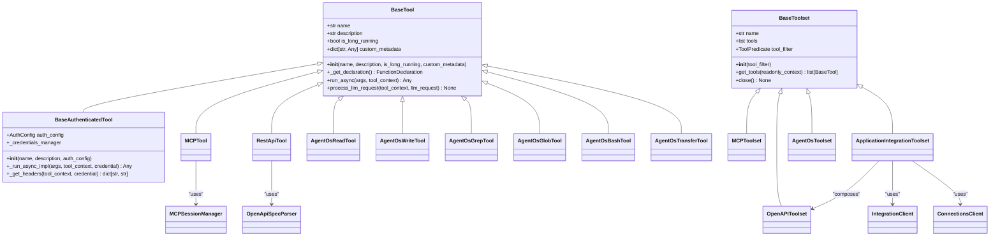
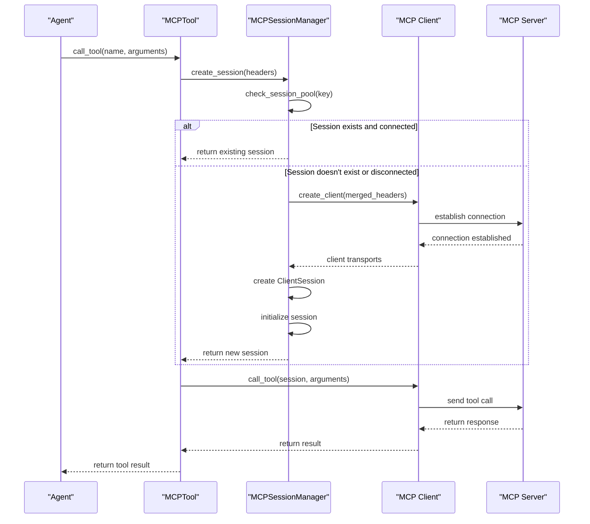
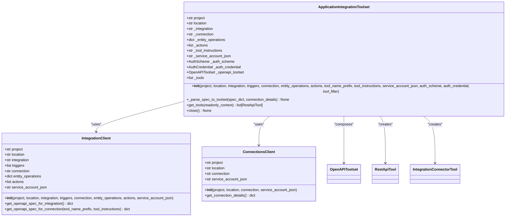
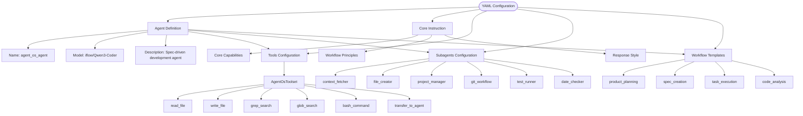
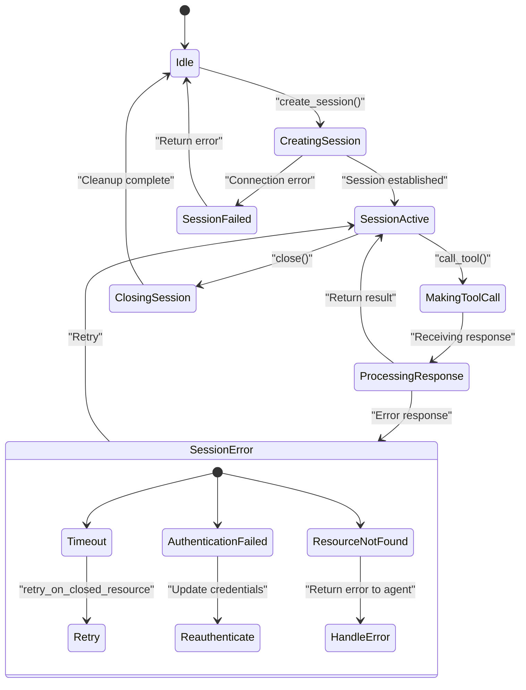
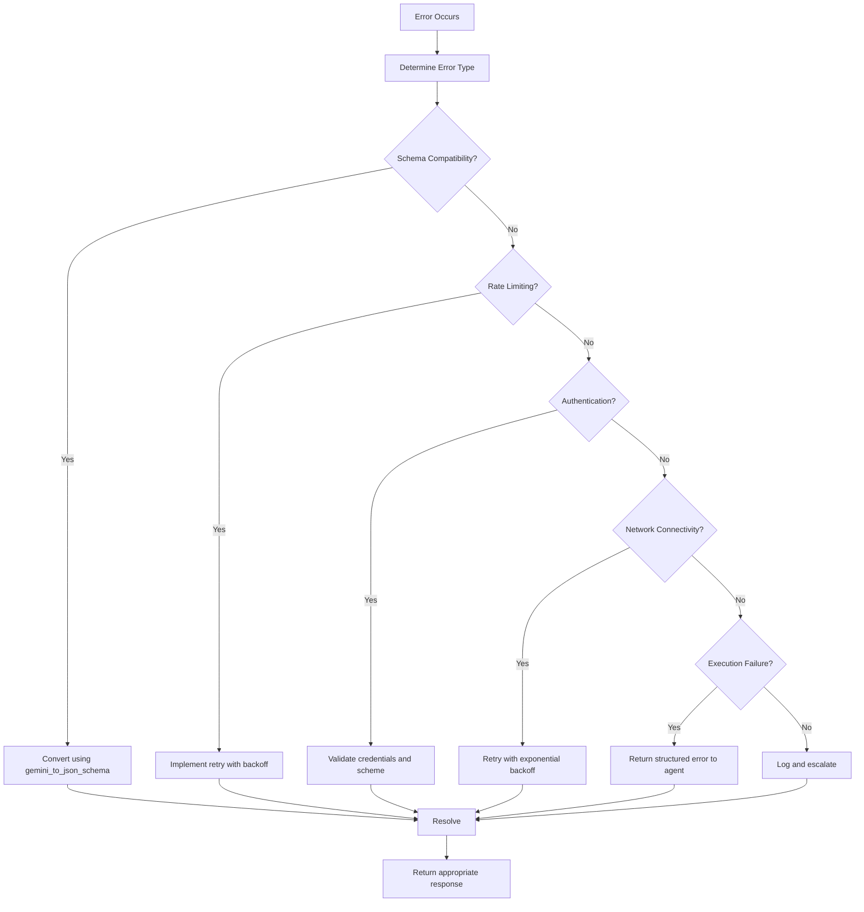

# Advanced Tool Patterns

<cite>
**Referenced Files in This Document**   
- [mcp_tool.py](file://src/google/adk/tools/mcp_tool/mcp_tool.py)
- [mcp_session_manager.py](file://src/google/adk/tools/mcp_tool/mcp_session_manager.py)
- [openapi_spec_parser.py](file://src/google/adk/tools/openapi_tool/openapi_spec_parser/openapi_spec_parser.py)
- [application_integration_toolset.py](file://src/google/adk/tools/application_integration_tool/application_integration_toolset.py)
- [agent_os_tools.py](file://contributing/samples/agent_os_integration/agent_os_tools.py)
- [root_agent.yaml](file://contributing/samples/agent_os_integration/yaml/root_agent.yaml)
- [base_tool.py](file://src/google/adk/tools/base_tool.py)
</cite>

## Table of Contents
1. [Introduction](#introduction)
2. [Core Tool System Architecture](#core-tool-system-architecture)
3. [MCP Tool Implementation](#mcp-tool-implementation)
4. [OpenAPI-Based Tools](#openapi-based-tools)
5. [Application Integration Tools](#application-integration-tools)
6. [Agent OS Integration and YAML Configuration](#agent-os-integration-and-yaml-configuration)
7. [State Management and Long-Running Operations](#state-management-and-long-running-operations)
8. [Error Handling and Common Issues](#error-handling-and-common-issues)
9. [Conclusion](#conclusion)

## Introduction

This document provides a comprehensive analysis of advanced tool patterns within the ADK (Agent Development Kit) framework, focusing on complex tool integrations and compositions. The analysis covers three primary categories of advanced tools: Model Context Protocol (MCP) tools, OpenAPI-based tools, and application integration tools. These tools enable sophisticated agent capabilities by facilitating complex data exchange, maintaining state across calls, and integrating with external systems.

The document examines the implementation details of these advanced tools, their relationship with the core tool system, and how they handle initialization, execution, and error management. Special attention is given to the Agent OS integration, which demonstrates how YAML-based agent configurations enable sophisticated tool orchestration. The analysis also addresses common challenges such as schema compatibility, rate limiting, and state management in long-running tool executions, providing proven solutions for each scenario.

**Section sources**
- [mcp_tool.py](file://src/google/adk/tools/mcp_tool/mcp_tool.py)
- [application_integration_toolset.py](file://src/google/adk/tools/application_integration_tool/application_integration_toolset.py)
- [agent_os_tools.py](file://contributing/samples/agent_os_integration/agent_os_tools.py)

## Core Tool System Architecture

The ADK framework implements a hierarchical tool system architecture that enables flexible and extensible tool integration. At the foundation of this architecture is the `BaseTool` class, which serves as the abstract base class for all tools within the system. This class defines essential properties and methods that all tools must implement, including name, description, and execution logic.

The tool system follows a composition pattern where individual tools are organized into toolsets, which are collections of related tools that can be managed as a single unit. Toolsets implement the `BaseToolset` interface and provide methods for retrieving and managing their constituent tools. This architecture enables modular tool development and deployment, allowing developers to create specialized tool collections for specific use cases.

The tool execution lifecycle is managed through a standardized interface that includes initialization, execution, and cleanup phases. Each tool implements the `run_async` method, which defines the asynchronous execution logic, and the `_get_declaration` method, which provides the function signature for LLM (Large Language Model) integration. The system also supports tool filtering through the `ToolPredicate` mechanism, allowing selective exposure of tools based on specific criteria.



**Diagram sources **
- [base_tool.py](file://src/google/adk/tools/base_tool.py)
- [mcp_tool.py](file://src/google/adk/tools/mcp_tool/mcp_tool.py)
- [openapi_spec_parser.py](file://src/google/adk/tools/openapi_tool/openapi_spec_parser/openapi_spec_parser.py)
- [application_integration_toolset.py](file://src/google/adk/tools/application_integration_tool/application_integration_toolset.py)
- [agent_os_tools.py](file://contributing/samples/agent_os_integration/agent_os_tools.py)

**Section sources**
- [base_tool.py](file://src/google/adk/tools/base_tool.py)
- [mcp_tool.py](file://src/google/adk/tools/mcp_tool/mcp_tool.py)
- [openapi_spec_parser.py](file://src/google/adk/tools/openapi_tool/openapi_spec_parser/openapi_spec_parser.py)

## MCP Tool Implementation

The Model Context Protocol (MCP) tool implementation provides a bridge between the ADK framework and external MCP servers, enabling agents to leverage capabilities exposed through the MCP standard. The `MCPTool` class extends `BaseAuthenticatedTool` and wraps an MCP tool interface, using a session manager to communicate with the MCP server.

The MCP tool initialization requires several key components: the MCP tool definition, a session manager instance, and optional authentication configuration. The session manager handles the creation and management of MCP client sessions, supporting different connection protocols including Stdio, Server-Sent Events (SSE), and Streamable HTTP. This flexibility allows the tool to integrate with various MCP server implementations and deployment scenarios.

A critical aspect of the MCP tool implementation is its session management strategy. The `MCPSessionManager` class implements a session pooling mechanism that reuses existing sessions when possible, improving performance and reducing connection overhead. The session manager generates unique session keys based on connection parameters and authentication headers, ensuring that sessions are properly isolated when different authentication contexts are used.



**Diagram sources **
- [mcp_tool.py](file://src/google/adk/tools/mcp_tool/mcp_tool.py)
- [mcp_session_manager.py](file://src/google/adk/tools/mcp_tool/mcp_session_manager.py)

**Section sources**
- [mcp_tool.py](file://src/google/adk/tools/mcp_tool/mcp_tool.py)
- [mcp_session_manager.py](file://src/google/adk/tools/mcp_tool/mcp_session_manager.py)

## OpenAPI-Based Tools

OpenAPI-based tools in the ADK framework provide a mechanism for integrating RESTful APIs as agent tools. The implementation centers around the `OpenAPIToolset` class, which parses OpenAPI specifications and generates corresponding tools for each API operation. This approach enables automatic tool creation from standardized API documentation, reducing the manual effort required to integrate external services.

The tool generation process begins with the `OpenApiSpecParser`, which processes the OpenAPI specification document and extracts operation details. The parser resolves JSON references, handles circular dependencies, and normalizes the specification structure. For each operation, it creates a `ParsedOperation` object containing the operation name, description, endpoint information, parameters, and return value schema.

The generated tools implement the `RestApiTool` class, which handles the actual API calls. These tools convert LLM-provided arguments into appropriate HTTP requests, manage authentication headers, and process the API responses. The implementation supports various authentication schemes defined in the OpenAPI specification, including API keys, OAuth2, and HTTP authentication.

```mermaid
flowchart TD
Start([OpenAPI Specification]) --> ParseSpec["Parse OpenAPI Specification"]
ParseSpec --> ResolveRefs["Resolve $ref References"]
ResolveRefs --> CollectOps["Collect Operations"]
CollectOps --> CreateTools["Create RestApiTool Instances"]
CreateTools --> ConfigureAuth["Configure Authentication"]
ConfigureAuth --> RegisterTools["Register Tools with Agent"]
subgraph Tool Execution
AgentCall["Agent calls tool with arguments"] --> ValidateArgs["Validate Arguments"]
ValidateArgs --> BuildRequest["Build HTTP Request"]
BuildRequest --> AddAuth["Add Authentication Headers"]
AddAuth --> SendRequest["Send HTTP Request"]
SendRequest --> ProcessResponse["Process API Response"]
ProcessResponse --> ReturnResult["Return Result to Agent"]
end
RegisterTools --> Tool Execution
```

**Diagram sources **
- [openapi_spec_parser.py](file://src/google/adk/tools/openapi_tool/openapi_spec_parser/openapi_spec_parser.py)
- [application_integration_toolset.py](file://src/google/adk/tools/application_integration_tool/application_integration_toolset.py)

**Section sources**
- [openapi_spec_parser.py](file://src/google/adk/tools/openapi_tool/openapi_spec_parser/openapi_spec_parser.py)
- [application_integration_toolset.py](file://src/google/adk/tools/application_integration_tool/application_integration_toolset.py)

## Application Integration Tools

Application integration tools provide a specialized mechanism for connecting agents with external applications through Google Cloud's Integration Connectors. The `ApplicationIntegrationToolset` class serves as the primary interface for this functionality, enabling agents to interact with various SaaS applications and enterprise systems.

The implementation supports two primary integration patterns: direct integration with Application Integration resources and connection-based integration with Integration Connectors. For Application Integration, the toolset uses API triggers to expose integration workflows as tools. For Integration Connectors, it leverages entity operations and actions defined in the connector configuration to generate appropriate tools.

A key feature of the application integration tools is their dynamic OpenAPI specification generation. When initializing the toolset, the system retrieves the OpenAPI specification from the integration or connector resource, then parses it to create the corresponding tools. This approach ensures that the tools always reflect the current capabilities of the integrated application.

The toolset also implements sophisticated authentication handling, supporting service account credentials and various authentication schemes. It includes logic to handle cases where authentication override is disabled in the connection configuration, providing appropriate warnings when provided credentials cannot be used.



**Diagram sources **
- [application_integration_toolset.py](file://src/google/adk/tools/application_integration_tool/application_integration_toolset.py)

**Section sources**
- [application_integration_toolset.py](file://src/google/adk/tools/application_integration_tool/application_integration_toolset.py)

## Agent OS Integration and YAML Configuration

The Agent OS integration demonstrates a sophisticated pattern of tool orchestration through YAML-based configuration. This approach enables declarative definition of agent behavior, tool composition, and workflow management, providing a powerful mechanism for creating specialized agents with complex capabilities.

The integration is centered around the `AgentOsToolset` class, which provides a collection of tools specifically designed for Agent OS workflows. These tools include file operations (read, write), search capabilities (grep, glob), system command execution (bash), and agent transfer functionality. The toolset is designed to support spec-driven development workflows, enabling agents to navigate project structures, search for code patterns, and execute system commands as needed.

The YAML configuration file defines the complete agent setup, including model selection, instructions, tools, subagents, and workflow templates. This declarative approach allows for easy customization and version control of agent configurations. The configuration supports environment variable interpolation, enabling dynamic configuration based on runtime conditions.



**Diagram sources **
- [root_agent.yaml](file://contributing/samples/agent_os_integration/yaml/root_agent.yaml)
- [agent_os_tools.py](file://contributing/samples/agent_os_integration/agent_os_tools.py)

**Section sources**
- [root_agent.yaml](file://contributing/samples/agent_os_integration/yaml/root_agent.yaml)
- [agent_os_tools.py](file://contributing/samples/agent_os_integration/agent_os_tools.py)

## State Management and Long-Running Operations

The ADK framework implements sophisticated state management mechanisms to handle long-running operations and maintain context across tool calls. This capability is essential for complex workflows that require multiple steps or extended execution times.

For MCP tools, state management is handled through the `MCPSessionManager`, which maintains persistent connections to MCP servers. The session manager implements connection pooling based on authentication headers, allowing efficient reuse of established connections. It also includes automatic retry logic for handling closed resources, ensuring reliable operation even in unstable network conditions.

The framework supports long-running operations through the `is_long_running` property in the `BaseTool` class. Tools that perform extended operations can set this flag to indicate their nature, allowing the agent system to handle them appropriately. This includes providing progress updates, managing timeouts, and handling intermediate results.

For application integration tools, state management is particularly important when dealing with asynchronous operations. The system provides mechanisms for polling operation status and retrieving results when available. This pattern enables integration with services that use job-based processing models, where immediate results are not available.



**Diagram sources **
- [mcp_session_manager.py](file://src/google/adk/tools/mcp_tool/mcp_session_manager.py)
- [base_tool.py](file://src/google/adk/tools/base_tool.py)

**Section sources**
- [mcp_session_manager.py](file://src/google/adk/tools/mcp_tool/mcp_session_manager.py)
- [base_tool.py](file://src/google/adk/tools/base_tool.py)

## Error Handling and Common Issues

The ADK framework implements comprehensive error handling strategies to address common issues encountered in advanced tool integrations. These strategies cover schema compatibility, rate limiting, authentication problems, and network connectivity issues.

For schema compatibility, the framework includes robust JSON schema conversion utilities that handle differences between MCP tool schemas and Gemini function declarations. The `gemini_to_json_schema` function ensures that tool parameters are properly translated, maintaining type safety and validation rules across different systems.

Rate limiting is addressed through multiple mechanisms, including configurable timeouts, retry policies, and circuit breaker patterns. The MCP session manager implements retry logic for closed resources, while the application integration tools include timeout configuration for API calls. These features help prevent cascading failures and improve system resilience.

Authentication issues are handled through a layered approach that supports multiple authentication schemes and credential types. The framework distinguishes between different authentication methods (OAuth2, API keys, service accounts) and provides appropriate error handling for each. It also includes warnings when authentication override is disabled in connection configurations, helping developers identify potential issues.



**Diagram sources **
- [mcp_tool.py](file://src/google/adk/tools/mcp_tool/mcp_tool.py)
- [mcp_session_manager.py](file://src/google/adk/tools/mcp_tool/mcp_session_manager.py)
- [application_integration_toolset.py](file://src/google/adk/tools/application_integration_tool/application_integration_toolset.py)

**Section sources**
- [mcp_tool.py](file://src/google/adk/tools/mcp_tool/mcp_tool.py)
- [mcp_session_manager.py](file://src/google/adk/tools/mcp_tool/mcp_session_manager.py)
- [application_integration_toolset.py](file://src/google/adk/tools/application_integration_tool/application_integration_toolset.py)

## Conclusion

The advanced tool patterns implemented in the ADK framework demonstrate a sophisticated approach to agent tool integration and orchestration. By providing standardized interfaces for MCP tools, OpenAPI-based tools, and application integration tools, the framework enables seamless connectivity with diverse external systems and services.

The hierarchical tool architecture, with its clear separation between individual tools and toolsets, allows for flexible composition and management of capabilities. The implementation of session management, state preservation, and error handling mechanisms ensures reliable operation even in complex, long-running workflows.

The Agent OS integration serves as a compelling example of how YAML-based configuration can enable powerful tool orchestration, allowing developers to define specialized agents with rich capabilities through declarative configuration. This approach combines the flexibility of code-based tool development with the maintainability and version control benefits of configuration files.

These advanced tool patterns provide a solid foundation for building intelligent agents that can effectively interact with external systems, manage complex workflows, and maintain context across extended operations. The comprehensive error handling and state management strategies ensure robust operation in real-world scenarios, making the framework suitable for production-grade applications.