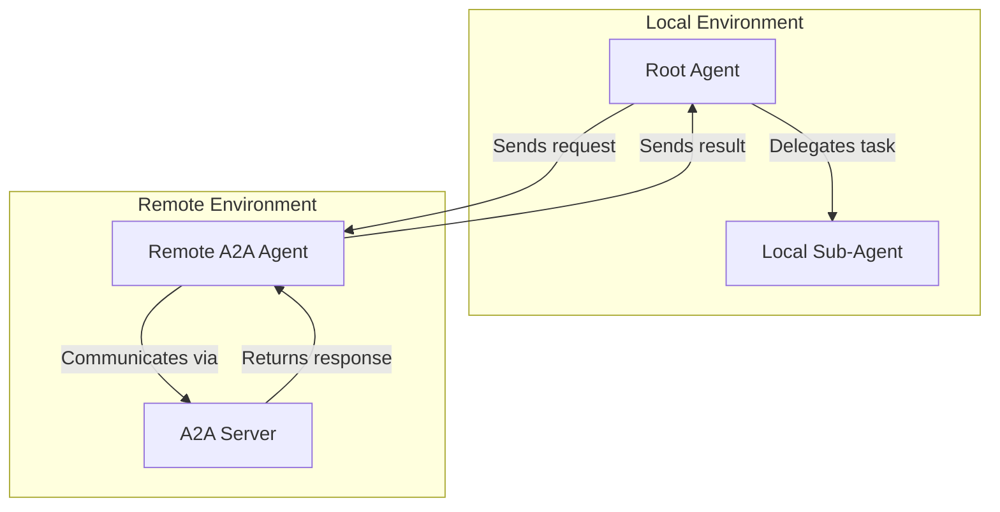
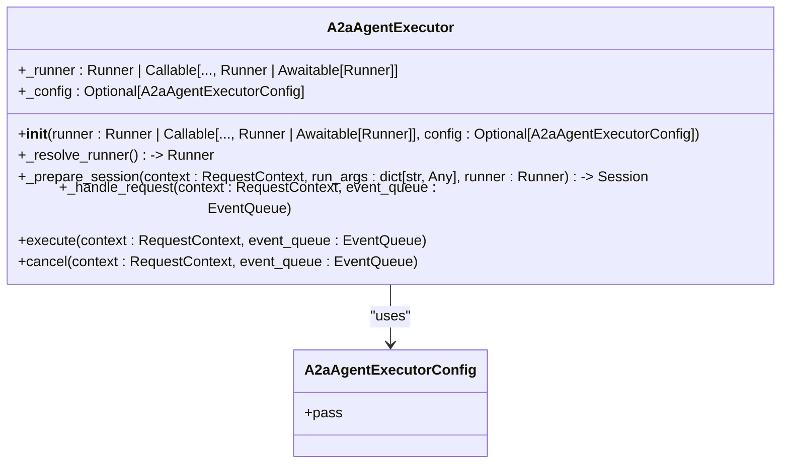
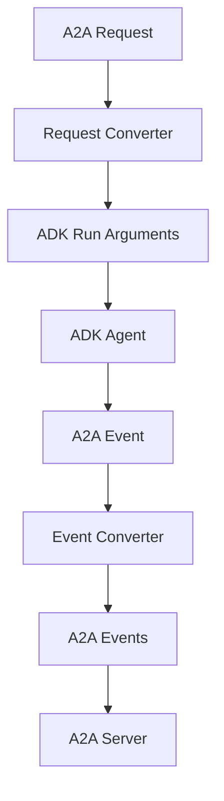
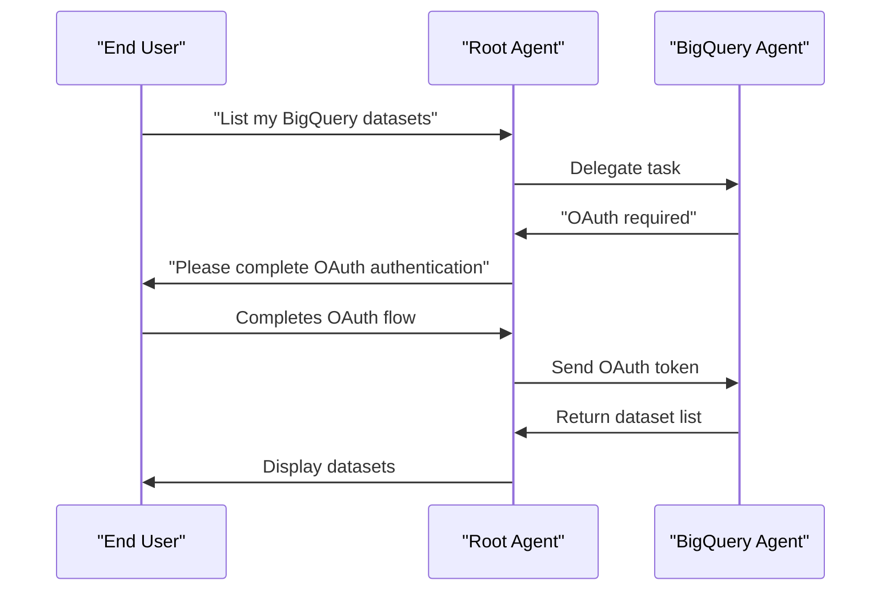
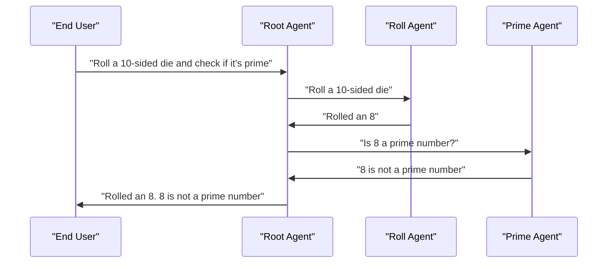
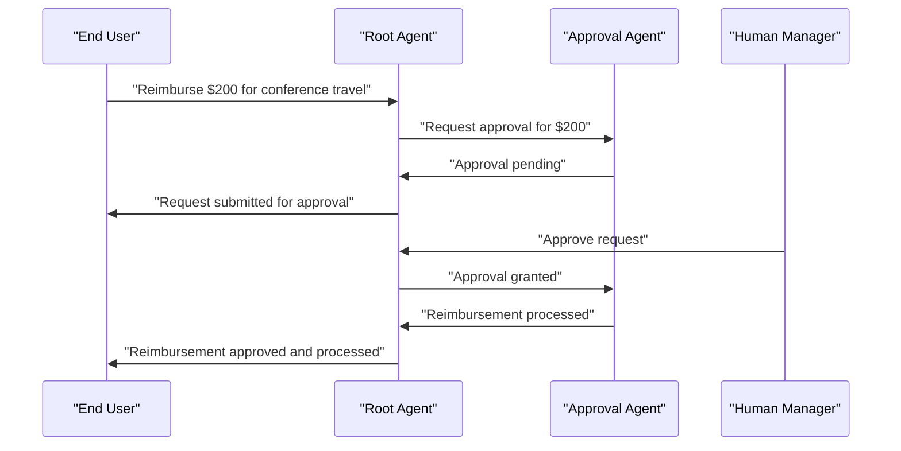
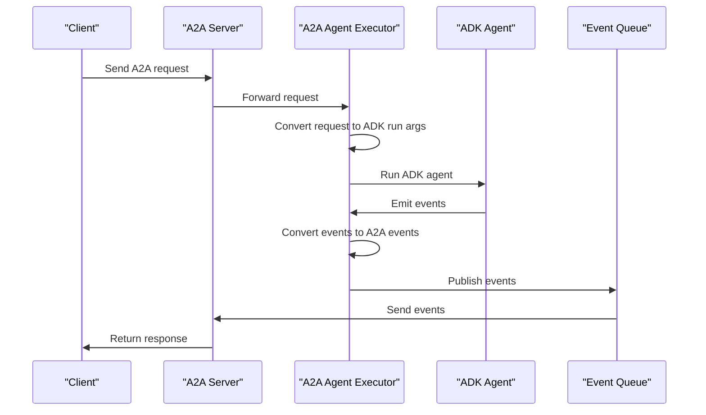
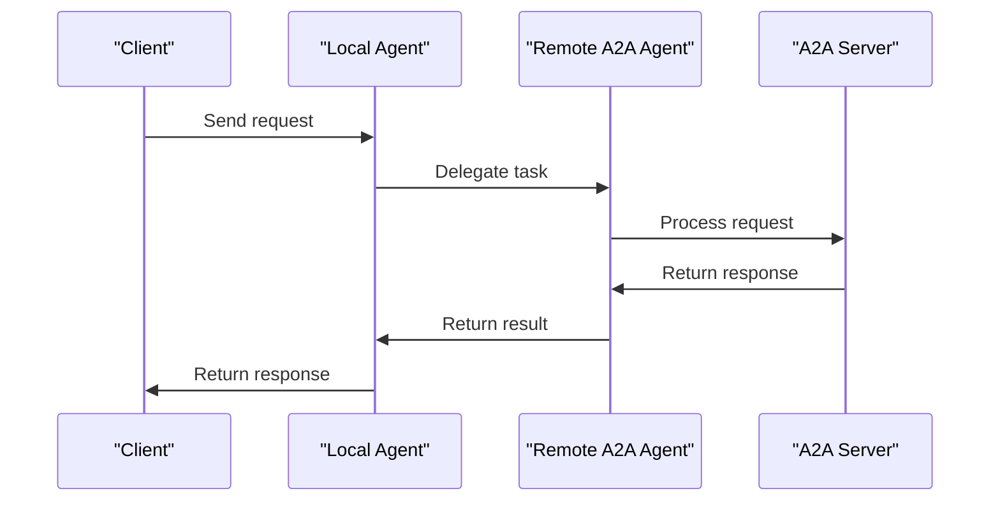

# Agent2Agent (A2A) Protocol

<cite>
**Referenced Files in This Document**   
- [a2a_agent_executor.py](file://src/google/adk/a2a/executor/a2a_agent_executor.py)
- [task_result_aggregator.py](file://src/google/adk/a2a/executor/task_result_aggregator.py)
- [event_converter.py](file://src/google/adk/a2a/converters/event_converter.py)
- [request_converter.py](file://src/google/adk/a2a/converters/request_converter.py)
- [part_converter.py](file://src/google/adk/a2a/converters/part_converter.py)
- [utils.py](file://src/google/adk/a2a/converters/utils.py)
- [agent_to_a2a.py](file://src/google/adk/a2a/utils/agent_to_a2a.py)
- [remote_a2a_agent.py](file://src/google/adk/agents/remote_a2a_agent.py)
- [agent.py](file://contributing/samples/a2a_auth/agent.py)
- [agent.py](file://contributing/samples/a2a_basic/agent.py)
- [agent.py](file://contributing/samples/a2a_human_in_loop/agent.py)
- [README.md](file://contributing/samples/a2a_auth/README.md)
- [README.md](file://contributing/samples/a2a_basic/README.md)
- [README.md](file://contributing/samples/a2a_human_in_loop/README.md)
</cite>

## Table of Contents
1. [Introduction](#introduction)
2. [A2A Protocol Architecture](#a2a-protocol-architecture)
3. [Core Components](#core-components)
4. [A2A Agent Executor](#a2a-agent-executor)
5. [Event Conversion and Request Handling](#event-conversion-and-request-handling)
6. [Task Result Aggregation](#task-result-aggregation)
7. [Practical Implementation Examples](#practical-implementation-examples)
8. [Data Flow and Sequence Diagrams](#data-flow-and-sequence-diagrams)
9. [Security Considerations](#security-considerations)
10. [Error Handling and Debugging](#error-handling-and-debugging)
11. [Conclusion](#conclusion)

## Introduction

The Agent2Agent (A2A) Protocol is a framework designed to enable distributed agent communication across different execution environments. It facilitates inter-agent messaging and coordination, allowing agents to work together seamlessly to accomplish complex tasks. The A2A protocol is particularly useful in scenarios where agents need to delegate tasks to other specialized agents, whether they are running locally or remotely.

The protocol is built on a robust architecture that includes event conversion, request handling, and task result aggregation. It enables agents to communicate through a standardized interface, making it easier to integrate and orchestrate multiple agents. The A2A protocol supports various use cases, including authentication workflows, basic agent-to-agent communication, and human-in-the-loop scenarios.

This document provides a comprehensive overview of the A2A protocol, detailing its architecture, core components, and practical implementation examples. It also covers security considerations, error handling, and debugging strategies for distributed agent interactions.

**Section sources**
- [README.md](file://contributing/samples/a2a_auth/README.md#L1-L217)
- [README.md](file://contributing/samples/a2a_basic/README.md#L1-L154)
- [README.md](file://contributing/samples/a2a_human_in_loop/README.md#L1-L168)

## A2A Protocol Architecture

The A2A protocol architecture is designed to facilitate seamless communication between agents, whether they are running locally or remotely. The architecture consists of several key components that work together to enable distributed agent interactions.

At the core of the A2A protocol is the A2A agent executor, which is responsible for running an ADK agent against an A2A request and publishing updates to an event queue. The executor handles the conversion of A2A requests to ADK run arguments, manages session state, and processes events from the agent run.

The protocol also includes a set of converters that handle the transformation of data between A2A and ADK formats. These converters ensure that messages, events, and parts are correctly formatted for both the A2A server and the ADK agent. The event converter, for example, converts ADK events to A2A events, while the request converter transforms A2A requests into ADK run arguments.

Another important component of the A2A protocol is the task result aggregator, which collects and processes task status updates from the agent run. The aggregator determines the final task state based on the events received and ensures that the appropriate status updates are published to the A2A server.

The A2A protocol supports various communication patterns, including direct agent-to-agent messaging, delegation of tasks to remote agents, and human-in-the-loop workflows. These patterns are enabled by the use of remote A2A agents, which can be configured to communicate with a separate A2A server.



**Diagram sources **
- [a2a_agent_executor.py](file://src/google/adk/a2a/executor/a2a_agent_executor.py#L72-L293)
- [remote_a2a_agent.py](file://src/google/adk/agents/remote_a2a_agent.py#L101-L545)

**Section sources**
- [a2a_agent_executor.py](file://src/google/adk/a2a/executor/a2a_agent_executor.py#L72-L293)
- [remote_a2a_agent.py](file://src/google/adk/agents/remote_a2a_agent.py#L101-L545)

## Core Components

The A2A protocol is built on several core components that enable distributed agent communication. These components include the A2A agent executor, event and request converters, task result aggregator, and remote A2A agent.

The A2A agent executor is responsible for executing A2A requests and managing the interaction between the A2A server and the ADK agent. It handles the conversion of A2A requests to ADK run arguments, manages session state, and processes events from the agent run. The executor also publishes task status updates to the A2A server, ensuring that the client is informed of the progress and outcome of the request.

The event and request converters are responsible for transforming data between A2A and ADK formats. The event converter converts ADK events to A2A events, while the request converter transforms A2A requests into ADK run arguments. These converters ensure that messages, events, and parts are correctly formatted for both the A2A server and the ADK agent.

The task result aggregator collects and processes task status updates from the agent run. It determines the final task state based on the events received and ensures that the appropriate status updates are published to the A2A server. The aggregator also handles error scenarios, publishing failure events when necessary.

The remote A2A agent enables communication with a remote A2A server. It supports multiple ways to specify the remote agent, including a direct AgentCard object, a URL to the agent card JSON, or a file path to the agent card JSON. The remote agent handles agent card resolution and validation, HTTP client management, and A2A message conversion.

**Section sources**
- [a2a_agent_executor.py](file://src/google/adk/a2a/executor/a2a_agent_executor.py#L72-L293)
- [event_converter.py](file://src/google/adk/a2a/converters/event_converter.py#L58-L524)
- [request_converter.py](file://src/google/adk/a2a/converters/request_converter.py#L37-L70)
- [task_result_aggregator.py](file://src/google/adk/a2a/executor/task_result_aggregator.py#L26-L72)
- [remote_a2a_agent.py](file://src/google/adk/agents/remote_a2a_agent.py#L101-L545)

## A2A Agent Executor

The A2A agent executor is a critical component of the A2A protocol, responsible for executing A2A requests and managing the interaction between the A2A server and the ADK agent. The executor is implemented as the `A2aAgentExecutor` class, which inherits from the `AgentExecutor` class provided by the A2A SDK.

The executor's primary responsibility is to handle A2A requests and convert them into ADK run arguments. This is achieved through the `convert_a2a_request_to_adk_run_args` function, which takes an A2A request and returns a dictionary of arguments that can be used to run an ADK agent. The function extracts the user ID, session ID, and message from the A2A request and converts the message parts into Google GenAI parts.

Once the ADK run arguments are created, the executor resolves the runner instance and prepares the session. The session is created if it does not already exist, ensuring that the agent has access to the necessary session state. The executor then creates an invocation context, which contains information about the current invocation, including the session, new message, and run configuration.

The executor processes events from the agent run and converts them into A2A events using the `convert_event_to_a2a_events` function. These events are then published to the A2A server via the event queue. The executor also handles error scenarios, publishing failure events when necessary.

The `A2aAgentExecutor` class includes several methods that support its functionality, including `_resolve_runner`, `_prepare_session`, and `_handle_request`. The `_resolve_runner` method resolves the runner instance, handling cases where the runner is a callable that returns a runner. The `_prepare_session` method ensures that the session exists, creating it if necessary. The `_handle_request` method processes the A2A request and publishes updates to the event queue.



**Diagram sources **
- [a2a_agent_executor.py](file://src/google/adk/a2a/executor/a2a_agent_executor.py#L72-L293)

**Section sources**
- [a2a_agent_executor.py](file://src/google/adk/a2a/executor/a2a_agent_executor.py#L72-L293)

## Event Conversion and Request Handling

The A2A protocol includes a set of converters that handle the transformation of data between A2A and ADK formats. These converters ensure that messages, events, and parts are correctly formatted for both the A2A server and the ADK agent.

The event converter is responsible for converting ADK events to A2A events. The `convert_event_to_a2a_events` function takes an ADK event and returns a list of A2A events. The function first checks if the event contains an error code, in which case it creates a `TaskStatusUpdateEvent` with a FAILED state. If the event does not contain an error code, the function converts the event content to an A2A message using the `convert_event_to_a2a_message` function. The A2A message is then used to create a `TaskStatusUpdateEvent` with a RUNNING state.

The `convert_event_to_a2a_message` function converts an ADK event to an A2A message. It extracts the content parts from the event and converts them to A2A parts using the `convert_genai_part_to_a2a_part` function. The function also processes long-running tools, adding metadata to indicate that a tool is long-running.

The request converter is responsible for transforming A2A requests into ADK run arguments. The `convert_a2a_request_to_adk_run_args` function takes an A2A request and returns a dictionary of arguments that can be used to run an ADK agent. The function extracts the user ID, session ID, and message from the A2A request and converts the message parts into Google GenAI parts using the `convert_a2a_part_to_genai_part` function.

The part converter handles the transformation of individual parts between A2A and ADK formats. The `convert_a2a_part_to_genai_part` function converts an A2A part to a Google GenAI part, while the `convert_genai_part_to_a2a_part` function converts a Google GenAI part to an A2A part. These functions support various part types, including text, file, and data parts.



**Diagram sources **
- [event_converter.py](file://src/google/adk/a2a/converters/event_converter.py#L58-L524)
- [request_converter.py](file://src/google/adk/a2a/converters/request_converter.py#L37-L70)
- [part_converter.py](file://src/google/adk/a2a/converters/part_converter.py#L55-L248)

**Section sources**
- [event_converter.py](file://src/google/adk/a2a/converters/event_converter.py#L58-L524)
- [request_converter.py](file://src/google/adk/a2a/converters/request_converter.py#L37-L70)
- [part_converter.py](file://src/google/adk/a2a/converters/part_converter.py#L55-L248)

## Task Result Aggregation

The task result aggregator is responsible for collecting and processing task status updates from the agent run. It determines the final task state based on the events received and ensures that the appropriate status updates are published to the A2A server.

The `TaskResultAggregator` class is implemented as a simple state machine that tracks the current task state and the last status message. The aggregator processes events from the agent run and updates its state accordingly. The priority of task states is as follows: FAILED, AUTH_REQUIRED, INPUT_REQUIRED, and WORKING.

The `process_event` method of the `TaskResultAggregator` class processes an event from the agent run and updates the task state. If the event is a `TaskStatusUpdateEvent`, the method checks the state of the event and updates the task state accordingly. If the event state is FAILED, the task state is set to FAILED. If the event state is AUTH_REQUIRED and the current task state is not FAILED, the task state is set to AUTH_REQUIRED. If the event state is INPUT_REQUIRED and the current task state is not FAILED or AUTH_REQUIRED, the task state is set to INPUT_REQUIRED. Otherwise, the task state remains WORKING.

The `task_state` and `task_status_message` properties of the `TaskResultAggregator` class provide access to the current task state and the last status message. These properties are used by the A2A agent executor to determine the final task state and publish the appropriate status updates to the A2A server.

```mermaid
stateDiagram-v2
[*] --> Working
Working --> Failed : "Event state is FAILED"
Working --> AuthRequired : "Event state is AUTH_REQUIRED"
Working --> InputRequired : "Event state is INPUT_REQUIRED"
AuthRequired --> Failed : "Event state is FAILED"
InputRequired --> Failed : "Event state is FAILED"
Failed --> [*]
AuthRequired --> [*]
InputRequired --> [*]
Working --> [*]
state Failed {
[*] --> Failed
}
state AuthRequired {
[*] --> AuthRequired
}
state InputRequired {
[*] --> InputRequired
}
state Working {
[*] --> Working
}
```

**Diagram sources **
- [task_result_aggregator.py](file://src/google/adk/a2a/executor/task_result_aggregator.py#L26-L72)

**Section sources**
- [task_result_aggregator.py](file://src/google/adk/a2a/executor/task_result_aggregator.py#L26-L72)

## Practical Implementation Examples

The A2A protocol is demonstrated through several practical implementation examples, including authentication patterns, basic agent-to-agent communication, and human-in-the-loop scenarios. These examples showcase the versatility and power of the A2A protocol in enabling distributed agent interactions.

### Authentication Patterns

The A2A OAuth Authentication sample demonstrates how a remote agent can surface OAuth authentication requests to the local agent, which then guides the end user through the OAuth flow before returning the authentication credentials to the remote agent for API access. The sample consists of a root agent, a YouTube search agent, and a BigQuery agent.

The root agent is the main orchestrator that handles user requests and delegates tasks to specialized agents. The YouTube search agent is a local agent that handles YouTube video searches using LangChain tools. The BigQuery agent is a remote A2A agent that manages BigQuery operations and requires OAuth authentication for Google Cloud access.

When a user requests a BigQuery operation, the root agent delegates the task to the remote BigQuery agent. The BigQuery agent checks for a valid OAuth token and, if none is found, surfaces an OAuth request to the root agent. The root agent then guides the user through the Google OAuth flow, after which the OAuth token is sent to the BigQuery agent for API access.



**Diagram sources **
- [agent.py](file://contributing/samples/a2a_auth/agent.py#L16-L64)
- [README.md](file://contributing/samples/a2a_auth/README.md#L1-L217)

### Basic Agent-to-Agent Communication

The A2A Basic sample demonstrates how multiple agents can work together to handle complex tasks. The sample consists of a root agent, a roll agent, and a prime agent. The root agent is the main orchestrator that delegates tasks to specialized sub-agents. The roll agent is a local sub-agent that handles dice rolling operations. The prime agent is a remote A2A agent that checks if numbers are prime.

When a user requests a dice roll, the root agent delegates the task to the roll agent. When a user asks if a number is prime, the root agent delegates the task to the prime agent. The root agent can also chain operations, such as rolling a die and checking if the result is prime.



**Diagram sources **
- [agent.py](file://contributing/samples/a2a_basic/agent.py#L15-L122)
- [README.md](file://contributing/samples/a2a_basic/README.md#L1-L154)

### Human-in-the-Loop Scenarios

The A2A Human-in-the-Loop sample demonstrates how a remote agent can require human approval for certain tasks. The sample consists of a root agent and an approval agent. The root agent is the main reimbursement agent that handles expense requests and delegates approval to the remote approval agent for large amounts. The approval agent is a remote A2A agent that handles the human approval process via long-running tools.

When a user requests a reimbursement under $100, the root agent automatically approves it. When a user requests a reimbursement over $100, the root agent delegates the task to the approval agent, which surfaces an approval request to the root agent. The human manager then interacts with the root agent to approve or reject the request.



**Diagram sources **
- [agent.py](file://contributing/samples/a2a_human_in_loop/agent.py#L15-L53)
- [README.md](file://contributing/samples/a2a_human_in_loop/README.md#L1-L168)

**Section sources**
- [agent.py](file://contributing/samples/a2a_auth/agent.py#L16-L64)
- [README.md](file://contributing/samples/a2a_auth/README.md#L1-L217)
- [agent.py](file://contributing/samples/a2a_basic/agent.py#L15-L122)
- [README.md](file://contributing/samples/a2a_basic/README.md#L1-L154)
- [agent.py](file://contributing/samples/a2a_human_in_loop/agent.py#L15-L53)
- [README.md](file://contributing/samples/a2a_human_in_loop/README.md#L1-L168)

## Data Flow and Sequence Diagrams

The data flow between remote A2A agents and the executor is illustrated through sequence diagrams that show the interaction between the components. These diagrams provide a clear understanding of how requests are processed and how responses are returned.

### A2A Request Processing

The sequence diagram below illustrates the processing of an A2A request. The client sends a request to the A2A server, which forwards it to the A2A agent executor. The executor converts the request to ADK run arguments, runs the ADK agent, and processes the events. The events are converted to A2A events and published to the event queue, which sends them back to the client.



**Diagram sources **
- [a2a_agent_executor.py](file://src/google/adk/a2a/executor/a2a_agent_executor.py#L118-L268)

### Remote Agent Communication

The sequence diagram below illustrates the communication between a local agent and a remote A2A agent. The local agent sends a request to the remote agent, which processes the request and returns a response. The response is then sent back to the local agent, which returns it to the client.



**Diagram sources **
- [remote_a2a_agent.py](file://src/google/adk/agents/remote_a2a_agent.py#L438-L520)

**Section sources**
- [a2a_agent_executor.py](file://src/google/adk/a2a/executor/a2a_agent_executor.py#L118-L268)
- [remote_a2a_agent.py](file://src/google/adk/agents/remote_a2a_agent.py#L438-L520)

## Security Considerations

When exposing agents via the A2A protocol, several security considerations must be addressed to ensure the safety and integrity of the system. These considerations include authentication, authorization, data protection, and secure communication.

### Authentication and Authorization

Authentication ensures that only authorized users can access the agents. The A2A protocol supports OAuth authentication, which allows agents to surface OAuth authentication requests to the local agent. The local agent then guides the end user through the OAuth flow, after which the OAuth token is sent to the remote agent for API access.

Authorization ensures that users have the appropriate permissions to perform specific actions. The A2A protocol supports role-based access control, which can be used to restrict access to certain operations based on the user's role. For example, only users with the "admin" role may be allowed to create or delete datasets in BigQuery.

### Data Protection

Data protection involves ensuring that sensitive data is not exposed to unauthorized parties. The A2A protocol uses secure communication channels, such as HTTPS, to protect data in transit. Additionally, sensitive data, such as OAuth tokens, should be stored securely and not exposed in logs or error messages.

### Secure Communication

Secure communication is essential for protecting the integrity of the system. The A2A protocol uses HTTPS to encrypt communication between the client and the A2A server, as well as between the A2A server and the remote agent. This ensures that data cannot be intercepted or tampered with during transmission.

**Section sources**
- [README.md](file://contributing/samples/a2a_auth/README.md#L1-L217)

## Error Handling and Debugging

Error handling and debugging are critical aspects of distributed agent interactions. The A2A protocol includes several mechanisms for handling errors and debugging issues.

### Error Handling

The A2A agent executor includes error handling mechanisms that ensure that errors are properly reported and handled. When an error occurs during the execution of an A2A request, the executor publishes a failure event to the event queue. This event includes information about the error, such as the error message and error code, which can be used to diagnose the issue.

The task result aggregator also includes error handling mechanisms that ensure that errors are properly reported. When an error occurs during the processing of an event, the aggregator updates the task state to FAILED and includes the error message in the status message.

### Debugging

Debugging distributed agent interactions can be challenging due to the complexity of the system. The A2A protocol includes several tools and techniques for debugging issues, including logging, monitoring, and tracing.

Logging provides detailed information about the execution of A2A requests, including the events that are processed and the status updates that are published. This information can be used to diagnose issues and understand the behavior of the system.

Monitoring involves tracking the performance and health of the system, such as the number of requests processed, the response time, and the error rate. This information can be used to identify performance bottlenecks and potential issues.

Tracing involves tracking the flow of requests through the system, from the client to the A2A server, to the remote agent, and back to the client. This information can be used to understand the behavior of the system and diagnose issues.

**Section sources**
- [a2a_agent_executor.py](file://src/google/adk/a2a/executor/a2a_agent_executor.py#L152-L176)
- [task_result_aggregator.py](file://src/google/adk/a2a/executor/task_result_aggregator.py#L33-L64)

## Conclusion

The Agent2Agent (A2A) Protocol is a powerful framework for enabling distributed agent communication across different execution environments. It provides a robust architecture for inter-agent messaging and coordination, making it easier to integrate and orchestrate multiple agents.

The protocol includes several core components, such as the A2A agent executor, event and request converters, task result aggregator, and remote A2A agent. These components work together to enable seamless communication between agents, whether they are running locally or remotely.

The A2A protocol supports various use cases, including authentication workflows, basic agent-to-agent communication, and human-in-the-loop scenarios. These use cases are demonstrated through practical implementation examples that showcase the versatility and power of the protocol.

Security considerations, such as authentication, authorization, data protection, and secure communication, are essential for ensuring the safety and integrity of the system. The A2A protocol includes mechanisms for handling errors and debugging issues, making it easier to diagnose and resolve problems.

Overall, the A2A protocol provides a comprehensive solution for distributed agent communication, enabling agents to work together seamlessly to accomplish complex tasks.

[No sources needed since this section summarizes without analyzing specific files]