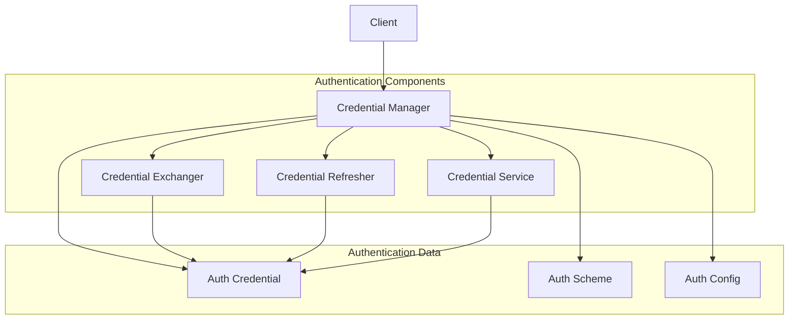
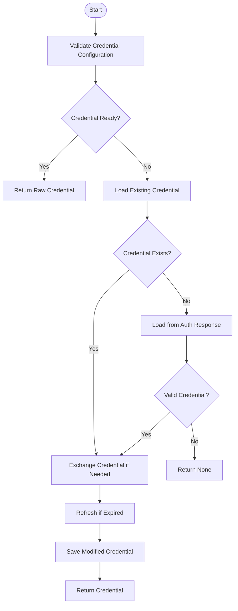
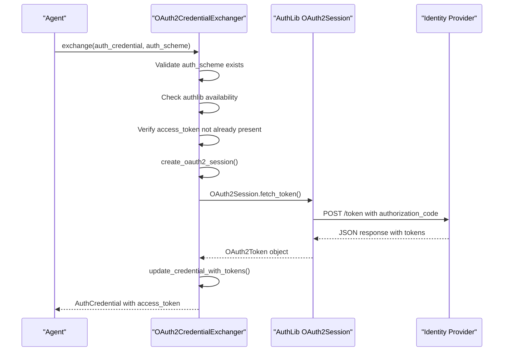
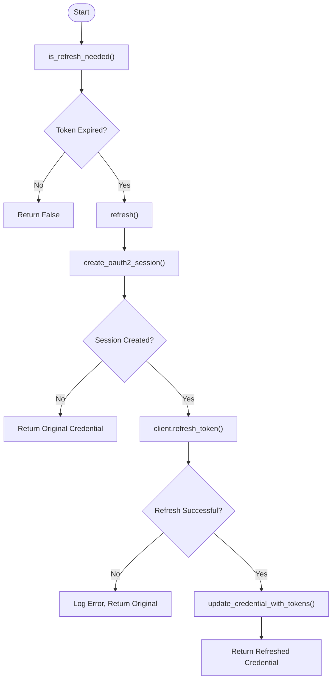
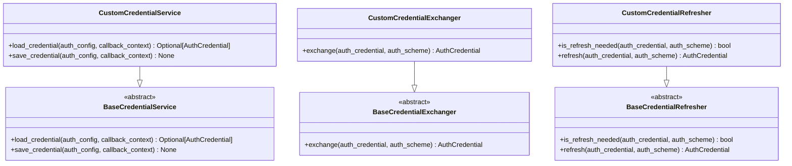
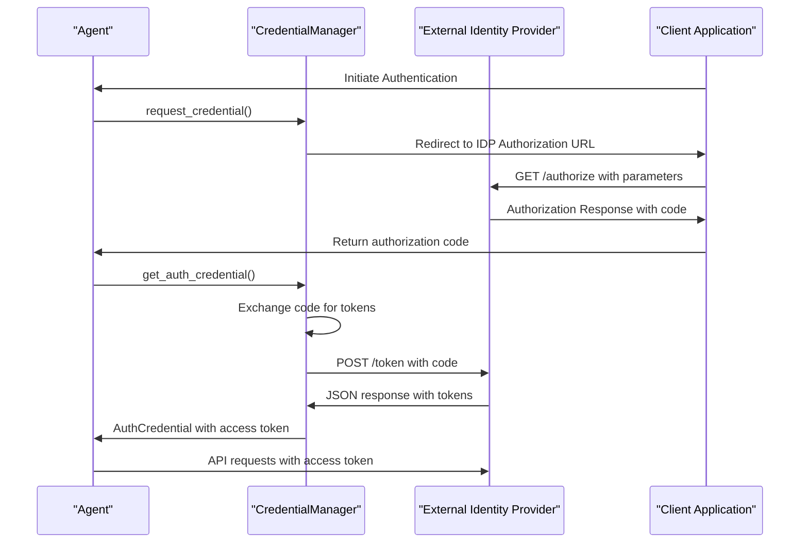
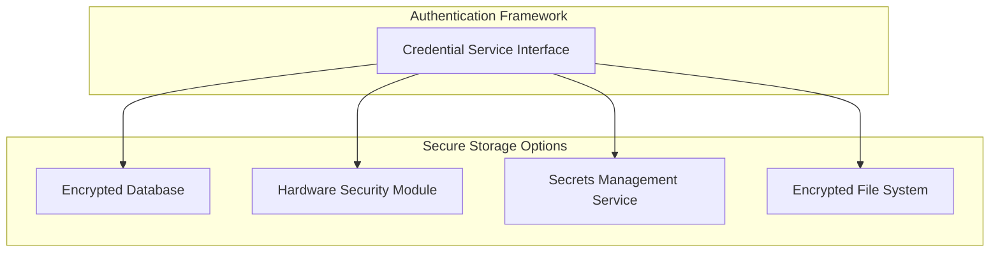
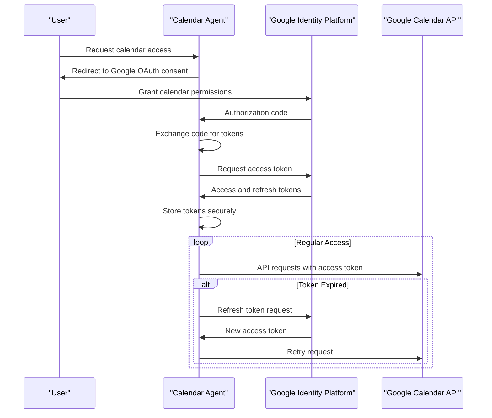

# Custom Authentication

<cite>
**Referenced Files in This Document**   
- [auth_credential.py](file://src/google/adk/auth/auth_credential.py)
- [auth_schemes.py](file://src/google/adk/auth/auth_schemes.py)
- [credential_manager.py](file://src/google/adk/auth/credential_manager.py)
- [oauth2_credential_exchanger.py](file://src/google/adk/auth/exchanger/oauth2_credential_exchanger.py)
- [oauth2_credential_refresher.py](file://src/google/adk/auth/refresher/oauth2_credential_refresher.py)
- [base_credential_service.py](file://src/google/adk/auth/credential_service/base_credential_service.py)
- [in_memory_credential_service.py](file://src/google/adk/auth/credential_service/in_memory_credential_service.py)
- [session_state_credential_service.py](file://src/google/adk/auth/credential_service/session_state_credential_service.py)
- [oauth2_credential_util.py](file://src/google/adk/auth/oauth2_credential_util.py)
- [agent.py](file://contributing/samples/oauth_calendar_agent/agent.py)
- [README.md](file://contributing/samples/oauth_calendar_agent/README.md)
</cite>

## Table of Contents
1. [Introduction](#introduction)
2. [Authentication Architecture](#authentication-architecture)
3. [Credential Management](#credential-management)
4. [OAuth2 Exchange Mechanism](#oauth2-exchange-mechanism)
5. [Token Refresh Strategies](#token-refresh-strategies)
6. [Custom Authentication Implementation](#custom-authentication-implementation)
7. [External Identity Provider Integration](#external-identity-provider-integration)
8. [Security Best Practices](#security-best-practices)
9. [Calendar Agent Example](#calendar-agent-example)

## Introduction

The Custom Authentication system provides a comprehensive framework for securing agent interactions and external service access. This documentation details the authentication architecture, focusing on credential management, exchange mechanisms, and refresh strategies. The system supports various authentication types including OAuth2, OpenID Connect, API keys, and service accounts, with extensible interfaces for custom authentication schemes.

The authentication framework is designed to handle the complete lifecycle of credentials, from initial exchange through token refresh, while maintaining security best practices. It provides a structured workflow for credential validation, exchange, and refresh operations, ensuring that agents can securely access external services with minimal developer overhead.

**Section sources**
- [auth_credential.py](file://src/google/adk/auth/auth_credential.py#L1-L233)
- [auth_schemes.py](file://src/google/adk/auth/auth_schemes.py#L1-L68)

## Authentication Architecture

The authentication architecture is built around a modular design that separates concerns between credential management, exchange, and refresh operations. The core components work together to provide a seamless authentication experience for agents accessing external services.



**Diagram sources**
- [credential_manager.py](file://src/google/adk/auth/credential_manager.py#L31-L262)
- [auth_credential.py](file://src/google/adk/auth/auth_credential.py#L167-L233)

The architecture follows a layered approach where the CredentialManager orchestrates the authentication workflow by coordinating with specialized components:

- **CredentialManager**: Central orchestrator that manages the complete credential lifecycle
- **CredentialExchanger**: Handles conversion of credentials from one format to another
- **CredentialRefresher**: Manages token refresh operations for expired credentials
- **CredentialService**: Provides persistent storage for credentials
- **AuthCredential**: Represents the authentication credential data
- **AuthScheme**: Defines the authentication scheme configuration

This modular design allows for extensibility and customization while maintaining a consistent interface across different authentication types.

**Section sources**
- [credential_manager.py](file://src/google/adk/auth/credential_manager.py#L31-L262)
- [auth_credential.py](file://src/google/adk/auth/auth_credential.py#L167-L233)

## Credential Management

Credential management is handled through the CredentialManager class, which provides a structured workflow for loading and preparing authentication credentials. The manager follows a multi-step process to ensure credentials are valid and ready for use.



**Diagram sources**
- [credential_manager.py](file://src/google/adk/auth/credential_manager.py#L106-L146)

The credential management workflow consists of the following steps:

1. **Validation**: The credential configuration is validated to ensure all required fields are present
2. **Readiness Check**: Determines if the credential is already in a usable state
3. **Existing Credential Load**: Attempts to load a previously processed credential from storage
4. **Auth Response Load**: If no existing credential is found, loads from the authentication response
5. **Exchange**: Converts the credential to the required format (e.g., exchanging authorization code for access token)
6. **Refresh**: Updates expired tokens using refresh tokens
7. **Save**: Stores the processed credential for future use

The CredentialManager supports different credential storage backends through the CredentialService interface, allowing credentials to be stored in memory, session state, or other persistent storage systems.

**Section sources**
- [credential_manager.py](file://src/google/adk/auth/credential_manager.py#L106-L146)
- [base_credential_service.py](file://src/google/adk/auth/credential_service/base_credential_service.py#L27-L76)

## OAuth2 Exchange Mechanism

The OAuth2 credential exchange mechanism handles the conversion of authorization codes to access tokens using the authorization code grant flow. This process is implemented in the OAuth2CredentialExchanger class.



**Diagram sources**
- [oauth2_credential_exchanger.py](file://src/google/adk/auth/exchanger/oauth2_credential_exchanger.py#L43-L105)
- [oauth2_credential_util.py](file://src/google/adk/auth/oauth2_credential_util.py#L40-L87)

The exchange process follows these steps:

1. **Validation**: Ensures the auth_scheme is provided and authlib is available
2. **Session Creation**: Creates an OAuth2Session using client credentials and configuration
3. **Token Request**: Sends a token request to the identity provider's token endpoint
4. **Response Handling**: Processes the token response and updates the credential
5. **Error Management**: Handles failures gracefully by returning the original credential

The exchange mechanism supports both OpenAPI-defined OAuth2 schemes and OpenID Connect configurations, extracting the necessary endpoints and scopes from the auth_scheme configuration.

**Section sources**
- [oauth2_credential_exchanger.py](file://src/google/adk/auth/exchanger/oauth2_credential_exchanger.py#L43-L105)
- [oauth2_credential_util.py](file://src/google/adk/auth/oauth2_credential_util.py#L40-L87)

## Token Refresh Strategies

Token refresh strategies are implemented in the OAuth2CredentialRefresher class, which handles the automatic renewal of expired access tokens using refresh tokens. This ensures uninterrupted access to protected resources.



**Diagram sources**
- [oauth2_credential_refresher.py](file://src/google/adk/auth/refresher/oauth2_credential_refresher.py#L44-L127)
- [oauth2_credential_util.py](file://src/google/adk/auth/oauth2_credential_util.py#L90-L108)

The token refresh process consists of:

1. **Expiration Check**: Uses the OAuth2Token.is_expired() method to determine if refresh is needed
2. **Session Initialization**: Creates an OAuth2Session with the client credentials
3. **Refresh Request**: Sends a refresh token request to the token endpoint
4. **Token Update**: Updates the credential with new access and refresh tokens
5. **Error Handling**: Gracefully handles refresh failures by returning the original credential

The refresh strategy is designed to be non-blocking and fault-tolerant, ensuring that authentication failures do not disrupt the agent's primary functionality. When refresh fails, the original credential is returned, allowing the application to decide how to proceed.

**Section sources**
- [oauth2_credential_refresher.py](file://src/google/adk/auth/refresher/oauth2_credential_refresher.py#L44-L127)
- [oauth2_credential_util.py](file://src/google/adk/auth/oauth2_credential_util.py#L90-L108)

## Custom Authentication Implementation

Custom authentication schemes can be implemented by extending the base classes provided by the authentication framework. This allows developers to support authentication methods beyond the built-in OAuth2 and OpenID Connect implementations.



**Diagram sources**
- [base_credential_service.py](file://src/google/adk/auth/credential_service/base_credential_service.py#L27-L76)
- [base_credential_exchanger.py](file://src/google/adk/auth/exchanger/base_credential_exchanger.py#L31-L58)
- [base_credential_refresher.py](file://src/google/adk/auth/refresher/base_credential_refresher.py#L31-L75)

To implement a custom authentication scheme:

1. **Extend Base Classes**: Create classes that inherit from BaseCredentialService, BaseCredentialExchanger, and BaseCredentialRefresher
2. **Implement Abstract Methods**: Provide implementations for the required methods in each class
3. **Register with Manager**: Register the custom components with the CredentialManager

```python
# Example of registering custom authentication components
manager = CredentialManager(auth_config)
manager.register_credential_exchanger(
    AuthCredentialTypes.CUSTOM_TYPE,
    CustomCredentialExchanger()
)
manager.register_credential_refresher(
    AuthCredentialTypes.CUSTOM_TYPE,
    CustomCredentialRefresher()
)
```

The framework supports multiple credential types through the AuthCredentialTypes enum, which can be extended to include custom authentication methods. Each credential type can have its own exchanger and refresher implementations.

**Section sources**
- [base_credential_service.py](file://src/google/adk/auth/credential_service/base_credential_service.py#L27-L76)
- [base_credential_exchanger.py](file://src/google/adk/auth/exchanger/base_credential_exchanger.py#L31-L58)
- [base_credential_refresher.py](file://src/google/adk/auth/refresher/base_credential_refresher.py#L31-L75)

## External Identity Provider Integration

Integrating with external identity providers is facilitated through the AuthScheme configuration, which defines the endpoints and parameters required for authentication. The framework supports both OpenAPI-defined OAuth2 schemes and custom OpenID Connect configurations.



**Diagram sources**
- [credential_manager.py](file://src/google/adk/auth/credential_manager.py#L103-L105)
- [oauth2_credential_exchanger.py](file://src/google/adk/auth/exchanger/oauth2_credential_exchanger.py#L48-L105)

To integrate with an external identity provider:

1. **Configure AuthScheme**: Define the authorization and token endpoints, scopes, and other parameters
2. **Set Up Redirect URI**: Configure the redirect URI where the authorization response will be sent
3. **Handle Authentication Flow**: Implement the redirect and callback handling in the client application
4. **Store Credentials**: Use the credential service to store exchanged tokens for future use

The framework supports various OAuth2 grant types through the OAuthGrantType enum, including authorization_code, client_credentials, implicit, and password flows. This flexibility allows integration with a wide range of identity providers with different security requirements.

**Section sources**
- [auth_schemes.py](file://src/google/adk/auth/auth_schemes.py#L44-L63)
- [credential_manager.py](file://src/google/adk/auth/credential_manager.py#L103-L105)

## Security Best Practices

The authentication framework incorporates several security best practices to protect credentials and prevent common vulnerabilities.

### Credential Storage
Credentials should be stored securely using appropriate credential services:
- **InMemoryCredentialService**: Suitable for development and testing
- **SessionStateCredentialService**: Stores credentials in session state (use with caution)
- **Custom Implementations**: Recommended for production use with encrypted storage



**Diagram sources**
- [in_memory_credential_service.py](file://src/google/adk/auth/credential_service/in_memory_credential_service.py#L28-L67)
- [session_state_credential_service.py](file://src/google/adk/auth/credential_service/session_state_credential_service.py#L28-L84)

### Token Lifecycle Management
Proper token lifecycle management is critical for security:
- **Short-lived Access Tokens**: Minimize the window of opportunity for token misuse
- **Refresh Token Rotation**: Issue new refresh tokens with each refresh request
- **Token Revocation**: Implement mechanisms to revoke compromised tokens
- **Secure Transmission**: Always use HTTPS for token exchange

### Vulnerability Prevention
The framework includes protections against common security vulnerabilities:
- **Token Leakage**: Sensitive token data is not logged or exposed in error messages
- **CSRF Protection**: State parameters are used to prevent cross-site request forgery
- **Input Validation**: All authentication inputs are validated before processing
- **Error Handling**: Authentication failures are handled gracefully without exposing sensitive information

**Section sources**
- [in_memory_credential_service.py](file://src/google/adk/auth/credential_service/in_memory_credential_service.py#L28-L67)
- [session_state_credential_service.py](file://src/google/adk/auth/credential_service/session_state_credential_service.py#L28-L84)
- [oauth2_credential_exchanger.py](file://src/google/adk/auth/exchanger/oauth2_credential_exchanger.py#L66-L102)

## Calendar Agent Example

The OAuth Calendar Agent sample demonstrates the practical application of the authentication framework for accessing Google Calendar API. This example illustrates the complete workflow from authentication setup to API access.



**Diagram sources**
- [agent.py](file://contributing/samples/oauth_calendar_agent/agent.py)
- [README.md](file://contributing/samples/oauth_calendar_agent/README.md)

The calendar agent implementation highlights key aspects of the authentication framework:

1. **OAuth2 Configuration**: The agent is configured with Google's OAuth2 endpoints and required scopes
2. **Credential Exchange**: Authorization codes are exchanged for access and refresh tokens
3. **Token Refresh**: Expired tokens are automatically refreshed using refresh tokens
4. **Secure Storage**: Tokens are stored using the configured credential service
5. **API Integration**: The authenticated credential is used to make requests to the Calendar API

The sample demonstrates how the authentication framework abstracts the complexity of OAuth2 flows, allowing developers to focus on their application logic while ensuring secure access to external services.

**Section sources**
- [agent.py](file://contributing/samples/oauth_calendar_agent/agent.py)
- [README.md](file://contributing/samples/oauth_calendar_agent/README.md)