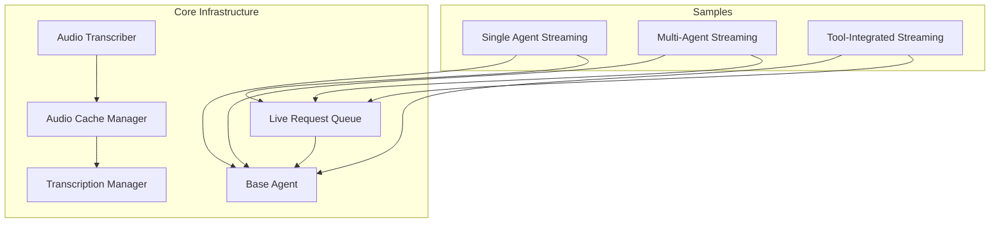
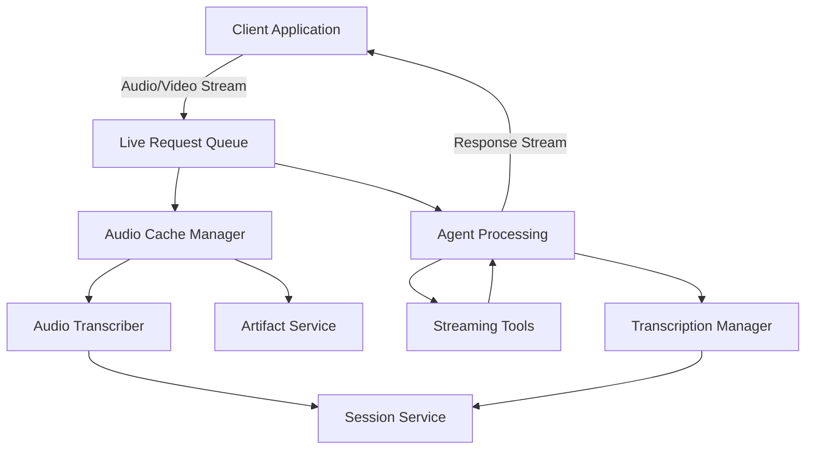
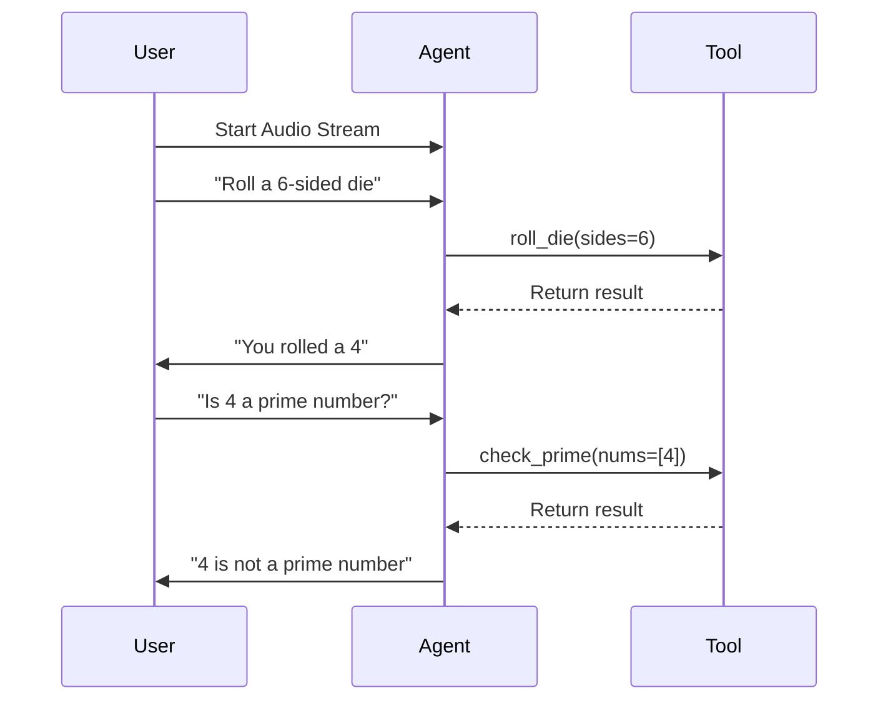
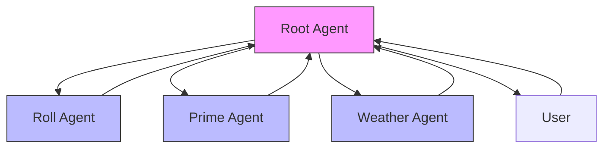
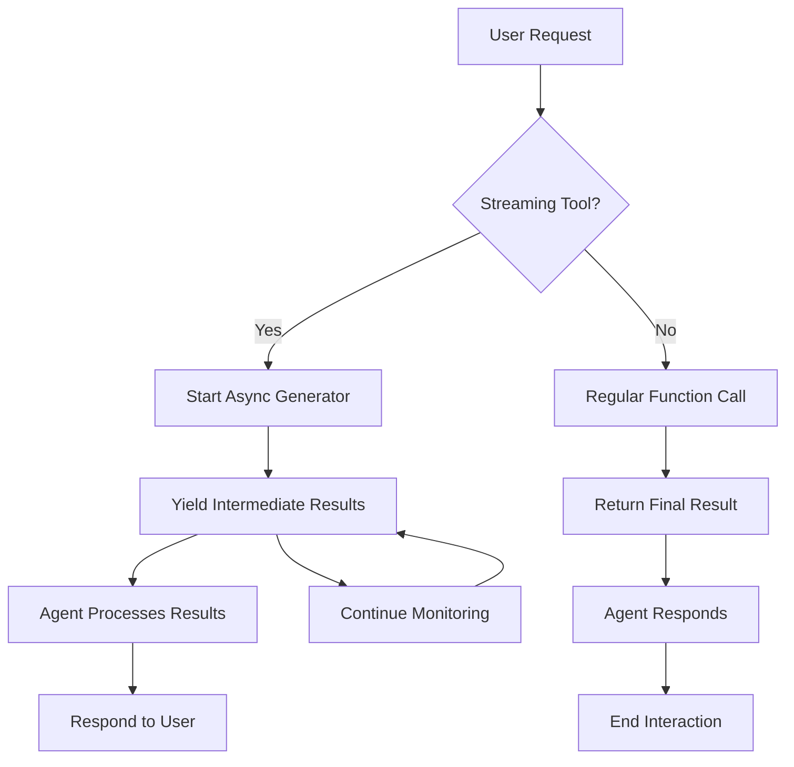
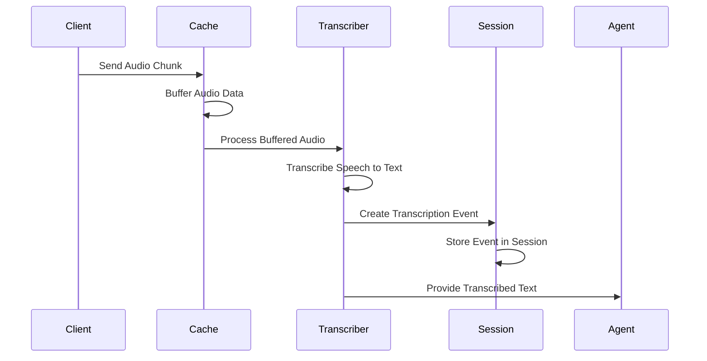
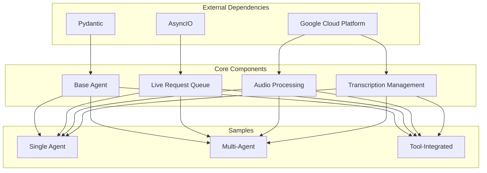

# Live Streaming Agents

<cite>
**Referenced Files in This Document**   
- [live_bidi_streaming_single_agent/agent.py](file://contributing/samples/live_bidi_streaming_single_agent/agent.py)
- [live_bidi_streaming_single_agent/readme.md](file://contributing/samples/live_bidi_streaming_single_agent/readme.md)
- [live_bidi_streaming_multi_agent/agent.py](file://contributing/samples/live_bidi_streaming_multi_agent/agent.py)
- [live_bidi_streaming_multi_agent/readme.md](file://contributing/samples/live_bidi_streaming_multi_agent/readme.md)
- [live_bidi_streaming_tools_agent/agent.py](file://contributing/samples/live_bidi_streaming_tools_agent/agent.py)
- [live_bidi_streaming_tools_agent/readme.md](file://contributing/samples/live_bidi_streaming_tools_agent/readme.md)
- [audio_transcriber.py](file://src/google/adk/flows/llm_flows/audio_transcriber.py)
- [audio_cache_manager.py](file://src/google/adk/flows/llm_flows/audio_cache_manager.py)
- [live_request_queue.py](file://src/google/adk/agents/live_request_queue.py)
- [transcription_entry.py](file://src/google/adk/agents/transcription_entry.py)
- [transcription_manager.py](file://src/google/adk/flows/llm_flows/transcription_manager.py)
- [base_agent.py](file://src/google/adk/agents/base_agent.py)
</cite>

## Table of Contents
1. [Introduction](#introduction)
2. [Project Structure](#project-structure)
3. [Core Components](#core-components)
4. [Architecture Overview](#architecture-overview)
5. [Detailed Component Analysis](#detailed-component-analysis)
6. [Dependency Analysis](#dependency-analysis)
7. [Performance Considerations](#performance-considerations)
8. [Troubleshooting Guide](#troubleshooting-guide)
9. [Conclusion](#conclusion)

## Introduction
Live Streaming Agents in the Agent Development Kit (ADK) framework enable real-time, bidirectional communication between clients and agents. These agents support continuous data flow for interactive applications, allowing for audio transcription, caching, and real-time response generation. The system is designed to handle both single-agent and multi-agent configurations, as well as tool-integrated workflows that can stream intermediate results back to the agent. This documentation provides a comprehensive overview of the architecture, implementation, and usage patterns for live streaming agents, with practical examples from the provided samples.

## Project Structure
The live streaming agent functionality is organized within the contributing/samples directory, with three main sample implementations: single-agent, multi-agent, and tool-integrated streaming. Each sample contains an agent.py file defining the agent configuration and behavior, along with a README.md providing usage instructions. The core streaming infrastructure is located in the src/google/adk directory, with key components in the flows/llm_flows and agents subdirectories. The architecture supports audio transcription, caching, and real-time data flow management through dedicated classes and services.

**Diagram sources**
- [live_bidi_streaming_single_agent/agent.py](file://contributing/samples/live_bidi_streaming_single_agent/agent.py)
- [live_bidi_streaming_multi_agent/agent.py](file://contributing/samples/live_bidi_streaming_multi_agent/agent.py)
- [live_bidi_streaming_tools_agent/agent.py](file://contributing/samples/live_bidi_streaming_tools_agent/agent.py)
- [audio_transcriber.py](file://src/google/adk/flows/llm_flows/audio_transcriber.py)
- [audio_cache_manager.py](file://src/google/adk/flows/llm_flows/audio_cache_manager.py)
- [live_request_queue.py](file://src/google/adk/agents/live_request_queue.py)
- [transcription_manager.py](file://src/google/adk/flows/llm_flows/transcription_manager.py)
- [base_agent.py](file://src/google/adk/agents/base_agent.py)

**Section sources**
- [live_bidi_streaming_single_agent/agent.py](file://contributing/samples/live_bidi_streaming_single_agent/agent.py)
- [live_bidi_streaming_multi_agent/agent.py](file://contributing/samples/live_bidi_streaming_multi_agent/agent.py)
- [live_bidi_streaming_tools_agent/agent.py](file://contributing/samples/live_bidi_streaming_tools_agent/agent.py)

## Core Components
The Live Streaming Agents system comprises several core components that work together to enable real-time, bidirectional communication. The base_agent.py provides the foundational agent class that all streaming agents inherit from, defining common properties and methods. The live_request_queue.py implements a queue for handling live requests in a bidirectional streaming manner, allowing for real-time data exchange between client and agent. Audio processing is managed by audio_transcriber.py and audio_cache_manager.py, which handle speech-to-text transcription and audio data caching respectively. The transcription_manager.py coordinates transcription events, while the various sample agents demonstrate different streaming patterns and use cases.

**Section sources**
- [base_agent.py](file://src/google/adk/agents/base_agent.py)
- [live_request_queue.py](file://src/google/adk/agents/live_request_queue.py)
- [audio_transcriber.py](file://src/google/adk/flows/llm_flows/audio_transcriber.py)
- [audio_cache_manager.py](file://src/google/adk/flows/llm_flows/audio_cache_manager.py)
- [transcription_manager.py](file://src/google/adk/flows/llm_flows/transcription_manager.py)

## Architecture Overview
The Live Streaming Agents architecture is designed to support continuous, real-time interaction between clients and agents through bidirectional streaming. The system follows a layered approach with clear separation of concerns between the streaming interface, data processing, and agent logic. At the core is the LiveRequestQueue, which manages the bidirectional flow of data between client and agent. Audio data is processed through a dedicated pipeline that includes caching, transcription, and event management. The agent framework supports different deployment patterns including single agents, multi-agent systems, and tool-integrated workflows, all built on the same underlying streaming infrastructure.

**Diagram sources**
- [live_request_queue.py](file://src/google/adk/agents/live_request_queue.py)
- [audio_cache_manager.py](file://src/google/adk/flows/llm_flows/audio_cache_manager.py)
- [audio_transcriber.py](file://src/google/adk/flows/llm_flows/audio_transcriber.py)
- [transcription_manager.py](file://src/google/adk/flows/llm_flows/transcription_manager.py)
- [base_agent.py](file://src/google/adk/agents/base_agent.py)

## Detailed Component Analysis

### Single Agent Streaming Implementation
The single agent streaming implementation demonstrates the basic pattern for real-time interaction with a single agent. The agent is configured to handle specific tasks such as rolling dice and checking prime numbers, with tools defined as regular functions that can be called during the conversation. The streaming interface allows for continuous interaction without requiring the user to send discrete messages. The agent maintains state between interactions through the tool_context parameter, enabling it to remember previous actions and build upon them in subsequent exchanges.

**Diagram sources**
- [live_bidi_streaming_single_agent/agent.py](file://contributing/samples/live_bidi_streaming_single_agent/agent.py)
- [live_bidi_streaming_single_agent/readme.md](file://contributing/samples/live_bidi_streaming_single_agent/readme.md)

**Section sources**
- [live_bidi_streaming_single_agent/agent.py](file://contributing/samples/live_bidi_streaming_single_agent/agent.py)
- [live_bidi_streaming_single_agent/readme.md](file://contributing/samples/live_bidi_streaming_single_agent/readme.md)

### Multi-Agent Streaming System
The multi-agent streaming system extends the single agent pattern by introducing a hierarchy of specialized agents that can delegate tasks to each other. The root agent acts as a coordinator, routing requests to appropriate sub-agents based on their capabilities. This architecture enables more complex workflows where different agents specialize in specific domains, such as weather checking, dice rolling, or prime number verification. The system supports agent transfer, allowing seamless handoff between agents during a conversation while maintaining context and continuity.

**Diagram sources**
- [live_bidi_streaming_multi_agent/agent.py](file://contributing/samples/live_bidi_streaming_multi_agent/agent.py)
- [live_bidi_streaming_multi_agent/readme.md](file://contributing/samples/live_bidi_streaming_multi_agent/readme.md)

**Section sources**
- [live_bidi_streaming_multi_agent/agent.py](file://contributing/samples/live_bidi_streaming_multi_agent/agent.py)
- [live_bidi_streaming_multi_agent/readme.md](file://contributing/samples/live_bidi_streaming_multi_agent/readme.md)

### Tool-Integrated Streaming Workflows
The tool-integrated streaming workflow introduces asynchronous tools that can generate continuous streams of data and intermediate results. These tools are implemented as async generators, allowing them to yield multiple results over time rather than returning a single response. This enables use cases such as monitoring stock prices or analyzing video streams, where the agent can react to changes in real-time. The system supports both simple streaming tools and video-specific tools that receive the video stream as input, providing flexibility for different types of real-time data sources.

**Diagram sources**
- [live_bidi_streaming_tools_agent/agent.py](file://contributing/samples/live_bidi_streaming_tools_agent/agent.py)
- [live_bidi_streaming_tools_agent/readme.md](file://contributing/samples/live_bidi_streaming_tools_agent/readme.md)

**Section sources**
- [live_bidi_streaming_tools_agent/agent.py](file://contributing/samples/live_bidi_streaming_tools_agent/agent.py)
- [live_bidi_streaming_tools_agent/readme.md](file://contributing/samples/live_bidi_streaming_tools_agent/readme.md)

### Audio Processing Pipeline
The audio processing pipeline handles the transcription and management of audio data in the streaming system. When audio data is received from the client, it is first cached by the AudioCacheManager, which buffers the data for efficient processing. The AudioTranscriber then processes the cached audio using Google Cloud Speech-to-Text, converting speech to text that can be used by the agent. The TranscriptionManager coordinates this process, creating events that are stored in the session and made available for future reference. This pipeline is designed to minimize latency while ensuring reliable transcription of user input.

**Diagram sources**
- [audio_cache_manager.py](file://src/google/adk/flows/llm_flows/audio_cache_manager.py)
- [audio_transcriber.py](file://src/google/adk/flows/llm_flows/audio_transcriber.py)
- [transcription_manager.py](file://src/google/adk/flows/llm_flows/transcription_manager.py)

**Section sources**
- [audio_cache_manager.py](file://src/google/adk/flows/llm_flows/audio_cache_manager.py)
- [audio_transcriber.py](file://src/google/adk/flows/llm_flows/audio_transcriber.py)
- [transcription_manager.py](file://src/google/adk/flows/llm_flows/transcription_manager.py)

## Dependency Analysis
The Live Streaming Agents system has a well-defined dependency structure that enables modularity and extensibility. The core components in the src/google/adk directory provide the foundational infrastructure, while the sample implementations in contributing/samples demonstrate different usage patterns. The system depends on external services such as Google Cloud Speech-to-Text for audio transcription and Google Cloud Storage for artifact storage. The agent framework is built on top of the Pydantic library for data validation and the asyncio library for asynchronous operations. The modular design allows components to be replaced or extended without affecting the overall system architecture.

**Diagram sources**
- [base_agent.py](file://src/google/adk/agents/base_agent.py)
- [live_request_queue.py](file://src/google/adk/agents/live_request_queue.py)
- [audio_cache_manager.py](file://src/google/adk/flows/llm_flows/audio_cache_manager.py)
- [transcription_manager.py](file://src/google/adk/flows/llm_flows/transcription_manager.py)

**Section sources**
- [base_agent.py](file://src/google/adk/agents/base_agent.py)
- [live_request_queue.py](file://src/google/adk/agents/live_request_queue.py)
- [audio_cache_manager.py](file://src/google/adk/flows/llm_flows/audio_cache_manager.py)
- [transcription_manager.py](file://src/google/adk/flows/llm_flows/transcription_manager.py)

## Performance Considerations
The Live Streaming Agents system is designed with performance and latency optimization as key priorities. The audio caching mechanism reduces the frequency of transcription API calls by batching audio data, which helps minimize both latency and cost. The system uses asynchronous processing throughout to ensure that I/O operations do not block the main execution thread, allowing for smooth real-time interaction. Connection reliability is maintained through the use of persistent streaming connections and proper error handling. The architecture is designed to handle partial results gracefully, allowing the agent to respond to intermediate outputs from streaming tools without waiting for completion.

**Section sources**
- [audio_cache_manager.py](file://src/google/adk/flows/llm_flows/audio_cache_manager.py)
- [live_request_queue.py](file://src/google/adk/agents/live_request_queue.py)
- [base_agent.py](file://src/google/adk/agents/base_agent.py)

## Troubleshooting Guide
When working with Live Streaming Agents, several common issues may arise. Connection problems can occur if the streaming session is interrupted or if there are network connectivity issues. Audio transcription errors may happen due to poor audio quality or unsupported languages. For tool-integrated workflows, ensure that streaming tools are properly defined as async generators with the correct return type. When debugging multi-agent systems, verify that agent delegation is configured correctly in the instruction prompts. The system logs detailed information about audio caching, transcription, and agent execution, which can be invaluable for diagnosing issues.

**Section sources**
- [live_bidi_streaming_single_agent/readme.md](file://contributing/samples/live_bidi_streaming_single_agent/readme.md)
- [live_bidi_streaming_multi_agent/readme.md](file://contributing/samples/live_bidi_streaming_multi_agent/readme.md)
- [live_bidi_streaming_tools_agent/readme.md](file://contributing/samples/live_bidi_streaming_tools_agent/readme.md)

## Conclusion
The Live Streaming Agents framework provides a robust foundation for building real-time, bidirectional communication applications. By combining a flexible agent architecture with efficient audio processing and streaming capabilities, it enables a wide range of interactive use cases from simple voice assistants to complex multi-agent systems. The modular design allows developers to extend and customize the system to meet specific requirements, while the comprehensive tool integration enables reactive workflows that can respond to changing data in real-time. With proper implementation and optimization, these agents can deliver low-latency, reliable interactions that feel natural and responsive to users.