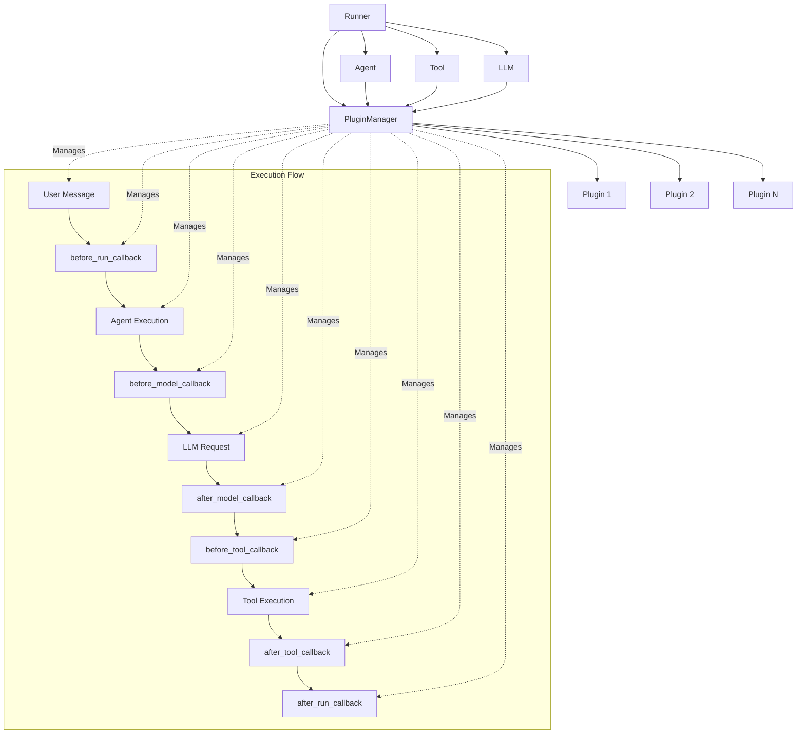
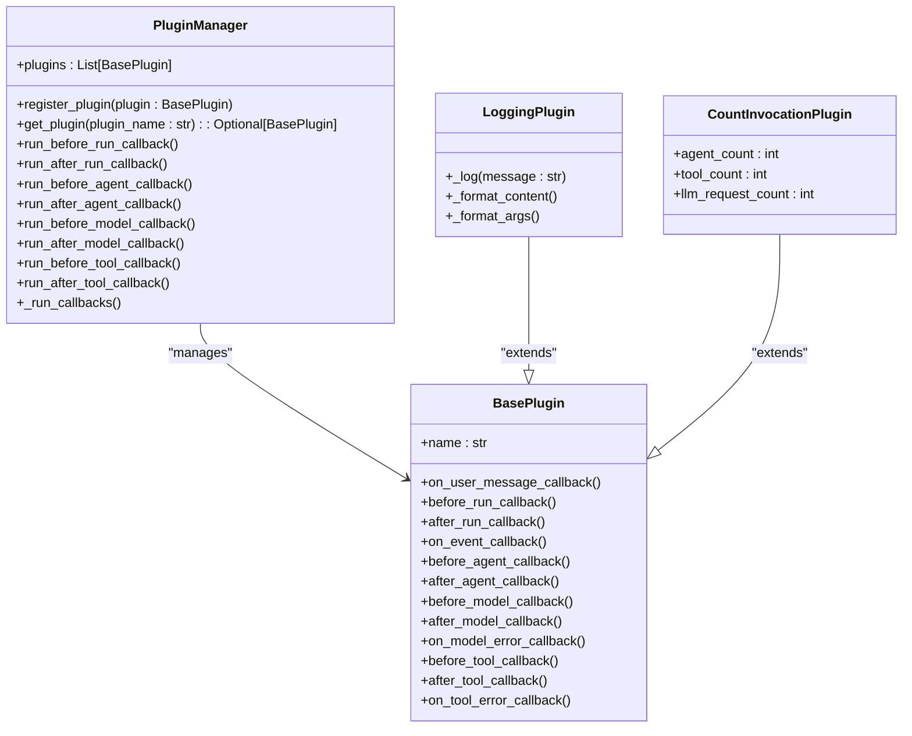
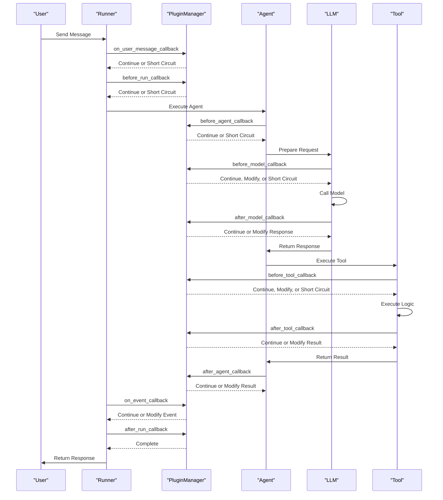
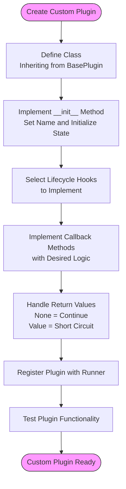
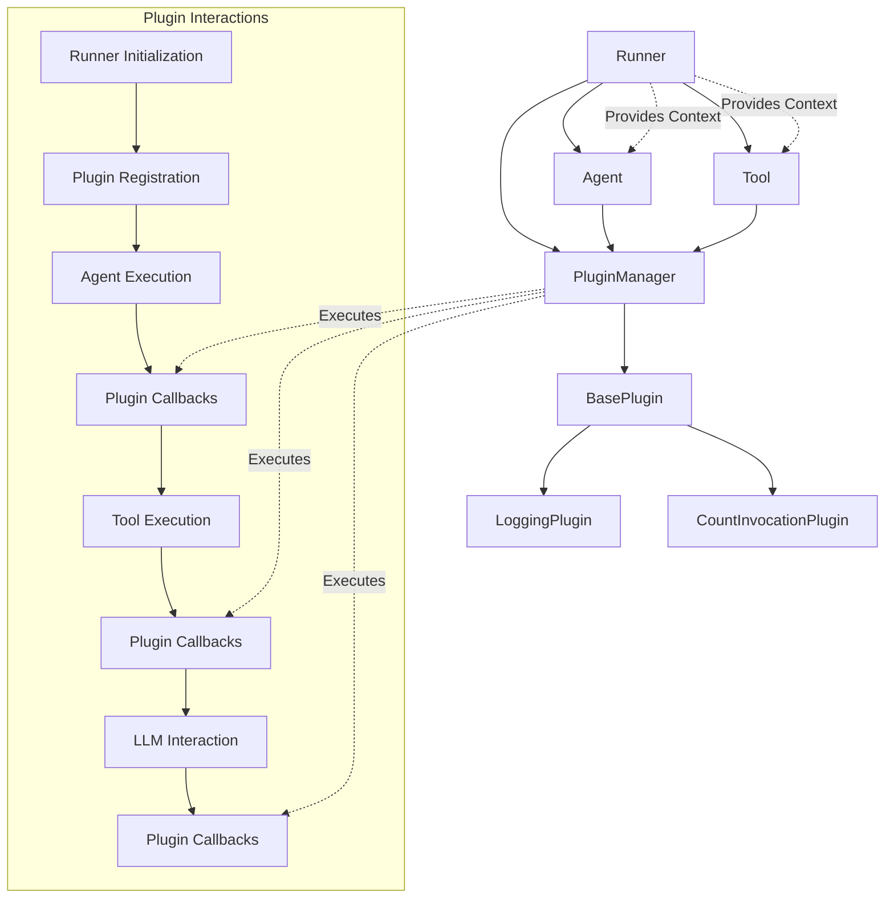

# Plugin System

<cite>
**Referenced Files in This Document**   
- [base_plugin.py](file://src/google/adk/plugins/base_plugin.py)
- [plugin_manager.py](file://src/google/adk/plugins/plugin_manager.py)
- [logging_plugin.py](file://src/google/adk/plugins/logging_plugin.py)
- [runners.py](file://src/google/adk/runners.py)
- [count_plugin.py](file://contributing/samples/plugin_basic/count_plugin.py)
- [main.py](file://contributing/samples/plugin_basic/main.py)
</cite>

## Table of Contents
1. [Introduction](#introduction)
2. [Plugin Architecture](#plugin-architecture)
3. [Core Components](#core-components)
4. [Lifecycle Hooks](#lifecycle-hooks)
5. [Creating Custom Plugins](#creating-custom-plugins)
6. [Plugin-Component Relationships](#plugin-component-relationships)
7. [Common Issues and Solutions](#common-issues-and-solutions)
8. [Conclusion](#conclusion)

## Introduction
The Plugin System in the Agent Development Kit (ADK) provides a powerful mechanism for extending framework functionality without modifying core code. Plugins enable developers to intercept agent execution, modify behavior, and contribute new capabilities through a structured callback system. Unlike agent-specific callbacks, plugins are registered once on the Runner and apply globally to all agents, tools, and LLM calls managed by that runner. This makes plugins ideal for implementing horizontal features like logging, monitoring, caching, and security policies that cut across the entire application. The system is designed with extensibility and isolation in mind, allowing plugins to operate independently while providing comprehensive control over the agent execution lifecycle.

## Plugin Architecture

The plugin architecture is built around three core components: the PluginManager, the base plugin interface, and the lifecycle hooks that connect plugins to the execution flow. The PluginManager acts as the central orchestrator, maintaining a registry of all active plugins and ensuring they are executed in the correct order. When a plugin is registered with the Runner, it is added to the PluginManager's collection and becomes active for all subsequent invocations. The architecture implements an "early exit" strategy where if any plugin callback returns a non-None value, subsequent plugins and agent callbacks are short-circuited, allowing for efficient control flow and conditional execution.

**Diagram sources**
- [plugin_manager.py](file://src/google/adk/plugins/plugin_manager.py#L58-L300)
- [runners.py](file://src/google/adk/runners.py#L59-L680)

**Section sources**
- [plugin_manager.py](file://src/google/adk/plugins/plugin_manager.py#L58-L300)
- [runners.py](file://src/google/adk/runners.py#L59-L680)

## Core Components

The core components of the plugin system consist of the PluginManager, BasePlugin class, and the various plugin implementations that demonstrate different use cases. The PluginManager is responsible for registering plugins, maintaining their execution order, and invoking callbacks at the appropriate lifecycle stages. It ensures that plugins are executed in the order they were registered and implements the early exit strategy that allows plugins to short-circuit the execution flow. The BasePlugin class serves as the foundation for all plugin implementations, defining the available callback methods and providing the interface through which plugins interact with the system.

The logging plugin serves as a concrete example of how plugins can be used to enhance visibility into the agent execution process. It demonstrates the practical application of multiple lifecycle hooks to capture and display critical information about user messages, agent execution, LLM requests and responses, tool calls, and system events. This plugin is particularly valuable for debugging and monitoring, as it provides a comprehensive view of the entire execution flow in the console output.

**Diagram sources**
- [plugin_manager.py](file://src/google/adk/plugins/plugin_manager.py#L58-L300)
- [base_plugin.py](file://src/google/adk/plugins/base_plugin.py#L41-L368)
- [logging_plugin.py](file://src/google/adk/plugins/logging_plugin.py#L33-L308)
- [count_plugin.py](file://contributing/samples/plugin_basic/count_plugin.py#L21-L44)

**Section sources**
- [plugin_manager.py](file://src/google/adk/plugins/plugin_manager.py#L58-L300)
- [base_plugin.py](file://src/google/adk/plugins/base_plugin.py#L41-L368)
- [logging_plugin.py](file://src/google/adk/plugins/logging_plugin.py#L33-L308)

## Lifecycle Hooks

The plugin system provides a comprehensive set of lifecycle hooks that allow plugins to intercept and modify execution at critical points throughout the agent lifecycle. These hooks are organized into a sequential flow that mirrors the execution process, starting from user message reception and ending with invocation completion. Each hook serves a specific purpose and provides access to relevant context and data, enabling plugins to perform targeted operations.

The execution flow begins with the `on_user_message_callback`, which is triggered when a user message is received but before any processing begins. This is followed by the `before_run_callback`, which executes at the start of the invocation and is ideal for global setup tasks. During agent execution, the `before_agent_callback` and `after_agent_callback` hooks allow plugins to intercept agent runs, while the LLM interaction is managed through `before_model_callback` and `after_model_callback`. Tool execution is similarly controlled through `before_tool_callback` and `after_tool_callback`, with error handling provided by `on_model_error_callback` and `on_tool_error_callback`. The flow concludes with the `on_event_callback` for event processing and the `after_run_callback` for final cleanup tasks.

**Diagram sources**
- [base_plugin.py](file://src/google/adk/plugins/base_plugin.py#L41-L368)
- [plugin_manager.py](file://src/google/adk/plugins/plugin_manager.py#L58-L300)
- [runners.py](file://src/google/adk/runners.py#L59-L680)

**Section sources**
- [base_plugin.py](file://src/google/adk/plugins/base_plugin.py#L41-L368)

## Creating Custom Plugins

Creating custom plugins involves extending the BasePlugin class and implementing the desired lifecycle hooks to achieve specific functionality. The process begins by defining a new class that inherits from BasePlugin and implementing its `__init__` method to set a unique name and initialize any required state. Developers can then override specific callback methods to add custom behavior at various points in the execution lifecycle. Each callback method receives context-specific parameters that provide access to the current execution state, allowing plugins to inspect, modify, or short-circuit operations as needed.

For example, the CountInvocationPlugin demonstrates how to track execution metrics by maintaining counters for agent runs and LLM requests. It implements the `before_agent_callback` and `before_model_callback` methods to increment these counters and output their values to the console. This pattern can be extended to create plugins for monitoring, rate limiting, or performance tracking. When implementing custom plugins, developers should consider the return values of callback methods, as returning a non-None value will short-circuit the execution flow and prevent subsequent plugins and agent callbacks from executing.

**Diagram sources**
- [base_plugin.py](file://src/google/adk/plugins/base_plugin.py#L41-L368)
- [count_plugin.py](file://contributing/samples/plugin_basic/count_plugin.py#L21-L44)
- [main.py](file://contributing/samples/plugin_basic/main.py#L43-L48)

**Section sources**
- [count_plugin.py](file://contributing/samples/plugin_basic/count_plugin.py#L21-L44)
- [main.py](file://contributing/samples/plugin_basic/main.py#L43-L48)

## Plugin-Component Relationships

Plugins interact with various components in the system, including agents, runners, and tools, through well-defined interfaces and lifecycle hooks. The Runner serves as the central integration point, receiving the plugin list during initialization and delegating callback execution to the PluginManager. Agents are affected by plugins through the invocation context, which contains a reference to the plugin manager and is passed through the execution chain. When an agent executes, it triggers the appropriate plugin callbacks, allowing plugins to modify agent behavior, inputs, and outputs.

Tools are similarly integrated into the plugin system through the tool execution lifecycle. Before and after tool execution, the corresponding plugin callbacks are invoked, providing opportunities to validate inputs, modify arguments, log execution details, or alter results. The relationship between plugins and these components is designed to be non-invasive, with plugins operating as observers and modifiers rather than direct controllers. This separation of concerns ensures that core functionality remains unchanged while still allowing for extensive customization and extension through the plugin architecture.

**Diagram sources**
- [runners.py](file://src/google/adk/runners.py#L59-L680)
- [base_plugin.py](file://src/google/adk/plugins/base_plugin.py#L41-L368)
- [plugin_manager.py](file://src/google/adk/plugins/plugin_manager.py#L58-L300)

**Section sources**
- [runners.py](file://src/google/adk/runners.py#L59-L680)
- [base_plugin.py](file://src/google/adk/plugins/base_plugin.py#L41-L368)

## Common Issues and Solutions

When working with the plugin system, several common issues may arise, including plugin ordering conflicts, error isolation challenges, and performance overhead. Plugin ordering is critical because plugins are executed in the order they are registered, and an early exit from one plugin will prevent subsequent plugins from executing. To address this, developers should carefully consider the registration order and use descriptive names to make the execution sequence clear. For complex scenarios requiring specific ordering, multiple plugins can be created with explicit dependencies documented in their names or configuration.

Error isolation is another important consideration, as unhandled exceptions in plugins can disrupt the entire execution flow. The PluginManager includes built-in error handling that catches exceptions and logs them without terminating the overall process, but developers should still implement robust error handling within their plugin code. This includes validating inputs, using try-catch blocks around critical operations, and providing meaningful error messages. Performance overhead can be minimized by optimizing plugin logic, avoiding expensive operations in frequently called callbacks, and using caching where appropriate. For high-frequency operations like tool calls, plugins should focus on essential functionality and defer heavy processing to asynchronous tasks when possible.

**Section sources**
- [plugin_manager.py](file://src/google/adk/plugins/plugin_manager.py#L273-L297)
- [base_plugin.py](file://src/google/adk/plugins/base_plugin.py#L41-L368)

## Conclusion

The Plugin System in the Agent Development Kit provides a robust and flexible framework for extending functionality without modifying core code. By leveraging the PluginManager, BasePlugin interface, and comprehensive lifecycle hooks, developers can create powerful extensions that intercept and modify agent execution, enhance telemetry, and contribute new capabilities. The system's design emphasizes modularity, isolation, and ease of use, making it suitable for a wide range of use cases from simple logging to complex monitoring and security policies. Through careful implementation and attention to plugin ordering, error handling, and performance considerations, developers can create effective plugins that enhance the functionality of their agent-based applications while maintaining system stability and performance.