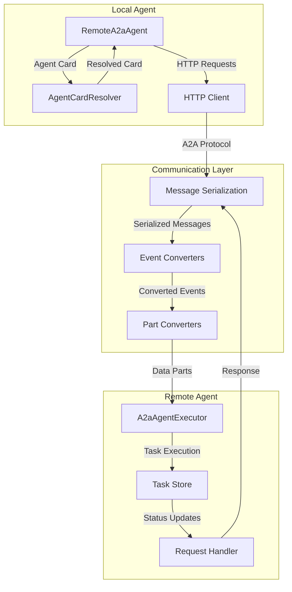
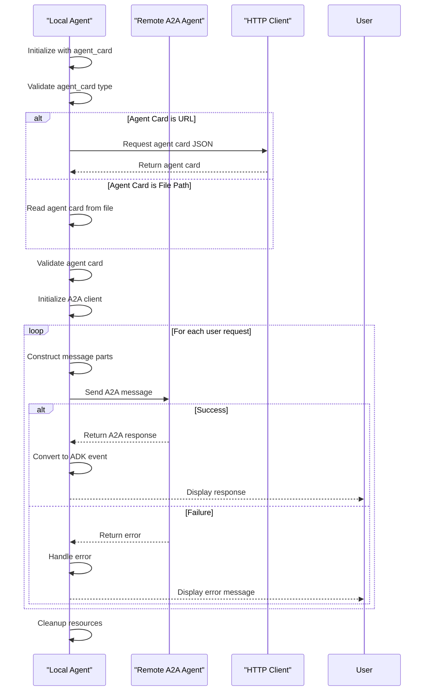
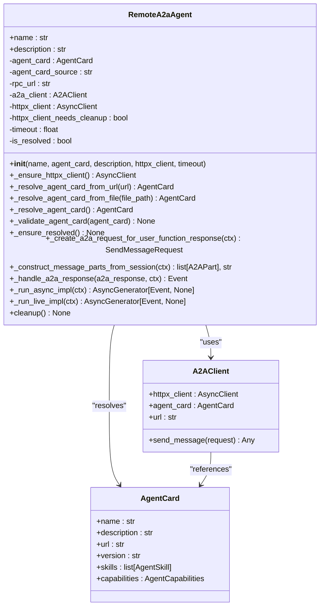
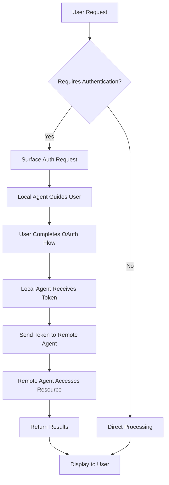
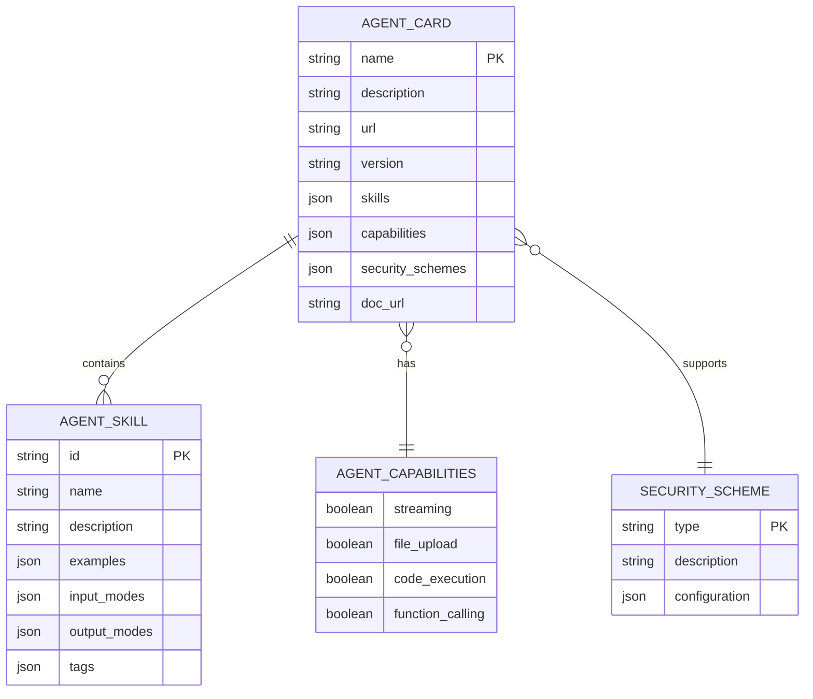
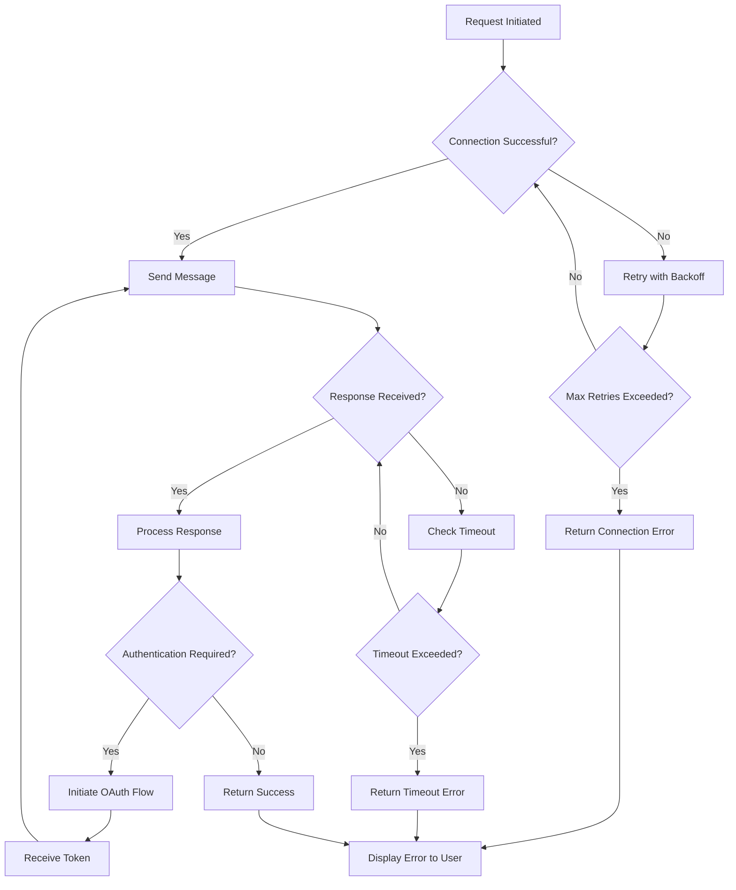

# Agent Composition

<cite>
**Referenced Files in This Document**   
- [remote_a2a_agent.py](file://src/google/adk/agents/remote_a2a_agent.py)
- [a2a_agent_executor.py](file://src/google/adk/a2a/executor/a2a_agent_executor.py)
- [event_converter.py](file://src/google/adk/a2a/converters/event_converter.py)
- [request_converter.py](file://src/google/adk/a2a/converters/request_converter.py)
- [agent_card_builder.py](file://src/google/adk/a2a/utils/agent_card_builder.py)
- [agent_to_a2a.py](file://src/google/adk/a2a/utils/agent_to_a2a.py)
- [task_result_aggregator.py](file://src/google/adk/a2a/executor/task_result_aggregator.py)
- [part_converter.py](file://src/google/adk/a2a/converters/part_converter.py)
- [a2a_basic\agent.py](file://contributing/samples/a2a_basic/agent.py)
- [a2a_auth\agent.py](file://contributing/samples/a2a_auth/agent.py)
- [a2a_basic\README.md](file://contributing/samples/a2a_basic/README.md)
- [a2a_auth\README.md](file://contributing/samples/a2a_auth/README.md)
</cite>

## Table of Contents
1. [Introduction](#introduction)
2. [Core Components](#core-components)
3. [RemoteA2AAgent Implementation](#remotea2aagent-implementation)
4. [Agent Composition Interfaces](#agent-composition-interfaces)
5. [Secure Communication Patterns](#secure-communication-patterns)
6. [Domain Model of Agent Networks](#domain-model-of-agent-networks)
7. [Error Handling and Resilience](#error-handling-and-resilience)
8. [Conclusion](#conclusion)

## Introduction
Agent composition in the ADK framework enables the creation of sophisticated multi-agent systems through the Agent-to-Agent (A2A) protocol. This document provides a comprehensive analysis of the A2A protocol implementation, focusing on the RemoteA2AAgent class that facilitates distributed agent communication. The A2A protocol allows local agents to seamlessly invoke remote agents and handle their responses, creating a powerful architecture for building complex agent networks. The implementation supports multiple agent discovery methods, including direct AgentCard objects, URLs to agent card JSON, and file paths to agent card JSON, providing flexibility in deployment scenarios. The framework handles critical aspects such as connection management, message serialization, error recovery, and session state management across requests, ensuring robust and reliable agent-to-agent communication.

**Section sources**
- [remote_a2a_agent.py](file://src/google/adk/agents/remote_a2a_agent.py#L101-L545)
- [a2a_basic\README.md](file://contributing/samples/a2a_basic/README.md#L1-L154)
- [a2a_auth\README.md](file://contributing/samples/a2a_auth/README.md#L1-L217)

## Core Components
The A2A protocol implementation in ADK consists of several core components that work together to enable distributed agent communication. The RemoteA2aAgent class serves as the primary interface for local agents to communicate with remote agents, handling agent card resolution, HTTP client management, and message conversion. The A2aAgentExecutor component executes A2A requests and publishes updates to an event queue, bridging the ADK agent framework with the A2A protocol. Converter modules handle the bidirectional transformation between ADK events and A2A messages, ensuring proper data serialization and deserialization. The AgentCardBuilder facilitates the creation of agent cards from ADK agents, while the agent_to_a2a utility converts standard ADK agents into A2A-compliant services. These components work in concert to provide a robust foundation for agent composition, enabling seamless integration between local and remote agents in distributed systems.

**Diagram sources **
- [remote_a2a_agent.py](file://src/google/adk/agents/remote_a2a_agent.py#L101-L545)
- [a2a_agent_executor.py](file://src/google/adk/a2a/executor/a2a_agent_executor.py#L72-L293)
- [event_converter.py](file://src/google/adk/a2a/converters/event_converter.py#L58-L524)
- [part_converter.py](file://src/google/adk/a2a/converters/part_converter.py#L55-L248)

**Section sources**
- [remote_a2a_agent.py](file://src/google/adk/agents/remote_a2a_agent.py#L101-L545)
- [a2a_agent_executor.py](file://src/google/adk/a2a/executor/a2a_agent_executor.py#L72-L293)
- [event_converter.py](file://src/google/adk/a2a/converters/event_converter.py#L58-L524)
- [part_converter.py](file://src/google/adk/a2a/converters/part_converter.py#L55-L248)

## RemoteA2AAgent Implementation
The RemoteA2aAgent class implements the client-side functionality for the A2A protocol, enabling local agents to communicate with remote agents. The implementation handles agent card resolution from various sources, including URLs, file paths, or direct AgentCard objects. It manages HTTP client lifecycle with proper resource cleanup and implements comprehensive error handling for network operations. The agent maintains session state across requests and handles message conversion between ADK and A2A formats. Key methods include _resolve_agent_card_from_url for resolving agent cards from web endpoints, _resolve_agent_card_from_file for loading agent cards from local files, and _ensure_resolved for validating and initializing the agent connection. The _run_async_impl method orchestrates the core communication flow, constructing A2A requests from session events and handling responses by converting them back to ADK events. The implementation also includes sophisticated error recovery mechanisms and logging for debugging communication issues.

**Diagram sources **
- [remote_a2a_agent.py](file://src/google/adk/agents/remote_a2a_agent.py#L101-L545)

**Section sources**
- [remote_a2a_agent.py](file://src/google/adk/agents/remote_a2a_agent.py#L101-L545)

## Agent Composition Interfaces
The A2A protocol provides well-defined interfaces for agent composition, enabling local agents to invoke remote agents and handle their responses. The primary interface is the RemoteA2aAgent class, which accepts parameters such as name, agent_card, description, httpx_client, and timeout. The agent_card parameter supports multiple formats: a direct AgentCard object, a URL string pointing to an agent card JSON, or a file path string to a local agent card file. The implementation uses these parameters to establish and maintain connections to remote agents. When a local agent needs to invoke a remote agent, it constructs an A2A request containing the message parts extracted from the session events, context ID, and other metadata. The response from the remote agent is then converted back into an ADK event, preserving the original invocation context and adding metadata about the request and response. This interface abstraction allows developers to treat remote agents as if they were local components, simplifying the development of distributed agent systems.

**Diagram sources **
- [remote_a2a_agent.py](file://src/google/adk/agents/remote_a2a_agent.py#L101-L545)

**Section sources**
- [remote_a2a_agent.py](file://src/google/adk/agents/remote_a2a_agent.py#L116-L135)

## Secure Communication Patterns
The A2A protocol implementation includes secure communication patterns demonstrated in the a2a_auth sample, which showcases OAuth authentication workflows between agents. In this pattern, a remote agent can surface OAuth authentication requests to a local agent, which then guides the end user through the OAuth flow before returning the authentication credentials to the remote agent for API access. This approach enables secure access to protected resources while maintaining a seamless user experience. The implementation uses the AgentCard to define security schemes and capabilities, allowing agents to negotiate authentication methods. The a2a_basic sample demonstrates a simpler communication pattern where agents exchange information without authentication, suitable for public or internal services. Both patterns follow the same fundamental communication flow but differ in how they handle sensitive data and authentication tokens. The framework ensures that authentication credentials are properly secured and transmitted between agents, preventing unauthorized access to protected resources.

**Diagram sources **
- [a2a_auth\agent.py](file://contributing/samples/a2a_auth/agent.py#L1-L64)
- [a2a_auth\README.md](file://contributing/samples/a2a_auth/README.md#L1-L217)

**Section sources**
- [a2a_auth\agent.py](file://contributing/samples/a2a_auth/agent.py#L1-L64)
- [a2a_auth\README.md](file://contributing/samples/a2a_auth/README.md#L1-L217)

## Domain Model of Agent Networks
The domain model of agent networks in the A2A protocol is centered around the AgentCard concept, which serves as the fundamental unit of agent discovery and capability negotiation. An AgentCard contains metadata about an agent, including its name, description, URL, version, skills, and capabilities. This card-based approach enables dynamic agent discovery and allows agents to understand each other's capabilities before establishing communication. The model supports hierarchical agent compositions, where a root agent can delegate tasks to multiple specialized sub-agents, both local and remote. Trust management is implemented through security schemes defined in the AgentCard, which specify the authentication methods supported by an agent. The network topology is flexible, allowing for star, mesh, or hybrid configurations depending on the use case. The model also supports capability negotiation, where agents can query each other's capabilities and adapt their communication accordingly. This domain model enables the creation of complex agent ecosystems where agents can dynamically discover, authenticate, and collaborate with each other.

**Diagram sources **
- [agent_card_builder.py](file://src/google/adk/a2a/utils/agent_card_builder.py#L48-L563)

**Section sources**
- [agent_card_builder.py](file://src/google/adk/a2a/utils/agent_card_builder.py#L48-L563)

## Error Handling and Resilience
The A2A protocol implementation includes comprehensive error handling and resilience patterns to address common issues in distributed agent communication. The RemoteA2aAgent class implements robust error recovery mechanisms for network latency, authentication failures, and protocol version mismatches. When network latency is detected, the implementation uses configurable timeouts and retry strategies to maintain responsiveness. For authentication failures, the system provides clear error messages and supports token refresh mechanisms. Protocol version mismatches are handled through capability negotiation in the AgentCard, allowing agents to adapt their communication based on supported features. The framework includes detailed logging for debugging communication issues, with request and response metadata stored in event custom_metadata. The task_result_aggregator component ensures that partial results are properly handled and that the final task state accurately reflects the outcome of the agent interaction. These resilience patterns enable the creation of robust agent compositions that can handle real-world network conditions and maintain reliability in distributed environments.

**Diagram sources **
- [remote_a2a_agent.py](file://src/google/adk/agents/remote_a2a_agent.py#L438-L520)
- [task_result_aggregator.py](file://src/google/adk/a2a/executor/task_result_aggregator.py#L26-L72)

**Section sources**
- [remote_a2a_agent.py](file://src/google/adk/agents/remote_a2a_agent.py#L438-L520)
- [task_result_aggregator.py](file://src/google/adk/a2a/executor/task_result_aggregator.py#L26-L72)

## Conclusion
The A2A protocol implementation in the ADK framework provides a robust foundation for agent composition, enabling the creation of sophisticated distributed agent systems. The RemoteA2aAgent class serves as a powerful interface for local agents to communicate with remote agents, handling connection management, message serialization, and error recovery. The framework's support for multiple agent discovery methods, secure communication patterns, and comprehensive error handling makes it suitable for a wide range of applications, from simple agent delegation to complex multi-agent workflows. The domain model based on AgentCards enables dynamic agent discovery and capability negotiation, while the resilience patterns ensure reliable operation in real-world network conditions. By following the patterns demonstrated in the a2a_basic and a2a_auth samples, developers can create robust agent compositions that leverage both local and remote agents to solve complex problems. The A2A protocol represents a significant advancement in agent-based systems, enabling the creation of flexible, scalable, and secure agent networks.