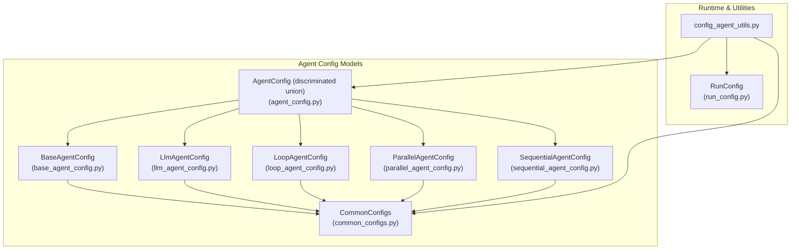
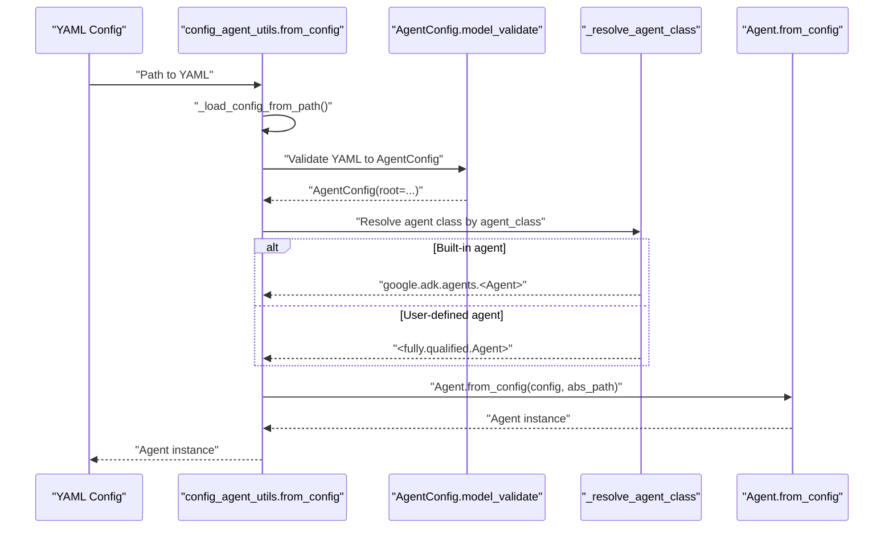
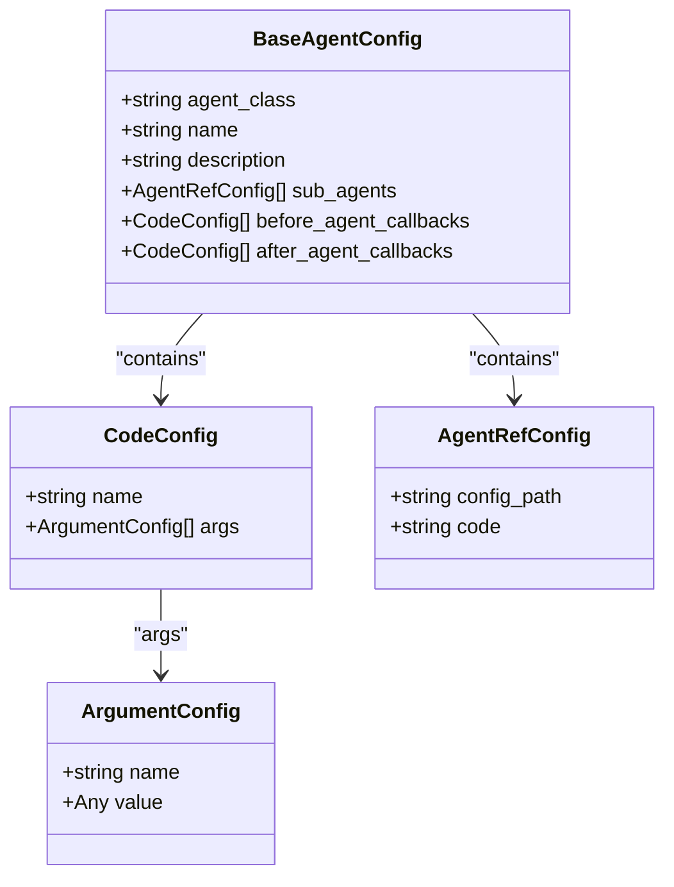
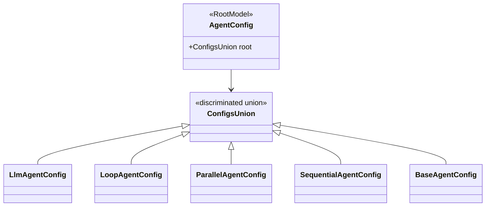
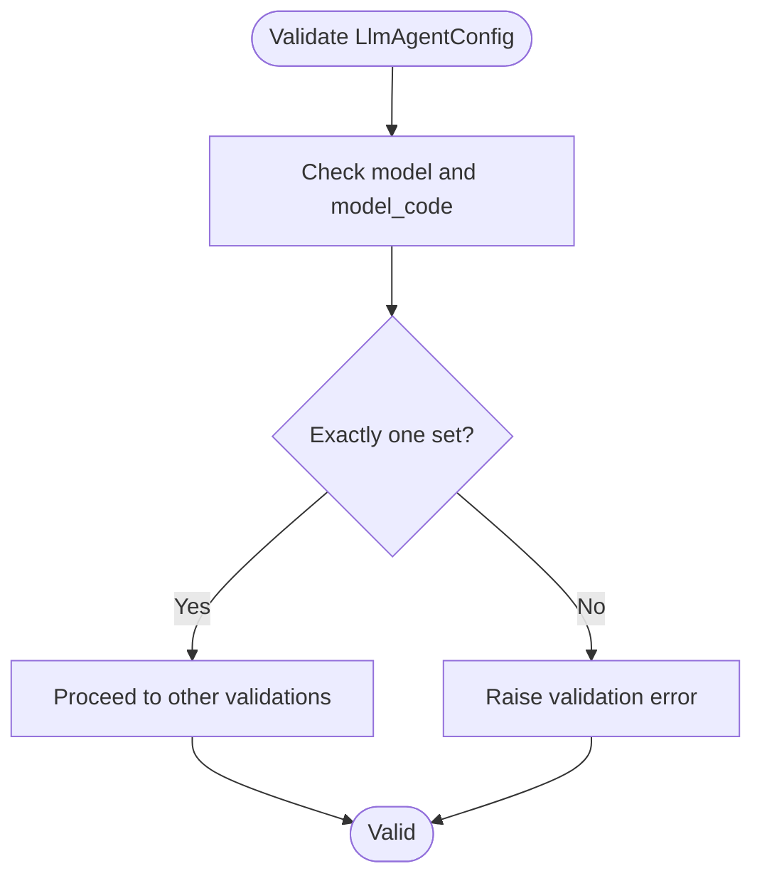
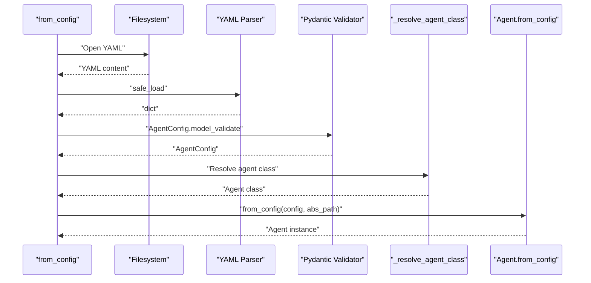
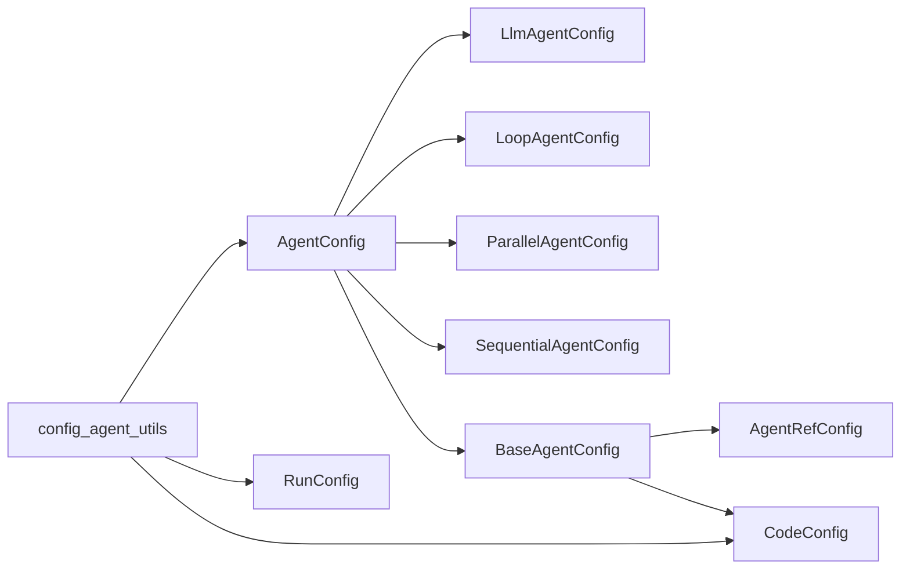

# Agent Configuration

<cite>
**Referenced Files in This Document**
- [base_agent_config.py](file://src/google/adk/agents/base_agent_config.py)
- [agent_config.py](file://src/google/adk/agents/agent_config.py)
- [common_configs.py](file://src/google/adk/agents/common_configs.py)
- [config_agent_utils.py](file://src/google/adk/agents/config_agent_utils.py)
- [llm_agent_config.py](file://src/google/adk/agents/llm_agent_config.py)
- [loop_agent_config.py](file://src/google/adk/agents/loop_agent_config.py)
- [parallel_agent_config.py](file://src/google/adk/agents/parallel_agent_config.py)
- [sequential_agent_config.py](file://src/google/adk/agents/sequential_agent_config.py)
- [run_config.py](file://src/google/adk/agents/run_config.py)
- [root_agent.yaml](file://contributing/samples/multi_agent_basic_config/root_agent.yaml)
- [code_tutor_agent.yaml](file://contributing/samples/multi_agent_basic_config/code_tutor_agent.yaml)
- [math_tutor_agent.yaml](file://contributing/samples/multi_agent_basic_config/math_tutor_agent.yaml)
- [root_agent.yaml](file://contributing/samples/core_basic_config/root_agent.yaml)
- [root_agent.yaml](file://contributing/samples/core_callback_config/root_agent.yaml)
- [callbacks.py](file://contributing/samples/core_callback_config/callbacks.py)
- [root_agent.yaml](file://contributing/samples/core_custom_agent_config/root_agent.yaml)
- [my_agents.py](file://contributing/samples/core_custom_agent_config/my_agents.py)
</cite>

## Table of Contents
1. [Introduction](#introduction)
2. [Project Structure](#project-structure)
3. [Core Components](#core-components)
4. [Architecture Overview](#architecture-overview)
5. [Detailed Component Analysis](#detailed-component-analysis)
6. [Dependency Analysis](#dependency-analysis)
7. [Performance Considerations](#performance-considerations)
8. [Troubleshooting Guide](#troubleshooting-guide)
9. [Conclusion](#conclusion)
10. [Appendices](#appendices)

## Introduction
This document explains how to configure agents in the ADK using both code-first and YAML-based approaches. It covers the BaseAgentConfig class and its specialized subclasses for different agent types, configuration validation, environment variable integration, and dynamic configuration loading. It also details the configuration parsing pipeline, how YAML configurations are converted into agent instances, and advanced patterns such as nested agents, callbacks, tool integrations, conditional configurations, and environment-specific settings. Guidance is included for configuration inheritance, overriding mechanisms, validation errors, debugging, and migration between configuration versions.

## Project Structure
Agent configuration spans several modules:
- Base configuration models and shared configuration primitives
- Discriminated union for agent types
- Utilities for loading, resolving references, and building agents from YAML
- Specialized agent configuration classes
- Runtime configuration for execution behavior

**Diagram sources**
- [agent_config.py](file://src/google/adk/agents/agent_config.py#L56-L74)
- [base_agent_config.py](file://src/google/adk/agents/base_agent_config.py#L38-L83)
- [llm_agent_config.py](file://src/google/adk/agents/llm_agent_config.py#L35-L231)
- [loop_agent_config.py](file://src/google/adk/agents/loop_agent_config.py#L30-L45)
- [parallel_agent_config.py](file://src/google/adk/agents/parallel_agent_config.py#L28-L41)
- [sequential_agent_config.py](file://src/google/adk/agents/sequential_agent_config.py#L28-L41)
- [common_configs.py](file://src/google/adk/agents/common_configs.py#L31-L146)
- [config_agent_utils.py](file://src/google/adk/agents/config_agent_utils.py#L34-L214)
- [run_config.py](file://src/google/adk/agents/run_config.py#L182-L352)

**Section sources**
- [agent_config.py](file://src/google/adk/agents/agent_config.py#L33-L74)
- [base_agent_config.py](file://src/google/adk/agents/base_agent_config.py#L37-L83)
- [common_configs.py](file://src/google/adk/agents/common_configs.py#L31-L146)
- [config_agent_utils.py](file://src/google/adk/agents/config_agent_utils.py#L34-L214)
- [run_config.py](file://src/google/adk/agents/run_config.py#L182-L352)

## Core Components
- BaseAgentConfig: Shared fields for all agent configurations (agent class identifier, name, description, sub-agents, and callback lists). Provides a discriminator hook for user-defined agent classes.
- CommonConfigs: Reusable primitives for configuration:
  - ArgumentConfig: Named or positional arguments for constructors/functions
  - CodeConfig: Fully-qualified name plus optional arguments to resolve to Python objects
  - AgentRefConfig: Reference to another agent via YAML path or code instance
- AgentConfig: Discriminated union over built-in agent types and BaseAgentConfig for user-defined agents.
- Specialized agent configs:
  - LlmAgentConfig: LLM selection (model or model_code), instruction/static_instruction, tools, input/output schemas, callbacks, and generation config
  - LoopAgentConfig: Iteration control
  - ParallelAgentConfig: Parallel composition
  - SequentialAgentConfig: Sequential composition

Key capabilities:
- Validation via Pydantic models and validators
- Dynamic resolution of callbacks and tools from CodeConfig
- Nested agent references via AgentRefConfig
- Discriminator-driven polymorphism for agent types

**Section sources**
- [base_agent_config.py](file://src/google/adk/agents/base_agent_config.py#L38-L83)
- [common_configs.py](file://src/google/adk/agents/common_configs.py#L31-L146)
- [agent_config.py](file://src/google/adk/agents/agent_config.py#L41-L74)
- [llm_agent_config.py](file://src/google/adk/agents/llm_agent_config.py#L35-L231)
- [loop_agent_config.py](file://src/google/adk/agents/loop_agent_config.py#L30-L45)
- [parallel_agent_config.py](file://src/google/adk/agents/parallel_agent_config.py#L28-L41)
- [sequential_agent_config.py](file://src/google/adk/agents/sequential_agent_config.py#L28-L41)

## Architecture Overview
The configuration pipeline converts YAML into typed models and then instantiates agents. The flow supports:
- Loading YAML and validating against AgentConfig
- Resolving agent class (built-in vs user-defined)
- Resolving sub-agents and callbacks
- Constructing agent instances with parsed configuration

**Diagram sources**
- [config_agent_utils.py](file://src/google/adk/agents/config_agent_utils.py#L35-L104)
- [agent_config.py](file://src/google/adk/agents/agent_config.py#L41-L74)

## Detailed Component Analysis

### BaseAgentConfig and CommonConfigs
BaseAgentConfig defines the foundational fields for agent configuration:
- agent_class: identifies the agent class (used by discriminator)
- name, description: identification and documentation
- sub_agents: list of AgentRefConfig entries for nested agents
- before_agent_callbacks, after_agent_callbacks: lists of CodeConfig for lifecycle hooks

CommonConfigs provide reusable structures:
- ArgumentConfig: supports named and positional arguments
- CodeConfig: resolves to a callable/class/function/instance
- AgentRefConfig: mutually exclusive config_path or code reference to another agent

**Diagram sources**
- [base_agent_config.py](file://src/google/adk/agents/base_agent_config.py#L38-L83)
- [common_configs.py](file://src/google/adk/agents/common_configs.py#L31-L146)

**Section sources**
- [base_agent_config.py](file://src/google/adk/agents/base_agent_config.py#L38-L83)
- [common_configs.py](file://src/google/adk/agents/common_configs.py#L31-L146)

### AgentConfig Discriminated Union
AgentConfig wraps a discriminated union over:
- LlmAgentConfig
- LoopAgentConfig
- ParallelAgentConfig
- SequentialAgentConfig
- BaseAgentConfig (for user-defined agents)

The discriminator selects the appropriate tag based on agent_class, defaulting to BaseAgent for unknown classes.

**Diagram sources**
- [agent_config.py](file://src/google/adk/agents/agent_config.py#L56-L74)

**Section sources**
- [agent_config.py](file://src/google/adk/agents/agent_config.py#L41-L74)

### LlmAgentConfig
LlmAgentConfig extends BaseAgentConfig with LLM-specific fields:
- model or model_code (mutually exclusive)
- instruction and static_instruction
- disallow_transfer_to_parent/peers
- input_schema, output_schema, output_key
- include_contents
- tools (via ToolConfig)
- before_model_callbacks, after_model_callbacks
- before_tool_callbacks, after_tool_callbacks
- generate_content_config

Validation ensures model/model_code exclusivity and handles legacy model mapping by migrating to model_code.

**Diagram sources**
- [llm_agent_config.py](file://src/google/adk/agents/llm_agent_config.py#L74-L98)

**Section sources**
- [llm_agent_config.py](file://src/google/adk/agents/llm_agent_config.py#L35-L231)

### LoopAgentConfig, ParallelAgentConfig, SequentialAgentConfig
- LoopAgentConfig: iteration control via max_iterations
- ParallelAgentConfig: parallel composition
- SequentialAgentConfig: sequential composition

These classes inherit from BaseAgentConfig and add minimal fields specific to their composition semantics.

**Section sources**
- [loop_agent_config.py](file://src/google/adk/agents/loop_agent_config.py#L30-L45)
- [parallel_agent_config.py](file://src/google/adk/agents/parallel_agent_config.py#L28-L41)
- [sequential_agent_config.py](file://src/google/adk/agents/sequential_agent_config.py#L28-L41)

### Configuration Parsing and Dynamic Loading
The parsing pipeline:
- Load YAML and validate via AgentConfig
- Resolve agent class by agent_class (built-in or fully-qualified)
- For BaseAgentConfig, re-validate to the concrete agent’s config_type
- Instantiate agent via Agent.from_config with absolute path for relative resource resolution

**Diagram sources**
- [config_agent_utils.py](file://src/google/adk/agents/config_agent_utils.py#L35-L104)

**Section sources**
- [config_agent_utils.py](file://src/google/adk/agents/config_agent_utils.py#L34-L214)

### Code-First Configuration
To configure agents programmatically:
- Define a custom agent class extending BaseAgent
- Define a matching config class extending BaseAgentConfig
- Set config_type on the agent class
- Implement _parse_config to map config fields to constructor/runtime parameters
- Instantiate the agent directly in code or via a CodeConfig reference

Example pattern references:
- Custom agent class and config: [my_agents.py](file://contributing/samples/core_custom_agent_config/my_agents.py#L41-L72)
- Referencing a custom agent in YAML: [root_agent.yaml](file://contributing/samples/core_custom_agent_config/root_agent.yaml#L1-L6)

**Section sources**
- [my_agents.py](file://contributing/samples/core_custom_agent_config/my_agents.py#L33-L72)
- [root_agent.yaml](file://contributing/samples/core_custom_agent_config/root_agent.yaml#L1-L6)

### YAML-Based Configuration
YAML examples demonstrate:
- Basic LLM agent configuration: [root_agent.yaml](file://contributing/samples/core_basic_config/root_agent.yaml#L1-L10)
- Multi-agent delegation with sub_agents: [root_agent.yaml](file://contributing/samples/multi_agent_basic_config/root_agent.yaml#L1-L18), [code_tutor_agent.yaml](file://contributing/samples/multi_agent_basic_config/code_tutor_agent.yaml#L1-L16), [math_tutor_agent.yaml](file://contributing/samples/multi_agent_basic_config/math_tutor_agent.yaml#L1-L16)
- Callbacks and tools: [root_agent.yaml](file://contributing/samples/core_callback_config/root_agent.yaml#L1-L44), [callbacks.py](file://contributing/samples/core_callback_config/callbacks.py#L1-L80)

**Section sources**
- [root_agent.yaml](file://contributing/samples/core_basic_config/root_agent.yaml#L1-L10)
- [root_agent.yaml](file://contributing/samples/multi_agent_basic_config/root_agent.yaml#L1-L18)
- [code_tutor_agent.yaml](file://contributing/samples/multi_agent_basic_config/code_tutor_agent.yaml#L1-L16)
- [math_tutor_agent.yaml](file://contributing/samples/multi_agent_basic_config/math_tutor_agent.yaml#L1-L16)
- [root_agent.yaml](file://contributing/samples/core_callback_config/root_agent.yaml#L1-L44)
- [callbacks.py](file://contributing/samples/core_callback_config/callbacks.py#L1-L80)

### Environment Variable Integration and Dynamic Loading
- Environment variables can influence runtime behavior via RunConfig (e.g., streaming modes, thread pools, and related flags). While not part of BaseAgentConfig, RunConfig governs execution behavior during agent runs.
- Dynamic loading uses fully-qualified names resolved at runtime via importlib. This enables referencing custom agents and callbacks from YAML.

References:
- RunConfig streaming modes and thread pool configuration: [run_config.py](file://src/google/adk/agents/run_config.py#L182-L352)
- Fully-qualified name resolution: [config_agent_utils.py](file://src/google/adk/agents/config_agent_utils.py#L107-L114)

**Section sources**
- [run_config.py](file://src/google/adk/agents/run_config.py#L182-L352)
- [config_agent_utils.py](file://src/google/adk/agents/config_agent_utils.py#L107-L114)

### Configuration Validation and Error Handling
- Pydantic validators enforce mutual exclusivity (e.g., model vs model_code) and presence of required fields
- Validation errors surface as Pydantic ValidationError or ValueError during YAML load or class resolution
- Utility functions validate AgentRefConfig to ensure exactly one of config_path or code is provided

Common validation checks:
- Exactly one of config_path or code in AgentRefConfig
- Mutually exclusive model/model_code in LlmAgentConfig
- Required fields present in BaseAgentConfig and specialized configs

**Section sources**
- [common_configs.py](file://src/google/adk/agents/common_configs.py#L133-L146)
- [llm_agent_config.py](file://src/google/adk/agents/llm_agent_config.py#L93-L98)
- [config_agent_utils.py](file://src/google/adk/agents/config_agent_utils.py#L130-L143)

### Configuration Inheritance and Overriding
- Sub-agent references via AgentRefConfig allow composition and reuse
- Relative paths in AgentRefConfig are resolved against the referencing agent’s absolute config path
- For user-defined agents, BaseAgentConfig can be extended; the discriminator selects the concrete config_type at runtime

Practical tips:
- Use sub_agents to compose complex workflows
- Keep shared configuration in referenced YAML files and override per-delegation via fields in the parent agent
- For custom agents, define a dedicated config class and register it via agent_class

**Section sources**
- [base_agent_config.py](file://src/google/adk/agents/base_agent_config.py#L62-L64)
- [common_configs.py](file://src/google/adk/agents/common_configs.py#L86-L146)
- [config_agent_utils.py](file://src/google/adk/agents/config_agent_utils.py#L117-L143)

### Advanced Patterns: Nested Agents, Callbacks, Tools
- Nested agents: Use sub_agents with AgentRefConfig to embed child agents defined in separate YAML files or code instances
- Callbacks: Configure before/after hooks at agent, model, and tool levels via CodeConfig references
- Tools: Reference built-in or custom tools by name; optionally construct tools via functions with ArgumentConfig

Examples:
- Multi-agent delegation: [root_agent.yaml](file://contributing/samples/multi_agent_basic_config/root_agent.yaml#L15-L18)
- Callbacks and tools: [root_agent.yaml](file://contributing/samples/core_callback_config/root_agent.yaml#L21-L43), [callbacks.py](file://contributing/samples/core_callback_config/callbacks.py#L1-L80)

**Section sources**
- [root_agent.yaml](file://contributing/samples/multi_agent_basic_config/root_agent.yaml#L15-L18)
- [root_agent.yaml](file://contributing/samples/core_callback_config/root_agent.yaml#L21-L43)
- [callbacks.py](file://contributing/samples/core_callback_config/callbacks.py#L1-L80)

### Conditional Configurations and Environment-Specific Settings
- Use environment variables to toggle features at runtime (e.g., streaming modes, thread pool behavior) via RunConfig
- Split configuration into environment-specific YAML fragments and merge or select at deployment time
- Prefer CodeConfig for environment-dependent factories to defer instantiation until runtime

References:
- RunConfig streaming and thread pool controls: [run_config.py](file://src/google/adk/agents/run_config.py#L220-L298)

**Section sources**
- [run_config.py](file://src/google/adk/agents/run_config.py#L220-L298)

### Migration Between Configuration Versions
- Legacy model mapping: LlmAgentConfig migrates legacy model dicts to model_code automatically and logs a warning
- Maintain backward compatibility by normalizing older shapes into current fields
- When introducing new fields, keep validators that preserve existing behavior while guiding migration

**Section sources**
- [llm_agent_config.py](file://src/google/adk/agents/llm_agent_config.py#L74-L91)

## Dependency Analysis
The configuration system exhibits low coupling and high cohesion:
- AgentConfig depends on specialized config classes via a discriminator
- BaseAgentConfig composes common primitives (AgentRefConfig, CodeConfig)
- config_agent_utils orchestrates loading, resolution, and instantiation
- RunConfig is orthogonal to configuration models and governs runtime behavior

**Diagram sources**
- [agent_config.py](file://src/google/adk/agents/agent_config.py#L56-L74)
- [base_agent_config.py](file://src/google/adk/agents/base_agent_config.py#L62-L83)
- [common_configs.py](file://src/google/adk/agents/common_configs.py#L86-L146)
- [config_agent_utils.py](file://src/google/adk/agents/config_agent_utils.py#L34-L214)
- [run_config.py](file://src/google/adk/agents/run_config.py#L182-L352)

**Section sources**
- [agent_config.py](file://src/google/adk/agents/agent_config.py#L56-L74)
- [base_agent_config.py](file://src/google/adk/agents/base_agent_config.py#L62-L83)
- [common_configs.py](file://src/google/adk/agents/common_configs.py#L86-L146)
- [config_agent_utils.py](file://src/google/adk/agents/config_agent_utils.py#L34-L214)
- [run_config.py](file://src/google/adk/agents/run_config.py#L182-L352)

## Performance Considerations
- Validation occurs once per YAML load; keep configuration structures concise
- Using CodeConfig for tool and callback resolution defers imports until needed
- For heavy tool execution, consider RunConfig’s tool_thread_pool_config to maintain responsiveness
- Avoid excessive nesting of sub-agents; prefer composition with explicit boundaries

[No sources needed since this section provides general guidance]

## Troubleshooting Guide
Common issues and resolutions:
- Invalid agent class: Ensure agent_class resolves to a subclass of BaseAgent
  - Reference: [config_agent_utils.py](file://src/google/adk/agents/config_agent_utils.py#L67-L80)
- Missing or conflicting fields:
  - model vs model_code must be mutually exclusive in LlmAgentConfig
  - Reference: [llm_agent_config.py](file://src/google/adk/agents/llm_agent_config.py#L93-L98)
- Invalid AgentRefConfig: Provide exactly one of config_path or code
  - Reference: [common_configs.py](file://src/google/adk/agents/common_configs.py#L133-L146)
- Callback/tool resolution failures: Verify fully-qualified names and that referenced objects are importable
  - References: [config_agent_utils.py](file://src/google/adk/agents/config_agent_utils.py#L175-L201), [common_configs.py](file://src/google/adk/agents/common_configs.py#L48-L83)
- YAML load errors: Confirm file exists and is valid YAML
  - Reference: [config_agent_utils.py](file://src/google/adk/agents/config_agent_utils.py#L83-L103)

**Section sources**
- [config_agent_utils.py](file://src/google/adk/agents/config_agent_utils.py#L67-L80)
- [llm_agent_config.py](file://src/google/adk/agents/llm_agent_config.py#L93-L98)
- [common_configs.py](file://src/google/adk/agents/common_configs.py#L133-L146)
- [config_agent_utils.py](file://src/google/adk/agents/config_agent_utils.py#L175-L201)
- [config_agent_utils.py](file://src/google/adk/agents/config_agent_utils.py#L83-L103)

## Conclusion
ADK’s agent configuration system combines strong validation, flexible composition, and dynamic resolution to support both code-first and YAML-based development. BaseAgentConfig and specialized subclasses provide a robust foundation, while the discriminated union and resolver utilities enable extensibility and runtime flexibility. By leveraging sub-agents, callbacks, and tools, teams can build complex, maintainable agent workflows. Following the best practices outlined here will help ensure reliable configuration, easy debugging, and smooth migrations.

[No sources needed since this section summarizes without analyzing specific files]

## Appendices

### Best Practices for Organizing Configurations
- Separate concerns: keep agent definitions, tools, and callbacks in distinct files
- Use sub_agents for modular composition; reference via AgentRefConfig
- Prefer CodeConfig for environment-dependent factories
- Keep shared defaults in referenced YAML files and override per-use
- Document agent_class and field meanings for maintainability

[No sources needed since this section provides general guidance]