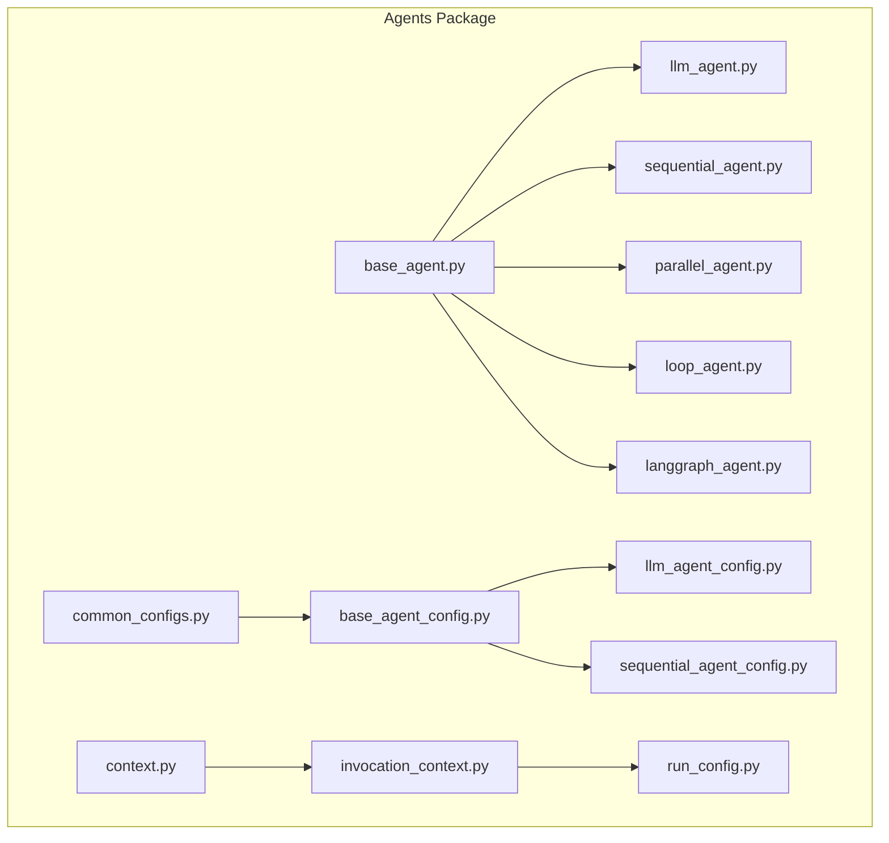
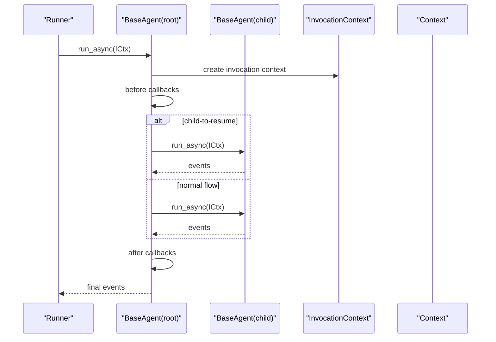
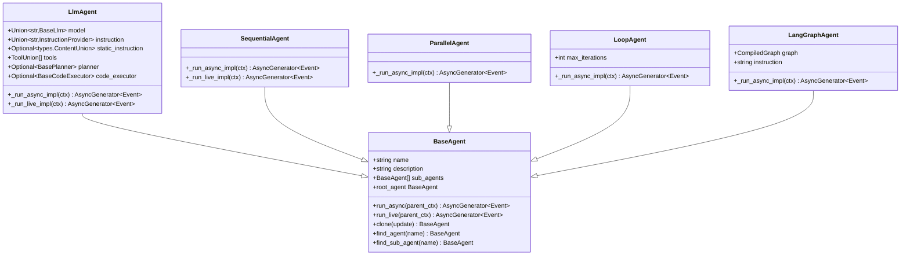
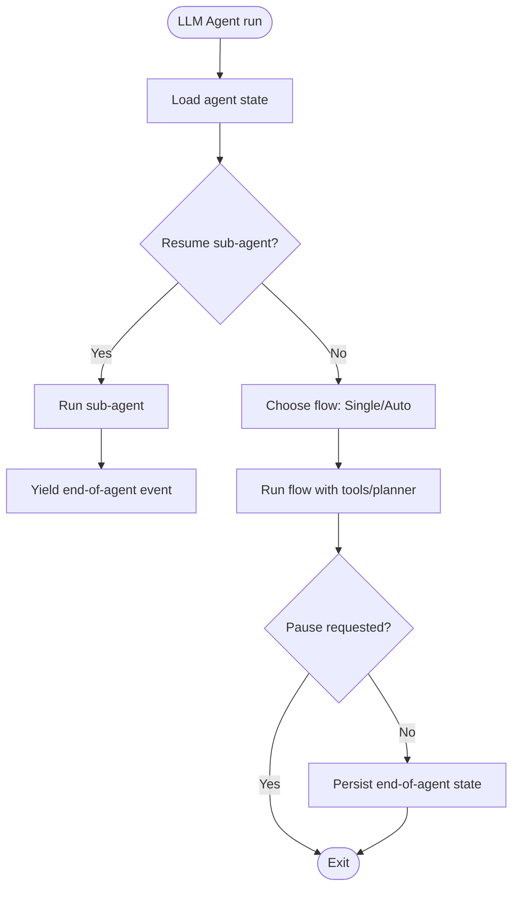
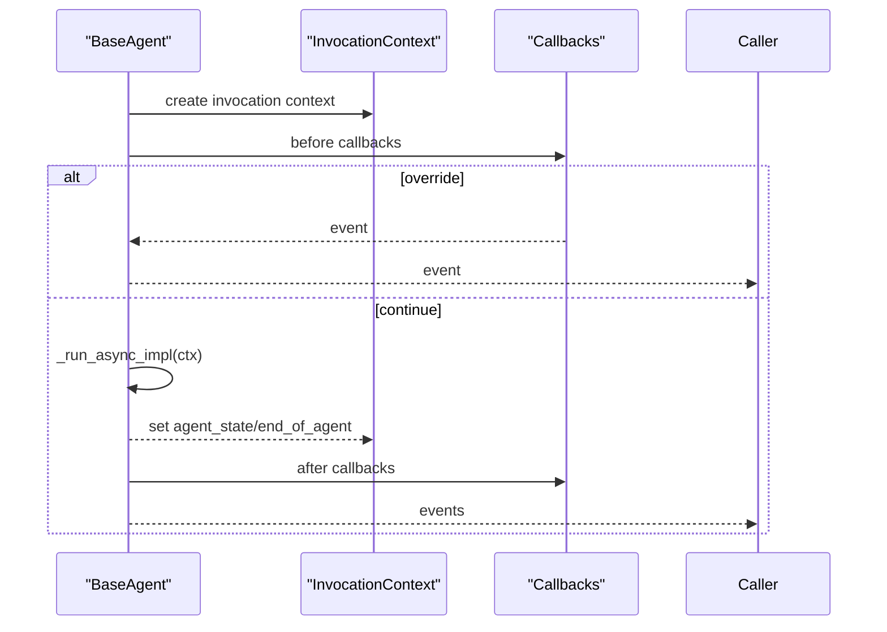
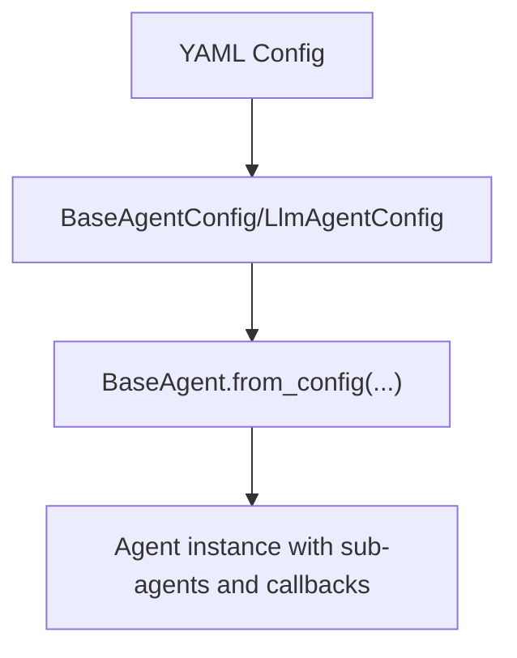
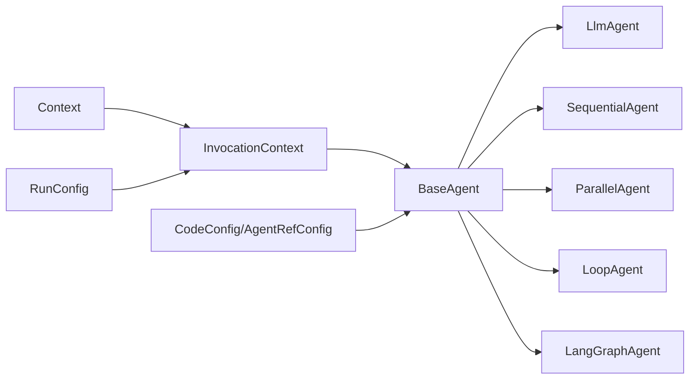

# Agent Development

<cite>
**Referenced Files in This Document**
- [agents/__init__.py](file://src/google/adk/agents/__init__.py)
- [base_agent.py](file://src/google/adk/agents/base_agent.py)
- [llm_agent.py](file://src/google/adk/agents/llm_agent.py)
- [sequential_agent.py](file://src/google/adk/agents/sequential_agent.py)
- [parallel_agent.py](file://src/google/adk/agents/parallel_agent.py)
- [loop_agent.py](file://src/google/adk/agents/loop_agent.py)
- [langgraph_agent.py](file://src/google/adk/agents/langgraph_agent.py)
- [base_agent_config.py](file://src/google/adk/agents/base_agent_config.py)
- [llm_agent_config.py](file://src/google/adk/agents/llm_agent_config.py)
- [sequential_agent_config.py](file://src/google/adk/agents/sequential_agent_config.py)
- [context.py](file://src/google/adk/agents/context.py)
- [invocation_context.py](file://src/google/adk/agents/invocation_context.py)
- [run_config.py](file://src/google/adk/agents/run_config.py)
- [common_configs.py](file://src/google/adk/agents/common_configs.py)
</cite>

## Table of Contents
1. [Introduction](#introduction)
2. [Project Structure](#project-structure)
3. [Core Components](#core-components)
4. [Architecture Overview](#architecture-overview)
5. [Detailed Component Analysis](#detailed-component-analysis)
6. [Dependency Analysis](#dependency-analysis)
7. [Performance Considerations](#performance-considerations)
8. [Troubleshooting Guide](#troubleshooting-guide)
9. [Conclusion](#conclusion)
10. [Appendices](#appendices)

## Introduction
This document explains how to develop agents in the Agent Development Kit (ADK). It covers agent types (LLM agents, sequential agents, parallel agents, loop agents, and LangGraph agents), the base agent classes and inheritance hierarchy, configuration patterns (code-first and YAML-based), lifecycle management, context handling, state persistence, composition strategies for multi-agent systems, orchestration and inter-agent communication, validation and environment integration, and deployment considerations. Practical examples are provided via file references to real-world samples in the repository.

## Project Structure
ADK organizes agent capabilities under the agents package. Key modules include base classes, agent implementations, configuration schemas, context and invocation models, and runtime configuration.

**Diagram sources**
- [base_agent.py](file://src/google/adk/agents/base_agent.py#L86-L120)
- [llm_agent.py](file://src/google/adk/agents/llm_agent.py#L187-L206)
- [sequential_agent.py](file://src/google/adk/agents/sequential_agent.py#L48-L52)
- [parallel_agent.py](file://src/google/adk/agents/parallel_agent.py#L150-L161)
- [loop_agent.py](file://src/google/adk/agents/loop_agent.py#L52-L60)
- [langgraph_agent.py](file://src/google/adk/agents/langgraph_agent.py#L52-L62)
- [base_agent_config.py](file://src/google/adk/agents/base_agent_config.py#L38-L64)
- [llm_agent_config.py](file://src/google/adk/agents/llm_agent_config.py#L35-L52)
- [sequential_agent_config.py](file://src/google/adk/agents/sequential_agent_config.py#L28-L40)
- [context.py](file://src/google/adk/agents/context.py#L41-L108)
- [invocation_context.py](file://src/google/adk/agents/invocation_context.py#L100-L144)
- [run_config.py](file://src/google/adk/agents/run_config.py#L182-L191)
- [common_configs.py](file://src/google/adk/agents/common_configs.py#L31-L83)

**Section sources**
- [agents/__init__.py](file://src/google/adk/agents/__init__.py#L15-L41)

## Core Components
- BaseAgent: The foundational class for all agents. Provides lifecycle hooks, callbacks, cloning, traversal helpers, and state persistence via InvocationContext.
- LlmAgent: An LLM-driven agent supporting instructions, tools, schemas, planner, code execution, and transfer controls.
- SequentialAgent: Executes sub-agents in sequence, with resumable state.
- ParallelAgent: Runs sub-agents concurrently with isolated branches and controlled merging.
- LoopAgent: Iteratively runs sub-agents up to a configurable maximum iteration count or until escalation.
- LangGraphAgent: Integrates with LangGraph CompiledGraph for multi-turn conversations with optional checkpointer-backed state.
- Context and InvocationContext: Provide runtime context, state deltas, artifacts, credentials, memory, and resumability controls.
- RunConfig: Controls streaming, live mode, limits, and tool execution behavior.
- Configuration schemas: BaseAgentConfig and specialized configs (LlmAgentConfig, SequentialAgentConfig) define YAML schemas and validation.

**Section sources**
- [base_agent.py](file://src/google/adk/agents/base_agent.py#L86-L120)
- [llm_agent.py](file://src/google/adk/agents/llm_agent.py#L187-L206)
- [sequential_agent.py](file://src/google/adk/agents/sequential_agent.py#L48-L52)
- [parallel_agent.py](file://src/google/adk/agents/parallel_agent.py#L150-L161)
- [loop_agent.py](file://src/google/adk/agents/loop_agent.py#L52-L60)
- [langgraph_agent.py](file://src/google/adk/agents/langgraph_agent.py#L52-L62)
- [context.py](file://src/google/adk/agents/context.py#L41-L108)
- [invocation_context.py](file://src/google/adk/agents/invocation_context.py#L100-L144)
- [run_config.py](file://src/google/adk/agents/run_config.py#L182-L191)
- [base_agent_config.py](file://src/google/adk/agents/base_agent_config.py#L38-L64)
- [llm_agent_config.py](file://src/google/adk/agents/llm_agent_config.py#L35-L52)
- [sequential_agent_config.py](file://src/google/adk/agents/sequential_agent_config.py#L28-L40)

## Architecture Overview
The agent runtime centers around InvocationContext, which carries session state, resumability flags, and agent-specific state. BaseAgent orchestrates run_async and run_live lifecycles, invoking subclass-specific implementations and managing before/after callbacks. LlmAgent composes flows, tools, and schemas; SequentialAgent and LoopAgent manage ordered execution; ParallelAgent coordinates concurrent runs; LangGraphAgent bridges to LangGraph.

**Diagram sources**
- [base_agent.py](file://src/google/adk/agents/base_agent.py#L274-L335)
- [invocation_context.py](file://src/google/adk/agents/invocation_context.py#L100-L144)
- [context.py](file://src/google/adk/agents/context.py#L41-L108)

## Detailed Component Analysis

### Base Agent Classes and Inheritance
- BaseAgent defines the contract for all agents, including lifecycle methods, callbacks, cloning, parent/sub-agent relationships, and state persistence helpers.
- Derived agents override _run_async_impl and optionally _run_live_impl to implement behavior.

**Diagram sources**
- [base_agent.py](file://src/google/adk/agents/base_agent.py#L86-L120)
- [llm_agent.py](file://src/google/adk/agents/llm_agent.py#L187-L206)
- [sequential_agent.py](file://src/google/adk/agents/sequential_agent.py#L48-L52)
- [parallel_agent.py](file://src/google/adk/agents/parallel_agent.py#L150-L161)
- [loop_agent.py](file://src/google/adk/agents/loop_agent.py#L52-L60)
- [langgraph_agent.py](file://src/google/adk/agents/langgraph_agent.py#L52-L62)

**Section sources**
- [base_agent.py](file://src/google/adk/agents/base_agent.py#L86-L120)
- [llm_agent.py](file://src/google/adk/agents/llm_agent.py#L187-L206)
- [sequential_agent.py](file://src/google/adk/agents/sequential_agent.py#L48-L52)
- [parallel_agent.py](file://src/google/adk/agents/parallel_agent.py#L150-L161)
- [loop_agent.py](file://src/google/adk/agents/loop_agent.py#L52-L60)
- [langgraph_agent.py](file://src/google/adk/agents/langgraph_agent.py#L52-L62)

### LLM Agent
- Capabilities: dynamic/static instructions, tools, schemas, planner, code execution, transfer controls, callbacks, and content inclusion policy.
- Execution: chooses between SingleFlow and AutoFlow depending on configuration and sub-agent presence.
- State handling: resumes from last transfer or continuation; persists end-of-agent markers.

**Diagram sources**
- [llm_agent.py](file://src/google/adk/agents/llm_agent.py#L458-L497)
- [invocation_context.py](file://src/google/adk/agents/invocation_context.py#L232-L263)

**Section sources**
- [llm_agent.py](file://src/google/adk/agents/llm_agent.py#L187-L206)
- [llm_agent.py](file://src/google/adk/agents/llm_agent.py#L458-L497)
- [llm_agent.py](file://src/google/adk/agents/llm_agent.py#L708-L718)

### Sequential Agent
- Executes sub-agents in order, persisting current sub-agent index and emitting end-of-agent events when complete.
- Live mode augments LlmAgent sub-agents with a task completion function to signal handoff.

**Section sources**
- [sequential_agent.py](file://src/google/adk/agents/sequential_agent.py#L48-L93)
- [sequential_agent.py](file://src/google/adk/agents/sequential_agent.py#L119-L160)

### Parallel Agent
- Runs sub-agents concurrently with isolated branches and merges events with backpressure.
- Supports Python 3.11+ TaskGroup and pre-3.11 compatibility with custom cancellation handling.

**Section sources**
- [parallel_agent.py](file://src/google/adk/agents/parallel_agent.py#L150-L210)

### Loop Agent
- Iterates over sub-agents up to max_iterations or until escalation; resets sub-agent states per iteration.

**Section sources**
- [loop_agent.py](file://src/google/adk/agents/loop_agent.py#L52-L124)
- [loop_agent.py](file://src/google/adk/agents/loop_agent.py#L125-L146)

### LangGraph Agent
- Bridges ADK events to LangGraph messages; supports single/multi-turn via graph state and optional checkpointer.

**Section sources**
- [langgraph_agent.py](file://src/google/adk/agents/langgraph_agent.py#L52-L101)
- [langgraph_agent.py](file://src/google/adk/agents/langgraph_agent.py#L103-L144)

### Base Agent Lifecycle and State Persistence
- BaseAgent.run_async and run_live orchestrate before/after callbacks and delegate to _run_async_impl/_run_live_impl.
- InvocationContext manages agent_states, end_of_agents, resumability, and pause decisions.
- BaseAgent persists state via EventActions and reads it back to resume execution.

**Diagram sources**
- [base_agent.py](file://src/google/adk/agents/base_agent.py#L274-L335)
- [base_agent.py](file://src/google/adk/agents/base_agent.py#L434-L549)
- [invocation_context.py](file://src/google/adk/agents/invocation_context.py#L232-L263)

**Section sources**
- [base_agent.py](file://src/google/adk/agents/base_agent.py#L274-L335)
- [base_agent.py](file://src/google/adk/agents/base_agent.py#L434-L549)
- [invocation_context.py](file://src/google/adk/agents/invocation_context.py#L232-L263)

### Context and Invocation Context
- Context extends ReadonlyContext and adds mutable state, artifacts, credentials, memory, and tool confirmation helpers.
- InvocationContext encapsulates session, resumability, agent state, and runtime controls like LLM call limits.

**Section sources**
- [context.py](file://src/google/adk/agents/context.py#L41-L108)
- [context.py](file://src/google/adk/agents/context.py#L114-L198)
- [context.py](file://src/google/adk/agents/context.py#L203-L272)
- [context.py](file://src/google/adk/agents/context.py#L313-L413)
- [invocation_context.py](file://src/google/adk/agents/invocation_context.py#L100-L144)
- [invocation_context.py](file://src/google/adk/agents/invocation_context.py#L224-L231)
- [invocation_context.py](file://src/google/adk/agents/invocation_context.py#L336-L362)
- [invocation_context.py](file://src/google/adk/agents/invocation_context.py#L363-L397)

### Configuration Patterns
- Code-first: Instantiate agents directly (e.g., LlmAgent) and compose sub-agents.
- YAML-based: Define agents with BaseAgentConfig and specialized configs; resolve references and callbacks via BaseAgent.from_config.

**Diagram sources**
- [base_agent_config.py](file://src/google/adk/agents/base_agent_config.py#L38-L64)
- [llm_agent_config.py](file://src/google/adk/agents/llm_agent_config.py#L35-L52)
- [base_agent.py](file://src/google/adk/agents/base_agent.py#L625-L645)
- [common_configs.py](file://src/google/adk/agents/common_configs.py#L48-L83)

**Section sources**
- [base_agent.py](file://src/google/adk/agents/base_agent.py#L625-L645)
- [base_agent_config.py](file://src/google/adk/agents/base_agent_config.py#L38-L64)
- [llm_agent_config.py](file://src/google/adk/agents/llm_agent_config.py#L35-L52)
- [sequential_agent_config.py](file://src/google/adk/agents/sequential_agent_config.py#L28-L40)
- [common_configs.py](file://src/google/adk/agents/common_configs.py#L48-L83)

### Orchestration, Inter-Agent Communication, and Coordination
- Transfer control: LlmAgent supports disallow_transfer flags and transfer resolution to resume sub-agents.
- Branch isolation: ParallelAgent creates isolated branches for sub-agents to prevent cross-contamination of conversation history.
- Escalation: LoopAgent stops on escalation or max iterations.
- LangGraph integration: LangGraphAgent translates events/messages and supports checkpointer-backed multi-turn.

**Section sources**
- [llm_agent.py](file://src/google/adk/agents/llm_agent.py#L708-L718)
- [llm_agent.py](file://src/google/adk/agents/llm_agent.py#L719-L762)
- [parallel_agent.py](file://src/google/adk/agents/parallel_agent.py#L35-L48)
- [loop_agent.py](file://src/google/adk/agents/loop_agent.py#L103-L106)
- [langgraph_agent.py](file://src/google/adk/agents/langgraph_agent.py#L64-L101)

### Environment Variables and Deployment Considerations
- Streaming behavior and progressive SSE streaming are controlled by environment variables referenced in RunConfig documentation.
- Live agent features (speech, transcription, session resumption) are configured via RunConfig and InvocationContext.
- Tool thread pools and LLM call limits are configurable to balance performance and safety.

**Section sources**
- [run_config.py](file://src/google/adk/agents/run_config.py#L52-L179)
- [run_config.py](file://src/google/adk/agents/run_config.py#L182-L352)
- [invocation_context.py](file://src/google/adk/agents/invocation_context.py#L47-L98)

## Dependency Analysis
- Cohesion: Each agent type encapsulates a single responsibility (LLM reasoning, sequencing, concurrency, looping, LangGraph).
- Coupling: Agents depend on BaseAgent and InvocationContext; LlmAgent additionally depends on flows, tools, and planners.
- External integrations: LangGraphAgent integrates with CompiledGraph; artifacts/memory/credentials accessed via services from Context.

**Diagram sources**
- [base_agent.py](file://src/google/adk/agents/base_agent.py#L86-L120)
- [llm_agent.py](file://src/google/adk/agents/llm_agent.py#L187-L206)
- [sequential_agent.py](file://src/google/adk/agents/sequential_agent.py#L48-L52)
- [parallel_agent.py](file://src/google/adk/agents/parallel_agent.py#L150-L161)
- [loop_agent.py](file://src/google/adk/agents/loop_agent.py#L52-L60)
- [langgraph_agent.py](file://src/google/adk/agents/langgraph_agent.py#L52-L62)
- [invocation_context.py](file://src/google/adk/agents/invocation_context.py#L100-L144)
- [context.py](file://src/google/adk/agents/context.py#L41-L108)
- [run_config.py](file://src/google/adk/agents/run_config.py#L182-L191)
- [common_configs.py](file://src/google/adk/agents/common_configs.py#L48-L83)

**Section sources**
- [base_agent.py](file://src/google/adk/agents/base_agent.py#L86-L120)
- [invocation_context.py](file://src/google/adk/agents/invocation_context.py#L100-L144)
- [context.py](file://src/google/adk/agents/context.py#L41-L108)
- [run_config.py](file://src/google/adk/agents/run_config.py#L182-L191)
- [common_configs.py](file://src/google/adk/agents/common_configs.py#L48-L83)

## Performance Considerations
- Concurrency: ParallelAgent uses TaskGroup on Python 3.11+ for efficient merging; pre-3.11 uses custom cancellation handling.
- Streaming: SSE streaming enables progressive rendering; progressive mode controlled by environment variables.
- Tool execution: Use ToolThreadPoolConfig to offload blocking I/O and keep the event loop responsive.
- Resumability: Proper use of agent_state and end_of_agent avoids redundant computation and improves throughput.

[No sources needed since this section provides general guidance]

## Troubleshooting Guide
- Agent name validation: Names must be valid Python identifiers and not "user".
- Duplicate sub-agent names: Detected and logged; ensure unique names.
- Missing sub-agent for transfer: LlmAgent raises descriptive errors when referenced agent is not found.
- LLM call limits: Exceeding max_llm_calls raises an error; tune RunConfig.max_llm_calls appropriately.
- Pause vs end: should_pause_invocation distinguishes pausing for resumption versus ending an invocation.

**Section sources**
- [base_agent.py](file://src/google/adk/agents/base_agent.py#L555-L570)
- [base_agent.py](file://src/google/adk/agents/base_agent.py#L572-L610)
- [llm_agent.py](file://src/google/adk/agents/llm_agent.py#L764-L782)
- [invocation_context.py](file://src/google/adk/agents/invocation_context.py#L314-L325)
- [invocation_context.py](file://src/google/adk/agents/invocation_context.py#L363-L397)

## Conclusion
ADK provides a robust, extensible foundation for building agents. BaseAgent establishes a consistent lifecycle and state model; specialized agents encapsulate common orchestration patterns. Configuration supports both code-first and YAML-based development. Context and InvocationContext deliver runtime capabilities for artifacts, credentials, memory, and resumability. With careful attention to streaming, concurrency, and limits, developers can build scalable, maintainable multi-agent systems.

[No sources needed since this section summarizes without analyzing specific files]

## Appendices

### Practical Examples and Samples
- Multi-agent basics: root and sub-agent YAML configs demonstrate composition and references.
- Sequential and parallel workflows: YAML configs show how to wire agents in sequence and parallel.
- Loop-based writers: multi-turn writer agents with escalation and iteration control.
- LLM agent configuration: YAML-based LLM agent with tools, schemas, and callbacks.

Refer to the samples directory for concrete YAML and Python agent definitions.

[No sources needed since this section lists existing samples without analyzing specific files]