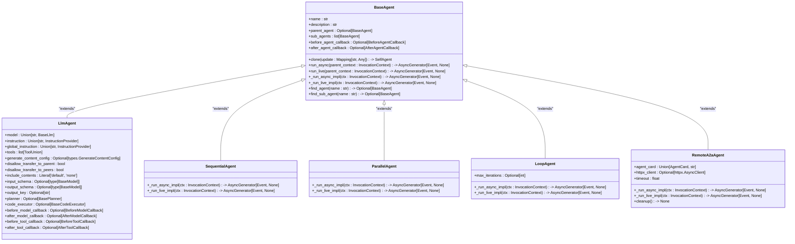
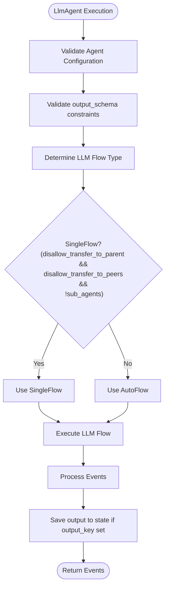
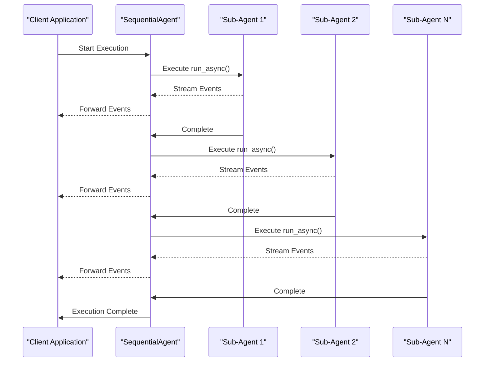
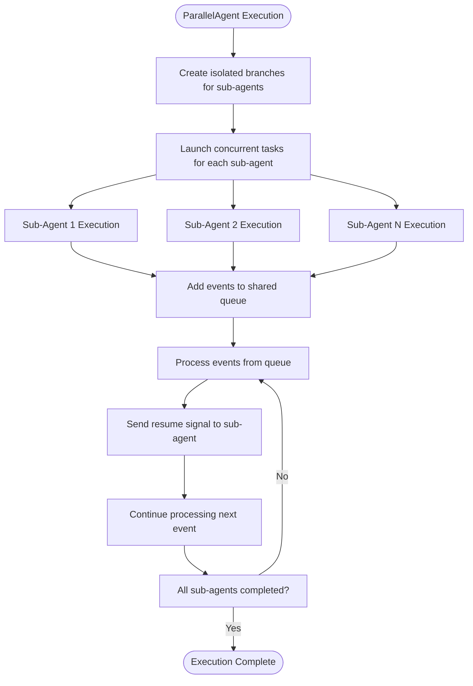
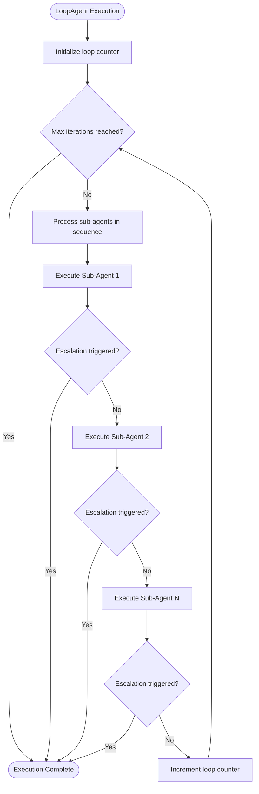
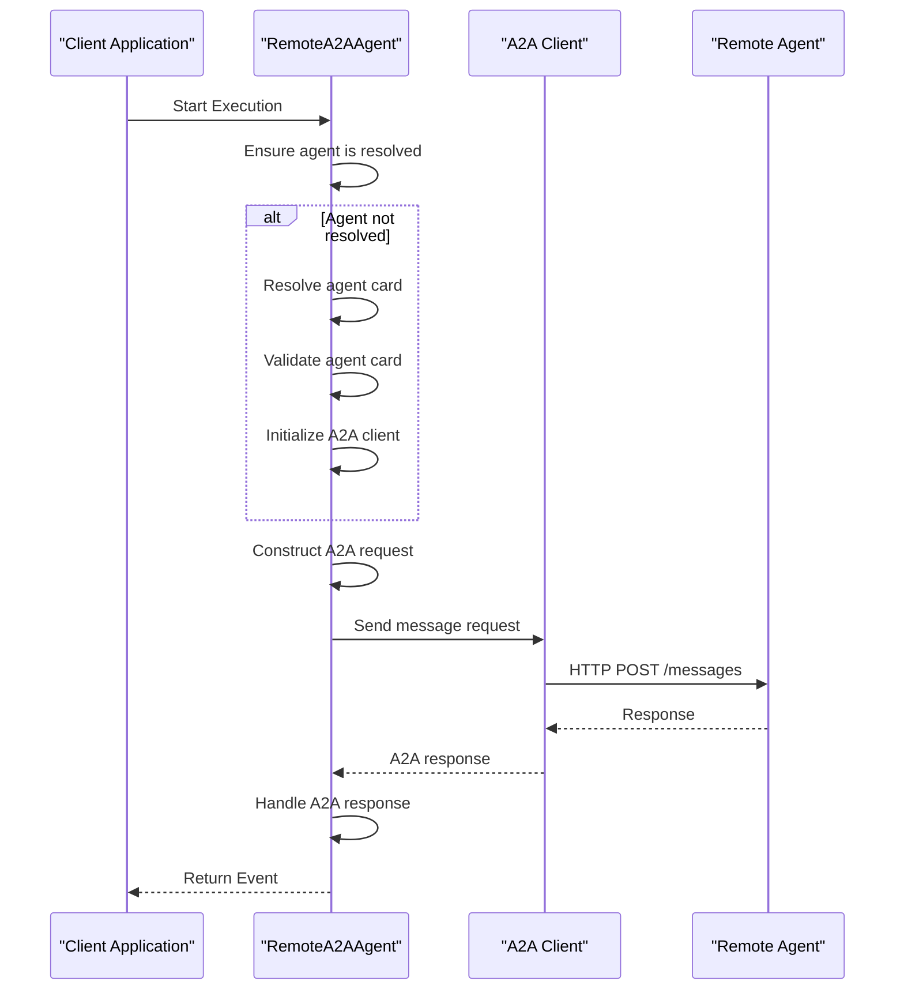
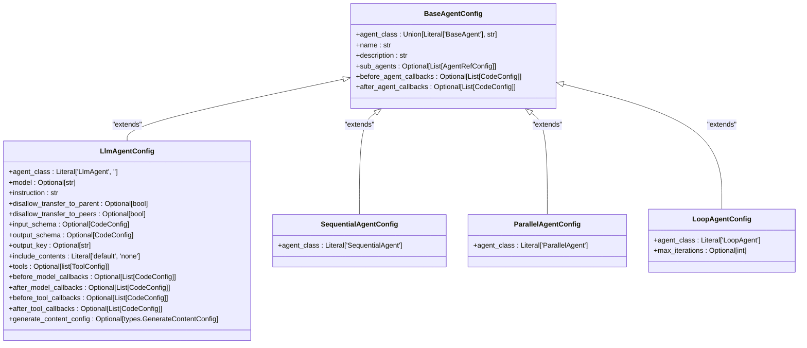

# Agent Development

<cite>
**Referenced Files in This Document**   
- [base_agent.py](file://src/google/adk/agents/base_agent.py)
- [llm_agent.py](file://src/google/adk/agents/llm_agent.py)
- [sequential_agent.py](file://src/google/adk/agents/sequential_agent.py)
- [parallel_agent.py](file://src/google/adk/agents/parallel_agent.py)
- [loop_agent.py](file://src/google/adk/agents/loop_agent.py)
- [remote_a2a_agent.py](file://src/google/adk/agents/remote_a2a_agent.py)
- [base_agent_config.py](file://src/google/adk/agents/base_agent_config.py)
- [llm_agent_config.py](file://src/google/adk/agents/llm_agent_config.py)
- [sequential_agent_config.py](file://src/google/adk/agents/sequential_agent_config.py)
- [parallel_agent_config.py](file://src/google/adk/agents/parallel_agent_config.py)
- [loop_agent_config.py](file://src/google/adk/agents/loop_agent_config.py)
</cite>

## Table of Contents
1. [Introduction](#introduction)
2. [Agent Architecture Overview](#agent-architecture-overview)
3. [Core Agent Types](#core-agent-types)
4. [LlmAgent Implementation](#llmagent-implementation)
5. [SequentialAgent Implementation](#sequentialagent-implementation)
6. [ParallelAgent Implementation](#parallelagent-implementation)
7. [LoopAgent Implementation](#loopagent-implementation)
8. [RemoteA2AAgent Implementation](#remotea2aagent-implementation)
9. [Configuration and Inheritance](#configuration-and-inheritance)
10. [Development Best Practices](#development-best-practices)

## Introduction

The Agent Development Kit (ADK) framework provides a comprehensive architecture for creating AI agents with various processing patterns and capabilities. This document details the agent development framework, focusing on the different agent types, their architectural patterns, implementation details, and configuration methods. The ADK framework enables developers to create sophisticated AI systems through a hierarchy of agent classes that inherit from a common base class, each designed for specific use cases and processing requirements.

The framework supports multiple agent types including LlmAgent for single-model interactions, SequentialAgent for step-by-step processing, ParallelAgent for concurrent execution, LoopAgent for iterative refinement, and RemoteA2AAgent for distributed agent communication. Each agent type serves distinct purposes in AI application development, allowing for flexible and scalable solutions to complex problems.

**Section sources**
- [base_agent.py](file://src/google/adk/agents/base_agent.py#L71-L612)
- [llm_agent.py](file://src/google/adk/agents/llm_agent.py#L124-L638)

## Agent Architecture Overview

The ADK agent framework follows an object-oriented inheritance pattern with BaseAgent as the foundation for all agent types. This architectural design enables consistent behavior across different agent implementations while allowing specialized functionality for specific use cases. The inheritance hierarchy provides a standardized interface for agent execution, configuration, and lifecycle management.

**Diagram sources **
- [base_agent.py](file://src/google/adk/agents/base_agent.py#L71-L612)
- [llm_agent.py](file://src/google/adk/agents/llm_agent.py#L124-L638)
- [sequential_agent.py](file://src/google/adk/agents/sequential_agent.py#L34-L87)
- [parallel_agent.py](file://src/google/adk/agents/parallel_agent.py#L161-L204)
- [loop_agent.py](file://src/google/adk/agents/loop_agent.py#L37-L93)
- [remote_a2a_agent.py](file://src/google/adk/agents/remote_a2a_agent.py#L101-L545)

## Core Agent Types

The ADK framework provides several specialized agent types, each designed for specific processing patterns and use cases. These agent types inherit from the BaseAgent class and implement specialized behavior through the _run_async_impl and _run_live_impl methods. The framework supports five primary agent types: LlmAgent, SequentialAgent, ParallelAgent, LoopAgent, and RemoteA2AAgent, each serving distinct purposes in AI application development.

LlmAgent serves as the foundation for language model-based interactions, enabling single-model processing with comprehensive tool integration and callback mechanisms. SequentialAgent orchestrates step-by-step execution of sub-agents, ensuring ordered processing of tasks. ParallelAgent enables concurrent execution of multiple sub-agents in isolated environments, facilitating parallel processing of independent tasks. LoopAgent implements iterative refinement through repeated execution cycles until completion criteria are met. RemoteA2AAgent facilitates distributed communication between agents across different systems using the A2A protocol.

**Section sources**
- [base_agent.py](file://src/google/adk/agents/base_agent.py#L71-L612)
- [llm_agent.py](file://src/google/adk/agents/llm_agent.py#L124-L638)
- [sequential_agent.py](file://src/google/adk/agents/sequential_agent.py#L34-L87)
- [parallel_agent.py](file://src/google/adk/agents/parallel_agent.py#L161-L204)
- [loop_agent.py](file://src/google/adk/agents/loop_agent.py#L37-L93)
- [remote_a2a_agent.py](file://src/google/adk/agents/remote_a2a_agent.py#L101-L545)

## LlmAgent Implementation

LlmAgent is the primary agent type for single-model interactions within the ADK framework. It serves as the foundation for language model-based processing, providing comprehensive capabilities for instruction-based interactions, tool integration, and advanced features like code execution and planning. The LlmAgent class extends BaseAgent and implements specialized behavior for language model interactions.

The implementation includes several key components: model configuration, instruction management, tool integration, and callback mechanisms. The model field accepts either a string identifier or a BaseLlm instance, with inheritance from ancestor agents when not explicitly set. Instructions can be provided as static strings or dynamic InstructionProvider functions that resolve based on context. The tools field supports various tool types including callable functions, BaseTool instances, and BaseToolset collections.

LlmAgent provides extensive configuration options for controlling agent behavior, including transfer restrictions, content inclusion policies, input/output schemas, and advanced features like planners and code executors. The agent implements callback mechanisms at multiple levels: before_agent_callback and after_agent_callback for agent-level processing, before_model_callback and after_model_callback for model interaction, and before_tool_callback and after_tool_callback for tool execution.

**Diagram sources **
- [llm_agent.py](file://src/google/adk/agents/llm_agent.py#L124-L638)

**Section sources**
- [llm_agent.py](file://src/google/adk/agents/llm_agent.py#L124-L638)

## SequentialAgent Implementation

SequentialAgent implements step-by-step processing by executing its sub-agents in a defined sequence. This agent type extends BaseAgent and overrides the _run_async_impl and _run_live_impl methods to provide sequential execution behavior. The SequentialAgent is particularly useful for workflows that require ordered processing of tasks or multi-step problem solving.

In the _run_async_impl method, the agent iterates through its sub_agents collection, executing each sub-agent's run_async method in sequence. Each sub-agent's event stream is processed completely before moving to the next sub-agent, ensuring strict ordering of operations. The implementation uses Aclosing context manager to ensure proper resource cleanup after each sub-agent execution.

The _run_live_impl method extends the sequential processing pattern for live interactions, with additional considerations for continuous audio/video streams. It introduces a task_completed function that can be added to LlmAgent sub-agents, allowing the model to signal task completion and enable progression to the next agent in the sequence. This function is dynamically added to sub-agent tools with corresponding instruction updates to guide model behavior.

**Diagram sources **
- [sequential_agent.py](file://src/google/adk/agents/sequential_agent.py#L34-L87)

**Section sources**
- [sequential_agent.py](file://src/google/adk/agents/sequential_agent.py#L34-L87)

## ParallelAgent Implementation

ParallelAgent enables concurrent execution of multiple sub-agents in isolated environments, facilitating parallel processing of independent tasks. This agent type extends BaseAgent and implements parallel execution through asynchronous programming patterns. The ParallelAgent is particularly valuable for scenarios requiring multiple perspectives on a single task or simultaneous processing of independent operations.

The implementation creates isolated branches for each sub-agent using _create_branch_ctx_for_sub_agent, which generates unique branch identifiers by combining agent and sub-agent names. This isolation ensures that each sub-agent operates in its own context, preventing interference between parallel processes. The agent uses asyncio to manage concurrent execution, with different implementations for Python versions before and after 3.11.

The _merge_agent_run function (and its pre-3.11 counterpart _merge_agent_run_pre_3_11) handles the merging of event streams from multiple sub-agents. It uses a queue-based approach with resume signals to ensure proper event ordering and prevent overwhelming the event processing system. Each sub-agent's events are processed sequentially within their own task, while the overall execution remains concurrent.

**Diagram sources **
- [parallel_agent.py](file://src/google/adk/agents/parallel_agent.py#L161-L204)

**Section sources**
- [parallel_agent.py](file://src/google/adk/agents/parallel_agent.py#L161-L204)

## LoopAgent Implementation

LoopAgent implements iterative refinement through repeated execution cycles until completion criteria are met. This agent type extends BaseAgent and provides a looping execution pattern that continues until a sub-agent escalates or the maximum iteration count is reached. The LoopAgent is particularly useful for tasks requiring progressive refinement, error correction, or multi-pass processing.

The _run_async_impl method implements the core looping logic, using a while loop that continues until either the max_iterations limit is reached or a sub-agent triggers escalation. Within each iteration, the agent processes all sub-agents in sequence, monitoring for escalation events. The implementation uses Aclosing context manager to ensure proper resource cleanup after each sub-agent execution within the loop.

The LoopAgent supports optional maximum iteration limits through the max_iterations field. When not set, the loop continues indefinitely until a sub-agent escalates. This design allows for both bounded and unbounded iterative processing, depending on the specific use case requirements. The agent checks for escalation after each sub-agent's event stream, enabling early termination when a solution is found or a problem is resolved.

**Diagram sources **
- [loop_agent.py](file://src/google/adk/agents/loop_agent.py#L37-L93)

**Section sources**
- [loop_agent.py](file://src/google/adk/agents/loop_agent.py#L37-L93)

## RemoteA2AAgent Implementation

RemoteA2AAgent facilitates distributed communication between agents across different systems using the A2A (Agent-to-Agent) protocol. This agent type extends BaseAgent and implements remote agent interaction through HTTP-based messaging. The RemoteA2AAgent enables integration with external agent systems, supporting various methods for specifying the target agent.

The agent supports three methods for specifying the remote agent: direct AgentCard objects, URLs to agent card JSON, and file paths to agent card JSON. During initialization, the agent validates the agent_card parameter and stores it for later resolution. The _ensure_resolved method handles the resolution process, which includes agent card validation, RPC URL determination, and A2A client initialization.

The implementation includes comprehensive error handling and logging for agent card resolution failures, HTTP communication errors, and response processing issues. The _run_async_impl method constructs A2A requests from the current session context, sends them to the remote agent, and processes the responses. The agent maintains metadata about requests and responses for debugging and monitoring purposes.

**Diagram sources **
- [remote_a2a_agent.py](file://src/google/adk/agents/remote_a2a_agent.py#L101-L545)

**Section sources**
- [remote_a2a_agent.py](file://src/google/adk/agents/remote_a2a_agent.py#L101-L545)

## Configuration and Inheritance

The ADK framework provides a robust configuration system that supports both Python class-based and YAML-based agent creation and configuration. The configuration architecture is built around the BaseAgentConfig class and its specialized subclasses, enabling flexible and maintainable agent definitions.

The configuration system follows a hierarchical pattern where each agent type has a corresponding config class (e.g., LlmAgentConfig, SequentialAgentConfig) that inherits from BaseAgentConfig. These config classes define the schema for agent configuration, including required and optional fields specific to each agent type. The config_type class variable in each agent class specifies the corresponding config class, enabling proper configuration parsing.

Agent configuration supports several advanced features including code references, callback resolution, and tool resolution. The _parse_config class method in each agent class handles the conversion of config objects to agent constructor arguments, resolving references to code objects, callbacks, and tools. This enables flexible configuration through both direct object references and string-based imports.

**Diagram sources **
- [base_agent_config.py](file://src/google/adk/agents/base_agent_config.py#L36-L82)
- [llm_agent_config.py](file://src/google/adk/agents/llm_agent_config.py#L33-L168)
- [sequential_agent_config.py](file://src/google/adk/agents/sequential_agent_config.py#L28-L42)
- [parallel_agent_config.py](file://src/google/adk/agents/parallel_agent_config.py#L28-L42)
- [loop_agent_config.py](file://src/google/adk/agents/loop_agent_config.py#L29-L45)

**Section sources**
- [base_agent_config.py](file://src/google/adk/agents/base_agent_config.py#L36-L82)
- [llm_agent_config.py](file://src/google/adk/agents/llm_agent_config.py#L33-L168)
- [sequential_agent_config.py](file://src/google/adk/agents/sequential_agent_config.py#L28-L42)
- [parallel_agent_config.py](file://src/google/adk/agents/parallel_agent_config.py#L28-L42)
- [loop_agent_config.py](file://src/google/adk/agents/loop_agent_config.py#L29-L45)

## Development Best Practices

When developing agents within the ADK framework, several best practices should be followed to ensure robust, maintainable, and efficient implementations. These practices address common development challenges such as debugging agent flows, handling tool failures, and managing complex state transitions.

For debugging agent flows, leverage the comprehensive logging system and event metadata. The framework provides detailed logs for A2A requests and responses, agent execution, and error conditions. When debugging, examine the custom_metadata field in events, which contains information about requests, responses, and execution context. Use the clone method to create isolated agent instances for testing specific configurations without affecting the main agent tree.

When handling tool failures, implement robust error handling in tool callbacks and validate tool responses. Use before_tool_callback and after_tool_callback to intercept tool execution and handle errors gracefully. For critical operations, implement retry logic and fallback strategies. When defining tools in YAML configuration, prefer defining complex tools in Python files and referencing them by name rather than specifying arguments directly in the config.

For managing complex state transitions, use the output_key field to store intermediate results in the session state and coordinate between agents. Leverage the escalation mechanism in LoopAgent to control iterative refinement processes. When designing agent hierarchies, consider the trade-offs between deep nesting and flat structures, balancing modularity with complexity.

When choosing between agent types, consider the specific requirements of your use case:
- Use LlmAgent for single-model interactions with tool integration
- Use SequentialAgent for ordered, step-by-step processing workflows
- Use ParallelAgent for concurrent execution of independent tasks
- Use LoopAgent for iterative refinement and multi-pass processing
- Use RemoteA2AAgent for distributed communication with external agents

**Section sources**
- [base_agent.py](file://src/google/adk/agents/base_agent.py#L71-L612)
- [llm_agent.py](file://src/google/adk/agents/llm_agent.py#L124-L638)
- [sequential_agent.py](file://src/google/adk/agents/sequential_agent.py#L34-L87)
- [parallel_agent.py](file://src/google/adk/agents/parallel_agent.py#L161-L204)
- [loop_agent.py](file://src/google/adk/agents/loop_agent.py#L37-L93)
- [remote_a2a_agent.py](file://src/google/adk/agents/remote_a2a_agent.py#L101-L545)