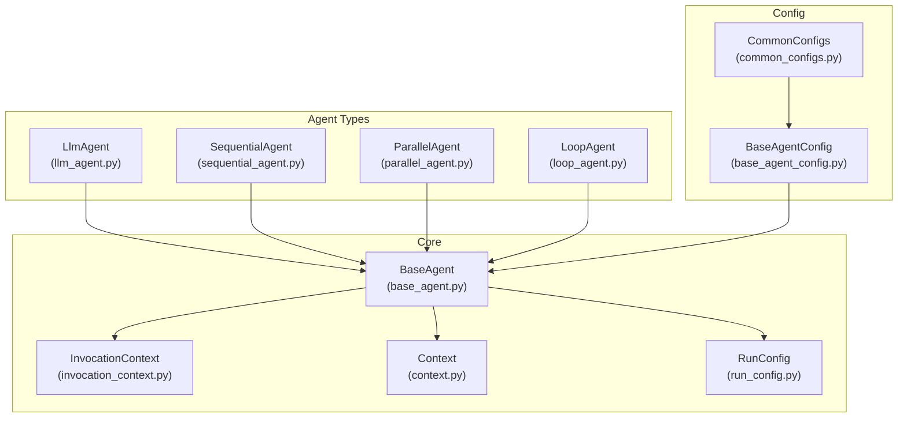
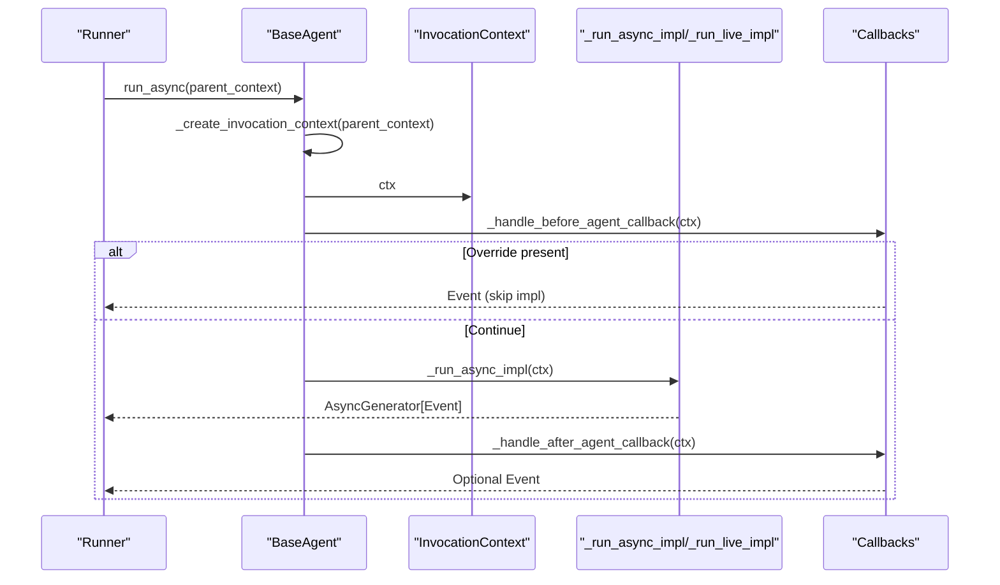
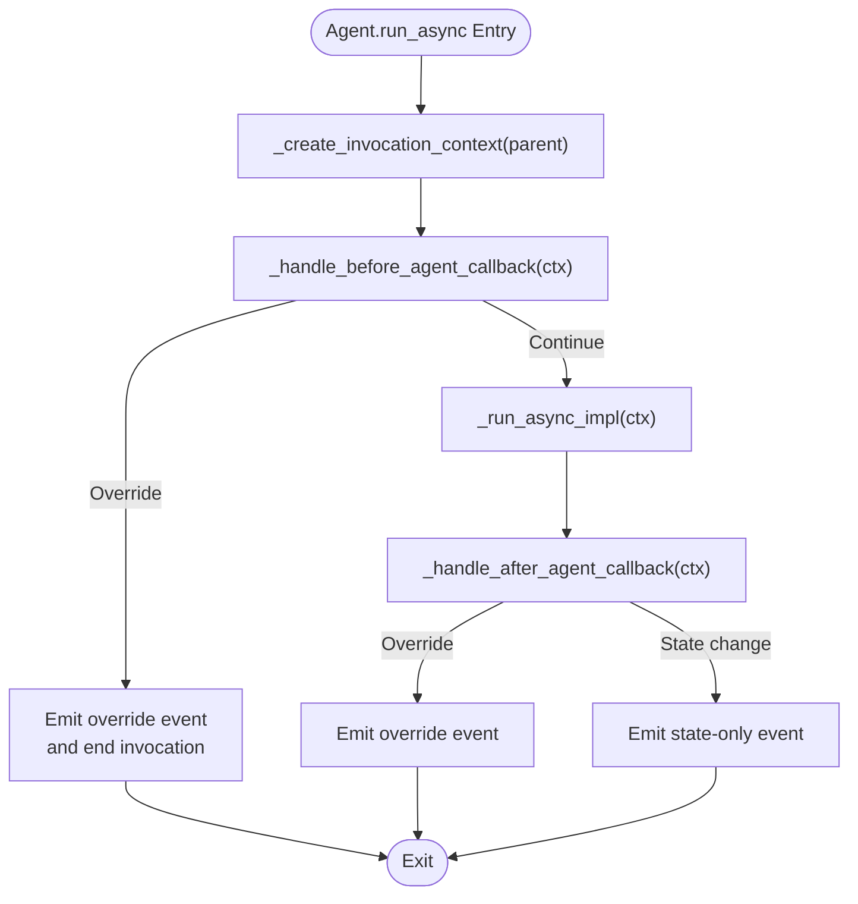
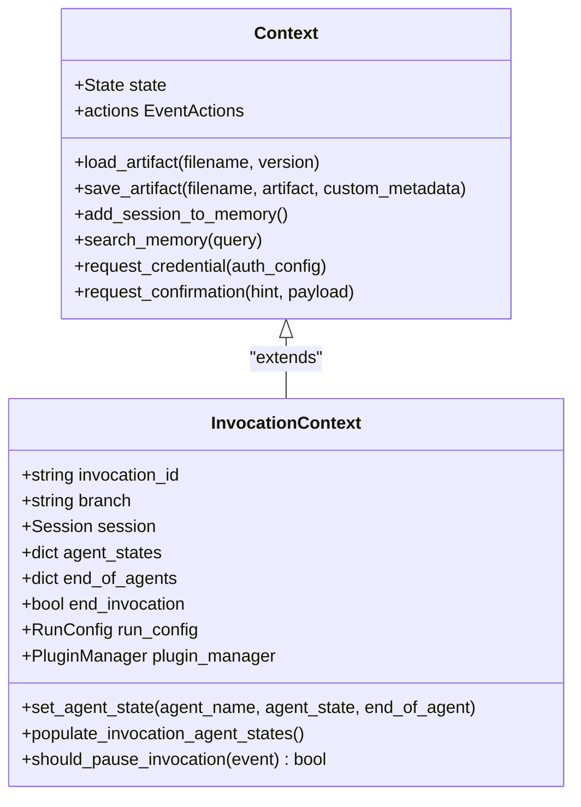
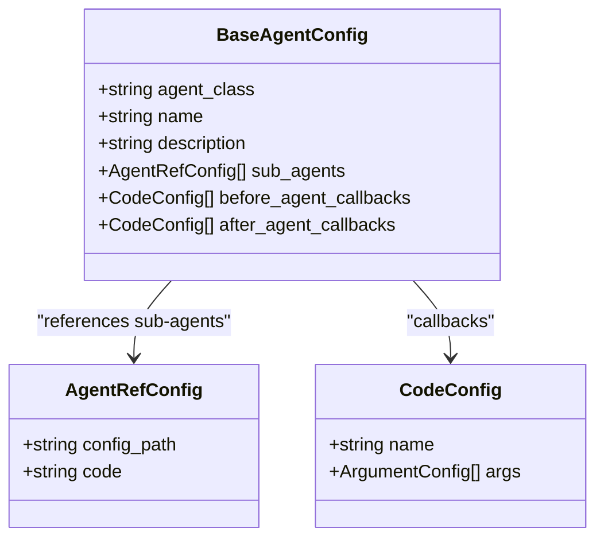
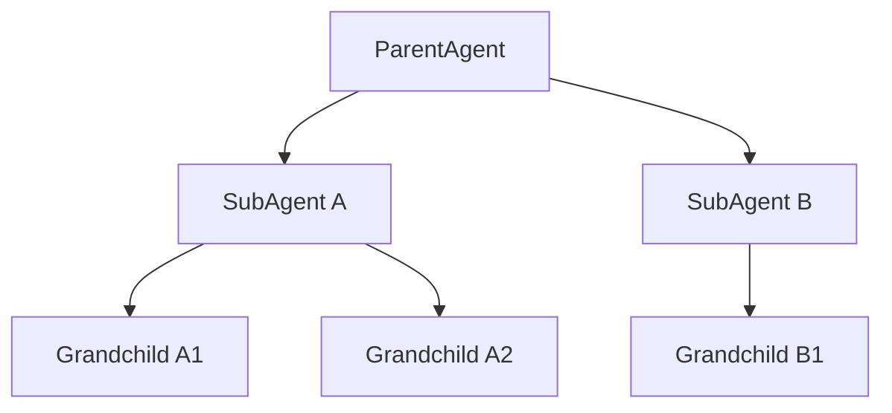
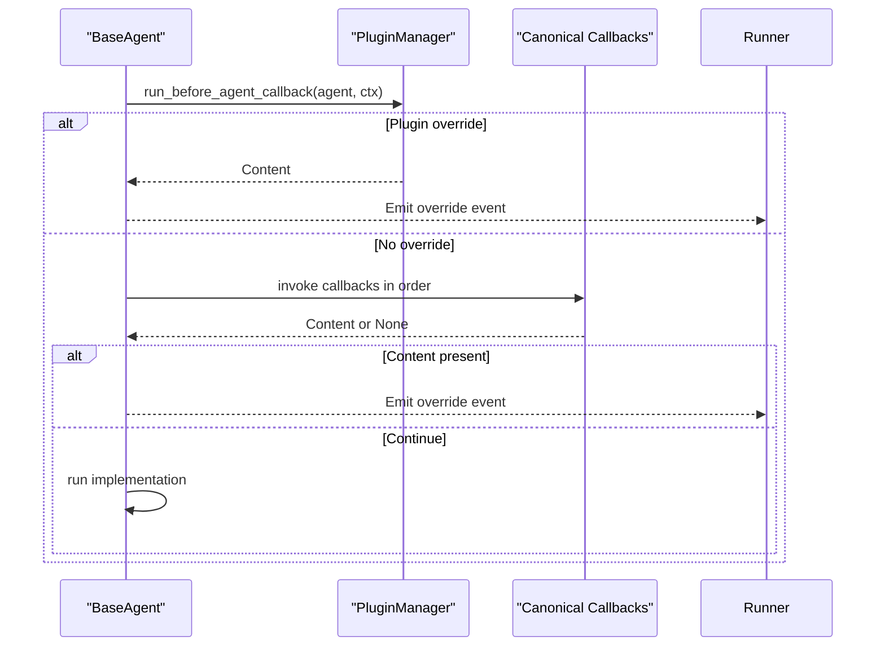
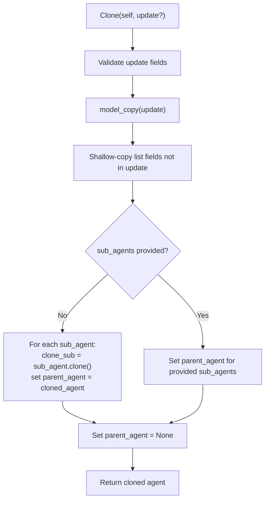
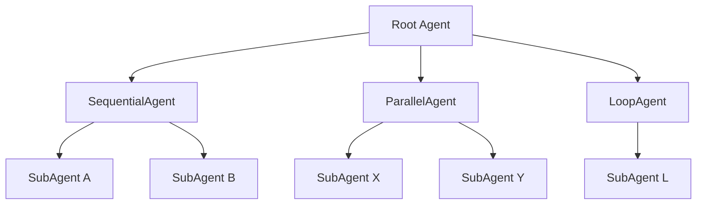
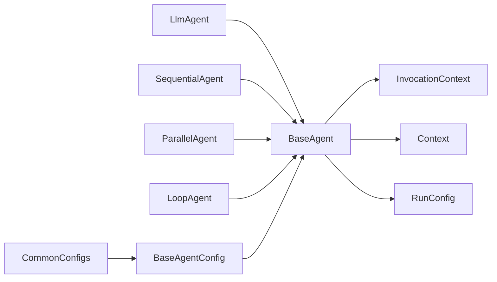

# Agent Fundamentals

<cite>
**Referenced Files in This Document**
- [base_agent.py](file://src/google/adk/agents/base_agent.py)
- [context.py](file://src/google/adk/agents/context.py)
- [callback_context.py](file://src/google/adk/agents/callback_context.py)
- [invocation_context.py](file://src/google/adk/agents/invocation_context.py)
- [run_config.py](file://src/google/adk/agents/run_config.py)
- [llm_agent.py](file://src/google/adk/agents/llm_agent.py)
- [sequential_agent.py](file://src/google/adk/agents/sequential_agent.py)
- [parallel_agent.py](file://src/google/adk/agents/parallel_agent.py)
- [loop_agent.py](file://src/google/adk/agents/loop_agent.py)
- [base_agent_config.py](file://src/google/adk/agents/base_agent_config.py)
- [common_configs.py](file://src/google/adk/agents/common_configs.py)
- [__init__.py](file://src/google/adk/agents/__init__.py)
- [root_agent.yaml](file://contributing/samples/core_basic_config/root_agent.yaml)
- [agent.py](file://contributing/samples/hello_world/agent.py)
</cite>

## Table of Contents
1. [Introduction](#introduction)
2. [Project Structure](#project-structure)
3. [Core Components](#core-components)
4. [Architecture Overview](#architecture-overview)
5. [Detailed Component Analysis](#detailed-component-analysis)
6. [Dependency Analysis](#dependency-analysis)
7. [Performance Considerations](#performance-considerations)
8. [Troubleshooting Guide](#troubleshooting-guide)
9. [Conclusion](#conclusion)
10. [Appendices](#appendices)

## Introduction
This document explains the Agent Development Kit (ADK) agent fundamentals with a focus on the BaseAgent class as the foundation for all agent types. It covers the agent lifecycle from initialization through execution, context creation and management, configuration patterns, validation rules, naming conventions, parent-child hierarchies, callback systems, cloning and state management, and practical examples. It also provides guidance on composing agents, validation and error handling, debugging techniques, and best practices.

## Project Structure
The agent system is organized around a core BaseAgent class and several specialized agent types (LLM-based, sequential, parallel, loop). Supporting modules include context and invocation context for runtime state, run configuration for streaming and live modes, and configuration schemas for YAML-based agent definition.

**Diagram sources**
- [base_agent.py](file://src/google/adk/agents/base_agent.py#L86-L701)
- [invocation_context.py](file://src/google/adk/agents/invocation_context.py#L100-L418)
- [context.py](file://src/google/adk/agents/context.py#L41-L413)
- [run_config.py](file://src/google/adk/agents/run_config.py#L182-L352)
- [llm_agent.py](file://src/google/adk/agents/llm_agent.py#L187-L800)
- [sequential_agent.py](file://src/google/adk/agents/sequential_agent.py#L48-L160)
- [parallel_agent.py](file://src/google/adk/agents/parallel_agent.py#L150-L217)
- [loop_agent.py](file://src/google/adk/agents/loop_agent.py#L52-L167)
- [base_agent_config.py](file://src/google/adk/agents/base_agent_config.py#L38-L83)
- [common_configs.py](file://src/google/adk/agents/common_configs.py#L31-L146)

**Section sources**
- [__init__.py](file://src/google/adk/agents/__init__.py#L15-L42)

## Core Components
- BaseAgent: The foundational Pydantic model for all agents. Provides lifecycle orchestration, parent-child hierarchy, callback hooks, cloning, and state management. It defines asynchronous run entry points for text and live conversations and exposes canonical callback lists for before/after agent execution.
- InvocationContext: Captures invocation-scoped state, including session, agent, branch, resumability, agent states, and runtime controls. It manages pausing/resuming, LLM call limits, and event filtering.
- Context: A mutable facade over InvocationContext that exposes session state, artifacts, credentials, memory, and tool confirmation helpers for callbacks and tools.
- RunConfig: Controls streaming modes (non-streaming, SSE, BIDI), live audio/video configuration, thread pools for tools, and limits like max LLM calls.
- Specialized Agents: LlmAgent adds model selection, instructions, tools, planner, code execution, and model/tool callbacks; SequentialAgent runs sub-agents in order; ParallelAgent runs sub-agents concurrently; LoopAgent repeats sub-agent execution with optional iteration limits.

**Section sources**
- [base_agent.py](file://src/google/adk/agents/base_agent.py#L86-L701)
- [invocation_context.py](file://src/google/adk/agents/invocation_context.py#L100-L418)
- [context.py](file://src/google/adk/agents/context.py#L41-L413)
- [run_config.py](file://src/google/adk/agents/run_config.py#L182-L352)
- [llm_agent.py](file://src/google/adk/agents/llm_agent.py#L187-L800)
- [sequential_agent.py](file://src/google/adk/agents/sequential_agent.py#L48-L160)
- [parallel_agent.py](file://src/google/adk/agents/parallel_agent.py#L150-L217)
- [loop_agent.py](file://src/google/adk/agents/loop_agent.py#L52-L167)

## Architecture Overview
The agent lifecycle centers on BaseAgent.run_async/run_live, which:
- Creates an InvocationContext from the parent context.
- Executes before_agent_callback hooks (including plugin-provided overrides).
- Invokes the agent’s implementation-specific run method.
- Executes after_agent_callback hooks and emits state/end-of-agent events when resumable.
- Emits events for streaming and live modes per RunConfig.

**Diagram sources**
- [base_agent.py](file://src/google/adk/agents/base_agent.py#L273-L366)
- [base_agent.py](file://src/google/adk/agents/base_agent.py#L434-L549)
- [invocation_context.py](file://src/google/adk/agents/invocation_context.py#L100-L138)

## Detailed Component Analysis

### BaseAgent Lifecycle and Execution
- Initialization and Validation:
  - Validates agent name to be a Python identifier and not reserved ("user").
  - Ensures sub-agent names are unique within an agent.
  - Automatically sets parent_agent for sub-agents upon model post-init.
- Invocation Context Creation:
  - Derives a child InvocationContext from the parent and sets the current agent.
- Execution Entry Points:
  - run_async: Text-based conversation entry point.
  - run_live: Audio/Video-based conversation entry point.
- Callback System:
  - before_agent_callback: Runs before implementation; can short-circuit by returning content or setting end_invocation.
  - after_agent_callback: Runs after implementation; can append additional events.
  - Canonical callback lists normalize single or list forms for consistent processing.
- State Management:
  - Loads agent state from InvocationContext.
  - Emits agent-state events and end-of-agent markers when resumable.
- Cloning:
  - Creates a copy of the agent, validating allowed fields and recursively cloning sub-agents while clearing parent references.

**Diagram sources**
- [base_agent.py](file://src/google/adk/agents/base_agent.py#L273-L366)
- [base_agent.py](file://src/google/adk/agents/base_agent.py#L434-L549)

**Section sources**
- [base_agent.py](file://src/google/adk/agents/base_agent.py#L111-L166)
- [base_agent.py](file://src/google/adk/agents/base_agent.py#L555-L620)
- [base_agent.py](file://src/google/adk/agents/base_agent.py#L403-L433)
- [base_agent.py](file://src/google/adk/agents/base_agent.py#L434-L549)
- [base_agent.py](file://src/google/adk/agents/base_agent.py#L168-L271)

### Context and Invocation Context
- InvocationContext:
  - Holds session, agent, invocation_id, branch, resumability, agent_states, end_of_agents, and runtime controls.
  - Provides set_agent_state, reset_sub_agent_states, populate_invocation_agent_states, should_pause_invocation, and event filtering helpers.
  - Enforces max LLM calls via RunConfig.
- Context:
  - Exposes state mutations, artifacts, credentials, memory, and tool confirmation APIs for callbacks/tools.
  - Provides helpers to add session/memory, search memory, and request credentials/confirmations.

**Diagram sources**
- [invocation_context.py](file://src/google/adk/agents/invocation_context.py#L100-L418)
- [context.py](file://src/google/adk/agents/context.py#L41-L413)

**Section sources**
- [invocation_context.py](file://src/google/adk/agents/invocation_context.py#L224-L398)
- [context.py](file://src/google/adk/agents/context.py#L95-L413)

### Configuration Patterns and Naming Conventions
- YAML Configuration:
  - BaseAgentConfig defines common fields: agent_class, name, description, sub_agents, before_agent_callbacks, after_agent_callbacks.
  - CommonConfigs define CodeConfig and AgentRefConfig for referencing tools, callbacks, and sub-agents via code or YAML.
- Naming Rules:
  - Agent name must be a valid Python identifier and not reserved ("user").
  - Sub-agent names must be unique within an agent.
- From-Config Construction:
  - BaseAgent.from_config builds agents from BaseAgentConfig, resolving sub-agent references and callbacks.

**Diagram sources**
- [base_agent_config.py](file://src/google/adk/agents/base_agent_config.py#L38-L83)
- [common_configs.py](file://src/google/adk/agents/common_configs.py#L48-L146)
- [base_agent.py](file://src/google/adk/agents/base_agent.py#L625-L701)

**Section sources**
- [base_agent_config.py](file://src/google/adk/agents/base_agent_config.py#L38-L83)
- [common_configs.py](file://src/google/adk/agents/common_configs.py#L48-L146)
- [base_agent.py](file://src/google/adk/agents/base_agent.py#L555-L620)
- [base_agent.py](file://src/google/adk/agents/base_agent.py#L625-L701)

### Parent-Child Hierarchies and Agent Tree Navigation
- Parent-Child:
  - parent_agent is set only when a parent instantiates sub-agents; attempting to set it manually raises an error.
  - Sub-agents must have unique names; duplicates produce warnings.
- Tree Traversal:
  - root_agent walks up the chain to the root.
  - find_agent and find_sub_agent traverse the tree to locate agents by name.

**Diagram sources**
- [base_agent.py](file://src/google/adk/agents/base_agent.py#L125-L137)
- [base_agent.py](file://src/google/adk/agents/base_agent.py#L368-L401)

**Section sources**
- [base_agent.py](file://src/google/adk/agents/base_agent.py#L125-L137)
- [base_agent.py](file://src/google/adk/agents/base_agent.py#L368-L401)
- [base_agent.py](file://src/google/adk/agents/base_agent.py#L572-L620)

### Callback System: Before/After Hooks
- Before Agent Callbacks:
  - Plugins run first; if they do not override, canonical callbacks are executed in order until one returns content.
  - Can set end_invocation to skip implementation and emit an event.
  - Can emit state-only events when state changes occur.
- After Agent Callbacks:
  - Similar pipeline; can emit additional events and state-only events.

**Diagram sources**
- [base_agent.py](file://src/google/adk/agents/base_agent.py#L434-L490)

**Section sources**
- [base_agent.py](file://src/google/adk/agents/base_agent.py#L139-L166)
- [base_agent.py](file://src/google/adk/agents/base_agent.py#L410-L433)
- [base_agent.py](file://src/google/adk/agents/base_agent.py#L434-L549)
- [callback_context.py](file://src/google/adk/agents/callback_context.py#L17-L23)

### Cloning Mechanisms and State Management
- Cloning:
  - model_copy with optional update mapping; validates allowed fields and disallows updating parent_agent.
  - Recursively clones sub-agents and clears parent references to avoid shared state.
  - Shallow-copies list fields not provided in update to prevent shared mutable state.
- State Management:
  - _load_agent_state retrieves JSON-serializable state from InvocationContext.
  - _create_agent_state_event emits events carrying agent state and end-of-agent flags.
  - InvocationContext.set_agent_state updates per-agent state and end-of-agent flags.

**Diagram sources**
- [base_agent.py](file://src/google/adk/agents/base_agent.py#L211-L271)

**Section sources**
- [base_agent.py](file://src/google/adk/agents/base_agent.py#L168-L271)
- [invocation_context.py](file://src/google/adk/agents/invocation_context.py#L232-L263)

### Practical Examples

#### Creating a Basic Agent from YAML
- Define a root agent with model, instruction, and tools in YAML.
- Instantiate via BaseAgent.from_config or use convenience constructors.

**Section sources**
- [root_agent.yaml](file://contributing/samples/core_basic_config/root_agent.yaml#L1-L10)
- [base_agent.py](file://src/google/adk/agents/base_agent.py#L625-L701)

#### Creating a Basic Agent in Code
- Use the Agent convenience to define model, name, description, instruction, tools, and optional generate_content_config.

**Section sources**
- [agent.py](file://contributing/samples/hello_world/agent.py#L67-L109)

#### Implementing Custom Agent Behaviors
- Extend BaseAgent or LlmAgent to customize run logic, instructions, tools, and callbacks.
- Use Context for state, artifacts, credentials, and memory within callbacks/tools.

**Section sources**
- [llm_agent.py](file://src/google/adk/agents/llm_agent.py#L187-L800)
- [context.py](file://src/google/adk/agents/context.py#L95-L413)

### Agent Composition Patterns
- SequentialAgent: Runs sub-agents in order, emitting state transitions and honoring resumability.
- ParallelAgent: Runs sub-agents concurrently with isolated branches and merges events.
- LoopAgent: Repeats sub-agent execution with optional max_iterations and escalation handling.

**Diagram sources**
- [sequential_agent.py](file://src/google/adk/agents/sequential_agent.py#L54-L93)
- [parallel_agent.py](file://src/google/adk/agents/parallel_agent.py#L163-L210)
- [loop_agent.py](file://src/google/adk/agents/loop_agent.py#L69-L124)

**Section sources**
- [sequential_agent.py](file://src/google/adk/agents/sequential_agent.py#L48-L160)
- [parallel_agent.py](file://src/google/adk/agents/parallel_agent.py#L150-L217)
- [loop_agent.py](file://src/google/adk/agents/loop_agent.py#L52-L167)

## Dependency Analysis
- Coupling:
  - BaseAgent depends on InvocationContext, CallbackContext (alias to Context), and Event for lifecycle and state.
  - Specialized agents depend on BaseAgent and extend its behavior.
- Cohesion:
  - Context and InvocationContext encapsulate runtime state and controls cohesively.
  - Configuration schemas provide a clean separation between runtime and declarative definitions.

**Diagram sources**
- [base_agent.py](file://src/google/adk/agents/base_agent.py#L86-L701)
- [invocation_context.py](file://src/google/adk/agents/invocation_context.py#L100-L418)
- [context.py](file://src/google/adk/agents/context.py#L41-L413)
- [run_config.py](file://src/google/adk/agents/run_config.py#L182-L352)
- [llm_agent.py](file://src/google/adk/agents/llm_agent.py#L187-L800)
- [sequential_agent.py](file://src/google/adk/agents/sequential_agent.py#L48-L160)
- [parallel_agent.py](file://src/google/adk/agents/parallel_agent.py#L150-L217)
- [loop_agent.py](file://src/google/adk/agents/loop_agent.py#L52-L167)
- [base_agent_config.py](file://src/google/adk/agents/base_agent_config.py#L38-L83)
- [common_configs.py](file://src/google/adk/agents/common_configs.py#L31-L146)

**Section sources**
- [__init__.py](file://src/google/adk/agents/__init__.py#L15-L42)

## Performance Considerations
- Streaming Modes:
  - StreamingMode.NONE yields final responses only.
  - StreamingMode.SSE yields partial and aggregated events; consider progressive streaming and duplicate text handling.
- Live Mode:
  - Use RunConfig for speech, transcription, and real-time input configuration.
  - ToolThreadPoolConfig can offload tool execution to keep the event loop responsive.
- LLM Call Limits:
  - Enforced via InvocationContext.increment_llm_call_count using RunConfig.max_llm_calls.

[No sources needed since this section provides general guidance]

## Troubleshooting Guide
- Name Validation Errors:
  - Agent name must be a valid Python identifier and not "user".
- Duplicate Sub-Agent Names:
  - Unique names enforced; warnings logged for duplicates.
- Parent-Agent Assignment:
  - Cannot set parent_agent manually; must be set by parent instantiation.
- Invocation Pausing:
  - Use InvocationContext.should_pause_invocation to detect long-running tool calls and pause/resume safely.
- LLM Call Limit Exceeded:
  - LlmCallsLimitExceededError raised when RunConfig.max_llm_calls is exceeded.

**Section sources**
- [base_agent.py](file://src/google/adk/agents/base_agent.py#L555-L570)
- [base_agent.py](file://src/google/adk/agents/base_agent.py#L572-L620)
- [invocation_context.py](file://src/google/adk/agents/invocation_context.py#L47-L98)
- [invocation_context.py](file://src/google/adk/agents/invocation_context.py#L363-L398)

## Conclusion
BaseAgent provides a robust, extensible foundation for building agents in ADK. Its lifecycle, context management, callback system, and state mechanisms enable powerful composition patterns through SequentialAgent, ParallelAgent, and LoopAgent. Configuration via YAML and Python offers flexibility, while validation and error handling ensure reliable operation. Following the best practices outlined here will help you design maintainable, debuggable, and efficient agent systems.

## Appendices

### Best Practices for Agent Design
- Keep agent names unique and valid; avoid reserved identifiers.
- Use Context for state and artifacts rather than global variables.
- Prefer canonical callback lists for consistent ordering and plugin integration.
- Leverage resumability and InvocationContext.set_agent_state for checkpointing long-running workflows.
- Use RunConfig to tune streaming and live behavior for your use case.
- Clone agents carefully to avoid shared mutable state; rely on BaseAgent.clone for safe copying.

[No sources needed since this section provides general guidance]