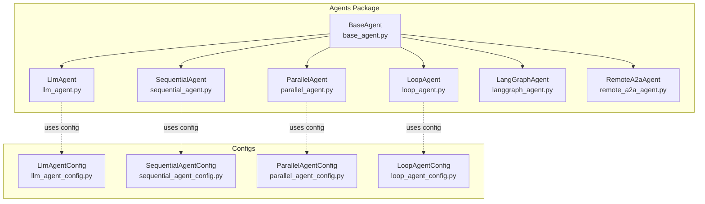
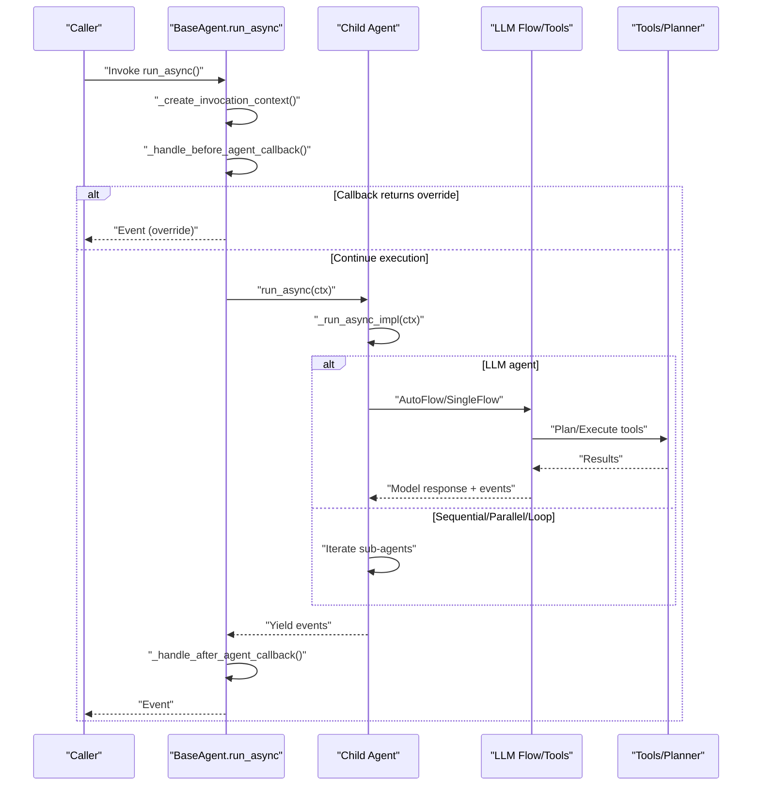
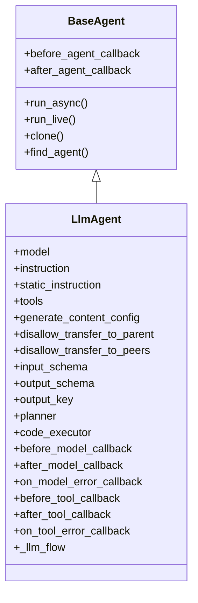
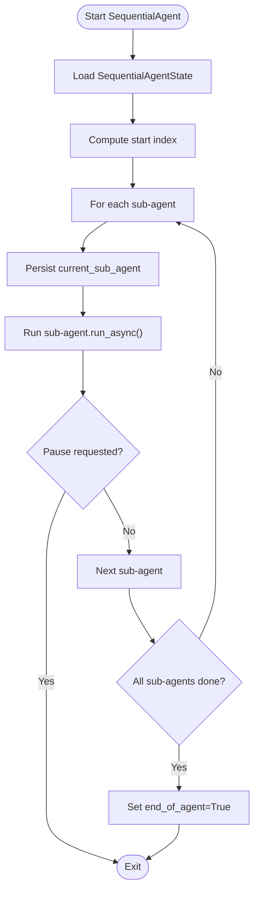
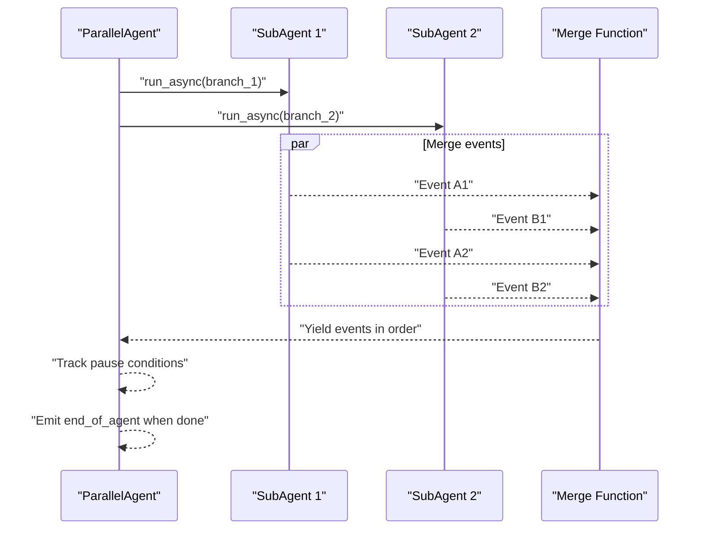
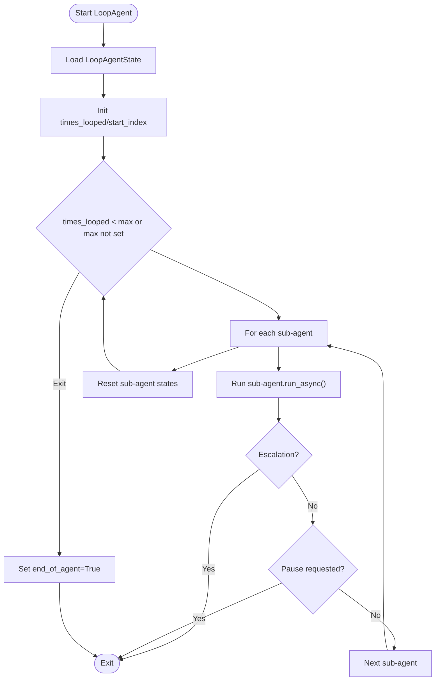
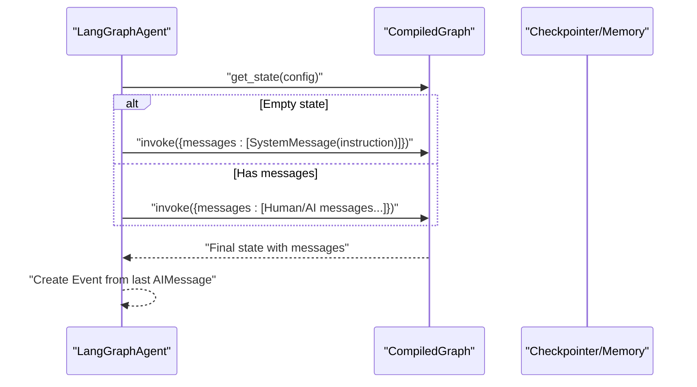
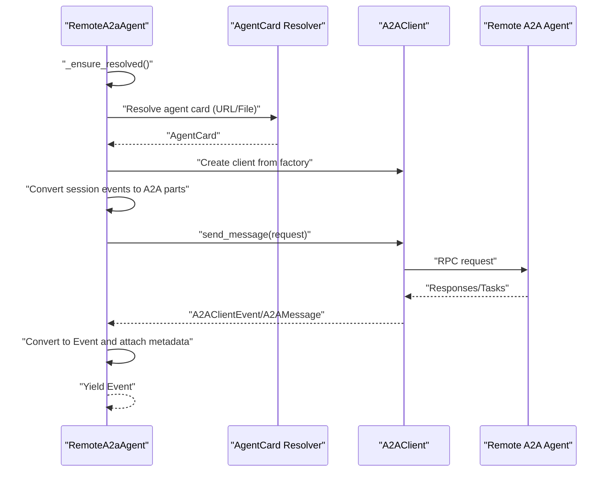
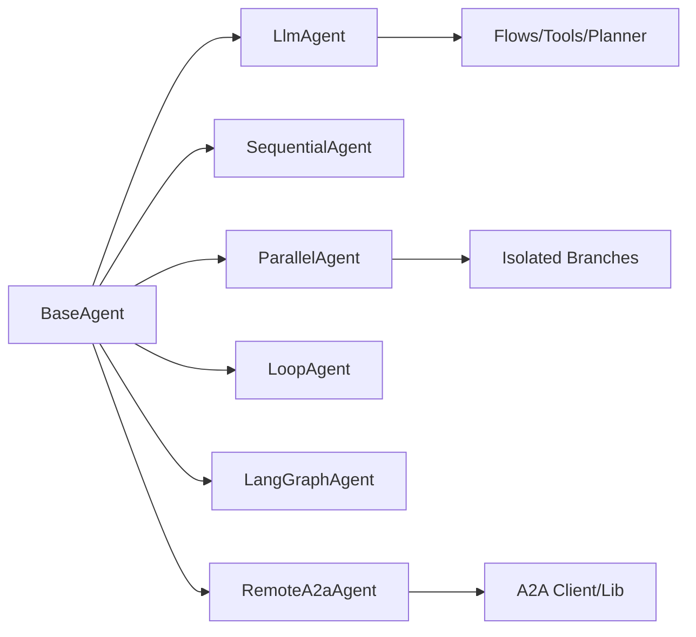

# Agent Types and Implementations

<cite>
**Referenced Files in This Document**
- [base_agent.py](file://src/google/adk/agents/base_agent.py)
- [llm_agent.py](file://src/google/adk/agents/llm_agent.py)
- [sequential_agent.py](file://src/google/adk/agents/sequential_agent.py)
- [parallel_agent.py](file://src/google/adk/agents/parallel_agent.py)
- [loop_agent.py](file://src/google/adk/agents/loop_agent.py)
- [langgraph_agent.py](file://src/google/adk/agents/langgraph_agent.py)
- [remote_a2a_agent.py](file://src/google/adk/agents/remote_a2a_agent.py)
- [llm_agent_config.py](file://src/google/adk/agents/llm_agent_config.py)
- [sequential_agent_config.py](file://src/google/adk/agents/sequential_agent_config.py)
- [parallel_agent_config.py](file://src/google/adk/agents/parallel_agent_config.py)
- [loop_agent_config.py](file://src/google/adk/agents/loop_agent_config.py)
- [root_agent.yaml](file://contributing/samples/multi_agent_llm_config/root_agent.yaml)
- [prime_agent.yaml](file://contributing/samples/multi_agent_llm_config/prime_agent.yaml)
- [root_agent.yaml](file://contributing/samples/multi_agent_seq_config/root_agent.yaml)
- [root_agent.yaml](file://contributing/samples/multi_agent_loop_config/root_agent.yaml)
- [loop_agent.yaml](file://contributing/samples/multi_agent_loop_config/loop_agent.yaml)
</cite>

## Table of Contents
1. [Introduction](#introduction)
2. [Project Structure](#project-structure)
3. [Core Components](#core-components)
4. [Architecture Overview](#architecture-overview)
5. [Detailed Component Analysis](#detailed-component-analysis)
6. [Dependency Analysis](#dependency-analysis)
7. [Performance Considerations](#performance-considerations)
8. [Troubleshooting Guide](#troubleshooting-guide)
9. [Conclusion](#conclusion)

## Introduction
This document explains the agent types available in the Agent Development Kit (ADK), focusing on:
- LLM agents for natural language processing and tool use
- Sequential agents for step-by-step workflows
- Parallel agents for concurrent execution
- Loop agents for iterative processes
- LangGraph agents for graph-based reasoning
- Remote A2A agents for external agent communication

It covers implementation patterns, configuration options, execution differences, state management, callback handling, performance, scalability, and troubleshooting guidance.

## Project Structure
ADK organizes agent implementations under the agents package, with a shared base class and specialized subclasses. Configuration schemas define how agents are declared and wired in YAML.

**Diagram sources**
- [base_agent.py](file://src/google/adk/agents/base_agent.py#L86-L120)
- [llm_agent.py](file://src/google/adk/agents/llm_agent.py#L187-L206)
- [sequential_agent.py](file://src/google/adk/agents/sequential_agent.py#L48-L52)
- [parallel_agent.py](file://src/google/adk/agents/parallel_agent.py#L150-L161)
- [loop_agent.py](file://src/google/adk/agents/loop_agent.py#L52-L60)
- [langgraph_agent.py](file://src/google/adk/agents/langgraph_agent.py#L52-L62)
- [remote_a2a_agent.py](file://src/google/adk/agents/remote_a2a_agent.py#L107-L121)
- [llm_agent_config.py](file://src/google/adk/agents/llm_agent_config.py#L35-L52)
- [sequential_agent_config.py](file://src/google/adk/agents/sequential_agent_config.py#L28-L40)
- [parallel_agent_config.py](file://src/google/adk/agents/parallel_agent_config.py#L27-L40)
- [loop_agent_config.py](file://src/google/adk/agents/loop_agent_config.py#L30-L44)

**Section sources**
- [base_agent.py](file://src/google/adk/agents/base_agent.py#L86-L120)
- [llm_agent.py](file://src/google/adk/agents/llm_agent.py#L187-L206)
- [sequential_agent.py](file://src/google/adk/agents/sequential_agent.py#L48-L52)
- [parallel_agent.py](file://src/google/adk/agents/parallel_agent.py#L150-L161)
- [loop_agent.py](file://src/google/adk/agents/loop_agent.py#L52-L60)
- [langgraph_agent.py](file://src/google/adk/agents/langgraph_agent.py#L52-L62)
- [remote_a2a_agent.py](file://src/google/adk/agents/remote_a2a_agent.py#L107-L121)

## Core Components
- BaseAgent: Defines the common lifecycle, invocation context, callbacks, cloning, and state event emission. Provides run_async and run_live entry points and manages before/after callbacks.
- LlmAgent: Orchestrates model calls, tools, planner, code execution, and agent transfer. Supports static/dynamic instructions, context caching, and structured output schemas.
- SequentialAgent: Runs sub-agents in order, resumes from persisted state, and yields end-of-agent markers for resumability.
- ParallelAgent: Runs sub-agents concurrently with isolated branches and merges events in-order per-agent with backpressure.
- LoopAgent: Repeats a sequence of sub-agents up to a configurable limit or until escalation.
- LangGraphAgent: Bridges ADK events to LangGraph CompiledGraph, supporting single/multi-turn reasoning with optional checkpointer-backed memory.
- RemoteA2aAgent: Communicates with remote A2A agents via A2A client, resolving agent cards, converting messages, and handling streaming updates.

**Section sources**
- [base_agent.py](file://src/google/adk/agents/base_agent.py#L86-L120)
- [llm_agent.py](file://src/google/adk/agents/llm_agent.py#L187-L206)
- [sequential_agent.py](file://src/google/adk/agents/sequential_agent.py#L48-L52)
- [parallel_agent.py](file://src/google/adk/agents/parallel_agent.py#L150-L161)
- [loop_agent.py](file://src/google/adk/agents/loop_agent.py#L52-L60)
- [langgraph_agent.py](file://src/google/adk/agents/langgraph_agent.py#L52-L62)
- [remote_a2a_agent.py](file://src/google/adk/agents/remote_a2a_agent.py#L107-L121)

## Architecture Overview
The agents share a common invocation context and event-driven architecture. LLM agents integrate with flows, tools, and callbacks. Graph-based agents translate conversation events into LangGraph messages. Remote agents communicate via A2A protocol with robust error handling and metadata propagation.

**Diagram sources**
- [base_agent.py](file://src/google/adk/agents/base_agent.py#L274-L335)
- [llm_agent.py](file://src/google/adk/agents/llm_agent.py#L458-L497)
- [sequential_agent.py](file://src/google/adk/agents/sequential_agent.py#L54-L93)
- [parallel_agent.py](file://src/google/adk/agents/parallel_agent.py#L163-L206)
- [loop_agent.py](file://src/google/adk/agents/loop_agent.py#L69-L124)

## Detailed Component Analysis

### LLM Agent
- Purpose: Natural language processing with tool use, structured outputs, and agent transfer.
- Execution pattern:
  - Resolves model, instruction, and tools.
  - Chooses AutoFlow or SingleFlow depending on transfer restrictions and sub-agents.
  - Emits agent state events for resumability and persists outputs to state when configured.
- State management:
  - Loads persisted state; if resuming a sub-agent, transfers control to it.
  - Saves outputs to session state via output_key when provided.
- Callbacks:
  - before_model_callback, after_model_callback, on_model_error_callback
  - before_tool_callback, after_tool_callback, on_tool_error_callback
- Configuration highlights:
  - model or model_code
  - instruction/static_instruction/global_instruction
  - tools (including toolsets and function wrappers)
  - generate_content_config
  - disallow_transfer_to_parent/peers
  - input_schema/output_schema/output_key
  - planner, code_executor

**Diagram sources**
- [base_agent.py](file://src/google/adk/agents/base_agent.py#L86-L120)
- [llm_agent.py](file://src/google/adk/agents/llm_agent.py#L187-L456)

**Section sources**
- [llm_agent.py](file://src/google/adk/agents/llm_agent.py#L187-L456)
- [llm_agent_config.py](file://src/google/adk/agents/llm_agent_config.py#L35-L231)

### Sequential Agent
- Purpose: Execute sub-agents in strict order, persisting progress and resuming from the last sub-agent.
- Execution pattern:
  - Loads SequentialAgentState to determine start index.
  - Yields state events for resumability.
  - Skips remaining sub-agents if a pause is requested mid-run.
  - Marks completion with end-of-agent event.
- State management:
  - current_sub_agent tracks the running sub-agent.
- Live mode:
  - Adds a task_completed function to LLM sub-agents to signal completion.

**Diagram sources**
- [sequential_agent.py](file://src/google/adk/agents/sequential_agent.py#L54-L93)

**Section sources**
- [sequential_agent.py](file://src/google/adk/agents/sequential_agent.py#L48-L160)
- [sequential_agent_config.py](file://src/google/adk/agents/sequential_agent_config.py#L28-L41)

### Parallel Agent
- Purpose: Run multiple sub-agents concurrently with isolated branches and coordinated event merging.
- Execution pattern:
  - Creates isolated InvocationContext per sub-agent (unique branch).
  - Starts all sub-agents and merges their events with backpressure.
  - Tracks pause conditions and marks completion when all sub-agents finish.
- State management:
  - Uses BaseAgentState for initialization and end-of-agent signaling.
- Live mode:
  - Not supported yet.

**Diagram sources**
- [parallel_agent.py](file://src/google/adk/agents/parallel_agent.py#L163-L206)

**Section sources**
- [parallel_agent.py](file://src/google/adk/agents/parallel_agent.py#L150-L217)
- [parallel_agent_config.py](file://src/google/adk/agents/parallel_agent_config.py#L27-L41)

### Loop Agent
- Purpose: Iterate over a fixed sequence of sub-agents with optional iteration limits and escalation handling.
- Execution pattern:
  - Loads LoopAgentState to resume at the correct sub-agent and iteration.
  - Resets sub-agent states at the start of each loop.
  - Stops early on escalation or pause.
  - Emits end-of-agent marker upon completion.
- State management:
  - current_sub_agent and times_looped.

**Diagram sources**
- [loop_agent.py](file://src/google/adk/agents/loop_agent.py#L69-L124)

**Section sources**
- [loop_agent.py](file://src/google/adk/agents/loop_agent.py#L52-L167)
- [loop_agent_config.py](file://src/google/adk/agents/loop_agent_config.py#L30-L45)

### LangGraph Agent
- Purpose: Integrate ADK with LangGraph for graph-based reasoning and multi-turn conversations.
- Execution pattern:
  - Uses LangGraph CompiledGraph with RunnableConfig including thread_id.
  - Adds system instruction when graph state is empty; otherwise converts conversation events to messages.
  - Emits a single Event containing the final model response.

**Diagram sources**
- [langgraph_agent.py](file://src/google/adk/agents/langgraph_agent.py#L64-L101)

**Section sources**
- [langgraph_agent.py](file://src/google/adk/agents/langgraph_agent.py#L52-L144)

### Remote A2A Agent
- Purpose: Communicate with external A2A agents via A2A client, resolving agent cards, converting messages, and handling streaming updates.
- Execution pattern:
  - Ensures HTTP client and A2A client factory are available.
  - Resolves agent card from URL or file; validates RPC URL.
  - Converts session events to A2A parts; sends message or responds to function call.
  - Converts A2A responses to ADK Events, attaching metadata for task/context IDs.
  - Supports request/response interceptors and backward-compatible metadata handling.
- State management:
  - Uses session events and custom metadata to preserve context across requests.
- Live mode:
  - Not implemented.

**Diagram sources**
- [remote_a2a_agent.py](file://src/google/adk/agents/remote_a2a_agent.py#L299-L333)
- [remote_a2a_agent.py](file://src/google/adk/agents/remote_a2a_agent.py#L597-L704)

**Section sources**
- [remote_a2a_agent.py](file://src/google/adk/agents/remote_a2a_agent.py#L107-L765)

## Dependency Analysis
- BaseAgent is the foundation for all agents and defines the common interface and lifecycle.
- LlmAgent depends on flows, tools, planners, and code executors; it chooses between AutoFlow and SingleFlow based on configuration.
- Sequential/Parallel/Loop agents depend on sub-agent orchestration and state persistence.
- LangGraphAgent depends on LangGraph’s CompiledGraph and message types.
- RemoteA2aAgent depends on A2A client libraries and converters for message/part translation.

**Diagram sources**
- [base_agent.py](file://src/google/adk/agents/base_agent.py#L86-L120)
- [llm_agent.py](file://src/google/adk/agents/llm_agent.py#L709-L717)
- [parallel_agent.py](file://src/google/adk/agents/parallel_agent.py#L177-L182)
- [remote_a2a_agent.py](file://src/google/adk/agents/remote_a2a_agent.py#L320-L324)

**Section sources**
- [base_agent.py](file://src/google/adk/agents/base_agent.py#L86-L120)
- [llm_agent.py](file://src/google/adk/agents/llm_agent.py#L709-L717)
- [parallel_agent.py](file://src/google/adk/agents/parallel_agent.py#L177-L182)
- [remote_a2a_agent.py](file://src/google/adk/agents/remote_a2a_agent.py#L320-L324)

## Performance Considerations
- LLM agents:
  - Prefer static_instruction for context caching to reduce repetition costs.
  - Use output_schema to constrain model output and avoid tool use overhead when appropriate.
  - Limit tool sets and use function tools judiciously to minimize token usage.
- Sequential agents:
  - Keep sub-agent sequences short and focused to reduce total latency.
- Parallel agents:
  - Concurrency improves throughput but increases resource usage; tune sub-agent count and isolation carefully.
  - Backpressure ensures ordered consumption; monitor event rates to prevent queue buildup.
- Loop agents:
  - Set max_iterations to bound compute; use escalation to exit early on success.
- LangGraph agents:
  - Leverage checkpointer-backed memory to avoid repeating conversation history.
- Remote A2A agents:
  - Reuse HTTP clients via factories to reduce connection overhead.
  - Use interceptors to add observability without impacting hot-path performance.

[No sources needed since this section provides general guidance]

## Troubleshooting Guide
- LLM agents:
  - If agent transfer loops occur, set disallow_transfer_to_parent or disallow_transfer_to_peers appropriately.
  - For tool conflicts, ensure tools are wrapped when combined with built-in tools.
  - Structured output: when output_schema is set, the agent cannot use tools or transfers.
- Sequential agents:
  - If a sub-agent disappears, the agent restarts from the beginning; ensure sub-agent names remain stable.
- Parallel agents:
  - Live mode is not supported; use text-based runs.
  - If events stall, verify backpressure and ensure upstream consumes events promptly.
- Loop agents:
  - If escalation is not respected, confirm sub-agents emit escalate actions.
- LangGraph agents:
  - Ensure graph is compiled and optionally configured with a checkpointer.
  - For multi-turn, rely on thread_id derived from session ID.
- Remote A2A agents:
  - Agent card resolution failures: verify URL/file path and JSON validity.
  - RPC URL validation: ensure scheme and host are present.
  - Streaming artifacts: partial updates are intentionally ignored; expect full updates.
  - HTTP errors: inspect error metadata attached to events for diagnostics.

**Section sources**
- [llm_agent.py](file://src/google/adk/agents/llm_agent.py#L298-L309)
- [sequential_agent.py](file://src/google/adk/agents/sequential_agent.py#L106-L117)
- [parallel_agent.py](file://src/google/adk/agents/parallel_agent.py#L212-L216)
- [loop_agent.py](file://src/google/adk/agents/loop_agent.py#L103-L106)
- [langgraph_agent.py](file://src/google/adk/agents/langgraph_agent.py#L70-L84)
- [remote_a2a_agent.py](file://src/google/adk/agents/remote_a2a_agent.py#L273-L298)
- [remote_a2a_agent.py](file://src/google/adk/agents/remote_a2a_agent.py#L473-L490)
- [remote_a2a_agent.py](file://src/google/adk/agents/remote_a2a_agent.py#L705-L739)

## Conclusion
ADK provides a cohesive set of agent types tailored to different execution patterns:
- LLM agents for flexible NLP with tools and structured outputs
- Sequential agents for deterministic workflows
- Parallel agents for concurrency with isolation
- Loop agents for iterative refinement
- LangGraph agents for graph-based reasoning
- Remote A2A agents for interoperability with external agents

Choose the agent type based on workflow needs, performance characteristics, and integration requirements. Use configuration schemas and state/event mechanisms to achieve resumability, observability, and robust error handling.