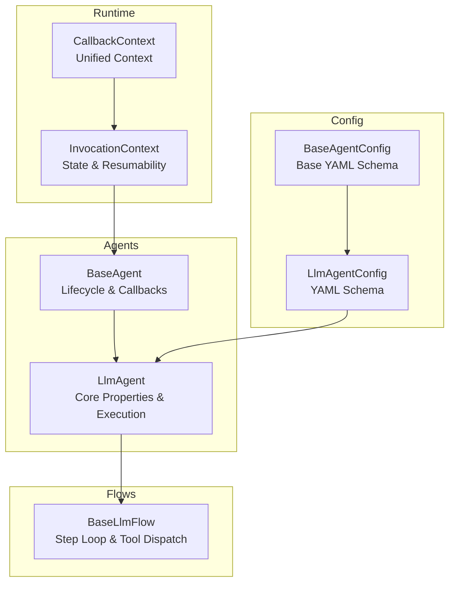
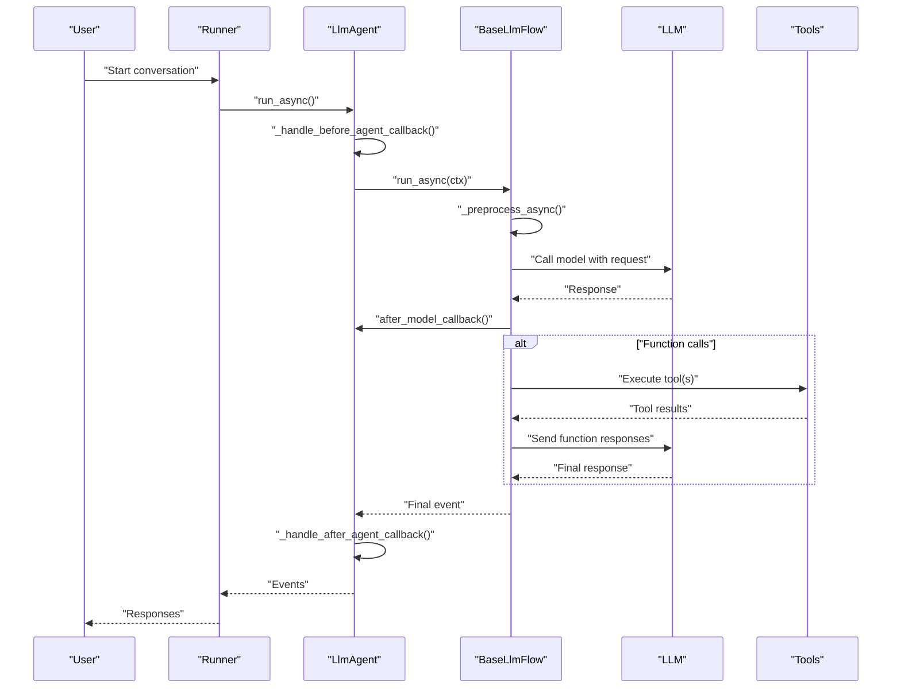
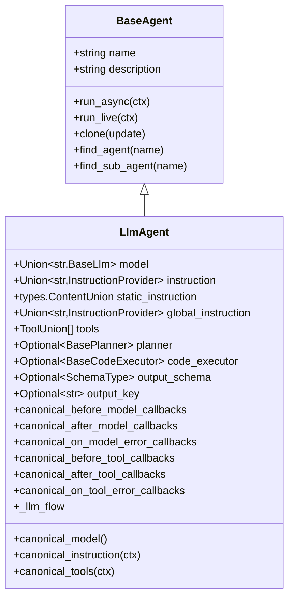
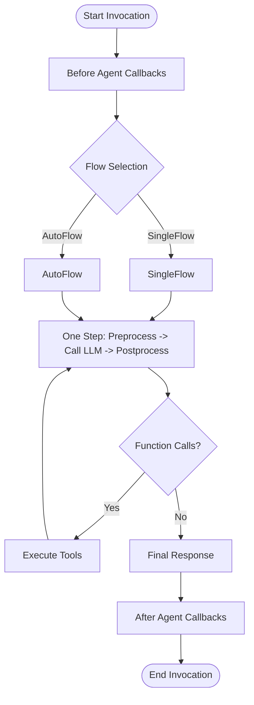
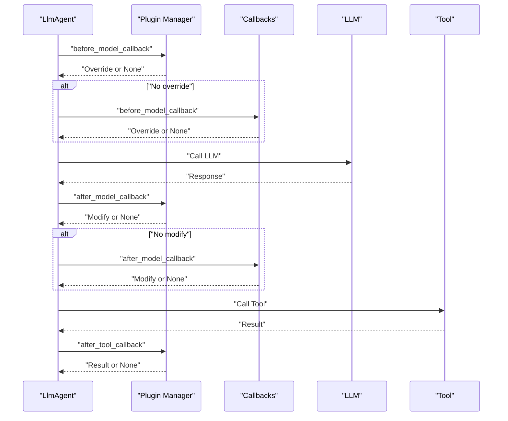
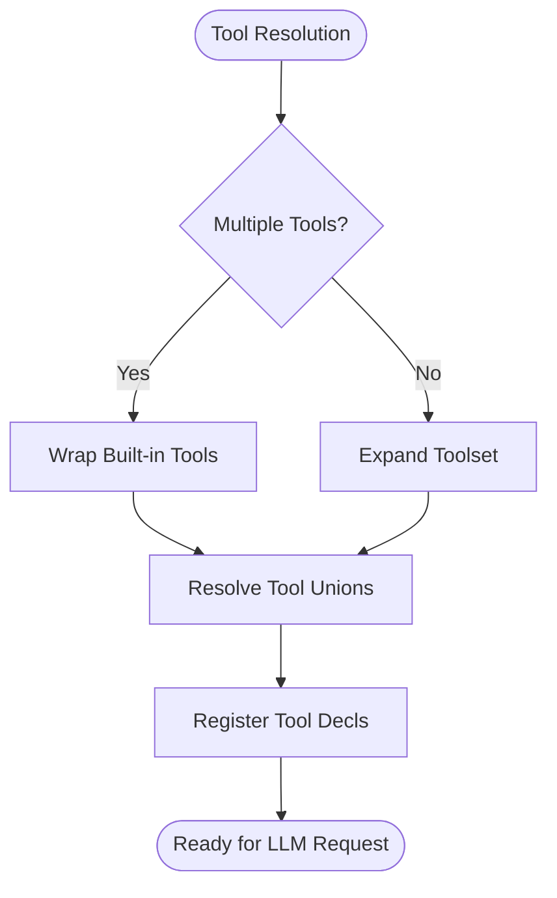
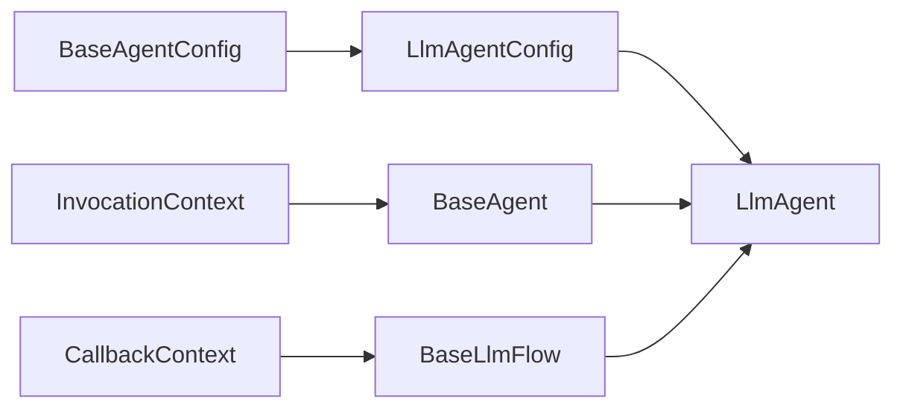

# LLM Agents

<cite>
**Referenced Files in This Document**
- [llm_agent.py](file://src/google/adk/agents/llm_agent.py)
- [llm_agent_config.py](file://src/google/adk/agents/llm_agent_config.py)
- [base_agent.py](file://src/google/adk/agents/base_agent.py)
- [base_agent_config.py](file://src/google/adk/agents/base_agent_config.py)
- [callback_context.py](file://src/google/adk/agents/callback_context.py)
- [invocation_context.py](file://src/google/adk/agents/invocation_context.py)
- [base_llm_flow.py](file://src/google/adk/flows/llm_flows/base_llm_flow.py)
- [base_planner.py](file://src/google/adk/planners/base_planner.py)
- [base_code_executor.py](file://src/google/adk/code_executors/base_code_executor.py)
- [output_schema_utils.py](file://src/google/adk/utils/output_schema_utils.py)
- [root_agent.yaml](file://contributing/samples/core_basic_config/root_agent.yaml)
- [root_agent.yaml](file://contributing/samples/multi_agent_basic_config/root_agent.yaml)
- [agent.py](file://contributing/samples/adk_answering_agent/agent.py)
</cite>

## Table of Contents
1. [Introduction](#introduction)
2. [Project Structure](#project-structure)
3. [Core Components](#core-components)
4. [Architecture Overview](#architecture-overview)
5. [Detailed Component Analysis](#detailed-component-analysis)
6. [Dependency Analysis](#dependency-analysis)
7. [Performance Considerations](#performance-considerations)
8. [Troubleshooting Guide](#troubleshooting-guide)
9. [Conclusion](#conclusion)
10. [Appendices](#appendices)

## Introduction
This document explains the LLM agent system in the Agent Development Kit (ADK), focusing on the LlmAgent class as the primary agent type for natural language processing tasks. It covers model selection, instruction handling (static_instruction, instruction, global_instruction), tool integration, callback mechanisms, execution flow, state management, and event-driven architecture. Advanced features such as output_schema for structured responses, planner integration for stepwise execution, and code_executor for code execution are documented. Practical configuration examples and best practices for performance and context caching are included.

## Project Structure
The LLM agent implementation centers around the LlmAgent class and its supporting infrastructure:
- Agent base and lifecycle: BaseAgent and InvocationContext orchestrate runs, callbacks, and state.
- LLM flow engine: BaseLlmFlow drives the stepwise loop of model calls and tool execution.
- Configuration: LlmAgentConfig defines YAML schema and normalization/validation for agent settings.
- Utilities: Output schema helpers, callback context unification, and planner interfaces.

**Diagram sources**
- [base_agent.py](file://src/google/adk/agents/base_agent.py#L86-L120)
- [llm_agent.py](file://src/google/adk/agents/llm_agent.py#L187-L206)
- [base_llm_flow.py](file://src/google/adk/flows/llm_flows/base_llm_flow.py#L447-L460)
- [llm_agent_config.py](file://src/google/adk/agents/llm_agent_config.py#L35-L52)
- [base_agent_config.py](file://src/google/adk/agents/base_agent_config.py#L38-L54)
- [invocation_context.py](file://src/google/adk/agents/invocation_context.py#L100-L144)
- [callback_context.py](file://src/google/adk/agents/callback_context.py#L15-L23)

**Section sources**
- [base_agent.py](file://src/google/adk/agents/base_agent.py#L86-L120)
- [llm_agent.py](file://src/google/adk/agents/llm_agent.py#L187-L206)
- [base_llm_flow.py](file://src/google/adk/flows/llm_flows/base_llm_flow.py#L447-L460)
- [llm_agent_config.py](file://src/google/adk/agents/llm_agent_config.py#L35-L52)
- [base_agent_config.py](file://src/google/adk/agents/base_agent_config.py#L38-L54)
- [invocation_context.py](file://src/google/adk/agents/invocation_context.py#L100-L144)
- [callback_context.py](file://src/google/adk/agents/callback_context.py#L15-L23)

## Core Components
- LlmAgent: The primary agent class for NLP tasks. Key properties include model selection, instruction composition, tool integration, structured output, planner, code execution, and callback hooks.
- BaseAgent: Provides lifecycle hooks (before/after agent callbacks), cloning, and invocation orchestration.
- BaseLlmFlow: Implements the stepwise loop for model calls and tool execution, including preprocessing, streaming, and postprocessing.
- LlmAgentConfig: Defines YAML schema for agent configuration, including model, instruction, static_instruction, tools, and callbacks.
- InvocationContext: Carries runtime state, resumability, and controls for agent invocation.
- CallbackContext: Unified context for callbacks across agent, model, and tool lifecycles.

Key property highlights:
- Model selection: model or BaseLlm, with default model resolution and inheritance from ancestors.
- Instructions: instruction (dynamic), static_instruction (static/system), and global_instruction (deprecated).
- Tools: list of ToolUnion (callable, BaseTool, BaseToolset) with conversion and toolset auth handling.
- Structured output: output_schema restricts agent to structured replies and disables tools.
- Planner: optional BasePlanner for stepwise execution.
- Code execution: optional BaseCodeExecutor to execute code blocks from model responses.
- Callbacks: before_model_callback, after_model_callback, on_model_error_callback, before_tool_callback, after_tool_callback, on_tool_error_callback.

**Section sources**
- [llm_agent.py](file://src/google/adk/agents/llm_agent.py#L196-L364)
- [base_agent.py](file://src/google/adk/agents/base_agent.py#L139-L166)
- [base_llm_flow.py](file://src/google/adk/flows/llm_flows/base_llm_flow.py#L447-L460)
- [llm_agent_config.py](file://src/google/adk/agents/llm_agent_config.py#L35-L231)
- [invocation_context.py](file://src/google/adk/agents/invocation_context.py#L100-L223)
- [callback_context.py](file://src/google/adk/agents/callback_context.py#L15-L23)

## Architecture Overview
The LLM agent execution follows an event-driven flow:
- BaseAgent.run_async orchestrates invocation, triggers before/after agent callbacks, and delegates to LlmAgent’s run implementation.
- LlmAgent selects the appropriate LLM flow (AutoFlow or SingleFlow) based on transfer restrictions and sub-agent presence.
- BaseLlmFlow performs preprocessing, builds the LLM request, invokes the model, and processes tool calls and function responses.
- InvocationContext manages resumability, agent state, and long-running tool pauses.
- Callbacks are integrated at agent, model, and tool stages for customization and interception.

**Diagram sources**
- [base_agent.py](file://src/google/adk/agents/base_agent.py#L273-L305)
- [llm_agent.py](file://src/google/adk/agents/llm_agent.py#L458-L497)
- [base_llm_flow.py](file://src/google/adk/flows/llm_flows/base_llm_flow.py#L751-L765)
- [invocation_context.py](file://src/google/adk/agents/invocation_context.py#L363-L397)

**Section sources**
- [base_agent.py](file://src/google/adk/agents/base_agent.py#L273-L305)
- [llm_agent.py](file://src/google/adk/agents/llm_agent.py#L458-L497)
- [base_llm_flow.py](file://src/google/adk/flows/llm_flows/base_llm_flow.py#L751-L765)
- [invocation_context.py](file://src/google/adk/agents/invocation_context.py#L363-L397)

## Detailed Component Analysis

### LlmAgent Class
LlmAgent encapsulates the core behavior for LLM-driven conversations:
- Model resolution: canonical_model resolves model inheritance and default model.
- Instruction composition: canonical_instruction resolves dynamic instruction providers; static_instruction influences request placement and caching.
- Tool resolution: canonical_tools converts ToolUnion entries to BaseTool instances, with special handling for toolsets and built-in tools.
- Callback canonicalization: lists of callbacks are normalized to ordered execution sequences.
- Flow selection: _llm_flow chooses between SingleFlow and AutoFlow based on transfer restrictions and sub-agent presence.
- State management: agent state persistence and resumability are coordinated via InvocationContext and BaseAgent state helpers.

**Diagram sources**
- [base_agent.py](file://src/google/adk/agents/base_agent.py#L86-L137)
- [llm_agent.py](file://src/google/adk/agents/llm_agent.py#L187-L707)

**Section sources**
- [llm_agent.py](file://src/google/adk/agents/llm_agent.py#L187-L707)
- [base_agent.py](file://src/google/adk/agents/base_agent.py#L86-L137)

### Configuration: LlmAgentConfig
LlmAgentConfig defines the YAML schema for agent configuration:
- Model selection: model or model_code (with validation and normalization).
- Instruction fields: instruction and static_instruction with rich content support.
- Transfer controls: disallow_transfer_to_parent and disallow_transfer_to_peers.
- I/O controls: input_schema, output_schema, output_key.
- Tools and callbacks: structured tool and callback definitions.
- Additional generation config: generate_content_config.

Normalization and validation ensure consistent configuration parsing and prevent conflicting settings.

**Section sources**
- [llm_agent_config.py](file://src/google/adk/agents/llm_agent_config.py#L35-L231)
- [base_agent_config.py](file://src/google/adk/agents/base_agent_config.py#L38-L83)

### Execution Flow and State Management
- InvocationContext tracks invocation-wide state, resumability, and long-running tool pauses.
- BaseAgent.run_async sets up tracing, executes before/after agent callbacks, and delegates to agent-specific run implementations.
- LlmAgent._run_async_impl coordinates the LLM flow, saves output to state when needed, and emits agent state events upon completion.
- BaseLlmFlow.run_async implements the stepwise loop: preprocess, call model, handle function calls, and postprocess.

**Diagram sources**
- [base_agent.py](file://src/google/adk/agents/base_agent.py#L273-L305)
- [llm_agent.py](file://src/google/adk/agents/llm_agent.py#L458-L497)
- [base_llm_flow.py](file://src/google/adk/flows/llm_flows/base_llm_flow.py#L751-L765)
- [invocation_context.py](file://src/google/adk/agents/invocation_context.py#L363-L397)

**Section sources**
- [base_agent.py](file://src/google/adk/agents/base_agent.py#L273-L305)
- [llm_agent.py](file://src/google/adk/agents/llm_agent.py#L458-L497)
- [base_llm_flow.py](file://src/google/adk/flows/llm_flows/base_llm_flow.py#L751-L765)
- [invocation_context.py](file://src/google/adk/agents/invocation_context.py#L363-L397)

### Callback System
Callbacks provide hooks at agent, model, and tool stages:
- Agent callbacks: before_agent_callback and after_agent_callback.
- Model callbacks: before_model_callback, after_model_callback, on_model_error_callback.
- Tool callbacks: before_tool_callback, after_tool_callback, on_tool_error_callback.
- Canonicalization ensures single or list forms are normalized to ordered execution lists.

**Diagram sources**
- [base_llm_flow.py](file://src/google/adk/flows/llm_flows/base_llm_flow.py#L191-L235)
- [base_llm_flow.py](file://src/google/adk/flows/llm_flows/base_llm_flow.py#L236-L305)
- [base_llm_flow.py](file://src/google/adk/flows/llm_flows/base_llm_flow.py#L308-L396)

**Section sources**
- [llm_agent.py](file://src/google/adk/agents/llm_agent.py#L367-L456)
- [base_llm_flow.py](file://src/google/adk/flows/llm_flows/base_llm_flow.py#L191-L235)
- [base_llm_flow.py](file://src/google/adk/flows/llm_flows/base_llm_flow.py#L236-L305)
- [base_llm_flow.py](file://src/google/adk/flows/llm_flows/base_llm_flow.py#L308-L396)

### Tool Integration
- ToolUnion resolution: _convert_tool_union_to_tools wraps built-in tools when combined with other tools and expands BaseToolset instances.
- Toolset auth: _resolve_toolset_auth checks credentials and yields auth request events when needed.
- Tool processing: _process_agent_tools registers tool declarations into the LLM request and prepares tool execution.

**Diagram sources**
- [llm_agent.py](file://src/google/adk/agents/llm_agent.py#L139-L185)
- [base_llm_flow.py](file://src/google/adk/flows/llm_flows/base_llm_flow.py#L398-L445)
- [base_llm_flow.py](file://src/google/adk/flows/llm_flows/base_llm_flow.py#L116-L190)

**Section sources**
- [llm_agent.py](file://src/google/adk/agents/llm_agent.py#L139-L185)
- [base_llm_flow.py](file://src/google/adk/flows/llm_flows/base_llm_flow.py#L398-L445)
- [base_llm_flow.py](file://src/google/adk/flows/llm_flows/base_llm_flow.py#L116-L190)

### Structured Output and Planner
- Output schema: output_schema enforces structured replies; when set, tools, agent transfer, and similar capabilities are disabled.
- Planner: optional BasePlanner can inject planning instructions and process response parts for stepwise execution.

**Section sources**
- [llm_agent.py](file://src/google/adk/agents/llm_agent.py#L323-L364)
- [base_planner.py](file://src/google/adk/planners/base_planner.py#L29-L69)
- [output_schema_utils.py](file://src/google/adk/utils/output_schema_utils.py#L31-L50)

### Code Execution
- Code executor: optional BaseCodeExecutor enables execution of code blocks extracted from model responses, with configurable delimiters and retry behavior.

**Section sources**
- [llm_agent.py](file://src/google/adk/agents/llm_agent.py#L355-L364)
- [base_code_executor.py](file://src/google/adk/code_executors/base_code_executor.py#L27-L93)

### Examples and Configuration
- Basic YAML configuration: root_agent.yaml demonstrates minimal agent setup with model and instruction.
- Multi-agent configuration: root_agent.yaml shows agent delegation via sub_agents.
- Practical agent: agent.py illustrates a real-world agent with tools, instruction, and model selection.

**Section sources**
- [root_agent.yaml](file://contributing/samples/core_basic_config/root_agent.yaml#L1-L10)
- [root_agent.yaml](file://contributing/samples/multi_agent_basic_config/root_agent.yaml#L1-L18)
- [agent.py](file://contributing/samples/adk_answering_agent/agent.py#L40-L119)

## Dependency Analysis
The LlmAgent integrates tightly with BaseAgent, BaseLlmFlow, InvocationContext, and configuration schemas. Dependencies are layered to separate concerns:
- BaseAgent: lifecycle, callbacks, and cloning.
- BaseLlmFlow: model call loop, tool dispatch, and postprocessing.
- InvocationContext: runtime state and resumability.
- LlmAgentConfig: YAML schema and validation.
- CallbackContext: unified context for callbacks.

**Diagram sources**
- [llm_agent_config.py](file://src/google/adk/agents/llm_agent_config.py#L35-L52)
- [base_agent_config.py](file://src/google/adk/agents/base_agent_config.py#L38-L54)
- [base_agent.py](file://src/google/adk/agents/base_agent.py#L86-L120)
- [llm_agent.py](file://src/google/adk/agents/llm_agent.py#L187-L206)
- [base_llm_flow.py](file://src/google/adk/flows/llm_flows/base_llm_flow.py#L447-L460)
- [callback_context.py](file://src/google/adk/agents/callback_context.py#L15-L23)

**Section sources**
- [llm_agent_config.py](file://src/google/adk/agents/llm_agent_config.py#L35-L52)
- [base_agent_config.py](file://src/google/adk/agents/base_agent_config.py#L38-L54)
- [base_agent.py](file://src/google/adk/agents/base_agent.py#L86-L120)
- [llm_agent.py](file://src/google/adk/agents/llm_agent.py#L187-L206)
- [base_llm_flow.py](file://src/google/adk/flows/llm_flows/base_llm_flow.py#L447-L460)
- [callback_context.py](file://src/google/adk/agents/callback_context.py#L15-L23)

## Performance Considerations
- Context caching: static_instruction improves caching performance by sending unchanging content as system instruction. Explicit cache control can be configured at the application level.
- Implicit vs explicit cache: implicit cache relies on provider mechanisms; explicit cache requires user-configured context caches.
- Output schema compatibility: output_schema with tools is supported conditionally based on model and provider capabilities.

Best practices:
- Prefer static_instruction for invariant content to leverage caching.
- Use output_schema judiciously; when combined with tools, ensure provider/model compatibility.
- Limit toolset usage when mixing with other tools to avoid conversion workarounds.

**Section sources**
- [llm_agent.py](file://src/google/adk/agents/llm_agent.py#L234-L283)
- [output_schema_utils.py](file://src/google/adk/utils/output_schema_utils.py#L31-L50)

## Troubleshooting Guide
Common issues and remedies:
- Agent not found during transfer: ensure agent registration and correct naming; the agent tree traversal reports available names for diagnostics.
- Long-running tool pauses: InvocationContext.should_pause_invocation determines pause points; ensure resumability is configured.
- Toolset authentication: _resolve_toolset_auth yields auth request events when credentials are missing; handle auth interruptions gracefully.
- Model call limits: InvocationContext.increment_llm_call_count enforces max_llm_calls; configure RunConfig accordingly.

**Section sources**
- [llm_agent.py](file://src/google/adk/agents/llm_agent.py#L764-L800)
- [invocation_context.py](file://src/google/adk/agents/invocation_context.py#L363-L397)
- [base_llm_flow.py](file://src/google/adk/flows/llm_flows/base_llm_flow.py#L116-L190)
- [invocation_context.py](file://src/google/adk/agents/invocation_context.py#L314-L326)

## Conclusion
LlmAgent provides a robust, extensible foundation for building LLM-powered agents in ADK. Its rich configuration model, flexible tool integration, comprehensive callback system, and event-driven execution flow enable sophisticated conversational AI applications. By leveraging static_instruction for caching, structured output schemas, planner-based stepwise execution, and code execution capabilities, developers can build powerful, maintainable agents tailored to diverse use cases.

## Appendices
- Configuration examples:
  - Basic agent: [root_agent.yaml](file://contributing/samples/core_basic_config/root_agent.yaml#L1-L10)
  - Multi-agent delegation: [root_agent.yaml](file://contributing/samples/multi_agent_basic_config/root_agent.yaml#L1-L18)
  - Practical agent with tools and model: [agent.py](file://contributing/samples/adk_answering_agent/agent.py#L40-L119)