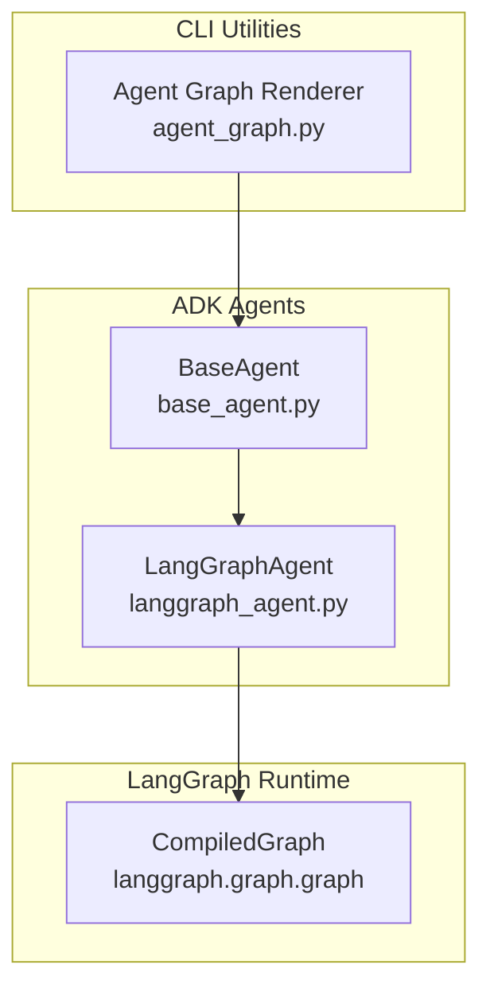
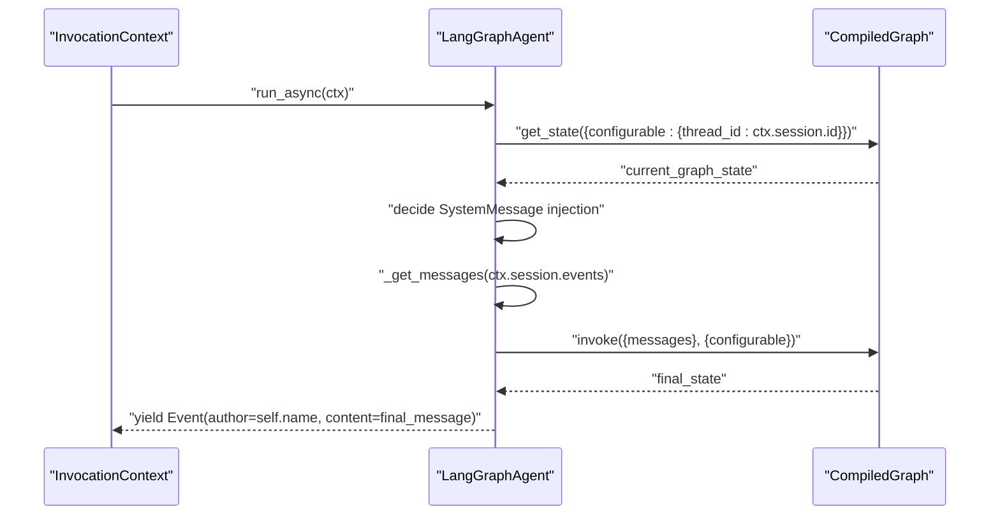
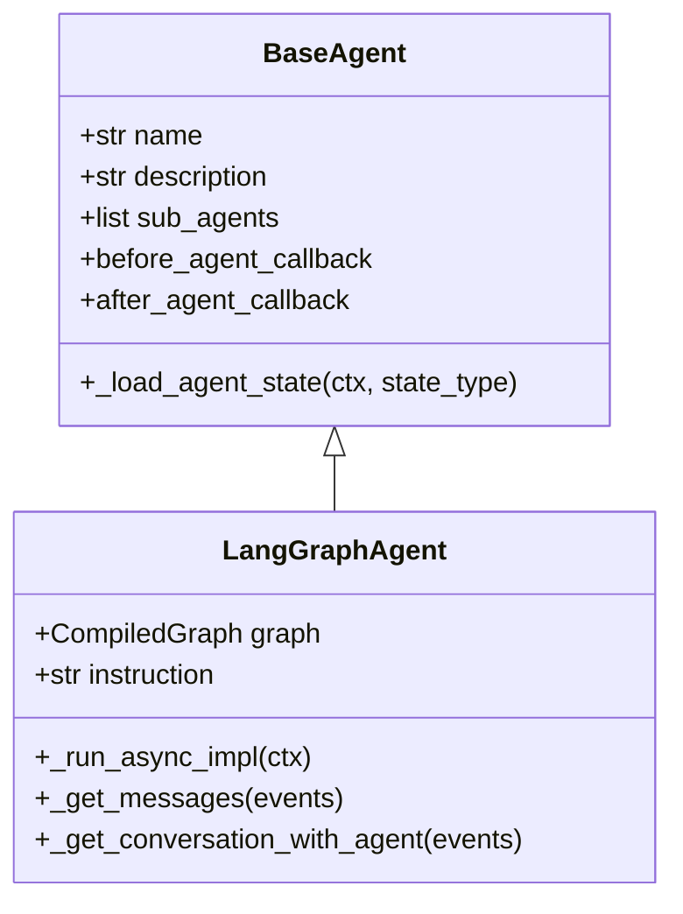
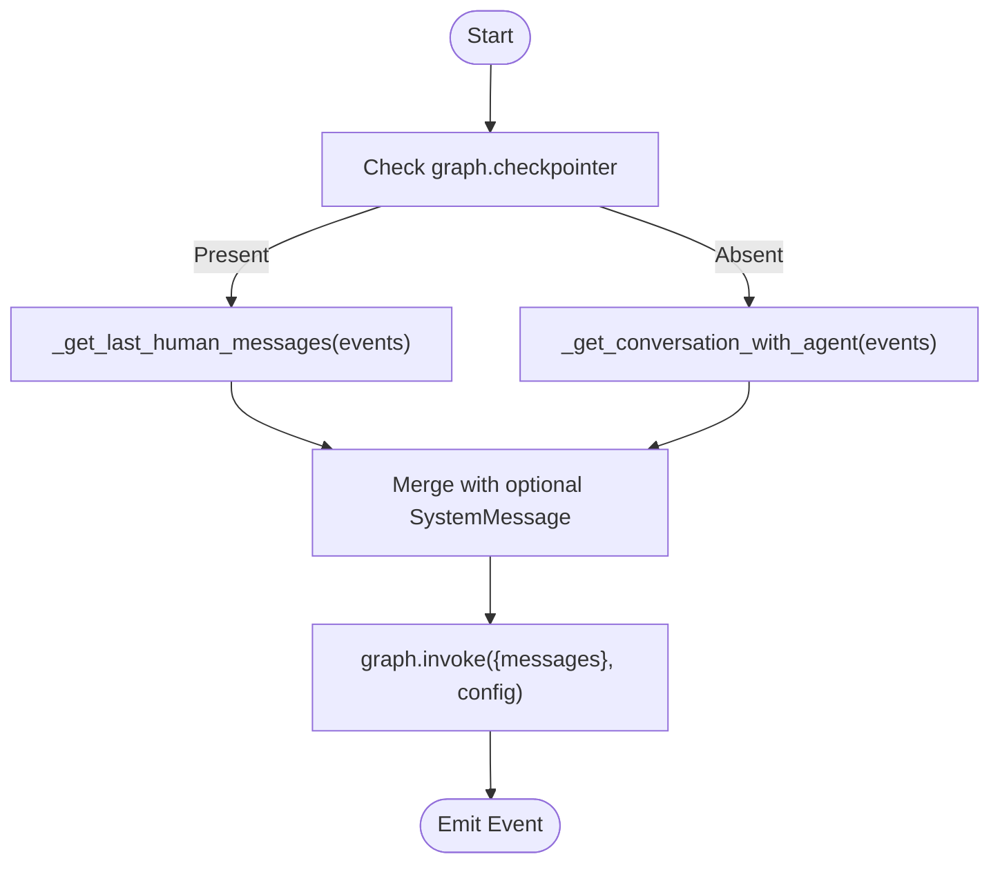
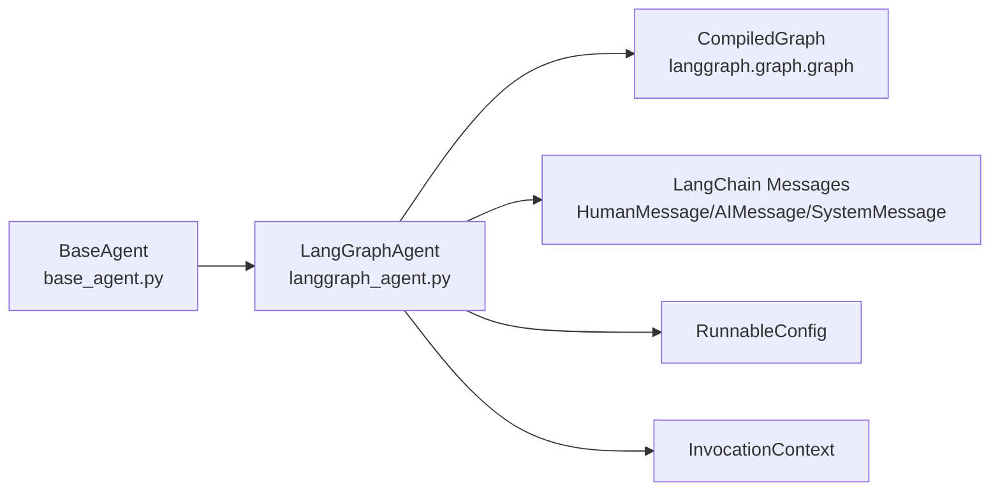

# LangGraph Agents

<cite>
**Referenced Files in This Document**
- [langgraph_agent.py](file://src/google/adk/agents/langgraph_agent.py)
- [test_langgraph_agent.py](file://tests/unittests/agents/test_langgraph_agent.py)
- [base_agent.py](file://src/google/adk/agents/base_agent.py)
- [agent_graph.py](file://src/google/adk/cli/agent_graph.py)
- [README.md](file://contributing/samples/session_state_agent/README.md)
</cite>

## Table of Contents
1. [Introduction](#introduction)
2. [Project Structure](#project-structure)
3. [Core Components](#core-components)
4. [Architecture Overview](#architecture-overview)
5. [Detailed Component Analysis](#detailed-component-analysis)
6. [Dependency Analysis](#dependency-analysis)
7. [Performance Considerations](#performance-considerations)
8. [Troubleshooting Guide](#troubleshooting-guide)
9. [Conclusion](#conclusion)
10. [Appendices](#appendices)

## Introduction
This document explains the LangGraph agent implementation in the Agent Development Kit (ADK). It focuses on the LangGraphAgent class, which integrates LangGraph’s compiled graphs into ADK’s agent runtime. The documentation covers how the agent performs graph-based reasoning, manages state and multi-turn conversations, routes control conditionally, and interoperates with external LangChain components. It also provides practical guidance on configuring graphs, designing state schemas, and implementing conditional logic, along with monitoring and persistence considerations.

## Project Structure
LangGraph integration is centered around a single agent class that wraps a LangGraph CompiledGraph and executes it within ADK’s invocation lifecycle. Supporting infrastructure includes:
- Agent base class and state management
- CLI utilities for rendering agent graphs
- Unit tests validating message handling and invocation behavior

**Diagram sources**
- [langgraph_agent.py](file://src/google/adk/agents/langgraph_agent.py#L52-L144)
- [base_agent.py](file://src/google/adk/agents/base_agent.py#L86-L200)
- [agent_graph.py](file://src/google/adk/cli/agent_graph.py#L41-L293)

**Section sources**
- [langgraph_agent.py](file://src/google/adk/agents/langgraph_agent.py#L1-L144)
- [base_agent.py](file://src/google/adk/agents/base_agent.py#L86-L200)
- [agent_graph.py](file://src/google/adk/cli/agent_graph.py#L41-L293)

## Core Components
- LangGraphAgent: Wraps a CompiledGraph and orchestrates single- and multi-turn executions. It injects system instructions when the graph state is empty, selects message sources based on whether a checkpointer is configured, and yields a final Event containing the model’s response.
- BaseAgent: Provides the foundational agent interface, lifecycle hooks, and state-loading utilities used by LangGraphAgent.
- InvocationContext: Supplies session and invocation metadata used to configure the LangGraph runnable and thread ID for multi-turn conversations.

Key responsibilities:
- Multi-turn support via RunnableConfig with a thread_id derived from the session ID
- Conditional message sourcing: last human messages when using a checkpointer; full conversation when relying on parent agent memory
- Event emission with structured content for downstream processing

**Section sources**
- [langgraph_agent.py](file://src/google/adk/agents/langgraph_agent.py#L52-L144)
- [base_agent.py](file://src/google/adk/agents/base_agent.py#L86-L200)

## Architecture Overview
LangGraphAgent participates in ADK’s agent runtime by:
- Resolving the current graph state to decide whether to inject a system instruction
- Building a message list from either the parent agent’s event history or the last user messages when a checkpointer persists state
- Invoking the CompiledGraph with a RunnableConfig that includes a thread_id for continuity
- Yielding a single Event representing the final model response

**Diagram sources**
- [langgraph_agent.py](file://src/google/adk/agents/langgraph_agent.py#L64-L101)

## Detailed Component Analysis

### LangGraphAgent Class
LangGraphAgent extends BaseAgent and overrides the asynchronous run method to integrate with LangGraph. It:
- Builds a RunnableConfig with a thread_id tied to the session ID for multi-turn continuity
- Checks the current graph state and conditionally adds a SystemMessage if the messages list is empty
- Selects message sources depending on whether the graph has a checkpointer configured
- Invokes the graph and emits a single Event with the model’s final output

**Diagram sources**
- [base_agent.py](file://src/google/adk/agents/base_agent.py#L86-L200)
- [langgraph_agent.py](file://src/google/adk/agents/langgraph_agent.py#L52-L144)

Implementation highlights:
- Thread-aware execution: RunnableConfig uses the session ID as thread_id to maintain state across turns.
- Instruction injection: A SystemMessage is inserted when the graph state is empty and an instruction is provided.
- Memory strategy:
  - With a checkpointer: only the last user messages are forwarded to the graph to leverage LangGraph’s internal state.
  - Without a checkpointer: the full conversation history between user and the agent is included.

Operational flow:
- Determine RunnableConfig and current graph state
- Optionally prepend a SystemMessage
- Build messages from events using the appropriate strategy
- Invoke the graph and emit the final Event

**Section sources**
- [langgraph_agent.py](file://src/google/adk/agents/langgraph_agent.py#L52-L144)

### Message Selection Logic
LangGraphAgent chooses between two strategies for assembling the message list:
- Last human messages only: Used when a checkpointer is present to rely on LangGraph’s persisted state.
- Full conversation with the agent: Used when no checkpointer is present to include prior agent responses.

**Diagram sources**
- [langgraph_agent.py](file://src/google/adk/agents/langgraph_agent.py#L103-L143)

**Section sources**
- [langgraph_agent.py](file://src/google/adk/agents/langgraph_agent.py#L103-L143)

### Conditional Routing and Branching
LangGraphAgent itself does not define conditional logic; it delegates routing decisions to the underlying CompiledGraph. Typical patterns include:
- Conditional edges in the graph definition to route based on tool calls, model outputs, or state values
- Using graph nodes to represent steps in a decision tree or multi-step workflow
- Leveraging state keys to influence transitions

To implement branching:
- Define nodes and edges in the LangGraph graph that encode your decision logic
- Use state keys to carry flags or intermediate results that inform routing
- Ensure the graph’s checkpointer is configured if multi-turn state continuity is required

Note: The agent’s responsibility is to pass the correct message list and thread configuration; the graph defines the control flow.

**Section sources**
- [langgraph_agent.py](file://src/google/adk/agents/langgraph_agent.py#L64-L101)

### State Management and Persistence
- Thread ID: The agent sets a thread_id in RunnableConfig using the session ID, enabling multi-turn conversations with LangGraph’s checkpointer.
- State inspection: The agent queries the current graph state to decide whether to inject a system instruction.
- Persistence strategy:
  - With a checkpointer: rely on LangGraph’s persisted state; forward only the last user messages to minimize redundant context.
  - Without a checkpointer: include the full conversation to preserve context within the agent’s memory.

Practical guidance:
- Design state schemas with explicit keys for routing and flags
- Keep messages minimal when using a checkpointer to reduce overhead
- Use the session’s event history as a fallback when no checkpointer is configured

**Section sources**
- [langgraph_agent.py](file://src/google/adk/agents/langgraph_agent.py#L64-L101)
- [README.md](file://contributing/samples/session_state_agent/README.md#L50-L67)

### Integration with External LangChain Components
LangGraphAgent depends on:
- CompiledGraph from LangGraph to execute the reasoning workflow
- LangChain message types (HumanMessage, AIMessage, SystemMessage) to construct inputs
- RunnableConfig to pass thread identifiers and other runtime options

Integration tips:
- Ensure the graph is compiled with appropriate nodes, edges, and state schema
- Provide a checkpointer if you need persistent multi-turn state
- Align message construction with the graph’s expected state keys

**Section sources**
- [langgraph_agent.py](file://src/google/adk/agents/langgraph_agent.py#L20-L31)
- [langgraph_agent.py](file://src/google/adk/agents/langgraph_agent.py#L64-L101)

### Execution Monitoring and Observability
- Events: The agent yields a single Event containing the model’s response, enabling downstream monitoring and telemetry.
- Tracing: BaseAgent leverages ADK’s tracing utilities; LangGraphAgent participates in the same tracing context through the invocation lifecycle.

Recommendations:
- Attach observability hooks around graph invocation
- Log thread_id and message counts for debugging multi-turn runs
- Track latency and token usage via ADK’s telemetry infrastructure

**Section sources**
- [base_agent.py](file://src/google/adk/agents/base_agent.py#L46-L47)
- [langgraph_agent.py](file://src/google/adk/agents/langgraph_agent.py#L92-L101)

## Dependency Analysis
LangGraphAgent depends on:
- BaseAgent for lifecycle and state utilities
- LangGraph’s CompiledGraph for execution
- LangChain message types for input construction
- InvocationContext for session and invocation metadata

**Diagram sources**
- [langgraph_agent.py](file://src/google/adk/agents/langgraph_agent.py#L20-L31)
- [base_agent.py](file://src/google/adk/agents/base_agent.py#L86-L200)

**Section sources**
- [langgraph_agent.py](file://src/google/adk/agents/langgraph_agent.py#L20-L31)
- [base_agent.py](file://src/google/adk/agents/base_agent.py#L86-L200)

## Performance Considerations
- Minimize message payload: When using a checkpointer, forward only the last user messages to reduce context size and improve throughput.
- Optimize graph structure: Keep nodes focused and avoid unnecessary branching to reduce execution time.
- Monitor multi-turn runs: Use thread_id consistently and track state growth to prevent excessive memory usage.
- Leverage streaming: If your graph supports streaming, integrate it to improve perceived latency.

## Troubleshooting Guide
Common issues and resolutions:
- Empty or stale graph state: Ensure the graph is compiled and that RunnableConfig includes the correct thread_id derived from the session ID.
- Missing system instruction: The agent injects a SystemMessage only when the graph state is empty and an instruction is provided; verify both conditions.
- Incorrect message history: If using a checkpointer, the agent forwards only the last user messages. If relying on parent agent memory, include the full conversation.
- Invocation mismatch: Confirm that the graph expects a "messages" key and that the message list is properly constructed from events.

Validation references:
- Tests demonstrate expected message lists under different checkpointer and event configurations, including assertions on graph invocation arguments.

**Section sources**
- [test_langgraph_agent.py](file://tests/unittests/agents/test_langgraph_agent.py#L96-L260)

## Conclusion
LangGraphAgent provides a clean bridge between ADK’s agent runtime and LangGraph’s compiled graphs. By leveraging thread-aware execution, conditional message sourcing, and event-driven outputs, it enables robust multi-turn reasoning and complex decision-making workflows. Properly designed state schemas, checkpointer configuration, and graph routing logic are essential to unlock the full potential of graph-based agents in ADK.

## Appendices

### Practical Examples and Patterns
- Single-turn execution: Provide a graph with a simple node and a SystemMessage when the state is empty.
- Multi-turn execution: Configure a checkpointer and rely on thread_id continuity; forward only the last user messages.
- Decision trees: Encode branches in the graph using state keys and conditional edges; use the agent to orchestrate message assembly and invocation.
- Tool integration: Compose tool-calling nodes within the graph; ensure the agent’s message list includes the latest user input and any prior agent responses when not using a checkpointer.

[No sources needed since this section provides general guidance]