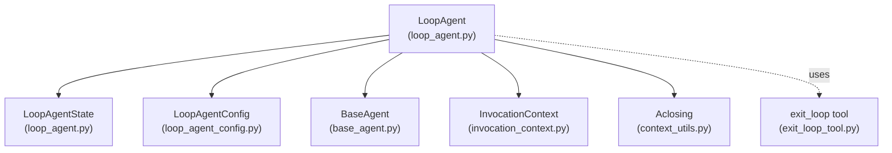
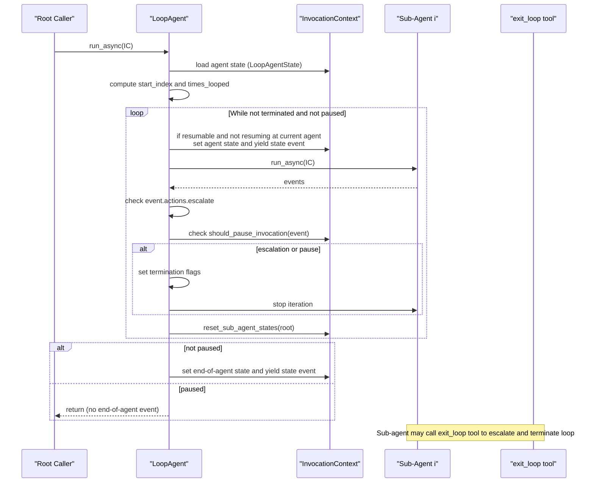
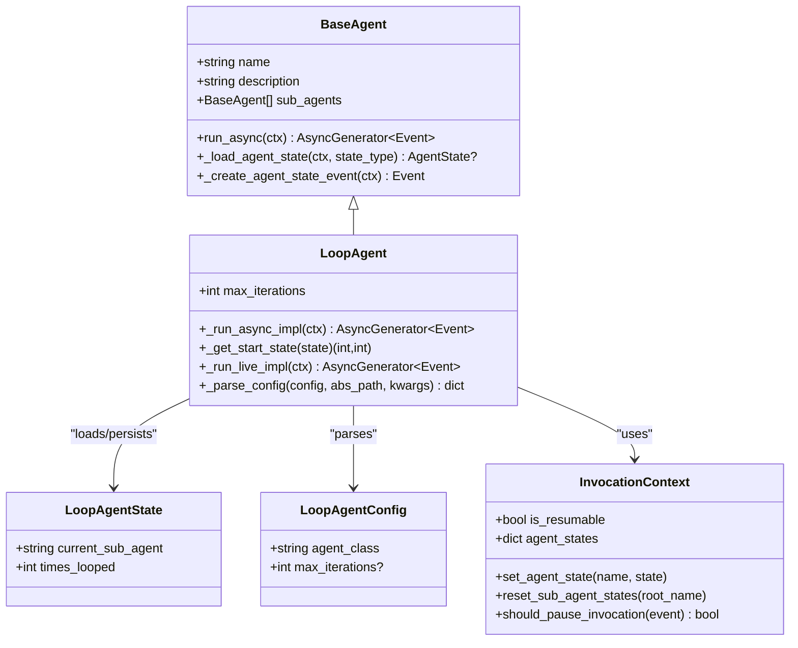
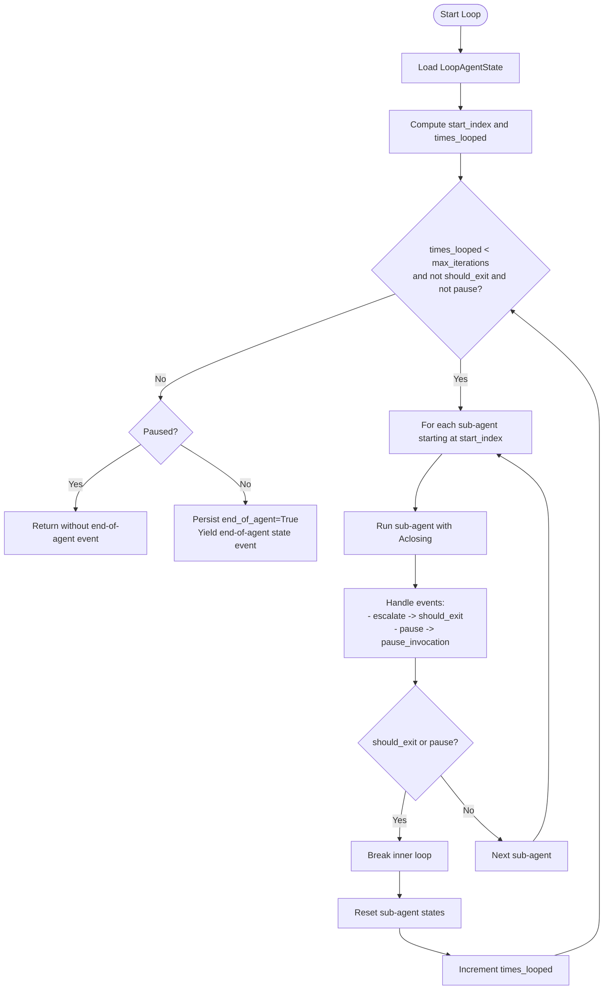
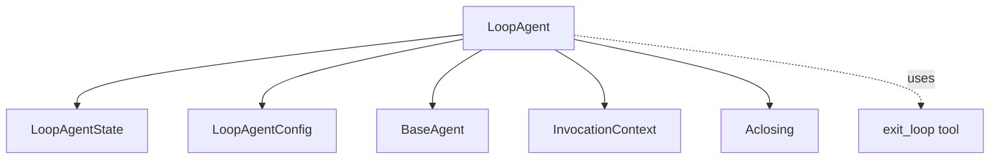

# Loop Agents

<cite>
**Referenced Files in This Document**
- [loop_agent.py](file://src/google/adk/agents/loop_agent.py)
- [loop_agent_config.py](file://src/google/adk/agents/loop_agent_config.py)
- [base_agent.py](file://src/google/adk/agents/base_agent.py)
- [invocation_context.py](file://src/google/adk/agents/invocation_context.py)
- [context_utils.py](file://src/google/adk/utils/context_utils.py)
- [exit_loop_tool.py](file://src/google/adk/tools/exit_loop_tool.py)
- [test_loop_agent.py](file://tests/unittests/agents/test_loop_agent.py)
- [test_pause_invocation.py](file://tests/unittests/runners/test_pause_invocation.py)
- [loop_agent.yaml](file://contributing/samples/multi_agent_loop_config/loop_agent.yaml)
- [root_agent.yaml](file://contributing/samples/multi_agent_loop_config/root_agent.yaml)
- [critic_agent.yaml](file://contributing/samples/multi_agent_loop_config/writer_agents/critic_agent.yaml)
- [refiner_agent.yaml](file://contributing/samples/multi_agent_loop_config/writer_agents/refiner_agent.yaml)
- [initial_writer_agent.yaml](file://contributing/samples/multi_agent_loop_config/writer_agents/initial_writer_agent.yaml)
</cite>

## Table of Contents
1. [Introduction](#introduction)
2. [Project Structure](#project-structure)
3. [Core Components](#core-components)
4. [Architecture Overview](#architecture-overview)
5. [Detailed Component Analysis](#detailed-component-analysis)
6. [Dependency Analysis](#dependency-analysis)
7. [Performance Considerations](#performance-considerations)
8. [Troubleshooting Guide](#troubleshooting-guide)
9. [Conclusion](#conclusion)
10. [Appendices](#appendices)

## Introduction
This document explains Loop Agents in the Agent Development Kit (ADK). Loop agents enable iterative workflows where a parent agent repeatedly executes a fixed list of sub-agents until a termination condition is met. Termination conditions include explicit escalation signaling, reaching a configured maximum iteration count, or invocation pause/resume semantics. The LoopAgent class encapsulates loop control, state management across iterations, and seamless resumption behavior for long-running invocations.

## Project Structure
The LoopAgent implementation resides in the agents package and integrates with the broader agent framework, invocation context, and utilities for resumable runs.

**Diagram sources**
- [loop_agent.py](file://src/google/adk/agents/loop_agent.py#L41-L166)
- [loop_agent_config.py](file://src/google/adk/agents/loop_agent_config.py#L29-L45)
- [base_agent.py](file://src/google/adk/agents/base_agent.py#L86-L200)
- [invocation_context.py](file://src/google/adk/agents/invocation_context.py)
- [context_utils.py](file://src/google/adk/utils/context_utils.py)
- [exit_loop_tool.py](file://src/google/adk/tools/exit_loop_tool.py#L20-L26)

**Section sources**
- [loop_agent.py](file://src/google/adk/agents/loop_agent.py#L41-L166)
- [loop_agent_config.py](file://src/google/adk/agents/loop_agent_config.py#L29-L45)
- [base_agent.py](file://src/google/adk/agents/base_agent.py#L86-L200)

## Core Components
- LoopAgent: Orchestrates repeated execution of sub-agents, tracks loop state, and enforces termination conditions.
- LoopAgentState: Captures the current sub-agent and iteration count for resumable runs.
- LoopAgentConfig: Defines configuration schema for LoopAgent, including optional max_iterations.
- InvocationContext: Provides resumability hooks, pause detection, and per-agent state persistence.
- exit_loop tool: A tool that sets escalation to terminate the loop gracefully.

Key responsibilities:
- Iteration control: Runs sub-agents in sequence, restarting from the beginning each iteration.
- Termination: Stops on escalation, max_iterations, or pause.
- State management: Persists LoopAgentState and resets sub-agent states between iterations.
- Resumability: Yields agent-state events to support pause/resume continuity.

**Section sources**
- [loop_agent.py](file://src/google/adk/agents/loop_agent.py#L41-L166)
- [loop_agent_config.py](file://src/google/adk/agents/loop_agent_config.py#L29-L45)
- [exit_loop_tool.py](file://src/google/adk/tools/exit_loop_tool.py#L20-L26)

## Architecture Overview
The LoopAgent composes sub-agents and coordinates their execution across iterations. It uses InvocationContext to persist state and detect pause conditions. Sub-agent runs are wrapped with Aclosing to ensure proper resource cleanup.

**Diagram sources**
- [loop_agent.py](file://src/google/adk/agents/loop_agent.py#L69-L124)
- [invocation_context.py](file://src/google/adk/agents/invocation_context.py)
- [context_utils.py](file://src/google/adk/utils/context_utils.py)
- [exit_loop_tool.py](file://src/google/adk/tools/exit_loop_tool.py#L20-L26)

## Detailed Component Analysis

### LoopAgent Class
Responsibilities:
- Iterative orchestration: Executes sub-agents in a loop, resetting state between iterations.
- Termination logic: Supports escalation, max_iterations, and pause/resume.
- State persistence: Saves LoopAgentState for resumable runs and yields state events.
- Sub-agent lifecycle: Wraps sub-agent execution with Aclosing for safe resource handling.

**Diagram sources**
- [loop_agent.py](file://src/google/adk/agents/loop_agent.py#L41-L166)
- [base_agent.py](file://src/google/adk/agents/base_agent.py#L86-L200)
- [loop_agent_config.py](file://src/google/adk/agents/loop_agent_config.py#L29-L45)

Key behaviors:
- Iteration control: The outer while loop continues until max_iterations is reached or termination flags are set. The inner for loop iterates over sub_agents, starting at computed start_index.
- Termination conditions:
  - Escalation: If any sub-agent emits an event with escalation set, the loop stops.
  - Pause: If InvocationContext indicates a pause, the loop exits early without emitting an end-of-agent event.
  - Max iterations: If max_iterations is set and times_looped reaches it, the loop stops.
- State management:
  - On first iteration of a resumable run, LoopAgentState is persisted and a state event is yielded to mark the current sub-agent and iteration.
  - At the end of each iteration, sub-agent states are reset via InvocationContext.
  - On completion (not paused), LoopAgent persists end_of_agent=True and yields a terminal state event.

**Section sources**
- [loop_agent.py](file://src/google/adk/agents/loop_agent.py#L69-L124)
- [loop_agent.py](file://src/google/adk/agents/loop_agent.py#L125-L146)

### LoopAgentState
Purpose:
- Tracks the current sub-agent being executed and the number of completed iterations.
- Enables resuming the loop at the correct position after a pause or interruption.

Fields:
- current_sub_agent: Name of the sub-agent currently executing.
- times_looped: Number of full iterations completed.

Behavior:
- Restored from InvocationContext on resume.
- If the stored current_sub_agent is missing from the current sub-agent list, the loop restarts from the beginning and logs a warning.

**Section sources**
- [loop_agent.py](file://src/google/adk/agents/loop_agent.py#L42-L49)
- [loop_agent.py](file://src/google/adk/agents/loop_agent.py#L125-L146)

### LoopAgentConfig
Purpose:
- Defines the YAML schema for LoopAgent configuration.
- Supports optional max_iterations to cap loop iterations.

Fields:
- agent_class: Must be LoopAgent.
- max_iterations: Optional integer to limit iterations.

Parsing:
- _parse_config maps max_iterations from config to runtime attribute.

**Section sources**
- [loop_agent_config.py](file://src/google/adk/agents/loop_agent_config.py#L29-L45)
- [loop_agent.py](file://src/google/adk/agents/loop_agent.py#L155-L166)

### InvocationContext Integration
- Resumability: LoopAgent checks is_resumable and persists LoopAgentState via set_agent_state and yields state events using _create_agent_state_event.
- Pause detection: should_pause_invocation(event) controls early termination to support pause/resume.
- Sub-agent state reset: reset_sub_agent_states(root_name) clears sub-agent states at the end of each iteration.

**Section sources**
- [loop_agent.py](file://src/google/adk/agents/loop_agent.py#L69-L124)
- [base_agent.py](file://src/google/adk/agents/base_agent.py#L168-L200)

### exit_loop Tool
- Purpose: Allows a sub-agent to signal the loop to terminate immediately by setting escalation.
- Usage: Sub-agents can call this tool to indicate completion or readiness to exit the loop.

**Section sources**
- [exit_loop_tool.py](file://src/google/adk/tools/exit_loop_tool.py#L20-L26)

### Practical Examples

#### YAML Configuration Example
- LoopAgent configured with max_iterations and a list of sub-agent configs.
- Parent SequentialAgent includes the LoopAgent in its sub-agent chain.

References:
- [loop_agent.yaml](file://contributing/samples/multi_agent_loop_config/loop_agent.yaml#L1-L9)
- [root_agent.yaml](file://contributing/samples/multi_agent_loop_config/root_agent.yaml#L1-L8)

#### Iterative Writing Pipeline
- InitialWriterAgent produces a draft.
- RefinerAgent improves the draft based on CriticAgent’s feedback.
- RefinerAgent calls exit_loop when no further improvements are needed.
- LoopAgent repeats until exit_loop escalates.

References:
- [initial_writer_agent.yaml](file://contributing/samples/multi_agent_loop_config/writer_agents/initial_writer_agent.yaml#L1-L14)
- [critic_agent.yaml](file://contributing/samples/multi_agent_loop_config/writer_agents/critic_agent.yaml#L1-L33)
- [refiner_agent.yaml](file://contributing/samples/multi_agent_loop_config/writer_agents/refiner_agent.yaml#L1-L26)

#### Unit Tests Demonstrating Behavior
- Basic loop with resumability and non-resumable modes.
- Resume from mid-loop with correct start_index and times_looped.
- Escalation termination and end-of-agent event emission.
- No-op when no sub-agents are provided.

References:
- [test_loop_agent.py](file://tests/unittests/agents/test_loop_agent.py#L102-L138)
- [test_loop_agent.py](file://tests/unittests/agents/test_loop_agent.py#L141-L167)
- [test_loop_agent.py](file://tests/unittests/agents/test_loop_agent.py#L184-L251)

### Loop Control Mechanisms and Termination Conditions
- Iteration loop: Outer while loop controls continuation based on max_iterations and termination flags.
- Sub-agent loop: Inner for loop iterates over sub_agents starting at computed index.
- Termination flags:
  - should_exit: Set upon escalation.
  - pause_invocation: Set upon pause detection.
- Early exit: Breaks inner loop when termination flags are set.
- End-of-run: Emits end-of-agent state event unless paused.

**Diagram sources**
- [loop_agent.py](file://src/google/adk/agents/loop_agent.py#L69-L124)
- [loop_agent.py](file://src/google/adk/agents/loop_agent.py#L125-L146)

**Section sources**
- [loop_agent.py](file://src/google/adk/agents/loop_agent.py#L69-L124)
- [loop_agent.py](file://src/google/adk/agents/loop_agent.py#L125-L146)

### State Management Across Iterations
- Persistence: LoopAgentState is saved to InvocationContext and emitted as state events for resumable runs.
- Consistency: Sub-agent states are reset at the end of each iteration to ensure clean execution contexts.
- Resumption: On resume, LoopAgent restores times_looped and start_index from state, with fallback to restart from the beginning if the stored sub-agent is missing.

**Section sources**
- [loop_agent.py](file://src/google/adk/agents/loop_agent.py#L76-L96)
- [loop_agent.py](file://src/google/adk/agents/loop_agent.py#L114-L115)
- [loop_agent.py](file://src/google/adk/agents/loop_agent.py#L125-L146)

### Error Handling During Loops
- Infinite loop prevention: max_iterations acts as a hard cap; if unset, loop continues until escalation or pause.
- Sub-agent removal: If the stored current_sub_agent is not found, the loop restarts from the beginning and logs a warning.
- Pause handling: When paused, LoopAgent returns early without emitting an end-of-agent event, preserving resumability.

**Section sources**
- [loop_agent.py](file://src/google/adk/agents/loop_agent.py#L62-L67)
- [loop_agent.py](file://src/google/adk/agents/loop_agent.py#L139-L145)
- [loop_agent.py](file://src/google/adk/agents/loop_agent.py#L117-L119)

### Use Cases
- Iterative problem solving: Alternating critics and refiners refine outputs until satisfied.
- Feedback loops: Continuous review and improvement cycles guided by structured tools.
- Continuous monitoring: Repeatedly invoking monitoring agents with periodic resets.

[No sources needed since this section provides general guidance]

## Dependency Analysis
The LoopAgent depends on the agent base classes, invocation context, and utilities for resumable runs. Its configuration is validated against LoopAgentConfig.

**Diagram sources**
- [loop_agent.py](file://src/google/adk/agents/loop_agent.py#L41-L166)
- [loop_agent_config.py](file://src/google/adk/agents/loop_agent_config.py#L29-L45)

**Section sources**
- [loop_agent.py](file://src/google/adk/agents/loop_agent.py#L41-L166)
- [loop_agent_config.py](file://src/google/adk/agents/loop_agent_config.py#L29-L45)

## Performance Considerations
- Iteration overhead: Each iteration incurs state persistence and sub-agent state resets. Keep sub-agent lists concise and bounded.
- Resource cleanup: Aclosing ensures sub-agent resources are released promptly after each sub-agent completes.
- Pause handling: Early termination on pause avoids unnecessary work and preserves resumability.

[No sources needed since this section provides general guidance]

## Troubleshooting Guide
Common issues and resolutions:
- Loop does not terminate: Verify sub-agents emit escalation or call exit_loop to set escalation.
- Unexpected restart after pause: Confirm LoopAgentState is persisted and restored correctly; missing current_sub_agent triggers restart.
- Infinite loop risk: Set max_iterations to prevent unbounded iterations.
- Pause not respected: Ensure InvocationContext is resumable and should_pause_invocation is evaluated properly.

References:
- [test_pause_invocation.py](file://tests/unittests/runners/test_pause_invocation.py#L345-L385)
- [test_loop_agent.py](file://tests/unittests/agents/test_loop_agent.py#L184-L251)

**Section sources**
- [test_pause_invocation.py](file://tests/unittests/runners/test_pause_invocation.py#L345-L385)
- [test_loop_agent.py](file://tests/unittests/agents/test_loop_agent.py#L184-L251)

## Conclusion
Loop Agents provide a robust mechanism for iterative workflows in ADK. They combine configurable iteration limits, escalation-based termination, and resumable state management to support complex feedback loops and continuous monitoring scenarios. By leveraging LoopAgentState and InvocationContext, developers can build reliable, maintainable iterative pipelines with predictable termination and consistent state behavior.

[No sources needed since this section summarizes without analyzing specific files]

## Appendices

### Configuration Reference
- LoopAgentConfig fields:
  - agent_class: Must be LoopAgent.
  - max_iterations: Optional integer to cap iterations.

References:
- [loop_agent_config.py](file://src/google/adk/agents/loop_agent_config.py#L37-L44)

### YAML Sample References
- LoopAgent configuration:
  - [loop_agent.yaml](file://contributing/samples/multi_agent_loop_config/loop_agent.yaml#L1-L9)
- Parent agent composition:
  - [root_agent.yaml](file://contributing/samples/multi_agent_loop_config/root_agent.yaml#L1-L8)
- Sub-agent examples:
  - [initial_writer_agent.yaml](file://contributing/samples/multi_agent_loop_config/writer_agents/initial_writer_agent.yaml#L1-L14)
  - [critic_agent.yaml](file://contributing/samples/multi_agent_loop_config/writer_agents/critic_agent.yaml#L1-L33)
  - [refiner_agent.yaml](file://contributing/samples/multi_agent_loop_config/writer_agents/refiner_agent.yaml#L1-L26)