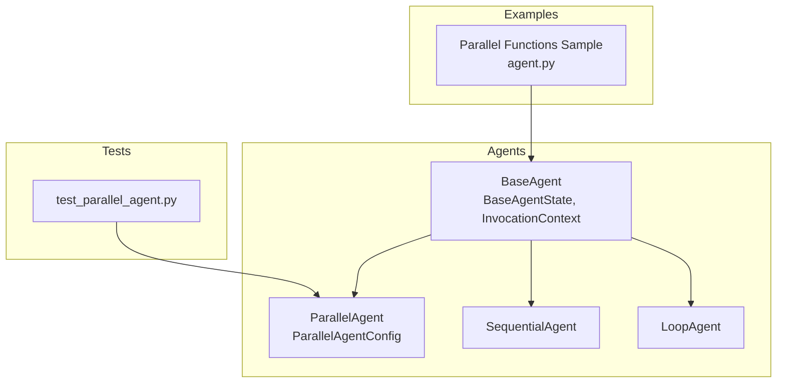
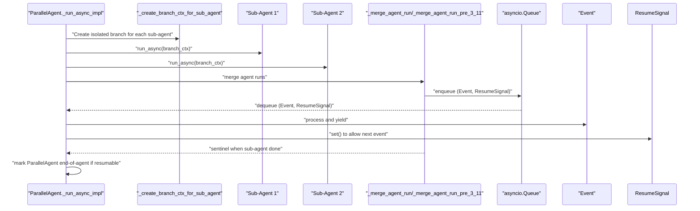
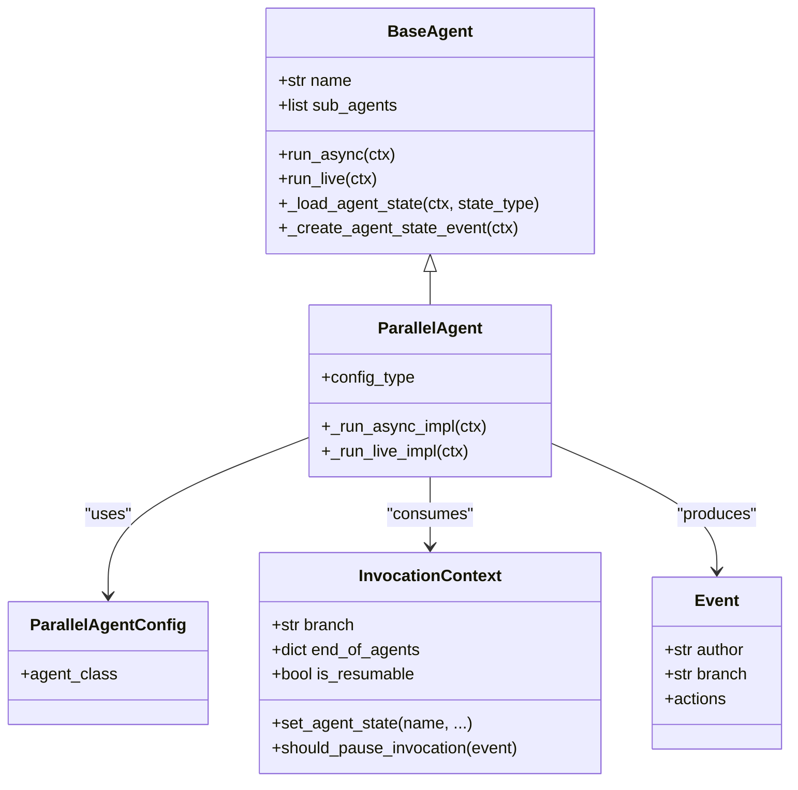
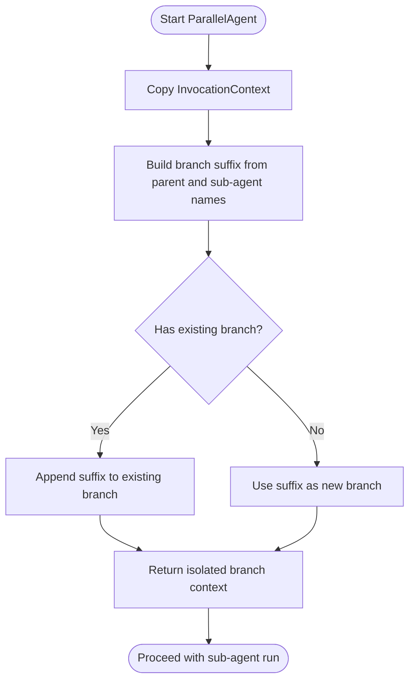
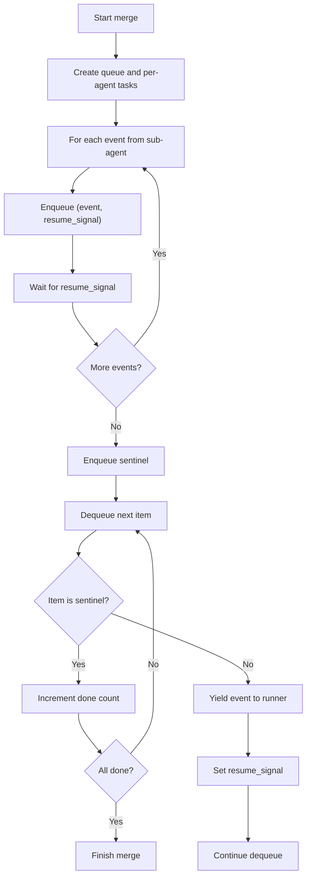
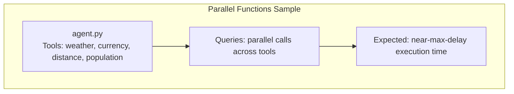
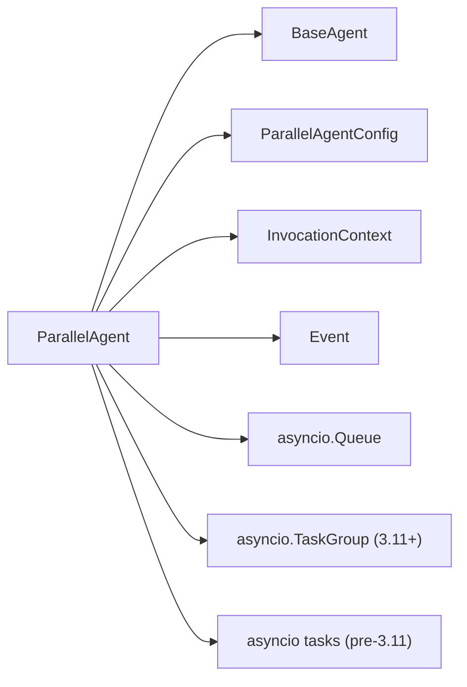

# Parallel Agents

<cite>
**Referenced Files in This Document**
- [parallel_agent.py](file://src/google/adk/agents/parallel_agent.py)
- [parallel_agent_config.py](file://src/google/adk/agents/parallel_agent_config.py)
- [base_agent.py](file://src/google/adk/agents/base_agent.py)
- [sequential_agent.py](file://src/google/adk/agents/sequential_agent.py)
- [loop_agent.py](file://src/google/adk/agents/loop_agent.py)
- [test_parallel_agent.py](file://tests/unittests/agents/test_parallel_agent.py)
- [agent.py](file://contributing/samples/parallel_functions/agent.py)
- [README.md](file://contributing/samples/parallel_functions/README.md)
</cite>

## Table of Contents
1. [Introduction](#introduction)
2. [Project Structure](#project-structure)
3. [Core Components](#core-components)
4. [Architecture Overview](#architecture-overview)
5. [Detailed Component Analysis](#detailed-component-analysis)
6. [Dependency Analysis](#dependency-analysis)
7. [Performance Considerations](#performance-considerations)
8. [Troubleshooting Guide](#troubleshooting-guide)
9. [Conclusion](#conclusion)
10. [Appendices](#appendices)

## Introduction
This document explains the ParallelAgent in the Agent Development Kit (ADK). ParallelAgent enables concurrent execution of multiple sub-agents, distributing independent workloads across sub-agents and merging their event streams in a controlled, backpressured manner. It supports resumable invocations, isolated execution contexts per sub-agent, and robust error propagation. Use cases include multi-source information gathering, parallel data processing, and concurrent task execution where independent sub-tasks can be executed simultaneously.

## Project Structure
ParallelAgent is implemented as a specialized agent that orchestrates sub-agents concurrently. It integrates with the ADK agent framework and shares common abstractions with other agents such as BaseAgent, SequentialAgent, and LoopAgent.

**Diagram sources**
- [parallel_agent.py](file://src/google/adk/agents/parallel_agent.py#L150-L217)
- [parallel_agent_config.py](file://src/google/adk/agents/parallel_agent_config.py#L27-L41)
- [base_agent.py](file://src/google/adk/agents/base_agent.py#L86-L200)
- [sequential_agent.py](file://src/google/adk/agents/sequential_agent.py#L74-L113)
- [loop_agent.py](file://src/google/adk/agents/loop_agent.py#L79-L116)
- [agent.py](file://contributing/samples/parallel_functions/agent.py#L217-L247)
- [test_parallel_agent.py](file://tests/unittests/agents/test_parallel_agent.py#L75-L121)

**Section sources**
- [parallel_agent.py](file://src/google/adk/agents/parallel_agent.py#L150-L217)
- [parallel_agent_config.py](file://src/google/adk/agents/parallel_agent_config.py#L27-L41)
- [base_agent.py](file://src/google/adk/agents/base_agent.py#L86-L200)
- [sequential_agent.py](file://src/google/adk/agents/sequential_agent.py#L74-L113)
- [loop_agent.py](file://src/google/adk/agents/loop_agent.py#L79-L116)
- [agent.py](file://contributing/samples/parallel_functions/agent.py#L217-L247)
- [test_parallel_agent.py](file://tests/unittests/agents/test_parallel_agent.py#L75-L121)

## Core Components
- ParallelAgent: Orchestrates concurrent sub-agent execution, manages isolated invocation contexts, merges event streams with backpressure, and handles resumable checkpoints.
- ParallelAgentConfig: Defines the YAML configuration schema for ParallelAgent, marking it as experimental and binding agent_class to ParallelAgent.
- BaseAgent and BaseAgentState: Provide foundational agent behavior, state loading/saving, and invocation context integration used by ParallelAgent.
- SequentialAgent and LoopAgent: Offer complementary orchestration patterns (sequential and iterative) for comparison and hybrid usage with ParallelAgent.

Key responsibilities:
- Independent execution contexts per sub-agent via branch isolation.
- Backpressured event merging to prevent unbounded concurrency.
- Resumable checkpoints for long-running or paused executions.
- Exception propagation to terminate all sub-agents promptly.

**Section sources**
- [parallel_agent.py](file://src/google/adk/agents/parallel_agent.py#L150-L217)
- [parallel_agent_config.py](file://src/google/adk/agents/parallel_agent_config.py#L27-L41)
- [base_agent.py](file://src/google/adk/agents/base_agent.py#L86-L200)
- [sequential_agent.py](file://src/google/adk/agents/sequential_agent.py#L74-L113)
- [loop_agent.py](file://src/google/adk/agents/loop_agent.py#L79-L116)

## Architecture Overview
ParallelAgent coordinates sub-agents concurrently. For each sub-agent, it creates an isolated InvocationContext with a unique branch suffix. It collects AsyncGenerators from each sub-agent and merges their events using a queue-backed mechanism with per-event backpressure. On Python 3.11+, asyncio.TaskGroup is used; on older versions, a compatible fallback ensures equivalent semantics.

**Diagram sources**
- [parallel_agent.py](file://src/google/adk/agents/parallel_agent.py#L35-L86)
- [parallel_agent.py](file://src/google/adk/agents/parallel_agent.py#L88-L148)
- [parallel_agent.py](file://src/google/adk/agents/parallel_agent.py#L163-L210)

## Detailed Component Analysis

### ParallelAgent Class
ParallelAgent extends BaseAgent and overrides asynchronous run methods. It:
- Validates presence of sub-agents and prepares isolated InvocationContexts.
- Collects AsyncGenerators for sub-agents that have not previously finished.
- Selects a merge function based on Python version.
- Streams merged events, honoring backpressure and pause signals.
- Emits resumable checkpoints and marks completion when all sub-agents finish.

**Diagram sources**
- [parallel_agent.py](file://src/google/adk/agents/parallel_agent.py#L150-L217)
- [parallel_agent_config.py](file://src/google/adk/agents/parallel_agent_config.py#L27-L41)
- [base_agent.py](file://src/google/adk/agents/base_agent.py#L86-L200)

Implementation highlights:
- Isolation: Each sub-agent receives a branch-aware InvocationContext to keep descendant events grouped under distinct branches.
- Merging: A queue-backed merge enforces one outstanding event per sub-agent at a time, preventing resource contention and simplifying result processing.
- Python compatibility: Uses asyncio.TaskGroup on 3.11+; falls back to manual task management on older versions with equivalent semantics.
- Completion: Emits resumable end-of-agent markers when all sub-agents finish and resumability is enabled.

**Section sources**
- [parallel_agent.py](file://src/google/adk/agents/parallel_agent.py#L35-L86)
- [parallel_agent.py](file://src/google/adk/agents/parallel_agent.py#L88-L148)
- [parallel_agent.py](file://src/google/adk/agents/parallel_agent.py#L163-L210)

### ParallelAgentConfig
Defines the YAML configuration for ParallelAgent:
- agent_class defaults to "ParallelAgent".
- Marked experimental via feature gating.

This configuration binds YAML-defined agents to the ParallelAgent runtime.

**Section sources**
- [parallel_agent_config.py](file://src/google/adk/agents/parallel_agent_config.py#L27-L41)

### Branch Isolation and InvocationContext
ParallelAgent constructs a unique branch for each sub-agent by appending a suffix to the current branch. This ensures descendant events from the same sub-agent share the same branch, enabling coherent grouping and downstream routing.

**Diagram sources**
- [parallel_agent.py](file://src/google/adk/agents/parallel_agent.py#L35-L48)

**Section sources**
- [parallel_agent.py](file://src/google/adk/agents/parallel_agent.py#L35-L48)

### Event Merging and Backpressure
ParallelAgent merges events from multiple sub-agents using a queue and per-event resume signals. Each sub-agent’s generator is wrapped in a coroutine that:
- Enqueues each event along with a resume signal.
- Waits for the runner to process the event and call set() on the resume signal.
- Terminates by enqueuing a sentinel when done.

On Python 3.11+, asyncio.TaskGroup runs all sub-agents concurrently. On older versions, tasks are manually managed with exception propagation and cancellation.

**Diagram sources**
- [parallel_agent.py](file://src/google/adk/agents/parallel_agent.py#L51-L86)
- [parallel_agent.py](file://src/google/adk/agents/parallel_agent.py#L88-L148)

**Section sources**
- [parallel_agent.py](file://src/google/adk/agents/parallel_agent.py#L51-L86)
- [parallel_agent.py](file://src/google/adk/agents/parallel_agent.py#L88-L148)

### Resumability and Completion
ParallelAgent supports resumable invocations:
- On first run, it persists a BaseAgentState checkpoint for itself and each sub-agent.
- During iteration, it checks pause conditions and stops early if requested.
- After all sub-agents finish, it marks itself as end-of-agent and emits a checkpoint when resumability is enabled.

SequentialAgent and LoopAgent demonstrate similar patterns for comparison.

**Section sources**
- [parallel_agent.py](file://src/google/adk/agents/parallel_agent.py#L163-L210)
- [sequential_agent.py](file://src/google/adk/agents/sequential_agent.py#L74-L93)
- [loop_agent.py](file://src/google/adk/agents/loop_agent.py#L79-L116)

### Error Handling and Cancellation
ParallelAgent propagates exceptions from sub-agents to the runner and cancels pending tasks. Tests confirm:
- Exceptions raised by a sub-agent are propagated to the top-level runner.
- Infinite loops in a sub-agent cause the runner to raise an exception rather than hanging.
- Proper cancellation of tasks prevents resource leaks.

These behaviors are implemented via the merge function’s exception propagation and task cancellation on older Python versions.

**Section sources**
- [test_parallel_agent.py](file://tests/unittests/agents/test_parallel_agent.py#L345-L375)
- [parallel_agent.py](file://src/google/adk/agents/parallel_agent.py#L88-L148)

### Practical Examples and Use Cases
- Parallel Functions Sample: Demonstrates parallel tool execution with varying async delays, showcasing performance gains and thread-safety verification.
- Multi-agent orchestration: Combine ParallelAgent with SequentialAgent or LoopAgent to distribute workloads and then aggregate results.

**Diagram sources**
- [agent.py](file://contributing/samples/parallel_functions/agent.py#L217-L247)
- [README.md](file://contributing/samples/parallel_functions/README.md#L41-L56)

**Section sources**
- [agent.py](file://contributing/samples/parallel_functions/agent.py#L217-L247)
- [README.md](file://contributing/samples/parallel_functions/README.md#L41-L56)

## Dependency Analysis
ParallelAgent depends on:
- BaseAgent for shared agent behaviors and state management.
- InvocationContext for resumability and branch isolation.
- Event for stream representation and actions.
- Python version-specific async primitives for task management.

**Diagram sources**
- [parallel_agent.py](file://src/google/adk/agents/parallel_agent.py#L150-L217)
- [parallel_agent_config.py](file://src/google/adk/agents/parallel_agent_config.py#L27-L41)
- [base_agent.py](file://src/google/adk/agents/base_agent.py#L86-L200)

**Section sources**
- [parallel_agent.py](file://src/google/adk/agents/parallel_agent.py#L150-L217)
- [parallel_agent_config.py](file://src/google/adk/agents/parallel_agent_config.py#L27-L41)
- [base_agent.py](file://src/google/adk/agents/base_agent.py#L86-L200)

## Performance Considerations
- Concurrency model: ParallelAgent executes sub-agents concurrently with backpressure to avoid overwhelming downstream consumers.
- Event pacing: Per-event resume signals ensure the runner processes one event per sub-agent at a time, simplifying result aggregation and reducing memory pressure.
- Python version: Prefer Python 3.11+ for native TaskGroup support; older versions use a compatible fallback with explicit cancellation and exception propagation.
- Practical gains: The Parallel Functions sample illustrates near-linear speedup with parallel tool calls versus sequential execution.

[No sources needed since this section provides general guidance]

## Troubleshooting Guide
Common issues and resolutions:
- Sub-agent hangs or infinite loop: Ensure sub-agents yield events and do not block the event loop. Use async sleep instead of blocking sleep.
- Exceptions not propagated: Verify that the merge function is used and that tasks are cancelled on exceptions.
- Resource exhaustion: Reduce concurrency by limiting the number of sub-agents or by adjusting downstream processing throughput.
- Branch confusion: Confirm branch suffix construction appends parent and sub-agent names to maintain coherent event grouping.

**Section sources**
- [test_parallel_agent.py](file://tests/unittests/agents/test_parallel_agent.py#L345-L375)
- [README.md](file://contributing/samples/parallel_functions/README.md#L83-L104)
- [parallel_agent.py](file://src/google/adk/agents/parallel_agent.py#L88-L148)

## Conclusion
ParallelAgent provides a robust, resumable, and backpressured mechanism for concurrently executing multiple sub-agents. Its branch-isolated contexts, queue-backed merging, and version-aware task management enable predictable performance and reliable error propagation. Combined with examples and complementary agents like SequentialAgent and LoopAgent, it supports diverse use cases from multi-source information gathering to parallel data processing.

[No sources needed since this section summarizes without analyzing specific files]

## Appendices

### Configuration Reference
- agent_class: Must be "ParallelAgent" to bind YAML to the runtime class.
- Experimental feature: ParallelAgentConfig is marked experimental.

**Section sources**
- [parallel_agent_config.py](file://src/google/adk/agents/parallel_agent_config.py#L27-L41)

### Example Queries and Expected Behavior
- Parallel Functions sample queries demonstrate near-maximum delay execution time for multiple parallel calls, validating true concurrency and performance benefits.

**Section sources**
- [README.md](file://contributing/samples/parallel_functions/README.md#L41-L56)