# Remote A2A Agents

<cite>
**Referenced Files in This Document**
- [remote_a2a_agent.py](file://src/google/adk/agents/remote_a2a_agent.py)
- [config.py](file://src/google/adk/a2a/agent/config.py)
- [event_converter.py](file://src/google/adk/a2a/converters/event_converter.py)
- [README.md (A2A Basic)](file://contributing/samples/a2a_basic/README.md)
- [README.md (A2A Auth)](file://contributing/samples/a2a_auth/README.md)
- [README.md (A2A Human-in-loop)](file://contributing/samples/a2a_human_in_loop/README.md)
- [check_prime_agent/agent.py](file://contributing/samples/a2a_basic/remote_a2a/check_prime_agent/agent.py)
- [check_prime_agent/agent.json](file://contributing/samples/a2a_basic/remote_a2a/check_prime_agent/agent.json)
- [bigquery_agent/agent.py](file://contributing/samples/a2a_auth/remote_a2a/bigquery_agent/agent.py)
- [bigquery_agent/agent.json](file://contributing/samples/a2a_auth/remote_a2a/bigquery_agent/agent.json)
- [human_in_loop/agent.py](file://contributing/samples/a2a_human_in_loop/remote_a2a/human_in_loop/agent.py)
- [human_in_loop/agent.json](file://contributing/samples/a2a_human_in_loop/remote_a2a/human_in_loop/agent.json)
</cite>

## Table of Contents
1. [Introduction](#introduction)
2. [Project Structure](#project-structure)
3. [Core Components](#core-components)
4. [Architecture Overview](#architecture-overview)
5. [Detailed Component Analysis](#detailed-component-analysis)
6. [Dependency Analysis](#dependency-analysis)
7. [Performance Considerations](#performance-considerations)
8. [Troubleshooting Guide](#troubleshooting-guide)
9. [Conclusion](#conclusion)
10. [Appendices](#appendices)

## Introduction
This document explains Remote A2A agents in the Agent Development Kit (ADK). Remote A2A agents enable external agent communication and agent-to-agent protocol integration via the A2A client. They support remote execution, authentication mechanisms, secure transport, and state synchronization across agent boundaries. Practical examples demonstrate configuration, authentication setup, and inter-agent communication patterns. Security considerations, encryption mechanisms, and trust boundary management are covered, along with use cases for distributed systems, multi-tenant deployments, and external service integration.

## Project Structure
Remote A2A agents are implemented in the ADK core and demonstrated through sample agents:
- Core implementation: RemoteA2aAgent class and related configuration/conversion utilities
- Samples:
  - Basic: Remote prime-checking agent
  - Auth: Remote BigQuery agent with OAuth
  - Human-in-loop: Remote approval agent with long-running tools

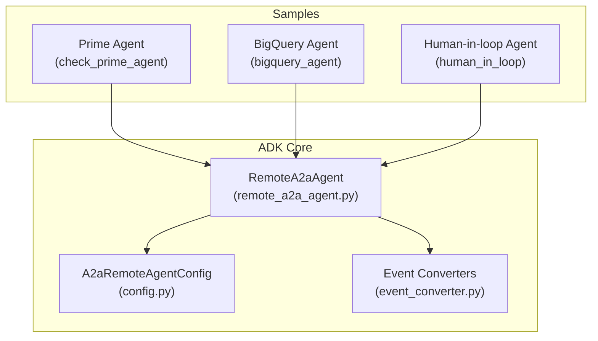

**Diagram sources**
- [remote_a2a_agent.py](file://src/google/adk/agents/remote_a2a_agent.py#L107-L765)
- [config.py](file://src/google/adk/a2a/agent/config.py#L82-L111)
- [event_converter.py](file://src/google/adk/a2a/converters/event_converter.py#L202-L368)
- [check_prime_agent/agent.py](file://contributing/samples/a2a_basic/remote_a2a/check_prime_agent/agent.py#L50-L76)
- [bigquery_agent/agent.py](file://contributing/samples/a2a_auth/remote_a2a/bigquery_agent/agent.py#L41-L79)
- [human_in_loop/agent.py](file://contributing/samples/a2a_human_in_loop/remote_a2a/human_in_loop/agent.py#L41-L57)

**Section sources**
- [remote_a2a_agent.py](file://src/google/adk/agents/remote_a2a_agent.py#L107-L120)
- [config.py](file://src/google/adk/a2a/agent/config.py#L82-L111)
- [README.md (A2A Basic)](file://contributing/samples/a2a_basic/README.md#L1-L154)
- [README.md (A2A Auth)](file://contributing/samples/a2a_auth/README.md#L1-L217)
- [README.md (A2A Human-in-loop)](file://contributing/samples/a2a_human_in_loop/README.md#L1-L168)

## Core Components
- RemoteA2aAgent: Orchestrates remote A2A communication, resolves agent cards, validates RPC URLs, constructs A2A messages, converts responses to ADK Events, and manages lifecycle and cleanup.
- A2aRemoteAgentConfig: Provides converter hooks and interceptors for A2A message/task/status/artifact conversions and request/response interception.
- Event Converters: Convert between A2A Message/Task and ADK Event, including long-running tool metadata and context propagation.

Key responsibilities:
- Agent card resolution from URL or file
- HTTP client initialization and A2A client factory wiring
- Session-aware message construction and context ID handling
- Streaming and non-streaming response handling
- Metadata propagation and error handling

**Section sources**
- [remote_a2a_agent.py](file://src/google/adk/agents/remote_a2a_agent.py#L107-L186)
- [config.py](file://src/google/adk/a2a/agent/config.py#L82-L111)
- [event_converter.py](file://src/google/adk/a2a/converters/event_converter.py#L202-L368)

## Architecture Overview
Remote A2A agents integrate with the A2A client to communicate with remote agent services. The agent card defines the RPC endpoint. The agent resolves the card, initializes the A2A client, and sends A2A messages. Responses are converted to ADK Events and emitted back to the caller.

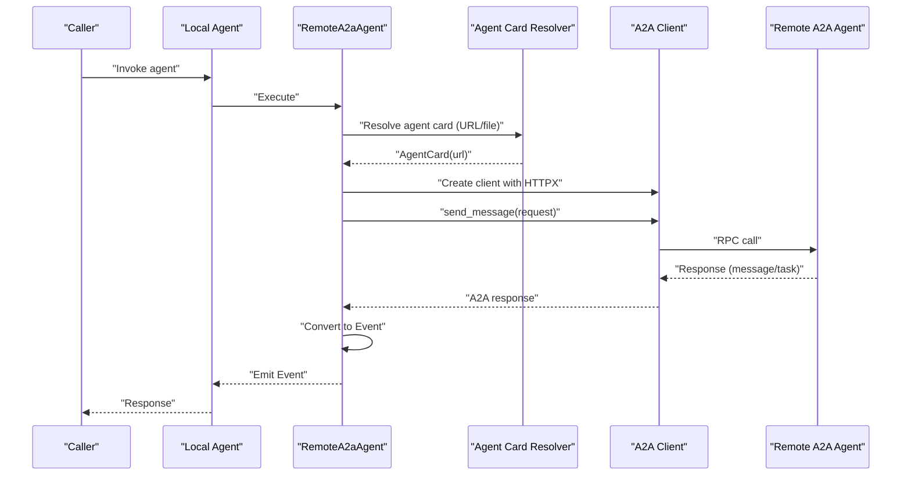

**Diagram sources**
- [remote_a2a_agent.py](file://src/google/adk/agents/remote_a2a_agent.py#L229-L332)
- [remote_a2a_agent.py](file://src/google/adk/agents/remote_a2a_agent.py#L657-L703)
- [event_converter.py](file://src/google/adk/a2a/converters/event_converter.py#L269-L368)

## Detailed Component Analysis

### RemoteA2aAgent
RemoteA2aAgent encapsulates remote A2A communication:
- Initialization supports AgentCard, URL, or file path for agent card
- Ensures HTTP client availability and A2A client factory creation
- Resolves agent card from URL or file, validates RPC URL
- Constructs A2A messages from session events and context IDs
- Handles streaming and non-streaming responses, emits ADK Events
- Supports request interceptors and metadata propagation
- Cleans up HTTP client when owned

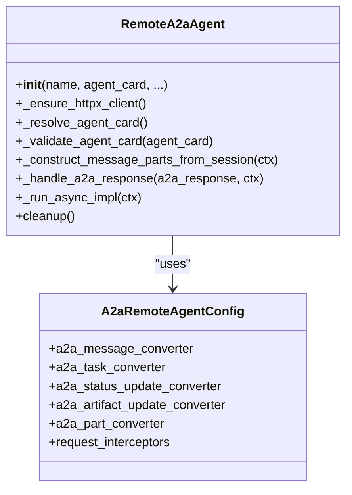

**Diagram sources**
- [remote_a2a_agent.py](file://src/google/adk/agents/remote_a2a_agent.py#L122-L186)
- [config.py](file://src/google/adk/a2a/agent/config.py#L82-L111)

**Section sources**
- [remote_a2a_agent.py](file://src/google/adk/agents/remote_a2a_agent.py#L122-L332)
- [remote_a2a_agent.py](file://src/google/adk/agents/remote_a2a_agent.py#L597-L740)

### Agent Card Resolution and Validation
- URL-based resolution parses scheme/netloc and uses a resolver to fetch agent.json
- File-based resolution loads JSON and constructs AgentCard
- RPC URL validation ensures a valid scheme and host
- On failure, raises AgentCardResolutionError with details

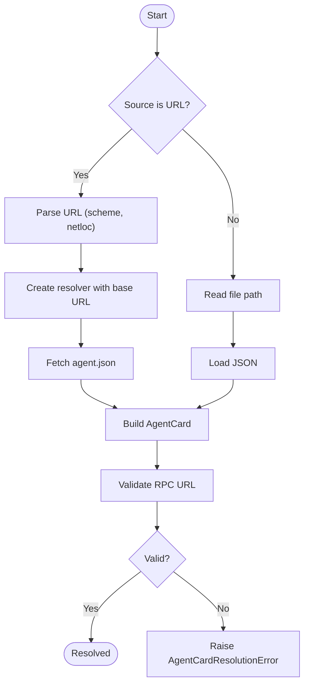

**Diagram sources**
- [remote_a2a_agent.py](file://src/google/adk/agents/remote_a2a_agent.py#L229-L297)

**Section sources**
- [remote_a2a_agent.py](file://src/google/adk/agents/remote_a2a_agent.py#L229-L297)

### Message Construction and Context Handling
- Builds A2A parts from session events, skipping prior remote agent responses
- Extracts context_id from prior responses to maintain continuity
- Supports full-history mode for stateless agents when configured
- Converts GenAI parts to A2A parts and vice versa

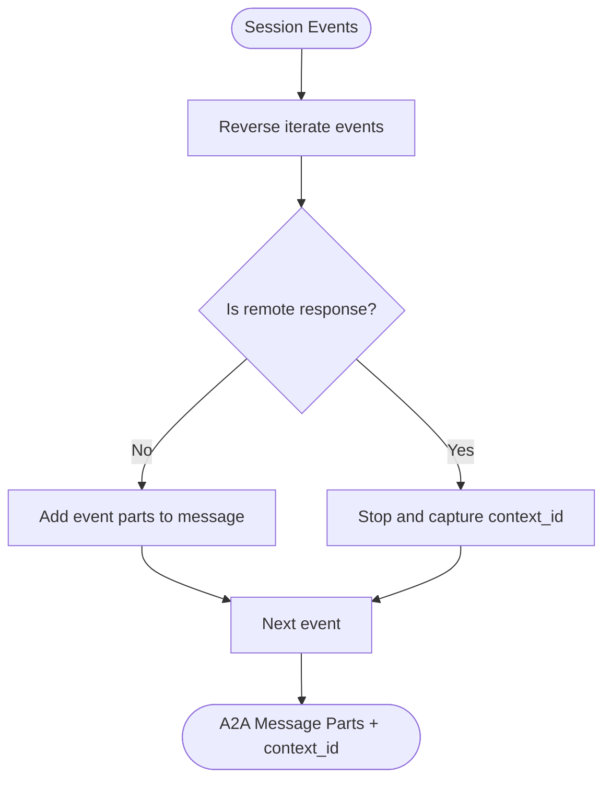

**Diagram sources**
- [remote_a2a_agent.py](file://src/google/adk/agents/remote_a2a_agent.py#L368-L418)

**Section sources**
- [remote_a2a_agent.py](file://src/google/adk/agents/remote_a2a_agent.py#L368-L418)

### Response Handling and Event Emission
- Streams task updates and artifact updates; emits thought-like parts for working states
- Converts A2A Task/Message to ADK Event with long-running tool IDs
- Propagates task_id and context_id via custom metadata
- Supports v2 conversion path via A2aRemoteAgentConfig converters

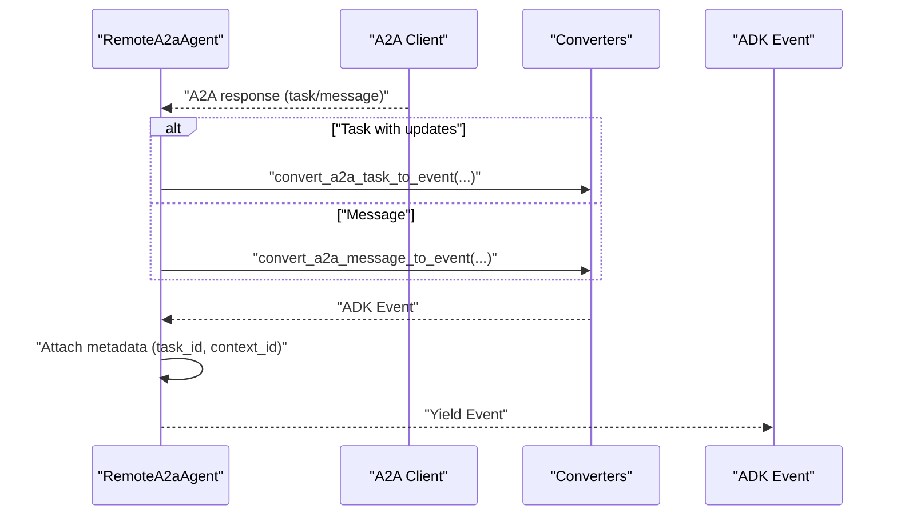

**Diagram sources**
- [remote_a2a_agent.py](file://src/google/adk/agents/remote_a2a_agent.py#L420-L595)
- [event_converter.py](file://src/google/adk/a2a/converters/event_converter.py#L202-L368)

**Section sources**
- [remote_a2a_agent.py](file://src/google/adk/agents/remote_a2a_agent.py#L420-L595)
- [event_converter.py](file://src/google/adk/a2a/converters/event_converter.py#L202-L368)

### Configuration Hooks and Interceptors
- A2aRemoteAgentConfig exposes converters for messages, tasks, status updates, and artifacts
- RequestInterceptor.before_request and after_request allow pre/post processing of A2A requests/responses
- ParametersConfig carries request_metadata and client_call_context

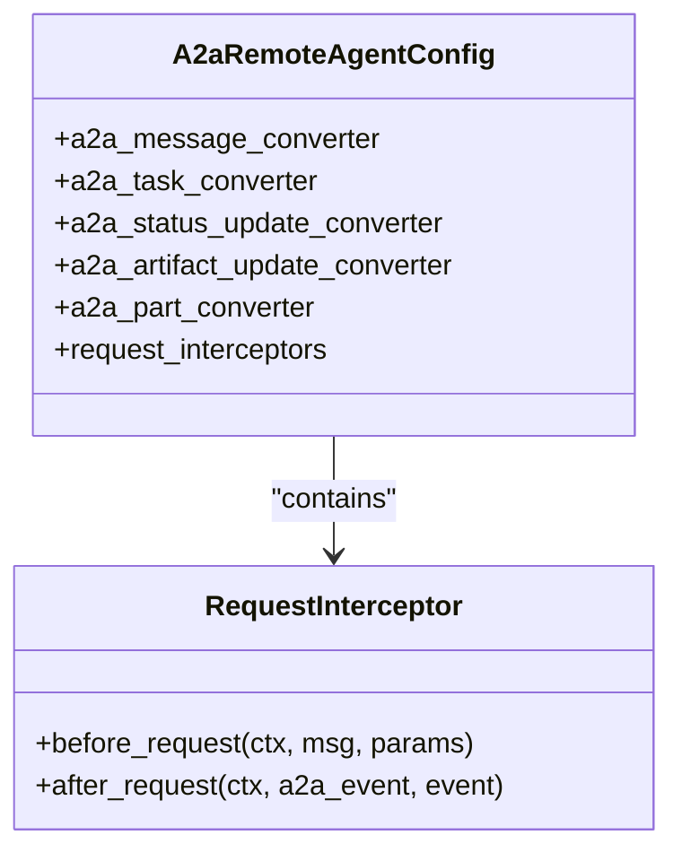

**Diagram sources**
- [config.py](file://src/google/adk/a2a/agent/config.py#L82-L111)

**Section sources**
- [config.py](file://src/google/adk/a2a/agent/config.py#L44-L111)
- [remote_a2a_agent.py](file://src/google/adk/agents/remote_a2a_agent.py#L641-L683)

### Practical Examples

#### Basic Remote Agent: Prime Checker
- Remote agent runs on a separate A2A server and exposes a tool to check prime numbers
- Local root agent delegates to the remote agent via RemoteA2aAgent
- Agent card URL points to the remote service

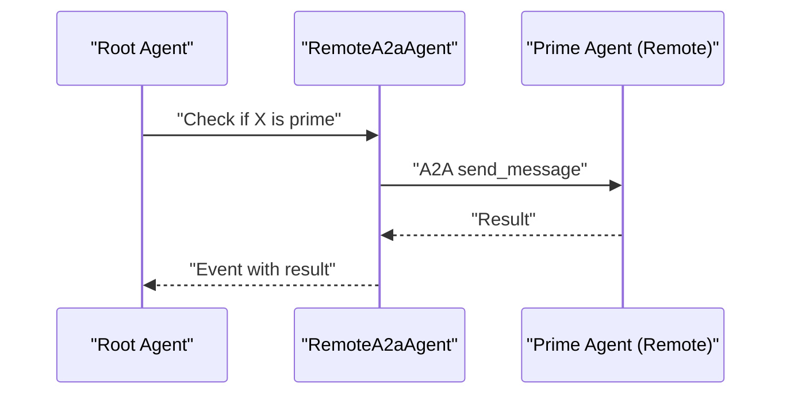

**Diagram sources**
- [README.md (A2A Basic)](file://contributing/samples/a2a_basic/README.md#L49-L82)
- [check_prime_agent/agent.py](file://contributing/samples/a2a_basic/remote_a2a/check_prime_agent/agent.py#L50-L76)
- [check_prime_agent/agent.json](file://contributing/samples/a2a_basic/remote_a2a/check_prime_agent/agent.json#L15-L16)

**Section sources**
- [README.md (A2A Basic)](file://contributing/samples/a2a_basic/README.md#L49-L82)
- [check_prime_agent/agent.py](file://contributing/samples/a2a_basic/remote_a2a/check_prime_agent/agent.py#L50-L76)
- [check_prime_agent/agent.json](file://contributing/samples/a2a_basic/remote_a2a/check_prime_agent/agent.json#L15-L16)

#### Authenticated Remote Agent: BigQuery
- Remote agent uses OAuth to access BigQuery
- On missing/invalid tokens, the remote agent can signal auth-required states
- Local root agent guides the user through OAuth and resumes the operation

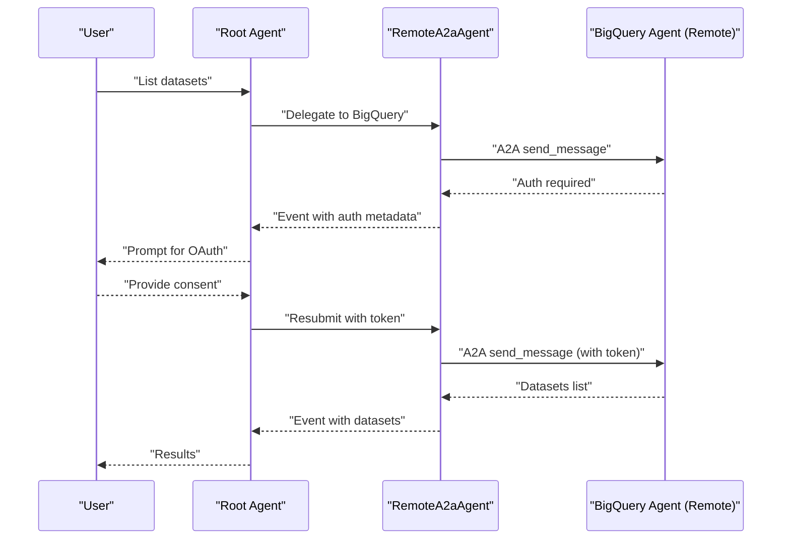

**Diagram sources**
- [README.md (A2A Auth)](file://contributing/samples/a2a_auth/README.md#L122-L133)
- [bigquery_agent/agent.py](file://contributing/samples/a2a_auth/remote_a2a/bigquery_agent/agent.py#L41-L79)
- [bigquery_agent/agent.json](file://contributing/samples/a2a_auth/remote_a2a/bigquery_agent/agent.json#L27-L28)

**Section sources**
- [README.md (A2A Auth)](file://contributing/samples/a2a_auth/README.md#L122-L133)
- [bigquery_agent/agent.py](file://contributing/samples/a2a_auth/remote_a2a/bigquery_agent/agent.py#L41-L79)
- [bigquery_agent/agent.json](file://contributing/samples/a2a_auth/remote_a2a/bigquery_agent/agent.json#L27-L28)

#### Human-in-the-Loop Remote Agent: Reimbursement
- Remote agent escalates large reimbursements to a manager via long-running tools
- Local agent surfaces pending approvals and resumes when the manager responds

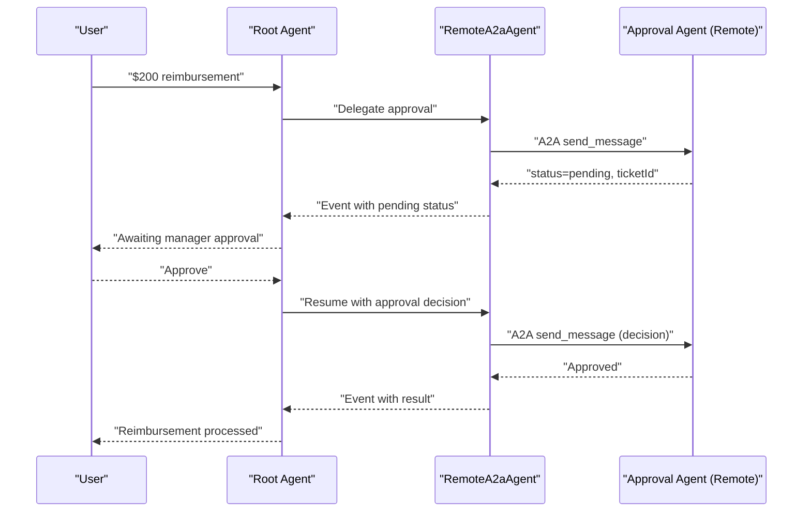

**Diagram sources**
- [README.md (A2A Human-in-loop)](file://contributing/samples/a2a_human_in_loop/README.md#L99-L106)
- [human_in_loop/agent.py](file://contributing/samples/a2a_human_in_loop/remote_a2a/human_in_loop/agent.py#L41-L57)
- [human_in_loop/agent.json](file://contributing/samples/a2a_human_in_loop/remote_a2a/human_in_loop/agent.json#L27-L28)

**Section sources**
- [README.md (A2A Human-in-loop)](file://contributing/samples/a2a_human_in_loop/README.md#L99-L106)
- [human_in_loop/agent.py](file://contributing/samples/a2a_human_in_loop/remote_a2a/human_in_loop/agent.py#L41-L57)
- [human_in_loop/agent.json](file://contributing/samples/a2a_human_in_loop/remote_a2a/human_in_loop/agent.json#L27-L28)

## Dependency Analysis
RemoteA2aAgent depends on:
- A2A client and types for message/task handling
- Converter utilities for part/message/task conversion
- Invocation context and event models
- HTTP client management and lifecycle

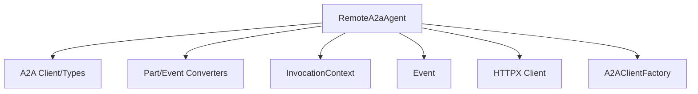

**Diagram sources**
- [remote_a2a_agent.py](file://src/google/adk/agents/remote_a2a_agent.py#L28-L75)
- [event_converter.py](file://src/google/adk/a2a/converters/event_converter.py#L26-L51)

**Section sources**
- [remote_a2a_agent.py](file://src/google/adk/agents/remote_a2a_agent.py#L28-L75)
- [event_converter.py](file://src/google/adk/a2a/converters/event_converter.py#L26-L51)

## Performance Considerations
- Minimize unnecessary message parts by leveraging session-aware construction
- Use streaming responses when supported to reduce latency
- Configure timeouts appropriately for remote endpoints
- Reuse HTTP clients via A2AClientFactory to reduce connection overhead
- Avoid excessive interceptor overhead; keep interceptors focused and efficient

## Troubleshooting Guide
Common issues and resolutions:
- Connection failures
  - Verify agent card URL matches the deployed A2A server endpoint
  - Ensure both local and remote servers are reachable and ports are open
- Authentication problems
  - Confirm OAuth client credentials and scopes
  - Check that the remote agent signals auth-required states and metadata
- Remote agent not responding
  - Review logs for both local and remote services
  - Validate tool responses include matching IDs for long-running tools
- State synchronization
  - Ensure context_id is preserved across requests for stateful agents
  - Use full-history mode for stateless agents when appropriate

**Section sources**
- [README.md (A2A Basic)](file://contributing/samples/a2a_basic/README.md#L140-L154)
- [README.md (A2A Auth)](file://contributing/samples/a2a_auth/README.md#L190-L217)
- [README.md (A2A Human-in-loop)](file://contributing/samples/a2a_human_in_loop/README.md#L149-L168)

## Conclusion
Remote A2A agents in ADK provide a robust framework for external agent communication, integrating seamlessly with the A2A protocol. They support remote execution, authentication workflows, secure transport, and state synchronization across agent boundaries. Through configuration hooks, interceptors, and conversion utilities, developers can tailor behavior for diverse use cases including distributed systems, multi-tenant deployments, and external service integration.

## Appendices

### Security Considerations and Trust Boundaries
- Transport security: Use HTTPS endpoints in agent cards for encrypted communication
- Token management: Store OAuth credentials securely; avoid embedding secrets in agent cards
- Metadata isolation: Propagate only necessary metadata; sanitize sensitive fields
- Trust boundaries: Treat remote agents as untrusted; validate inputs and enforce least privilege

### Encryption Mechanisms
- TLS/TCP encryption for HTTP(S) transport
- Optional client-side encryption for sensitive payloads (outside scope of RemoteA2aAgent)
- Token-based authentication for protected endpoints

### Deployment Scenarios
- Distributed agent systems: Deploy remote agents behind load balancers with health checks
- Multi-tenant: Separate agent cards per tenant; isolate tokens and contexts
- External service integration: Expose remote agents via managed platforms (e.g., Cloud Run) with strict IAM policies