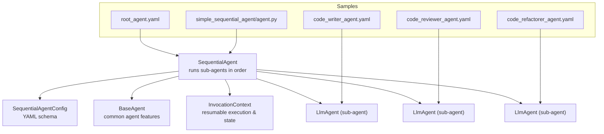
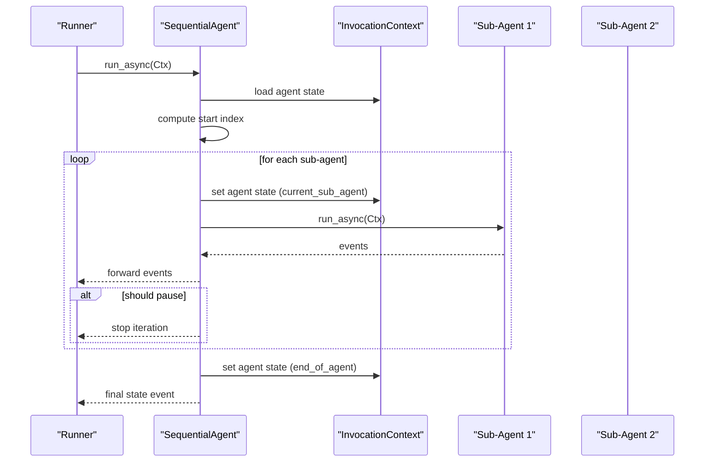
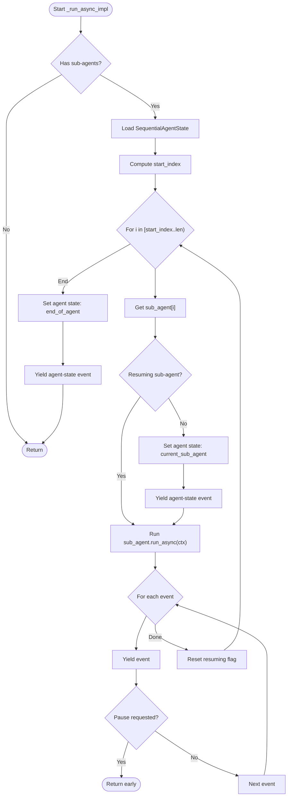
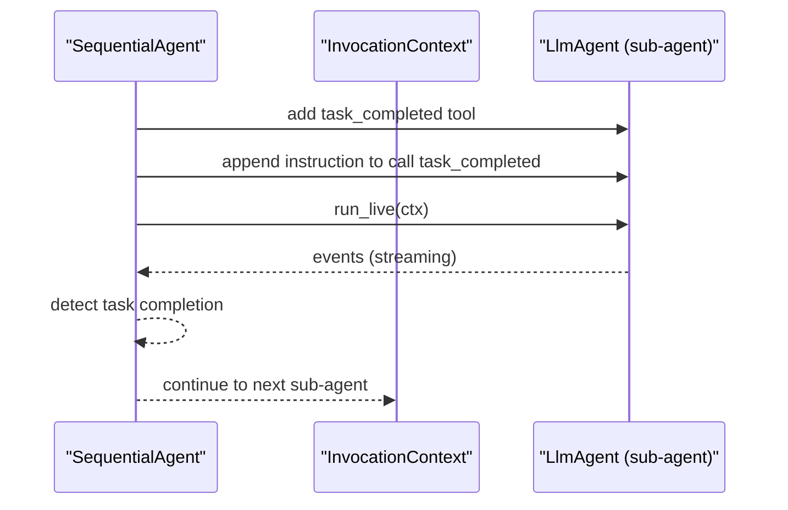
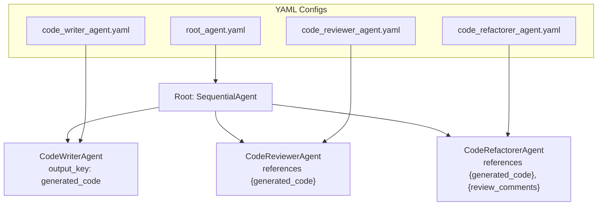
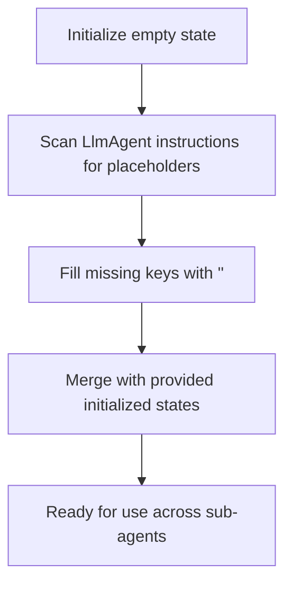
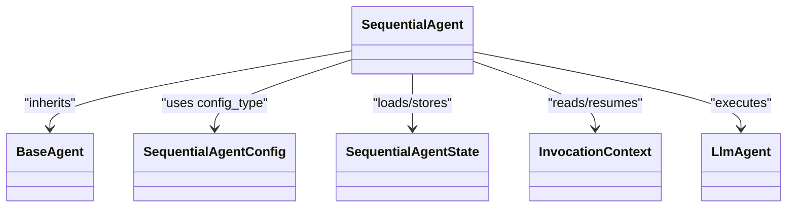

# Sequential Agents

<cite>
**Referenced Files in This Document**
- [sequential_agent.py](file://src/google/adk/agents/sequential_agent.py)
- [sequential_agent_config.py](file://src/google/adk/agents/sequential_agent_config.py)
- [base_agent.py](file://src/google/adk/agents/base_agent.py)
- [llm_agent.py](file://src/google/adk/agents/llm_agent.py)
- [invocation_context.py](file://src/google/adk/agents/invocation_context.py)
- [root_agent.yaml](file://contributing/samples/multi_agent_seq_config/root_agent.yaml)
- [code_writer_agent.yaml](file://contributing/samples/multi_agent_seq_config/sub_agents/code_writer_agent.yaml)
- [code_reviewer_agent.yaml](file://contributing/samples/multi_agent_seq_config/sub_agents/code_reviewer_agent.yaml)
- [code_refactorer_agent.yaml](file://contributing/samples/multi_agent_seq_config/sub_agents/code_refactorer_agent.yaml)
- [agent.py](file://contributing/samples/simple_sequential_agent/agent.py)
- [state.py](file://src/google/adk/cli/utils/state.py)
- [test_pause_invocation.py](file://tests/unittests/runners/test_pause_invocation.py)
</cite>

## Table of Contents
1. [Introduction](#introduction)
2. [Project Structure](#project-structure)
3. [Core Components](#core-components)
4. [Architecture Overview](#architecture-overview)
5. [Detailed Component Analysis](#detailed-component-analysis)
6. [Dependency Analysis](#dependency-analysis)
7. [Performance Considerations](#performance-considerations)
8. [Troubleshooting Guide](#troubleshooting-guide)
9. [Conclusion](#conclusion)
10. [Appendices](#appendices)

## Introduction
This document explains sequential agents in the Agent Development Kit (ADK). A sequential agent orchestrates a fixed, ordered chain of sub-agents, executing them one after another. It manages state propagation across sub-agents, supports resumable invocations, and coordinates end-of-sequence signaling. Practical examples show how to define sequential agent hierarchies via YAML and Python, configure sub-agents, and enable inter-agent communication through shared state and output keys.

## Project Structure
Sequential agents are implemented in the agents package and supported by base agent infrastructure, invocation context, and configuration schemas. Sample configurations demonstrate real-world usage for multi-step workflows such as code generation, review, and refactoring.

**Diagram sources**
- [sequential_agent.py](file://src/google/adk/agents/sequential_agent.py#L48-L160)
- [sequential_agent_config.py](file://src/google/adk/agents/sequential_agent_config.py#L27-L41)
- [base_agent.py](file://src/google/adk/agents/base_agent.py#L86-L200)
- [invocation_context.py](file://src/google/adk/agents/invocation_context.py#L100-L200)
- [root_agent.yaml](file://contributing/samples/multi_agent_seq_config/root_agent.yaml#L1-L9)
- [code_writer_agent.yaml](file://contributing/samples/multi_agent_seq_config/sub_agents/code_writer_agent.yaml#L1-L12)
- [code_reviewer_agent.yaml](file://contributing/samples/multi_agent_seq_config/sub_agents/code_reviewer_agent.yaml#L1-L27)
- [code_refactorer_agent.yaml](file://contributing/samples/multi_agent_seq_config/sub_agents/code_refactorer_agent.yaml#L1-L27)
- [agent.py](file://contributing/samples/simple_sequential_agent/agent.py#L90-L95)

**Section sources**
- [sequential_agent.py](file://src/google/adk/agents/sequential_agent.py#L48-L160)
- [sequential_agent_config.py](file://src/google/adk/agents/sequential_agent_config.py#L27-L41)
- [base_agent.py](file://src/google/adk/agents/base_agent.py#L86-L200)
- [invocation_context.py](file://src/google/adk/agents/invocation_context.py#L100-L200)
- [root_agent.yaml](file://contributing/samples/multi_agent_seq_config/root_agent.yaml#L1-L9)
- [code_writer_agent.yaml](file://contributing/samples/multi_agent_seq_config/sub_agents/code_writer_agent.yaml#L1-L12)
- [code_reviewer_agent.yaml](file://contributing/samples/multi_agent_seq_config/sub_agents/code_reviewer_agent.yaml#L1-L27)
- [code_refactorer_agent.yaml](file://contributing/samples/multi_agent_seq_config/sub_agents/code_refactorer_agent.yaml#L1-L27)
- [agent.py](file://contributing/samples/simple_sequential_agent/agent.py#L90-L95)

## Core Components
- SequentialAgent: Orchestrates sub-agents in a strict sequence, emitting events and managing resumable state.
- SequentialAgentState: Tracks the current sub-agent and end-of-agent marker for resumable runs.
- SequentialAgentConfig: Defines the YAML schema for sequential agents, ensuring agent_class is set to SequentialAgent.
- BaseAgent: Provides shared capabilities such as sub_agents, callbacks, and state loading helpers.
- InvocationContext: Supplies resumability, agent state storage, and invocation controls (pause/end).

Key behaviors:
- Sequential execution: Iterates sub_agents in order, running each with run_async and forwarding events.
- State propagation: Uses InvocationContext agent_states to persist current_sub_agent and end_of_agent markers.
- Resumable runs: Emits agent-state events to checkpoint progress; resumes from the stored sub-agent.
- Live mode: Augments LlmAgent sub-agents with a task completion tool and instruction to signal completion.

**Section sources**
- [sequential_agent.py](file://src/google/adk/agents/sequential_agent.py#L40-L93)
- [sequential_agent_config.py](file://src/google/adk/agents/sequential_agent_config.py#L27-L41)
- [base_agent.py](file://src/google/adk/agents/base_agent.py#L168-L200)
- [invocation_context.py](file://src/google/adk/agents/invocation_context.py#L170-L175)

## Architecture Overview
The sequential agent’s runtime is a thin orchestration layer around sub-agents. It delegates execution to each sub-agent while maintaining control over flow, state, and resumability.

**Diagram sources**
- [sequential_agent.py](file://src/google/adk/agents/sequential_agent.py#L54-L93)
- [invocation_context.py](file://src/google/adk/agents/invocation_context.py#L170-L175)

## Detailed Component Analysis

### SequentialAgent
Responsibilities:
- Iterate sub-agents in order.
- Persist and resume execution state via SequentialAgentState.
- Forward all events from sub-agents to the caller.
- Support resumable invocations by yielding agent-state events.
- Live mode augmentation for LlmAgent sub-agents with a task completion tool and instruction.

Execution flow highlights:
- Load agent state and derive start_index.
- For each sub-agent:
  - If resuming, skip re-yielding the current event.
  - Run sub-agent and forward events.
  - Respect pause signals from InvocationContext.
- On completion, mark end_of_agent and emit a terminal state event.

**Diagram sources**
- [sequential_agent.py](file://src/google/adk/agents/sequential_agent.py#L54-L93)

**Section sources**
- [sequential_agent.py](file://src/google/adk/agents/sequential_agent.py#L48-L160)

### SequentialAgentState
Purpose:
- Track the current sub-agent name to resume execution.
- Signal completion when end_of_agent is set.

Behavior:
- current_sub_agent defaults to empty string.
- When empty and agent_state exists, treat as finished and advance past all sub-agents.

**Section sources**
- [sequential_agent.py](file://src/google/adk/agents/sequential_agent.py#L41-L46)
- [sequential_agent.py](file://src/google/adk/agents/sequential_agent.py#L94-L118)

### SequentialAgentConfig
Purpose:
- Define the YAML schema for SequentialAgent.
- Enforce agent_class equals SequentialAgent.

Constraints:
- Extra fields are disallowed.

**Section sources**
- [sequential_agent_config.py](file://src/google/adk/agents/sequential_agent_config.py#L27-L41)

### BaseAgent and InvocationContext Integration
- BaseAgent provides:
  - sub_agents list for hierarchical composition.
  - _load_agent_state and _create_agent_state_event helpers used by SequentialAgent.
- InvocationContext supplies:
  - agent_states dictionary keyed by agent name.
  - is_resumable and should_pause_invocation controls.
  - end_of_agents and end_invocation flags.

**Section sources**
- [base_agent.py](file://src/google/adk/agents/base_agent.py#L168-L200)
- [invocation_context.py](file://src/google/adk/agents/invocation_context.py#L170-L175)

### Live Mode Behavior
In live mode, SequentialAgent augments LlmAgent sub-agents with a task completion tool and instruction to signal completion. This allows continuous streams (audio/video) to proceed to the next agent deterministically.

**Diagram sources**
- [sequential_agent.py](file://src/google/adk/agents/sequential_agent.py#L120-L160)

**Section sources**
- [sequential_agent.py](file://src/google/adk/agents/sequential_agent.py#L120-L160)

### Practical Examples

#### Example 1: YAML-driven pipeline (Code writing → Review → Refactor)
- Root agent defines agent_class SequentialAgent and lists sub_agents via config_path.
- Sub-agents are LlmAgent instances with instructions and output_key fields.
- Inter-agent communication uses output keys referenced in downstream instructions.

**Diagram sources**
- [root_agent.yaml](file://contributing/samples/multi_agent_seq_config/root_agent.yaml#L1-L9)
- [code_writer_agent.yaml](file://contributing/samples/multi_agent_seq_config/sub_agents/code_writer_agent.yaml#L1-L12)
- [code_reviewer_agent.yaml](file://contributing/samples/multi_agent_seq_config/sub_agents/code_reviewer_agent.yaml#L1-L27)
- [code_refactorer_agent.yaml](file://contributing/samples/multi_agent_seq_config/sub_agents/code_refactorer_agent.yaml#L1-L27)

**Section sources**
- [root_agent.yaml](file://contributing/samples/multi_agent_seq_config/root_agent.yaml#L1-L9)
- [code_writer_agent.yaml](file://contributing/samples/multi_agent_seq_config/sub_agents/code_writer_agent.yaml#L1-L12)
- [code_reviewer_agent.yaml](file://contributing/samples/multi_agent_seq_config/sub_agents/code_reviewer_agent.yaml#L1-L27)
- [code_refactorer_agent.yaml](file://contributing/samples/multi_agent_seq_config/sub_agents/code_refactorer_agent.yaml#L1-L27)

#### Example 2: Python-defined sequential agent
- Compose sub-agents programmatically and pass them to SequentialAgent.
- Demonstrates ordering and tool-based sub-agent responsibilities.

**Section sources**
- [agent.py](file://contributing/samples/simple_sequential_agent/agent.py#L90-L95)

### State Management Across Sub-Agents
- Empty state creation: CLI utility scans LlmAgent instructions for placeholders and initializes missing keys to empty strings.
- SequentialAgent persists current_sub_agent per invocation to resume from the correct sub-agent.
- End-of-agent signaling: SequentialAgent sets end_of_agent to indicate completion.

**Diagram sources**
- [state.py](file://src/google/adk/cli/utils/state.py#L25-L47)

**Section sources**
- [state.py](file://src/google/adk/cli/utils/state.py#L25-L47)
- [sequential_agent.py](file://src/google/adk/agents/sequential_agent.py#L90-L92)

## Dependency Analysis
SequentialAgent depends on:
- BaseAgent for shared agent features and state helpers.
- SequentialAgentConfig for YAML schema enforcement.
- InvocationContext for resumability and state persistence.
- Sub-agents (typically LlmAgent) for actual work.

**Diagram sources**
- [sequential_agent.py](file://src/google/adk/agents/sequential_agent.py#L48-L52)
- [sequential_agent_config.py](file://src/google/adk/agents/sequential_agent_config.py#L27-L41)
- [base_agent.py](file://src/google/adk/agents/base_agent.py#L86-L137)
- [invocation_context.py](file://src/google/adk/agents/invocation_context.py#L100-L175)
- [llm_agent.py](file://src/google/adk/agents/llm_agent.py#L187-L200)

**Section sources**
- [sequential_agent.py](file://src/google/adk/agents/sequential_agent.py#L48-L52)
- [sequential_agent_config.py](file://src/google/adk/agents/sequential_agent_config.py#L27-L41)
- [base_agent.py](file://src/google/adk/agents/base_agent.py#L86-L137)
- [invocation_context.py](file://src/google/adk/agents/invocation_context.py#L100-L175)
- [llm_agent.py](file://src/google/adk/agents/llm_agent.py#L187-L200)

## Performance Considerations
- Sequential execution is deterministic and predictable; overhead is proportional to the number of sub-agents and their individual run times.
- Resumable runs minimize recomputation by checkpointing current_sub_agent and skipping already-completed sub-agents.
- Streaming live mode adds minimal overhead by appending a single tool and instruction to eligible sub-agents.

## Troubleshooting Guide
Common issues and resolutions:
- Sub-agent removal: If a previously recorded current_sub_agent is missing, SequentialAgent logs a warning and restarts from the beginning. Ensure sub-agent names remain stable across runs.
- Pausing mid-execution: SequentialAgent respects InvocationContext pause signals; subsequent runs resume from the paused sub-agent.
- End-of-agent detection: SequentialAgent emits end_of_agent when all sub-agents finish; verify resumability settings to ensure state events are persisted.

Evidence from tests:
- Resumable behavior and state transitions are validated in unit tests that assert agent-state events and event sequences.

**Section sources**
- [sequential_agent.py](file://src/google/adk/agents/sequential_agent.py#L112-L117)
- [test_pause_invocation.py](file://tests/unittests/runners/test_pause_invocation.py#L191-L227)

## Conclusion
Sequential agents provide a robust, resumable mechanism for orchestrating multi-step workflows. They propagate state across sub-agents, support live-mode completion signaling, and integrate cleanly with YAML and programmatic configurations. Use them for data processing pipelines, coordinated task execution, and multi-stage reasoning flows.

## Appendices

### Configuration Options Summary
- SequentialAgentConfig
  - agent_class: Must equal SequentialAgent.
  - Additional fields: Disallowed by schema.
- Sub-agent configuration (example: LlmAgent)
  - model: Model identifier or instance.
  - instruction: Prompt text; may reference output keys from upstream agents.
  - output_key: Key emitted by the agent for downstream consumption.

**Section sources**
- [sequential_agent_config.py](file://src/google/adk/agents/sequential_agent_config.py#L27-L41)
- [code_writer_agent.yaml](file://contributing/samples/multi_agent_seq_config/sub_agents/code_writer_agent.yaml#L1-L12)
- [code_reviewer_agent.yaml](file://contributing/samples/multi_agent_seq_config/sub_agents/code_reviewer_agent.yaml#L1-L27)
- [code_refactorer_agent.yaml](file://contributing/samples/multi_agent_seq_config/sub_agents/code_refactorer_agent.yaml#L1-L27)