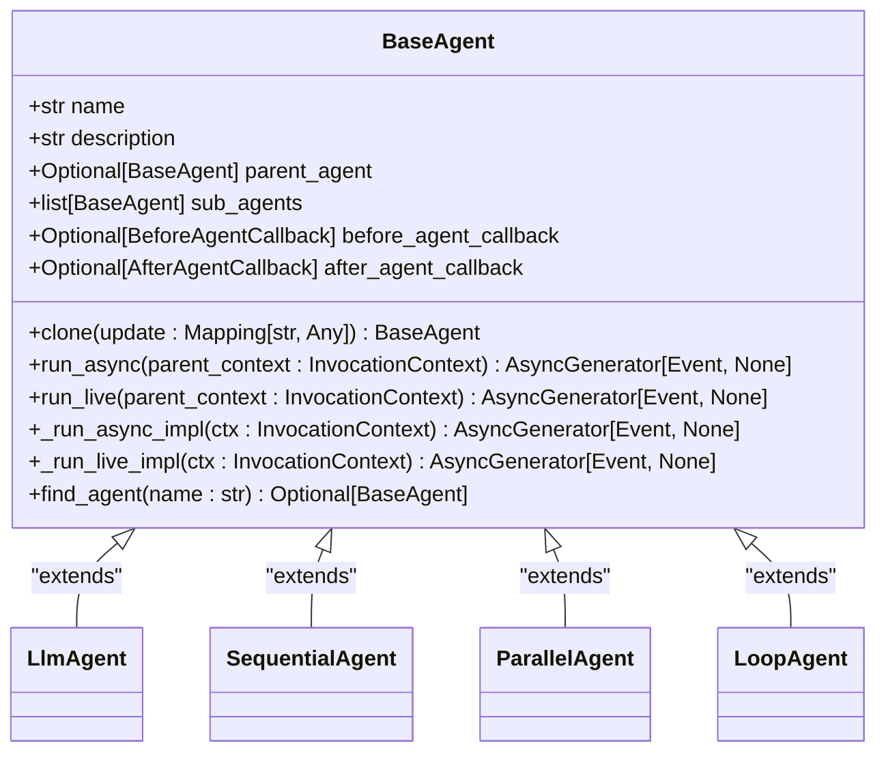
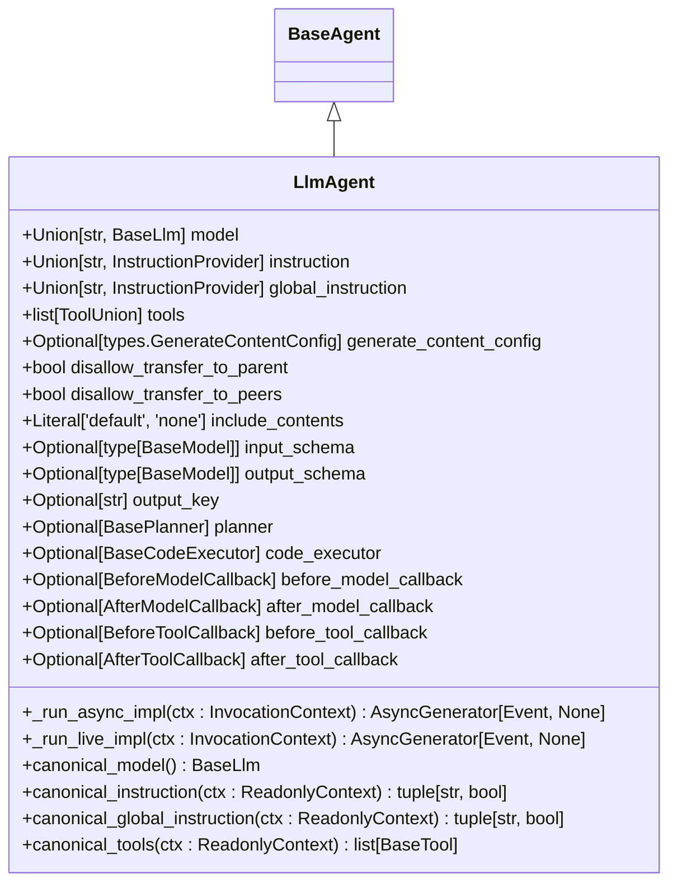
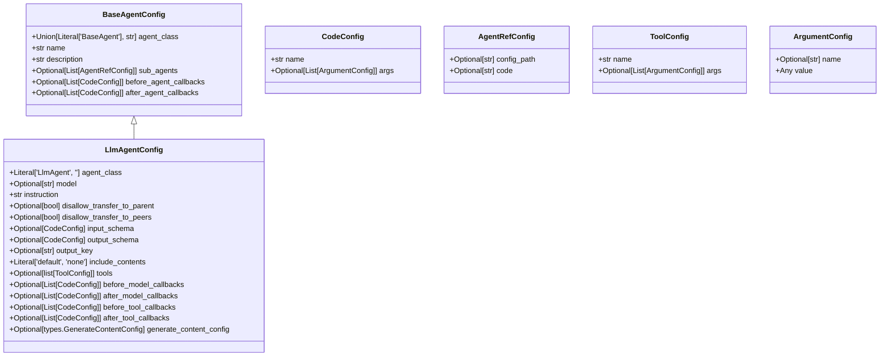
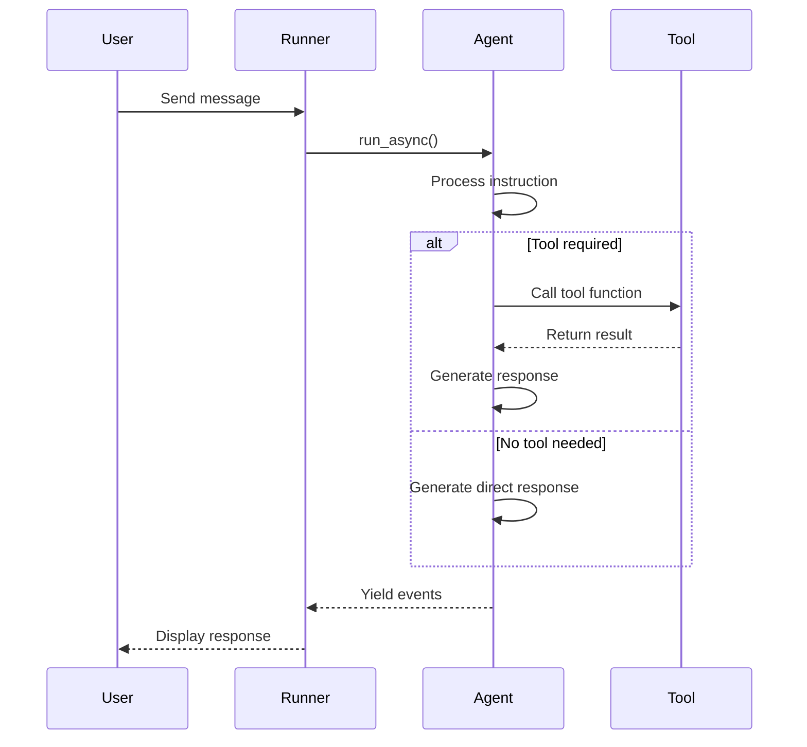

# Creating Agents

<cite>
**Referenced Files in This Document**   
- [base_agent.py](file://src/google/adk/agents/base_agent.py)
- [llm_agent.py](file://src/google/adk/agents/llm_agent.py)
- [llm_agent_config.py](file://src/google/adk/agents/llm_agent_config.py)
- [base_agent_config.py](file://src/google/adk/agents/base_agent_config.py)
- [config_agent_utils.py](file://src/google/adk/agents/config_agent_utils.py)
- [common_configs.py](file://src/google/adk/agents/common_configs.py)
- [agent.py](file://contributing/samples/hello_world/agent.py)
- [main.py](file://contributing/samples/hello_world/main.py)
- [a2a_root/agent.py](file://contributing/samples/a2a_root/agent.py)
- [root_agent.yaml](file://contributing/samples/core_basic_config/root_agent.yaml)
</cite>

## Table of Contents
1. [Introduction](#introduction)
2. [Base Agent Class](#base-agent-class)
3. [LlmAgent Implementation](#llmagent-implementation)
4. [Agent Configuration](#agent-configuration)
5. [Hello World Example](#hello-world-example)
6. [A2A Root Agent Example](#a2a-root-agent-example)
7. [Common Issues and Solutions](#common-issues-and-solutions)
8. [Conclusion](#conclusion)

## Introduction
The Agent Development Kit (ADK) framework provides a comprehensive system for creating intelligent agents that can interact with language models and perform various tasks. This document explains the agent creation process, focusing on the BaseAgent class and its primary implementation, LlmAgent. We'll explore the key methods, lifecycle hooks, configuration options, and provide concrete examples from the hello_world and a2a_root samples. The content is designed to be accessible to beginners while providing sufficient technical depth for experienced developers.

## Base Agent Class

The foundation of all agents in the ADK framework is the BaseAgent class, which provides the core functionality and structure for agent creation and execution. This class serves as the parent class for all specialized agent types and defines the essential methods and properties that govern agent behavior.

The BaseAgent class is implemented as a Pydantic BaseModel, ensuring type safety and validation of agent configurations. It includes several key components:

- **Lifecycle Methods**: The `run_async` and `run_live` methods serve as entry points for agent execution, handling text-based and audio/video-based conversations respectively. These methods orchestrate the agent's workflow by invoking before and after callbacks and executing the core implementation.

- **Callback System**: Agents support before and after callbacks that can modify agent behavior. The `before_agent_callback` is executed before the agent's main logic, potentially short-circuiting execution by returning content directly. The `after_agent_callback` is executed after the main logic, allowing for post-processing of results.

- **Hierarchy Management**: The class maintains parent-child relationships through the `parent_agent` and `sub_agents` properties, enabling the creation of complex agent trees. The `find_agent` and `find_sub_agent` methods facilitate navigation within this hierarchy.

- **Cloning Functionality**: The `clone` method allows for creating copies of agent instances with optional field updates, supporting reuse and modification of agent configurations.



**Diagram sources**
- [base_agent.py](file://src/google/adk/agents/base_agent.py#L71-L612)

**Section sources**
- [base_agent.py](file://src/google/adk/agents/base_agent.py#L71-L612)

## LlmAgent Implementation

The LlmAgent class is the primary agent type for language model interactions in the ADK framework. It extends the BaseAgent class and provides specialized functionality for working with large language models, including model configuration, prompt handling, and tool integration.

Key features of the LlmAgent implementation include:

- **Model Configuration**: The agent supports specifying a model either directly through the `model` property or by inheriting from ancestor agents. The `canonical_model` property resolves the effective model to be used, handling both direct specifications and inheritance.

- **Instruction System**: The agent supports both local instructions (`instruction`) and global instructions (`global_instruction`). Local instructions guide the agent's specific behavior, while global instructions apply to the entire agent tree, typically used for establishing consistent personality or identity.

- **Tool Integration**: The `tools` property allows agents to access various capabilities through function tools, toolsets, or individual tools. The framework automatically converts different tool types into a uniform format for processing.

- **Advanced Features**: The agent supports several advanced capabilities:
  - **Planners**: For step-by-step execution of complex tasks
  - **Code Execution**: For executing code blocks from model responses
  - **Output Schema**: For structured output generation with validation

- **Callback System**: In addition to the base agent callbacks, LlmAgent provides model-specific callbacks:
  - `before_model_callback`: Executed before calling the LLM
  - `after_model_callback`: Executed after receiving the LLM response
  - `before_tool_callback`: Executed before calling a tool
  - `after_tool_callback`: Executed after receiving a tool response

The LlmAgent class also includes validation logic to ensure configuration consistency. For example, when an `output_schema` is specified, the agent automatically disables agent transfer capabilities to ensure the output remains within the defined schema.



**Diagram sources**
- [llm_agent.py](file://src/google/adk/agents/llm_agent.py#L124-L638)

**Section sources**
- [llm_agent.py](file://src/google/adk/agents/llm_agent.py#L124-L638)

## Agent Configuration

Agents in the ADK framework can be configured through both code and YAML files, providing flexibility for different use cases. The configuration system uses Pydantic models to ensure type safety and validation.

The primary configuration classes are:

- **BaseAgentConfig**: The base configuration class that defines common properties for all agents, including name, description, sub-agents, and callbacks.

- **LlmAgentConfig**: The configuration class specific to LlmAgent, extending BaseAgentConfig with LLM-specific properties such as model, instruction, tools, and various behavioral flags.

Configuration can be specified in YAML format with a schema reference for IDE support:

```yaml
# yaml-language-server: $schema=https://raw.githubusercontent.com/google/adk-python/refs/heads/main/src/google/adk/agents/config_schemas/AgentConfig.json
name: assistant_agent
model: gemini-2.5-flash
description: A helper agent that can answer users' questions.
instruction: |
  You are an agent to help answer users' various questions.

  1. If the user's intention is not clear, ask clarifying questions to better understand their needs.
  2. Once the intention is clear, provide accurate and helpful answers to the user's questions.
```

The configuration system supports several advanced features:

- **Code References**: The `CodeConfig` class allows referencing Python objects by their fully qualified name, enabling modular configuration.

- **Agent References**: The `AgentRefConfig` class supports referencing other agents either by configuration file path or by code reference, facilitating agent composition.

- **Callback Configuration**: Callbacks can be configured through the YAML file by specifying their fully qualified names, allowing for flexible behavior modification without code changes.

The configuration loading process is handled by the `from_config` utility function, which parses the YAML file, resolves references, and instantiates the appropriate agent class with the specified configuration.



**Diagram sources**
- [base_agent_config.py](file://src/google/adk/agents/base_agent_config.py#L36-L82)
- [llm_agent_config.py](file://src/google/adk/agents/llm_agent_config.py#L33-L168)
- [common_configs.py](file://src/google/adk/agents/common_configs.py#L29-L144)

**Section sources**
- [base_agent_config.py](file://src/google/adk/agents/base_agent_config.py#L36-L82)
- [llm_agent_config.py](file://src/google/adk/agents/llm_agent_config.py#L33-L168)
- [common_configs.py](file://src/google/adk/agents/common_configs.py#L29-L144)

## Hello World Example

The hello_world sample provides a practical demonstration of agent creation and usage in the ADK framework. This example showcases how to create an agent with custom tools and run it in a simple application.

The agent is defined in the `agent.py` file and includes two custom tools:

- **roll_die**: A function tool that simulates rolling a die with a specified number of sides. It also maintains state by storing roll results in the tool context.

- **check_prime**: An asynchronous function tool that determines whether numbers in a list are prime.

The agent configuration specifies:
- The model to use (gemini-2.0-flash)
- A descriptive name and description
- Clear instructions for the agent's behavior
- The available tools
- Safety settings to prevent false alarms about dice rolling



**Diagram sources**
- [agent.py](file://contributing/samples/hello_world/agent.py#L67-L108)
- [main.py](file://contributing/samples/hello_world/main.py#L30-L103)

**Section sources**
- [agent.py](file://contributing/samples/hello_world/agent.py#L67-L108)
- [main.py](file://contributing/samples/hello_world/main.py#L30-L103)

## A2A Root Agent Example

The a2a_root sample demonstrates how to use a remote Agent-to-Agent (A2A) agent as the root agent in the ADK framework. This pattern enables distributed agent deployment and communication between agents running on different servers.

In this example:
- The root agent is a `RemoteA2aAgent` that connects to a remote A2A service
- The remote agent runs on a separate server (localhost:8001)
- The root agent acts as a proxy, forwarding requests to the remote agent

The key components of this setup are:

- **RemoteA2aAgent**: The root agent class that connects to a remote A2A service via an agent card URL
- **Agent Card**: A well-known endpoint that provides metadata about the remote agent
- **Uvicorn Server**: A lightweight ASGI server used to deploy the remote agent as a standalone web service

This architecture provides several benefits:
- **Scalability**: Agents can be deployed across multiple servers
- **Modularity**: Different agents can be developed and maintained independently
- **Flexibility**: Agents can be replaced or updated without affecting the overall system

The example demonstrates common agent functionality:
- Dice rolling with state management
- Prime number checking
- Parallel tool execution
- Simple deployment patterns using the `to_a2a()` utility

**Section sources**
- [a2a_root/agent.py](file://contributing/samples/a2a_root/agent.py#L18-L24)
- [a2a_root/README.md](file://contributing/samples/a2a_root/README.md#L1-L124)

## Common Issues and Solutions

When creating agents in the ADK framework, several common issues may arise. Understanding these issues and their solutions can help ensure successful agent development and deployment.

### Improper Agent Initialization
One common issue is improper agent initialization, which can occur when required fields are missing or incorrectly configured. To avoid this:

- Ensure all required fields (name, instruction) are provided
- Verify that the agent class is correctly specified
- Check that model names are valid and accessible
- Validate that tool references are correct and resolvable

### Missing Dependencies
Missing dependencies can prevent agents from functioning correctly. To address this:

- Ensure all required packages are installed
- Verify that custom tool modules are importable
- Check that configuration files are in the correct location
- Confirm that environment variables are properly set

### Configuration Mismatches
Configuration mismatches can lead to unexpected behavior. Common issues include:

- **Output Schema Conflicts**: When an output schema is specified, agent transfer capabilities are automatically disabled. Ensure your configuration is consistent with this requirement.
- **Tool Configuration Errors**: Verify that tool configurations use the correct format and that all required arguments are provided.
- **Callback Resolution Issues**: Ensure that callback functions are properly referenced and accessible.

### Debugging Tips
When troubleshooting agent issues:

- **Check Logs**: The framework provides detailed logging that can help identify issues
- **Validate Configuration**: Use the schema reference in YAML files for IDE validation
- **Test Incrementally**: Start with a simple agent and gradually add complexity
- **Use Debug Mode**: Enable verbose logging to get more detailed information about agent execution

**Section sources**
- [base_agent.py](file://src/google/adk/agents/base_agent.py#L71-L612)
- [llm_agent.py](file://src/google/adk/agents/llm_agent.py#L124-L638)
- [config_agent_utils.py](file://src/google/adk/agents/config_agent_utils.py#L33-L213)

## Conclusion
Creating agents in the ADK framework involves understanding the base agent class, the LlmAgent implementation, and the configuration system. By leveraging the provided examples and following best practices, developers can create powerful agents that interact with language models and perform various tasks. The framework's modular design supports both simple and complex agent architectures, from standalone agents to distributed systems using the A2A pattern. With proper configuration and attention to common issues, developers can build robust and effective agents for a wide range of applications.