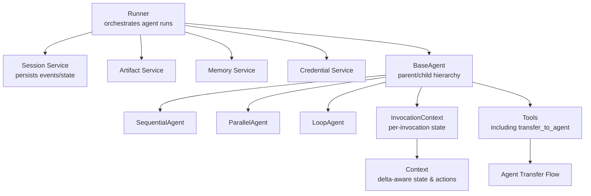
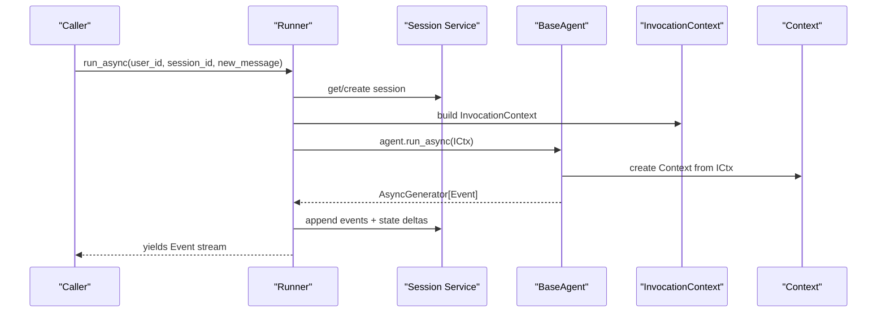
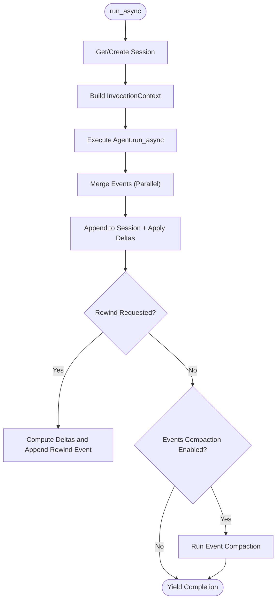
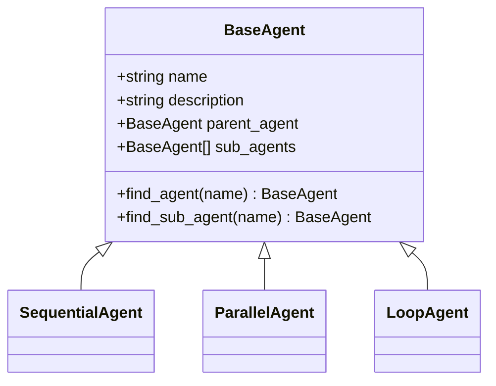
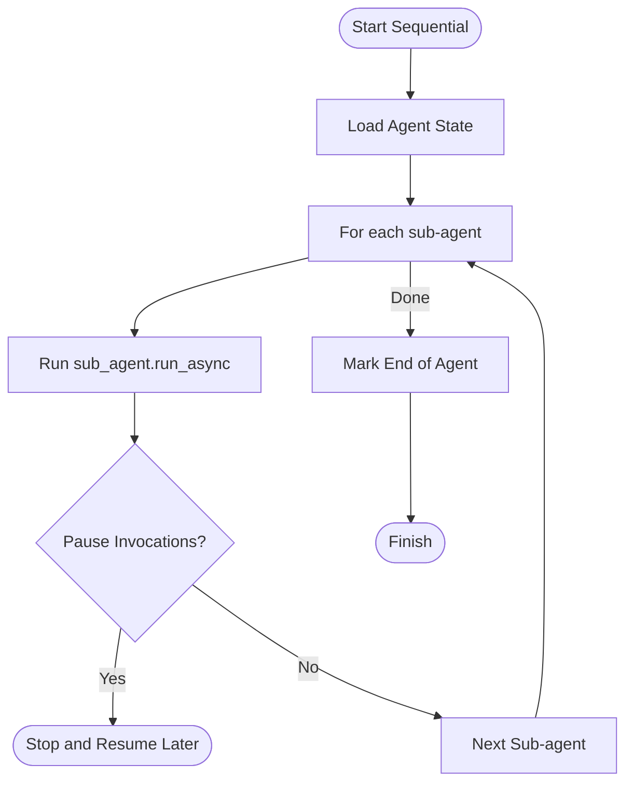
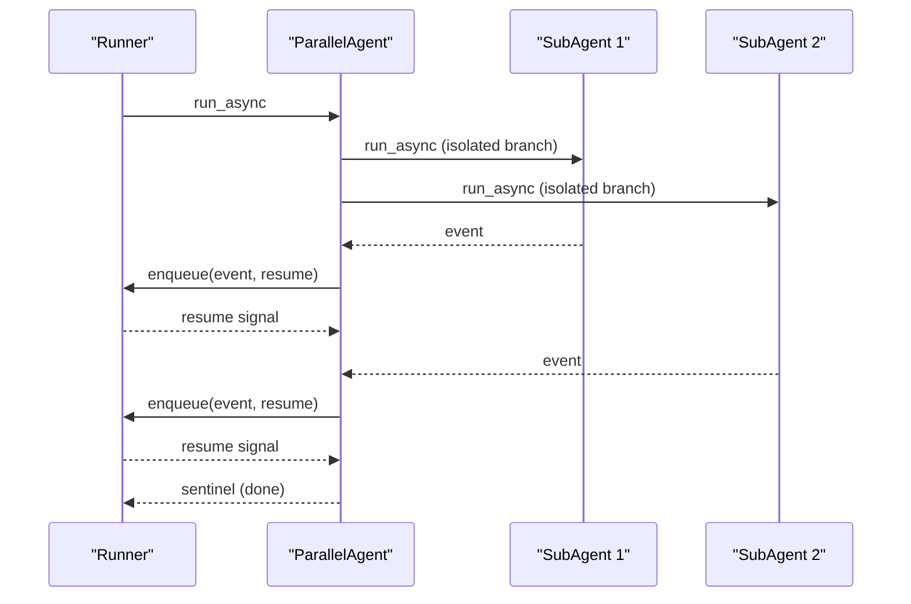
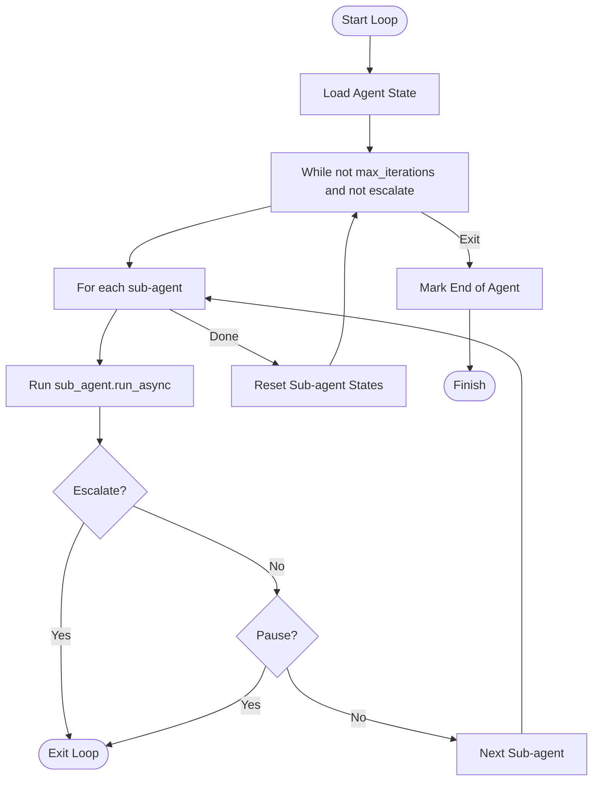
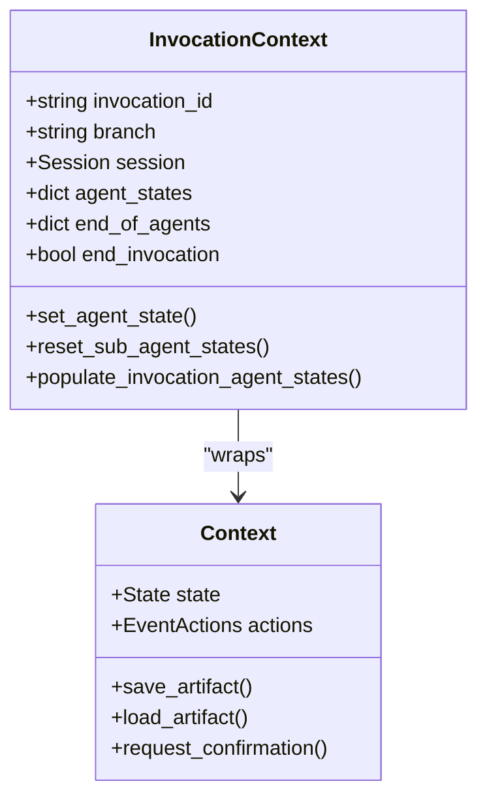
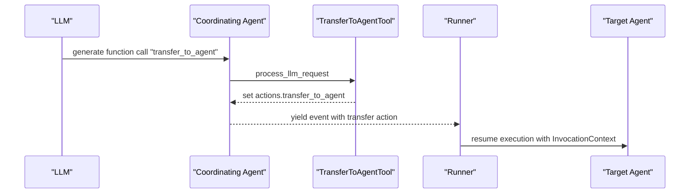
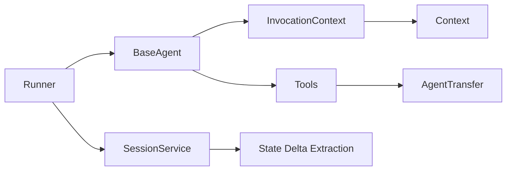

# Multi-Agent Orchestration

<cite>
**Referenced Files in This Document**
- [runners.py](file://src/google/adk/runners.py)
- [base_agent.py](file://src/google/adk/agents/base_agent.py)
- [sequential_agent.py](file://src/google/adk/agents/sequential_agent.py)
- [parallel_agent.py](file://src/google/adk/agents/parallel_agent.py)
- [loop_agent.py](file://src/google/adk/agents/loop_agent.py)
- [context.py](file://src/google/adk/agents/context.py)
- [invocation_context.py](file://src/google/adk/agents/invocation_context.py)
- [transfer_to_agent_tool.py](file://src/google/adk/tools/transfer_to_agent_tool.py)
- [agent_transfer.py](file://src/google/adk/flows/llm_flows/agent_transfer.py)
- [agent_graph.py](file://src/google/adk/cli/agent_graph.py)
- [in_memory_session_service.py](file://src/google/adk/sessions/in_memory_session_service.py)
- [_session_util.py](file://src/google/adk/sessions/_session_util.py)
- [test_parallel_agent.py](file://tests/unittests/agents/test_parallel_agent.py)
- [test_agent_transfer.py](file://tests/unittests/flows/llm_flows/test_agent_transfer.py)
- [test_multi_agent_streaming.py](file://tests/unittests/streaming/test_multi_agent_streaming.py)
- [adk_triaging_agent/main.py](file://contributing/samples/adk_triaging_agent/main.py)
- [adk_triaging_agent/README.md](file://contributing/samples/adk_triaging_agent/README.md)
- [multi_agent_loop_config/README.md](file://contributing/samples/multi_agent_loop_config/README.md)
- [a2a_human_in_loop/README.md](file://contributing/samples/a2a_human_in_loop/README.md)
</cite>

## Table of Contents
1. [Introduction](#introduction)
2. [Project Structure](#project-structure)
3. [Core Components](#core-components)
4. [Architecture Overview](#architecture-overview)
5. [Detailed Component Analysis](#detailed-component-analysis)
6. [Dependency Analysis](#dependency-analysis)
7. [Performance Considerations](#performance-considerations)
8. [Troubleshooting Guide](#troubleshooting-guide)
9. [Conclusion](#conclusion)
10. [Appendices](#appendices)

## Introduction
This document explains multi-agent orchestration in the Agent Development Kit (ADK). It covers hierarchical agent systems, parent–child relationships, inter-agent messaging, coordination strategies, and the Runner’s role in orchestrating workflows. It also documents context propagation, state sharing, delegation patterns, handoff procedures, synchronization, conflict resolution, error propagation, and best practices for building scalable multi-agent architectures.

## Project Structure
ADK organizes multi-agent orchestration around:
- A Runner that coordinates agent execution, manages sessions, and integrates services (artifacts, memory, credentials).
- Base agent abstractions supporting hierarchical composition (parent–child), plus specialized orchestrators (sequential, parallel, loop).
- Invocation and runtime context that propagate state and control across agents.
- Tools and flows enabling agent delegation and handoffs.

**Diagram sources**
- [runners.py](file://src/google/adk/runners.py#L112-L220)
- [base_agent.py](file://src/google/adk/agents/base_agent.py#L86-L137)
- [sequential_agent.py](file://src/google/adk/agents/sequential_agent.py#L48-L93)
- [parallel_agent.py](file://src/google/adk/agents/parallel_agent.py#L150-L210)
- [loop_agent.py](file://src/google/adk/agents/loop_agent.py#L52-L124)
- [invocation_context.py](file://src/google/adk/agents/invocation_context.py#L100-L220)
- [context.py](file://src/google/adk/agents/context.py#L41-L110)
- [transfer_to_agent_tool.py](file://src/google/adk/tools/transfer_to_agent_tool.py#L26-L41)
- [agent_transfer.py](file://src/google/adk/flows/llm_flows/agent_transfer.py#L38-L72)

**Section sources**
- [runners.py](file://src/google/adk/runners.py#L112-L220)
- [base_agent.py](file://src/google/adk/agents/base_agent.py#L86-L137)

## Core Components
- Runner: Central coordinator that manages sessions, invokes agents, merges events, and applies plugins and resumability.
- BaseAgent: Defines parent–child relationships, agent discovery, and lifecycle hooks (before/after callbacks).
- SequentialAgent: Executes sub-agents in order, persisting state to support resumability.
- ParallelAgent: Runs sub-agents concurrently with controlled event merging and per-sub-agent isolation.
- LoopAgent: Iteratively executes sub-agents up to a limit or escalation.
- InvocationContext and Context: Provide per-invocation state, branching, and action buffers (state/artifact deltas, transfers).
- Transfer tools and flows: Enable agent handoffs with constrained function declarations.

**Section sources**
- [runners.py](file://src/google/adk/runners.py#L493-L622)
- [base_agent.py](file://src/google/adk/agents/base_agent.py#L368-L420)
- [sequential_agent.py](file://src/google/adk/agents/sequential_agent.py#L54-L93)
- [parallel_agent.py](file://src/google/adk/agents/parallel_agent.py#L163-L210)
- [loop_agent.py](file://src/google/adk/agents/loop_agent.py#L69-L124)
- [invocation_context.py](file://src/google/adk/agents/invocation_context.py#L100-L220)
- [context.py](file://src/google/adk/agents/context.py#L41-L110)
- [transfer_to_agent_tool.py](file://src/google/adk/tools/transfer_to_agent_tool.py#L26-L41)
- [agent_transfer.py](file://src/google/adk/flows/llm_flows/agent_transfer.py#L38-L72)

## Architecture Overview
The orchestration architecture ties together agents, the Runner, and runtime context. The Runner resolves sessions, constructs InvocationContext, and drives agent execution. Agents emit events; the Runner merges them and persists state and artifacts. Delegation is achieved via a constrained function tool that signals handoff to another agent.

**Diagram sources**
- [runners.py](file://src/google/adk/runners.py#L493-L622)
- [base_agent.py](file://src/google/adk/agents/base_agent.py#L274-L305)
- [context.py](file://src/google/adk/agents/context.py#L41-L110)
- [in_memory_session_service.py](file://src/google/adk/sessions/in_memory_session_service.py#L315-L338)

## Detailed Component Analysis

### Runner: Orchestrating Multi-Agent Workflows
- Responsibilities:
  - Resolve or create sessions, manage resumability, and construct InvocationContext.
  - Drive agent execution, merge events, and apply plugin hooks.
  - Persist state deltas and artifacts per event.
  - Support rewind and event compaction.
- Key behaviors:
  - Validates runner parameters and enforces app name alignment.
  - Supports both synchronous and asynchronous run modes.
  - Applies run-level custom metadata to events.
  - Handles invocation resumption and end-of-agent markers.

**Diagram sources**
- [runners.py](file://src/google/adk/runners.py#L493-L622)
- [runners.py](file://src/google/adk/runners.py#L623-L758)
- [in_memory_session_service.py](file://src/google/adk/sessions/in_memory_session_service.py#L315-L338)

**Section sources**
- [runners.py](file://src/google/adk/runners.py#L150-L220)
- [runners.py](file://src/google/adk/runners.py#L493-L622)
- [runners.py](file://src/google/adk/runners.py#L623-L758)

### Hierarchical Agent Systems and Parent–Child Relationships
- BaseAgent maintains:
  - parent_agent pointer and sub_agents list.
  - Methods to find agents by name across the tree.
  - Lifecycle hooks (before/after callbacks) and cloning with proper parent–child wiring.
- Validation ensures unique sub-agent names and prevents double-parenting.

**Diagram sources**
- [base_agent.py](file://src/google/adk/agents/base_agent.py#L86-L137)
- [sequential_agent.py](file://src/google/adk/agents/sequential_agent.py#L48-L53)
- [parallel_agent.py](file://src/google/adk/agents/parallel_agent.py#L150-L160)
- [loop_agent.py](file://src/google/adk/agents/loop_agent.py#L52-L59)

**Section sources**
- [base_agent.py](file://src/google/adk/agents/base_agent.py#L368-L420)
- [base_agent.py](file://src/google/adk/agents/base_agent.py#L572-L621)

### Sequential Execution: Ordered Coordination
- SequentialAgent iterates sub-agents in order, persisting current sub-agent and iteration counts for resumability.
- Skips yielding duplicate events upon resumption and marks end-of-agent when complete.

**Diagram sources**
- [sequential_agent.py](file://src/google/adk/agents/sequential_agent.py#L54-L93)

**Section sources**
- [sequential_agent.py](file://src/google/adk/agents/sequential_agent.py#L54-L93)

### Parallel Execution: Concurrent Pipelines
- ParallelAgent runs sub-agents concurrently with isolated branches and merges events in a controlled order.
- Uses a queue with per-event resume signals to synchronize producers and the Runner.
- Propagates exceptions across tasks and cancels pending work.

**Diagram sources**
- [parallel_agent.py](file://src/google/adk/agents/parallel_agent.py#L163-L210)
- [parallel_agent.py](file://src/google/adk/agents/parallel_agent.py#L51-L86)
- [parallel_agent.py](file://src/google/adk/agents/parallel_agent.py#L89-L148)

**Section sources**
- [parallel_agent.py](file://src/google/adk/agents/parallel_agent.py#L163-L210)
- [test_parallel_agent.py](file://tests/unittests/agents/test_parallel_agent.py#L362-L375)

### Loop Execution: Iterative Feedback
- LoopAgent repeats sub-agent execution up to a configurable limit or until escalation.
- Resets sub-agent states on each iteration to maintain clean context.

**Diagram sources**
- [loop_agent.py](file://src/google/adk/agents/loop_agent.py#L69-L124)

**Section sources**
- [loop_agent.py](file://src/google/adk/agents/loop_agent.py#L69-L124)

### Context Propagation and State Sharing
- InvocationContext carries:
  - Per-invocation identity, branch, session, and resumability configuration.
  - Agent states and end-of-agent flags scoped to the invocation.
  - Action buffers (state_delta, artifact_delta, transfer_to_agent).
- Context wraps InvocationContext to expose delta-aware state and actions for tools and callbacks.

**Diagram sources**
- [invocation_context.py](file://src/google/adk/agents/invocation_context.py#L100-L220)
- [context.py](file://src/google/adk/agents/context.py#L41-L110)

**Section sources**
- [invocation_context.py](file://src/google/adk/agents/invocation_context.py#L232-L282)
- [context.py](file://src/google/adk/agents/context.py#L95-L110)
- [in_memory_session_service.py](file://src/google/adk/sessions/in_memory_session_service.py#L315-L338)
- [_session_util.py](file://src/google/adk/sessions/_session_util.py#L41-L50)

### Agent Communication Patterns and Delegation
- Delegation is modeled as a function call (transfer_to_agent) that sets an action to switch control to another agent.
- TransferToAgentTool constrains the agent_name parameter via enum to prevent hallucinations.
- AgentTransfer flow builds system instructions enumerating valid targets and parent/peer options.

**Diagram sources**
- [transfer_to_agent_tool.py](file://src/google/adk/tools/transfer_to_agent_tool.py#L26-L41)
- [agent_transfer.py](file://src/google/adk/flows/llm_flows/agent_transfer.py#L38-L72)
- [agent_transfer.py](file://src/google/adk/flows/llm_flows/agent_transfer.py#L129-L153)

**Section sources**
- [transfer_to_agent_tool.py](file://src/google/adk/tools/transfer_to_agent_tool.py#L43-L90)
- [agent_transfer.py](file://src/google/adk/flows/llm_flows/agent_transfer.py#L129-L153)
- [test_agent_transfer.py](file://tests/unittests/flows/llm_flows/test_agent_transfer.py#L554-L587)
- [test_multi_agent_streaming.py](file://tests/unittests/streaming/test_multi_agent_streaming.py#L111-L144)

### Handoff Procedures and Decision-Making
- Decision-making for delegation is guided by system instructions that enumerate eligible agents and parent/peer options.
- Parent–child and peer constraints are enforced to avoid cycles and ensure sensible routing.

**Section sources**
- [agent_transfer.py](file://src/google/adk/flows/llm_flows/agent_transfer.py#L156-L175)

### Synchronization and Conflict Resolution
- Parallel execution synchronizes via a queue with per-event resume signals, ensuring upstream consumption before downstream generation.
- Exception propagation across tasks prevents deadlocks and ensures consistent failure handling.
- Invocation pausing supports long-running tools; branching isolates peer histories.

**Section sources**
- [parallel_agent.py](file://src/google/adk/agents/parallel_agent.py#L51-L86)
- [parallel_agent.py](file://src/google/adk/agents/parallel_agent.py#L89-L148)
- [invocation_context.py](file://src/google/adk/agents/invocation_context.py#L363-L398)

### Examples of Complex Multi-Agent Scenarios
- Triage systems: A triaging agent coordinates fetching issue data, applying labels, and assigning owners, driven by a Runner and orchestrated via delegation and state.
- Collaborative problem-solving: A loop-based workflow iteratively writes, critiques, and refines content until satisfied.
- Human-in-the-loop A2A: A root agent delegates to a remote approval agent; human approvals surface locally for finalization.

**Section sources**
- [adk_triaging_agent/main.py](file://contributing/samples/adk_triaging_agent/main.py#L92-L185)
- [adk_triaging_agent/README.md](file://contributing/samples/adk_triaging_agent/README.md#L38-L67)
- [multi_agent_loop_config/README.md](file://contributing/samples/multi_agent_loop_config/README.md#L1-L17)
- [a2a_human_in_loop/README.md](file://contributing/samples/a2a_human_in_loop/README.md#L1-L22)

## Dependency Analysis
The orchestration depends on:
- Agent hierarchy and runtime context for state and branching.
- Tools and flows for delegation.
- Session persistence for state deltas and resumability.

**Diagram sources**
- [runners.py](file://src/google/adk/runners.py#L493-L622)
- [base_agent.py](file://src/google/adk/agents/base_agent.py#L274-L305)
- [invocation_context.py](file://src/google/adk/agents/invocation_context.py#L100-L220)
- [context.py](file://src/google/adk/agents/context.py#L41-L110)
- [transfer_to_agent_tool.py](file://src/google/adk/tools/transfer_to_agent_tool.py#L26-L41)
- [agent_transfer.py](file://src/google/adk/flows/llm_flows/agent_transfer.py#L38-L72)
- [in_memory_session_service.py](file://src/google/adk/sessions/in_memory_session_service.py#L315-L338)
- [_session_util.py](file://src/google/adk/sessions/_session_util.py#L41-L50)

**Section sources**
- [agent_graph.py](file://src/google/adk/cli/agent_graph.py#L152-L184)

## Performance Considerations
- Prefer SequentialAgent for deterministic ordering and minimal contention.
- Use ParallelAgent for independent branches where throughput matters; monitor queue sizes and resume signal latency.
- Limit LoopAgent iterations to prevent runaway loops; leverage escalation and pause mechanisms.
- Keep InvocationContext lightweight; avoid large payloads in state deltas.
- Use event compaction and artifact references to reduce session size.

## Troubleshooting Guide
Common issues and resolutions:
- Session not found: Ensure app name alignment and enable auto-create session when appropriate.
- Missing function call for invocation resumption: Provide invocation_id or ensure function responses carry the correct linkage.
- Deadlocks in parallel agents: Verify resume signals are emitted after each event; confirm exception propagation is enabled.
- State drift: Confirm state deltas are applied consistently; use rewind to restore state when needed.
- Delegation failures: Validate agent names in TransferToAgentTool enum and ensure system instructions enumerate valid targets.

**Section sources**
- [runners.py](file://src/google/adk/runners.py#L384-L394)
- [runners.py](file://src/google/adk/runners.py#L564-L584)
- [parallel_agent.py](file://src/google/adk/agents/parallel_agent.py#L106-L113)
- [runners.py](file://src/google/adk/runners.py#L623-L758)
- [transfer_to_agent_tool.py](file://src/google/adk/tools/transfer_to_agent_tool.py#L77-L88)

## Conclusion
ADK provides a robust foundation for multi-agent orchestration through hierarchical agents, specialized orchestrators, and a powerful Runner. By leveraging InvocationContext and Context for state and actions, constrained delegation tools, and careful synchronization, teams can build scalable, resumable, and human-aware multi-agent systems. Use SequentialAgent for ordered workflows, ParallelAgent for concurrent pipelines, and LoopAgent for iterative refinement. Apply best practices for branching, pausing, and rewinding to achieve reliability and maintainability.

## Appendices
- Best practices:
  - Define clear agent roles and descriptions to guide delegation.
  - Use resumability and end-of-agent markers to support long-running workflows.
  - Employ branching to isolate peer histories and reduce cross-contamination.
  - Keep tool schemas precise (as with TransferToAgentTool) to prevent hallucinations.
  - Monitor LLM call limits and enforce quotas via InvocationContext cost tracking.