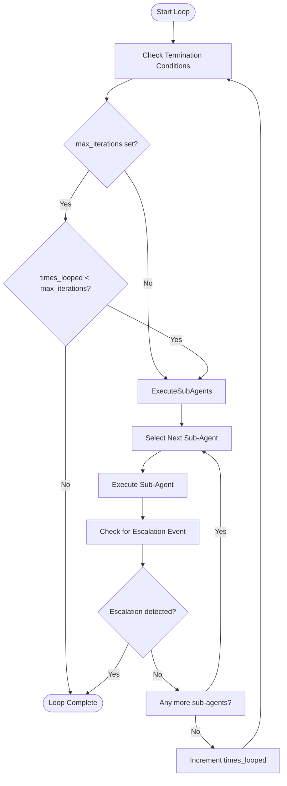
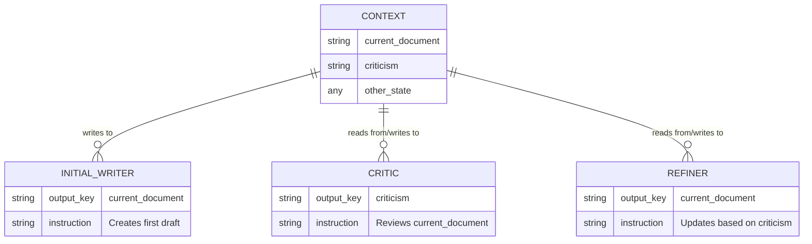
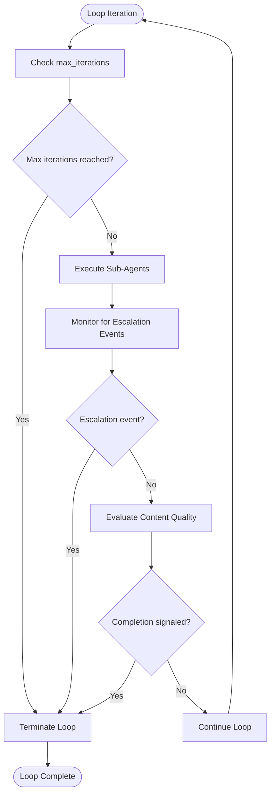
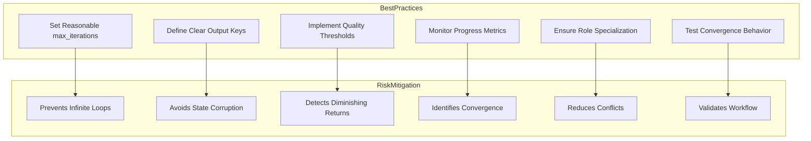

# Loop Agent

<cite>
**Referenced Files in This Document**   
- [loop_agent.py](file://src/google/adk/agents/loop_agent.py)
- [loop_agent_config.py](file://src/google/adk/agents/loop_agent_config.py)
- [loop_agent.yaml](file://contributing/samples/multi_agent_loop_config/loop_agent.yaml)
- [root_agent.yaml](file://contributing/samples/multi_agent_loop_config/root_agent.yaml)
- [initial_writer_agent.yaml](file://contributing/samples/multi_agent_loop_config/writer_agents/initial_writer_agent.yaml)
- [critic_agent.yaml](file://contributing/samples/multi_agent_loop_config/writer_agents/critic_agent.yaml)
- [refiner_agent.yaml](file://contributing/samples/multi_agent_loop_config/writer_agents/refiner_agent.yaml)
- [README.md](file://contributing/samples/multi_agent_loop_config/README.md)
</cite>

## Table of Contents
1. [Introduction](#introduction)
2. [Loop Agent Interface and Configuration](#loop-agent-interface-and-configuration)
3. [Iterative Workflow Implementation](#iterative-workflow-implementation)
4. [Domain Model of Iterative Processing](#domain-model-of-iterative-processing)
5. [State Persistence and Evolution](#state-persistence-and-evolution)
6. [Termination Conditions and Convergence Criteria](#termination-conditions-and-convergence-criteria)
7. [Common Issues and Best Practices](#common-issues-and-best-practices)
8. [Example: Multi-Agent Writing Workflow](#example-multi-agent-writing-workflow)
9. [Conclusion](#conclusion)

## Introduction

The LoopAgent in the ADK framework enables iterative refinement workflows where agents cycle through roles until a termination condition is met. This document details the implementation, interface, and usage patterns of the LoopAgent, focusing on its role in creating feedback loops for content improvement and other iterative processes. The agent provides a structured approach to cyclic processing, allowing for multiple passes of refinement, critique, and enhancement until quality thresholds are met.

**Section sources**
- [README.md](file://contributing/samples/multi_agent_loop_config/README.md)

## Loop Agent Interface and Configuration

The LoopAgent implements a shell agent that executes its sub-agents in a repeating cycle. The agent's interface is defined through both code-level parameters and YAML configuration options, allowing for flexible deployment in various iterative scenarios.

Key interface elements include:

- **max_iterations**: A configurable limit on the number of loop iterations, preventing infinite execution
- **sub_agents**: A list of agent configurations that will be executed sequentially in each iteration
- **escalation handling**: Built-in support for termination via sub-agent escalation events

The configuration is managed through the LoopAgentConfig class, which extends the base agent configuration with loop-specific parameters. The agent operates by cycling through its sub-agents in order, maintaining state between iterations, and checking termination conditions after each complete pass.

```mermaid
classDiagram
class LoopAgent {
+config_type : type[BaseAgentConfig]
+max_iterations : Optional[int]
_run_async_impl(ctx) AsyncGenerator[Event, None]
_run_live_impl(ctx) AsyncGenerator[Event, None]
_parse_config(cls, config, config_abs_path, kwargs) Dict[str, Any]
}
class LoopAgentConfig {
+model_config : ConfigDict
+agent_class : Literal['LoopAgent']
+max_iterations : Optional[int]
}
class BaseAgent {
<<abstract>>
}
class BaseAgentConfig {
<<abstract>>
}
LoopAgent --|> BaseAgent
LoopAgentConfig --|> BaseAgentConfig
LoopAgent : : config_type --> LoopAgentConfig
```

**Diagram sources**
- [loop_agent.py](file://src/google/adk/agents/loop_agent.py#L37-L92)
- [loop_agent_config.py](file://src/google/adk/agents/loop_agent_config.py#L29-L45)

**Section sources**
- [loop_agent.py](file://src/google/adk/agents/loop_agent.py#L37-L92)
- [loop_agent_config.py](file://src/google/adk/agents/loop_agent_config.py#L29-L45)

## Iterative Workflow Implementation

The LoopAgent implements iterative workflows through a simple but powerful execution model. The core implementation in `_run_async_impl` method creates a while loop that continues until either the maximum iteration count is reached or a sub-agent escalates (signals termination).

The execution flow follows these steps:
1. Initialize iteration counter
2. While termination conditions are not met:
   - Execute each sub-agent in sequence
   - Propagate events from sub-agents to the caller
   - Check for escalation events after each sub-agent completes
   - Increment iteration counter after completing all sub-agents
3. Terminate when maximum iterations reached or escalation occurs

This implementation allows for flexible workflow design where different agents can play specialized roles in each iteration, such as critique, refinement, validation, or enhancement.



**Diagram sources**
- [loop_agent.py](file://src/google/adk/agents/loop_agent.py#L55-L72)

**Section sources**
- [loop_agent.py](file://src/google/adk/agents/loop_agent.py#L55-L72)

## Domain Model of Iterative Processing

The LoopAgent embodies a domain model for iterative processing that includes several key concepts: feedback loops, state evolution, and termination detection. This model enables the creation of sophisticated refinement workflows where quality improves incrementally across iterations.

The core components of the domain model include:

- **Feedback Loop**: A cycle where output from one iteration becomes input for the next
- **State Evolution**: Gradual transformation of content or data through successive refinement
- **Convergence Detection**: Mechanisms to identify when further iterations provide diminishing returns
- **Role Specialization**: Different agents performing specialized functions within each iteration

The model supports various patterns of iterative improvement, including critique-refinement cycles, progressive enhancement, and quality gating. Each iteration builds upon the previous state, allowing for incremental improvements that collectively produce high-quality outcomes.

```mermaid
stateDiagram-v2
[*] --> Initialization
Initialization --> FirstIteration : Execute initial agent
FirstIteration --> FeedbackAnalysis : Analyze output
FeedbackAnalysis --> HasImprovements{"Identifiable improvements?"}
HasImprovements --> |Yes| Refinement : Apply improvements
Refinement --> NextIteration : Begin next iteration
HasImprovements --> |No| Converged : Termination condition met
NextIteration --> FeedbackAnalysis
Converged --> [*]
```

**Diagram sources**
- [loop_agent.py](file://src/google/adk/agents/loop_agent.py)
- [README.md](file://contributing/samples/multi_agent_loop_config/README.md)

**Section sources**
- [loop_agent.py](file://src/google/adk/agents/loop_agent.py)
- [README.md](file://contributing/samples/multi_agent_loop_config/README.md)

## State Persistence and Evolution

State management in the LoopAgent framework relies on shared context that persists across iterations. The invocation context (InvocationContext) serves as the state container, maintaining data that evolves throughout the iterative process.

Key aspects of state persistence include:

- **Output Key Mapping**: Agents use output_key to specify which context variable to update
- **Template Variables**: Agents can reference previous outputs using template syntax (e.g., {{current_document}})
- **Sequential State Updates**: Each agent builds upon the state modified by previous agents
- **Cross-Iteration Continuity**: State persists across complete loop iterations

In the writing workflow example, the `current_document` variable is updated by both the initial writer and refiner agents, while the `criticism` variable is updated by the critic agent. This creates a feedback loop where the document content evolves based on accumulated critique.



**Diagram sources**
- [initial_writer_agent.yaml](file://contributing/samples/multi_agent_loop_config/writer_agents/initial_writer_agent.yaml)
- [critic_agent.yaml](file://contributing/samples/multi_agent_loop_config/writer_agents/critic_agent.yaml)
- [refiner_agent.yaml](file://contributing/samples/multi_agent_loop_config/writer_agents/refiner_agent.yaml)

**Section sources**
- [initial_writer_agent.yaml](file://contributing/samples/multi_agent_loop_config/writer_agents/initial_writer_agent.yaml)
- [critic_agent.yaml](file://contributing/samples/multi_agent_loop_config/writer_agents/critic_agent.yaml)
- [refiner_agent.yaml](file://contributing/samples/multi_agent_loop_config/writer_agents/refiner_agent.yaml)

## Termination Conditions and Convergence Criteria

The LoopAgent supports multiple termination mechanisms that serve as convergence criteria for iterative workflows. These conditions ensure that loops terminate appropriately rather than running indefinitely.

Primary termination conditions include:

- **Maximum Iterations**: The loop terminates when the specified max_iterations count is reached
- **Escalation Events**: Sub-agents can trigger immediate termination by generating escalation events
- **Explicit Exit Commands**: Specialized tools like exit_loop can be called to terminate the loop
- **Content-Based Conditions**: Agents can evaluate content quality and signal completion

In the writing workflow example, termination is achieved through a content-based condition: when the critic agent determines that no major issues remain, it outputs "No major issues found." The refiner agent detects this specific output and calls the exit_loop tool, which triggers termination.

This multi-faceted approach to termination allows for both safety mechanisms (maximum iterations) and intelligent convergence detection (content evaluation), ensuring that loops terminate appropriately under various conditions.



**Diagram sources**
- [loop_agent.py](file://src/google/adk/agents/loop_agent.py#L59-L71)
- [refiner_agent.yaml](file://contributing/samples/multi_agent_loop_config/writer_agents/refiner_agent.yaml#L17-L22)

**Section sources**
- [loop_agent.py](file://src/google/adk/agents/loop_agent.py#L59-L71)
- [refiner_agent.yaml](file://contributing/samples/multi_agent_loop_config/writer_agents/refiner_agent.yaml#L17-L22)

## Common Issues and Best Practices

Implementing effective iterative workflows with the LoopAgent requires addressing several common challenges and following best practices to ensure reliable and productive operation.

### Common Issues

**Infinite Loops**: Occur when termination conditions are not properly defined or detected. The max_iterations parameter serves as a safety net, but well-designed convergence criteria are essential.

**Diminishing Returns**: Later iterations may provide minimal improvement. This can be mitigated by implementing quality thresholds and requiring significant improvements for continuation.

**State Corruption**: Improper state management can lead to data loss or corruption across iterations. Using clear output keys and avoiding unintended state modifications is crucial.

**Feedback Loop Instability**: Contradictory feedback from different agents can cause oscillation rather than convergence. Ensuring role clarity and consistent evaluation criteria helps maintain stability.

### Best Practices

**Design Clear Convergence Criteria**: Establish unambiguous conditions for loop termination, preferably based on measurable quality indicators.

**Implement Progressive Enhancement**: Structure agents to make incremental improvements rather than radical changes, reducing the risk of quality regression.

**Monitor Iteration Progress**: Track metrics across iterations to identify patterns of improvement and detect when diminishing returns set in.

**Use Appropriate Iteration Limits**: Set max_iterations based on expected convergence behavior, providing enough iterations for meaningful improvement while preventing excessive processing.

**Ensure Role Specialization**: Assign clear, non-overlapping responsibilities to each agent in the loop to avoid conflicting actions.



**Diagram sources**
- [loop_agent.yaml](file://contributing/samples/multi_agent_loop_config/loop_agent.yaml#L5)
- [critic_agent.yaml](file://contributing/samples/multi_agent_loop_config/writer_agents/critic_agent.yaml)
- [refiner_agent.yaml](file://contributing/samples/multi_agent_loop_config/writer_agents/refiner_agent.yaml)

**Section sources**
- [loop_agent.yaml](file://contributing/samples/multi_agent_loop_config/loop_agent.yaml#L5)
- [critic_agent.yaml](file://contributing/samples/multi_agent_loop_config/writer_agents/critic_agent.yaml)
- [refiner_agent.yaml](file://contributing/samples/multi_agent_loop_config/writer_agents/refiner_agent.yaml)

## Example: Multi-Agent Writing Workflow

The multi_agent_loop_config sample demonstrates a complete iterative writing workflow implemented using the LoopAgent. This workflow showcases how multiple agents collaborate in a cycle to progressively improve content quality.

The workflow architecture consists of three main components:

1. **Initial Writer Agent**: Creates the first draft based on a topic
2. **Refinement Loop**: Contains a critic and refiner agent that iterate until quality targets are met
3. **Critic-Refiner Cycle**: A feedback loop where content is evaluated and improved

The process begins with the SequentialAgent executing the initial writer, which produces a first draft stored in `current_document`. The workflow then enters the LoopAgent, which cycles between the critic and refiner agents.

The critic agent evaluates the document against criteria including length, clarity, engagement, and coherence. If actionable improvements are identified, it provides specific suggestions. If the document meets quality standards, it outputs "No major issues found."

The refiner agent checks the criticism: if the completion phrase is detected, it calls the exit_loop tool to terminate the loop; otherwise, it applies the suggestions to improve the document and updates `current_document` for the next iteration.

```mermaid
graph TB
subgraph Root[Root Agent: SequentialAgent]
A[InitialWriterAgent] --> B[LoopAgent]
end
subgraph Loop[LoopAgent: RefinementLoop]
C[CriticAgent] --> D[RefinerAgent]
D --> C
end
style Loop fill:#f0f8ff,stroke:#333,stroke-width:1px
A --> |Writes to| current_document
C --> |Reads| current_document
C --> |Writes to| criticism
D --> |Reads| criticism
D --> |Updates| current_document
D -- "exit_loop" --> |Terminates| Loop
Loop -- "max_iterations=5" --> |Terminates| Loop
style A fill:#e6f3ff,stroke:#333
style C fill:#ffe6e6,stroke:#333
style D fill:#e6ffe6,stroke:#333
```

**Diagram sources**
- [root_agent.yaml](file://contributing/samples/multi_agent_loop_config/root_agent.yaml)
- [loop_agent.yaml](file://contributing/samples/multi_agent_loop_config/loop_agent.yaml)
- [initial_writer_agent.yaml](file://contributing/samples/multi_agent_loop_config/writer_agents/initial_writer_agent.yaml)
- [critic_agent.yaml](file://contributing/samples/multi_agent_loop_config/writer_agents/critic_agent.yaml)
- [refiner_agent.yaml](file://contributing/samples/multi_agent_loop_config/writer_agents/refiner_agent.yaml)

**Section sources**
- [root_agent.yaml](file://contributing/samples/multi_agent_loop_config/root_agent.yaml)
- [loop_agent.yaml](file://contributing/samples/multi_agent_loop_config/loop_agent.yaml)
- [initial_writer_agent.yaml](file://contributing/samples/multi_agent_loop_config/writer_agents/initial_writer_agent.yaml)
- [critic_agent.yaml](file://contributing/samples/multi_agent_loop_config/writer_agents/critic_agent.yaml)
- [refiner_agent.yaml](file://contributing/samples/multi_agent_loop_config/writer_agents/refiner_agent.yaml)

## Conclusion

The LoopAgent in the ADK framework provides a robust mechanism for implementing iterative refinement workflows. By enabling agents to cycle through specialized roles until convergence criteria are met, it supports sophisticated patterns of collaborative improvement. The agent's interface, with configurable iteration limits and flexible sub-agent composition, allows for the creation of effective feedback loops for content creation, data processing, and quality assurance tasks.

Key strengths of the LoopAgent include its simple yet powerful execution model, seamless state persistence between iterations, and multiple termination mechanisms that prevent infinite loops. The multi-agent writing workflow example demonstrates how these features combine to create a system that can progressively improve output quality through specialized critique and refinement stages.

When designing LoopAgent workflows, it is essential to establish clear convergence criteria, implement appropriate safeguards against infinite loops, and ensure proper state management. Following best practices in role specialization and progress monitoring will help create effective iterative systems that reliably produce high-quality outcomes.