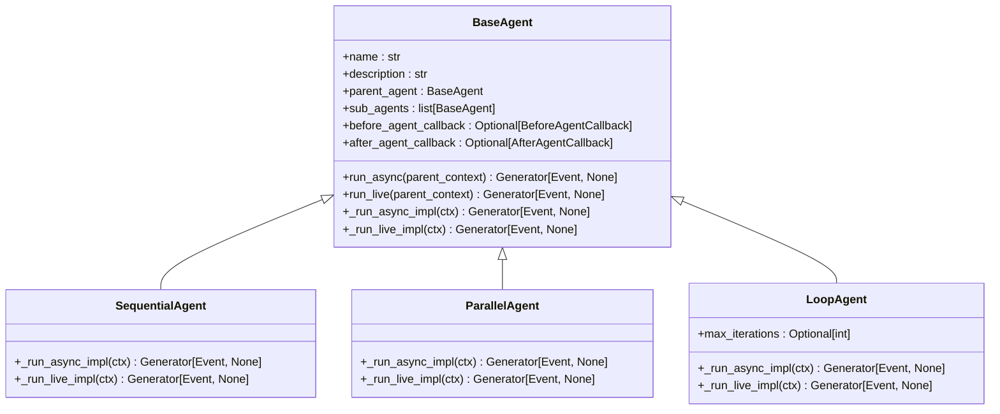
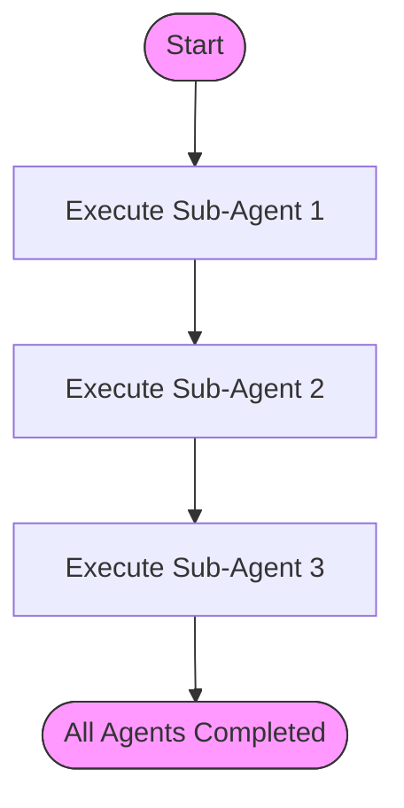
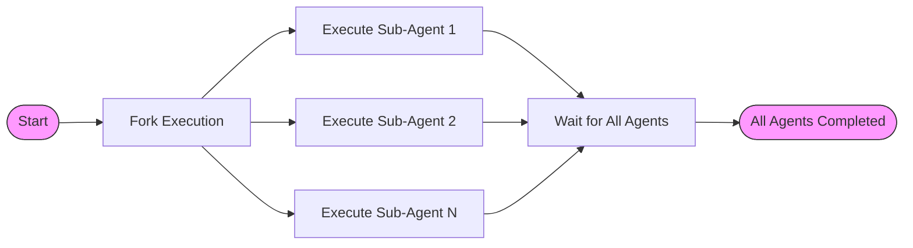
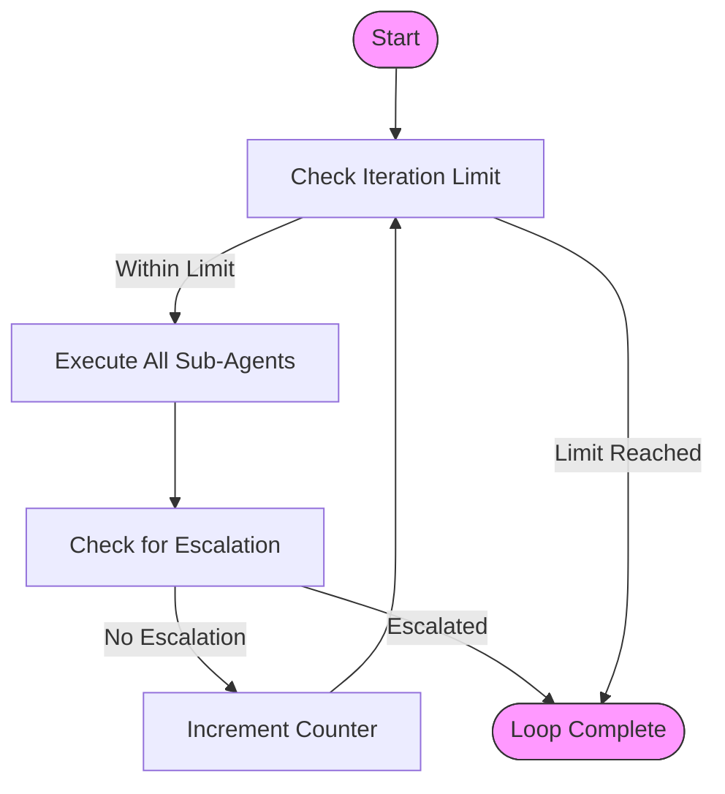
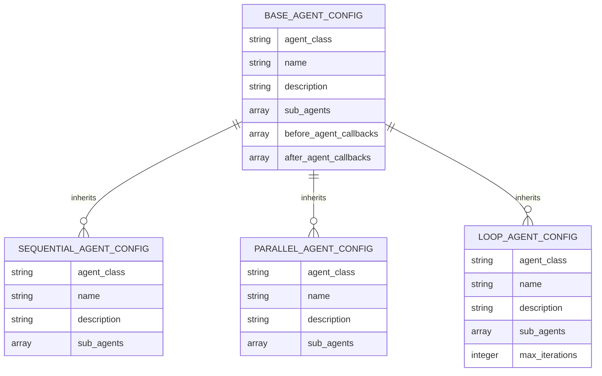
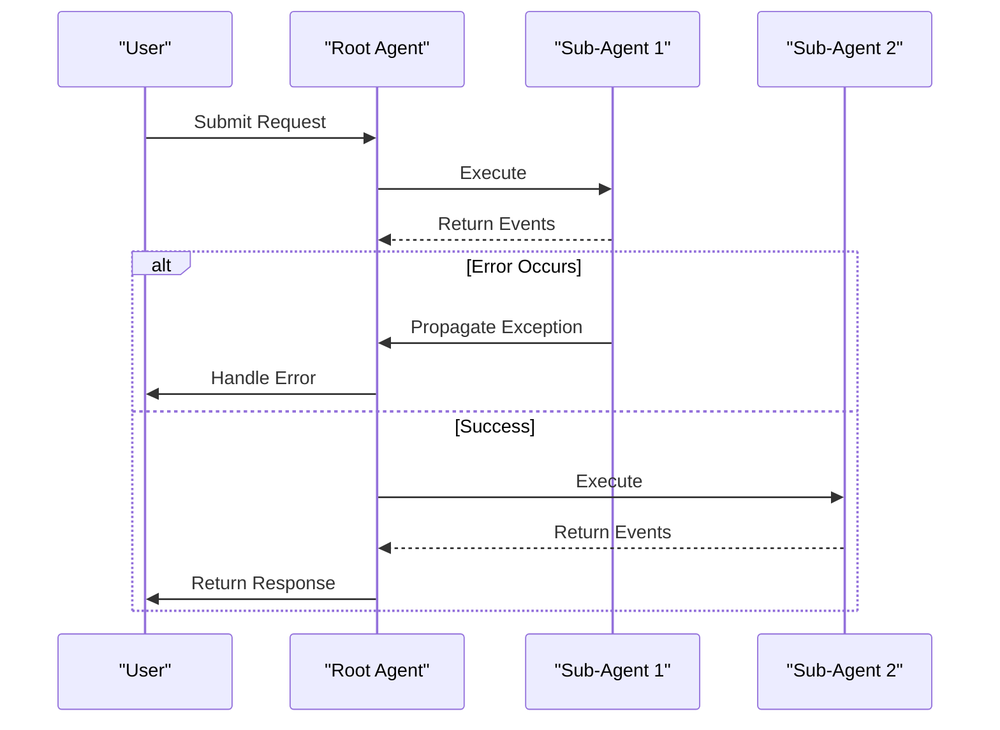

# Multi-Agent Systems

<cite>
**Referenced Files in This Document**   
- [sequential_agent.py](file://src/google/adk/agents/sequential_agent.py)
- [parallel_agent.py](file://src/google/adk/agents/parallel_agent.py)
- [loop_agent.py](file://src/google/adk/agents/loop_agent.py)
- [sequential_agent_config.py](file://src/google/adk/agents/sequential_agent_config.py)
- [parallel_agent_config.py](file://src/google/adk/agents/parallel_agent_config.py)
- [loop_agent_config.py](file://src/google/adk/agents/loop_agent_config.py)
- [base_agent.py](file://src/google/adk/agents/base_agent.py)
- [base_agent_config.py](file://src/google/adk/agents/base_agent_config.py)
- [AgentConfig.json](file://src/google/adk/agents/config_schemas/AgentConfig.json)
- [multi_agent_seq_config/root_agent.yaml](file://contributing/samples/multi_agent_seq_config/root_agent.yaml)
- [multi_agent_loop_config/root_agent.yaml](file://contributing/samples/multi_agent_loop_config/root_agent.yaml)
- [multi_agent_loop_config/loop_agent.yaml](file://contributing/samples/multi_agent_loop_config/loop_agent.yaml)
- [multi_agent_basic_config/root_agent.yaml](file://contributing/samples/multi_agent_basic_config/root_agent.yaml)
- [multi_agent_basic_config/math_tutor_agent.yaml](file://contributing/samples/multi_agent_basic_config/math_tutor_agent.yaml)
- [multi_agent_basic_config/code_tutor_agent.yaml](file://contributing/samples/multi_agent_basic_config/code_tutor_agent.yaml)
</cite>

## Table of Contents
1. [Introduction](#introduction)
2. [Agent Orchestration Architecture](#agent-orchestration-architecture)
3. [Sequential Agent](#sequential-agent)
4. [Parallel Agent](#parallel-agent)
5. [Loop Agent](#loop-agent)
6. [Configuration and Setup](#configuration-and-setup)
7. [Control Flow and Error Propagation](#control-flow-and-error-propagation)
8. [Common Issues and Best Practices](#common-issues-and-best-practices)
9. [Conclusion](#conclusion)

## Introduction

The ADK framework provides a robust multi-agent system architecture that enables sophisticated task orchestration through three primary agent types: SequentialAgent, ParallelAgent, and LoopAgent. These agents serve as shell agents that coordinate the execution of sub-agents according to specific patterns, allowing for complex workflows in AI applications. The framework supports both YAML-based configuration and programmatic setup, making it flexible for various use cases from simple task sequences to iterative refinement processes.

This document provides a comprehensive analysis of the multi-agent system implementation in the ADK framework, detailing the interfaces, parameters, and operational characteristics of each agent type. We will explore how these agents manage sub-agent coordination, result aggregation, and control flow, with specific examples from the provided sample configurations.

**Section sources**
- [sequential_agent.py](file://src/google/adk/agents/sequential_agent.py#L1-L87)
- [parallel_agent.py](file://src/google/adk/agents/parallel_agent.py#L1-L204)
- [loop_agent.py](file://src/google/adk/agents/loop_agent.py#L1-L93)

## Agent Orchestration Architecture

The multi-agent system in ADK is built on a hierarchical architecture where shell agents coordinate the execution of sub-agents. The base class for all agents is BaseAgent, which provides the fundamental structure and behavior for agent execution. Each specialized agent type inherits from BaseAgent and implements specific execution patterns.



**Diagram sources**
- [base_agent.py](file://src/google/adk/agents/base_agent.py#L71-L612)
- [sequential_agent.py](file://src/google/adk/agents/sequential_agent.py#L34-L87)
- [parallel_agent.py](file://src/google/adk/agents/parallel_agent.py#L161-L204)
- [loop_agent.py](file://src/google/adk/agents/loop_agent.py#L37-L93)

The agent execution model is based on asynchronous generators that yield Event objects, allowing for streaming responses and efficient resource utilization. The InvocationContext class manages the execution context, including state, callbacks, and plugin integration. This architecture enables complex agent interactions while maintaining clean separation of concerns.

**Section sources**
- [base_agent.py](file://src/google/adk/agents/base_agent.py#L71-L612)
- [sequential_agent.py](file://src/google/adk/agents/sequential_agent.py#L34-L87)
- [parallel_agent.py](file://src/google/adk/agents/parallel_agent.py#L161-L204)
- [loop_agent.py](file://src/google/adk/agents/loop_agent.py#L37-L93)

## Sequential Agent

The SequentialAgent executes its sub-agents in a predetermined order, one after another. This agent type is ideal for workflows that require ordered task execution, such as a code pipeline that involves writing, reviewing, and refactoring code.



**Diagram sources**
- [sequential_agent.py](file://src/google/adk/agents/sequential_agent.py#L40-L48)

The SequentialAgent implementation is straightforward, iterating through each sub-agent and yielding events from their execution. The _run_async_impl method processes sub-agents sequentially, ensuring that each agent completes before the next one begins. For live execution scenarios, the agent adds a task_completed function to LLM agents, allowing them to signal when they have finished their task and control should pass to the next agent.

The agent configuration is defined in SequentialAgentConfig, which inherits from BaseAgentConfig and specifies the agent_class as 'SequentialAgent'. This configuration class is marked as experimental, indicating it may be subject to changes in future versions.

Key parameters:
- **sub_agents**: List of sub-agent configurations to execute in sequence
- **name**: Unique identifier for the agent
- **description**: Brief description of the agent's purpose

The SequentialAgent is particularly useful for workflows that have natural dependencies between steps, such as the code pipeline example in the multi_agent_seq_config sample, where code is first written, then reviewed, and finally refactored in a specific order.

**Section sources**
- [sequential_agent.py](file://src/google/adk/agents/sequential_agent.py#L34-L87)
- [sequential_agent_config.py](file://src/google/adk/agents/sequential_agent_config.py#L28-L42)
- [multi_agent_seq_config/root_agent.yaml](file://contributing/samples/multi_agent_seq_config/root_agent.yaml#L1-L9)

## Parallel Agent

The ParallelAgent executes its sub-agents concurrently, allowing for simultaneous processing of multiple tasks. This agent type is beneficial for scenarios requiring multiple perspectives or attempts on a single task, such as running different algorithms simultaneously or generating multiple responses for review by a subsequent evaluation agent.



**Diagram sources**
- [parallel_agent.py](file://src/google/adk/agents/parallel_agent.py#L175-L193)

The ParallelAgent implementation uses asyncio to manage concurrent execution of sub-agents. The _run_async_impl method creates isolated invocation contexts for each sub-agent and runs them in parallel using the _merge_agent_run function, which handles event merging from multiple asynchronous generators. The implementation includes Python version-specific handling, with a TaskGroup-based approach for Python 3.11+ and a custom implementation for earlier versions.

The agent creates isolated branches for each sub-agent to prevent state conflicts, with branch names following the pattern "parent.subagent". This isolation ensures that each sub-agent operates in its own context, preventing unintended interactions between parallel processes.

Key parameters:
- **sub_agents**: List of sub-agent configurations to execute in parallel
- **name**: Unique identifier for the agent
- **description**: Brief description of the agent's purpose

Notably, the ParallelAgent does not currently support live execution (_run_live_impl raises NotImplementedError), indicating that this functionality is not yet implemented. This limitation should be considered when designing workflows that require real-time audio or video processing.

**Section sources**
- [parallel_agent.py](file://src/google/adk/agents/parallel_agent.py#L161-L204)
- [parallel_agent_config.py](file://src/google/adk/agents/parallel_agent_config.py#L28-L42)

## Loop Agent

The LoopAgent executes its sub-agents in a continuous loop, making it ideal for iterative refinement workflows. The loop continues until either a sub-agent escalates (signals completion) or the maximum number of iterations is reached.



**Diagram sources**
- [loop_agent.py](file://src/google/adk/agents/loop_agent.py#L55-L72)

The LoopAgent implementation maintains a counter (times_looped) to track the number of iterations and checks for the max_iterations parameter to prevent infinite loops. The _run_async_impl method contains a while loop that continues until either the iteration limit is reached or a sub-agent triggers an escalation event. During each iteration, all sub-agents are executed in sequence, and the agent monitors for escalation events after each sub-agent's execution.

The agent configuration in LoopAgentConfig includes an additional max_iterations parameter, which is optional. If not set, the loop will continue indefinitely until a sub-agent escalates. This parameter provides a safety mechanism to prevent infinite loops in production environments.

Key parameters:
- **sub_agents**: List of sub-agent configurations to execute in each iteration
- **max_iterations**: Maximum number of iterations (optional, default: None)
- **name**: Unique identifier for the agent
- **description**: Brief description of the agent's purpose

The LoopAgent is particularly useful for refinement workflows, such as the iterative writing pipeline example in the multi_agent_loop_config sample, where content is repeatedly critiqued and refined until quality standards are met.

**Section sources**
- [loop_agent.py](file://src/google/adk/agents/loop_agent.py#L37-L93)
- [loop_agent_config.py](file://src/google/adk/agents/loop_agent_config.py#L29-L45)
- [multi_agent_loop_config/loop_agent.yaml](file://contributing/samples/multi_agent_loop_config/loop_agent.yaml#L1-L9)

## Configuration and Setup

The ADK framework supports both YAML-based configuration and programmatic setup for multi-agent systems. The configuration follows a standardized schema defined in AgentConfig.json, which validates agent configurations and ensures consistency across the system.

### YAML Configuration

Agent configurations are defined in YAML files that specify the agent type, name, description, and sub-agents. The schema reference at the top of each YAML file ensures proper validation:

```yaml
# yaml-language-server: $schema=https://raw.githubusercontent.com/google/adk-python/refs/heads/main/src/google/adk/agents/config_schemas/AgentConfig.json
agent_class: SequentialAgent
name: CodePipelineAgent
description: Executes a sequence of code writing, reviewing, and refactoring.
sub_agents:
  - config_path: sub_agents/code_writer_agent.yaml
  - config_path: sub_agents/code_reviewer_agent.yaml
  - config_path: sub_agents/code_refactorer_agent.yaml
```

The sub_agents field contains a list of AgentRefConfig objects, each specifying either a config_path (for YAML-based agents) or code (for programmatically defined agents). This modular approach allows for reusable agent components that can be composed into different workflows.

### Programmatic Setup

Agents can also be created programmatically using the from_config class method, which loads agent configurations and instantiates the corresponding agent classes. The base agent class provides a flexible constructor that accepts various parameters and handles the creation of sub-agents.

The configuration system uses a hierarchical approach where each agent type has its own configuration class that inherits from BaseAgentConfig. This allows for type-specific parameters while maintaining a consistent interface across all agents.



**Diagram sources**
- [base_agent_config.py](file://src/google/adk/agents/base_agent_config.py#L36-L82)
- [AgentConfig.json](file://src/google/adk/agents/config_schemas/AgentConfig.json#L397-L480)
- [sequential_agent_config.py](file://src/google/adk/agents/sequential_agent_config.py#L28-L42)
- [parallel_agent_config.py](file://src/google/adk/agents/parallel_agent_config.py#L28-L42)
- [loop_agent_config.py](file://src/google/adk/agents/loop_agent_config.py#L29-L45)

The configuration system also supports callbacks that can be executed before or after agent execution, allowing for custom preprocessing and postprocessing logic. These callbacks can be specified in the configuration using the before_agent_callbacks and after_agent_callbacks fields.

**Section sources**
- [base_agent_config.py](file://src/google/adk/agents/base_agent_config.py#L36-L82)
- [AgentConfig.json](file://src/google/adk/agents/config_schemas/AgentConfig.json#L397-L480)
- [multi_agent_seq_config/root_agent.yaml](file://contributing/samples/multi_agent_seq_config/root_agent.yaml#L1-L9)
- [multi_agent_loop_config/root_agent.yaml](file://contributing/samples/multi_agent_loop_config/root_agent.yaml#L1-L8)
- [multi_agent_loop_config/loop_agent.yaml](file://contributing/samples/multi_agent_loop_config/loop_agent.yaml#L1-L9)

## Control Flow and Error Propagation

The ADK framework implements a sophisticated control flow system that manages the execution of multi-agent workflows and handles error propagation across agent boundaries.

### Control Flow Mechanisms

The control flow between agents is managed through the InvocationContext, which maintains state and coordinates execution. Each agent type implements its own control flow pattern:

- **SequentialAgent**: Linear control flow where each sub-agent completes before the next begins
- **ParallelAgent**: Concurrent control flow where all sub-agents execute simultaneously
- **LoopAgent**: Iterative control flow that repeats until completion criteria are met

The framework uses asynchronous generators to yield Event objects, enabling streaming responses and efficient resource utilization. The Aclosing context manager ensures proper cleanup of agent resources, even in the event of exceptions.

### Error Propagation

Error handling is implemented at multiple levels:

1. **Agent-level error handling**: Each agent's run methods are wrapped in try-finally blocks to ensure proper cleanup
2. **Task cancellation**: The ParallelAgent uses TaskGroup (Python 3.11+) or custom task management to handle cancellation and exception propagation
3. **Event-based signaling**: The LoopAgent uses escalation events to signal completion or errors

The framework also supports callback mechanisms that can intercept and handle errors before and after agent execution. The before_agent_callback and after_agent_callback fields allow for custom error handling logic to be injected into the execution pipeline.



**Diagram sources**
- [base_agent.py](file://src/google/adk/agents/base_agent.py#L214-L250)
- [sequential_agent.py](file://src/google/adk/agents/sequential_agent.py#L40-L48)
- [parallel_agent.py](file://src/google/adk/agents/parallel_agent.py#L175-L193)
- [loop_agent.py](file://src/google/adk/agents/loop_agent.py#L55-L72)

The error propagation system ensures that exceptions are properly handled and do not cause the entire agent system to fail. The framework uses a combination of try-except blocks, context managers, and asynchronous exception handling to maintain stability during complex multi-agent workflows.

**Section sources**
- [base_agent.py](file://src/google/adk/agents/base_agent.py#L214-L250)
- [sequential_agent.py](file://src/google/adk/agents/sequential_agent.py#L40-L48)
- [parallel_agent.py](file://src/google/adk/agents/parallel_agent.py#L175-L193)
- [loop_agent.py](file://src/google/adk/agents/loop_agent.py#L55-L72)

## Common Issues and Best Practices

When working with multi-agent systems in the ADK framework, several common issues can arise. Understanding these challenges and following best practices can help ensure reliable and efficient agent workflows.

### Deadlock in Parallel Execution

Parallel execution can lead to deadlocks when agents wait for resources that are held by other agents in the parallel group. The ADK framework mitigates this risk through:

- Isolated invocation contexts for each sub-agent
- Proper resource cleanup using context managers
- Timeout mechanisms for long-running operations

**Best Practices:**
- Avoid shared state between parallel agents
- Use the isolated branch context provided by _create_branch_ctx_for_sub_agent
- Implement proper timeout handling in sub-agents
- Monitor resource usage during parallel execution

### Infinite Loops in Iterative Workflows

The LoopAgent can potentially create infinite loops if the escalation condition is never met and max_iterations is not set. This can consume excessive resources and degrade system performance.

**Best Practices:**
- Always set max_iterations as a safety measure
- Implement clear escalation criteria in sub-agents
- Monitor loop progress and provide feedback to users
- Use exponential backoff for resource-intensive loops

### State Consistency Across Agents

Maintaining consistent state across multiple agents can be challenging, especially in parallel and looped workflows. The framework provides mechanisms to help manage state:

- InvocationContext for shared state within an execution branch
- CallbackContext for state changes during execution
- Branch isolation to prevent unintended state sharing

**Best Practices:**
- Use the provided context objects for state management
- Minimize shared state between agents
- Implement state validation at agent boundaries
- Use immutable data structures when possible

### Performance Optimization

Multi-agent systems can introduce performance overhead due to coordination and context switching. To optimize performance:

- Minimize the number of agents in critical paths
- Use parallel execution for independent tasks
- Cache results when appropriate
- Monitor and optimize agent initialization time

The framework's asynchronous design helps mitigate some performance concerns by allowing efficient resource utilization and non-blocking operations.

**Section sources**
- [parallel_agent.py](file://src/google/adk/agents/parallel_agent.py#L34-L160)
- [loop_agent.py](file://src/google/adk/agents/loop_agent.py#L47-L53)
- [base_agent.py](file://src/google/adk/agents/base_agent.py#L353-L358)
- [sequential_agent.py](file://src/google/adk/agents/sequential_agent.py#L45-L47)

## Conclusion

The ADK framework provides a comprehensive multi-agent system that supports sequential, parallel, and iterative workflows through the SequentialAgent, ParallelAgent, and LoopAgent classes. These agents enable sophisticated task orchestration patterns that can handle complex AI workflows, from ordered task execution to concurrent processing and iterative refinement.

The framework's architecture is built on a solid foundation of asynchronous execution, context management, and error handling, providing a reliable platform for multi-agent applications. The combination of YAML-based configuration and programmatic setup offers flexibility for different development workflows and deployment scenarios.

Key strengths of the system include:
- Clear separation of concerns between agent types
- Robust error handling and resource management
- Flexible configuration through YAML and code
- Support for both streaming and batch processing

When implementing multi-agent systems with ADK, developers should follow best practices for avoiding common issues such as deadlocks, infinite loops, and state consistency problems. By understanding the control flow patterns and error propagation mechanisms, teams can build reliable and efficient multi-agent applications that leverage the full capabilities of the framework.

**Section sources**
- [sequential_agent.py](file://src/google/adk/agents/sequential_agent.py#L1-L87)
- [parallel_agent.py](file://src/google/adk/agents/parallel_agent.py#L1-L204)
- [loop_agent.py](file://src/google/adk/agents/loop_agent.py#L1-L93)
- [base_agent.py](file://src/google/adk/agents/base_agent.py#L1-L612)