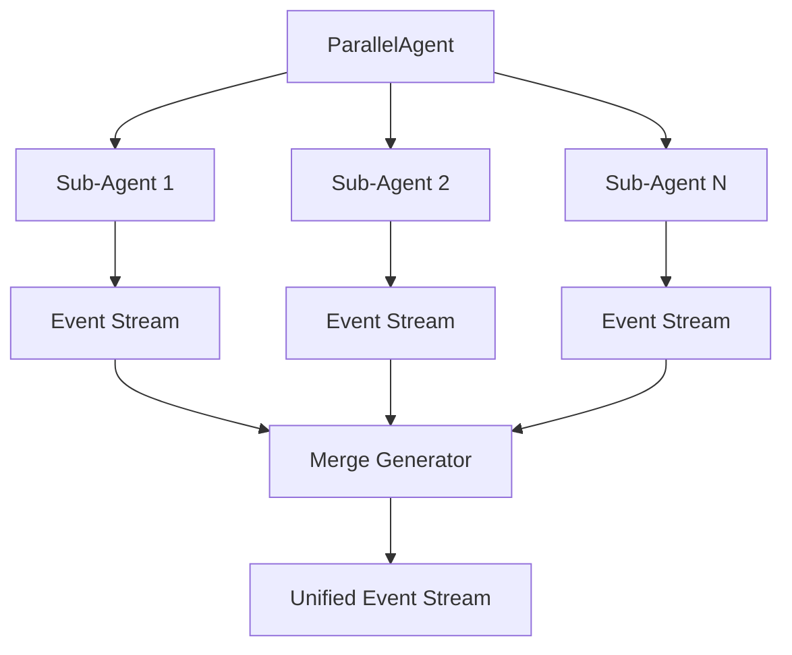
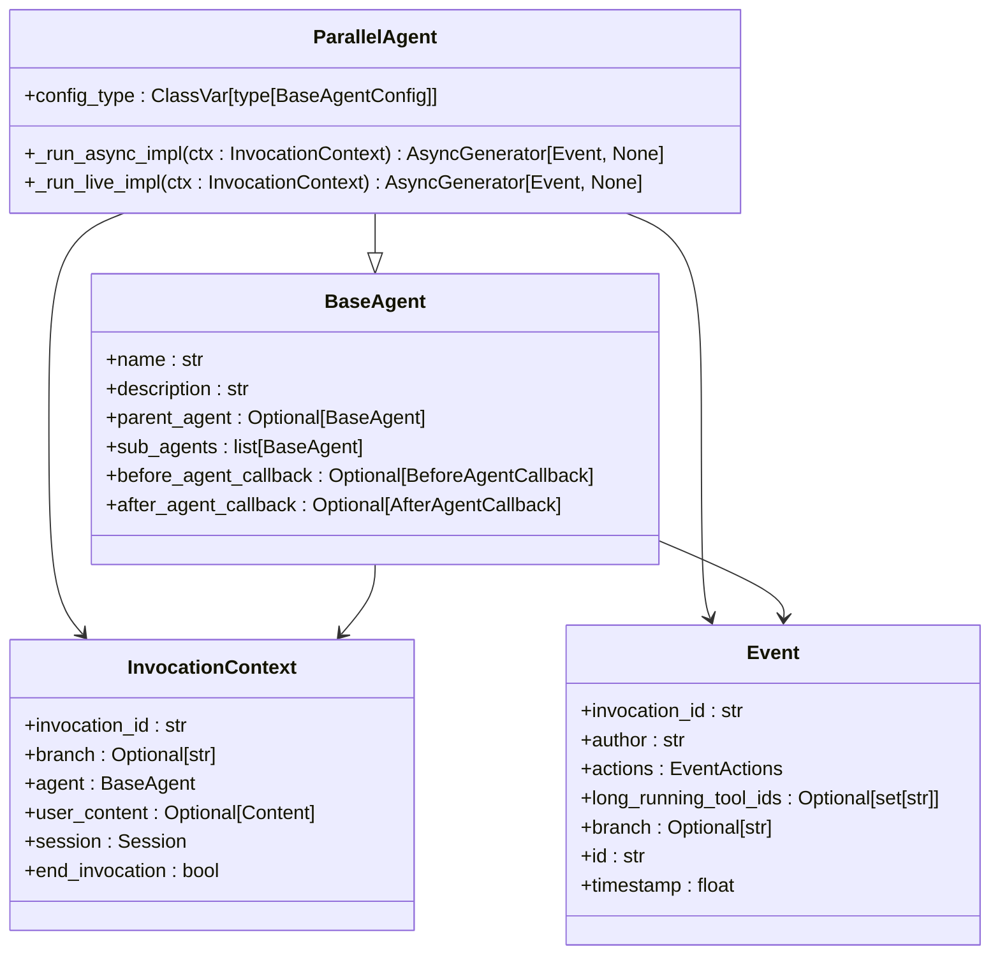
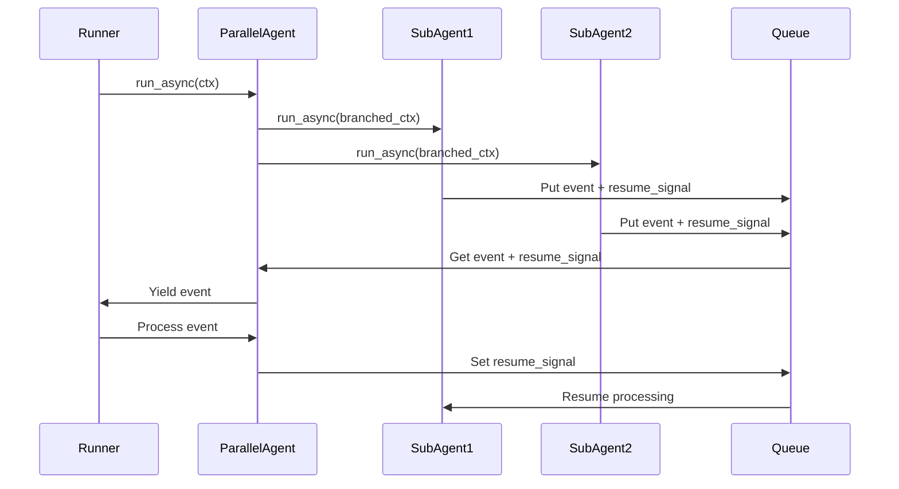
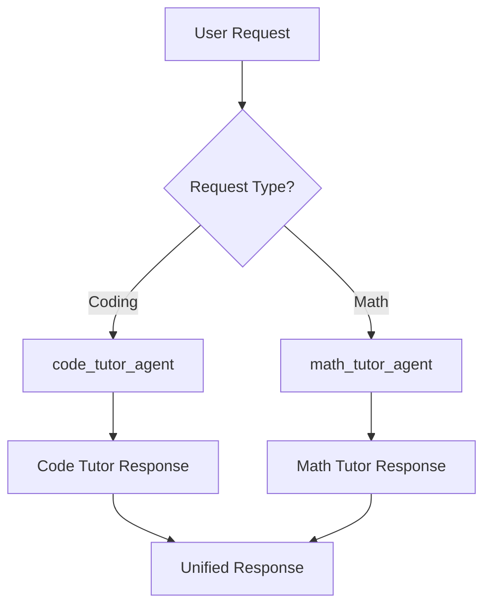

# Parallel Agent

<cite>
**Referenced Files in This Document**   
- [parallel_agent.py](file://src/google/adk/agents/parallel_agent.py)
- [parallel_agent_config.py](file://src/google/adk/agents/parallel_agent_config.py)
- [base_agent.py](file://src/google/adk/agents/base_agent.py)
- [invocation_context.py](file://src/google/adk/agents/invocation_context.py)
- [event.py](file://src/google/adk/events/event.py)
- [multi_agent_basic_config/root_agent.yaml](file://contributing/samples/multi_agent_basic_config/root_agent.yaml)
- [multi_agent_basic_config/math_tutor_agent.yaml](file://contributing/samples/multi_agent_basic_config/math_tutor_agent.yaml)
- [multi_agent_basic_config/code_tutor_agent.yaml](file://contributing/samples/multi_agent_basic_config/code_tutor_agent.yaml)
</cite>

## Table of Contents
1. [Introduction](#introduction)
2. [Architecture Overview](#architecture-overview)
3. [Core Components](#core-components)
4. [Domain Model of Concurrent Execution](#domain-model-of-concurrent-execution)
5. [Task Distribution Mechanisms](#task-distribution-mechanisms)
6. [Synchronization and Result Aggregation](#synchronization-and-result-aggregation)
7. [Configuration and Implementation](#configuration-and-implementation)
8. [Thread Safety and Resource Management](#thread-safety-and-resource-management)
9. [Common Issues and Best Practices](#common-issues-and-best-practices)
10. [Performance Optimization](#performance-optimization)

## Introduction

The ParallelAgent in the ADK framework enables concurrent execution of multiple sub-agents, allowing parallel processing of independent tasks. This architecture is particularly beneficial for scenarios requiring multiple perspectives or approaches on a single task, such as running different algorithms simultaneously or generating multiple responses for evaluation by a subsequent agent. The implementation leverages Python's asyncio framework to manage concurrent execution while maintaining isolation between sub-agents.

**Section sources**
- [parallel_agent.py](file://src/google/adk/agents/parallel_agent.py#L161-L169)

## Architecture Overview

The ParallelAgent operates as a shell agent that executes its sub-agents in parallel with isolated contexts. Each sub-agent runs independently, processing events through an asynchronous event generator pattern. The architecture ensures that sub-agents do not interfere with each other's execution while allowing for coordinated result aggregation.

**Diagram sources**
- [parallel_agent.py](file://src/google/adk/agents/parallel_agent.py#L161-L203)
- [base_agent.py](file://src/google/adk/agents/base_agent.py#L71-L200)

## Core Components

The ParallelAgent implementation consists of several key components that work together to enable concurrent execution. The core functionality is built around asynchronous generators that yield events from each sub-agent, which are then merged into a unified event stream. The implementation includes specialized functions for creating isolated execution contexts for each sub-agent and managing the lifecycle of parallel tasks.

The agent uses Python's asyncio.TaskGroup (for Python 3.11+) or a custom implementation for earlier versions to manage task cancellation and exception handling during parallel execution. This ensures proper cleanup of resources even when exceptions occur during concurrent processing.

**Section sources**
- [parallel_agent.py](file://src/google/adk/agents/parallel_agent.py#L161-L203)
- [parallel_agent_config.py](file://src/google/adk/agents/parallel_agent_config.py#L28-L42)

## Domain Model of Concurrent Execution

The domain model for concurrent execution in the ParallelAgent is based on isolated sub-agent execution with coordinated event merging. Each sub-agent receives a branched invocation context that isolates its execution path while maintaining lineage to the parent agent. The branching mechanism uses dot notation to track the execution path (e.g., "root_agent.math_tutor_agent").

The event-driven architecture processes events from all sub-agents through a central queue, ensuring that events are processed in a controlled manner. The implementation guarantees that each agent waits for its generated event to be processed by the upstream runner before generating new events, preventing overwhelming the event processing pipeline.

**Diagram sources**
- [parallel_agent.py](file://src/google/adk/agents/parallel_agent.py#L161-L203)
- [base_agent.py](file://src/google/adk/agents/base_agent.py#L71-L200)
- [invocation_context.py](file://src/google/adk/agents/invocation_context.py#L92-L221)
- [event.py](file://src/google/adk/events/event.py#L29-L140)

## Task Distribution Mechanisms

The ParallelAgent distributes tasks to sub-agents through a concurrent execution model where all sub-agents receive the same invocation context and process it in parallel. The task distribution is implicit rather than explicit - all sub-agents are invoked simultaneously when the ParallelAgent is executed.

Each sub-agent receives an isolated branch of the invocation context created by the `_create_branch_ctx_for_sub_agent` function, which appends the agent hierarchy to the branch path. This ensures that each sub-agent has a unique execution context while maintaining traceability to the original invocation.

The distribution mechanism does not perform load balancing or task routing based on sub-agent capabilities. Instead, it assumes that the agent hierarchy is designed such that each sub-agent is capable of processing the input, or will gracefully handle cases where the task is outside its domain.

**Section sources**
- [parallel_agent.py](file://src/google/adk/agents/parallel_agent.py#L34-L47)
- [parallel_agent.py](file://src/google/adk/agents/parallel_agent.py#L178-L183)

## Synchronization and Result Aggregation

The ParallelAgent implements a sophisticated synchronization mechanism to merge results from concurrent sub-agents. The `_merge_agent_run` function (and its pre-3.11 counterpart) coordinates the event streams from multiple sub-agents using an asyncio.Queue to collect events and ensure proper ordering.

The synchronization strategy includes:
- A sentinel object to mark when each sub-agent has completed processing
- Resume signals (asyncio.Event) to control the flow of events and prevent overwhelming the consumer
- Exception propagation from sub-agent tasks to maintain error transparency
- Proper cleanup of all tasks in the finally block to prevent resource leaks

Result aggregation occurs naturally through the merged event stream, where events from all sub-agents are interleaved based on their completion order. The implementation ensures that events are processed one at a time by the upstream runner, maintaining a consistent event processing order despite concurrent generation.

**Diagram sources**
- [parallel_agent.py](file://src/google/adk/agents/parallel_agent.py#L114-L159)
- [parallel_agent.py](file://src/google/adk/agents/parallel_agent.py#L50-L112)

## Configuration and Implementation

The ParallelAgent is configured through YAML files that define the agent hierarchy and sub-agent relationships. The configuration follows the AgentConfig.json schema and specifies the agent_class as "ParallelAgent". Sub-agents are defined in the configuration through the sub_agents list, with each entry specifying the config_path to the sub-agent's configuration file.

The multi_agent_basic_config sample demonstrates a practical implementation where a root agent delegates coding questions to a code_tutor_agent and math questions to a math_tutor_agent. The root_agent.yaml configuration defines the learning assistant that routes requests to specialized sub-agents based on the query content.

The implementation supports both Python 3.11+ (using asyncio.TaskGroup) and earlier versions (using a custom task management implementation), ensuring backward compatibility while taking advantage of modern Python features when available.

**Diagram sources**
- [multi_agent_basic_config/root_agent.yaml](file://contributing/samples/multi_agent_basic_config/root_agent.yaml#L1-L18)
- [multi_agent_basic_config/math_tutor_agent.yaml](file://contributing/samples/multi_agent_basic_config/math_tutor_agent.yaml#L1-L16)
- [multi_agent_basic_config/code_tutor_agent.yaml](file://contributing/samples/multi_agent_basic_config/code_tutor_agent.yaml#L1-L16)

## Thread Safety and Resource Management

The ParallelAgent implementation is designed with thread safety and proper resource management in mind. Since the framework uses asyncio for concurrency rather than threading, the primary concerns are around async resource management and preventing race conditions in shared state.

Key resource management features include:
- Use of AsyncContextManager (Aclosing) to ensure proper cleanup of async generators
- Task cancellation in finally blocks to prevent resource leaks
- Isolated invocation contexts for each sub-agent to prevent state contamination
- Proper exception handling and propagation to maintain execution integrity

The implementation avoids blocking operations that could interfere with the asyncio event loop, using await asyncio.sleep() instead of time.sleep() to ensure non-blocking delays. This prevents the Global Interpreter Lock (GIL) from being held unnecessarily and allows true parallel execution of async tasks.

**Section sources**
- [parallel_agent.py](file://src/google/adk/agents/parallel_agent.py#L194-L197)
- [context_utils.py](file://src/google/adk/utils/context_utils.py#L28-L50)

## Common Issues and Best Practices

When implementing ParallelAgent, several common issues should be addressed:

**Race Conditions**: Since sub-agents execute concurrently, care must be taken when accessing shared resources. Best practice is to maintain isolation between sub-agents and avoid shared mutable state.

**Load Balancing**: The current implementation does not include dynamic load balancing. Design sub-agent workloads to be roughly equivalent in processing time to prevent some agents from finishing significantly earlier than others.

**Partial Failures**: Sub-agents may fail independently. Implement robust error handling in the after_agent_callback to handle cases where some sub-agents succeed while others fail.

**Best Practices**:
- Design sub-agents to be stateless when possible
- Use the branch context to maintain execution lineage
- Implement timeout mechanisms for long-running sub-agents
- Monitor event queue sizes to prevent memory issues
- Test with various Python versions to ensure compatibility

**Section sources**
- [parallel_agent.py](file://src/google/adk/agents/parallel_agent.py#L50-L112)
- [parallel_agent.py](file://src/google/adk/agents/parallel_agent.py#L184-L197)

## Performance Optimization

To optimize ParallelAgent performance, consider the following strategies:

**Concurrency Optimization**: Ensure that sub-agent operations are truly asynchronous and non-blocking. Use await asyncio.sleep() instead of time.sleep() to prevent blocking the event loop.

**Event Flow Management**: The resume signal mechanism controls the flow of events from sub-agents to the consumer. This prevents overwhelming the event processing pipeline while maintaining high throughput.

**Resource Utilization**: Monitor the number of concurrent sub-agents, as excessive parallelism can lead to resource contention. The optimal number depends on the specific use case and system resources.

**Python Version Considerations**: Use Python 3.11+ when possible to take advantage of asyncio.TaskGroup for more efficient task management and better error handling.

The implementation demonstrates significant performance improvements for parallelizable tasks, with execution time approaching the duration of the longest-running sub-agent rather than the sum of all sub-agent durations.

**Section sources**
- [parallel_agent.py](file://src/google/adk/agents/parallel_agent.py#L114-L159)
- [parallel_agent.py](file://src/google/adk/agents/parallel_agent.py#L50-L112)