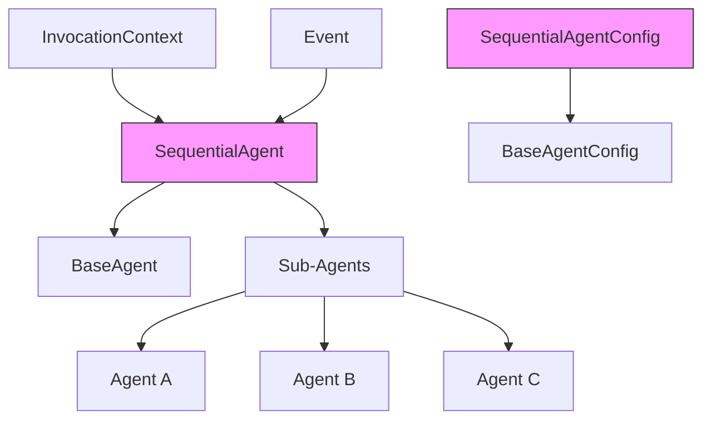
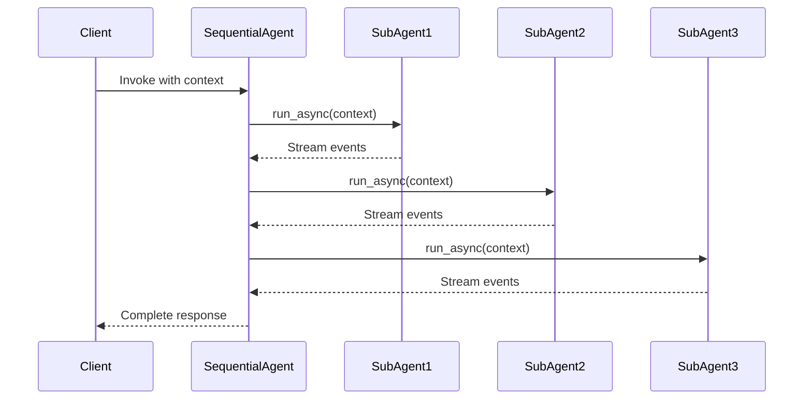
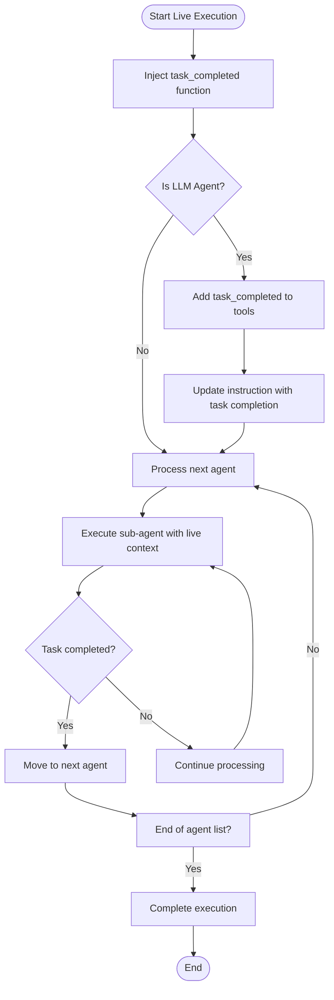
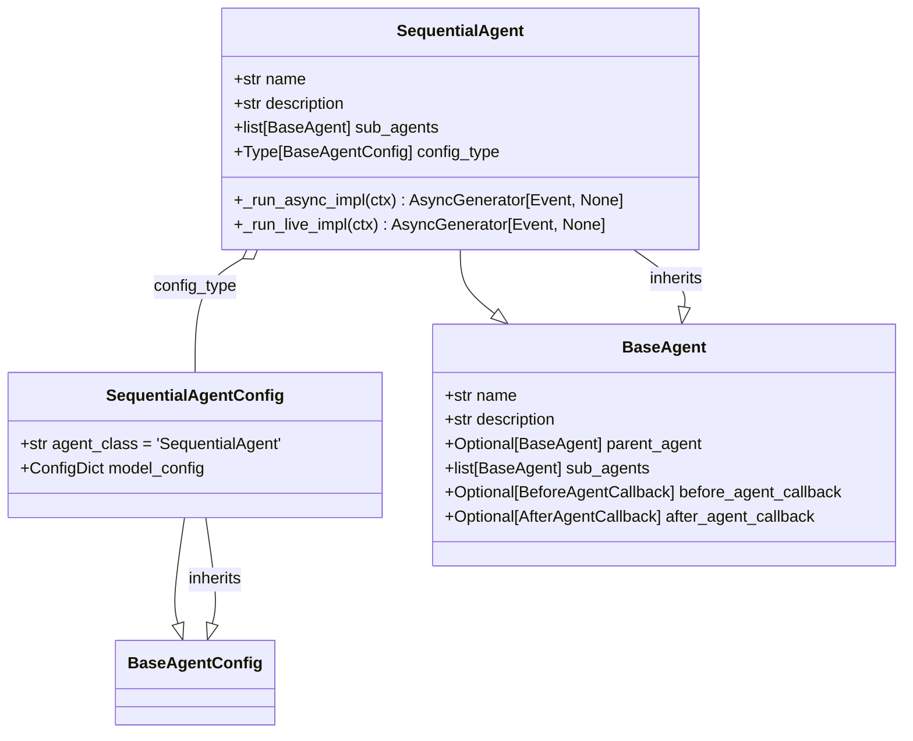
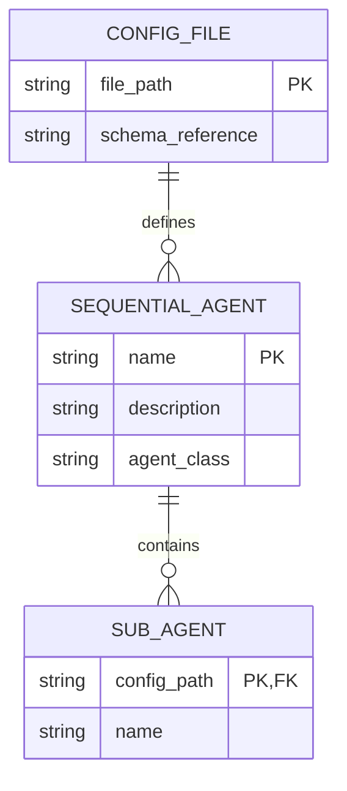
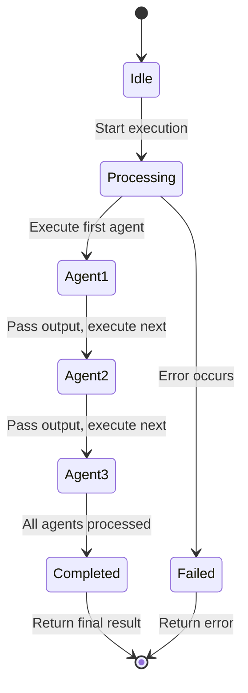

# Sequential Agent

<cite>
**Referenced Files in This Document**   
- [sequential_agent.py](file://src/google/adk/agents/sequential_agent.py)
- [sequential_agent_config.py](file://src/google/adk/agents/sequential_agent_config.py)
- [base_agent.py](file://src/google/adk/agents/base_agent.py)
- [non_llm_sequential/agent.py](file://contributing/samples/non_llm_sequential/agent.py)
- [spec_kit_integration/sequential_spec_kit_agent.py](file://contributing/samples/spec_kit_integration/sequential_spec_kit_agent.py)
- [multi_agent_basic_config/root_agent.yaml](file://contributing/samples/multi_agent_basic_config/root_agent.yaml)
</cite>

## Table of Contents
1. [Introduction](#introduction)
2. [Core Components](#core-components)
3. [Architecture Overview](#architecture-overview)
4. [Detailed Component Analysis](#detailed-component-analysis)
5. [Configuration and Implementation](#configuration-and-implementation)
6. [Domain Model and Control Flow](#domain-model-and-control-flow)
7. [Error Handling and Performance](#error-handling-and-performance)
8. [Best Practices](#best-practices)

## Introduction
The SequentialAgent in the ADK framework serves as a linear orchestrator that executes sub-agents in a predefined order, passing output from one agent to the next. This document provides comprehensive documentation on its implementation, interface, execution flow, and result aggregation mechanism. The SequentialAgent enables the creation of complex workflows by chaining specialized agents together in a sequential pipeline, making it ideal for multi-stage tasks such as code writing, review, and refactoring.

## Core Components

The SequentialAgent is built upon several core components that work together to enable sequential execution of sub-agents. The implementation extends the BaseAgent class and utilizes the SequentialAgentConfig for configuration. The agent processes each sub-agent in the defined order, ensuring that the output from one agent becomes the input context for the next. This linear execution model provides a predictable and controllable workflow for complex multi-agent scenarios.

**Section sources**
- [sequential_agent.py](file://src/google/adk/agents/sequential_agent.py#L34-L87)
- [base_agent.py](file://src/google/adk/agents/base_agent.py#L71-L200)

## Architecture Overview

**Diagram sources**
- [sequential_agent.py](file://src/google/adk/agents/sequential_agent.py#L34-L87)
- [sequential_agent_config.py](file://src/google/adk/agents/sequential_agent_config.py#L28-L42)

## Detailed Component Analysis

### SequentialAgent Implementation
The SequentialAgent implementation follows a straightforward linear execution pattern. For each sub-agent in the sequence, the agent invokes the sub-agent's run method and processes the resulting events before moving to the next agent in the chain. The implementation handles both asynchronous and live execution modes, with special considerations for live streaming scenarios where task completion must be explicitly signaled.

**Diagram sources**
- [sequential_agent.py](file://src/google/adk/agents/sequential_agent.py#L40-L87)

### Live Execution Flow
In live execution mode, the SequentialAgent implements a special mechanism to determine when a sub-agent has completed its task. Since live agents process continuous streams of audio or video, the agent cannot automatically determine completion. Instead, it injects a task_completed function into LLM agents, allowing them to explicitly signal when their task is finished and the next agent in the sequence should take over.

**Diagram sources**
- [sequential_agent.py](file://src/google/adk/agents/sequential_agent.py#L50-L87)

## Configuration and Implementation

### Interface and Initialization
The SequentialAgent interface is defined through its configuration class (SequentialAgentConfig) and base class inheritance. The agent is initialized with a name, optional description, and a list of sub-agents that will be executed in sequence. The configuration enforces the agent_class value as 'SequentialAgent' to ensure proper type identification within the framework.

**Diagram sources**
- [sequential_agent.py](file://src/google/adk/agents/sequential_agent.py#L34-L87)
- [sequential_agent_config.py](file://src/google/adk/agents/sequential_agent_config.py#L28-L42)

### YAML Configuration Example
The multi_agent_seq_config sample demonstrates how YAML configuration defines the agent pipeline for tasks like code writing, review, and refactoring. The configuration specifies the agent class, name, description, and the sequence of sub-agents to be executed. Each sub-agent can be referenced by configuration path, allowing for modular and reusable agent definitions.

**Diagram sources**
- [multi_agent_basic_config/root_agent.yaml](file://contributing/samples/multi_agent_basic_config/root_agent.yaml#L1-L18)

## Domain Model and Control Flow

### Sequential Control Flow
The domain model of sequential control flow in the ADK framework follows a strict linear progression where each agent in the sequence must complete before the next one begins. The control flow is managed through the invocation context, which maintains state and data across agent boundaries. This ensures that output from one agent is properly passed as input to the subsequent agent, creating a coherent workflow.

**Diagram sources**
- [sequential_agent.py](file://src/google/adk/agents/sequential_agent.py#L40-L48)

### State Management
State management between stages in the SequentialAgent is handled through the InvocationContext, which maintains shared data, session information, and execution state across all sub-agents in the sequence. The context ensures that each agent has access to the necessary information from previous agents while maintaining isolation when required.

**Section sources**
- [invocation_context.py](file://src/google/adk/agents/invocation_context.py#L92-L221)

## Error Handling and Performance

### Error Propagation Strategies
The SequentialAgent implements a fail-fast error propagation strategy where any error encountered during the execution of a sub-agent terminates the entire sequence. This approach ensures that invalid or incomplete results are not passed to subsequent agents, maintaining data integrity throughout the workflow. The error is propagated back through the event stream to the client for appropriate handling.

### Performance Bottlenecks
Potential performance bottlenecks in long sequential chains include cumulative latency from multiple agent invocations and data serialization overhead between stages. The framework mitigates these issues through efficient context management and asynchronous event streaming, allowing for overlapping processing where possible.

**Section sources**
- [sequential_agent.py](file://src/google/adk/agents/sequential_agent.py#L40-L87)
- [base_agent.py](file://src/google/adk/agents/base_agent.py#L71-L200)

## Best Practices

### Designing Robust Sequential Workflows
When designing sequential workflows, consider the following best practices:
- Ensure data schema compatibility between consecutive agents
- Implement appropriate error handling and recovery mechanisms
- Monitor performance metrics for long chains
- Use the live execution mode with explicit task completion signaling when processing streaming inputs
- Test individual agents thoroughly before integrating them into a sequence

The SequentialAgent provides a powerful mechanism for orchestrating complex multi-agent workflows in a predictable and controlled manner, making it an essential component of the ADK framework for building sophisticated AI applications.

**Section sources**
- [non_llm_sequential/agent.py](file://contributing/samples/non_llm_sequential/agent.py#L1-L38)
- [spec_kit_integration/sequential_spec_kit_agent.py](file://contributing/samples/spec_kit_integration/sequential_spec_kit_agent.py#L1-L87)