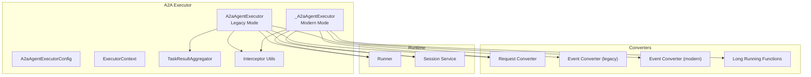
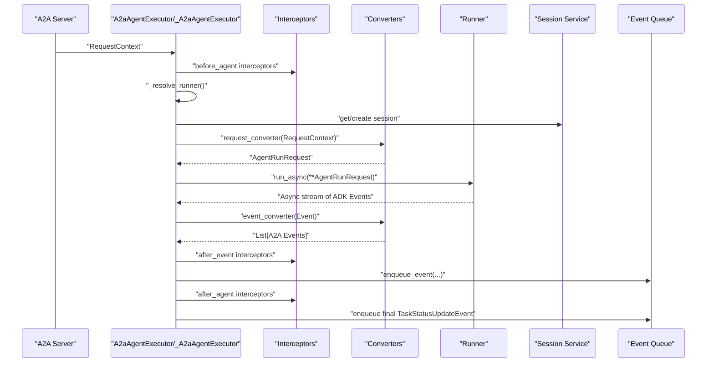
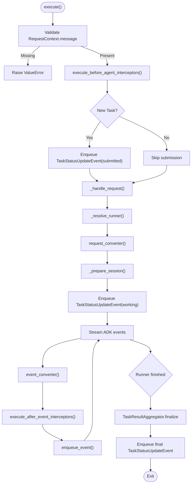
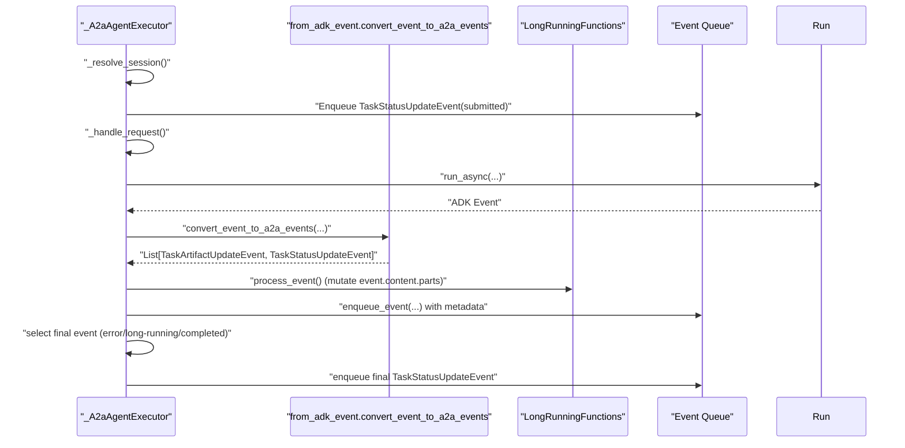
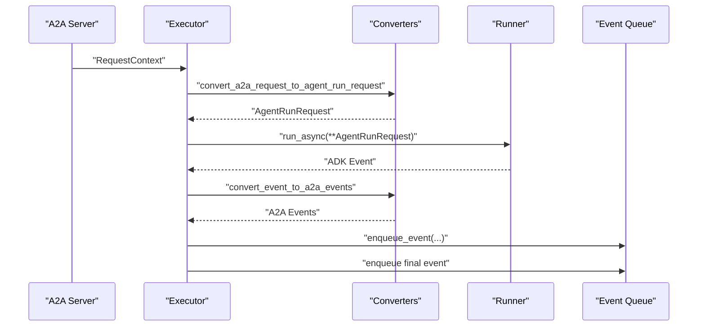
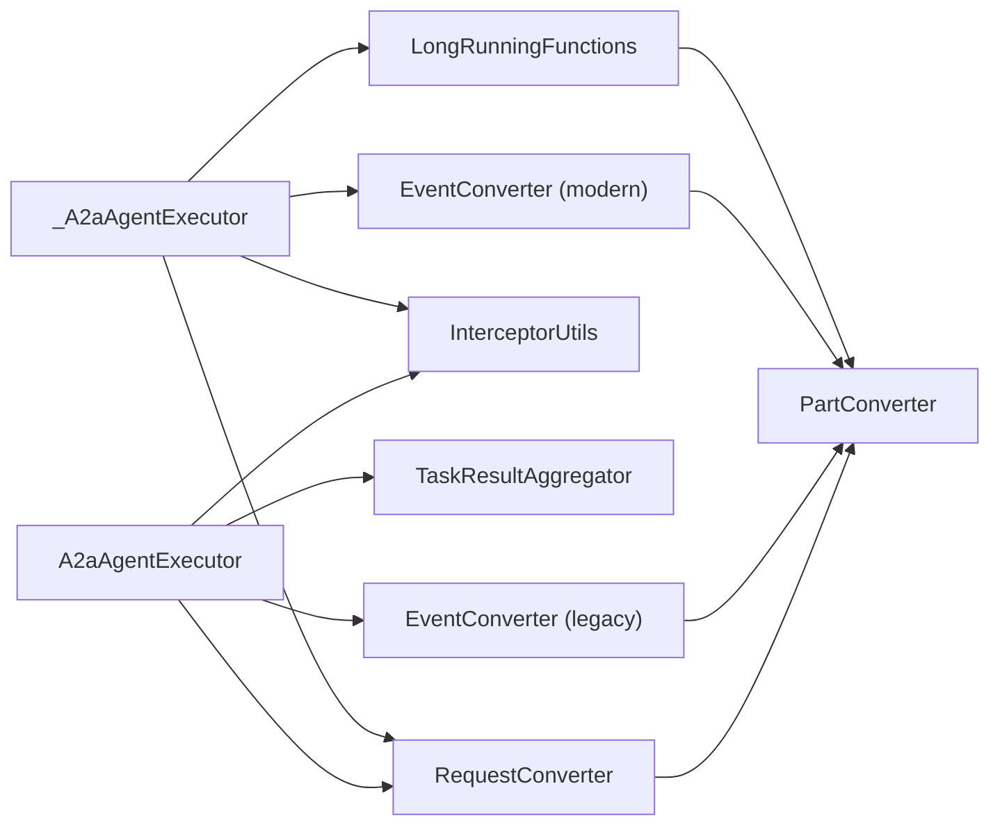
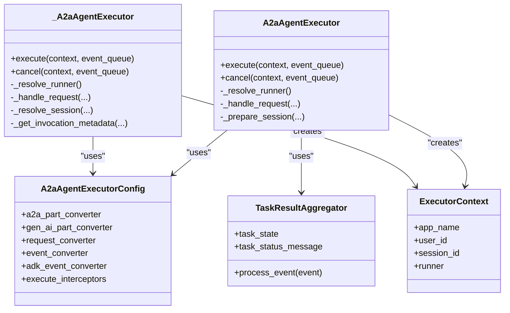

# A2A Agent Executor

<cite>
**Referenced Files in This Document**
- [a2a_agent_executor.py](file://src/google/adk/a2a/executor/a2a_agent_executor.py)
- [a2a_agent_executor_impl.py](file://src/google/adk/a2a/executor/a2a_agent_executor_impl.py)
- [config.py](file://src/google/adk/a2a/executor/config.py)
- [executor_context.py](file://src/google/adk/a2a/executor/executor_context.py)
- [task_result_aggregator.py](file://src/google/adk/a2a/executor/task_result_aggregator.py)
- [utils.py](file://src/google/adk/a2a/executor/utils.py)
- [request_converter.py](file://src/google/adk/a2a/converters/request_converter.py)
- [event_converter.py](file://src/google/adk/a2a/converters/event_converter.py)
- [from_adk_event.py](file://src/google/adk/a2a/converters/from_adk_event.py)
- [long_running_functions.py](file://src/google/adk/a2a/converters/long_running_functions.py)
- [remote_a2a_agent.py](file://src/google/adk/agents/remote_a2a_agent.py)
- [a2a_basic README.md](file://contributing/samples/a2a_basic/README.md)
</cite>

## Table of Contents
1. [Introduction](#introduction)
2. [Project Structure](#project-structure)
3. [Core Components](#core-components)
4. [Architecture Overview](#architecture-overview)
5. [Detailed Component Analysis](#detailed-component-analysis)
6. [Dependency Analysis](#dependency-analysis)
7. [Performance Considerations](#performance-considerations)
8. [Troubleshooting Guide](#troubleshooting-guide)
9. [Conclusion](#conclusion)
10. [Appendices](#appendices)

## Introduction
The A2A Agent Executor is the bridge between Agent Development Kit (ADK) agents and the Agent-to-Agent (A2A) protocol. It transforms incoming A2A requests into ADK agent invocations, streams ADK events through A2A-compatible event converters, and publishes updates to the A2A event queue. It supports both a legacy implementation path and a modern implementation path, with distinct event conversion strategies, long-running function handling, and interceptor mechanisms.

## Project Structure
The A2A Agent Executor resides under the A2A module’s executor package and collaborates with converters and utilities to translate between A2A and ADK domains. The executor integrates with the ADK runtime via a Runner abstraction, manages sessions, and emits A2A TaskStatusUpdateEvent and TaskArtifactUpdateEvent messages.

**Diagram sources**
- [a2a_agent_executor.py](file://src/google/adk/a2a/executor/a2a_agent_executor.py#L56-L341)
- [a2a_agent_executor_impl.py](file://src/google/adk/a2a/executor/a2a_agent_executor_impl.py#L57-L311)
- [config.py](file://src/google/adk/a2a/executor/config.py#L44-L108)
- [executor_context.py](file://src/google/adk/a2a/executor/executor_context.py#L20-L50)
- [task_result_aggregator.py](file://src/google/adk/a2a/executor/task_result_aggregator.py#L25-L72)
- [utils.py](file://src/google/adk/a2a/executor/utils.py#L28-L68)
- [request_converter.py](file://src/google/adk/a2a/converters/request_converter.py#L31-L118)
- [event_converter.py](file://src/google/adk/a2a/converters/event_converter.py#L62-L586)
- [from_adk_event.py](file://src/google/adk/a2a/converters/from_adk_event.py#L59-L289)
- [long_running_functions.py](file://src/google/adk/a2a/converters/long_running_functions.py#L45-L216)

**Section sources**
- [a2a_agent_executor.py](file://src/google/adk/a2a/executor/a2a_agent_executor.py#L56-L341)
- [a2a_agent_executor_impl.py](file://src/google/adk/a2a/executor/a2a_agent_executor_impl.py#L57-L311)
- [config.py](file://src/google/adk/a2a/executor/config.py#L44-L108)

## Core Components
- A2aAgentExecutor (legacy mode): Orchestrates execution flow, resolves runner, prepares session, converts A2A request to ADK run arguments, streams ADK events, applies interceptors, aggregates task results, and publishes A2A events.
- _A2aAgentExecutor (modern mode): Similar orchestration with modern event conversion, long-running function handling, and explicit metadata propagation.
- A2aAgentExecutorConfig: Holds converter functions and interceptor list; selects legacy vs modern event converter.
- ExecutorContext: Carries app/session/user identifiers and runner reference for interceptor usage.
- TaskResultAggregator: Tracks task state transitions and final status message for legacy mode.
- Interceptor Utilities: Execute hooks before agent start, after event emission, and after agent completion.

**Section sources**
- [a2a_agent_executor.py](file://src/google/adk/a2a/executor/a2a_agent_executor.py#L56-L341)
- [a2a_agent_executor_impl.py](file://src/google/adk/a2a/executor/a2a_agent_executor_impl.py#L57-L311)
- [config.py](file://src/google/adk/a2a/executor/config.py#L44-L108)
- [executor_context.py](file://src/google/adk/a2a/executor/executor_context.py#L20-L50)
- [task_result_aggregator.py](file://src/google/adk/a2a/executor/task_result_aggregator.py#L25-L72)
- [utils.py](file://src/google/adk/a2a/executor/utils.py#L28-L68)

## Architecture Overview
The executor sits between the A2A server and the ADK runtime. It receives an A2A RequestContext, optionally invokes pre-execution interceptors, resolves a Runner (supporting sync or async resolution), prepares or retrieves a session, converts the request to ADK arguments, runs the agent, converts each ADK event to A2A events, applies post-event interceptors, and enqueues them. Final events are computed differently in legacy vs modern modes.

**Diagram sources**
- [a2a_agent_executor.py](file://src/google/adk/a2a/executor/a2a_agent_executor.py#L117-L314)
- [a2a_agent_executor_impl.py](file://src/google/adk/a2a/executor/a2a_agent_executor_impl.py#L80-L255)
- [utils.py](file://src/google/adk/a2a/executor/utils.py#L28-L68)
- [request_converter.py](file://src/google/adk/a2a/converters/request_converter.py#L77-L118)
- [event_converter.py](file://src/google/adk/a2a/converters/event_converter.py#L532-L586)
- [from_adk_event.py](file://src/google/adk/a2a/converters/from_adk_event.py#L160-L228)

## Detailed Component Analysis

### A2aAgentExecutor (Legacy Mode)
Responsibilities:
- Initialization with runner, config, and use_legacy flag.
- Runner resolution supporting both Runner instances and callables (sync/async).
- Request validation and submission event emission for new tasks.
- Session preparation via Runner’s session service.
- Invocation context creation and working status publication.
- Streaming ADK events, applying after_event interceptors, and publishing A2A events.
- Task result aggregation and final event emission with artifact update fallback.
- Error handling with failure status publication.

Key behaviors:
- Uses legacy event converter pipeline.
- Aggregates task state via TaskResultAggregator.
- Emits TaskArtifactUpdateEvent for partial artifacts when appropriate.

**Diagram sources**
- [a2a_agent_executor.py](file://src/google/adk/a2a/executor/a2a_agent_executor.py#L117-L314)
- [task_result_aggregator.py](file://src/google/adk/a2a/executor/task_result_aggregator.py#L25-L72)
- [utils.py](file://src/google/adk/a2a/executor/utils.py#L28-L68)

**Section sources**
- [a2a_agent_executor.py](file://src/google/adk/a2a/executor/a2a_agent_executor.py#L56-L341)
- [task_result_aggregator.py](file://src/google/adk/a2a/executor/task_result_aggregator.py#L25-L72)

### _A2aAgentExecutor (Modern Mode)
Responsibilities:
- Runner resolution and session resolution.
- Submission and working status events for new or resuming tasks.
- Long-running function detection and user input validation.
- Modern event conversion pipeline emitting TaskArtifactUpdateEvent and TaskStatusUpdateEvent.
- Final event selection among error, long-running function call, or completed.

**Diagram sources**
- [a2a_agent_executor_impl.py](file://src/google/adk/a2a/executor/a2a_agent_executor_impl.py#L80-L255)
- [from_adk_event.py](file://src/google/adk/a2a/converters/from_adk_event.py#L160-L228)
- [long_running_functions.py](file://src/google/adk/a2a/converters/long_running_functions.py#L45-L216)

**Section sources**
- [a2a_agent_executor_impl.py](file://src/google/adk/a2a/executor/a2a_agent_executor_impl.py#L57-L311)
- [from_adk_event.py](file://src/google/adk/a2a/converters/from_adk_event.py#L159-L289)
- [long_running_functions.py](file://src/google/adk/a2a/converters/long_running_functions.py#L45-L216)

### Configuration Options and Modes
- use_legacy flag in A2aAgentExecutor toggles between legacy and modern implementation.
- A2aAgentExecutorConfig holds:
  - a2a_part_converter and gen_ai_part_converter for bidirectional content conversion.
  - request_converter for mapping RequestContext to AgentRunRequest.
  - event_converter (legacy) and adk_event_converter (modern) for ADK-to-A2A conversion.
  - execute_interceptors list enabling pre/post hooks.

Practical configuration examples:
- Custom converters: Replace default converters with domain-specific ones.
- Interceptors: Add before_agent, after_event, after_agent hooks for logging, filtering, or enrichment.
- Runner callable: Provide a factory that returns a Runner or coroutine returning a Runner.

**Section sources**
- [a2a_agent_executor.py](file://src/google/adk/a2a/executor/a2a_agent_executor.py#L68-L82)
- [config.py](file://src/google/adk/a2a/executor/config.py#L44-L108)

### Execution Flow: From A2A Request to ADK Agent Invocation to Event Publishing
- Request conversion: A2A RequestContext is transformed into AgentRunRequest using the configured request converter.
- Session preparation: The executor ensures a session exists and retrieves/creates it via Runner’s session service.
- Invocation context: ExecutorContext is constructed for downstream usage.
- Event streaming: ADK events are streamed and converted to A2A events; interceptors can mutate or drop events.
- Finalization: Legacy mode publishes artifact updates and a completed/final status; modern mode selects error, long-running, or completed.

**Diagram sources**
- [request_converter.py](file://src/google/adk/a2a/converters/request_converter.py#L77-L118)
- [event_converter.py](file://src/google/adk/a2a/converters/event_converter.py#L532-L586)
- [from_adk_event.py](file://src/google/adk/a2a/converters/from_adk_event.py#L160-L228)

**Section sources**
- [a2a_agent_executor.py](file://src/google/adk/a2a/executor/a2a_agent_executor.py#L190-L314)
- [a2a_agent_executor_impl.py](file://src/google/adk/a2a/executor/a2a_agent_executor_impl.py#L188-L255)

### Interceptor System
- before_agent: Modify or inspect RequestContext prior to execution.
- after_event: Mutate or drop A2A events; dropping returns None to halt further interceptors.
- after_agent: Inspect/modify the final TaskStatusUpdateEvent.

Execution order:
- before_agent: list
- after_event: list (early termination on None)
- after_agent: reversed list

**Section sources**
- [config.py](file://src/google/adk/a2a/executor/config.py#L44-L108)
- [utils.py](file://src/google/adk/a2a/executor/utils.py#L28-L68)

### Task Result Aggregation (Legacy Mode)
- Tracks highest-priority state: failed > auth_required > input_required > working.
- Preserves latest status message for working state.
- Forces all intermediate states to working for consistent aggregation.

**Section sources**
- [task_result_aggregator.py](file://src/google/adk/a2a/executor/task_result_aggregator.py#L25-L72)

### Session Preparation
- Retrieves session by app_name, user_id, session_id.
- Creates session if absent and updates AgentRunRequest.session_id accordingly.

**Section sources**
- [a2a_agent_executor.py](file://src/google/adk/a2a/executor/a2a_agent_executor.py#L315-L341)
- [a2a_agent_executor_impl.py](file://src/google/adk/a2a/executor/a2a_agent_executor_impl.py#L277-L300)

### Practical Examples
- Executor configuration:
  - Legacy mode: Instantiate A2aAgentExecutor with runner, config, and use_legacy=True.
  - Modern mode: Instantiate A2aAgentExecutor with use_legacy=False to use internal _A2aAgentExecutor.
- Session preparation:
  - Ensure Runner.session_service is configured; the executor will fetch or create sessions automatically.
- Error handling patterns:
  - Legacy mode: On exceptions, publishes a failed TaskStatusUpdateEvent and logs enqueue failures.
  - Modern mode: On exceptions, publishes a failed TaskStatusUpdateEvent and logs enqueue failures.

Note: The A2A Basic sample demonstrates remote agent integration and server setup, which complements executor usage in real deployments.

**Section sources**
- [a2a_agent_executor.py](file://src/google/adk/a2a/executor/a2a_agent_executor.py#L68-L116)
- [a2a_agent_executor_impl.py](file://src/google/adk/a2a/executor/a2a_agent_executor_impl.py#L74-L187)
- [a2a_basic README.md](file://contributing/samples/a2a_basic/README.md#L45-L154)

## Dependency Analysis
- A2aAgentExecutor depends on:
  - Runner for invocation and session management.
  - Config converters for request and event translation.
  - Interceptor utilities for pre/post hooks.
  - TaskResultAggregator for legacy finalization.
- _A2aAgentExecutor depends on:
  - Runner for invocation and session management.
  - Modern event converter and long-running function handler.
  - Interceptor utilities for pre/post hooks.
- Converters depend on:
  - Part converters for bidirectional content mapping.
  - Metadata utilities for cross-boundary propagation.

**Diagram sources**
- [a2a_agent_executor.py](file://src/google/adk/a2a/executor/a2a_agent_executor.py#L45-L51)
- [a2a_agent_executor_impl.py](file://src/google/adk/a2a/executor/a2a_agent_executor_impl.py#L48-L52)
- [config.py](file://src/google/adk/a2a/executor/config.py#L37-L41)
- [request_converter.py](file://src/google/adk/a2a/converters/request_converter.py#L37-L49)
- [event_converter.py](file://src/google/adk/a2a/converters/event_converter.py#L62-L87)
- [from_adk_event.py](file://src/google/adk/a2a/converters/from_adk_event.py#L59-L84)
- [long_running_functions.py](file://src/google/adk/a2a/converters/long_running_functions.py#L45-L54)

**Section sources**
- [a2a_agent_executor.py](file://src/google/adk/a2a/executor/a2a_agent_executor.py#L45-L51)
- [a2a_agent_executor_impl.py](file://src/google/adk/a2a/executor/a2a_agent_executor_impl.py#L48-L52)
- [config.py](file://src/google/adk/a2a/executor/config.py#L37-L41)

## Performance Considerations
- Streaming conversion: Converting and enqueuing events incrementally reduces latency and memory footprint.
- Interceptor overhead: Keep interceptors lightweight; avoid heavy synchronous operations inside after_event hooks.
- Long-running functions: The modern executor defers long-running tool responses to later user input; ensure clients handle input_required/auth_required states promptly.
- Runner resolution: If using a callable runner, cache the resolved Runner to avoid repeated resolution costs.

## Troubleshooting Guide
Common issues and resolutions:
- Missing RequestContext.message: Executor raises an error; ensure A2A requests include a message.
- Cancellation support: Legacy executor raises NotImplementedError for cancel(); modern executor also does not implement cancellation yet.
- Failure event publishing: If enqueue fails, executor logs the error; verify event queue availability and permissions.
- Remote agent integration: When integrating with RemoteA2aAgent, ensure agent card URLs are correct and reachable; confirm metadata propagation for executor version detection.

**Section sources**
- [a2a_agent_executor.py](file://src/google/adk/a2a/executor/a2a_agent_executor.py#L107-L116)
- [a2a_agent_executor_impl.py](file://src/google/adk/a2a/executor/a2a_agent_executor_impl.py#L74-L79)
- [remote_a2a_agent.py](file://src/google/adk/agents/remote_a2a_agent.py#L672-L676)

## Conclusion
The A2A Agent Executor provides a robust bridge between A2A protocol requirements and the ADK runtime. It supports both legacy and modern execution modes, offers flexible configuration via converters and interceptors, and manages session lifecycle and event publishing. By leveraging the modern event converter and long-running function handling, it aligns closely with evolving A2A semantics while maintaining compatibility with existing ADK agents.

## Appendices

### Class Relationships

**Diagram sources**
- [a2a_agent_executor.py](file://src/google/adk/a2a/executor/a2a_agent_executor.py#L56-L341)
- [a2a_agent_executor_impl.py](file://src/google/adk/a2a/executor/a2a_agent_executor_impl.py#L57-L311)
- [config.py](file://src/google/adk/a2a/executor/config.py#L44-L108)
- [executor_context.py](file://src/google/adk/a2a/executor/executor_context.py#L20-L50)
- [task_result_aggregator.py](file://src/google/adk/a2a/executor/task_result_aggregator.py#L25-L72)