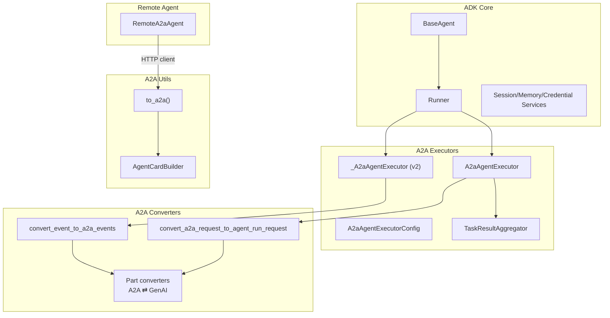
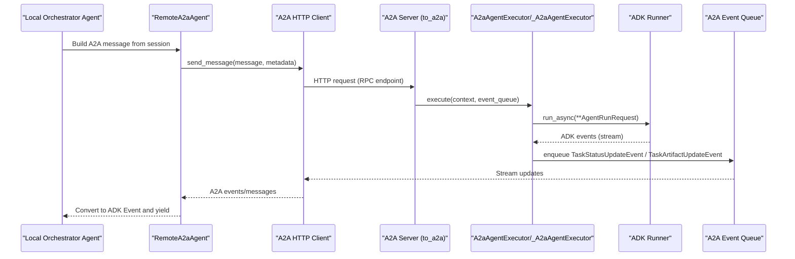
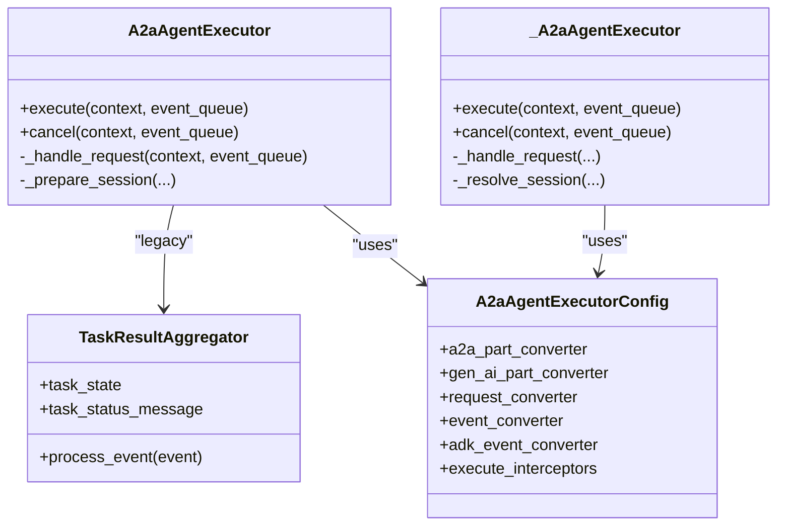
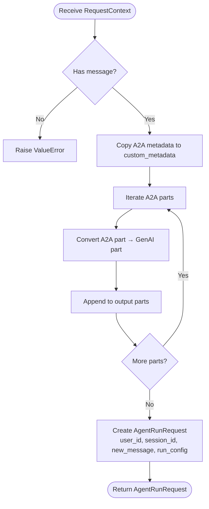
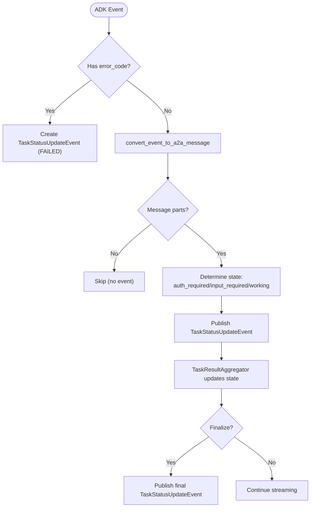
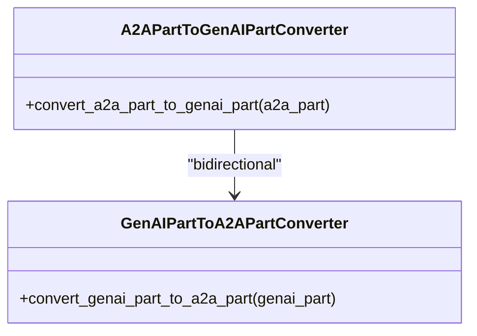
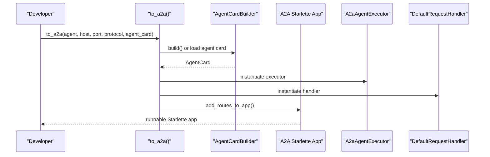
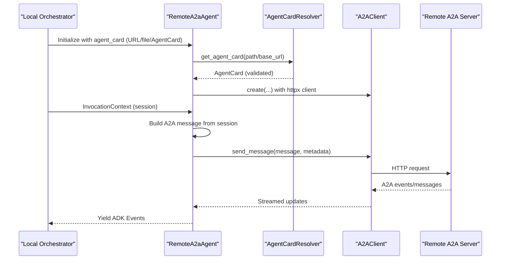
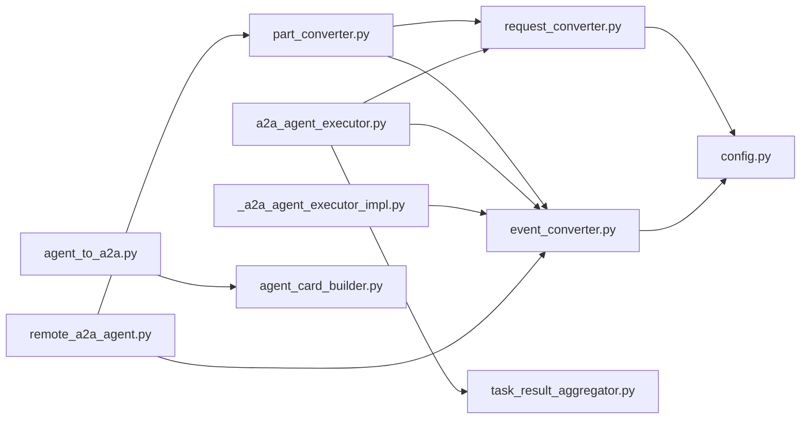

# Agent-to-Agent (A2A) Protocol

<cite>
**Referenced Files in This Document**
- [a2a_agent_executor.py](file://src/google/adk/a2a/executor/a2a_agent_executor.py)
- [a2a_agent_executor_impl.py](file://src/google/adk/a2a/executor/a2a_agent_executor_impl.py)
- [config.py](file://src/google/adk/a2a/executor/config.py)
- [task_result_aggregator.py](file://src/google/adk/a2a/executor/task_result_aggregator.py)
- [request_converter.py](file://src/google/adk/a2a/converters/request_converter.py)
- [event_converter.py](file://src/google/adk/a2a/converters/event_converter.py)
- [part_converter.py](file://src/google/adk/a2a/converters/part_converter.py)
- [agent_to_a2a.py](file://src/google/adk/a2a/utils/agent_to_a2a.py)
- [agent_card_builder.py](file://src/google/adk/a2a/utils/agent_card_builder.py)
- [remote_a2a_agent.py](file://src/google/adk/agents/remote_a2a_agent.py)
- [README.md (A2A Basic)](file://contributing/samples/a2a_basic/README.md)
- [README.md (A2A OAuth)](file://contributing/samples/a2a_auth/README.md)
</cite>

## Table of Contents
1. [Introduction](#introduction)
2. [Project Structure](#project-structure)
3. [Core Components](#core-components)
4. [Architecture Overview](#architecture-overview)
5. [Detailed Component Analysis](#detailed-component-analysis)
6. [Dependency Analysis](#dependency-analysis)
7. [Performance Considerations](#performance-considerations)
8. [Troubleshooting Guide](#troubleshooting-guide)
9. [Conclusion](#conclusion)
10. [Appendices](#appendices)

## Introduction
This document explains the Agent-to-Agent (A2A) protocol integration in the Agent Development Kit (ADK). It covers how ADK agents communicate with remote A2A agents, how events and messages are converted between ADK and A2A formats, and how to configure authentication and authorization for secure cross-agent interoperability. Practical examples demonstrate building A2A-enabled agents and orchestrating distributed agent systems across local and remote services.

## Project Structure
The A2A integration spans several modules:
- Executors: translate A2A requests into ADK runner invocations and stream ADK events back to A2A.
- Converters: transform A2A message parts and events into ADK-compatible structures and vice versa.
- Utilities: build agent cards and wrap an ADK agent into an A2A-compliant HTTP service.
- Remote agent: consume remote A2A agents from a local ADK orchestrator.

**Diagram sources**
- [a2a_agent_executor.py](file://src/google/adk/a2a/executor/a2a_agent_executor.py#L57-L341)
- [a2a_agent_executor_impl.py](file://src/google/adk/a2a/executor/a2a_agent_executor_impl.py#L58-L311)
- [config.py](file://src/google/adk/a2a/executor/config.py#L84-L108)
- [task_result_aggregator.py](file://src/google/adk/a2a/executor/task_result_aggregator.py#L25-L72)
- [request_converter.py](file://src/google/adk/a2a/converters/request_converter.py#L77-L118)
- [event_converter.py](file://src/google/adk/a2a/converters/event_converter.py#L532-L586)
- [part_converter.py](file://src/google/adk/a2a/converters/part_converter.py#L57-L303)
- [agent_to_a2a.py](file://src/google/adk/a2a/utils/agent_to_a2a.py#L75-L180)
- [agent_card_builder.py](file://src/google/adk/a2a/utils/agent_card_builder.py#L40-L96)
- [remote_a2a_agent.py](file://src/google/adk/agents/remote_a2a_agent.py#L107-L765)

**Section sources**
- [a2a_agent_executor.py](file://src/google/adk/a2a/executor/a2a_agent_executor.py#L57-L341)
- [a2a_agent_executor_impl.py](file://src/google/adk/a2a/executor/a2a_agent_executor_impl.py#L58-L311)
- [config.py](file://src/google/adk/a2a/executor/config.py#L84-L108)
- [task_result_aggregator.py](file://src/google/adk/a2a/executor/task_result_aggregator.py#L25-L72)
- [request_converter.py](file://src/google/adk/a2a/converters/request_converter.py#L77-L118)
- [event_converter.py](file://src/google/adk/a2a/converters/event_converter.py#L532-L586)
- [part_converter.py](file://src/google/adk/a2a/converters/part_converter.py#L57-L303)
- [agent_to_a2a.py](file://src/google/adk/a2a/utils/agent_to_a2a.py#L75-L180)
- [agent_card_builder.py](file://src/google/adk/a2a/utils/agent_card_builder.py#L40-L96)
- [remote_a2a_agent.py](file://src/google/adk/agents/remote_a2a_agent.py#L107-L765)

## Core Components
- A2A Agent Executor: Runs ADK agents in response to A2A requests, publishing task status and artifacts to an A2A event queue. Two implementations exist: a legacy executor and a newer v2 executor with improved long-running function handling and metadata propagation.
- Request Converter: Translates incoming A2A RequestContext into an AgentRunRequest suitable for the ADK Runner’s run_async method, including user/session/context mapping and metadata forwarding.
- Event Converter: Converts ADK events to A2A TaskStatusUpdateEvent and TaskArtifactUpdateEvent, handling error states, long-running tool calls, and human-in-the-loop or auth-required prompts.
- Part Converter: Bidirectional mapping between A2A parts (text, file, data/function-call/function-response/code-execution-result/executable-code) and GenAI parts, preserving metadata such as long-running flags and thought signatures.
- Agent-to-A2A Utility: Wraps an ADK agent into an A2A Starlette application with an AgentCard, task store, and request handler.
- Agent Card Builder: Builds an A2A AgentCard from an ADK agent, extracting skills, capabilities, and metadata.
- Remote A2A Agent: Consumes a remote A2A agent by resolving its AgentCard (URL or file), validating the RPC URL, and sending/receiving A2A messages via an HTTP client.

**Section sources**
- [a2a_agent_executor.py](file://src/google/adk/a2a/executor/a2a_agent_executor.py#L57-L341)
- [a2a_agent_executor_impl.py](file://src/google/adk/a2a/executor/a2a_agent_executor_impl.py#L58-L311)
- [request_converter.py](file://src/google/adk/a2a/converters/request_converter.py#L77-L118)
- [event_converter.py](file://src/google/adk/a2a/converters/event_converter.py#L532-L586)
- [part_converter.py](file://src/google/adk/a2a/converters/part_converter.py#L57-L303)
- [agent_to_a2a.py](file://src/google/adk/a2a/utils/agent_to_a2a.py#L75-L180)
- [agent_card_builder.py](file://src/google/adk/a2a/utils/agent_card_builder.py#L40-L96)
- [remote_a2a_agent.py](file://src/google/adk/agents/remote_a2a_agent.py#L107-L765)

## Architecture Overview
The A2A architecture enables seamless interoperability between local ADK agents and remote A2A services:
- Local orchestrator agents (including RemoteA2aAgent) send A2A messages to remote A2A servers.
- Remote A2A servers host ADK agents wrapped into A2A applications via to_a2a().
- Executors convert A2A requests to ADK runner invocations, stream ADK events, and publish A2A task updates.
- Converters ensure cross-format compatibility for messages, parts, and events.

**Diagram sources**
- [remote_a2a_agent.py](file://src/google/adk/agents/remote_a2a_agent.py#L597-L740)
- [a2a_agent_executor.py](file://src/google/adk/a2a/executor/a2a_agent_executor.py#L117-L314)
- [a2a_agent_executor_impl.py](file://src/google/adk/a2a/executor/a2a_agent_executor_impl.py#L80-L255)
- [agent_to_a2a.py](file://src/google/adk/a2a/utils/agent_to_a2a.py#L117-L179)

## Detailed Component Analysis

### A2A Agent Executor
The executor bridges A2A requests and ADK runner invocations:
- Legacy executor: Publishes task submitted/working/completed/failed events, aggregates final results, and supports interceptors.
- New v2 executor: Enhances long-running function handling, supports user-input prompts, and propagates invocation metadata.

**Diagram sources**
- [a2a_agent_executor.py](file://src/google/adk/a2a/executor/a2a_agent_executor.py#L57-L341)
- [a2a_agent_executor_impl.py](file://src/google/adk/a2a/executor/a2a_agent_executor_impl.py#L58-L311)
- [task_result_aggregator.py](file://src/google/adk/a2a/executor/task_result_aggregator.py#L25-L72)
- [config.py](file://src/google/adk/a2a/executor/config.py#L84-L108)

**Section sources**
- [a2a_agent_executor.py](file://src/google/adk/a2a/executor/a2a_agent_executor.py#L57-L341)
- [a2a_agent_executor_impl.py](file://src/google/adk/a2a/executor/a2a_agent_executor_impl.py#L58-L311)
- [task_result_aggregator.py](file://src/google/adk/a2a/executor/task_result_aggregator.py#L25-L72)
- [config.py](file://src/google/adk/a2a/executor/config.py#L84-L108)

### Request Conversion Mechanism
Incoming A2A RequestContext is transformed into an AgentRunRequest for the ADK Runner:
- Extracts user_id (from call context or context_id), session_id, and builds a Content with GenAI parts.
- Forwards A2A metadata to custom_metadata for downstream use.

**Diagram sources**
- [request_converter.py](file://src/google/adk/a2a/converters/request_converter.py#L77-L118)

**Section sources**
- [request_converter.py](file://src/google/adk/a2a/converters/request_converter.py#L77-L118)

### Event Conversion and Task State Handling
ADK events are converted to A2A events with appropriate task states:
- Error events mapped to FAILED with error metadata.
- Regular messages mapped to RUNNING; special handling for AUTH_REQUIRED and INPUT_REQUIRED based on long-running function metadata.
- Final event reflects completion or preserves latest artifact update.

**Diagram sources**
- [event_converter.py](file://src/google/adk/a2a/converters/event_converter.py#L532-L586)
- [task_result_aggregator.py](file://src/google/adk/a2a/executor/task_result_aggregator.py#L25-L72)

**Section sources**
- [event_converter.py](file://src/google/adk/a2a/converters/event_converter.py#L532-L586)
- [task_result_aggregator.py](file://src/google/adk/a2a/executor/task_result_aggregator.py#L25-L72)

### Part Conversion Between A2A and GenAI
Bidirectional conversion supports text, file, and structured data parts:
- A2A DataPart with metadata indicating function_call/function_response/code_execution_result/executable_code is reconstructed as GenAI parts.
- Thought metadata and signatures are preserved across conversions.

**Diagram sources**
- [part_converter.py](file://src/google/adk/a2a/converters/part_converter.py#L57-L303)

**Section sources**
- [part_converter.py](file://src/google/adk/a2a/converters/part_converter.py#L57-L303)

### Agent-to-A2A Application Wrapper
The to_a2a() utility wraps an ADK agent into an A2A-compliant HTTP application:
- Creates a Runner with in-memory services if not provided.
- Builds an AgentCard (or loads from file/JSON) and registers A2A routes.
- Supports push notification configuration store and custom host/port/protocol.

**Diagram sources**
- [agent_to_a2a.py](file://src/google/adk/a2a/utils/agent_to_a2a.py#L75-L180)
- [agent_card_builder.py](file://src/google/adk/a2a/utils/agent_card_builder.py#L71-L96)

**Section sources**
- [agent_to_a2a.py](file://src/google/adk/a2a/utils/agent_to_a2a.py#L75-L180)
- [agent_card_builder.py](file://src/google/adk/a2a/utils/agent_card_builder.py#L71-L96)

### Remote A2A Agent Consumption
RemoteA2aAgent resolves and validates an AgentCard, initializes an A2A client, and streams A2A responses back as ADK Events:
- Resolves AgentCard from URL or file; validates RPC URL.
- Constructs A2A messages from session history; supports context_id reuse for stateful agents.
- Handles both legacy and v2 response formats; attaches metadata for task/context correlation.

**Diagram sources**
- [remote_a2a_agent.py](file://src/google/adk/agents/remote_a2a_agent.py#L107-L765)

**Section sources**
- [remote_a2a_agent.py](file://src/google/adk/agents/remote_a2a_agent.py#L107-L765)

### Authentication and Authorization
- OAuth Authentication Sample demonstrates end-to-end OAuth flows between a local agent and a remote BigQuery A2A agent. The root agent guides users through OAuth and relays tokens to the remote agent for authenticated API access.
- AgentCardBuilder supports attaching security schemes and provider metadata to the A2A agent card.
- RemoteA2aAgent forwards request metadata and respects A2A task states for auth-required prompts.

Practical steps:
- Configure OAuth client credentials and scopes for the remote agent.
- Ensure the AgentCard URL points to the deployed A2A server.
- Use RemoteA2aAgent with a client factory to manage HTTP clients and transports.

**Section sources**
- [README.md (A2A OAuth)](file://contributing/samples/a2a_auth/README.md#L122-L217)
- [agent_card_builder.py](file://src/google/adk/a2a/utils/agent_card_builder.py#L40-L96)
- [remote_a2a_agent.py](file://src/google/adk/agents/remote_a2a_agent.py#L107-L765)

### Practical Examples
- A2A Basic Sample: Orchestrates a root agent delegating to a local sub-agent and a remote prime-checking agent hosted on a separate A2A server. Demonstrates local/remote integration and cross-service communication.
- A2A OAuth Sample: Multi-agent system with a local YouTube search agent and a remote BigQuery agent requiring OAuth. Shows human-in-the-loop and OAuth token exchange.

Setup highlights:
- Start the remote A2A server serving the remote agent on a dedicated port.
- Run the local ADK web server and interact with the root agent.
- Update the AgentCard URL to match the deployed A2A server endpoint.

**Section sources**
- [README.md (A2A Basic)](file://contributing/samples/a2a_basic/README.md#L45-L154)
- [README.md (A2A OAuth)](file://contributing/samples/a2a_auth/README.md#L45-L217)

## Dependency Analysis
Key dependencies and relationships:
- Executors depend on Runner and A2A event queue; they use converters and interceptors from the executor config.
- Converters depend on part converters and metadata utilities to preserve long-running and auth-related signals.
- Agent-to-A2A utility depends on AgentCardBuilder and A2A server components.
- RemoteA2aAgent depends on A2A client factories and converters to send/receive A2A messages.

**Diagram sources**
- [request_converter.py](file://src/google/adk/a2a/converters/request_converter.py#L77-L118)
- [event_converter.py](file://src/google/adk/a2a/converters/event_converter.py#L532-L586)
- [part_converter.py](file://src/google/adk/a2a/converters/part_converter.py#L57-L303)
- [a2a_agent_executor.py](file://src/google/adk/a2a/executor/a2a_agent_executor.py#L57-L341)
- [a2a_agent_executor_impl.py](file://src/google/adk/a2a/executor/a2a_agent_executor_impl.py#L58-L311)
- [task_result_aggregator.py](file://src/google/adk/a2a/executor/task_result_aggregator.py#L25-L72)
- [config.py](file://src/google/adk/a2a/executor/config.py#L84-L108)
- [agent_to_a2a.py](file://src/google/adk/a2a/utils/agent_to_a2a.py#L75-L180)
- [agent_card_builder.py](file://src/google/adk/a2a/utils/agent_card_builder.py#L71-L96)
- [remote_a2a_agent.py](file://src/google/adk/agents/remote_a2a_agent.py#L107-L765)

**Section sources**
- [config.py](file://src/google/adk/a2a/executor/config.py#L84-L108)
- [a2a_agent_executor.py](file://src/google/adk/a2a/executor/a2a_agent_executor.py#L57-L341)
- [a2a_agent_executor_impl.py](file://src/google/adk/a2a/executor/a2a_agent_executor_impl.py#L58-L311)
- [request_converter.py](file://src/google/adk/a2a/converters/request_converter.py#L77-L118)
- [event_converter.py](file://src/google/adk/a2a/converters/event_converter.py#L532-L586)
- [part_converter.py](file://src/google/adk/a2a/converters/part_converter.py#L57-L303)
- [agent_to_a2a.py](file://src/google/adk/a2a/utils/agent_to_a2a.py#L75-L180)
- [agent_card_builder.py](file://src/google/adk/a2a/utils/agent_card_builder.py#L71-L96)
- [remote_a2a_agent.py](file://src/google/adk/agents/remote_a2a_agent.py#L107-L765)

## Performance Considerations
- Streaming and batching: Prefer streaming A2A responses to reduce latency; handle partial artifact updates conservatively (only emit full chunks).
- Metadata propagation: Use invocation metadata to correlate tasks and sessions across executors and interceptors.
- Long-running functions: Detect long-running function calls and auth-required states to avoid premature completion events.
- Interceptors: Apply before/after interceptors judiciously to minimize overhead while enabling customization.
- Network efficiency: Reuse HTTP clients via client factories; tune timeouts and transport protocols per environment.

[No sources needed since this section provides general guidance]

## Troubleshooting Guide
Common issues and resolutions:
- Connectivity:
  - Ensure the local ADK web server runs on the expected port and the remote A2A server runs on the configured port.
  - Verify the AgentCard URL matches the deployed A2A server endpoint.
  - Check firewall and network policies for outbound/inbound traffic.
- Agent initialization:
  - Confirm the AgentCard is resolvable from URL or file and contains a valid RPC URL.
  - Validate that the remote A2A server is reachable and responds to requests.
- Authentication:
  - For OAuth flows, confirm client credentials and redirect URIs are correctly configured.
  - Ensure the remote agent supports the required scopes and the user has access to target resources.
- Protocol compatibility:
  - If receiving unknown response types, verify the remote agent uses the same A2A SDK version and transport protocol.
  - Check that request metadata includes expected keys for executor v2 features.

**Section sources**
- [README.md (A2A Basic)](file://contributing/samples/a2a_basic/README.md#L140-L154)
- [README.md (A2A OAuth)](file://contributing/samples/a2a_auth/README.md#L190-L217)
- [remote_a2a_agent.py](file://src/google/adk/agents/remote_a2a_agent.py#L273-L333)

## Conclusion
The A2A integration in ADK provides a robust framework for cross-platform agent interoperability. By leveraging executors, converters, and utilities, developers can build distributed agent systems that combine local orchestration with remote A2A services. Proper configuration of authentication, network settings, and performance tuning ensures reliable and scalable deployments.

[No sources needed since this section summarizes without analyzing specific files]

## Appendices
- Example setup commands and URLs are documented in the A2A sample READMEs.
- For advanced customization, adjust executor interceptors, part converters, and request/response converters via the executor configuration.

**Section sources**
- [README.md (A2A Basic)](file://contributing/samples/a2a_basic/README.md#L45-L154)
- [README.md (A2A OAuth)](file://contributing/samples/a2a_auth/README.md#L45-L217)
- [config.py](file://src/google/adk/a2a/executor/config.py#L84-L108)