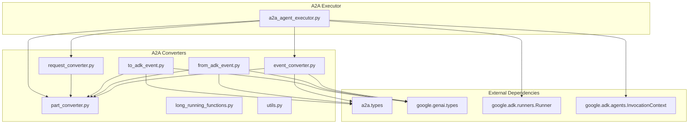
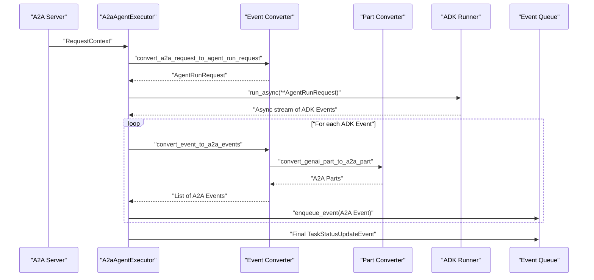
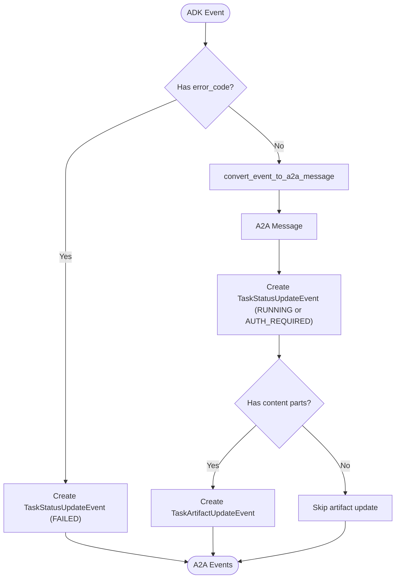
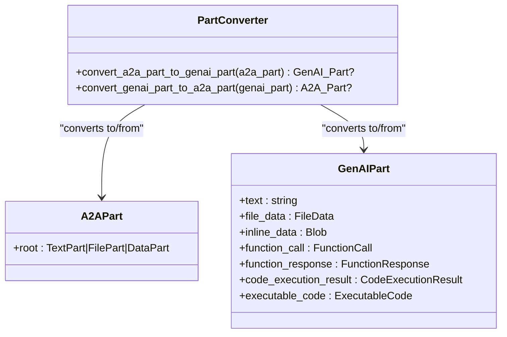
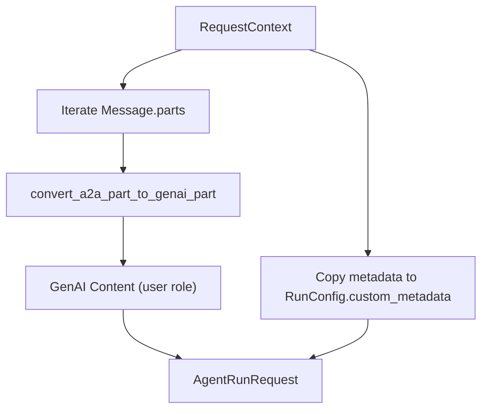
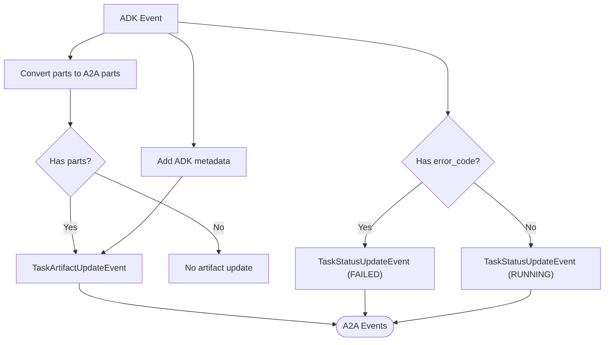
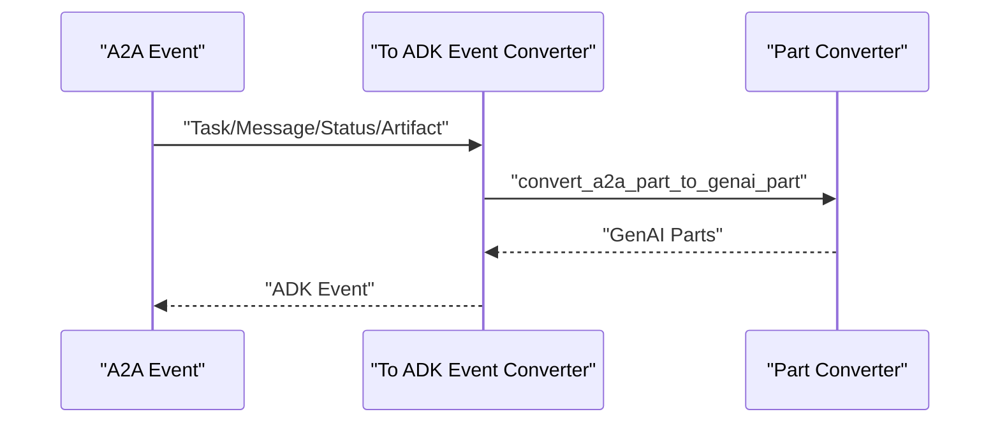
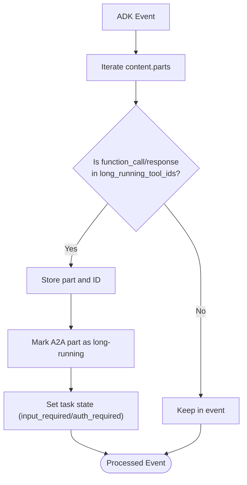
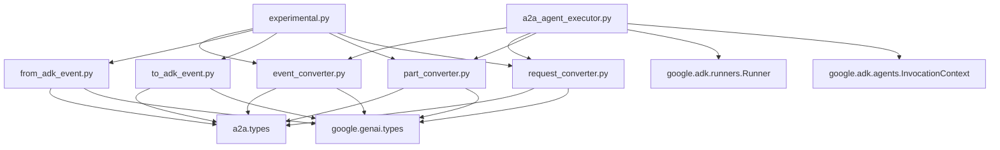

# Protocol Conversion System

<cite>
**Referenced Files in This Document**
- [from_adk_event.py](file://src/google/adk/a2a/converters/from_adk_event.py)
- [to_adk_event.py](file://src/google/adk/a2a/converters/to_adk_event.py)
- [part_converter.py](file://src/google/adk/a2a/converters/part_converter.py)
- [event_converter.py](file://src/google/adk/a2a/converters/event_converter.py)
- [request_converter.py](file://src/google/adk/a2a/converters/request_converter.py)
- [long_running_functions.py](file://src/google/adk/a2a/converters/long_running_functions.py)
- [utils.py](file://src/google/adk/a2a/converters/utils.py)
- [a2a_agent_executor.py](file://src/google/adk/a2a/executor/a2a_agent_executor.py)
- [experimental.py](file://src/google/adk/a2a/experimental.py)
- [README.md](file://README.md)
</cite>

## Table of Contents
1. [Introduction](#introduction)
2. [Project Structure](#project-structure)
3. [Core Components](#core-components)
4. [Architecture Overview](#architecture-overview)
5. [Detailed Component Analysis](#detailed-component-analysis)
6. [Dependency Analysis](#dependency-analysis)
7. [Performance Considerations](#performance-considerations)
8. [Troubleshooting Guide](#troubleshooting-guide)
9. [Conclusion](#conclusion)

## Introduction
This document describes the Agent2Agent (A2A) protocol conversion system within the Agent Development Kit (ADK) Python framework. The system enables bidirectional conversion between ADK internal events and A2A protocol messages, facilitating seamless integration with external A2A-compliant servers. It covers:
- Event converter architecture for transforming ADK events into A2A-compatible formats and vice versa
- Request and response conversion processes, including parameter mapping and data transformation logic
- Part converter system for handling different content types and media formats
- Utilities for maintaining protocol compatibility and metadata handling
- Practical examples, error handling strategies, and performance optimization techniques

## Project Structure
The A2A conversion system is organized into focused modules:
- Converters: Event, part, request, and utility conversion logic
- Executor: Orchestrates A2A agent execution and event publishing
- Experimental: Decorator for marking experimental A2A features

**Diagram sources**
- [event_converter.py](file://src/google/adk/a2a/converters/event_converter.py#L1-L586)
- [part_converter.py](file://src/google/adk/a2a/converters/part_converter.py#L1-L303)
- [request_converter.py](file://src/google/adk/a2a/converters/request_converter.py#L1-L118)
- [from_adk_event.py](file://src/google/adk/a2a/converters/from_adk_event.py#L1-L289)
- [to_adk_event.py](file://src/google/adk/a2a/converters/to_adk_event.py#L1-L375)
- [long_running_functions.py](file://src/google/adk/a2a/converters/long_running_functions.py#L1-L216)
- [utils.py](file://src/google/adk/a2a/converters/utils.py#L1-L92)
- [a2a_agent_executor.py](file://src/google/adk/a2a/executor/a2a_agent_executor.py#L1-L341)

**Section sources**
- [README.md](file://README.md#L85-L90)

## Core Components
- Event Converter: Bidirectional conversion between ADK Event and A2A Message/Task, including status and artifact updates
- Part Converter: Handles conversion between A2A Part and GenAI Part, supporting text, file, data, function call/response, and code execution parts
- Request Converter: Translates A2A RequestContext into ADK AgentRunRequest for the runner
- From ADK Event: Converts ADK Event to A2A TaskArtifactUpdateEvent and TaskStatusUpdateEvent
- To ADK Event: Converts A2A Task/Message/Status/Artifact updates back to ADK Event
- Long Running Functions: Manages long-running function calls and related responses
- Utilities: Metadata key prefixing and context ID mapping helpers

**Section sources**
- [event_converter.py](file://src/google/adk/a2a/converters/event_converter.py#L62-L87)
- [part_converter.py](file://src/google/adk/a2a/converters/part_converter.py#L48-L54)
- [request_converter.py](file://src/google/adk/a2a/converters/request_converter.py#L31-L61)
- [from_adk_event.py](file://src/google/adk/a2a/converters/from_adk_event.py#L59-L84)
- [to_adk_event.py](file://src/google/adk/a2a/converters/to_adk_event.py#L43-L125)
- [long_running_functions.py](file://src/google/adk/a2a/converters/long_running_functions.py#L45-L55)
- [utils.py](file://src/google/adk/a2a/converters/utils.py#L22-L36)

## Architecture Overview
The A2A conversion system operates as follows:
- A2A Agent Executor receives an A2A RequestContext and converts it to an AgentRunRequest
- The runner executes the agent and yields ADK Events
- Each ADK Event is converted to A2A events (status and/or artifact updates)
- A2A events are published to the A2A event queue
- On completion, a final A2A status update is published

**Diagram sources**
- [a2a_agent_executor.py](file://src/google/adk/a2a/executor/a2a_agent_executor.py#L118-L313)
- [event_converter.py](file://src/google/adk/a2a/converters/event_converter.py#L533-L585)
- [part_converter.py](file://src/google/adk/a2a/converters/part_converter.py#L177-L302)
- [request_converter.py](file://src/google/adk/a2a/converters/request_converter.py#L78-L117)

## Detailed Component Analysis

### Event Converter
The event converter provides bidirectional conversion between ADK Event and A2A Message/Task:
- convert_event_to_a2a_message: Converts ADK Event content to A2A Message
- convert_a2a_message_to_event: Converts A2A Message to ADK Event
- convert_event_to_a2a_events: Produces TaskStatusUpdateEvent and TaskArtifactUpdateEvent
- convert_a2a_task_to_event: Extracts message/history/status from A2A Task and converts to ADK Event
- Context metadata handling and long-running tool detection

**Diagram sources**
- [event_converter.py](file://src/google/adk/a2a/converters/event_converter.py#L533-L585)
- [event_converter.py](file://src/google/adk/a2a/converters/event_converter.py#L372-L417)
- [event_converter.py](file://src/google/adk/a2a/converters/event_converter.py#L420-L465)

**Section sources**
- [event_converter.py](file://src/google/adk/a2a/converters/event_converter.py#L202-L266)
- [event_converter.py](file://src/google/adk/a2a/converters/event_converter.py#L269-L368)
- [event_converter.py](file://src/google/adk/a2a/converters/event_converter.py#L371-L417)
- [event_converter.py](file://src/google/adk/a2a/converters/event_converter.py#L533-L585)

### Part Converter
The part converter handles conversion between A2A Part and GenAI Part:
- convert_a2a_part_to_genai_part: Supports TextPart, FilePart (URI/bytes), DataPart (function_call, function_response, code_execution_result, executable_code), and inline data fallback
- convert_genai_part_to_a2a_part: Mirrors the above, with special handling for video metadata and inline data wrapping
- Metadata keys for long-running functions and function types

**Diagram sources**
- [part_converter.py](file://src/google/adk/a2a/converters/part_converter.py#L57-L173)
- [part_converter.py](file://src/google/adk/a2a/converters/part_converter.py#L176-L302)

**Section sources**
- [part_converter.py](file://src/google/adk/a2a/converters/part_converter.py#L57-L173)
- [part_converter.py](file://src/google/adk/a2a/converters/part_converter.py#L176-L302)

### Request Converter
Translates A2A RequestContext into ADK AgentRunRequest:
- Extracts user/session identifiers and constructs RunConfig
- Converts A2A Message parts to GenAI Content using the part converter
- Provides a strongly typed AgentRunRequest model

**Diagram sources**
- [request_converter.py](file://src/google/adk/a2a/converters/request_converter.py#L78-L117)

**Section sources**
- [request_converter.py](file://src/google/adk/a2a/converters/request_converter.py#L31-L61)
- [request_converter.py](file://src/google/adk/a2a/converters/request_converter.py#L78-L117)

### From ADK Event Converter
Converts ADK Event to A2A TaskArtifactUpdateEvent and TaskStatusUpdateEvent:
- Converts Event content parts to A2A parts
- Manages artifact IDs and append semantics for partial events
- Adds ADK metadata to A2A events
- Creates error status events when ADK Event has error_code

**Diagram sources**
- [from_adk_event.py](file://src/google/adk/a2a/converters/from_adk_event.py#L160-L227)
- [from_adk_event.py](file://src/google/adk/a2a/converters/from_adk_event.py#L125-L156)

**Section sources**
- [from_adk_event.py](file://src/google/adk/a2a/converters/from_adk_event.py#L59-L84)
- [from_adk_event.py](file://src/google/adk/a2a/converters/from_adk_event.py#L160-L227)
- [from_adk_event.py](file://src/google/adk/a2a/converters/from_adk_event.py#L125-L156)

### To ADK Event Converter
Converts A2A Task/Message/Status/Artifact updates back to ADK Event:
- convert_a2a_task_to_event: Extracts message/artifacts/status and converts to ADK Event
- convert_a2a_message_to_event: Converts A2A Message to ADK Event
- convert_a2a_status_update_to_event: Converts A2A Status Update to ADK Event
- convert_a2a_artifact_update_to_event: Converts A2A Artifact Update to ADK Event
- Detects long-running function IDs and sets partial flag for artifact chunks

**Diagram sources**
- [to_adk_event.py](file://src/google/adk/a2a/converters/to_adk_event.py#L202-L257)
- [to_adk_event.py](file://src/google/adk/a2a/converters/to_adk_event.py#L261-L295)
- [to_adk_event.py](file://src/google/adk/a2a/converters/to_adk_event.py#L299-L337)
- [to_adk_event.py](file://src/google/adk/a2a/converters/to_adk_event.py#L342-L374)

**Section sources**
- [to_adk_event.py](file://src/google/adk/a2a/converters/to_adk_event.py#L43-L125)
- [to_adk_event.py](file://src/google/adk/a2a/converters/to_adk_event.py#L202-L257)
- [to_adk_event.py](file://src/google/adk/a2a/converters/to_adk_event.py#L261-L295)
- [to_adk_event.py](file://src/google/adk/a2a/converters/to_adk_event.py#L299-L337)
- [to_adk_event.py](file://src/google/adk/a2a/converters/to_adk_event.py#L342-L374)

### Long Running Functions
Manages long-running function calls and responses:
- Tracks function_call/function_response IDs associated with long-running tools
- Marks A2A parts as long-running and sets task state appropriately
- Validates user-provided function responses when awaiting input

**Diagram sources**
- [long_running_functions.py](file://src/google/adk/a2a/converters/long_running_functions.py#L60-L93)
- [long_running_functions.py](file://src/google/adk/a2a/converters/long_running_functions.py#L139-L163)

**Section sources**
- [long_running_functions.py](file://src/google/adk/a2a/converters/long_running_functions.py#L45-L94)
- [long_running_functions.py](file://src/google/adk/a2a/converters/long_running_functions.py#L139-L163)

### Utilities
- Metadata key prefixing: Ensures A2A metadata keys are prefixed consistently
- Context ID mapping: Converts between ADK and A2A context ID formats

**Section sources**
- [utils.py](file://src/google/adk/a2a/converters/utils.py#L22-L36)
- [utils.py](file://src/google/adk/a2a/converters/utils.py#L39-L91)

## Dependency Analysis
Key dependencies and relationships:
- Converters depend on A2A types (Message, Task, Part, etc.) and GenAI types (Content, Part, etc.)
- Executor depends on converters and runner to orchestrate execution and event publishing
- Long-running function handling integrates with both converters and executor
- Experimental decorator marks A2A components as experimental

**Diagram sources**
- [event_converter.py](file://src/google/adk/a2a/converters/event_converter.py#L26-L51)
- [from_adk_event.py](file://src/google/adk/a2a/converters/from_adk_event.py#L29-L49)
- [to_adk_event.py](file://src/google/adk/a2a/converters/to_adk_event.py#L24-L38)
- [part_converter.py](file://src/google/adk/a2a/converters/part_converter.py#L29-L33)
- [request_converter.py](file://src/google/adk/a2a/converters/request_converter.py#L21-L28)
- [a2a_agent_executor.py](file://src/google/adk/a2a/executor/a2a_agent_executor.py#L25-L49)
- [experimental.py](file://src/google/adk/a2a/experimental.py#L19-L30)

**Section sources**
- [event_converter.py](file://src/google/adk/a2a/converters/event_converter.py#L26-L51)
- [from_adk_event.py](file://src/google/adk/a2a/converters/from_adk_event.py#L29-L49)
- [to_adk_event.py](file://src/google/adk/a2a/converters/to_adk_event.py#L24-L38)
- [part_converter.py](file://src/google/adk/a2a/converters/part_converter.py#L29-L33)
- [request_converter.py](file://src/google/adk/a2a/converters/request_converter.py#L21-L28)
- [a2a_agent_executor.py](file://src/google/adk/a2a/executor/a2a_agent_executor.py#L25-L49)
- [experimental.py](file://src/google/adk/a2a/experimental.py#L19-L30)

## Performance Considerations
- Streaming conversion: The executor streams ADK events and publishes A2A updates incrementally, minimizing latency
- Partial artifact handling: Uses append semantics and last_chunk flags to efficiently stream large artifacts
- Long-running function batching: Accumulates function calls/responses and marks them for downstream processing
- Metadata serialization: Uses efficient serialization with fallbacks to avoid blocking on complex metadata
- Error handling: Graceful degradation by skipping unconvertible parts and continuing with remaining parts

[No sources needed since this section provides general guidance]

## Troubleshooting Guide
Common issues and resolutions:
- Unsupported part types: Some A2A/Data parts may not map directly to GenAI parts; the converters log warnings and skip unsupported parts
- Missing message in A2A Task: When converting A2A Task to ADK Event, if no message is available, a minimal Event is created
- Long-running function validation: If awaiting user input, ensure function responses are provided; otherwise, a status update is published indicating missing responses
- Metadata serialization failures: Converters fall back to string serialization when model_dump fails

**Section sources**
- [part_converter.py](file://src/google/adk/a2a/converters/part_converter.py#L168-L173)
- [event_converter.py](file://src/google/adk/a2a/converters/event_converter.py#L295-L298)
- [long_running_functions.py](file://src/google/adk/a2a/converters/long_running_functions.py#L166-L215)

## Conclusion
The A2A protocol conversion system provides a robust, extensible bridge between ADK and A2A protocols. Its modular design separates concerns across event, part, request, and executor layers, enabling high-throughput, reliable conversions while preserving metadata and handling edge cases gracefully. The experimental decorator signals ongoing evolution, and the system’s architecture supports future enhancements as the A2A protocol matures.