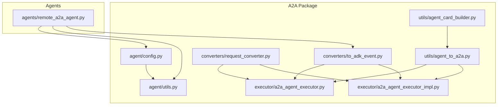
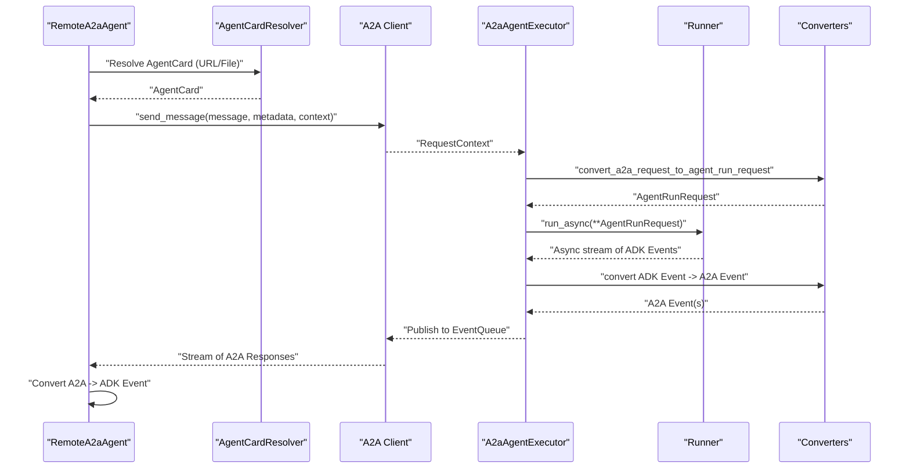
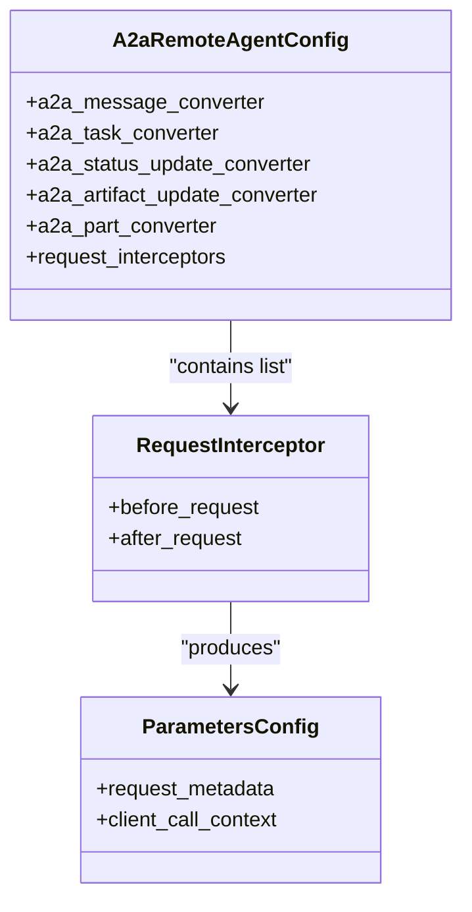
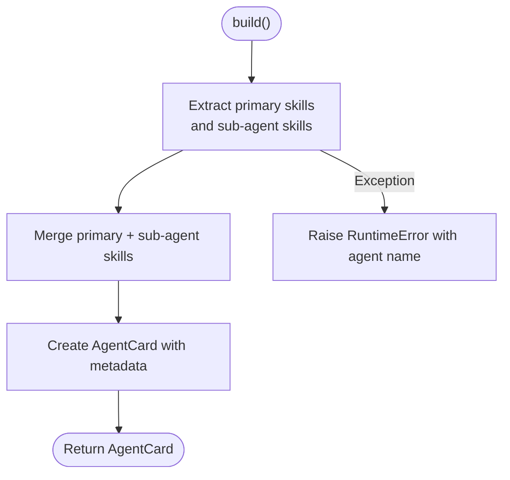
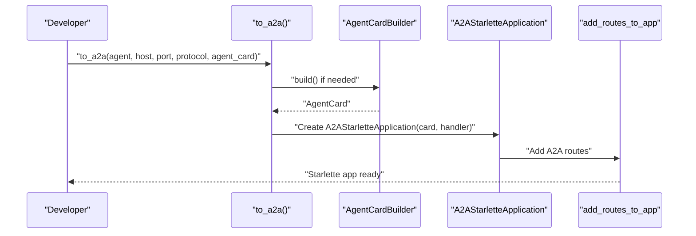
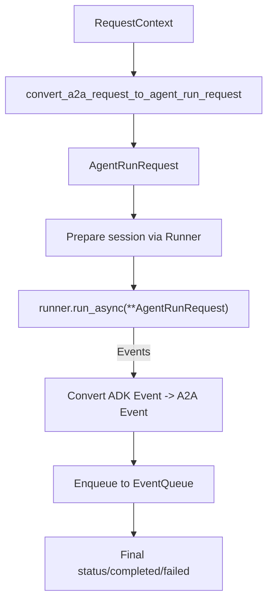
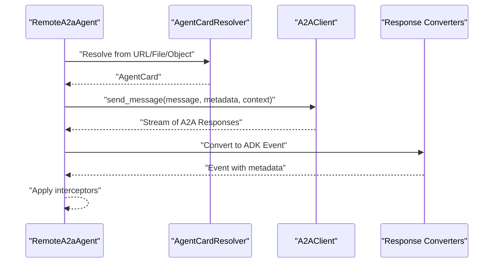
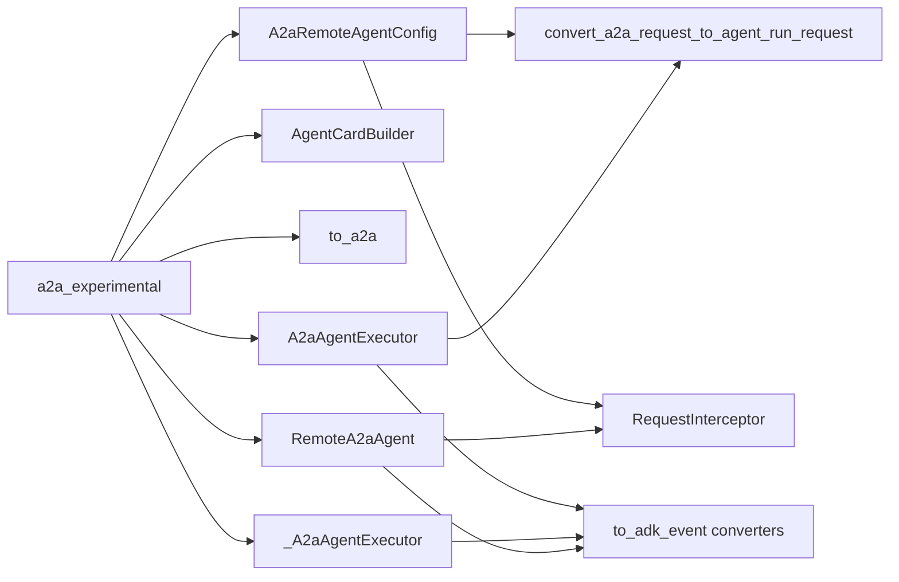

# Remote Agent Communication

<cite>
**Referenced Files in This Document**
- [experimental.py](file://src/google/adk/a2a/experimental.py)
- [agent/__init__.py](file://src/google/adk/a2a/agent/__init__.py)
- [agent/config.py](file://src/google/adk/a2a/agent/config.py)
- [agent/utils.py](file://src/google/adk/a2a/agent/utils.py)
- [utils/agent_card_builder.py](file://src/google/adk/a2a/utils/agent_card_builder.py)
- [utils/agent_to_a2a.py](file://src/google/adk/a2a/utils/agent_to_a2a.py)
- [executor/a2a_agent_executor.py](file://src/google/adk/a2a/executor/a2a_agent_executor.py)
- [executor/a2a_agent_executor_impl.py](file://src/google/adk/a2a/executor/a2a_agent_executor_impl.py)
- [converters/request_converter.py](file://src/google/adk/a2a/converters/request_converter.py)
- [converters/to_adk_event.py](file://src/google/adk/a2a/converters/to_adk_event.py)
- [agents/remote_a2a_agent.py](file://src/google/adk/agents/remote_a2a_agent.py)
</cite>

## Table of Contents
1. [Introduction](#introduction)
2. [Project Structure](#project-structure)
3. [Core Components](#core-components)
4. [Architecture Overview](#architecture-overview)
5. [Detailed Component Analysis](#detailed-component-analysis)
6. [Dependency Analysis](#dependency-analysis)
7. [Performance Considerations](#performance-considerations)
8. [Troubleshooting Guide](#troubleshooting-guide)
9. [Conclusion](#conclusion)

## Introduction
This document explains how the ADK enables remote agent communication within the A2A framework. It covers how to configure ADK agents to communicate with external A2A-compliant agents and services, how to build portable agent descriptors (Agent Cards), and how to leverage experimental A2A features. It also documents authentication and authorization patterns for secure interactions, practical examples for setting up remote connections, handling network failures, implementing retries, and best practices for distributed agent orchestration.

## Project Structure
The A2A-related functionality is organized primarily under the a2a package and integrates with the agents and runners subsystems:
- a2a/agent: Remote agent configuration and request interception hooks
- a2a/utils: Utilities for building Agent Cards and converting agents to A2A servers
- a2a/executor: Executors that run ADK agents in response to A2A requests
- a2a/converters: Converters between A2A types and ADK events/content
- agents/remote_a2a_agent.py: Client-side agent that talks to remote A2A agents

**Diagram sources**
- [agent/config.py](file://src/google/adk/a2a/agent/config.py#L82-L111)
- [agent/utils.py](file://src/google/adk/a2a/agent/utils.py#L32-L71)
- [utils/agent_card_builder.py](file://src/google/adk/a2a/utils/agent_card_builder.py#L40-L96)
- [utils/agent_to_a2a.py](file://src/google/adk/a2a/utils/agent_to_a2a.py#L75-L180)
- [executor/a2a_agent_executor.py](file://src/google/adk/a2a/executor/a2a_agent_executor.py#L56-L341)
- [executor/a2a_agent_executor_impl.py](file://src/google/adk/a2a/executor/a2a_agent_executor_impl.py#L57-L311)
- [converters/request_converter.py](file://src/google/adk/a2a/converters/request_converter.py#L31-L118)
- [converters/to_adk_event.py](file://src/google/adk/a2a/converters/to_adk_event.py#L202-L375)
- [agents/remote_a2a_agent.py](file://src/google/adk/agents/remote_a2a_agent.py#L107-L765)

**Section sources**
- [agent/__init__.py](file://src/google/adk/a2a/agent/__init__.py#L17-L25)
- [experimental.py](file://src/google/adk/a2a/experimental.py#L19-L30)

## Core Components
- Remote agent configuration and interceptors:
  - A2aRemoteAgentConfig defines converters from A2A messages/tasks/status/artifact updates to ADK Events and supports request interceptors.
  - RequestInterceptor exposes before_request and after_request hooks to mutate or abort requests and filter/sanitize responses.
- Agent Card Builder:
  - Builds portable AgentCard descriptors from ADK agents, aggregating skills, capabilities, and metadata.
- A2A-to-Agent conversion:
  - Converts A2A request context into an AgentRunRequest for the ADK runner.
  - Converts A2A events/messages into ADK Events for downstream consumption.
- A2A Executors:
  - A2aAgentExecutor orchestrates session creation, request conversion, agent execution, and event publishing to A2A event queues.
- Remote A2A Agent:
  - Client-side agent that resolves AgentCards, manages HTTP clients, sends A2A messages, and converts responses to ADK Events.

**Section sources**
- [agent/config.py](file://src/google/adk/a2a/agent/config.py#L44-L111)
- [agent/utils.py](file://src/google/adk/a2a/agent/utils.py#L32-L71)
- [utils/agent_card_builder.py](file://src/google/adk/a2a/utils/agent_card_builder.py#L40-L96)
- [converters/request_converter.py](file://src/google/adk/a2a/converters/request_converter.py#L31-L118)
- [converters/to_adk_event.py](file://src/google/adk/a2a/converters/to_adk_event.py#L202-L375)
- [executor/a2a_agent_executor.py](file://src/google/adk/a2a/executor/a2a_agent_executor.py#L56-L341)
- [agents/remote_a2a_agent.py](file://src/google/adk/agents/remote_a2a_agent.py#L107-L765)

## Architecture Overview
The A2A architecture connects remote clients to A2A-compliant servers via Agent Cards and typed conversions. Two execution paths exist:
- Local A2A server: ADK agents are wrapped into an A2A Starlette app with an AgentCard and request handler.
- Remote A2A client: An ADK agent acts as a client to a remote A2A agent using an AgentCard.

**Diagram sources**
- [agents/remote_a2a_agent.py](file://src/google/adk/agents/remote_a2a_agent.py#L597-L740)
- [converters/request_converter.py](file://src/google/adk/a2a/converters/request_converter.py#L77-L118)
- [executor/a2a_agent_executor.py](file://src/google/adk/a2a/executor/a2a_agent_executor.py#L118-L341)
- [converters/to_adk_event.py](file://src/google/adk/a2a/converters/to_adk_event.py#L202-L375)

## Detailed Component Analysis

### Remote Agent Configuration and Interceptors
- A2aRemoteAgentConfig centralizes:
  - Converters for A2A Message, Task, StatusUpdate, and ArtifactUpdate to ADK Events
  - Low-level part converter for A2A parts to GenAI parts
  - Optional list of RequestInterceptor instances
- RequestInterceptor supports:
  - before_request(ctx, a2a_request) returning either an Event (abort) or modified A2AMessage and ParametersConfig
  - after_request(ctx, a2a_response, event) returning None to suppress emission or a possibly modified Event

**Diagram sources**
- [agent/config.py](file://src/google/adk/a2a/agent/config.py#L44-L111)

**Section sources**
- [agent/config.py](file://src/google/adk/a2a/agent/config.py#L44-L111)
- [agent/utils.py](file://src/google/adk/a2a/agent/utils.py#L32-L71)

### Agent Card Builder
- Builds a portable AgentCard from an ADK agent, including:
  - Skills derived from LLM instructions/examples/tools/planner/code-executor
  - Sub-agent orchestration skills aggregated with tags
  - Capabilities, provider, doc URL, RPC URL, version, and security schemes
- Handles exceptions and raises runtime errors with agent name context

**Diagram sources**
- [utils/agent_card_builder.py](file://src/google/adk/a2a/utils/agent_card_builder.py#L71-L96)

**Section sources**
- [utils/agent_card_builder.py](file://src/google/adk/a2a/utils/agent_card_builder.py#L40-L96)

### Converting Agents to A2A Servers
- to_a2a wraps an ADK agent into a Starlette app:
  - Creates an A2A Starlette application with a DefaultRequestHandler
  - Uses an in-memory task store and optional push notification config store
  - Optionally loads an AgentCard from a file or object; otherwise builds one
  - Configures startup to add A2A routes to the app

**Diagram sources**
- [utils/agent_to_a2a.py](file://src/google/adk/a2a/utils/agent_to_a2a.py#L75-L180)
- [utils/agent_card_builder.py](file://src/google/adk/a2a/utils/agent_card_builder.py#L71-L96)

**Section sources**
- [utils/agent_to_a2a.py](file://src/google/adk/a2a/utils/agent_to_a2a.py#L75-L180)

### A2A Request Conversion and Execution
- convert_a2a_request_to_agent_run_request:
  - Extracts user_id, session_id, constructs Content from A2A parts via part converter
  - Attaches custom metadata for A2A
- A2aAgentExecutor:
  - Validates presence of message
  - Emits submitted/working status events
  - Resolves Runner, prepares session, creates InvocationContext
  - Streams ADK Events, converts to A2A events, enqueues to EventQueue
  - Publishes final status/completed or failed events

**Diagram sources**
- [converters/request_converter.py](file://src/google/adk/a2a/converters/request_converter.py#L77-L118)
- [executor/a2a_agent_executor.py](file://src/google/adk/a2a/executor/a2a_agent_executor.py#L118-L341)
- [converters/to_adk_event.py](file://src/google/adk/a2a/converters/to_adk_event.py#L202-L375)

**Section sources**
- [converters/request_converter.py](file://src/google/adk/a2a/converters/request_converter.py#L31-L118)
- [executor/a2a_agent_executor.py](file://src/google/adk/a2a/executor/a2a_agent_executor.py#L56-L341)
- [executor/a2a_agent_executor_impl.py](file://src/google/adk/a2a/executor/a2a_agent_executor_impl.py#L57-L311)

### Remote A2A Agent
- Supports three ways to specify a remote agent:
  - AgentCard object
  - URL to agent card JSON
  - File path to agent card JSON
- Resolves AgentCard, validates RPC URL, initializes A2A client
- Constructs A2A message parts from session events, optionally resuming from a remote context_id
- Sends A2A messages and converts responses to ADK Events, attaching metadata for task/context IDs
- Provides before/after request interceptors and backward-compatible request meta provider

**Diagram sources**
- [agents/remote_a2a_agent.py](file://src/google/adk/agents/remote_a2a_agent.py#L107-L765)
- [converters/to_adk_event.py](file://src/google/adk/a2a/converters/to_adk_event.py#L202-L375)

**Section sources**
- [agents/remote_a2a_agent.py](file://src/google/adk/agents/remote_a2a_agent.py#L107-L765)

## Dependency Analysis
- Experimental labeling:
  - a2a_experimental decorator marks A2A components as experimental with a standardized warning message
- Internal dependencies:
  - Remote agent config depends on converters for A2A-to-ADK transformations
  - Executors depend on converters and Runner for execution
  - Remote agent depends on converters and interceptors for request/response handling
- External dependencies:
  - a2a client/server types and middleware
  - httpx for HTTP client management in remote agent
  - Starlette/A2A server app for local A2A server

**Diagram sources**
- [experimental.py](file://src/google/adk/a2a/experimental.py#L19-L30)
- [agent/config.py](file://src/google/adk/a2a/agent/config.py#L82-L111)
- [utils/agent_card_builder.py](file://src/google/adk/a2a/utils/agent_card_builder.py#L40-L96)
- [utils/agent_to_a2a.py](file://src/google/adk/a2a/utils/agent_to_a2a.py#L75-L180)
- [executor/a2a_agent_executor.py](file://src/google/adk/a2a/executor/a2a_agent_executor.py#L56-L341)
- [executor/a2a_agent_executor_impl.py](file://src/google/adk/a2a/executor/a2a_agent_executor_impl.py#L57-L311)
- [agents/remote_a2a_agent.py](file://src/google/adk/agents/remote_a2a_agent.py#L107-L765)

**Section sources**
- [experimental.py](file://src/google/adk/a2a/experimental.py#L19-L30)
- [agent/config.py](file://src/google/adk/a2a/agent/config.py#L82-L111)
- [agents/remote_a2a_agent.py](file://src/google/adk/agents/remote_a2a_agent.py#L107-L765)

## Performance Considerations
- Streaming vs non-streaming:
  - Remote agent supports streaming responses; partial artifact updates may be ignored depending on server behavior. Prefer non-streaming for simpler handling when appropriate.
- Long-running functions:
  - Converters detect long-running function IDs from metadata and propagate them to downstream systems.
- Event batching and aggregation:
  - Executors aggregate task results and publish final status; minimize unnecessary intermediate events to reduce overhead.
- Session reuse:
  - Ensure consistent context_id usage to leverage remote state and avoid resending full histories when not needed.
- Network timeouts:
  - Configure appropriate timeouts for HTTP clients to prevent indefinite waits.

[No sources needed since this section provides general guidance]

## Troubleshooting Guide
Common issues and remedies:
- Agent card resolution failures:
  - Verify URL/file path validity and JSON correctness; ensure RPC URL is present and well-formed.
- HTTP errors when sending messages:
  - Inspect error metadata attached to Events (status code, request/response dumps) to diagnose server-side issues.
- No response parts:
  - If no parts are convertible, the agent yields an empty Event; confirm content types and converters.
- Cancellation and legacy executors:
  - Legacy executor does not support cancellation; plan accordingly or adopt the newer executor path.
- Interceptor aborts:
  - before_request interceptors can return an Event to abort; after_request can suppress emissions.

**Section sources**
- [agents/remote_a2a_agent.py](file://src/google/adk/agents/remote_a2a_agent.py#L229-L272)
- [agents/remote_a2a_agent.py](file://src/google/adk/agents/remote_a2a_agent.py#L705-L739)
- [executor/a2a_agent_executor.py](file://src/google/adk/a2a/executor/a2a_agent_executor.py#L107-L116)

## Conclusion
The A2A framework in ADK provides a robust foundation for remote agent communication. By leveraging Agent Cards, request interceptors, and bidirectional converters, developers can integrate external A2A agents seamlessly while maintaining security and observability. Use the provided executors and client agent to implement resilient, distributed agent orchestration with clear error handling and performance-aware design.