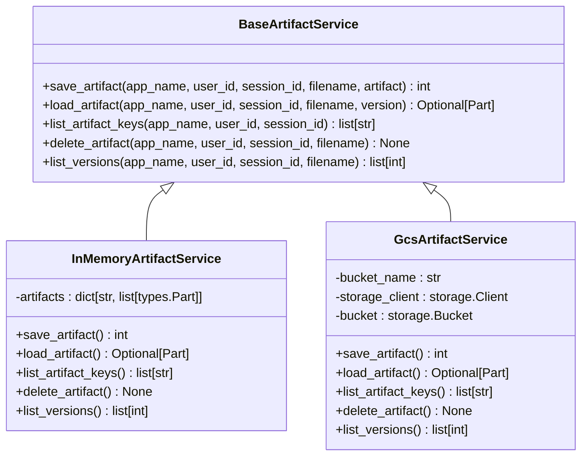
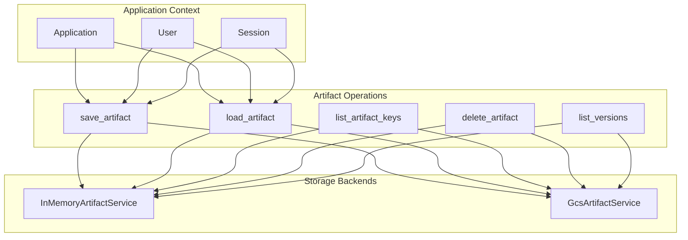
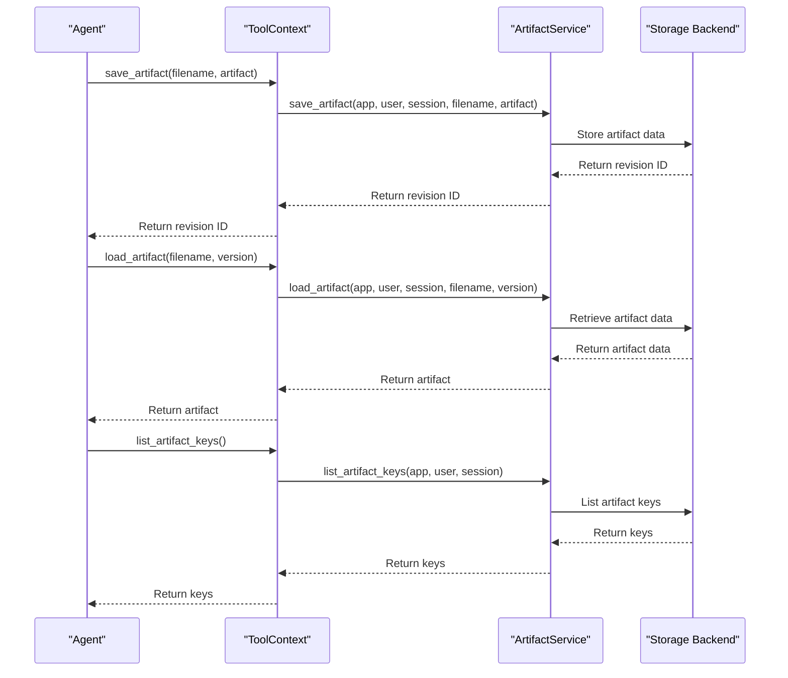
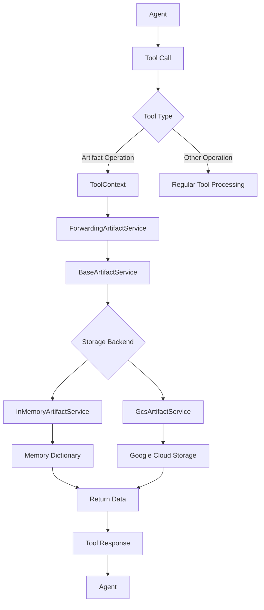
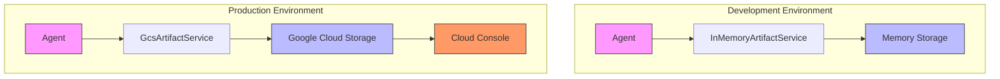

# Artifact Management

<cite>
**Referenced Files in This Document**   
- [base_artifact_service.py](file://src/google/adk/artifacts/base_artifact_service.py)
- [in_memory_artifact_service.py](file://src/google/adk/artifacts/in_memory_artifact_service.py)
- [gcs_artifact_service.py](file://src/google/adk/artifacts/gcs_artifact_service.py)
- [agent.py](file://contributing/samples/artifact_save_text/agent.py)
- [load_artifacts_tool.py](file://src/google/adk/tools/load_artifacts_tool.py)
- [tool_context.py](file://src/google/adk/tools/tool_context.py)
- [invocation_context.py](file://src/google/adk/agents/invocation_context.py)
</cite>

## Table of Contents
1. [Introduction](#introduction)
2. [Core Concepts](#core-concepts)
3. [Storage Implementations](#storage-implementations)
4. [Artifact Operations](#artifact-operations)
5. [Integration with Tools](#integration-with-tools)
6. [Configuration and Deployment](#configuration-and-deployment)
7. [Security Considerations](#security-considerations)
8. [Best Practices](#best-practices)

## Introduction

The Artifact Management system in the ADK framework provides a first-class concept for handling non-textual data within agent workflows. Artifacts serve as a unified interface for managing files, images, and other binary data that agents need to process, store, and retrieve during conversations. This system enables agents to work with rich media content, maintain state across interactions, and build complex workflows that involve file manipulation.

The artifact system is designed with flexibility in mind, supporting both in-memory storage for development and testing scenarios, as well as Google Cloud Storage (GCS) integration for production deployments. This dual approach allows developers to iterate quickly during development while ensuring scalability and persistence in production environments.

Artifacts are tightly integrated with other components of the ADK framework, including tools, memory systems, and agent workflows. They provide a standardized way to handle file operations across different agents and use cases, abstracting away the underlying storage mechanisms and providing a consistent API for developers.

**Section sources**
- [base_artifact_service.py](file://src/google/adk/artifacts/base_artifact_service.py#L23-L124)

## Core Concepts

The artifact system in ADK is built around several core concepts that define how non-textual data is managed within agent workflows. At the foundation is the `BaseArtifactService` abstract class, which defines the standard interface for all artifact operations. This abstraction allows the framework to support multiple storage backends while providing a consistent API to agents and tools.

Artifacts are identified by a combination of application name, user ID, session ID, and filename, creating a hierarchical namespace that ensures isolation between different users and sessions. Each artifact can have multiple versions, with the revision ID incremented automatically with each save operation. This versioning system enables agents to track changes to files over time and maintain historical states.

A key concept in the artifact system is the distinction between session-scoped and user-scoped artifacts. Session-scoped artifacts are tied to a specific conversation session and are typically used for temporary files or session-specific data. User-scoped artifacts, identified by filenames that start with "user:", persist across sessions and are suitable for user preferences, templates, or other long-lived data.

The system uses the `types.Part` class from the Google GenAI library to represent artifact content, which includes both the binary data and MIME type information. This approach ensures that artifacts maintain their metadata and can be properly interpreted when retrieved.

**Diagram sources**
- [base_artifact_service.py](file://src/google/adk/artifacts/base_artifact_service.py#L23-L124)
- [in_memory_artifact_service.py](file://src/google/adk/artifacts/in_memory_artifact_service.py#L29-L137)
- [gcs_artifact_service.py](file://src/google/adk/artifacts/gcs_artifact_service.py#L38-L287)

**Section sources**
- [base_artifact_service.py](file://src/google/adk/artifacts/base_artifact_service.py#L23-L124)
- [in_memory_artifact_service.py](file://src/google/adk/artifacts/in_memory_artifact_service.py#L29-L137)
- [gcs_artifact_service.py](file://src/google/adk/artifacts/gcs_artifact_service.py#L38-L287)

## Storage Implementations

The ADK framework provides two primary implementations of the artifact service: in-memory storage for development and Google Cloud Storage (GCS) for production deployments. The in-memory implementation, `InMemoryArtifactService`, is designed for testing and development purposes. It stores artifacts in a Python dictionary structure, with artifact paths constructed from the application name, user ID, session ID, and filename. This implementation is not suitable for multi-threaded production environments but provides a lightweight option for local development and testing.

For production deployments, the `GcsArtifactService` integrates with Google Cloud Storage, providing durable, scalable, and globally accessible storage for artifacts. This implementation uses a hierarchical blob naming convention that mirrors the logical structure of the artifact system. For user-scoped artifacts (filenames starting with "user:"), the blob name follows the pattern `{app_name}/{user_id}/user/{filename}/{version}`. For session-scoped artifacts, the pattern is `{app_name}/{user_id}/{session_id}/{filename}/{version}`.

The GCS implementation handles asynchronous operations by using `asyncio.to_thread` to offload blocking I/O operations to thread pools, ensuring that the main event loop remains responsive. It also includes comprehensive error handling for common GCS operations such as blob creation, reading, and deletion. The service automatically manages versioning by querying existing blobs to determine the next revision ID when saving new artifacts.

Both implementations support the full set of artifact operations, including saving, loading, listing, deleting, and version management. The choice of storage backend can be configured at the application level, allowing developers to switch between implementations based on the deployment environment without changing their agent code.

**Diagram sources**
- [in_memory_artifact_service.py](file://src/google/adk/artifacts/in_memory_artifact_service.py#L29-L137)
- [gcs_artifact_service.py](file://src/google/adk/artifacts/gcs_artifact_service.py#L38-L287)

**Section sources**
- [in_memory_artifact_service.py](file://src/google/adk/artifacts/in_memory_artifact_service.py#L29-L137)
- [gcs_artifact_service.py](file://src/google/adk/artifacts/gcs_artifact_service.py#L38-L287)

## Artifact Operations

The artifact system provides a comprehensive set of operations for managing non-textual data within agent workflows. The primary operation is `save_artifact`, which stores a new version of an artifact identified by application name, user ID, session ID, and filename. This method returns a revision ID, starting from 0 for the first version and incrementing with each subsequent save. The `load_artifact` method retrieves an artifact, with the option to specify a particular version or retrieve the latest version by default.

The `list_artifact_keys` operation returns all filenames within a specific session, enabling agents to discover what artifacts are available for processing. This is particularly useful for agents that need to process multiple files or maintain an inventory of session data. The `delete_artifact` method removes an artifact and all its versions from storage, freeing up space and maintaining data hygiene.

Version management is a key feature of the artifact system, with the `list_versions` method returning all available revision IDs for a specific artifact. This allows agents to implement sophisticated version control workflows, such as comparing different versions of a document or rolling back to a previous state. The versioning system is implemented consistently across both storage backends, ensuring that agents can rely on predictable behavior regardless of the deployment environment.

All operations are implemented asynchronously to support non-blocking I/O, which is essential for maintaining responsive agent interactions. The methods use keyword-only parameters to ensure clarity and prevent errors from incorrect argument ordering. Error handling is comprehensive, with methods returning `None` when artifacts are not found rather than raising exceptions, allowing agents to handle missing data gracefully.

**Diagram sources**
- [base_artifact_service.py](file://src/google/adk/artifacts/base_artifact_service.py#L23-L124)
- [tool_context.py](file://src/google/adk/tools/tool_context.py#L31-L81)

**Section sources**
- [base_artifact_service.py](file://src/google/adk/artifacts/base_artifact_service.py#L23-L124)
- [in_memory_artifact_service.py](file://src/google/adk/artifacts/in_memory_artifact_service.py#L68-L137)
- [gcs_artifact_service.py](file://src/google/adk/artifacts/gcs_artifact_service.py#L53-L287)

## Integration with Tools

Artifacts are deeply integrated with the tool system in ADK, enabling seamless interaction between agents and file-based operations. The `ForwardingArtifactService` class acts as a bridge between the artifact service and tool context, allowing tools to access artifact functionality through the `ToolContext` interface. This design pattern ensures that tools can save and load artifacts without needing direct access to the underlying storage implementation.

The `load_artifacts_tool.py` file demonstrates a practical implementation of artifact integration, providing a tool that can load specified artifacts and add them to the conversation context. This tool uses function calling to request specific artifacts from the model, then automatically appends the artifact content to the LLM request when the function is invoked. This approach enables agents to work with file content without requiring explicit programming for each file type.

Tools can save artifacts by calling `tool_context.save_artifact()`, which internally uses the configured artifact service. Similarly, they can load artifacts with `tool_context.load_artifact()` and list available artifacts with `tool_context.list_artifacts()`. This abstraction allows tools to be storage-agnostic, working identically whether the backend is in-memory or GCS.

The integration is facilitated by the `InvocationContext`, which holds a reference to the configured artifact service and makes it available to all components within the agent workflow. When a tool needs to perform artifact operations, it accesses the service through the tool context, which routes the requests to the appropriate backend implementation.

**Diagram sources**
- [tool_context.py](file://src/google/adk/tools/tool_context.py#L31-L81)
- [_forwarding_artifact_service.py](file://src/google/adk/tools/_forwarding_artifact_service.py#L29-L97)
- [load_artifacts_tool.py](file://src/google/adk/tools/load_artifacts_tool.py#L31-L114)

**Section sources**
- [tool_context.py](file://src/google/adk/tools/tool_context.py#L31-L81)
- [_forwarding_artifact_service.py](file://src/google/adk/tools/_forwarding_artifact_service.py#L29-L97)
- [load_artifacts_tool.py](file://src/google/adk/tools/load_artifacts_tool.py#L31-L114)
- [invocation_context.py](file://src/google/adk/agents/invocation_context.py#L138-L159)

## Configuration and Deployment

Configuring the artifact system in ADK involves selecting the appropriate storage backend based on the deployment environment. For development and testing, the in-memory artifact service can be used without any additional configuration. This implementation is automatically available and requires no external dependencies, making it ideal for local development and unit testing.

For production deployments, the GCS artifact service must be configured with a valid bucket name and appropriate authentication credentials. The `GcsArtifactService` constructor accepts the bucket name as a required parameter and additional keyword arguments that are passed to the Google Cloud Storage client. This allows for customization of the client configuration, such as specifying a particular project ID or authentication method.

The artifact service is integrated into the agent system through the `InvocationContext`, which holds a reference to the configured service. When creating agents or runners, developers can specify which artifact service to use, allowing for flexible configuration based on environment variables or deployment profiles.

Best practices for deployment include using environment-specific configuration to switch between storage backends, implementing proper error handling for GCS operations, and monitoring storage usage and costs. For GCS deployments, it's recommended to enable lifecycle policies to automatically manage the retention of artifact versions and control storage costs.

**Diagram sources**
- [gcs_artifact_service.py](file://src/google/adk/artifacts/gcs_artifact_service.py#L41-L52)
- [invocation_context.py](file://src/google/adk/agents/invocation_context.py#L138-L143)

**Section sources**
- [gcs_artifact_service.py](file://src/google/adk/artifacts/gcs_artifact_service.py#L41-L52)
- [invocation_context.py](file://src/google/adk/agents/invocation_context.py#L138-L143)

## Security Considerations

Security is a critical aspect of artifact management, particularly when handling user-uploaded files. The artifact system implements several security measures to protect against common vulnerabilities. The hierarchical namespace (application/user/session) ensures proper isolation between different users and applications, preventing unauthorized access to artifacts.

For user-uploaded files, it's essential to implement proper validation and sanitization before storing them as artifacts. This includes verifying file types, scanning for malware, and validating file contents against expected formats. The system should also enforce appropriate access controls, ensuring that users can only access their own artifacts and that sensitive data is properly protected.

When using GCS as the storage backend, additional security considerations include configuring appropriate bucket permissions, enabling encryption at rest, and implementing access logging. It's recommended to use service accounts with the minimum required permissions rather than broad access credentials.

The artifact system should also implement rate limiting and quota management to prevent abuse, particularly in multi-tenant environments. For sensitive applications, consider implementing additional encryption for artifact data, either at the application level before storage or through GCS's customer-supplied encryption keys.

**Section sources**
- [base_artifact_service.py](file://src/google/adk/artifacts/base_artifact_service.py#L23-L124)
- [gcs_artifact_service.py](file://src/google/adk/artifacts/gcs_artifact_service.py#L38-L287)

## Best Practices

When working with artifacts in the ADK framework, several best practices can help ensure efficient and reliable operation. For development, use the in-memory artifact service to enable rapid iteration and testing without external dependencies. For production, leverage GCS with appropriate lifecycle policies to manage storage costs and ensure data durability.

Structure artifact filenames thoughtfully, using descriptive names and consistent naming conventions. For session-specific data, use regular filenames, while user-persistent data should use the "user:" namespace prefix. Implement proper error handling around artifact operations, as network issues or storage limitations can occur, particularly with GCS.

Monitor artifact usage patterns to identify opportunities for optimization, such as compressing large files before storage or implementing caching for frequently accessed artifacts. Consider the performance implications of artifact operations, as large file transfers can impact agent response times.

When designing agents that use artifacts, follow the principle of least privilege, ensuring that tools only have access to the artifacts they need. Implement proper cleanup procedures to delete temporary artifacts when they are no longer needed, preventing storage bloat.

Finally, document the artifact usage patterns in your agents, including expected file types, size limits, and retention policies. This documentation helps maintain consistency across development teams and ensures that all stakeholders understand how artifacts are used within the system.

**Section sources**
- [in_memory_artifact_service.py](file://src/google/adk/artifacts/in_memory_artifact_service.py#L30-L34)
- [gcs_artifact_service.py](file://src/google/adk/artifacts/gcs_artifact_service.py#L15-L22)